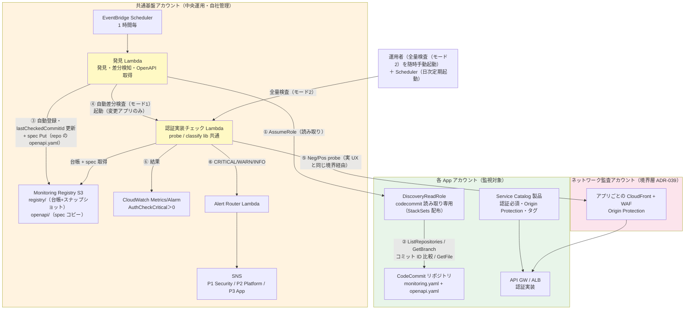
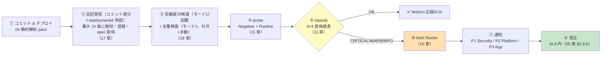
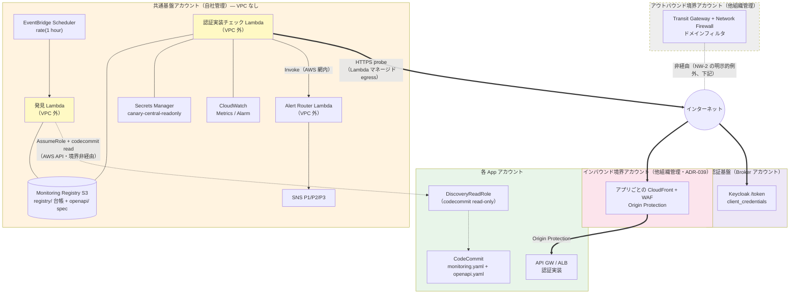
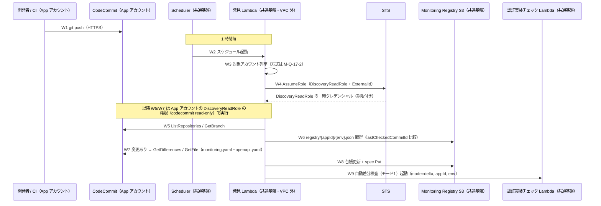
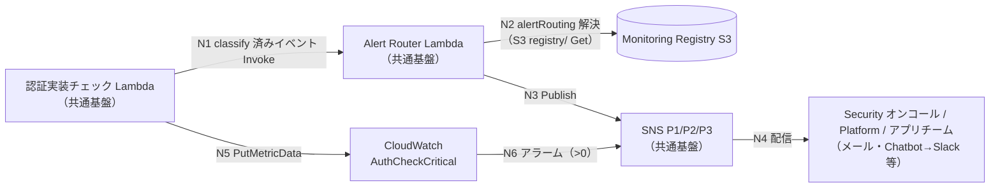
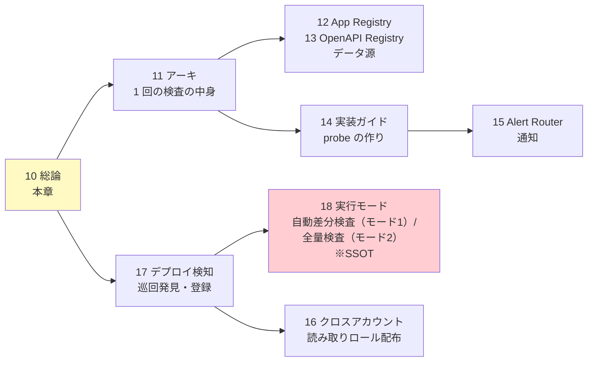

# 10. 認証外形監視 総論

前提: [00-basic-design-plan.md](00-basic-design-plan.md) BD-P-01〜08
実装: [code-samples/](code-samples/) / 根拠: [ADR-059](../../adr/059-central-auth-check-canary-architecture.md) / [§C-API-6 §C-6.6.8](../proposal/common/06-external-api-auth-architecture.md)
対象読者: 共通基盤チーム / Platform チーム / アプリチーム / セキュリティ責任者

---

## §10.0 前提と背景

### §10.0.1 この設計書群（章 10-18）で定めること

「アプリチームに認証を実装させたうえで、**その実装漏れを中央で継続検知する**」仕組み ＝ **認証実装確認処理**（ADR-059 では "Central Auth Check Canary" の名称）の詳細設計。ガイドライン章（01-06）が「アプリチームが守るルール」を定めるのに対し、本章群は **共通基盤チームが運用する中央機構**を定める。

### §10.0.2 なぜ外形監視が要るか

静的解析（04 章）や Config Rules は「設定・コードの検査」であり、**実際に稼働中の API が未認証リクエストを弾いているか**は保証できない。外形監視（実トラフィックで probe する Behavioral 検知 = [§C-6.6 の L5](../proposal/common/06-external-api-auth-architecture.md)）が最後の砦になる。検知 5 レイヤーの中で **L5 は「実装方式を問わず 95-99% 担保」できる唯一の層**。

### §10.0.3 スコープ

| 対象 | 本章群で扱う |
|---|---|
| 認証実装チェック（Lambda / 検査ロジック probe lib）| ✅ 11 / 14 章 |
| App Registry（S3 台帳）| ✅ 12 章 |
| OpenAPI Registry（S3・台帳と同一バケット）| ✅ 13 章 |
| Alert Router（4×4 → SNS）| ✅ 15 章 |
| クロスアカウント IAM / 配布 | ✅ 16 章 |
| 静的解析 / Config Rules | ❌ 04 章・§FR-API-7（別領域）|

### §10.0.4 用語（英語のまま使う語の意味）

| 用語 | 意味 |
|---|---|
| **probe（プローブ）** | 原義は「探針」。本設計では「**実際に HTTP リクエストを送り、応答で認証の効き具合を確かめる検査**」を指す。設定を読むのではなく、実物に触って確かめるのが特徴 |
| **Negative probe（未認証検査）** | 認証情報**なし**でリクエスト → 401/403（Cookie 系は 302）が返れば正常。**2xx が返れば認証漏れ** |
| **Positive probe（正規検査）** | **有効なトークン付き**でリクエスト → 200 が返れば API 稼働とテスト健全性を確認。Negative との組合せで誤検知を防ぐ（11 章 §11.2）|
| **probe lib（検査ロジック）** | 上記の検査を実装した共通ライブラリ（[central-probe-lib/](code-samples/central-probe-lib/)）。認証実装チェック Lambda が実行する |
| **Pattern β** | 検査を各アプリに配らず**中央 1 箇所**から横断実行する方式（§10.1）|
| **自動差分検査（モード1）/ 全量検査（モード2）** | 実行モード（2 つだけ）。自動差分検査（モード1、旧称 M1）=1 時間毎の巡回で変化アプリのみ自動検査 / 全量検査（モード2、旧称 M3「手動全量検査」）=全アプリ全 endpoint を**日次定期 + 随時手動**で検査（17/18 章。heartbeat 型の旧 M2 は廃止 2026-08-20）|
| **STS / AssumeRole** | AWS Security Token Service =「**一時的な認証情報の発行所**」。AssumeRole で他アカウントのロール（例: DiscoveryReadRole）を引き受け、**期限付き・最小権限の一時キー**を得る。恒久キーを配らずにクロスアカウント読み取りを実現する標準手段（16 §16.2、§10.1.7 W4）|

---

## §10.1 採用アーキテクチャ：Pattern β（中央集約）

### §10.1.1 Pattern β とは

probe を**各アプリに配らず、共通基盤アカウントの認証実装確認処理（Lambda）が全アプリを横断監視**する（[ADR-059](../../adr/059-central-auth-check-canary-architecture.md)）。

> **アカウント配置の分離**: 認証実装確認処理のリソース群（App Registry / OpenAPI Registry / 認証実装チェック Lambda / Alert Router / Secrets）は **共通基盤アカウント（自社管理）** に置く。インターネット境界（CloudFront + WAF、[ADR-039](../../adr/039-centralized-network-account-edge-layer.md)）は **ネットワーク監査アカウント**（他組織管理の可能性あり）のままで、probe はその境界越しに実ユーザーと同じ経路で検査する（16 章 §16.5）。

```mermaid
flowchart TB
    subgraph Central["共通基盤アカウント（中央運用・自社管理）"]
        DISC[発見 Lambda<br/>1 時間毎巡回 ※17 章]
        Reg[Monitoring Registry S3<br/>台帳 registry/ + spec openapi/]
        CC["認証実装確認処理<br/>Lambda（probe lib 共通）<br/>自動差分検査（モード1）/全量検査（モード2） ※18 章"]
        AR[Alert Router<br/>Lambda]
        SNS[SNS<br/>P1 Security / P2 Platform / P3 App]
    end

    subgraph Edge["ネットワーク監査アカウント（境界層 ADR-039・他組織管理の可能性）"]
        CFA[CloudFront + WAF<br/>アプリ A 用]
        CFB[CloudFront + WAF<br/>アプリ B 用]
    end

    subgraph AppA["App アカウント A"]
        REPOA[CodeCommit<br/>monitoring.yaml + openapi.yaml]
        APIA[API GW / ALB<br/>認証実装]
    end

    subgraph AppB["App アカウント B"]
        REPOB[CodeCommit]
        APIB[API GW / ALB<br/>認証実装]
    end

    DISC -.->|"読み取り AssumeRole：<br/>コミット差分＋deploymentId 併読・<br/>monitoring.yaml・spec 取得"| REPOA
    DISC -.->|"同"| REPOB
    DISC -->|自動登録・スナップショット・spec Put| Reg
    DISC -->|変化あり → 自動差分検査（モード1）起動| CC

    CC -->|台帳 List/Get + spec Get<br/>（自動差分検査(モード1)は対象のみ/全量検査(モード2)は全量）| Reg
    CC -->|probe は実 UX と同じ境界経由| CFA
    CFA --> APIA
    CC --> CFB
    CFB --> APIB
    CC -->|CRITICAL/WARN/INFO| AR
    AR --> SNS

    style Central fill:#fff3e0
    style Edge fill:#fce4ec
    style AppA fill:#e8f5e9
    style AppB fill:#e8f5e9
    style DISC fill:#fff9c4
```

- **境界（CloudFront + WAF）はネットワーク監査アカウント**にあり、probe はそこを実ユーザーと同じ経路で通る（§冒頭の配置分離のとおり）
- **巡回の読み取り（発見 Lambda → CodeCommit / API GW）は境界を通らない**（AWS API を読み取りロールで直接呼ぶ、16 章）。変更検知は**コミット差分（git 主）＋ deploymentId 併読**（[ADR-061 追記 2026-08-19](../../adr/061-deploy-detection-pull-model.md)）で、コンソール直変更はデプロイ反映時に deploymentId 側で検知。残る死角（未デプロイ編集・ALB 直）は L2 Config Rules + 全量検査（モード2、日次定期）が補完（17 章 §17.2.2）

> **実行モデル（[18 章](18-scan-modes-and-scheduling.md) が SSOT）**: 実行基盤は **Lambda**、モードは **自動差分検査（モード1、1 時間毎の巡回で変化アプリのみ）+ 全量検査（モード2、日次定期＋随時手動）** の 2 つ。CloudWatch Synthetics は不使用（heartbeat 型〔旧 M2、廃止〕を将来復活させる場合のオプション）。経緯は [ADR-059](../../adr/059-central-auth-check-canary-architecture.md)（Lambda 一本化）/ [ADR-061](../../adr/061-deploy-detection-pull-model.md)（pull 巡回統一）。

### §10.1.2 なぜ β（中央）か — α（分散）との比較

| 観点 | α: 各アプリ配置 | **β: 中央集約（採用）** |
|---|:---:|:---:|
| Deploy 漏れ | ⚠ 個別 deploy 必要、漏れリスク | ✅ **中央巡回が発見する側なので原理的にゼロ**（[ADR-061](../../adr/061-deploy-detection-pull-model.md)）|
| 統一実装保証 | ⚠ アプリごとにばらつく | ✅ 認証実装確認処理 1 実装 |
| 運用主体 | 各アプリチーム | 共通基盤チーム集約 |
| メトリクス集約 | ⚠ クロスアカウント集約が別途必要 | ✅ 標準で 1 箇所 |
| 「中央でチェック」思想 | ✗ | ✅ **一致** |
| Blast radius | ✅ アプリ単位 | ⚠ Central 障害で全断（Multilocation で緩和）|

→ **「各アプリ実装を中央でチェックする」という要件目的に対し β が構造的に正解**。α の Deploy 漏れ防止に必要な SCP / Config / Dashboard の 3 段防御（[ADR-059 §F](../../adr/059-central-auth-check-canary-architecture.md)）が β では不要になる。

### §10.1.3 統合構成図（登録・トリガー・検査・通知）

§10.1.1 は「どこに何があるか」の骨格。ここでは **巡回発見（17 章）→ 登録（12/13 章）→ トリガー（18 章）→ probe/classify（11 章）→ 通知（15 章）** までを 1 枚に統合する。各コンポーネントの詳細は該当章が SSOT。



> §10.1.1 との違い: こちらは **巡回の番号付きステップ（①〜⑥、17 章）と classify・Alarm（11 章）・通知（15 章）を明示**した完全版。登録・OpenAPI 取得は**すべて中央の pull（CodeCommit のコミット差分＋deploymentId 併読・[ADR-061 追記 2026-08-19](../../adr/061-deploy-detection-pull-model.md)）**で、アプリ側に登録処理はない。**2 本の経路が別物**であることに注意：巡回の読み取り（①②＝CodeCommit / API GW）は AWS API を直接呼び境界を通らない。probe（⑤）は実ユーザーと同じく境界（ネットワーク監査アカウントの CloudFront）を通る。

### §10.1.4 エンドツーエンド フロー（deploy → 検知 → 通知 → 是正）

1 つの API が「世に出てから認証漏れが通知・是正されるまで」の縦断フロー。章をまたぐ流れを 1 本で示す。



> **静的解析（①の 04 章）をすり抜けた認証漏れを、稼働後に④〜⑧で捕捉する**のが本機構の存在意義（具体例は [11 章 §11.8](11-central-probe-architecture.md) の 4 ケース）。①〜③はライフサイクル、④〜⑤の 1 実行内の詳細は [11 章 §11.1](11-central-probe-architecture.md) のシーケンス図。

---

### §10.1.5 構成リソース一覧（何が・どこで・何をするか）

図に登場する全リソースの役割を 1 表にまとめる。詳細は「詳細章」列が SSOT。

**共通基盤アカウント（中央）側**

| リソース | AWS サービス | 役割（ひとことで） | 詳細章 |
|---|---|---|:---:|
| **EventBridge Scheduler** | EventBridge | **定期起動の起点（2 本）**。① 1 時間毎に発見 Lambda を起動（巡回）② 日次に認証実装チェック Lambda を `mode=full` で起動（全量検査（モード2）の定期実行、18 §18.3）| 17 / 18 |
| **発見 Lambda** | Lambda | **変更検知と登録の実行体（pull）**。各 App アカウントの **CodeCommit を読み取り巡回**し、リポジトリ発見・**コミット差分（lastCheckedCommitId 比較）＋ API GW deploymentId 併読（手動変更のデプロイ反映検知）**・台帳登録・spec 取得を行い、変更のあったアプリの検査を起動する | 17 |
| **Monitoring Registry** | **S3（Versioning）×1 バケット** | **台帳 + spec コピーの一体ストア**（DynamoDB は不使用、ADR-061 追記）。`registry/{appId}/{env}.json` = 監視対象の台帳＋巡回スナップショット（baseUrl / authPattern / 通知先 / **前回確認コミット ID**。設定値は monitoring.yaml 由来、書き手は発見 Lambda）。`openapi/…` = リポジトリ内 openapi.yaml（正本）のコピーで、endpoint 一覧と公開印（MON-1）の情報源 | 12 / 13 |
| **認証実装チェック Lambda（認証実装確認処理）** | Lambda | **検査の実行体**。台帳と仕様を読み、各 endpoint に未認証/正規の 2 種リクエストを送って認証の効き具合を確かめる | 11 / 14 |
| **CloudWatch Metrics / アラーム** | CloudWatch | **検査結果の記録と発報**。`AuthCheckCritical > 0` で認証漏れアラーム | 11 / 18 |
| **Alert Router Lambda** | Lambda | **通知の振り分け役**。検知結果を 4×4 分類に従い P1/P2/P3 の宛先へ振り分ける（「全部 Security 行き」を防ぐ）| 15 |
| **SNS（P1 / P2 / P3）** | SNS | **通知の出口**。P1=Security 即時 / P2=Platform 24h / P3=アプリチーム | 15 |
| **Secrets Manager** | Secrets Manager | **正規検査用の資格情報**（canary-central-readonly）。実行ごとに短命トークンを発行（漏洩耐性は §11.3.1）| 11 |

**各 App アカウント側**

| リソース | AWS サービス | 役割（ひとことで） | 詳細章 |
|---|---|---|:---:|
| **Service Catalog 製品** | Service Catalog | **正規デプロイの型**。認証必須・Origin Protection・タグ付与を全部込みで提供（アプリはパラメータを選ぶだけ。登録処理は含まない＝中央が発見する）| 17 §17.1 |
| **CodeCommit リポジトリ** | CodeCommit | **変更検知とメタデータの源**。monitoring.yaml（監視宣言）+ openapi.yaml（spec 正本）を置く。コミット差分が自動差分検査（モード1）の主トリガー（API GW deploymentId を併読して手動変更のデプロイ反映も検知）| 17 §17.2-3 |
| **DiscoveryReadRole** | IAM ロール（StackSets 配布）| **中央からの読み取り窓口**。発見 Lambda だけが AssumeRole でき、codecommit read のみ | 16 §16.2 |
| **API GW / ALB** | — | **検査の対象**（アプリの認証実装そのもの）。probe が実際に叩く | 11 |

**ネットワーク監査アカウント側（境界、他組織管理の可能性）**

| リソース | AWS サービス | 役割（ひとことで） | 詳細章 |
|---|---|---|:---:|
| **アプリごとの CloudFront + WAF** | CloudFront / WAF | **インターネット境界（Origin Protection）**。probe は実ユーザーと同じくここを経由して検査する（境界を破らない）| [ADR-039](../../adr/039-centralized-network-account-edge-layer.md) / 12 §12.1.1 |

> **1 行まとめ**: アプリがリポジトリに **monitoring.yaml を置いてコミット**すると、**中央の発見 Lambda が 1 時間毎の巡回（コミット差分）で見つけて台帳・仕様を自動登録**し、変更のあったアプリ（自動差分検査（モード1））と日次・監査時の全量（全量検査（モード2））に**認証実装チェック Lambda が実際にリクエストを投げて認証漏れを検査**、問題があれば **4×4 分類で適切なチームに通知**される。アプリ側に登録処理はない（モノリスも同じ）。

---

### §10.1.6 AWS リソース構成図（アカウント横断・イン/アウト境界含む）

§10.1.3 の論理構成を、**AWS リソース単位 + 通信経路（インバウンド/アウトバウンド境界アカウント込み）** で示す。前提: 組織のインターネット境界は他組織管理（In: CloudFront+WAF / Out: Network Firewall ドメインフィルタ、[05 章 §5.1](05-security.md)）。

**Lambda 3 本はすべて VPC 外（Lambda マネージド網）に配置**する。VPC / VPC Endpoint 群 / TGW Attachment / NAT が**一切不要**になり、構成が大幅に簡素化される。代償として probe の外向き HTTPS が**アウトバウンド境界（NWFW）を通らない**——これは NW-2 の**明示的な例外**として受容し、代償統制で補う（下記）。



**通信経路一覧（何が・どこを通るか）**

| # | 経路 | 中身 | 通る境界 | 必要な許可 |
|---|---|---|---|---|
| A | **probe → アプリ**（Negative/Positive）| HTTPS 443（実 UX と同一）| Lambda マネージド egress → インターネット → **CloudFront+WAF（In）** → API GW。**Out（NWFW）は非経由（例外）** | なし（宛先は台帳の baseUrl のみ、下記代償統制）|
| B | **probe → 認証基盤 /token**（Positive 用短命トークン）| HTTPS 443 | 同上（Out 非経由）| 同上（宛先は認証基盤ドメイン固定）|
| C | **巡回読み取り**（発見 Lambda → App アカウントの CodeCommit）| AWS API（STS AssumeRole → codecommit `GetBranch`/`GetDifferences`/`GetFile`）| **境界非経由**（AWS 網）| DiscoveryReadRole（16 章）|
| D | 中央内部（台帳/仕様/Secrets/Metrics/通知）| S3（Monitoring Registry）/ Secrets / CloudWatch / SNS / Lambda Invoke | **境界非経由**（AWS 網。VPC Endpoint 不要）| IAM のみ |

**VPC 外配置の判断（NW-2 例外の明示受容と代償統制）**:

| 観点 | 内容 |
|---|---|
| 得られる簡素化 | VPC / サブネット / ENI 管理・**Interface VPC Endpoint 群**・**TGW Attachment**・NAT 依存・NWFW への許可ドメイン申請（アプリ追加のたび）が**すべて不要** |
| 例外の内容 | [05 章 NW-2](05-security.md)「Outbound は NWFW ドメインフィルタ経由」の例外となる（監視系の外向き HTTPS が組織の Egress 統制を通らない）|
| 例外が許容できる理由 | ① 宛先が**固定 3 種のみ**（台帳の baseUrl = 自組織の CloudFront／認証基盤 /token／AWS API）で、**任意の外部 SaaS を呼ぶコードパスが存在しない** ② コードは共通基盤チーム管理・CI 静的解析（04 章）対象で、アプリ任意コードが乗らない ③ 漏洩リスク側は §11.3.1（短命トークン）で別途統制済み |
| 代償統制 | **宛先 allowlist をコードで強制**（probe の接続先は App Registry の `baseUrl` と設定済み token URL のみ。任意 URL を受け取る口を作らない）+ IAM 最小権限 + CloudTrail / Lambda ログで監査 |
| 承認 | NW-2 の例外として**セキュリティ / 他組織（境界管理側）への明示的な承認を得る**（M-Q-10-3）|

- 経路 A は**インバウンド境界（CloudFront+WAF）を実ユーザーと同じ向きで通過**する（Origin Protection を破らない検査、12 §12.1.1）。**In 側はバイパスしない**
- 経路 C/D は AWS API・AWS 網内であり、インターネット境界（In/Out とも）は**無関係**

> ⚠ **Phase 2（Private API の probe、14 章 §14.4）では認証実装チェック Lambda のみ VPC 化が必要**になる（VPC + TGW で Internal ALB へ到達）。その時点で経路 A の Out 統制接続も再検討する。発見 Lambda と Alert Router は Phase 2 でも VPC 外のまま。

---

### §10.1.7 詳細通信フロー（構成図作成用：アカウント × リソース × 経由エンドポイント）

§10.1.6 の経路 A〜D を、**構成図に矢印を引ける粒度**（ステップごとの発信元 / 宛先 / 経由エンドポイント / 認証）まで分解する。リージョンは例として `ap-northeast-1`。VPC 外 Lambda の通信は **AWS API 宛 = AWS 網内**、**インターネット宛（probe / token）= Lambda マネージド egress から直接**（Out 境界非経由、§10.1.6 の例外）。

#### F1. git 連携フロー（開発者 push → 巡回検知 → 自動差分検査（モード1）起動）



| # | 通信 | 発信元（アカウント / リソース）| 宛先（アカウント / リソース）| 経由・エンドポイント | プロトコル・認証 |
|---|---|---|---|---|---|
| W1 | git push | App / 開発者端末・CI（CodeBuild 等）| App / CodeCommit リポジトリ | `git-codecommit.ap-northeast-1.amazonaws.com`（git HTTPS）| 443、IAM 認証（git-remote-codecommit / HTTPS Git 認証情報）|
| W2 | 定期起動 | 共通基盤 / EventBridge Scheduler | 共通基盤 / 発見 Lambda | AWS サービス間（Scheduler → `lambda.ap-northeast-1.amazonaws.com`）| Scheduler 実行ロールで Invoke |
| W3 | 対象アカウント列挙 | 共通基盤 / 発見 Lambda | 方式未確定（**M-Q-17-2**）| ⚠ `organizations:ListAccounts` は既定では管理アカウント限定 → **案 c（推奨）: Organizations 委任ポリシーで共通基盤に ListAccounts を委任し直接呼ぶ**（`organizations.us-east-1.amazonaws.com`、グローバル）/ 案 a: 管理アカウントの列挙用ロールへ AssumeRole / 案 b: 静的リスト（SSM）| 443、IAM |
| W4 | AssumeRole | 共通基盤 / 発見 Lambda（DiscoveryLambdaRole）| App / **DiscoveryReadRole** | `sts.ap-northeast-1.amazonaws.com`（リージョナル STS）| 443、sts:AssumeRole + ExternalId（16 §16.2）|
| W5 | リポジトリ列挙・先端取得 | 共通基盤 / 発見 Lambda（DiscoveryReadRole の一時クレデンシャル）| App / CodeCommit（コントロールプレーン）| `codecommit.ap-northeast-1.amazonaws.com` | 443、`ListRepositories` / `GetBranch` |
| W5' | deploymentId 併読 | 同上 | App / API GW（コントロールプレーン）| `apigateway.ap-northeast-1.amazonaws.com` | 443、`apigateway:GET`（stage の deploymentId。手動変更のデプロイ反映検知、ADR-061 追記 2026-08-19）|
| W6 | 台帳読取 | 共通基盤 / 発見 Lambda | 共通基盤 / Monitoring Registry S3 `registry/` | `s3.ap-northeast-1.amazonaws.com` | 443、`GetObject`（同一アカウント IAM）|
| W7 | 差分・ファイル取得 | 共通基盤 / 発見 Lambda | App / CodeCommit | `codecommit.ap-northeast-1.amazonaws.com` | 443、`GetDifferences` / `GetFile` |
| W8 | 台帳更新 + spec 配置 | 共通基盤 / 発見 Lambda | 共通基盤 / Monitoring Registry S3（`registry/` + `openapi/`）| `s3.ap-northeast-1.amazonaws.com` | 443、`PutObject` |
| W9 | 自動差分検査（モード1）起動 | 共通基盤 / 発見 Lambda | 共通基盤 / 認証実装チェック Lambda | `lambda.ap-northeast-1.amazonaws.com` | 443、`lambda:InvokeFunction` |

> **構成図のポイント**: W1 は App アカウント内で完結（開発者 → repo）。W4/W5/W7 だけが**アカウント跨ぎ（共通基盤 → App）**で、すべて AWS API（境界 In/Out とも非経由）。

#### F2. 検査（probe）フロー — 自動差分検査（モード1）/全量検査（モード2）の 1 実行

| # | 通信 | 発信元 | 宛先 | 経由・エンドポイント | プロトコル・認証 |
|---|---|---|---|---|---|
| P1 | 台帳・spec 取得 | 共通基盤 / 認証実装チェック Lambda | 共通基盤 / Monitoring Registry S3 | `s3.ap-northeast-1.amazonaws.com`（自動差分検査(モード1)=対象 1 件 Get / 全量検査(モード2)=`registry/` List→Get）| 443、IAM |
| P2 | クライアント資格情報取得 | 同上 | 共通基盤 / Secrets Manager（canary-central-readonly）| `secretsmanager.ap-northeast-1.amazonaws.com` | 443、IAM（+KMS）|
| P3 | 短命トークン取得（Positive 用）| 同上 | **Broker（認証基盤）/ Keycloak 公開 `/token`** | Lambda マネージド egress → **インターネット** → 認証基盤の公開エンドポイント（認証基盤側の境界・経路はそちらの設計に従う）| 443、OAuth client_credentials（11 §11.3.1）|
| P4 | **Negative / Positive probe** | 同上 | **App / API GW・ALB**（ただし直接ではない）| Lambda マネージド egress → **インターネット** → **ネットワーク監査 / アプリごとの CloudFront + WAF** → Origin Protection（`X-Origin-Verify` + prefix list）→ App / API GW（`execute-api` リージョナル）or ALB | 443。Negative=認証ヘッダなし / Positive=Bearer（P3 のトークン）|
| P5 | メトリクス発行 | 同上 | 共通基盤 / CloudWatch Metrics（`APIPlatform/AuthCheck`）| `monitoring.ap-northeast-1.amazonaws.com` | 443、`PutMetricData` |
| P6 | 検知イベント送付（severity≠OK 時）| 同上 | 共通基盤 / Alert Router Lambda | `lambda.ap-northeast-1.amazonaws.com` | 443、`lambda:InvokeFunction` |

> **構成図のポイント**: probe（P4）だけが**インバウンド境界（ネットワーク監査アカウントの CloudFront+WAF）を通る**。P4 の最終宛先は App アカウントだが、**矢印は必ず CloudFront を経由**させて描く（直接 App へ引かない）。P3/P4 はアウトバウンド境界（NWFW）を通らない（明示的例外、§10.1.6）。

#### F3. 発報（アラート）フロー — 2 系統



| # | 通信 | 発信元 | 宛先 | 経由・エンドポイント | 備考 |
|---|---|---|---|---|---|
| N1 | 検知イベント（即時系）| 共通基盤 / 認証実装チェック Lambda | 共通基盤 / Alert Router | `lambda.ap-northeast-1.amazonaws.com` | 4×4 分類済み（README §2.6 形式）|
| N2 | 通知先解決 | 共通基盤 / Alert Router | 共通基盤 / S3 `registry/{appId}/{env}.json` | `s3.ap-northeast-1.amazonaws.com` | `alertRouting` → 無ければ環境変数デフォルト（15 §15.2）|
| N3 | 通知発行 | 共通基盤 / Alert Router | 共通基盤 / SNS トピック P1/P2/P3 | `sns.ap-northeast-1.amazonaws.com` | severity で振り分け（P1=Security 即時 / P2=Platform 24h / P3=App）|
| N4 | 配信 | 共通基盤 / SNS | 各チーム（メール / Amazon Q Developer〔旧 AWS Chatbot、2025-02 改名〕→ Slack 等）| SNS サブスクリプション | 接続方式は M-Q-15-1 |
| N5 | メトリクス（保険系）| 共通基盤 / 認証実装チェック Lambda | 共通基盤 / CloudWatch | `monitoring.ap-northeast-1.amazonaws.com` | P5 と同一 |
| N6 | アラーム発報 | 共通基盤 / CloudWatch アラーム（`AuthCheckCritical > 0`）| 共通基盤 / SNS（P1）| CloudWatch → SNS（サービス間）| **即時系（N1〜N4）が落ちても検知を失わない保険**（11 §11.6 / 18 §18.4）|

> **構成図のポイント**: 発報は**即時系（N1〜N4: Alert Router 経由・アプリ別の宛先解決あり）**と**保険系（N5〜N6: メトリクス→アラーム・宛先固定）**の 2 系統を両方描く。すべて共通基盤アカウント内で完結し、境界・App アカウントは関与しない。

---

## §10.2 実装物ナビ（章 ↔ code-samples 対応）

| 章 | 設計 | 実装（code-samples/）|
|---|---|---|
| 11 | 認証実装チェック アーキテクチャ | [central-probe-lib/](code-samples/central-probe-lib/) |
| 12 | App Registry | [app-registry-lambda/](code-samples/app-registry-lambda/) |
| 13 | OpenAPI Registry | [openapi-export-lambda/](code-samples/openapi-export-lambda/) |
| 14 | 実装ガイド（probe lib / モノリス・Private 対応）| [central-probe-lib/](code-samples/central-probe-lib/) |
| 15 | Alert Router | [alert-router-lambda/](code-samples/alert-router-lambda/) |
| 17 | 巡回発見（発見 Lambda）| **未実装（M-Q-17-4）**。[app-registry-lambda/](code-samples/app-registry-lambda/) / [openapi-export-lambda/](code-samples/openapi-export-lambda/)（旧 push 型参考実装）のロジックを流用予定 |
| 18 | 実行モード（自動差分検査（モード1）/全量検査（モード2））| probe Lambda（central-probe-lib を Lambda handler に転用、README §4）|
| 全 | データ契約 SSOT | [code-samples/README.md](code-samples/README.md) |

> **データ契約の SSOT は [code-samples/README.md](code-samples/README.md)**（App Registry スキーマ / OpenAPI アノテーション / CloudWatch Metrics / 4×4 真偽値表 / authPattern enum / Alert 形式）。本設計書群はその設計意図・判断根拠を説明し、厳密な定義は README を参照する。

---

## §10.3 Phase 4 ローカル検証の到達点

本設計は「机上」でなく**実際に走らせて検証済み**（[research/phase4-local-verification-results.md](research/phase4-local-verification-results.md)）。

| 検証 | 状態 |
|---|:---:|
| 静的解析ルール（cfn-guard 3 + Semgrep 3）| ✅ フィクスチャ検証（**実バグ 2 件修正**）|
| Lambda SDK 実挙動（app-registry PutItem / alert-router SNS Publish）| ✅ LocalStack 3.8.1 |
| probe lib logic（classify / probe / extractEndpoints）| ✅ 27 テスト PASS |
| full orchestration（認証実装チェック Lambda E2E / Positive probe / metrics 着地）| ⏳ SAM local or 実 AWS 要 |

→ **ロジックは検証済み、残るは AWS 環境依存の full-run**（14 章 §14.5 に要 PoC 項目を明記）。

---

## §10.4 読み方



| 知りたいこと | 章 |
|---|---|
| いつ・何をきっかけに検査が走るか | **18（実行モード SSOT）+ 17（巡回発見）** |
| 全体がどう動くか（1 回の検査の中身）| 11 |
| アプリがどう監視対象に載るか | 17（巡回発見）+ 12（台帳）+ 13（OpenAPI）|
| probe の中身・モノリス/Private 対応 | 14 |
| 検知後の通知の流れ | 15 |
| アカウントを跨ぐ権限 | 16 |

---

## §10.5 設計判断

| ID | 判断 | 根拠 |
|---|---|---|
| D-M-10-1 | Pattern β（中央集約）を採用 | Deploy 漏れが構造的にゼロ、「中央でチェック」要件と一致（§10.1.2）|
| D-M-10-2 | データ契約の SSOT は code-samples/README.md、設計書は意図を説明 | 実装と設計の二重管理を避ける |
| D-M-10-3 | 設計は Phase 4 で実行検証してから確定 | 「検証済み事実」を積み上げる方針（BD 品質方針）|
| D-M-10-4 | Lambda 3 本は **VPC 外配置**（VPC/EP/TGW/NAT 不要）。probe の外向き HTTPS は **NW-2（NWFW 経由）の明示的例外**として受容し、宛先 allowlist のコード強制 + 中央管理コード + 監査で代償 | 宛先が固定 3 種のみで任意外部 SaaS を呼ばない監視系に NWFW 経路を組むのは複雑さに見合わない（§10.1.6。例外承認は M-Q-10-3、Phase 2 Private 対応時に probe のみ VPC 化）。In 境界（CloudFront+WAF）は従来どおり実 UX と同じ向きで通過 |

---

## §10.6 未決事項

| ID | 内容 | 章 |
|---|---|---|
| BD-Q-01 | ROSA 側 P-18（監査アカウント他組織管理）確定時の責任分界 | 16 |
| M-Q-10-1 | Central 障害時の Multilocation（DR region replica）採否 | 11 / 14 |
| M-Q-10-2 | full-run（SAM local / 実 AWS）の実施タイミング | 14 |
| M-Q-10-3 | **NW-2 例外（VPC 外 Lambda の Egress が NWFW 非経由）の明示的承認**をセキュリティ / 境界管理の他組織から取得（§10.1.6 の例外理由・代償統制を提示）| 10 / 05 |
