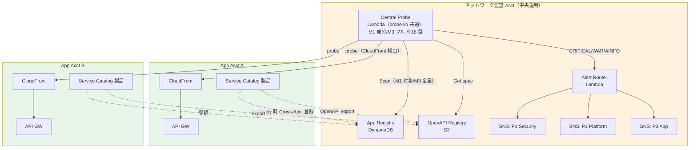
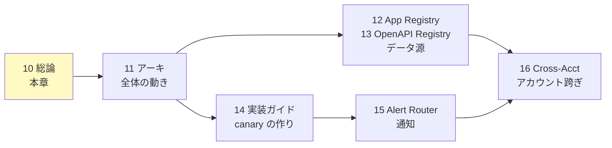

# 10. 認証外形監視 総論

前提: [00-basic-design-plan.md](00-basic-design-plan.md) BD-P-01〜08
実装: [code-samples/](code-samples/) / 根拠: [ADR-059](../../adr/059-central-auth-check-canary-architecture.md) / [§C-API-6 §C-6.6.8](../proposal/common/06-external-api-auth-architecture.md)
対象読者: Network 監査チーム / Platform チーム / アプリチーム / セキュリティ責任者

---

## §10.0 前提と背景

### §10.0.1 この設計書群（章 10-16）で定めること

「アプリチームに認証を実装させたうえで、**その実装漏れを中央で継続検知する**」仕組み（Central Auth Check Canary）の詳細設計。ガイドライン章（01-05）が「アプリチームが守るルール」を定めるのに対し、本章群は **Network 監査チームが運用する中央機構**を定める。

### §10.0.2 なぜ外形監視が要るか

静的解析（04 章）や Config Rules は「設定・コードの検査」であり、**実際に稼働中の API が未認証リクエストを弾いているか**は保証できない。外形監視（実トラフィックで probe する Behavioral 検知 = [§C-6.6 の L5](../proposal/common/06-external-api-auth-architecture.md)）が最後の砦になる。検知 5 レイヤーの中で **L5 は「実装方式を問わず 95-99% 担保」できる唯一の層**。

### §10.0.3 スコープ

| 対象 | 本章群で扱う |
|---|---|
| Central Canary（Puppeteer / Multi Checks）| ✅ 11 / 14 章 |
| App Registry（DynamoDB）| ✅ 12 章 |
| OpenAPI Registry（S3）| ✅ 13 章 |
| Alert Router（4×4 → SNS）| ✅ 15 章 |
| Cross-Account IAM / 配布 | ✅ 16 章 |
| 静的解析 / Config Rules | ❌ 04 章・§FR-API-7（別領域）|

---

## §10.1 採用アーキテクチャ：Pattern β（中央集約）

### §10.1.1 Pattern β とは

canary を**各アプリに配らず、ネットワーク監査 Acct の Central Canary が全アプリを横断監視**する（[ADR-059](../../adr/059-central-auth-check-canary-architecture.md)）。

> ⚠ **実行モデルは [18 章](18-scan-modes-and-scheduling.md) で見直し済み**: 当初の「5 分周期の全量スキャン」は重いため廃止し、**M1 デプロイ差分（自動・変更アプリ単位）+ M3 フル監査（手動・全量）**の 2 モードに再設計。実行基盤も Synthetics canary から **Lambda に一本化**（probe lib は共通流用、Synthetics は将来 M2 用オプション）。図中の Central Probe はこの Lambda を指す。

### §10.1.2 なぜ β（中央）か — α（分散）との比較

| 観点 | α: 各アプリ配置 | **β: 中央集約（採用）** |
|---|:---:|:---:|
| Deploy 漏れ | ⚠ 個別 deploy 必要、漏れリスク | ✅ **App Registry 登録で自動追随、原理的にゼロ** |
| 統一実装保証 | ⚠ アプリごとにばらつく | ✅ Central canary 1 実装 |
| 運用主体 | 各アプリチーム | Network 監査チーム集約 |
| メトリクス集約 | ⚠ Cross-Acct 集約が別途必要 | ✅ 標準で 1 箇所 |
| 「中央でチェック」思想 | ✗ | ✅ **一致** |
| Blast radius | ✅ アプリ単位 | ⚠ Central 障害で全断（Multilocation で緩和）|

→ **「各アプリ実装を中央でチェックする」という要件目的に対し β が構造的に正解**。α の Deploy 漏れ防止に必要な SCP / Config / Dashboard の 3 段防御（[ADR-059 §F](../../adr/059-central-auth-check-canary-architecture.md)）が β では不要になる。

---

## §10.2 実装物ナビ（章 ↔ code-samples 対応）

| 章 | 設計 | 実装（code-samples/）|
|---|---|---|
| 11 | Central Canary アーキテクチャ | [central-canary-puppeteer/](code-samples/central-canary-puppeteer/) |
| 12 | App Registry | [app-registry-lambda/](code-samples/app-registry-lambda/) |
| 13 | OpenAPI Registry | [openapi-export-lambda/](code-samples/openapi-export-lambda/) |
| 14 | 実装ガイド（Multi Checks 併用）| [multi-checks-blueprint/](code-samples/multi-checks-blueprint/) |
| 15 | Alert Router | [alert-router-lambda/](code-samples/alert-router-lambda/) |
| 全 | データ契約 SSOT | [code-samples/README.md](code-samples/README.md) |

> **データ契約の SSOT は [code-samples/README.md](code-samples/README.md)**（App Registry スキーマ / OpenAPI アノテーション / CloudWatch Metrics / 4×4 真偽値表 / authPattern enum / Alert 形式）。本設計書群はその設計意図・判断根拠を説明し、厳密な定義は README を参照する。

---

## §10.3 Phase 4 ローカル検証の到達点

本設計は「机上」でなく**実際に走らせて検証済み**（[research/phase4-local-verification-results.md](research/phase4-local-verification-results.md)）。

| 検証 | 状態 |
|---|:---:|
| 静的解析ルール（cfn-guard 3 + Semgrep 3）| ✅ フィクスチャ検証（**実バグ 2 件修正**）|
| Lambda SDK 実挙動（app-registry PutItem / alert-router SNS Publish）| ✅ LocalStack 3.8.1 |
| canary logic（classify / probe / extractEndpoints）| ✅ 27 テスト PASS |
| full orchestration（実 Synthetics ランタイム / Positive probe / E2E）| ⏳ SAM local or 実 AWS 要 |

→ **ロジックは検証済み、残るは AWS 環境依存の full-run**（14 章 §14.5 に要 PoC 項目を明記）。

---

## §10.4 読み方

| 知りたいこと | 章 |
|---|---|
| 全体がどう動くか | 11 |
| アプリがどう監視対象に載るか | 12（登録）+ 13（OpenAPI）|
| canary の中身・モノリス/Private 対応 | 14 |
| 検知後の通知の流れ | 15 |
| アカウントを跨ぐ権限 | 16 |

---

## §10.5 設計判断

| ID | 判断 | 根拠 |
|---|---|---|
| D-M-10-1 | Pattern β（中央集約）を採用 | Deploy 漏れが構造的にゼロ、「中央でチェック」要件と一致（§10.1.2）|
| D-M-10-2 | データ契約の SSOT は code-samples/README.md、設計書は意図を説明 | 実装と設計の二重管理を避ける |
| D-M-10-3 | 設計は Phase 4 で実行検証してから確定 | 「検証済み事実」を積み上げる方針（BD 品質方針）|

---

## §10.6 未決事項

| ID | 内容 | 章 |
|---|---|---|
| BD-Q-01 | ROSA 側 P-18（監査アカウント他組織管理）確定時の責任分界 | 16 |
| M-Q-10-1 | Central 障害時の Multilocation（DR region replica）採否 | 11 / 14 |
| M-Q-10-2 | full-run（SAM local / 実 AWS）の実施タイミング | 14 |
