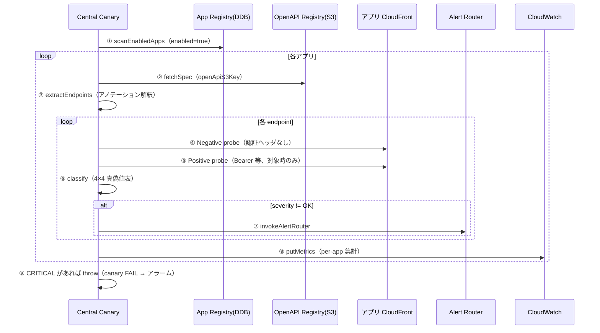

# 11. Central Canary アーキテクチャ

前提: [00-basic-design-plan.md](00-basic-design-plan.md) / [10-external-monitoring-overview.md](10-external-monitoring-overview.md)
実装: [code-samples/central-canary-puppeteer/](code-samples/central-canary-puppeteer/) / データ契約: [code-samples/README.md](code-samples/README.md)

---

## §11.0 前提と背景

**この章で定めること**: Central Canary が 1 回の実行で何をどう検査するか（処理フロー / 検証方式 / 分類ロジック / 実行方式の選択）。
**主な判断軸**: 「認証が正しく実装されている」を**誤検知なく**担保する。そのため Negative だけでなく Positive も併用する。

---

## §11.1 処理フロー（1 回の実行）

Central Canary は 5 分周期で起動し、全アプリを横断 probe する。

実装対応: [`index.js`](code-samples/central-canary-puppeteer/index.js)（handler）+ `lib/registry.js`（①）+ `lib/openapi.js`（②③）+ `lib/probe.js`（④⑤）+ `lib/classify.js`（⑥）+ `lib/emit.js`（⑦⑧）。

---

## §11.2 Hybrid 検証（Negative + Positive）

### §11.2.1 なぜ両方要るか

Negative（未認証 → 401/403 期待）だけでは、「**認証が無いから 401**」と「**テスト構成ミス（endpoint 不在で 404、token 失効で 401）**」を区別できない。Positive（valid token → 200 期待）を併用し、両者の**組合せ**で判定する。

| 検証 | 送信 | 期待 | 検知 |
|---|---|---|---|
| Negative | 認証ヘッダなし | 401/403（Cookie モノリスは 302）| 認証実装漏れ |
| Positive | valid Bearer 等 | 200/201/204 | API 稼働 + テスト健全性 |

### §11.2.2 4×4 真偽値表（分類ロジック）

`lib/classify.js` の実装（[検証済み: classify test 16 PASS](research/phase4-local-verification-results.md)）:

| Negative | Positive | severity | priority | 意味 |
|:---:|:---:|:---:|:---:|---|
| 401/403 | 200 | OK | — | 正常 |
| **2xx** | 2xx | **CRITICAL** | P1 | 認証 missing |
| **2xx** | 401/403 | **CRITICAL** | P1 | 認証逆転 |
| 401/403 | 401/403 | WARN | P2 | token 失効 |
| 401/403 | 404 | WARN | P2 | endpoint 不在 / 構成 |
| 401/403 | 5xx | INFO | P3 | Backend バグ（認証 OK）|
| 404 | any | WARN | P2 | probe 構成ミス |
| null(skip) | — | OK | — | public endpoint |

→ **「Negative=401/403 かつ Positive=200」のペアが揃って初めて OK**。分類結果（severity/priority）は Alert Router（15 章）と同一ロジックを SSOT 共有。

### §11.2.3 Smoke test

canary 冒頭で**既知の挙動**を確認し、テスト基盤自体の健全性を担保する（token 失効・endpoint 構成変更を「認証漏れ」と誤認しないため）。Smoke 失敗時は「認証漏れ」ではなく「テスト基盤問題」として分離アラート。

---

## §11.3 authPattern 別の probe 方式

アプリの認証方式（[README §2.1 enum](code-samples/README.md)）で Negative の期待値と Positive の手段が変わる。`lib/probe.js` が分岐する。

| authPattern | Negative 期待 | Positive 手段 | 状態 |
|---|---|---|:---:|
| `api-gw-jwt` | 401/403 | Bearer（OAuth Client Credentials）| ✅ 検証済 |
| `alb-code-jwt` | 401/403 | Bearer | ✅ |
| `alb-cookie-monolith` | **302 → /login** | Puppeteer ログインフロー | ◐ Negative 済 / Positive 要 PoC |
| `api-gw-iam` | 403 | SigV4 署名 | ⏳ Phase 2 |
| `lambda-url-iam` | 403 | SigV4 署名 | ⏳ Phase 2 |

→ **モノリス（Cookie セッション）も監視対象**（302 リダイレクトを認証拒否とみなす）。これが「API GW を使わないアプリも監査できる」根拠（14 章 §14.3）。

---

## §11.4 実行方式の選択：Puppeteer vs Multi Checks

| 観点 | Puppeteer カスタム（本命）| Multi Checks Blueprint |
|---|:---:|:---:|
| runtime | `syn-nodejs-puppeteer-16.1` | `syn-nodejs-5.1`（軽量）|
| endpoint 数 | 無制限（OpenAPI 動的発見）| **≤ 10 checks/canary** |
| OpenAPI 追従 | ✅ 自動 | ❌ 固定 JSON |
| OAuth / Secrets | 自前実装（lib/token.js）| ✅ **ネイティブ**（`${AWS_SECRET:...}`）|
| Cookie モノリス Positive | ✅ 可能（Puppeteer）| ❌ |
| 用途 | **全アプリ横断・動的**（Pattern β 本体）| 小規模・固定 endpoint の補助 |

→ **Pattern β の本体は Puppeteer カスタム**（OpenAPI 動的発見が必須のため）。Multi Checks は「特定アプリの ≤10 endpoint を JSON だけで手軽に」の補助用途（14 章 §14.2）。

> ⚠ **runtime バージョン（AWS 公式確認 2026-07）**: `syn-nodejs-puppeteer-16.1`（最新）/ `syn-nodejs-5.1`。namespace は `@aws/synthetics-puppeteer` / `@aws/synthetics-logger`（v13.1+ で旧 `Synthetics` から変更）。AWS SDK は v3。旧 `syn-nodejs-puppeteer-7.0` は Deprecated。

---

## §11.5 環境別 probe 動作

| 環境 | Negative | Positive (GET) | Positive (POST 等) | Smoke |
|---|:---:|:---:|:---:|:---:|
| Production | 全 endpoint | 全 GET | ❌ skip（副作用回避）| ✅ |
| Staging / Dev | 全 endpoint | 全 GET | ✅（cleanup 付き）| ✅ |

制御は OpenAPI アノテーション `x-canary-positive-test: pre-prod-only`（13 章 §13.3）。POST の副作用回避は本番の鉄則。

---

## §11.6 CloudWatch Metrics と FAIL 条件

- Namespace `APIPlatform/AuthCheck`、Dimensions `AppId` / `Env` / `AuthPattern`
- Metrics: `AuthCheckPassed` / `AuthCheckCritical` / `AuthCheckWarn` / `AuthCheckInfo` / `EndpointsProbed`
- **CRITICAL が 1 件でもあれば canary を throw で FAIL** → Synthetics の `SuccessPercent < 100` アラームが発火

---

## §11.7 設計判断

| ID | 判断 | 根拠 |
|---|---|---|
| D-M-11-1 | Negative + Positive の Hybrid 検証を必須化 | Negative 単独では構成ミスと認証漏れを区別不能（§11.2.1）|
| D-M-11-2 | 分類は 4×4 真偽値表、classify を canary/alert-router で SSOT 共有 | 二重実装の分類ずれを防ぐ |
| D-M-11-3 | Pattern β 本体は Puppeteer、Multi Checks は補助 | OpenAPI 動的発見が Pattern β に必須 |
| D-M-11-4 | Cookie モノリスは 302 を認証拒否とみなし監視対象化 | API GW 非依存アプリも担保 |
| D-M-11-5 | CRITICAL で canary FAIL → アラーム発火 | 「認証漏れ」を運用に即時可視化 |

---

## §11.8 未決事項

| ID | 内容 |
|---|---|
| M-Q-11-1 | probe 頻度（5min / 15min）とコストのバランス |
| M-Q-11-2 | SigV4 Positive（api-gw-iam）の実装（`@aws-sdk/signature-v4` 手動署名、Phase 2）|
| M-Q-11-3 | Cookie モノリス Positive（Puppeteer ログイン）の実装 |
