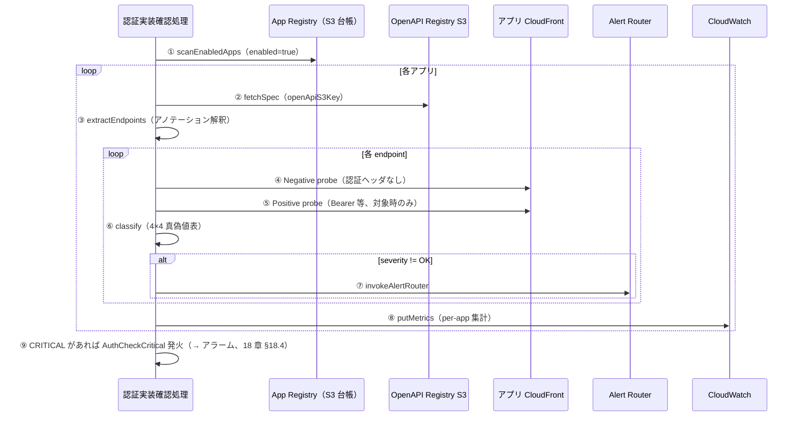

# 11. 認証実装確認処理 アーキテクチャ

前提: [00-basic-design-plan.md](00-basic-design-plan.md) / [10-external-monitoring-overview.md](10-external-monitoring-overview.md)
実装: [code-samples/central-probe-lib/](code-samples/central-probe-lib/) / データ契約: [code-samples/README.md](code-samples/README.md)

---

## §11.0 前提と背景

**この章で定めること**: 認証実装確認処理が 1 回の実行で何をどう検査するか（処理フロー / 検証方式 / 分類ロジック / probe 実装）。
**主な判断軸**: 「認証が正しく実装されている」を**誤検知なく**担保する。そのため Negative だけでなく Positive も併用する。

---

## §11.1 処理フロー（1 回の実行）

> 本節は認証実装チェックの **1 回の実行内容（処理フロー）** を示す。**実行基盤（Lambda）と頻度（M1 デプロイ差分/自動・M3 フル/手動）は [18 章](18-scan-modes-and-scheduling.md) が SSOT**。

1 回の実行で（M1 は対象アプリ、M3 は全アプリを）以下のように横断 probe する。



実装対応: [`index.js`](code-samples/central-probe-lib/index.js)（handler）+ `lib/registry.js`（①）+ `lib/openapi.js`（②③）+ `lib/probe.js`（④⑤）+ `lib/classify.js`（⑥）+ `lib/emit.js`（⑦⑧）。

---

## §11.2 Hybrid 検証（Negative + Positive）

### §11.2.1 なぜ両方要るか

Negative（未認証 → 401/403 期待）だけでは、「**認証が無いから 401**」と「**テスト構成ミス（endpoint 不在で 404、token 失効で 401）**」を区別できない。Positive（valid token → 200 期待）を併用し、両者の**組合せ**で判定する。

| 検証 | 送信 | 期待 | 検知 |
|---|---|---|---|
| Negative | 認証ヘッダなし | 401/403（Cookie モノリスは 302）| 認証実装漏れ |
| Positive | valid Bearer 等 | 200/201/204 | API 稼働 + テスト健全性 |

### §11.2.2 4×4 真偽値表（分類ロジック）

`lib/classify.js` の実装（[検証済み: classify test 16 PASS](research/phase4-local-verification-results.md)）:

| Negative | Positive | severity | priority | 意味 |
|:---:|:---:|:---:|:---:|---|
| 401/403 | 200 | OK | — | 正常 |
| **2xx** | 2xx | **CRITICAL** | P1 | 認証 missing |
| **2xx** | 401/403 | **CRITICAL** | P1 | 認証逆転 |
| 401/403 | 401/403 | WARN | P2 | token 失効 |
| 401/403 | 404 | WARN | P2 | endpoint 不在 / 構成 |
| 401/403 | 5xx | INFO | P3 | Backend バグ（認証 OK）|
| 404 | any | WARN | P2 | probe 構成ミス |
| null(skip) | — | OK | — | public endpoint |

→ **「Negative=401/403 かつ Positive=200」のペアが揃って初めて OK**。分類結果（severity/priority）は Alert Router（15 章）と同一ロジックを SSOT 共有。

### §11.2.3 Smoke test

canary 冒頭で**既知の挙動**を確認し、テスト基盤自体の健全性を担保する（token 失効・endpoint 構成変更を「認証漏れ」と誤認しないため）。Smoke 失敗時は「認証漏れ」ではなく「テスト基盤問題」として分離アラート。

---

## §11.3 authPattern 別の検査方式

アプリの認証方式（[README §2.1 enum](code-samples/README.md)）で Negative の期待値と Positive の手段が変わる。`lib/probe.js` が分岐する。

| authPattern | Negative 期待 | Positive 手段 | 状態 |
|---|---|---|:---:|
| `api-gw-jwt` | 401/403 | Bearer（OAuth Client Credentials）| ✅ 検証済 |
| `alb-code-jwt` | 401/403 | Bearer | ✅ |
| `alb-cookie-monolith` | **302 → /login** | Puppeteer ログインフロー | ◐ Negative 済 / Positive 要 PoC |
| `bff-cookie-session` | **401 or 302**（BFF 実装依存）| Puppeteer ログイン → Cookie | ◐ Negative 済 / Positive 要 PoC |
| `api-gw-iam` | 403 | SigV4 署名 | ⏳ Phase 2 |
| `lambda-url-iam` | 403 | SigV4 署名 | ⏳ Phase 2 |

→ **モノリス（Cookie セッション）も監視対象**（302 リダイレクトを認証拒否とみなす）。これが「API GW を使わないアプリも監査できる」根拠（14 章 §14.3）。

### §11.3.1 Positive トークンの管理（共通クライアント資格情報 + 短命トークン）

Positive probe（valid token → 200 期待）に使う認証情報は、**静的な長寿命トークンを持たない**。**共通の OAuth クライアント資格情報を 1 つ**だけ持ち、**実行ごとに短命トークンを発行**する。

```
認証基盤(Keycloak) に canary 専用サービスアカウント "api-canary-probe" を 1 つ
  └ client_id/secret → Secrets Manager（共通基盤アカウント）に保管
     └ GetSecretValue できるのは 認証実装チェック Lambda の IAM ロールのみ

【1 回の probe 実行ごと】
  認証実装チェック Lambda → Keycloak /token（client_credentials grant）
              → 短命アクセストークン（5〜15 分）取得 → Positive probe に使用 → 破棄
```

- **「ずっと使える 1 つ」の実体はクライアント資格情報**（全 API 共通・定期ローテ）で、**実際のトークンは毎回使い捨て**。`lib/token.js` が取得・キャッシュ（TTL 内）する。
- 実装対応: `x-canary-test-token-secret` は既定で共通 Secret（`canary-central-readonly` 相当のクライアント資格情報）を指す（13 章 §13.3 / README §2.1-2.3）。

**漏洩しにくく**:
| 対策 | 内容 |
|---|---|
| 保管 | client_secret は **Secrets Manager のみ**（環境変数・コード埋込・ログ出力禁止＝[05 OBS-3](05-security.md)）|
| アクセス | 認証実装チェック Lambda ロールだけが `secretsmanager:GetSecretValue`（最小 IAM）|
| ローテ | **自動ローテーション**（30/90 日、Secrets Manager rotation）|
| 経路 | 中央アカウントからの egress のみ・TLS |

**漏洩しても影響を小さく（blast radius 最小化）**:
| 対策 | 内容 |
|---|---|
| 最小権限 | canary クライアントは**読み取り専用・最小スコープ**（管理者でも書込でもない）|
| 短 TTL | トークンは数分で失効 → 捕捉されてもすぐ死ぬ |
| GET 限定 | Positive は GET のみ（本番 POST スキップ、§11.5）|
| 即失効 | 発火元は中央アカウントの既知プリンシパル → 異常利用検知でクライアント無効化 |

**スコープ設計（A → B の 2 段階）**:

| レベル | canary スコープ | 漏洩時の影響 | 採否 |
|---|---|---|:---:|
| **A** | 全 API 横断の**読み取り専用** | canary として read-only GET が可能（中程度）| ✅ **Phase 1 採用** |
| **B** ⭐ | **canary 専用テナント / 合成データのみ**読める | 実データに一切届かない（最小）| 🎯 **目標**（認証基盤 Keycloak のロール設計へ引き渡し）|

> **方針**: Phase 1 は A（共通 1 クライアント + 短 TTL + 自動ローテ）で開始し、**B（canary 専用スコープ = 漏洩しても実データに届かない）を目標**とする。B は認証基盤側で「canary 専用テナント/スコープ」を用意する必要があり、[認証基盤 Keycloak ロール設計への引き渡し事項](../../adr/059-central-auth-check-canary-architecture.md)（M-Q-11-4）。機微データを扱う API から順に B へ移行する。

---

## §11.4 検査ロジックの実装（probe lib、Lambda 実行）

現行設計の probe は **Lambda 上で共通 probe lib を実行**する（[18 章](18-scan-modes-and-scheduling.md)）。OpenAPI を動的発見して endpoint 数無制限に対応し、`lib/token.js` で OAuth Bearer（§11.3.1）、Puppeteer 相当のロジックで Cookie モノリス Positive も扱う。

| 能力 | 現行（Lambda + 共通 probe lib）|
|---|---|
| endpoint 数 | 無制限（OpenAPI 動的発見）|
| OpenAPI 追従 | ✅ 自動 |
| OAuth / Secrets | `lib/token.js`（短命トークン、§11.3.1）|
| Cookie モノリス Positive | ✅（Puppeteer 相当ロジック）|

> **将来オプション（Synthetics）**: 定期 heartbeat（M2）や HAR・スクショ・Multilocation・実行履歴 UI が要る場合のみ、CloudWatch Synthetics（Puppeteer runtime）や Multi Checks Blueprint（≤10 endpoint を JSON で記述、OAuth ネイティブ）を実行環境として追加できる。**その場合も probe lib は共通**（14 章 §14.2 / [18 章 §18.4.1](18-scan-modes-and-scheduling.md)）。

---

## §11.5 環境別の検査動作

| 環境 | Negative | Positive (GET) | Positive (POST 等) | Smoke |
|---|:---:|:---:|:---:|:---:|
| Production | 対象 endpoint | 対象 GET | ❌ skip（副作用回避）| ✅ |
| Staging / Dev | 対象 endpoint | 対象 GET | ✅（cleanup 付き）| ✅ |

「対象 endpoint」= M1 なら変更アプリの全 endpoint、M3 なら全 endpoint（[18 章](18-scan-modes-and-scheduling.md)）。制御は OpenAPI アノテーション `x-canary-positive-test: pre-prod-only`（13 章 §13.3）。POST の副作用回避は本番の鉄則。

---

## §11.6 CloudWatch Metrics とアラーム条件

- Namespace `APIPlatform/AuthCheck`、Dimensions `AppId` / `Env` / `AuthPattern`
- Metrics: `AuthCheckPassed` / `AuthCheckCritical` / `AuthCheckWarn` / `AuthCheckInfo` / `EndpointsProbed`
- **アラーム条件 = `AuthCheckCritical > 0`**（Lambda 実行のため canary FAIL 依存でなく metric ベース、[18 章 §18.4](18-scan-modes-and-scheduling.md)）
- CRITICAL 検知時は alert-router へ即時 invoke（15 章）も併走

---

## §11.7 設計判断

| ID | 判断 | 根拠 |
|---|---|---|
| D-M-11-1 | Negative + Positive の Hybrid 検証を必須化 | Negative 単独では構成ミスと認証漏れを区別不能（§11.2.1）|
| D-M-11-2 | 分類は 4×4 真偽値表、classify を canary/alert-router で SSOT 共有 | 二重実装の分類ずれを防ぐ |
| D-M-11-3 | probe は Lambda + 共通 probe lib（OpenAPI 動的発見）。Synthetics / Multi Checks は将来オプション | 動的発見が Pattern β に必須、定期実行は不要（18 章）|
| D-M-11-4 | Cookie モノリスは 302 を認証拒否とみなし監視対象化 | API GW 非依存アプリも担保 |
| D-M-11-5 | CRITICAL で `AuthCheckCritical` メトリクス → アラーム発火 | 「認証漏れ」を運用に即時可視化（Lambda 基盤、18 章 §18.4）|

---

## §11.8 具体的ユースケース（OpenAPI → probe → classify → alert）

実際の OpenAPI 記述が、どのコードフローで probe され、どう分類され、どんなアラートになるかを 4 ケースで示す。すべて実装（`lib/openapi.js` の `extractEndpoints` → `lib/probe.js` → `lib/classify.js`）に対応。

### §11.8.1 ケース 1：標準的な JWT API（正常、アラートなし）

**OpenAPI**:
```yaml
paths:
  /api/users:
    get:
      x-canary-positive-test: true
      x-canary-test-token-secret: canary-central-readonly
  /_/health:
    get:
      x-synthetics-skip-auth-check: true
```

| 段階 | 動き |
|---|---|
| extractEndpoints | `/api/users`（positiveTest:true）、`/_/health`（skipAuthCheck:true）|
| probe（api-gw-jwt）| users: Negative→401、Positive(Bearer)→200 / health: Negative skip（null）|
| classify | `classify(401,200)`→OK、`classify(null,undefined)`→OK |
| 結果 | CloudWatch `AuthCheckPassed=2`、アラートなし、canary PASS |

### §11.8.2 ケース 2：認証漏れを検知（CRITICAL/P1）🔥

アプリチームが誤って `/api/orders` を `AuthorizationType=NONE` でデプロイ（アノテーションなし = 認証必須のはず）。

**OpenAPI**:
```yaml
paths:
  /api/orders:
    get: {}
```

| 段階 | 動き |
|---|---|
| probe | Negative（認証なし）→ API GW に Authorizer なし → **200 が返る** |
| classify | `classify(200, undefined)` → Negative が 2xx = **CRITICAL/P1**（Auth missing or bypassed）|
| alert-router | App Registry `alertRouting.p1`（Security SNS）へ Publish → 🔥「expense-api/prod GET /api/orders が未認証で 200」|
| アラーム | `AuthCheckCritical > 0` の CloudWatch アラーム発火（18 章 §18.4）|

→ **静的解析をすり抜けた認証漏れを実トラフィックで捕捉**。本機構の存在意義。

### §11.8.3 ケース 3：test token 失効を検知（WARN/P2）

`/api/users` の認証は正常だが、canary の test token が失効。

| 段階 | 動き |
|---|---|
| probe | Negative→401（認証は正常に動作）/ Positive（失効 Bearer）→401 |
| classify | `classify(401,401)` → 両方拒否 = **WARN/P2**（Test token expired）|
| alert-router | P2 Platform チームへ（Security ではない）→ 🟡「canary の token を確認」|

→ Negative だけなら「401 で OK」と誤判定していた。**Positive 併用で「認証 OK だがテストが壊れている」を分離**（§11.2.1 の核心）。

### §11.8.4 ケース 4：Cookie モノリス（302 検証）

ALB + SSR モノリス（`authPattern=alb-cookie-monolith`）。

**OpenAPI**:
```yaml
paths:
  /dashboard:
    get:
      x-canary-auth-mode: cookie-redirect
      x-canary-expected-redirect: /login
```

| 段階 | 動き（正常）| 動き（漏れ）|
|---|---|---|
| probe | Negative（Cookie なし）→ **302 /login**（追従せず観測）| 未認証で **200**（ログインせず閲覧可）|
| classify | `classify(302,undefined,'alb-cookie-monolith')` → 302 を認証拒否とみなし **OK** | `classify(200,...)` → 302 でない 2xx = **CRITICAL/P1** |

→ **API GW を使わないモノリスでも認証漏れを検知**（14 章 §14.3）。

### §11.8.5 4 ケース一覧

| ケース | Neg | Pos | classify | アラート |
|---|:---:|:---:|---|---|
| 1 正常 JWT | 401 | 200 | OK | なし |
| 2 認証漏れ | **200** | — | **CRITICAL/P1** | 🔥 Security 即時 |
| 3 token 失効 | 401 | 401 | WARN/P2 | 🟡 Platform |
| 4 モノリス正常 | 302 | — | OK | なし |
| 4' モノリス漏れ | 200 | — | CRITICAL/P1 | 🔥 Security |

---

## §11.9 未決事項

| ID | 内容 |
|---|---|
| M-Q-11-1 | probe 頻度（5min / 15min）とコストのバランス |
| M-Q-11-2 | SigV4 Positive（api-gw-iam）の実装（`@aws-sdk/signature-v4` 手動署名、Phase 2）|
| M-Q-11-3 | Cookie モノリス Positive（Puppeteer ログイン）の実装 |
| M-Q-11-4 | **Positive トークン スコープ B（canary 専用テナント/合成データ）の設計**（認証基盤 Keycloak へ引き渡し、§11.3.1）。Phase 1 は A、機微データ API から B へ移行 |
