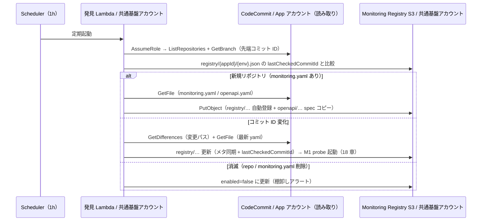

# 12. App Registry 設計（S3 台帳）

前提: [00-basic-design-plan.md](00-basic-design-plan.md) / [10-external-monitoring-overview.md](10-external-monitoring-overview.md)
実装: 発見 Lambda（M-Q-17-4）/ データ契約: [code-samples/README.md §2.1](code-samples/README.md)
根拠: [ADR-061 追記 2026-08-13（台帳ストア DynamoDB → S3 統合）](../../adr/061-deploy-detection-pull-model.md)

---

## §12.0 前提と背景

**この章で定めること**: 「どのアプリを監視するか」の台帳（App Registry）のデータ構造と、そこへ載る仕組み。
**なぜ要るか**: Pattern β で「Deploy 漏れ = ゼロ」を成立させる中核。**書き手は中央の発見 Lambda**（[17 章 §17.2](17-deployment-integration-and-registration.md) / [ADR-061](../../adr/061-deploy-detection-pull-model.md)）で、1 時間毎の巡回が **CodeCommit リポジトリ（monitoring.yaml）** からアプリを発見・登録し、認証実装確認処理が自動的に監視する。アプリ側に登録処理はない。台帳の設定値の多くは monitoring.yaml 由来（**リポジトリが宣言の正、台帳は巡回が写した実行用ビュー + 中央管理項目**）。

**ストアは S3**（DynamoDB は不使用）。台帳で本当に消せない情報は **① lastCheckedCommitId（巡回状態）② alertRouting ③ enabled（中央管理項目）の 3 つだけ**で、書き手は発見 Lambda 1 本（1h 毎・直列）・データ量は MB 未満のため、DB の性能・整合性を要する要素がない。[Monitoring Registry バケット（13 章と同居）](13-openapi-registry-design.md)に JSON で置く（ADR-061 追記）。

---

## §12.1 データモデル（S3 JSON）

**Monitoring Registry バケット**（共通基盤アカウント、13 章 §13.1 と同一バケット）の `registry/` プレフィックス配下に、**アプリ × 環境ごとに 1 オブジェクト**。

- キー: `registry/{appId}/{env}.json`
- 例: `registry/expense-api/prod.json`

```json
{
  "appId": "expense-api",
  "env": "prod",
  "baseUrl": "https://expense.example.com",
  "authPattern": "api-gw-jwt",
  "openApiS3Key": "openapi/111122223333/expense-api/openapi.yaml",
  "testTokenSecret": "canary-central-readonly",
  "alertRouting": { "p1": "arn:aws:sns:...:security" },
  "enabled": true,
  "registeredAt": "2026-07-06T00:00:00Z",
  "repositoryName": "expense-api",
  "branch": "main",
  "pathPrefix": "",
  "lastCheckedCommitId": "a1b2c3d…",
  "deploymentId": "dep-abc123",
  "lastSeenAt": "2026-08-13T00:00:00Z"
}
```

| 項目 | 由来 / 管理 | 説明 |
|---|---|---|
| `appId` / `env` | キーと同値 | 台帳の識別子 |
| `baseUrl` | monitoring.yaml | probe 先 CloudFront URL（Origin Protection 経由、§12.1.1）|
| `authPattern` | monitoring.yaml | 認証方式 enum（11 章 §11.3）|
| `openApiS3Key` | 巡回が導出 | spec コピーのキー（13 章）|
| `testTokenSecret` | monitoring.yaml | Positive 用 token の Secret 名 |
| `alertRouting` | **台帳のみ・中央管理** | 通知先 `{p1,p2,p3}` の SNS ARN（未設定は全社デフォルト、15 章）|
| `enabled` | **台帳のみ・中央管理** | 監視有効フラグ（monitoring.yaml には置かない）|
| `repositoryName` / `branch` / `pathPrefix` | 巡回 / monitoring.yaml | 発見元リポジトリ |
| `lastCheckedCommitId` | **巡回状態** | 前回確認した先端コミット ID（差分判定の基準、17 章 §17.2）|
| `deploymentId` | **巡回状態** | 前回観測した API GW stage の deploymentId（**手動変更のデプロイ反映検知**用の併読値、17 §17.2.1 ⑤'。ALB 直モノリスは空）|
| `lastSeenAt` | 巡回状態 | 最後に観測した日時（消滅検知用）|

> 厳密な定義は [README §2.1](code-samples/README.md)。認証実装確認処理は `registry/` を List → Get し `enabled=true` のみ検査する。**読み方**: M1 は該当 1 オブジェクトのみ Get、M3 は全 List。

### §12.1.1 検査先が CloudFront URL である理由

`baseUrl` は API GW の直 URL でなく **CloudFront の URL**。認証実装確認処理は実ユーザーと同じ経路（CloudFront → WAF → Origin Protection → API GW）を通るため、**Origin Protection（[ADR-039 §C-4](../../adr/039-centralized-network-account-edge-layer.md)）を破らず、実 UX と同一条件で検証**できる。probe は `X-Origin-Verify` secret を持たない（Lambda@Edge が付与）。

### §12.1.2 整合性（現行は単純で足りる）

- 書き手は**発見 Lambda 1 本（1h 毎・直列）+ 共通基盤チームの手動更新**のみ → 競合は実質発生しない
- 手動更新と巡回の稀な競合に備えるなら **ETag 条件付き PUT（`If-Match`）** で楽観ロック可能（S3 の条件付き書き込みは 2024-11 に GA。AWS 公式機能）
- 将来巡回を並列化する場合は排他制御の作り込みが要る（M-Q-12-3。それが常態化するなら DynamoDB 復帰を再検討）

---

## §12.2 登録フロー（中央巡回による自動発見）

**書き手は中央の発見 Lambda のみ**（[17 章 §17.2](17-deployment-integration-and-registration.md)）。アプリ deploy → 次回巡回（最大 1 時間後）で発見・登録される。



- 台帳は**同一アカウント内**の書き込みのみ（クロスアカウント書き込みは発生しない。App アカウントへは codecommit 読み取り AssumeRole だけ、16 章）。
- monitoring.yaml の規約は [17 章 §17.3](17-deployment-integration-and-registration.md)。**モノリスもリポジトリがあるため同じ仕組みで自動発見**される（17 章 §17.4）。

> **旧実装の扱い**: 旧 push 型 Custom Resource（[`app-registry-lambda/`](code-samples/app-registry-lambda/)、DynamoDB PutItem）は参考保管。正規化ロジックは流用できるが、**ストアが S3 になったため書き込み部は S3 PutObject に差し替え**（M-Q-17-4 の実装スコープ）。probe lib の `lib/registry.js`（DynamoDB Scan 実装）も **S3 List/Get への改修が必要**（M-Q-12-3）。

---

## §12.3 書き込み権限（中央のみ）

pull 型（ADR-061）により、**App Registry への書き込みは共通基盤アカウント内の発見 Lambda（+ 運用者の手動更新）に限定**される。App アカウント側からの書き込み経路は存在しない。

| 書き手 | 経路 | 権限 |
|---|---|---|
| 発見 Lambda | 同一アカウント内 PutObject | `s3:PutObject`（`registry/*` / `openapi/*` プレフィックス限定）|
| 共通基盤チーム（手動）| コンソール / CLI で JSON 更新 | 同上（alertRouting 設定・enabled 切替）|
| ~~App アカウントの Custom Resource~~ | ~~クロスアカウント Put~~ | **廃止**（ADR-061）|

→ 書き込み面の攻撃面・設定ミス面が縮小（台帳汚染はアカウント内経路のみ）。バケットは Versioning 有効（13 章と共通）なので誤更新は履歴から戻せる。

---

## §12.4 運用

| 操作 | 手段 |
|---|---|
| アプリ追加 | **自動**（次回巡回で発見・登録。最大 1h）|
| モノリス追加 | **自動**（リポジトリに monitoring.yaml を置けば同じ巡回で発見、17 章 §17.4）|
| 一時停止 | `registry/{appId}/{env}.json` の `enabled=false` に更新（JSON 編集 → PUT。S3 統合の代償として DDB よりひと手間、ADR-061 追記）|
| 削除 | リポジトリ / monitoring.yaml 削除 → 巡回の消滅検知で `enabled=false` + 棚卸しアラート → 確認後オブジェクト削除 |
| 通知先設定 | `alertRouting` を共通基盤チームが JSON 更新（未設定は全社デフォルト、15 章）|
| 棚卸し | `registry/` を List（誰が監視対象か中央で一覧。`lastSeenAt` で鮮度確認）|

---

## §12.5 設計判断

| ID | 判断 | 根拠 |
|---|---|---|
| D-M-12-1 | **台帳ストアは S3**（`registry/{appId}/{env}.json`、Monitoring Registry バケットに 13 章と同居）。DynamoDB は不使用 | 消せない情報は 3 つ・書き手 1 本・MB 未満で DB が過剰。ストアを S3 1 つに集約（[ADR-061 追記 2026-08-13](../../adr/061-deploy-detection-pull-model.md)、2026-08-07 の DDB 維持決定を更新）|
| D-M-12-2 | probe 先は CloudFront URL（API GW 直でない）| Origin Protection を破らず実 UX 同一条件で検証（§12.1.1）|
| D-M-12-3 | 登録は**中央巡回の自動発見**（書き手は発見 Lambda のみ、旧 Custom Resource 廃止）| 登録漏れ構造ゼロ + 書き込みクロスアカウント権限の排除（ADR-061）|
| D-M-12-4 | 台帳に巡回スナップショット（lastCheckedCommitId / lastSeenAt / repo 系属性）を同居 | 差分判定・消滅検知・発見元の監査を 1 箇所で完結 |
| D-M-12-5 | enabled で監視の有効/無効を切替（中央管理）| メンテ時などに削除せず一時停止できる。アプリが自分で監視を止められない |

---

## §12.6 なぜ App Registry（台帳）が要るか（代替案比較）

認証実装確認処理が 1 アプリを検査するには、**API の形（endpoint 一覧）以外に**運用メタデータが要る。これらは OpenAPI（= API 仕様）には属さない。

| 必要な情報 | 台帳の項目 | OpenAPI に書けるか |
|---|---|---|
| どこを叩くか（CloudFront URL）| `baseUrl` | ✗ production URL は API 仕様に入れない、env で変わる |
| どの認証方式か | `authPattern` | △ 書けるが env 依存 |
| どの test token か | `testTokenSecret` | ✗ 秘密情報の参照 |
| 誰に通知するか | `alertRouting` | ✗ 運用情報であって API 仕様でない |
| 監視 ON/OFF | `enabled` | ✗ |
| 前回どこまで確認したか | `lastCheckedCommitId` | ✗ 巡回自身の状態（repo に書き戻せない）|

### §12.6.1 代替案の比較

| 案 | 仕組み | 評価 |
|---|---|---|
| **S3 台帳（採用）** | Monitoring Registry バケットに JSON | ストア 1 種で完結。規模・書き込みパターンに対して十分（§12.1.2）|
| DynamoDB 台帳（旧採用）| 1 テーブル PK/SK | 必須ではない（項目単位更新・運用 UI は楽だが、リソース種が 1 つ増える割に性能要件がない）→ **S3 統合で置換**（ADR-061 追記）|
| 動的発見**だけ**（台帳レス）| 巡回列挙の結果を毎回そのまま使う | **不可**: alertRouting / enabled / lastCheckedCommitId は repo に置けず保持場所が要る |
| リポジトリ設定だけ（monitoring.yaml のみ）| 全メタを repo に置き毎回読む | メタの大半は monitoring.yaml に**移した**（§17.3）。ただし中央管理 3 項目の置き場として台帳は残る |

→ 台帳は「**中央管理 3 項目 + 巡回スナップショット + 実行用ビュー**」の置き場。**発見（pull 巡回）と台帳は代替関係ではなく組合せ**（発見が書き、probe が読む）。

---

## §12.7 未決事項

| ID | 内容 |
|---|---|
| M-Q-12-1 | alertRouting を全アプリ個別指定か、env 既定 + 上書きか |
| M-Q-12-2 | バケットのバックアップ方針（Versioning は有効。加えてレプリケーション要否）|
| M-Q-12-3 | **probe lib `lib/registry.js` と alert-router の通知先解決の S3 対応改修**（DynamoDB Scan / GetItem → S3 List/Get。M-Q-17-4 発見 Lambda 実装と同時に）+ 手動更新との競合対策（ETag 条件付き PUT）|
