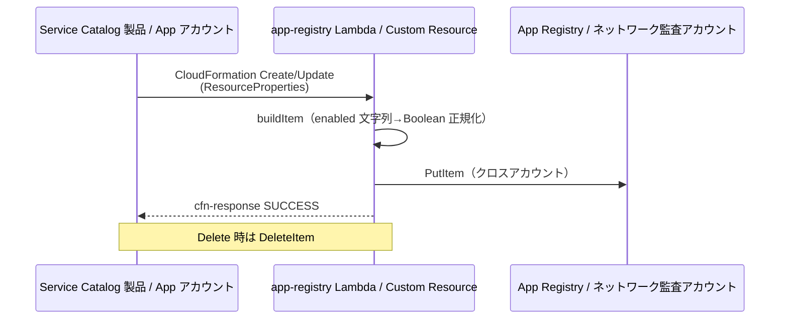

# 12. App Registry 設計（DynamoDB）

前提: [00-basic-design-plan.md](00-basic-design-plan.md) / [10-external-monitoring-overview.md](10-external-monitoring-overview.md)
実装: [code-samples/app-registry-lambda/](code-samples/app-registry-lambda/) / データ契約: [code-samples/README.md §2.1](code-samples/README.md)

---

## §12.0 前提と背景

**この章で定めること**: 「どのアプリを監視するか」の台帳（App Registry）のデータ構造と、アプリ deploy 時にそこへ自動登録する仕組み。
**なぜ要るか**: Pattern β で「Deploy 漏れ = ゼロ」を成立させる中核。アプリが deploy されると同時にこの台帳へ載り、中央認証チェックが次回実行から自動的に監視する。

---

## §12.1 データモデル（DynamoDB スキーマ）

ネットワーク監査アカウントに 1 テーブル。PK=`appId` / SK=`env`。

| 属性 | 型 | 説明 | 例 |
|---|:---:|---|---|
| `appId` (PK) | S | アプリ一意識別子 | `expense-api` |
| `env` (SK) | S | 環境 | `prod` / `stg` / `dev` |
| `baseUrl` | S | probe 先 CloudFront URL（Origin Protection 経由）| `https://expense.example.com` |
| `authPattern` | S | 認証方式 enum（11 章 §11.3）| `api-gw-jwt` |
| `openApiS3Key` | S | OpenAPI Registry のキー | `111122223333/abc/openapi.yaml` |
| `testTokenSecret` | S | Positive 用 token の Secret 名 | `canary-central-readonly` |
| `alertRouting` | M | 通知先 `{p1,p2,p3}` の SNS ARN | `{p1:"arn:...:security"}` |
| `enabled` | BOOL | 監視有効フラグ | `true` |
| `registeredAt` | S | ISO8601 登録日時 | `2026-07-06T00:00:00Z` |

> 厳密な定義は [README §2.1](code-samples/README.md)。中央認証チェックは `enabled=true` のみ Scan する（`lib/registry.js`）。

### §12.1.1 検査先が CloudFront URL である理由

`baseUrl` は API GW の直 URL でなく **CloudFront の URL**。中央認証チェックは実ユーザーと同じ経路（CloudFront → WAF → Origin Protection → API GW）を通るため、**Origin Protection（[ADR-039 §C-4](../../adr/039-centralized-network-account-edge-layer.md)）を破らず、実 UX と同一条件で検証**できる。probe は `X-Origin-Verify` secret を持たない（Lambda@Edge が付与）。

---

## §12.2 登録フロー（Custom Resource）

アプリの Service Catalog 製品が deploy されると、同梱の Custom Resource が App Registry へ Put する。

実装対応: [`app-registry-lambda/index.js`](code-samples/app-registry-lambda/index.js)。

### §12.2.1 Custom Resource の鉄則（実装済み）

- **成功でも失敗でも必ず `cfn-response` を返す**（返さないと CFN がタイムアウト最大 1h まで stuck）。応答本文は **4096 bytes 以下**。
- `PhysicalResourceId` を `app-registry::{appId}::{env}` で安定化（変わると CFN が replacement 誤認）。
- `enabled` は CFN が文字列化するため `"true"` → Boolean `true` に正規化。

> **Phase 4 検証済み**（[LocalStack](research/phase4-local-verification-results.md)）: Create イベントで DynamoDB に PutItem → scan で item 確認、Boolean 正規化・cfn-response の graceful resolve も動作。

---

## §12.3 Cross-Account 書き込み

app-registry Lambda の配置は 2 パターン（16 章で詳細）:

| 配置 | クロスアカウント | 説明 |
|---|:---:|---|
| **ネットワーク監査アカウントに配置** | 不要 | App アカウントから Lambda を Invoke。DDB は同 アカウント |
| App アカウントに配置 | 要 | STS AssumeRole でネットワーク監査アカウントのロールを引き受けて Put（`CROSS_ACCT_ROLE_ARN`）|

→ **推奨は前者**（Lambda を中央に置き、App アカウントからは Invoke するだけ）。クロスアカウントの複雑性を Registry 書込みだけに閉じ込める。

---

## §12.4 運用

| 操作 | 手段 |
|---|---|
| アプリ追加 | Service Catalog 製品 deploy（自動登録）|
| 一時停止 | `enabled=false` に更新（probe の Scan 対象外に）|
| 削除 | Service Catalog 製品削除（DeleteItem）|
| 棚卸し | 全 item Scan（誰が監視対象か中央で一覧）|

---

## §12.5 設計判断

| ID | 判断 | 根拠 |
|---|---|---|
| D-M-12-1 | PK=appId / SK=env の複合キー | 同一アプリの環境別（prod/stg）を別レコードで管理 |
| D-M-12-2 | probe 先は CloudFront URL（API GW 直でない）| Origin Protection を破らず実 UX 同一条件で検証（§12.1.1）|
| D-M-12-3 | 登録は Service Catalog 製品の Custom Resource で自動化 | Deploy 漏れゼロ（人手登録を排除）|
| D-M-12-4 | app-registry Lambda はネットワーク監査アカウント 配置を推奨 | クロスアカウント 複雑性を最小化 |
| D-M-12-5 | enabled で監視の有効/無効を切替 | メンテ時などに削除せず一時停止できる |

---

## §12.6 なぜ App Registry が要るか（代替案比較）

中央認証チェックが 1 アプリを検査するには、**API の形（endpoint 一覧）以外に**運用メタデータが要る。これらは OpenAPI（= API 仕様）には属さない。

| 必要な情報 | App Registry の属性 | OpenAPI に書けるか |
|---|---|---|
| どこを叩くか（CloudFront URL）| `baseUrl` | ✗ production URL は API 仕様に入れない、env で変わる |
| どの認証方式か | `authPattern` | △ 書けるが env 依存 |
| どの test token か | `testTokenSecret` | ✗ 秘密情報の参照 |
| 誰に通知するか | `alertRouting` | ✗ 運用情報であって API 仕様でない |
| 監視 ON/OFF | `enabled` | ✗ |

→ **OpenAPI Registry は「API の形」、App Registry は「監視の運用メタデータ」で責務が異なる**。

### §12.6.1 代替案の却下理由

| 案 | 仕組み | 却下理由 |
|---|---|---|
| **App Registry（採用）** | DynamoDB 台帳 | — |
| OpenAPI だけ | S3 list で発見 + 全メタを OpenAPI に埋込 | production URL / token / 通知先 / env 別設定を API 仕様に混入し責務が壊れる |
| Resource Explorer / Config で動的発見 | 各 App アカウントの API GW を列挙 | CloudFront URL / authPattern / 通知先が**発見できない**（AWS リソースは分かるが監視方式は別途要る）|
| タグベース | API GW にタグ、Config Aggregator | `alertRouting` 等はタグに入り切らない、Cookie モノリスは API GW ですらない |

→ App Registry は「**監視に必要な運用メタデータの single source of truth**」。`enabled` で一時停止、`alertRouting` でアプリ別通知先という運用は台帳ならでは。

---

## §12.7 未決事項

| ID | 内容 |
|---|---|
| M-Q-12-1 | alertRouting を全アプリ個別指定か、env 既定 + 上書きか |
| M-Q-12-2 | Registry のバックアップ / PITR 要否 |
| BD-Q-03 連携 | タグ命名（kebab-case）と App Registry のキー命名の整合（確定済み）|
