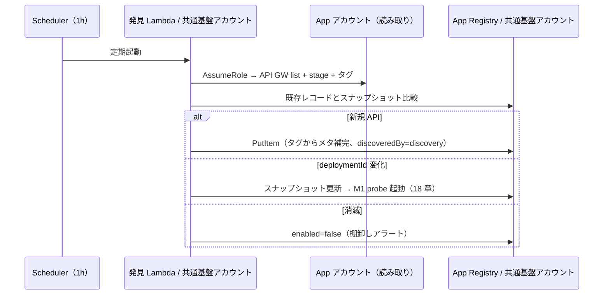

# 12. App Registry 設計（DynamoDB）

前提: [00-basic-design-plan.md](00-basic-design-plan.md) / [10-external-monitoring-overview.md](10-external-monitoring-overview.md)
実装: 発見 Lambda（M-Q-17-4、[app-registry-lambda/](code-samples/app-registry-lambda/) の登録ロジックを流用）/ データ契約: [code-samples/README.md §2.1](code-samples/README.md)

---

## §12.0 前提と背景

**この章で定めること**: 「どのアプリを監視するか」の台帳（App Registry）のデータ構造と、そこへ載る仕組み。
**なぜ要るか**: Pattern β で「Deploy 漏れ = ゼロ」を成立させる中核。**書き手は中央の発見 Lambda**（[17 章 §17.2](17-deployment-integration-and-registration.md) / [ADR-061](../../adr/061-deploy-detection-pull-model.md)）で、1 時間毎の巡回が API を発見・登録し、認証実装確認処理が自動的に監視する。アプリ側に登録処理はない。

---

## §12.1 データモデル（DynamoDB スキーマ）

共通基盤アカウントに 1 テーブル。PK=`appId` / SK=`env`。

| 属性 | 型 | 説明 | 例 |
|---|:---:|---|---|
| `appId` (PK) | S | アプリ一意識別子 | `expense-api` |
| `env` (SK) | S | 環境 | `prod` / `stg` / `dev` |
| `baseUrl` | S | probe 先 CloudFront URL（Origin Protection 経由）| `https://expense.example.com` |
| `authPattern` | S | 認証方式 enum（11 章 §11.3）| `api-gw-jwt` |
| `openApiS3Key` | S | OpenAPI Registry のキー | `111122223333/abc/openapi.yaml` |
| `testTokenSecret` | S | Positive 用 token の Secret 名 | `canary-central-readonly` |
| `alertRouting` | M | 通知先 `{p1,p2,p3}` の SNS ARN | `{p1:"arn:...:security"}` |
| `enabled` | BOOL | 監視有効フラグ | `true` |
| `registeredAt` | S | ISO8601 登録日時 | `2026-07-06T00:00:00Z` |
| `deploymentId` | S | **巡回スナップショット**: 前回観測した stage の deploymentId（差分判定用、17 章 §17.2）| `dep-abc123` |
| `lastSeenAt` | S | 巡回で最後に観測した日時（消滅検知用）| `2026-08-06T00:00:00Z` |
| `discoveredBy` | S | 登録経路 | `discovery`（巡回自動）/ `manual`（モノリス手動）|

> 厳密な定義は [README §2.1](code-samples/README.md)。認証実装確認処理は `enabled=true` のみ Scan する（`lib/registry.js`）。下 3 行は pull 型（ADR-061）で追加したスナップショット属性。

### §12.1.1 検査先が CloudFront URL である理由

`baseUrl` は API GW の直 URL でなく **CloudFront の URL**。認証実装確認処理は実ユーザーと同じ経路（CloudFront → WAF → Origin Protection → API GW）を通るため、**Origin Protection（[ADR-039 §C-4](../../adr/039-centralized-network-account-edge-layer.md)）を破らず、実 UX と同一条件で検証**できる。probe は `X-Origin-Verify` secret を持たない（Lambda@Edge が付与）。

---

## §12.2 登録フロー（中央巡回による自動発見）

**書き手は中央の発見 Lambda のみ**（[17 章 §17.2](17-deployment-integration-and-registration.md)）。アプリ deploy → 次回巡回（最大 1 時間後）で発見・登録される。

- 台帳は**同一アカウント内**の書き込みのみ（クロスアカウント書き込みは発生しない。App アカウントへは読み取り AssumeRole だけ、16 章）。
- メタデータ（authPattern 等）の補完規約は [17 章 §17.3](17-deployment-integration-and-registration.md)。
- モノリス（自動発見不可）は共通基盤チームが手動で PutItem（`discoveredBy=manual`、17 章 §17.4）。

> **旧 push 型の Custom Resource 実装**（[`app-registry-lambda/`](code-samples/app-registry-lambda/)）は参考として保管。PutItem / 正規化ロジックは発見 Lambda に流用できる（LocalStack 検証済み: PutItem・Boolean 正規化、[research](research/phase4-local-verification-results.md)）。

---

## §12.3 書き込み権限（中央のみ）

pull 型（ADR-061）により、**App Registry への書き込みは共通基盤アカウント内の発見 Lambda（+ 運用者の手動更新）に限定**される。App アカウント側からの書き込み経路は存在しない。

| 書き手 | 経路 | 権限 |
|---|---|---|
| 発見 Lambda | 同一アカウント内 PutItem/UpdateItem | `dynamodb:PutItem/UpdateItem`（テーブル限定）|
| 共通基盤チーム（手動）| コンソール / CLI | 同上（モノリス登録・alertRouting 設定・enabled 切替）|
| ~~App アカウントの Custom Resource~~ | ~~クロスアカウント Put~~ | **廃止**（ADR-061）|

→ 書き込み面の攻撃面・設定ミス面が縮小（台帳汚染はアカウント内経路のみ）。

---

## §12.4 運用

| 操作 | 手段 |
|---|---|
| アプリ追加 | **自動**（次回巡回で発見・登録。最大 1h）|
| モノリス追加 | 手動 PutItem（17 章 §17.4）|
| 一時停止 | `enabled=false` に更新（probe の Scan 対象外に）|
| 削除 | API 削除 → 巡回の消滅検知で `enabled=false` + 棚卸しアラート → 確認後レコード削除 |
| 通知先設定 | `alertRouting` を共通基盤チームが台帳へ設定（未設定は全社デフォルト、15 章）|
| 棚卸し | 全 item Scan（誰が監視対象か中央で一覧。`lastSeenAt` で鮮度確認）|

---

## §12.5 設計判断

| ID | 判断 | 根拠 |
|---|---|---|
| D-M-12-1 | PK=appId / SK=env の複合キー | 同一アプリの環境別（prod/stg）を別レコードで管理 |
| D-M-12-2 | probe 先は CloudFront URL（API GW 直でない）| Origin Protection を破らず実 UX 同一条件で検証（§12.1.1）|
| D-M-12-3 | 登録は**中央巡回の自動発見**（書き手は発見 Lambda のみ、旧 Custom Resource 廃止）| 登録漏れ構造ゼロ + 書き込みクロスアカウント権限の排除（[ADR-061](../../adr/061-deploy-detection-pull-model.md)）|
| D-M-12-4 | 台帳に巡回スナップショット（deploymentId / lastSeenAt / discoveredBy）を同居 | 差分判定・消滅検知・登録経路の監査を 1 テーブルで完結 |
| D-M-12-5 | enabled で監視の有効/無効を切替 | メンテ時などに削除せず一時停止できる |

---

## §12.6 なぜ App Registry が要るか（代替案比較）

認証実装確認処理が 1 アプリを検査するには、**API の形（endpoint 一覧）以外に**運用メタデータが要る。これらは OpenAPI（= API 仕様）には属さない。

| 必要な情報 | App Registry の属性 | OpenAPI に書けるか |
|---|---|---|
| どこを叩くか（CloudFront URL）| `baseUrl` | ✗ production URL は API 仕様に入れない、env で変わる |
| どの認証方式か | `authPattern` | △ 書けるが env 依存 |
| どの test token か | `testTokenSecret` | ✗ 秘密情報の参照 |
| 誰に通知するか | `alertRouting` | ✗ 運用情報であって API 仕様でない |
| 監視 ON/OFF | `enabled` | ✗ |

→ **OpenAPI Registry は「API の形」、App Registry は「監視の運用メタデータ」で責務が異なる**。

### §12.6.1 代替案の却下理由

| 案 | 仕組み | 却下理由 |
|---|---|---|
| **App Registry（採用）** | DynamoDB 台帳 | — |
| OpenAPI だけ | S3 list で発見 + 全メタを OpenAPI に埋込 | production URL / token / 通知先 / env 別設定を API 仕様に混入し責務が壊れる |
| 動的発見**だけ**（台帳レス）| 巡回列挙の結果を毎回そのまま使う | 発見は [ADR-061](../../adr/061-deploy-detection-pull-model.md) で採用したが、**台帳レスは不可**: alertRouting / enabled / testTokenSecret / 前回スナップショットは発見できず保持場所が要る。モノリス（API GW 非依存）も載らない |
| タグベース | 全メタをタグに持たせ Config Aggregator で集約 | `alertRouting` 等はタグに入り切らない、Cookie モノリスは API GW ですらない（タグは補完の入力として §17.3 で採用）|

→ App Registry は「**監視に必要な運用メタデータ + 巡回スナップショットの single source of truth**」。**発見（pull 巡回）と台帳は代替関係ではなく組合せ**（発見が書き、probe が読む）。

---

## §12.7 未決事項

| ID | 内容 |
|---|---|
| M-Q-12-1 | alertRouting を全アプリ個別指定か、env 既定 + 上書きか |
| M-Q-12-2 | Registry のバックアップ / PITR 要否 |
| BD-Q-03 連携 | タグ命名（kebab-case）と App Registry のキー命名の整合（確定済み）|
