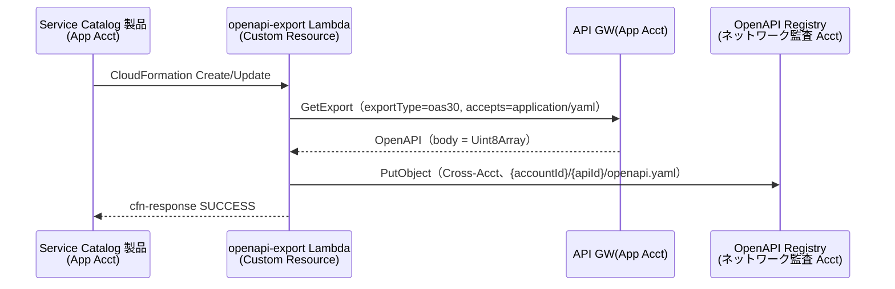
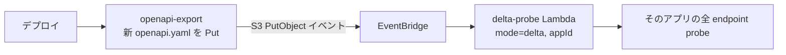

# 13. OpenAPI Registry 設計（S3）

前提: [00-basic-design-plan.md](00-basic-design-plan.md) / [10-external-monitoring-overview.md](10-external-monitoring-overview.md)
実装: [code-samples/openapi-export-lambda/](code-samples/openapi-export-lambda/) / データ契約: [code-samples/README.md §2.2/§2.3](code-samples/README.md)

---

## §13.0 前提と背景

**この章で定めること**: canary が「各アプリの endpoint 一覧と probe 制御情報」を得るための OpenAPI 置き場（S3）と、deploy 後の正本を自動 export する仕組み、アプリチームが付けるアノテーション。
**なぜ要るか**: canary は endpoint を**動的に**知る必要がある（アプリごとに違い、増減する）。OpenAPI を正本にすれば新規 endpoint も次回 deploy で自動追随する。

---

## §13.1 S3 バケット構造

ネットワーク監査 Acct に 1 バケット。

| 項目 | 値 |
|---|---|
| バケット | `<network-audit-acct>-openapi-registry` |
| キー | `{accountId}/{apiId}/openapi.yaml` |
| Versioning | 有効（正本の履歴を保持）|

canary は App Registry の `openApiS3Key` でこのキーを引き、`lib/openapi.js` の `fetchSpec` で取得・parse する。

> ⚠ **実装注意（Phase 4 検証で判明）**: LocalStack でのローカルテストは S3 の **virtual-host addressing** で失敗する（`forcePathStyle` 要）。これは LocalStack 固有で**実 AWS では発生しない**。full-run は SAM local か実 AWS で（[research](research/phase4-local-verification-results.md)）。

---

## §13.2 Export フロー（Custom Resource）

deploy 後の**実際の API GW 定義**を正本として S3 に置く。リポジトリの OpenAPI とずれても production と一致させるため、deploy 後に API GW から export する。



実装対応: [`openapi-export-lambda/index.js`](code-samples/openapi-export-lambda/index.js)。

> **公式確認（Phase 3）**: `GetExportCommand({ restApiId, stageName, exportType:'oas30', accepts:'application/yaml' })`、**body は `Uint8Array`** → `TextDecoder` で文字列化して Put。

---

## §13.3 OpenAPI アノテーション（アプリチームが付与）

canary の probe 挙動を OpenAPI 上で制御する。アプリチームは通常の API 設計に加えてこれらを書くだけ。

| アノテーション | 意味 | デフォルト |
|---|---|---|
| `x-synthetics-skip-auth-check: true` | Negative probe 対象外（public endpoint）| false（認証必須）|
| `x-canary-positive-test: true \| false \| pre-prod-only` | Positive test 実施 | false |
| `x-canary-test-token-secret: <name>` | 使用 token の Secret 名 | app の `testTokenSecret` |
| `x-canary-path-params: {key: value}` | path parameter の dummy 値 | — |
| `x-canary-cleanup: {action, path, idFrom}` | probe 後の後処理（POST 等）| — |
| `x-canary-auth-mode: cookie-redirect` | モノリス Cookie フロー | — |
| `x-canary-expected-redirect: /login` | Cookie モノリスの期待リダイレクト先 | — |

解釈は `lib/openapi.js` の `extractEndpoints`（[検証済み: openapi test 7 PASS](research/phase4-local-verification-results.md)）。

### §13.3.1 記述例

```yaml
paths:
  /api/users:
    get:
      x-canary-positive-test: true
      x-canary-test-token-secret: canary-central-readonly
  /api/orders:
    post:
      x-canary-positive-test: pre-prod-only     # 本番は Negative のみ（副作用回避）
      x-canary-cleanup: { action: DELETE, path: /api/orders/{orderId}, idFrom: response.body.orderId }
  /_/health:
    get:
      x-synthetics-skip-auth-check: true        # public
  /dashboard:
    get:
      x-canary-auth-mode: cookie-redirect        # SSR モノリス
      x-canary-expected-redirect: /login
```

---

## §13.4 新規 endpoint の自動追随

1. アプリチームが endpoint を追加（OpenAPI 更新）
2. deploy 時に openapi-export が新版を S3 に上書き
3. probe（M1/M3）が次回実行で新 endpoint を対象化

→ **probe のコード変更は不要**。OpenAPI を正本にすることで「監視対象の維持」が自動化される。

## §13.5 S3 Versioning による差分抽出（M1 の入力）

[18 章 M1（デプロイ差分）](18-scan-modes-and-scheduling.md) は「デプロイされたアプリを probe する」トリガに、この OpenAPI Export を使う。



- **M1 のトリガ = OpenAPI Export の S3 PutObject イベント**（= そのアプリがデプロイされた証跡）
- ⚠ **差分粒度はアプリ単位**（18 章 §18.2.1）: S3 versioning で新旧 diff は取れるが、**endpoint 単位に絞らず「そのアプリの全 endpoint」を probe** する。理由は、認証コードだけ変えて OpenAPI が不変なケース（middleware 削除等）を見逃さないため。S3 versioning の diff は「何が変わったか」の**参考情報**（アラート本文への付記）に使い、probe 範囲の絞り込みには使わない。

> **なぜ endpoint 単位に絞らないか**は 18 章 §18.2.1 の設計判断 D-M-18-2 参照。

---

## §13.5 設計判断

| ID | 判断 | 根拠 |
|---|---|---|
| D-M-13-1 | 正本は deploy 後の API GW から export（リポジトリの OpenAPI でなく）| production と一致保証、drift 防止 |
| D-M-13-2 | probe 制御は OpenAPI アノテーションで表現 | アプリチームの追加作業を最小化、endpoint と同じ場所で管理 |
| D-M-13-3 | Versioning 有効 | 正本の時点管理（監査・巻き戻し）|
| D-M-13-4 | 新規 endpoint は OpenAPI 更新で自動追随（canary 無改修）| 監視維持の自動化 |

---

## §13.6 未決事項

| ID | 内容 |
|---|---|
| M-Q-13-1 | OpenAPI を持たないレガシー API の扱い（App Registry に固定 endpoint リストを持たせる代替、14 章 §14.4）|
| M-Q-13-2 | S3 Object Lock（改ざん防止）の要否 |
| M-Q-13-3 | canary の S3Client に forcePathStyle 相当のテスト用オプションを持たせるか（本番不要）|
