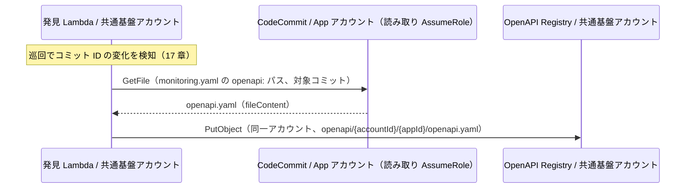

# 13. OpenAPI Registry 設計（S3）

前提: [00-basic-design-plan.md](00-basic-design-plan.md) / [10-external-monitoring-overview.md](10-external-monitoring-overview.md)
実装: 発見 Lambda がリポジトリから pull 取得（M-Q-17-4）/ データ契約: [code-samples/README.md §2.2/§2.3](code-samples/README.md)

---

## §13.0 前提と背景

**この章で定めること**: 認証実装確認処理が「各アプリの endpoint 一覧と probe 制御情報」を得るための OpenAPI 置き場（S3）と、**リポジトリ内の spec（正本）を巡回で自動取得する仕組み**、アプリチームが付けるアノテーション。
**なぜ要るか**: 認証実装確認処理は endpoint を**動的に**知る必要がある（アプリごとに違い、増減する）。リポジトリの OpenAPI を正本にすれば新規 endpoint も次回コミット→巡回で自動追随する。

---

## §13.1 S3 バケット構造（Monitoring Registry に同居）

共通基盤アカウントに **1 バケット（Monitoring Registry）**。台帳（[12 章](12-app-registry-design.md)）と spec コピーを**プレフィックスで同居**させ、監視系のストアを S3 1 つに集約する（[ADR-061 追記 2026-08-13](../../adr/061-deploy-detection-pull-model.md)）。

| 項目 | 値 |
|---|---|
| バケット | `<common-platform-acct>-monitoring-registry` |
| spec コピー | `openapi/{accountId}/{appId}/openapi.yaml`（本章）|
| 台帳 | `registry/{appId}/{env}.json`（12 章）|
| Versioning | 有効（履歴を保持）|

認証実装確認処理は台帳の `openApiS3Key` でこのキーを引き、`lib/openapi.js` の `fetchSpec` で取得・parse する。

> ⚠ **実装注意（Phase 4 検証で判明）**: LocalStack でのローカルテストは S3 の **virtual-host addressing** で失敗する（`forcePathStyle` 要）。これは LocalStack 固有で**実 AWS では発生しない**。full-run は SAM local か実 AWS で（[research](research/phase4-local-verification-results.md)）。

---

## §13.2 取得フロー（中央がリポジトリから pull）

**リポジトリ内の openapi.yaml（monitoring.yaml の `openapi:` で指定、[17 章 §17.3](17-deployment-integration-and-registration.md)）を正本**とし、発見 Lambda の巡回（[ADR-061 2026-08-07 改訂](../../adr/061-deploy-detection-pull-model.md)）がコミット変化を検知した際に `GetFile` で取得して S3 へ置く。アプリ側の Export 処理は存在しない。



> **⚠ 正本の性質（drift 注意）**: リポジトリの spec は「**コードが宣言する形**」であり、本番デプロイと乖離（drift）し得る。乖離は probe の実測で顕在化する（spec にあるが本番に無い → 404/WARN、公開印漏れ → P1）が、能動検出の要否は M-Q-17-6。旧方式（deploy 後の API GW から GetExport した「本番の実態」正本）との比較・変更経緯は ADR-061。
> 旧 GetExport 実装（[`openapi-export-lambda/`](code-samples/openapi-export-lambda/)、body=Uint8Array 等の公式確認済み）は参考保管。

---

## §13.3 OpenAPI アノテーション（アプリチームが付与）

probe 挙動を OpenAPI 上で制御する。アプリチームは通常の API 設計に加えてこれらを書くだけ。

### §13.3.0 公開明示は必須（default-deny）⭐

> **死守事項 MON-1**: すべての endpoint は **デフォルトで「認証必須」** とみなす。**認証不要（public）な endpoint は `x-synthetics-skip-auth-check: true` を必ず明示する**。明示のない endpoint は認証必須として Negative probe で検査し、未認証で 2xx が返れば CRITICAL/P1（認証漏れ）とする。

- **アノテーション未記載 = 認証必須**。「うっかり公開」を検知する側に倒すための default-deny 設計。
- public を意図する endpoint に**明示を付け忘れると、正しく公開していても "認証漏れ" として P1 アラートが出る** → アプリチームは明示せざるを得ない（＝必須が自然に強制される）。
- 公開明示は**唯一アプリが必ず書くべき監視用アノテーション**（他は任意）。これが「アプリは OpenAPI に公開印を付けるだけ」という責任境界の中核。
- 公開明示された endpoint も、それが**本当に公開してよいか**は別途セキュリティレビュー対象（無制限に skip を濫用させない。棚卸しは中央、[05 §5.2.3 AC-3](05-security.md) の例外申請と連動）。

| アノテーション | 意味 | デフォルト |
|---|---|---|
| `x-synthetics-skip-auth-check: true` | Negative probe 対象外（public endpoint）**※ public は必須明示（MON-1）** | false（認証必須）|
| `x-canary-positive-test: true \| false \| pre-prod-only` | Positive test 実施 | false |
| `x-canary-test-token-secret: <name>` | 使用 token の Secret 名 | app の `testTokenSecret` |
| `x-canary-path-params: {key: value}` | path parameter の dummy 値 | — |
| `x-canary-cleanup: {action, path, idFrom}` | probe 後の後処理（POST 等）| — |
| `x-canary-auth-mode: cookie-redirect` | モノリス Cookie フロー | — |
| `x-canary-expected-redirect: /login` | Cookie モノリスの期待リダイレクト先 | — |

解釈は `lib/openapi.js` の `extractEndpoints`（[検証済み: openapi test 7 PASS](research/phase4-local-verification-results.md)）。

### §13.3.1 記述例

```yaml
paths:
  /api/users:
    get:
      x-canary-positive-test: true
      x-canary-test-token-secret: canary-central-readonly
  /api/orders:
    post:
      x-canary-positive-test: pre-prod-only     # 本番は Negative のみ（副作用回避）
      x-canary-cleanup: { action: DELETE, path: /api/orders/{orderId}, idFrom: response.body.orderId }
  /_/health:
    get:
      x-synthetics-skip-auth-check: true        # public
  /dashboard:
    get:
      x-canary-auth-mode: cookie-redirect        # SSR モノリス
      x-canary-expected-redirect: /login
```

---

## §13.4 新規 endpoint の自動追随

1. アプリチームが endpoint を追加（リポジトリの openapi.yaml 更新）→ コミット
2. **次回巡回（最大 1h）で発見 Lambda がコミット変化を検知し、新版を GetFile → S3 に上書き**（§13.2）
3. 同じ巡回で M1 probe が起動し、新 endpoint も対象化

→ **probe のコード変更は不要**。リポジトリの OpenAPI を正本にすることで「監視対象の維持」が自動化される。

## §13.5 M1 との関係と S3 Versioning

**M1 のトリガは発見 Lambda の巡回差分（コミット ID 比較、[17 章 §17.2](17-deployment-integration-and-registration.md)）であり、S3 イベントではない**（[ADR-061](../../adr/061-deploy-detection-pull-model.md)）。OpenAPI Registry は「probe が読む正本のコピー」+「Versioning による履歴」を担う。

- ⚠ **差分粒度はアプリ単位**（18 章 §18.2.1）: 巡回はコミット変化で「変更があった」ことだけ判定し、**endpoint 単位に絞らず「そのアプリの全 endpoint」を probe** する。理由は、認証コードだけ変えて OpenAPI が不変なケース（middleware 削除等）を見逃さないため（コミット diff からも endpoint への影響は判定できない）。
- Git のコミット diff は「何が変わったか」の**参考情報**（アラート本文への付記）に使い、probe 範囲の絞り込みには使わない。

> **なぜ endpoint 単位に絞らないか**は 18 章 §18.2.1 の設計判断 D-M-18-2 参照。

---

## §13.6 設計判断

| ID | 判断 | 根拠 |
|---|---|---|
| D-M-13-1 | **正本はリポジトリ内の openapi.yaml**（git 単独検知への統一に伴い、旧「deploy 後の API GW から export」から変更）| コミット差分と同じ読み取り経路で完結（[ADR-061 改訂](../../adr/061-deploy-detection-pull-model.md)）。deploy との drift は probe 実測で顕在化（§13.2 注意）|
| D-M-13-2 | probe 制御は OpenAPI アノテーションで表現 | アプリチームの追加作業を最小化、endpoint と同じ場所で管理 |
| D-M-13-3 | Versioning 有効 | 正本の時点管理（監査・巻き戻し）|
| D-M-13-4 | 新規 endpoint は OpenAPI 更新で自動追随（probe 無改修）| 監視維持の自動化 |

---

## §13.7 未決事項

| ID | 内容 |
|---|---|
| M-Q-13-1 | OpenAPI を持たないレガシー API の扱い（App Registry に固定 endpoint リストを持たせる代替、14 章 §14.4）|
| M-Q-13-2 | S3 Object Lock（改ざん防止）の要否 |
| M-Q-13-3 | probe の S3Client に forcePathStyle 相当のテスト用オプションを持たせるか（本番不要）|
