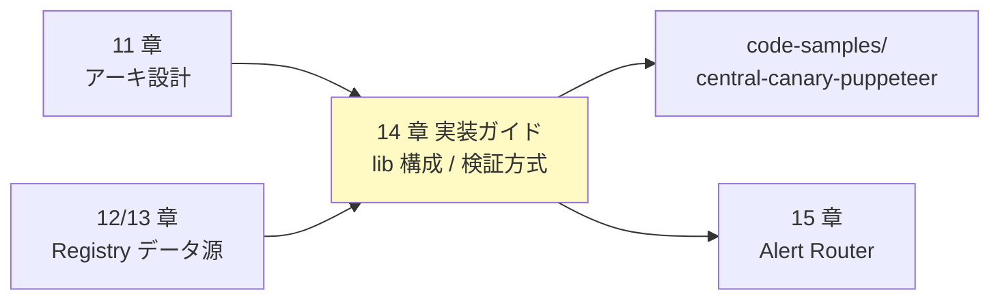

# 14. Canary 実装ガイド

前提: [00-basic-design-plan.md](00-basic-design-plan.md) / [11-central-canary-architecture.md](11-central-canary-architecture.md)
実装: [code-samples/central-canary-puppeteer/](code-samples/central-canary-puppeteer/) / [code-samples/multi-checks-blueprint/](code-samples/multi-checks-blueprint/)

---

## §14.0 前提と背景

**この章で定めること**: canary の実装構成（Puppeteer カスタムの内部モジュール / Multi Checks の使い分け / モノリス・Private 対応 / 要 PoC 項目）。
**主な判断軸**: 11 章のアーキを「動くコード」に落とす。実装は既に [code-samples/](code-samples/) にあり本章はその構造と使い方を説明する。

**本章の位置づけ（全体像の中で）**:

---

## §14.1 Puppeteer カスタム canary の構成

`central-canary-puppeteer/` のモジュール分割:

| ファイル | 役割 | 検証 |
|---|---|:---:|
| `index.js` | handler。全アプリ横断のオーケストレーション | — |
| `lib/registry.js` | App Registry(DDB) Scan | ✅ LocalStack |
| `lib/openapi.js` | OpenAPI(S3) 取得 + アノテーション解釈 | ✅ 7 test |
| `lib/token.js` | test token 取得 + OAuth Bearer 取得 + cache | — |
| `lib/probe.js` | 1 endpoint の Negative + Positive probe | ✅ 4 test |
| `lib/classify.js` | 4×4 真偽値表分類（alert-router と SSOT 共有）| ✅ 16 test |
| `lib/emit.js` | CloudWatch PutMetricData + Alert Router Invoke | — |

分割理由: `classify.js` を Alert Router と共有し**分類ずれを防ぐ**、`probe.js` の authPattern 分岐を独立テスト可能にする。

> runtime: `syn-nodejs-puppeteer-16.1` / namespace `@aws/synthetics-puppeteer` / SDK v3（11 章 §11.4）。

---

## §14.2 Multi Checks Blueprint（補助）

≤10 endpoint の固定セットを **JSON 設定だけ**で監視する軽量手段。`multi-checks-blueprint/`。

- runtime `syn-nodejs-5.1`、`CreateCanary` の `Code.BlueprintTypes=["multi-checks"]`
- **OAuth Client Credentials + Secrets Manager をネイティブサポート**（コード不要）
- スキーマ: トップレベル `steps` **オブジェクト**（キー "1"-"10"）、各 step は `stepName`/`checkerType`/`url`/`httpMethod`/`authentication`/`assertions`
- Secret 参照: `${AWS_SECRET:name}` / `${AWS_SECRET:name:key}`

> ⚠ **公式スキーマ確認（Phase 3）**: `checks` 配列ではなく `steps` オブジェクト。認証は `authentication.type` = `OAUTH_CLIENT_CREDENTIALS` / `API_KEY` / `BASIC` / `SIGV4`。

**使い分け**: 全アプリ横断・動的発見は Puppeteer（§14.1）、特定アプリの少数 endpoint を手軽に監視したい場合は Multi Checks。

---

## §14.3 モノリス / BFF 対応（API GW を使わない・Cookie セッション系）

`authPattern` で assertion 方式を切替え、**API GW 以外のアプリや BFF も監視**する。

| 構成 | authPattern | Negative 検証 |
|---|---|---|
| Public ALB + Cookie SSR | `alb-cookie-monolith` | 未認証 → **302 /login** を観測 |
| Public ALB + Bearer JWT（アプリコード検証）| `alb-code-jwt` | 401/403（API GW と同じ）|
| **BFF（SPA + BFF + API、[§C-API-2 §C-2.1.1.A](../proposal/common/02-runtime-selection-criteria.md)）** | **`bff-cookie-session`** | **ブラウザ↔BFF 入口を監視、未認証 → 401 or 302** |
| Lambda Function URL（IAM）| `lambda-url-iam` | 403 |
| CloudFront + ALB + SSR | 上記 + Origin Protection 経由 | 実 UX と同一 |

→ Cookie セッション系（`alb-cookie-monolith` / `bff-cookie-session`）は OpenAPI に `x-canary-auth-mode: cookie-redirect` を付ける（13 章 §13.3）。詳細は [ADR-059 §D](../../adr/059-central-auth-check-canary-architecture.md)。

### §14.3.1 BFF の 2 層と監視範囲

BFF は認証が 2 層（ブラウザ↔BFF=Cookie / BFF↔API=Bearer）。**外形監視は「ブラウザ↔BFF 入口」を見れば実質カバー**できる：

| 層 | 認証 | 外形監視 |
|---|---|---|
| ブラウザ → BFF | Cookie セッション | ✅ `bff-cookie-session` で probe（Negative: Cookie なし → 401/302）|
| BFF → API | Bearer（BFF が付与）| 内部通信で外部から見えない。API を独立監視するなら別レコードで `api-gw-jwt` 登録 |

→ **BFF 入口が正しく未認証を弾けば、背後 API は BFF 経由（+ Origin Protection / Private）でしか叩けない設計が前提**。API を公開している場合は API も別途登録する。

---

## §14.4 Private API 対応（VPC 内部）

Internal ALB / API GW Private endpoint など VPC 内部のみの API も監視可能（Phase 2）。

| Private 構成 | 到達手段 |
|---|---|
| API GW Private endpoint | VPC Interface Endpoint（`execute-api`）|
| Internal ALB / NLB | **Canary VPC + Transit Gateway 経由** |
| VPC Lattice Service | VPC Lattice Service Association |

→ Central Canary を **VPC 構成**にし、既存 Transit Gateway にアタッチすれば全 App Acct の Private endpoint に到達可能。Synthetics は VPC 実行を公式サポート（[VPC 実行](../proposal/common/06-external-api-auth-architecture.md)）。詳細は [ADR-059 §E](../../adr/059-central-auth-check-canary-architecture.md)。

---

## §14.5 要 PoC 検証項目（Phase 4 で未達、実 AWS / SAM 要）

課金ゼロのローカル検証（[research](research/phase4-local-verification-results.md)）で**ロジックは検証済み**だが、以下は実 AWS or SAM local が必要:

| 項目 | 必要環境 | 理由 |
|---|---|---|
| `@aws/synthetics-puppeteer` 実ランタイム | SAM local + Docker | Synthetics ランタイム再現 |
| Positive probe（OAuth Bearer 取得）| 実 IdP or モック /token | token.js の実挙動 |
| SigV4 Positive（api-gw-iam）| 実装（`@aws-sdk/signature-v4`）+ AWS | 手動署名が未実装 |
| Cookie モノリス Positive | Puppeteer ログインフロー実装 | 未実装（Negative は検証済）|
| CloudWatch metrics 着地 | 実 AWS（LocalStack は ListMetrics 限定）| emit.js の実挙動 |
| full orchestration E2E | SAM local or 実 AWS | S3 addressing / Lambda invoke |

→ full-run 手順は [research/phase4-environment-setup-guide.md](research/phase4-environment-setup-guide.md)。

---

## §14.6 テスト

`central-canary-puppeteer` の `node --test`: **27 PASS**（classify 16 + probe統合 4 + extractEndpoints 7）。probe統合は synthetics スタブ + 実 HTTP モックで認証漏れ（Neg=200→CRITICAL/P1）を実検知。

---

## §14.7 設計判断

| ID | 判断 | 根拠 |
|---|---|---|
| D-M-14-1 | Puppeteer canary を lib 分割（registry/openapi/token/probe/classify/emit）| 独立テスト + classify の SSOT 共有 |
| D-M-14-2 | Multi Checks は ≤10 固定 endpoint の補助 | OAuth ネイティブで手軽だが動的発見不可 |
| D-M-14-3 | モノリスは authPattern=alb-cookie-monolith で 302 検証 | API GW 非依存アプリを担保 |
| D-M-14-4 | Private は Canary VPC + TGW（Phase 2）| 既存 TGW を再利用し全 App Acct 到達 |
| D-M-14-5 | 要 PoC 項目をコード内 TODO + 本章 §14.5 に明示 | 「検証済み」と「未検証」を誤認させない |

---

## §14.8 未決事項

| ID | 内容 |
|---|---|
| M-Q-14-1 | SigV4 Positive / Cookie Positive / cleanup 実行の実装（Phase 2）|
| M-Q-14-2 | Multilocation（DR region replica）採否（Central 障害耐性）|
| M-Q-14-3 | Semgrep 言語別ルールと同様、authPattern 追加時の probe.js 拡張方針 |
