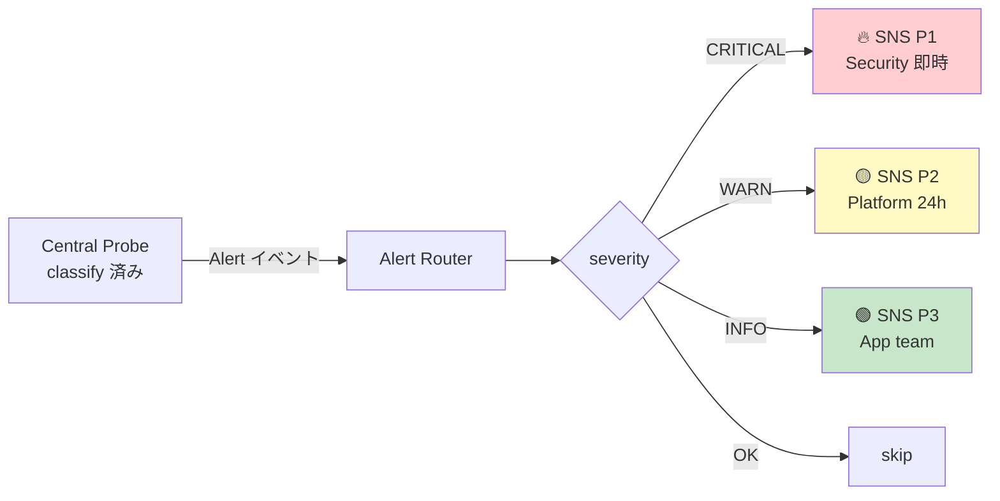
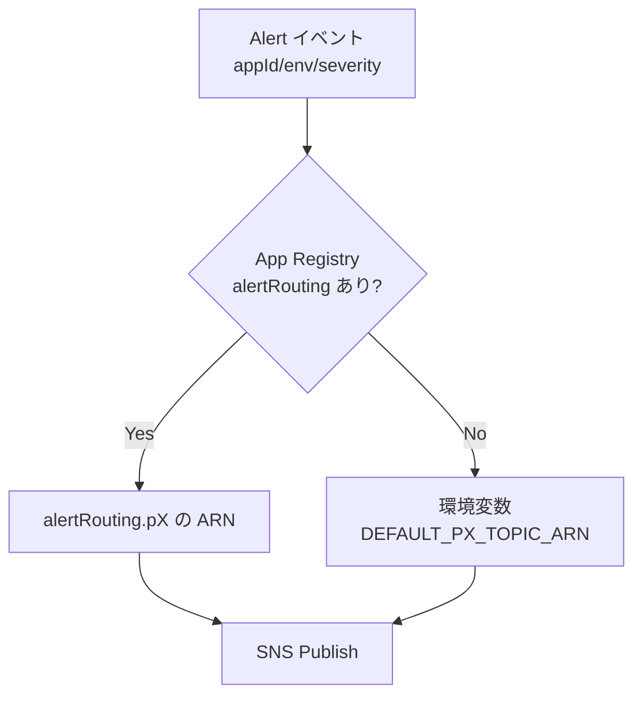

# 15. Alert Router 設計

前提: [00-basic-design-plan.md](00-basic-design-plan.md) / [11-central-probe-architecture.md](11-central-probe-architecture.md)
実装: [code-samples/alert-router-lambda/](code-samples/alert-router-lambda/) / データ契約: [code-samples/README.md §2.5/§2.6](code-samples/README.md)

---

## §15.0 前提と背景

**この章で定めること**: Central Probe が検知した非 OK（CRITICAL/WARN/INFO）を、**適切な担当・SLA の SNS トピックへ振り分ける**仕組み。
**なぜ要るか**: 「全部 Security に飛ばす」と誤検知（token 失効等）で Security を疲弊させる。4×4 分類で担当を分け、**誤った P1 を防ぐ**。

---

## §15.1 分類 → 通知先の対応

Central Probe の `classify.js`（11 章 §11.2.2）が付けた severity/priority で振り分ける。

| severity | priority | routingKey | 通知先 | SLA | 典型 |
|---|:---:|:---:|---|:---:|---|
| CRITICAL | P1 | p1 | Security オンコール | 即時 | 認証 missing（Neg=2xx）|
| WARN | P2 | p2 | Platform チーム | 24h | token 失効 / endpoint 不在 |
| INFO | P3 | p3 | App team | 通常 | Backend バグ（Pos=5xx）|
| OK | — | — | 通知なし | — | 正常 |

実装対応: [`alert-router-lambda/index.js`](code-samples/alert-router-lambda/index.js) + `lib/format.js`（SLA 文言整形）。

---

## §15.2 通知先 ARN の解決

Alert イベント（[README §2.6](code-samples/README.md)）**自体には SNS ARN が含まれない**。Alert Router が解決する:

1. **App Registry(DDB) の `alertRouting {p1,p2,p3}`** を appId/env で引く（12 章 §12.1）
2. 無ければ **環境変数 `DEFAULT_P1/P2/P3_TOPIC_ARN`** に fallback
3. どちらも無ければ ARN 未解決エラー → throw（DLQ / retry で可視化）

→ アプリ個別の通知先（alertRouting）と全社デフォルト（環境変数）の 2 段構え。

> **Phase 4 検証済み**（[LocalStack](research/phase4-local-verification-results.md)）: probe イベント（ARN なし）→ App Registry GetItem で alertRouting.p1 解決 → SNS Publish → 実 MessageId 取得。**本番ルーティング経路が end-to-end 成立**。

---

## §15.3 通知メッセージ

`lib/format.js` が severity 別に SLA 文言を付けて整形:
- Subject: どのアプリ・どの endpoint で何が起きたか
- Body: negStatus/posStatus、reason、対応 SLA（P1 即時 / P2 24h / P3 通常）
- MessageAttributes: severity / priority / appId / env（SNS フィルタ用）

---

## §15.4 バッチ耐性・エラー処理

- probe からの Invoke は単一イベント想定だが、**配列でも処理**（バッチ耐性）
- 1 件でも失敗したら throw → Lambda 失敗（retry / DLQ 発火）
- `classify.js` と `format.js` の `SEVERITY_META` が 4×4 の SSOT を共有（分類ずれ防止）

---

## §15.5 設計判断

| ID | 判断 | 根拠 |
|---|---|---|
| D-M-15-1 | 4×4 分類で P1/P2/P3 に振り分け（全部 Security でない）| 誤検知で Security を疲弊させない |
| D-M-15-2 | ARN は App Registry alertRouting → 環境変数デフォルトの 2 段解決 | アプリ個別 + 全社既定の両立 |
| D-M-15-3 | 分類ロジックは probe の classify.js と SSOT 共有 | 二重実装のずれ防止 |
| D-M-15-4 | ARN 未解決は throw（DLQ）| 設定不備を握り潰さず可視化 |

---

## §15.6 未決事項

| ID | 内容 |
|---|---|
| M-Q-15-1 | SNS の先（PagerDuty / Slack / メール）の接続方式 |
| M-Q-15-2 | P1 の自動 deny / rollback 連動の要否（05 章 §5.7 のインシデント対応と連携）|
| M-Q-15-3 | 誤検知抑制（同一 endpoint の連続アラート抑制 / dedup）|
