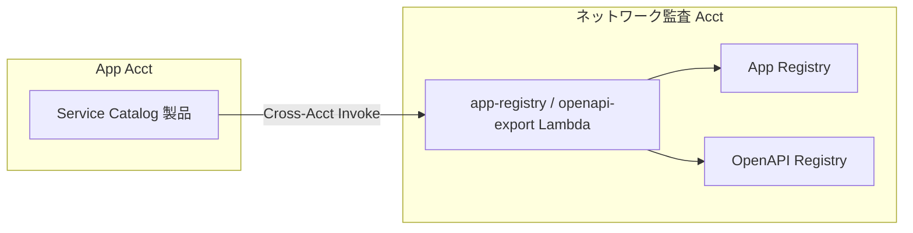

# 16. Cross-Account IAM / 配布設計

前提: [00-basic-design-plan.md](00-basic-design-plan.md) / [10-external-monitoring-overview.md](10-external-monitoring-overview.md)
実装: [code-samples/app-registry-lambda/](code-samples/app-registry-lambda/) / [code-samples/openapi-export-lambda/](code-samples/openapi-export-lambda/)
根拠: [ADR-039](../../adr/039-centralized-network-account-edge-layer.md) / [ADR-059](../../adr/059-central-auth-check-canary-architecture.md)

---

## §16.0 前提と背景

**この章で定めること**: ネットワーク監査 Acct（中央）と App Acct（各アプリ）の間で必要な IAM 権限と、Service Catalog 製品の配布方法。
**なぜ要るか**: Pattern β は「中央が全アプリを監視」するため、必然的にアカウントを跨ぐ。その権限を**最小限**に閉じ込める。

---

## §16.1 Cross-Account 要件の全体像

Pattern β で発生する Cross-Acct は **2 経路のみ**（それ以外は Public URL 経由で権限不要）。

| # | 経路 | 方向 | 手段 |
|---|---|---|---|
| 1 | App Registry 登録 | App Acct → ネットワーク監査 Acct | Custom Resource（12 章）|
| 2 | OpenAPI Export | App Acct → ネットワーク監査 Acct S3 | Custom Resource（13 章）|
| — | canary → アプリ probe | 中央 → App Acct | **Public CloudFront URL（権限不要）** |
| — | canary → OAuth /token | 中央 → 認証基盤 | **Public URL（権限不要）** |

→ **canary の probe 自体は Cross-Acct 権限を要さない**（実ユーザーと同じ Public 経路）。権限が要るのは Registry / OpenAPI の**書き込み**だけ。

---

## §16.2 Lambda 配置の 2 モデル

app-registry / openapi-export Lambda をどこに置くかで Cross-Acct の形が変わる。

### モデル A: 中央配置（推奨）

- Lambda を**中央に置き、App Acct からは Invoke するだけ**
- Cross-Acct は「Lambda Invoke 権限」1 点に集約
- Lambda 自身は同 Acct の DDB/S3 を書く（`CROSS_ACCT_ROLE_ARN` 不要）

### モデル B: App Acct 配置

- Lambda を App Acct に置き、STS AssumeRole で中央のロールを引き受けて DDB/S3 を書く
- `CROSS_ACCT_ROLE_ARN` を設定（実装は対応済み: `buildDocClient`）
- Cross-Acct の複雑性が各 App Acct に分散する

→ **モデル A を推奨**（Cross-Acct を中央の Invoke 権限に閉じ込め、App Acct 側の設定を最小化）。

---

## §16.3 必要な IAM（モデル A）

| ロール | 所在 | 信頼 | 権限 |
|---|---|---|---|
| `CentralRegistryFn-InvokeRole` | App Acct | Service Catalog / CFN | 中央 Lambda の `lambda:InvokeFunction` |
| `app-registry-lambda-role` | ネットワーク監査 Acct | Lambda | `dynamodb:PutItem/DeleteItem`（App Registry）|
| `openapi-export-lambda-role` | ネットワーク監査 Acct | Lambda | `apigateway:GET`（App Acct の RestApi、Cross-Acct）+ `s3:PutObject`（Registry）|
| `CentralCanaryRole` | ネットワーク監査 Acct | Synthetics | DDB Scan / S3 Get / Secrets Get / CloudWatch Put / Lambda Invoke（Alert Router）|

> openapi-export は「App Acct の API GW を export → 中央 S3 に Put」のため、GetExport は App Acct リソースへの Cross-Acct read が要る（App Acct 側で Resource Policy or AssumeRole）。

---

## §16.4 Service Catalog 製品の配布

- 製品（API GW 構築 + Origin Protection + App Registry 登録 + OpenAPI Export の Custom Resource）を **StackSets or Service Catalog Portfolio 共有**で全 App Acct に配布
- アプリチームは製品を起動するだけで、認証必須 / Origin Protection / 監視登録が自動充足（[§C-API-5](../proposal/common/05-self-service-catalog.md)）

---

## §16.5 ⚠ ROSA 側前提との責任分界（BD-Q-01）

ADR-039 v2 では「ネットワーク監査 Acct = 自管理」前提だが、ROSA 側基本設計 P-18 で「**インターネット境界（CloudFront/WAF）は他組織管理の監査アカウント**」に変わる可能性がある。

| 影響 | 対応 |
|---|---|
| CloudFront / Origin Protection の管理主体 | 他組織なら、canary の probe 先 URL / Origin Protection secret の運用を他組織と調整 |
| Central Canary の配置 Acct | 「ネットワーク監査 Acct」が他組織管理なら、canary は自社側の別 Acct に置く再設計が要る |

→ **本章は自管理前提で記述**。P-18 確定時に probe 先経路と canary 配置を差分改訂する（BD-Q-01）。

---

## §16.6 設計判断

| ID | 判断 | 根拠 |
|---|---|---|
| D-M-16-1 | Cross-Acct はモデル A（中央 Lambda + App Acct から Invoke）を推奨 | Cross-Acct を Invoke 権限 1 点に集約、App Acct 設定を最小化 |
| D-M-16-2 | canary の probe は Public URL 経由で Cross-Acct 権限不要 | 実 UX 同一 + 権限を書き込みだけに限定 |
| D-M-16-3 | 製品配布は StackSets / Portfolio 共有 | 全 App Acct への一括配布 |
| D-M-16-4 | ROSA 側 P-18 確定まで自管理前提で記述、差分改訂 | 前提変更に追随（BD-Q-01）|

---

## §16.7 未決事項

| ID | 内容 |
|---|---|
| BD-Q-01 | ROSA 側 P-18（監査アカウント他組織管理）確定時の responsibility 改訂 |
| M-Q-16-1 | モデル A / B の最終選定（運用体制との整合）|
| M-Q-16-2 | openapi-export の GetExport Cross-Acct read の実装方式（Resource Policy vs AssumeRole）|
