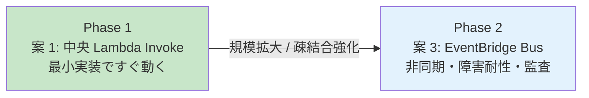

# 16. Cross-Account IAM / 配布設計

前提: [00-basic-design-plan.md](00-basic-design-plan.md) / [10-external-monitoring-overview.md](10-external-monitoring-overview.md)
実装: [code-samples/app-registry-lambda/](code-samples/app-registry-lambda/) / [code-samples/openapi-export-lambda/](code-samples/openapi-export-lambda/)
根拠: [ADR-039](../../adr/039-centralized-network-account-edge-layer.md) / [ADR-059](../../adr/059-central-auth-check-canary-architecture.md)

---

## §16.0 前提と背景

**この章で定めること**: ネットワーク監査アカウント（中央）と App アカウント（各アプリ）の間で必要な IAM 権限と、Service Catalog 製品の配布方法。
**なぜ要るか**: Pattern β は「中央が全アプリを監視」するため、必然的にアカウントを跨ぐ。その権限を**最小限**に閉じ込める。

---

## §16.1 Cross-Account 要件の全体像

Pattern β で発生する クロスアカウントは **2 経路のみ**（それ以外は Public URL 経由で権限不要）。

| # | 経路 | 方向 | 手段 |
|---|---|---|---|
| 1 | App Registry 登録 | App アカウント → ネットワーク監査アカウント | Custom Resource（12 章）|
| 2 | OpenAPI Export | App アカウント → ネットワーク監査アカウント S3 | Custom Resource（13 章）|
| — | probe → アプリ | 中央 → App アカウント | **Public CloudFront URL（権限不要）** |
| — | probe → OAuth /token | 中央 → 認証基盤 | **Public URL（権限不要）** |

→ **probe 自体は クロスアカウント 権限を要さない**（実ユーザーと同じ Public 経路）。権限が要るのは Registry / OpenAPI の**書き込み**だけ。

---

## §16.2 Cross-Account 登録の設計案比較（5 案）

App Registry / OpenAPI Registry への書き込みを、App アカウントからどう中央へ届けるか。5 案を比較する。

| 案 | 仕組み | 権限最小 | 実装 | App アカウント 負担 | 疎結合 | 障害耐性 |
|---|---|:---:|:---:|:---:|:---:|:---:|
| **1: 中央 Lambda + クロスアカウント Invoke** | App アカウントが中央 Lambda を Invoke | ✅ Invoke 1 点 | ✅ 低 | ✅ 小 | △ | △ |
| **2: App アカウント Lambda + AssumeRole** | App アカウント Lambda が中央ロールを引受け書込 | ⚠ AssumeRole 各所 | ⚠ 中 | ⚠ 中 | △ | △ |
| **3: EventBridge クロスアカウント Bus** | App アカウント → 中央 Event Bus → 中央 Lambda | ✅ PutEvents 1 点 | ⚠ 中 | ✅ 小 | ✅ 高 | ✅ 高（非同期）|
| **4: DynamoDB Resource Policy 直書き** | App アカウント ロールに中央 DDB PutItem を許可 | ❌ DDB 直開放 | ✅ 低 | ✅ 小 | ✗ | △ |
| **5: 中央 S3 に Put → S3 イベントで DDB 反映** | App アカウント → 中央 S3（Bucket Policy）→ 反映 | ✅ S3 Put 1 点 | ⚠ 中 | ✅ 小 | ✅ 高 | ✅ 高 |

### §16.2.1 各案の要点

- **案 1（中央 Lambda Invoke）**: クロスアカウントを「Lambda Invoke 権限 1 点」に集約、実装最小。ただし同期呼び出しで、中央 Lambda 障害時に deploy がブロックされうる。→ **Phase 1 の第一候補**。
- **案 2（AssumeRole）**: App アカウント側に AssumeRole ロジックが分散、クロスアカウント 複雑性が各アプリに広がる。実装は `buildDocClient`（`CROSS_ACCT_ROLE_ARN`）で対応済み。
- **案 3（EventBridge Bus）**: App アカウントが中央 Event Bus に `PutEvents` するだけ。**非同期・疎結合**で中央障害でもイベント滞留 → 後処理。EventBridge Archive で監査も付く。→ **規模拡大時の移行先**。
- **案 4（DDB Resource Policy 直書き）**: 中央 DDB を クロスアカウント 直開放 = **最も広い攻撃面**。誤操作・悪用リスク大。**非推奨**。
- **案 5（中央 S3 + イベント）**: App アカウントが登録 JSON を中央 S3 に Put、S3 イベントで反映。OpenAPI Export と書込経路を統一できる。疎結合。

### §16.2.2 段階採用

| 重視点 | 推奨案 |
|---|---|
| 最小実装・すぐ動く | **案 1**（中央 Lambda Invoke）|
| 疎結合・障害耐性・監査 | **案 3**（EventBridge Bus）|
| セキュリティ最小面 | 案 1 or 案 3（**案 4 は避ける**）|

→ **Phase 1 は案 1 で立ち上げ、規模拡大時に案 3 へ移行**。`app-registry` Lambda は案 1（中央配置）/ 案 2（App アカウント 配置）の両構成に実装対応済み。

---

## §16.3 必要な IAM（モデル A）

| ロール | 所在 | 信頼 | 権限 |
|---|---|---|---|
| `CentralRegistryFn-InvokeRole` | App アカウント | Service Catalog / CFN | 中央 Lambda の `lambda:InvokeFunction` |
| `app-registry-lambda-role` | ネットワーク監査アカウント | Lambda | `dynamodb:PutItem/DeleteItem`（App Registry）|
| `openapi-export-lambda-role` | ネットワーク監査アカウント | Lambda | `apigateway:GET`（App アカウントの RestApi、クロスアカウント）+ `s3:PutObject`（Registry）|
| `CentralProbeRole` | ネットワーク監査アカウント | 認証チェック Lambda | DDB Scan / S3 Get / Secrets Get / CloudWatch Put / Lambda Invoke（Alert Router）|

> openapi-export は「App アカウントの API GW を export → 中央 S3 に Put」のため、GetExport は App アカウント リソースへの クロスアカウント read が要る（App アカウント側で Resource Policy or AssumeRole）。

---

## §16.4 Service Catalog 製品の配布

- 製品（API GW 構築 + Origin Protection + App Registry 登録 + OpenAPI Export の Custom Resource）を **StackSets or Service Catalog Portfolio 共有**で全 App アカウントに配布
- アプリチームは製品を起動するだけで、認証必須 / Origin Protection / 監視登録が自動充足（[§C-API-5](../proposal/common/05-self-service-catalog.md)）

---

## §16.5 ⚠ ROSA 側前提との責任分界（BD-Q-01）

ADR-039 v2 では「ネットワーク監査アカウント = 自管理」前提だが、ROSA 側基本設計 P-18 で「**インターネット境界（CloudFront/WAF）は他組織管理の監査アカウント**」に変わる可能性がある。

| 影響 | 対応 |
|---|---|
| CloudFront / Origin Protection の管理主体 | 他組織なら、probe 先 URL / Origin Protection secret の運用を他組織と調整 |
| 中央認証チェックの配置 アカウント | 「ネットワーク監査アカウント」が他組織管理なら、認証チェック Lambda は自社側の別 アカウントに置く再設計が要る |

→ **本章は自管理前提で記述**。P-18 確定時に probe 先経路と 認証チェック Lambda 配置を差分改訂する（BD-Q-01）。

---

## §16.6 設計判断

| ID | 判断 | 根拠 |
|---|---|---|
| D-M-16-1 | クロスアカウントは Phase 1 = 案 1（中央 Lambda + App アカウントから Invoke）、規模拡大時 = 案 3（EventBridge Bus）| Invoke 権限 1 点に集約、疎結合強化は EventBridge へ移行（§16.2）。案 4（DDB 直開放）は避ける |
| D-M-16-2 | probe は Public URL 経由で クロスアカウント 権限不要 | 実 UX 同一 + 権限を書き込みだけに限定 |
| D-M-16-3 | 製品配布は StackSets / Portfolio 共有 | 全 App アカウントへの一括配布 |
| D-M-16-4 | ROSA 側 P-18 確定まで自管理前提で記述、差分改訂 | 前提変更に追随（BD-Q-01）|

---

## §16.7 未決事項

| ID | 内容 |
|---|---|
| BD-Q-01 | ROSA 側 P-18（監査アカウント他組織管理）確定時の responsibility 改訂 |
| M-Q-16-1 | モデル A / B の最終選定（運用体制との整合）|
| M-Q-16-2 | openapi-export の GetExport クロスアカウント read の実装方式（Resource Policy vs AssumeRole）|
