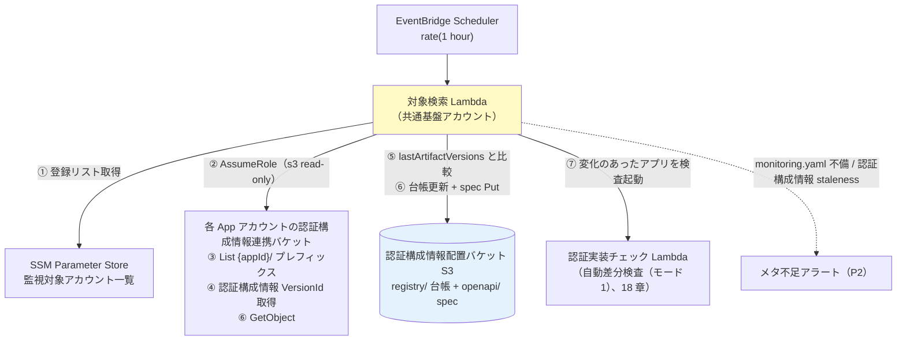
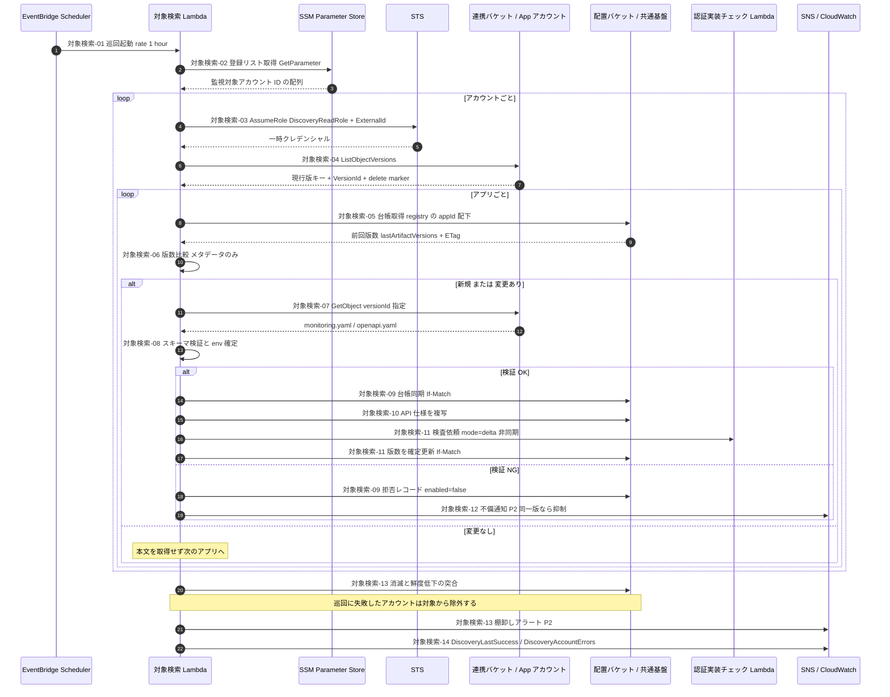

# 17. デプロイ検知と登録（中央巡回 pull 型・S3 認証構成情報方式）

前提: [00-basic-design-plan.md](00-basic-design-plan.md) / [12-app-registry-design.md](12-app-registry-design.md) / [16-cross-account-iam-design.md](16-cross-account-iam-design.md)
根拠 ADR: [ADR-061 デプロイ検知の pull 型統一（2026-08-21 追記: S3 認証構成情報方式）](../../adr/061-deploy-detection-pull-model.md) / 検討経緯: [research/external-git-artifact-store-study.md](research/external-git-artifact-store-study.md)

---

## §17.0 前提と背景

**この章で定めること**: 「アプリに変更があったことをどう検知し、App Registry に載せるか」。

**前提（2026-08-21 更新）**: 各アプリのコードリポジトリは**開発ベンダーごとに外部（GitHub 等）にあり、中央からは読めない**。そこで git を読む代わりに、**デプロイパイプラインの最終段で「認証構成情報」（monitoring.yaml / openapi.yaml）を各 App アカウントの認証構成情報連携バケットへアップロード**してもらい、中央はそれだけを読む。

**方式**: **中央巡回（pull 型）× 認証構成情報 VersionId 比較**。共通基盤アカウントの**対象検索 Lambda（旧称: 発見 Lambda）が 1 時間毎に各 App アカウントの認証構成情報連携バケットを読み取り巡回**し、「**前回確認した認証構成情報バージョンからの変化**」を検知する。登録・spec 取得・自動差分検査（モード1、旧称 M1）の起動はすべて中央側で行い、**アプリ側のイベント・登録処理には依存しない**（トリガーは中央が引く）。

**認証構成情報オンリー原則（2026-08-21 確定）**: 中央が App アカウントで読むのは**アップロードされた認証構成情報だけ**。git・API GW 構成（deploymentId 含む）・その他の AWS リソースは読まない。クロスアカウントの線を「S3 読み取り 1 本」に絞り、権限説明と通信経路を最小化する（deploymentId 併読は 2026-08-19 に導入、**2026-08-21 に廃止**。経緯は ADR-061）。

**責任分界（顧客合意事項）**: **認証構成情報のアップロード漏れ・内容の誤りは、原則アプリ（ベンダー）側の責任**とする。中央は検知網（§17.2.2 の staleness 検知・棚卸し・日次全量検査）で補助するが、「認証構成情報が正しく上がっていること」の保証責任は負わない。**この分界は顧客・ベンダーとの合意が必要**（M-Q-17-7）。

**なぜ pull か**: 認証実装確認処理は App Registry に載っているアプリしか検査しない。**登録漏れ = 監視漏れ**。pull 型は「中央が発見する側」なので、**巡回対象アカウントの中では**アプリの登録漏れが構造的に起きない（連携バケットに `{appId}/monitoring.yaml` が置かれた時点で自動登録される）。

> 【注意・2026-09-16 変更】この「構造的にゼロ」が成り立つのは**アプリ単位**まで。連携バケットと読み取りロールを**案件側が作成する**方式にしたため、**アカウント単位は申請ベース**（中央の登録リストへの登録）になり、**登録漏れが起きうる**。登録されていないアカウントのアプリは一切監視されないため、月次棚卸し（M-Q-17-3）がアカウント単位の唯一の検出手段になる。

---

## §17.1 Service Catalog 製品の役割（登録処理は持たない）

**AWS Service Catalog** = 承認済み IaC テンプレートを組織内に配布するサービス。「**製品（Product）**」= 1 つのテンプレート。

```
製品「api-gateway-rest-public」の中身（§C-API-5）:
  ├─ API Gateway（REST）… 認証必須（AuthorizationType != NONE）を固定
  ├─ Origin Protection（Resource Policy + Custom Header）  ← ADR-039 §C-4
  └─ 必須タグ（app-id / env / cost-center / owner）← 03 章 BL-1（課金按分用）
```

- 製品は「**正しく守られた API を作る**」ことに専念し、「**見つけて登録する**」のは中央の対象検索 Lambda が担う（§17.2）。
- アプリチーム（ベンダー）がやることは 3 つだけ:

| 手順 | 内容 |
|---|---|
| 1 | Service Catalog で製品を **launch**（AppId / Env / CostCenter / Owner を入力 → タグ付与）|
| 2 | **デプロイパイプラインの最終段で認証構成情報（monitoring.yaml / openapi.yaml）を認証構成情報連携バケットへアップロード**（§17.3。専用アップロードロールを Assume。CI からの AWS 接続方式はアプリごとの既存方式で可）|
| 3 | OpenAPI に **公開印（[MON-1](13-openapi-registry-design.md)）** を付ける（public endpoint のみ `x-synthetics-skip-auth-check: true`）|

→ 登録・spec 取得は**中央が自動で行う**ため、アプリ側に登録コード・登録イベントはない。アップロードは**デプロイ成功後**に行うため、「認証構成情報あり = その版がデプロイ済み」が成り立つ（§17.2.2）。

---

## §17.2 中央巡回による発見・差分検知（自動差分検査（モード1）トリガー）

### §17.2.1 巡回フロー

**EventBridge Scheduler（1 時間毎）→ 対象検索 Lambda（共通基盤アカウント）**:



#### 巡回シーケンス図（対象検索-01〜14）

処理設計（`doc/excel/apipf-process-design.xlsx`）の処理 ID と対応する。各処理の I/O・例外はそちらのシートが正。



| ステップ | 内容 |
|---|---|
| ① 登録リスト取得 | 巡回対象の App アカウントを **SSM Parameter Store の登録リスト**から取得する（`ssm:GetParameter`）。**Organizations の `ListAccounts` は使わない**（2026-09-16 確定。バケットとロールを案件側が作る方式では組織全体を列挙しても監視対象を判別できず、判別のための AssumeRole 試行が `DiscoveryAccountErrors`（MM-3）の常時発報を招くため）。リストが空なら巡回を中断 |
| ② AssumeRole | 各アカウントの**読み取り専用ロール**（認証構成情報連携バケットの s3 read のみ）で入る。**ロールは案件側が中央提供のテンプレートで作成する**（2026-09-16 変更、16 §16.4）|
| ③ 認証構成情報列挙 | 認証構成情報連携バケットの `{appId}/` プレフィックスを List。**`{appId}/monitoring.yaml` が置かれている = 監視対象**（§17.3）|
| ④ バージョン取得 | monitoring.yaml / openapi.yaml の **VersionId**（と ETag）を取得 |
| ⑤ 差分判定 | 台帳の **`lastArtifactVersions`** と比較。違えば「**前回確認から認証構成情報が更新された = 新しい版がデプロイされた**」|
| ⑥ 内容取得 | 変化したアプリのみ `GetObject` で monitoring.yaml / openapi.yaml を取得し、台帳更新・OpenAPI Registry へ Put（13 章）|
| ⑦ 自動差分検査（モード1）起動 | 変化のあったアプリを対象に認証実装チェック Lambda を invoke（`{mode:'delta', appId, env, origin:'delta'}`、18 章）。**invoke が受理（202）された時点**で `lastArtifactVersions` を更新する（検査の完了は待たない。18 §18.5.2 at-least-once）|
| 新規発見 | 台帳に無い `{appId}/monitoring.yaml` は**自動登録**。**登録済みアカウントの中では**アプリの登録漏れが起きない（アカウント単位は §17.0 の注記参照）|
| 消滅検知 | 認証構成情報（monitoring.yaml）の削除は台帳を `enabled=false` に（棚卸しアラート）|

> 変更検知の単位は**認証構成情報オブジェクト**（マルチパートアップロードでは ETag が MD5 と一致しないため、**VersionId 主・ETag 副**で比較する。認証構成情報連携バケットは Versioning 必須、16 章）。

**差分判定の 3 原則**（実装時に取り違えやすいため明示）:

| # | 原則 | 理由 |
|---|---|---|
| 1 | **比較するのは対象検索 Lambda**（App アカウントの認証構成情報 VersionId ↔ 中央台帳の `lastArtifactVersions`）。認証実装チェック Lambda は差分を一切知らない | 責務分離。チェック Lambda はモード1/モード2 とも「渡された appId を検査するだけ」で同一実装になる。台帳更新のタイミング（起動成功後のみ = at-least-once、§17.2.1 ⑦）も 1 箇所に閉じる |
| 2 | **比較対象はメタデータ（VersionId）であり、ファイルの内容ではない**。内容ハッシュ比較にしてはならない | **アップロードされた＝デプロイされた、を検知したい**ため。認証構成情報の中身が前回と同一でも、コードの変更で認証 middleware が外れている可能性がある（この見逃しこそ本監視が防ぎたい事象）。内容比較にすると「spec 不変のデプロイ」を丸ごと取りこぼす。副次的に、変化がないアプリは `GetObject` すら不要でクロスアカウント転送がゼロになる |
| 3 | **差分は「起動のトリガー」であって「検査範囲の絞り込み」ではない** | 変更のあったアプリは**全 endpoint** を検査する（18 §18.2.1）。どの endpoint が変わったかを認証構成情報差分から求める必要はない |

### §17.2.2 検知の特性（穴と補完）

**検知遅延**: アップロード後**最大 1 時間**。一次防衛は deploy 前ガード（04 章静的解析 + 製品テンプレ）であり、外形監視は検知網のため許容（[ADR-061](../../adr/061-deploy-detection-pull-model.md)）。

**認証構成情報シグナルで拾えないもの（補完レイヤーで受け持つ、2026-08-21 更新）**:

| 穴 | 内容 | 補完レイヤー |
|---|---|---|
| **コンソール直変更** | コンソールで Authorizer を外す等、認証構成情報に現れない変更 | ② **L2 Config Rules の実体化**（`AuthorizationType=NONE` の drift 検知。実在確認の上、無ければ実装）① **ガイド・Runbook に「変更は必ず CI/CD 経由」を明記** + **全量検査（モード2、日次定期）が挙動レベルで最大 24h で捕捉**。～2026-08-21 は ③ deploymentId 併読（1h 検知）も持っていたが、**認証構成情報オンリー原則により廃止**（検知は 24h に緩和。設定レベルの即時性は Config Rules が受け持つ）。SCP による防止は Phase 2 判断（§17.5）|
| **アップロード忘れ・認証構成情報の誤り** | デプロイしたのに認証構成情報を上げていない / 内容が実態と違う → 古い spec のまま検査され、**新設 endpoint が検査対象に入らない** | **原則アプリ責任（顧客合意 M-Q-17-7）**。中央の補助検知: (a) **staleness 検知** — 認証構成情報の最終更新が閾値（例 90 日）超のアプリを棚卸しアラート (b) **月次棚卸し** — API 提供契約 / タグと台帳の突合（M-Q-17-3）(c) 日次全量検査は**既知の endpoint については**認証漏れを継続捕捉 |
| **アップロード ≠ デプロイの逆転** | 手順違反でデプロイ前にアップロードした場合の偽安心 | アップロードは「デプロイ成功後」を規約・パイプライン例で固定（04 章）。逆転しても次回巡回・日次全量が実態基準で再検査 |

→ 外形監視は検知 5 レイヤーの L5（[§C-6.6](../proposal/common/06-external-api-auth-architecture.md)）であり、**単層で完結させず L2（Config）と組み合わせて穴を塞ぐ**のが前提。

### §17.2.3 認証構成情報とデプロイの関係

- 認証構成情報は**デプロイされた版の写し**であり、git のブランチ・コミットの概念は中央からは見えない（追跡が必要な場合は任意の `deploy-info.json` に commitId 等を書ける、§17.3）
- probe の範囲は従来どおり**アプリ単位の全 endpoint**（endpoint 単位に絞らない。認証 middleware 削除は差分からどの endpoint に効くか判定できないため、18 章 §18.2.1）

---

## §17.3 認証構成情報の規約（S3・config-as-code）

監視メタデータは**各 App アカウントの認証構成情報連携バケット**に規定キーで置く。**`{appId}/monitoring.yaml` がある = 監視対象**。

```
s3://auth-monitoring-artifacts-{accountId}/     ← 案件側が作成（Versioning 有効、16 §16.4）
  {appId}/
    monitoring.yaml      # 監視宣言（下記）
    openapi.yaml         # デプロイした版の spec（正本はベンダー git、これはデプロイ版の写し）
    deploy-info.json     # 任意: { "commitId": "…", "deployedAt": "…", "pipelineRunId": "…" }
```

```yaml
# {appId}/monitoring.yaml
appId: expense-api               # プレフィックスと一致必須
environments:
  prod:
    baseUrl: https://expense.example.com   # probe 先（CloudFront URL）
    authPattern: api-gw-jwt                # 検査方式（11 章 §11.3 の enum）
  stg:
    baseUrl: https://stg.expense.example.com
    authPattern: api-gw-jwt
testTokenSecret: canary-central-readonly   # 省略時は共通（11 章 §11.3.1）
```

| 項目 | 規約 | 不備時の挙動 |
|---|---|---|
| `{appId}/monitoring.yaml` | **必須**（これが監視対象の宣言）| API 提供契約 / タグがあるのに認証構成情報が無い場合は**棚卸しで検出**（M-Q-17-3）|
| `appId` | プレフィックスと一致必須 | 不一致は**取り込み拒否 + メタ不足アラート** |
| `authPattern` | enum（README §2.1）| 既定 `api-gw-jwt` で **Negative のみ検査** + メタ不足アラート |
| `baseUrl` | CloudFront URL（12 §12.1.1）。**ホストは ① 組織の許可ドメインサフィックス配下 ② そのアプリのドメイン（1 アプリ = 1 ホスト）の 2 段検証を通ること**（2026-09-14 確定。外向き通信の宛先がここで決まるため、実質的な宛先 allowlist の入口になる）| 欠落・形式不正は検査不能 → メタ不足アラート。**許可ドメイン外 / 他アプリのドメインは取り込み拒否（既定値で継続しない）+ 重大度を上げて通知**（対象検索-08）|
| `openapi.yaml` | 同プレフィックスに併置 | 無い場合は endpoint リストを monitoring.yaml に列挙（モノリス等、§17.4）|
| `deploy-info.json` | **任意**（commitId 等の追跡用参考値。中央は検知に使わない）| — |
| 通知先（alertRouting）| **認証構成情報に書かない**（SNS ARN を外部ベンダーの手に置かない）。台帳側で共通基盤チームが管理、未設定は全社デフォルト（15 章）| — |
| `enabled`（一時停止）| **認証構成情報に書かない**。台帳側で中央管理（アプリ側の勝手な監視停止を防ぐ）| — |

**アップロード権限（16 章が正）**: 認証構成情報連携バケットには**アプリ単位の専用アップロードロール**（`{appId}/` プレフィックス限定の `s3:PutObject` のみ。デプロイロールとは分離）を置く。**作成するのは案件側**で、中央が提供するテンプレートを使う（2026-09-16 変更、16 §16.4）。ベンダー CI はこのロールを各自の接続方式で Assume する。1 ベンダー複数アプリの場合もロールは**アプリ単位**（他アプリの認証構成情報は書けない）。

> 旧方式（リポジトリ直下の monitoring.yaml、`pathPrefix`/`branch`/`openapi` パス指定）は CodeCommit 前提の規約で **2026-08-21 廃止**。認証構成情報はアプリ単位でアップロードされるため、モノレポのパス突合・ブランチ指定は不要になった。リソースタグ（app-id / cost-center 等）は課金按分用として従来どおり必須（03 章 BL-1）。

---

### §17.3.1 不備時の取り込み拒否レコード（2026-09-14 確定）

認証構成情報に不備があり取り込めない場合、**台帳に「拒否レコード」を残す**（対象検索-08 / 09 / 12）。

| 項目 | 値 | 意味 |
|---|---|---|
| `enabled` | `false` | 監視対象に入れない（検査は起動しない）|
| `lastRejectedVersions` | 拒否した認証構成情報の VersionId | **同じ版では再通知しない**ための判定キー |
| `rejectedReason` | 不備種別 | 何が悪かったか（appId 不一致 / baseUrl 欠落 など）|

**狙いは 2 つ**:

1. **再通知の抑制** — 毎時の巡回で同じ不備を通知し続けると、1 件の不備で 1 日 24 通の P2 が飛ぶ。同じ版なら通知しない（アプリが修正して再アップロードすれば VersionId が変わり、自動的に再評価・再通知される）
2. **未監視アプリの可視化** — 「不備のせいで監視に入っていないアプリ」が台帳上で見える。月次棚卸し（§17.2.2）の材料になる

新規アプリで不備があった場合も、**最小のレコードを作って拒否状態を記録する**（記録する場所が必要なため）。正常に取り込めた時点で `lastRejectedVersions` / `rejectedReason` はクリアする。

> スキーマ定義は [12 章 §12.1](12-app-registry-design.md) / [README §2.1](code-samples/README.md)。

---

## §17.4 モノリス（API GW なし）の扱い → 自動発見の対象

認証構成情報のアップロードは構成を問わないため、モノリスも同じ仕組みで自動発見できる。

| アプリ種別 | 発見 | 変更検知 | endpoint 一覧 |
|---|---|---|---|
| API GW ベース | `{appId}/monitoring.yaml` で自動 | 認証構成情報 VersionId 比較 | 併置の openapi.yaml |
| **Cookie モノリス（ALB 直）** | **同じ** | **同じ**（認証構成情報 VersionId 比較。手動変更は Config Rules / 全量検査(モード2、日次)）| openapi.yaml（無ければ endpoint リストを monitoring.yaml に列挙）|

---

## §17.5 SCP による強制（オプション）

Service Catalog 製品を全社標準にする場合、**製品外の直接 API GW 作成・変更を SCP で禁止**すれば、認証構成情報に現れない変更（コンソール直変更）を**入口で抑止**できる。

```
SCP: apigateway:POST /restapis / apigateway:PATCH 等を Deny
  （PrincipalTag CreatedBy=ServiceCatalog / CI ロールを除く）
```

- 認証構成情報検知と相性が良い: 「**変更は必ず CI/CD 経由**」を SCP で強制できれば、パイプラインがすべての変更の入口になり検知の網羅性が上がる
- 全社 SCP はハードルが高いため導入可否は組織判断（M-Q-17-1）

---

## §17.6 設計判断

| ID | 判断 | 根拠 |
|---|---|---|
| D-M-17-1 | デプロイ検知は **pull 型中央巡回に統一**（push 3 層を置換）| **登録済みアカウント内のアプリ**については登録漏れが構造的にゼロ（アカウント単位は申請ベース、§17.0）、アプリ側フットプリント最小、トリガーが中央に統一（[ADR-061](../../adr/061-deploy-detection-pull-model.md)）|
| D-M-17-2 | 巡回間隔は **1 時間** | 一次防衛は deploy 前ガード。外形監視は検知網であり 1 時間で許容 |
| D-M-17-3 | 変更検知は **認証構成情報（S3）の VersionId 比較 単独**（2026-08-21。外部 git 前提により CodeCommit 巡回を置換、同時に deploymentId 併読を廃止）| **認証構成情報オンリー原則**: 中央が App アカウントで読むのは認証構成情報だけ（権限説明が単純・通信の線が最少）。アップロードがデプロイ後のため「認証構成情報あり = デプロイ済み」が成立。コンソール直変更は Config Rules + ガイド + 日次全量（24h）で受容（§17.2.2、ADR-061 追記 2026-08-21）|
| D-M-17-4 | メタデータは **monitoring.yaml（config-as-code）** で宣言、通知先と enabled は台帳側 | パイプライン成果物として変更管理可。ARN・監視停止権限は外部ベンダーの手に置かない |
| D-M-17-5 | probe 範囲はアプリ単位の全 endpoint（差分で endpoint 絞りしない）| 認証 middleware 削除は差分から endpoint に紐づかない（18 章 §18.2.1）|
| D-M-17-6 | Service Catalog 製品は「守られた API を作る」に専念（登録処理を持たない）| 「見つける」は中央（関心の分離）|
| D-M-17-7 | アップロードは**アプリ単位の専用ロール**（デプロイロールと分離、`{appId}/` prefix 限定 PutObject のみ）| 最小権限・ベンダー複数アプリでも相互に書けない・デプロイ権限と認証構成情報権限の分離（2026-08-21 ユーザー確定）|
| D-M-17-8 | **認証構成情報のアップロード漏れ・誤りは原則アプリ責任**（中央は staleness 検知・棚卸し・日次全量で補助）| 外部ベンダーの CI 内部は中央から統制できない。責任分界を契約で明確化（顧客合意 M-Q-17-7）|

---

## §17.7 未決事項

| ID | 内容 |
|---|---|
| M-Q-17-1 | SCP 強制（製品外の API GW 作成・変更禁止）の採否 — コンソール直変更を入口で塞ぐ鍵（deploymentId 併読廃止により重要度上昇）|
> **実装上の注意（対象検索-02）**: 対象アカウントは **SSM Parameter Store の登録リスト**から取得する（`/auth-monitoring/target-accounts`、形式 `[{accountId, appOwner, registeredAt}]`）。**リストが空の場合は巡回を中断する**（0 件で正常終了すると、消滅検知〔対象検索-13〕が全アプリを消滅扱いにしかねないため）。リストは**中央管理**とし、アプリ側が書き換えられる場所に置かない。

| ~~M-Q-17-2~~ | ~~対象アカウントの列挙方式~~ → **解決（2026-09-16）**: **SSM Parameter Store の登録リスト（申請ベース）**で確定。連携バケットと読み取りロールを案件側が作成する方式に変更したため、Organizations での全アカウント列挙では監視対象を判別できない。**Organizations の委任ポリシー依頼（旧 W1-3）は不要になった**。代償としてアカウント単位の登録漏れが起きうる（M-Q-17-3 で補完）|
| M-Q-17-3 | 「認証構成情報が上がってくるはずなのに無い」の突合方法（API 提供契約リスト / タグ / Service Catalog launch 実績のどれと突合するか）と staleness 閾値（仮 90 日）。**2026-09-16 以降は重要度が上がった** — アカウント単位の登録が申請ベースになったため、**登録漏れを検出する唯一の手段**が本棚卸しになる |
| M-Q-17-4 | 対象検索 Lambda の実装 + PoC（Phase 3/4。S3 List/GetObject のページング・VersionId 比較・アカウント横断のレート制御）|
| M-Q-17-5 | 消滅検知（enabled=false 化）とアプリ廃止手続きの運用整合 |
| M-Q-17-6 | 認証構成情報 openapi.yaml と本番デプロイの drift 検出（全量検査（モード2、日次）の実測 404 で顕在化はするが、能動検出の要否）|
| M-Q-17-7 | **責任分界の顧客・ベンダー合意**: 認証構成情報アップロード漏れ・内容誤りは原則アプリ責任（中央は補助検知のみ）とする条項。告知資料・契約への反映 |
| M-Q-17-8 | 認証構成情報連携バケットの命名規約・暗号化方式（SSE-S3/KMS）・旧版ライフサイクル（保持期間）|

---

## §17.x 関連ドキュメント

- [ADR-061](../../adr/061-deploy-detection-pull-model.md) — pull 統一 + 2026-08-21 追記（S3 認証構成情報方式・deploymentId 併読廃止）の経緯
- [research/external-git-artifact-store-study.md](research/external-git-artifact-store-study.md) — 外部 git 対応の検討（案 A/B 比較・確定事項）
- [18-scan-modes-and-scheduling.md](18-scan-modes-and-scheduling.md) — 自動差分検査（モード1）/ 全量検査（モード2）の実行モデル
- [12-app-registry-design.md](12-app-registry-design.md) — 台帳スキーマ（lastArtifactVersions 等）
- [13-openapi-registry-design.md](13-openapi-registry-design.md) — OpenAPI の認証構成情報からの取得
- [16-cross-account-iam-design.md](16-cross-account-iam-design.md) — 読み取りロール / 認証構成情報連携バケット + アップロードロールの**案件側作成とオンボーディング**（§16.4）
- [§C-API-5](../proposal/common/05-self-service-catalog.md) — Service Catalog 製品テンプレ
