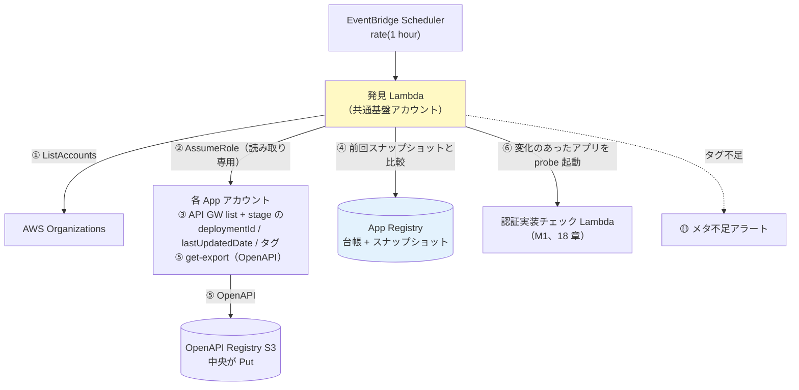

# 17. デプロイ検知と登録（中央巡回 pull 型）

前提: [00-basic-design-plan.md](00-basic-design-plan.md) / [12-app-registry-design.md](12-app-registry-design.md) / [16-cross-account-iam-design.md](16-cross-account-iam-design.md)
根拠 ADR: [ADR-061 デプロイ検知の pull 型統一](../../adr/061-deploy-detection-pull-model.md)

---

## §17.0 前提と背景

**この章で定めること**: 「アプリがデプロイされたことをどう検知し、App Registry に載せるか」。
**方式**: **中央巡回（pull 型）に統一**（[ADR-061](../../adr/061-deploy-detection-pull-model.md)、2026-08-06 決定）。共通基盤アカウントの**発見 Lambda が 1 時間毎に各 App アカウントの資材（API GW）を読み取り巡回**し、デプロイ検知・台帳登録・OpenAPI 取得をすべて中央側で行う。**アプリ側のイベント・登録処理には依存しない**（トリガーは中央が引く）。

> 当初の push 型 3 層構成（Service Catalog 製品内 Custom Resource + CI/CD ステップ + EventBridge 保険）は本方式に置き換えた。比較検討の経緯は [ADR-061](../../adr/061-deploy-detection-pull-model.md)。

**なぜ要るか**: 認証実装確認処理は App Registry に載っているアプリしか検査しない。**登録漏れ = 監視漏れ**。pull 型は「中央が発見する側」なので、**登録漏れが構造的に起きない**のが最大の利点。

---

## §17.1 Service Catalog 製品の役割（登録処理は持たない）

**AWS Service Catalog** = 承認済み IaC テンプレートを組織内に配布するサービス。「**製品（Product）**」= 1 つのテンプレート。

```
製品「api-gateway-rest-public」の中身（§C-API-5）:
  ├─ API Gateway（REST）… 認証必須（AuthorizationType != NONE）を固定
  ├─ Origin Protection（Resource Policy + Custom Header）  ← ADR-039 §C-4
  └─ 必須タグ（app-id / env / cost-center / owner + auth-pattern）← 03 章 BL-1 / §17.3
```

- pull 型への統一に伴い、**登録系 Custom Resource（App Registry 登録 / OpenAPI Export）は製品から外した**。製品は「**正しく守られた API を作る**」ことに専念し、「**見つけて登録する**」のは中央の発見 Lambda が担う（§17.2）。
- アプリチームが API ごとにやることは 2 つだけ:

| 手順 | 内容 |
|---|---|
| 1 | Service Catalog で製品を **launch**、パラメータ入力（AppId / Env / CostCenter / Owner / **AuthPattern をドロップダウン選択** → タグとして付与）|
| 2 | OpenAPI に **公開印（[MON-1](13-openapi-registry-design.md)）** を付ける（public endpoint のみ `x-synthetics-skip-auth-check: true`）|

→ 登録・OpenAPI 取得は**中央が自動で行う**ため、アプリ側に登録コード・登録イベントは一切ない。

---

## §17.2 中央巡回による発見・差分検知（M1 トリガー）

### §17.2.1 巡回フロー

**EventBridge Scheduler（1 時間毎）→ 発見 Lambda（共通基盤アカウント）**:



| ステップ | 内容 |
|---|---|
| ① 列挙 | Organizations `ListAccounts` で対象 App アカウントを列挙（対象 OU で絞込可）|
| ② AssumeRole | 各アカウントに **StackSets 配布済みの読み取り専用ロール**で入る（16 章）|
| ③ 資材読取 | `get-rest-apis` / `get-stages` で API と stage の **`deploymentId` / `lastUpdatedDate`** とタグを取得 |
| ④ 差分判定 | App Registry に保存した**前回スナップショット**（deploymentId 等）と比較。変化 = デプロイされた |
| ⑤ OpenAPI 取得 | 変化した API は中央が `get-export`（oas30/yaml）で取得し OpenAPI Registry（S3）へ Put（**pull**、13 章）|
| ⑥ M1 起動 | 変化のあったアプリを対象に認証実装チェック Lambda を invoke（`{mode:'delta', appId, env}`、18 章）|
| 新規発見 | 台帳に無い API GW は**自動登録**（タグからメタデータ補完 §17.3）。「登録漏れ」という概念自体が消える |
| 消滅検知 | 前回あったが今回無い API は台帳を `enabled=false` に（棚卸しアラート）|

### §17.2.2 検知遅延の考え方（1 時間で許容する理由）

- デプロイ後**最大 1 時間**は検査されない露出窓がある。
- ただし一次防衛は **deploy 前のガード**（04 章静的解析 + 製品テンプレの認証必須固定）であり、外形監視は「**すり抜けの検知網**」。この役割分担の下で 1 時間は許容（ユーザー決定 2026-08-06、[ADR-061](../../adr/061-deploy-detection-pull-model.md)）。
- 短縮したい場合は巡回間隔の変更のみで対応可能（5〜15 分でもコスト影響は軽微。将来オプション）。

---

## §17.3 メタデータ補完（タグ規約）

資材からは分からない運用メタデータは**タグ規約**で補完する。製品 launch 時のパラメータがそのままタグになる（§17.1）。

| タグ | 用途 | 不足時の挙動 |
|---|---|---|
| `app-id` / `env` | 台帳キー（03 章 BL-1 と共用）| API ID / stage 名から仮生成 + **メタ不足アラート** |
| `auth-pattern` | probe の検査方式切替（authPattern enum、README §2.1）| **既定 `api-gw-jwt` で Negative のみ検査** + メタ不足アラート（Positive はスキップ）|
| `owner` / `cost-center` | 通知・按分（03 章と共用）| メタ不足アラート |

- **通知先（alertRouting）はタグに持たせない**（SNS ARN は長く漏洩リスクもある）。台帳側の属性として**共通基盤チームが管理**し、未設定は全社デフォルト（15 章の 2 段解決）に落ちる。
- `baseUrl`（CloudFront URL）はタグ `base-url` または命名規約から導出。導出不可なら台帳へ手動設定（メタ不足アラートで促す）。

---

## §17.4 モノリス（API GW なし）の扱い

発見 Lambda は API GW を列挙するため、**ALB 直の Cookie モノリスは自動発見できない**（push 型でも同じ制約）。

| アプリ種別 | 登録経路 |
|---|---|
| API GW ベース | **自動**（§17.2 巡回発見）|
| **Cookie モノリス（ALB 直）** | **手動登録**（共通基盤チームが台帳へ直接。OpenAPI 相当の endpoint リストも手動配置、14 章 §14.3）|

→ モノリスは件数が少ない前提。増える場合は ALB / ECS リソースの巡回対象化を検討（M-Q-17-2）。

---

## §17.5 SCP による強制（オプション）

Service Catalog 製品を全社標準にする場合、**製品外の直接 API GW 作成を SCP で禁止**すれば「認証必須・タグ付与が必ず守られた API しか作れない」を構造的に強制できる。

```
SCP: apigateway:POST /restapis を Deny
  （PrincipalTag CreatedBy=ServiceCatalog を除く）
```

- pull 型では登録は SCP に依存しない（巡回が全て発見する）。SCP の目的は**タグ・認証必須の品質担保**に純化される。
- 全社 SCP はハードルが高いため導入可否は組織判断（M-Q-17-1）。

---

## §17.6 設計判断

| ID | 判断 | 根拠 |
|---|---|---|
| D-M-17-1 | デプロイ検知は **pull 型中央巡回に統一**（push 3 層を置換）| 登録漏れが構造的にゼロ、アプリ側フットプリント実質ゼロ、トリガーが中央に統一（[ADR-061](../../adr/061-deploy-detection-pull-model.md)）|
| D-M-17-2 | 巡回間隔は **1 時間** | 一次防衛は deploy 前ガード。外形監視は検知網であり 1 時間で許容（短縮は間隔変更のみで可能）|
| D-M-17-3 | 差分判定は stage の **deploymentId** 比較（OpenAPI diff でなく）| OpenAPI 不変の認証コード変更も「デプロイ」として拾う（18 章 §18.2.1 のアプリ単位 probe と整合）|
| D-M-17-4 | メタデータはタグ規約 + 既定値 + メタ不足アラート | 資材から導出不可。既定値でも Negative（認証漏れ検知の本丸）は必ず実施 |
| D-M-17-5 | モノリスは手動登録 | API では発見不可（push 型でも同じ）。件数少の前提 |
| D-M-17-6 | Service Catalog 製品から登録系 Custom Resource を廃止 | 製品は「守られた API を作る」に専念、「見つける」は中央（関心の分離）|

---

## §17.7 未決事項

| ID | 内容 |
|---|---|
| M-Q-17-1 | SCP 強制（製品外の API GW 作成禁止）の採否 |
| M-Q-17-2 | モノリス増加時の ALB / ECS 巡回対象化（自動発見の拡張）|
| M-Q-17-3 | 対象アカウントの範囲指定（Organizations 全体 / 特定 OU / 明示リスト）|
| M-Q-17-4 | 発見 Lambda の実装 + PoC（Phase 3/4。`app-registry-lambda` の登録ロジックは流用可、[ADR-061 実装物への影響](../../adr/061-deploy-detection-pull-model.md)）|
| M-Q-17-5 | 消滅検知（enabled=false 化）とアプリ廃止手続きの運用整合 |

---

## §17.x 関連ドキュメント

- [ADR-061](../../adr/061-deploy-detection-pull-model.md) — push vs pull の比較検討と決定（本章の根拠）
- [18-scan-modes-and-scheduling.md](18-scan-modes-and-scheduling.md) — M1（巡回差分）/ M3（手動フル）の実行モデル
- [12-app-registry-design.md](12-app-registry-design.md) — 台帳スキーマ（スナップショット属性含む）
- [13-openapi-registry-design.md](13-openapi-registry-design.md) — OpenAPI の中央 pull 取得
- [16-cross-account-iam-design.md](16-cross-account-iam-design.md) — 読み取りロールの StackSets 配布
- [§C-API-5](../proposal/common/05-self-service-catalog.md) — Service Catalog 製品テンプレ
