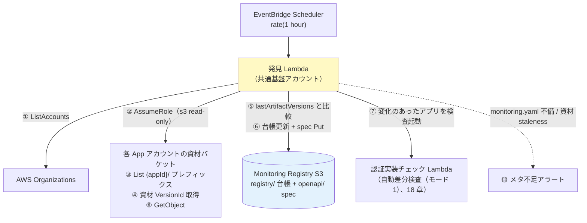

# 17. デプロイ検知と登録（中央巡回 pull 型・S3 監視資材）

前提: [00-basic-design-plan.md](00-basic-design-plan.md) / [12-app-registry-design.md](12-app-registry-design.md) / [16-cross-account-iam-design.md](16-cross-account-iam-design.md)
根拠 ADR: [ADR-061 デプロイ検知の pull 型統一（2026-08-21 追記: S3 監視資材方式）](../../adr/061-deploy-detection-pull-model.md) / 検討経緯: [research/external-git-artifact-store-study.md](research/external-git-artifact-store-study.md)

---

## §17.0 前提と背景

**この章で定めること**: 「アプリに変更があったことをどう検知し、App Registry に載せるか」。

**前提（2026-08-21 更新）**: 各アプリのコードリポジトリは**開発ベンダーごとに外部（GitHub 等）にあり、中央からは読めない**。そこで git を読む代わりに、**デプロイパイプラインの最終段で「監視資材」（monitoring.yaml / openapi.yaml）を各 App アカウントの資材バケットへアップロード**してもらい、中央はそれだけを読む。

**方式**: **中央巡回（pull 型）× 資材 VersionId 比較**。共通基盤アカウントの**発見 Lambda が 1 時間毎に各 App アカウントの資材バケットを読み取り巡回**し、「**前回確認した資材バージョンからの変化**」を検知する。登録・spec 取得・自動差分検査（モード1、旧称 M1）の起動はすべて中央側で行い、**アプリ側のイベント・登録処理には依存しない**（トリガーは中央が引く）。

**資材オンリー原則（2026-08-21 確定）**: 中央が App アカウントで読むのは**アップロードされた監視資材だけ**。git・API GW 構成（deploymentId 含む）・その他の AWS リソースは読まない。クロスアカウントの線を「S3 読み取り 1 本」に絞り、権限説明と通信経路を最小化する（deploymentId 併読は 2026-08-19 に導入、**2026-08-21 に廃止**。経緯は ADR-061）。

**責任分界（顧客合意事項）**: **資材のアップロード漏れ・内容の誤りは、原則アプリ（ベンダー）側の責任**とする。中央は検知網（§17.2.2 の staleness 検知・棚卸し・日次全量検査）で補助するが、「資材が正しく上がっていること」の保証責任は負わない。**この分界は顧客・ベンダーとの合意が必要**（M-Q-17-7）。

**なぜ pull か**: 認証実装確認処理は App Registry に載っているアプリしか検査しない。**登録漏れ = 監視漏れ**。pull 型は「中央が発見する側」なので、資材さえ置かれれば登録は構造的に漏れない（資材が置かれないケースの検知は §17.2.2）。

---

## §17.1 Service Catalog 製品の役割（登録処理は持たない）

**AWS Service Catalog** = 承認済み IaC テンプレートを組織内に配布するサービス。「**製品（Product）**」= 1 つのテンプレート。

```
製品「api-gateway-rest-public」の中身（§C-API-5）:
  ├─ API Gateway（REST）… 認証必須（AuthorizationType != NONE）を固定
  ├─ Origin Protection（Resource Policy + Custom Header）  ← ADR-039 §C-4
  └─ 必須タグ（app-id / env / cost-center / owner）← 03 章 BL-1（課金按分用）
```

- 製品は「**正しく守られた API を作る**」ことに専念し、「**見つけて登録する**」のは中央の発見 Lambda が担う（§17.2）。
- アプリチーム（ベンダー）がやることは 3 つだけ:

| 手順 | 内容 |
|---|---|
| 1 | Service Catalog で製品を **launch**（AppId / Env / CostCenter / Owner を入力 → タグ付与）|
| 2 | **デプロイパイプラインの最終段で監視資材（monitoring.yaml / openapi.yaml）を資材バケットへアップロード**（§17.3。専用アップロードロールを Assume。CI からの AWS 接続方式はアプリごとの既存方式で可）|
| 3 | OpenAPI に **公開印（[MON-1](13-openapi-registry-design.md)）** を付ける（public endpoint のみ `x-synthetics-skip-auth-check: true`）|

→ 登録・spec 取得は**中央が自動で行う**ため、アプリ側に登録コード・登録イベントはない。アップロードは**デプロイ成功後**に行うため、「資材あり = その版がデプロイ済み」が成り立つ（§17.2.2）。

---

## §17.2 中央巡回による発見・差分検知（自動差分検査（モード1）トリガー）

### §17.2.1 巡回フロー

**EventBridge Scheduler（1 時間毎）→ 発見 Lambda（共通基盤アカウント）**:



| ステップ | 内容 |
|---|---|
| ① 列挙 | 対象 App アカウントを列挙（⚠ `organizations:ListAccounts` は管理アカウント限定のため列挙方式は **M-Q-17-2** で確定。10 §10.1.7 W3）|
| ② AssumeRole | 各アカウントに **StackSets 配布済みの読み取り専用ロール**（資材バケットの s3 read のみ、16 章）で入る |
| ③ 資材列挙 | 資材バケットの `{appId}/` プレフィックスを List。**`{appId}/monitoring.yaml` が置かれている = 監視対象**（§17.3）|
| ④ バージョン取得 | monitoring.yaml / openapi.yaml の **VersionId**（と ETag）を取得 |
| ⑤ 差分判定 | 台帳の **`lastArtifactVersions`** と比較。違えば「**前回確認から資材が更新された = 新しい版がデプロイされた**」|
| ⑥ 内容取得 | 変化したアプリのみ `GetObject` で monitoring.yaml / openapi.yaml を取得し、台帳更新・OpenAPI Registry へ Put（13 章）|
| ⑦ 自動差分検査（モード1）起動 | 変化のあったアプリを対象に認証実装チェック Lambda を invoke（`{mode:'delta', appId, env}`、18 章）。完了後 `lastArtifactVersions` を更新 |
| 新規発見 | 台帳に無い `{appId}/monitoring.yaml` は**自動登録**。「登録漏れ」という概念自体が消える |
| 消滅検知 | 資材（monitoring.yaml）の削除は台帳を `enabled=false` に（棚卸しアラート）|

> 変更検知の単位は**資材オブジェクト**（マルチパートアップロードでは ETag が MD5 と一致しないため、**VersionId 主・ETag 副**で比較する。資材バケットは Versioning 必須、16 章）。

### §17.2.2 検知の特性（穴と補完）

**検知遅延**: アップロード後**最大 1 時間**。一次防衛は deploy 前ガード（04 章静的解析 + 製品テンプレ）であり、外形監視は検知網のため許容（[ADR-061](../../adr/061-deploy-detection-pull-model.md)）。

**資材シグナルで拾えないもの（補完レイヤーで受け持つ、2026-08-21 更新）**:

| 穴 | 内容 | 補完レイヤー |
|---|---|---|
| **コンソール直変更** | コンソールで Authorizer を外す等、資材に現れない変更 | ② **L2 Config Rules の実体化**（`AuthorizationType=NONE` の drift 検知。実在確認の上、無ければ実装）① **ガイド・Runbook に「変更は必ず CI/CD 経由」を明記** + **全量検査（モード2、日次定期）が挙動レベルで最大 24h で捕捉**。～2026-08-21 は ③ deploymentId 併読（1h 検知）も持っていたが、**資材オンリー原則により廃止**（検知は 24h に緩和。設定レベルの即時性は Config Rules が受け持つ）。SCP による防止は Phase 2 判断（§17.5）|
| **アップロード忘れ・資材の誤り** | デプロイしたのに資材を上げていない / 内容が実態と違う → 古い spec のまま検査され、**新設 endpoint が検査対象に入らない** | **原則アプリ責任（顧客合意 M-Q-17-7）**。中央の補助検知: (a) **staleness 検知** — 資材の最終更新が閾値（例 90 日）超のアプリを棚卸しアラート (b) **月次棚卸し** — API 提供契約 / タグと台帳の突合（M-Q-17-3）(c) 日次全量検査は**既知の endpoint については**認証漏れを継続捕捉 |
| **アップロード ≠ デプロイの逆転** | 手順違反でデプロイ前にアップロードした場合の偽安心 | アップロードは「デプロイ成功後」を規約・パイプライン例で固定（04 章）。逆転しても次回巡回・日次全量が実態基準で再検査 |

→ 外形監視は検知 5 レイヤーの L5（[§C-6.6](../proposal/common/06-external-api-auth-architecture.md)）であり、**単層で完結させず L2（Config）と組み合わせて穴を塞ぐ**のが前提。

### §17.2.3 資材とデプロイの関係

- 資材は**デプロイされた版の写し**であり、git のブランチ・コミットの概念は中央からは見えない（追跡が必要な場合は任意の `deploy-info.json` に commitId 等を書ける、§17.3）
- probe の範囲は従来どおり**アプリ単位の全 endpoint**（endpoint 単位に絞らない。認証 middleware 削除は差分からどの endpoint に効くか判定できないため、18 章 §18.2.1）

---

## §17.3 監視資材の規約（S3・config-as-code）

監視メタデータは**各 App アカウントの資材バケット**に規定キーで置く。**`{appId}/monitoring.yaml` がある = 監視対象**。

```
s3://auth-monitoring-artifacts-{accountId}/     ← StackSets 配布（Versioning 有効、16 章）
  {appId}/
    monitoring.yaml      # 監視宣言（下記）
    openapi.yaml         # デプロイした版の spec（正本はベンダー git、これはデプロイ版の写し）
    deploy-info.json     # 任意: { "commitId": "…", "deployedAt": "…", "pipelineRunId": "…" }
```

```yaml
# {appId}/monitoring.yaml
appId: expense-api               # プレフィックスと一致必須
environments:
  prod:
    baseUrl: https://expense.example.com   # probe 先（CloudFront URL）
    authPattern: api-gw-jwt                # 検査方式（11 章 §11.3 の enum）
  stg:
    baseUrl: https://stg.expense.example.com
    authPattern: api-gw-jwt
testTokenSecret: canary-central-readonly   # 省略時は共通（11 章 §11.3.1）
```

| 項目 | 規約 | 不備時の挙動 |
|---|---|---|
| `{appId}/monitoring.yaml` | **必須**（これが監視対象の宣言）| API 提供契約 / タグがあるのに資材が無い場合は**棚卸しで検出**（M-Q-17-3）|
| `appId` | プレフィックスと一致必須 | 不一致は**取り込み拒否 + メタ不足アラート** |
| `authPattern` | enum（README §2.1）| 既定 `api-gw-jwt` で **Negative のみ検査** + メタ不足アラート |
| `baseUrl` | CloudFront URL（12 §12.1.1）| 検査不能 → メタ不足アラート |
| `openapi.yaml` | 同プレフィックスに併置 | 無い場合は endpoint リストを monitoring.yaml に列挙（モノリス等、§17.4）|
| `deploy-info.json` | **任意**（commitId 等の追跡用参考値。中央は検知に使わない）| — |
| 通知先（alertRouting）| **資材に書かない**（SNS ARN を外部ベンダーの手に置かない）。台帳側で共通基盤チームが管理、未設定は全社デフォルト（15 章）| — |
| `enabled`（一時停止）| **資材に書かない**。台帳側で中央管理（アプリ側の勝手な監視停止を防ぐ）| — |

**アップロード権限（16 章が正）**: 資材バケットには**アプリ単位の専用アップロードロール**（`{appId}/` プレフィックス限定の `s3:PutObject` のみ。デプロイロールとは分離）を StackSets で同梱配布する。ベンダー CI はこのロールを各自の接続方式で Assume する。1 ベンダー複数アプリの場合もロールは**アプリ単位**（他アプリの資材は書けない）。

> 旧方式（リポジトリ直下の monitoring.yaml、`pathPrefix`/`branch`/`openapi` パス指定）は CodeCommit 前提の規約で **2026-08-21 廃止**。資材はアプリ単位でアップロードされるため、モノレポのパス突合・ブランチ指定は不要になった。リソースタグ（app-id / cost-center 等）は課金按分用として従来どおり必須（03 章 BL-1）。

---

## §17.4 モノリス（API GW なし）の扱い → 自動発見の対象

資材のアップロードは構成を問わないため、モノリスも同じ仕組みで自動発見できる。

| アプリ種別 | 発見 | 変更検知 | endpoint 一覧 |
|---|---|---|---|
| API GW ベース | `{appId}/monitoring.yaml` で自動 | 資材 VersionId 比較 | 併置の openapi.yaml |
| **Cookie モノリス（ALB 直）** | **同じ** | **同じ**（資材 VersionId 比較。手動変更は Config Rules / 全量検査(モード2、日次)）| openapi.yaml（無ければ endpoint リストを monitoring.yaml に列挙）|

---

## §17.5 SCP による強制（オプション）

Service Catalog 製品を全社標準にする場合、**製品外の直接 API GW 作成・変更を SCP で禁止**すれば、資材に現れない変更（コンソール直変更）を**入口で抑止**できる。

```
SCP: apigateway:POST /restapis / apigateway:PATCH 等を Deny
  （PrincipalTag CreatedBy=ServiceCatalog / CI ロールを除く）
```

- 資材検知と相性が良い: 「**変更は必ず CI/CD 経由**」を SCP で強制できれば、パイプラインがすべての変更の入口になり検知の網羅性が上がる
- 全社 SCP はハードルが高いため導入可否は組織判断（M-Q-17-1）

---

## §17.6 設計判断

| ID | 判断 | 根拠 |
|---|---|---|
| D-M-17-1 | デプロイ検知は **pull 型中央巡回に統一**（push 3 層を置換）| 登録漏れが構造的にゼロ、アプリ側フットプリント最小、トリガーが中央に統一（[ADR-061](../../adr/061-deploy-detection-pull-model.md)）|
| D-M-17-2 | 巡回間隔は **1 時間** | 一次防衛は deploy 前ガード。外形監視は検知網であり 1 時間で許容 |
| D-M-17-3 | 変更検知は **S3 監視資材の VersionId 比較 単独**（2026-08-21。外部 git 前提により CodeCommit 巡回を置換、同時に deploymentId 併読を廃止）| **資材オンリー原則**: 中央が App アカウントで読むのは資材だけ（権限説明が単純・通信の線が最少）。アップロードがデプロイ後のため「資材あり = デプロイ済み」が成立。コンソール直変更は Config Rules + ガイド + 日次全量（24h）で受容（§17.2.2、ADR-061 追記 2026-08-21）|
| D-M-17-4 | メタデータは **monitoring.yaml（config-as-code）** で宣言、通知先と enabled は台帳側 | パイプライン成果物として変更管理可。ARN・監視停止権限は外部ベンダーの手に置かない |
| D-M-17-5 | probe 範囲はアプリ単位の全 endpoint（差分で endpoint 絞りしない）| 認証 middleware 削除は差分から endpoint に紐づかない（18 章 §18.2.1）|
| D-M-17-6 | Service Catalog 製品は「守られた API を作る」に専念（登録処理を持たない）| 「見つける」は中央（関心の分離）|
| D-M-17-7 | アップロードは**アプリ単位の専用ロール**（デプロイロールと分離、`{appId}/` prefix 限定 PutObject のみ）| 最小権限・ベンダー複数アプリでも相互に書けない・デプロイ権限と監視資材権限の分離（2026-08-21 ユーザー確定）|
| D-M-17-8 | **資材のアップロード漏れ・誤りは原則アプリ責任**（中央は staleness 検知・棚卸し・日次全量で補助）| 外部ベンダーの CI 内部は中央から統制できない。責任分界を契約で明確化（顧客合意 M-Q-17-7）|

---

## §17.7 未決事項

| ID | 内容 |
|---|---|
| M-Q-17-1 | SCP 強制（製品外の API GW 作成・変更禁止）の採否 — コンソール直変更を入口で塞ぐ鍵（deploymentId 併読廃止により重要度上昇）|
| M-Q-17-2 | **対象アカウントの列挙方式**。⚠ `organizations:ListAccounts` は既定では管理アカウント限定。**案 c（推奨・2026-08 調査で判明）: Organizations の委任ポリシー（resource-based delegation policy）で共通基盤アカウントに `organizations:ListAccounts` を委任** → 発見 Lambda から直接呼べる（管理アカウントでの一度のポリシー設定のみ・AssumeRole 不要）/ 案 a: 管理アカウントに列挙用読み取りロールを置き AssumeRole / 案 b: 静的リスト（SSM Parameter 等）。範囲（全体 / OU / 明示リスト）とあわせて確定（10 §10.1.7 W3）|
| M-Q-17-3 | 「資材が上がってくるはずなのに無い」の突合方法（API 提供契約リスト / タグ / Service Catalog launch 実績のどれと突合するか）と staleness 閾値（仮 90 日）|
| M-Q-17-4 | 発見 Lambda の実装 + PoC（Phase 3/4。S3 List/GetObject のページング・VersionId 比較・アカウント横断のレート制御）|
| M-Q-17-5 | 消滅検知（enabled=false 化）とアプリ廃止手続きの運用整合 |
| M-Q-17-6 | 資材 openapi.yaml と本番デプロイの drift 検出（全量検査（モード2、日次）の実測 404 で顕在化はするが、能動検出の要否）|
| M-Q-17-7 | **責任分界の顧客・ベンダー合意**: 資材アップロード漏れ・内容誤りは原則アプリ責任（中央は補助検知のみ）とする条項。告知資料・契約への反映 |
| M-Q-17-8 | 資材バケットの命名規約・暗号化方式（SSE-S3/KMS）・旧版ライフサイクル（保持期間）|

---

## §17.x 関連ドキュメント

- [ADR-061](../../adr/061-deploy-detection-pull-model.md) — pull 統一 + 2026-08-21 追記（S3 監視資材方式・deploymentId 併読廃止）の経緯
- [research/external-git-artifact-store-study.md](research/external-git-artifact-store-study.md) — 外部 git 対応の検討（案 A/B 比較・確定事項）
- [18-scan-modes-and-scheduling.md](18-scan-modes-and-scheduling.md) — 自動差分検査（モード1）/ 全量検査（モード2）の実行モデル
- [12-app-registry-design.md](12-app-registry-design.md) — 台帳スキーマ（lastArtifactVersions 等）
- [13-openapi-registry-design.md](13-openapi-registry-design.md) — OpenAPI の資材からの取得
- [16-cross-account-iam-design.md](16-cross-account-iam-design.md) — 読み取りロール / 資材バケット + アップロードロールの StackSets 配布
- [§C-API-5](../proposal/common/05-self-service-catalog.md) — Service Catalog 製品テンプレ
