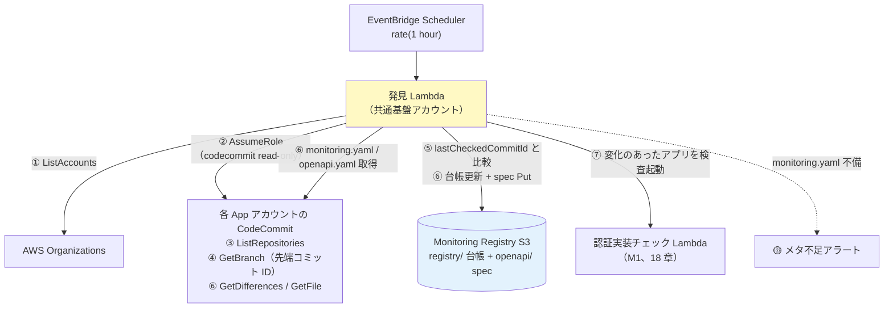

# 17. デプロイ検知と登録（中央巡回 pull 型・CodeCommit 差分）

前提: [00-basic-design-plan.md](00-basic-design-plan.md) / [12-app-registry-design.md](12-app-registry-design.md) / [16-cross-account-iam-design.md](16-cross-account-iam-design.md)
根拠 ADR: [ADR-061 デプロイ検知の pull 型統一（2026-08-07 改訂: CodeCommit 差分単独）](../../adr/061-deploy-detection-pull-model.md)

---

## §17.0 前提と背景

**この章で定めること**: 「アプリに変更があったことをどう検知し、App Registry に載せるか」。
**方式**: **中央巡回（pull 型）× CodeCommit コミット差分**（[ADR-061](../../adr/061-deploy-detection-pull-model.md)）。共通基盤アカウントの**発見 Lambda が 1 時間毎に各 App アカウントの CodeCommit リポジトリを読み取り巡回**し、「**前回確認したコミット ID からの変更**」を検知して、登録・OpenAPI 取得・M1 検査起動をすべて中央側で行う。**アプリ側のイベント・登録処理には依存しない**（トリガーは中央が引く）。

- 前提: 各アプリのコードリポジトリは **App アカウントの CodeCommit**（AWS は 2025-11-24 に CodeCommit を完全 GA へ復帰させており新規利用可）
- 旧方式（API GW の deploymentId 比較 / 資源タグからのメタ補完 / さらに前の push 型 3 層）の経緯と比較は [ADR-061](../../adr/061-deploy-detection-pull-model.md)

**なぜ要るか**: 認証実装確認処理は App Registry に載っているアプリしか検査しない。**登録漏れ = 監視漏れ**。pull 型は「中央が発見する側」なので登録漏れが構造的に起きず、**リポジトリは（API GW を使わないモノリスにも）必ず存在するため、モノリスも自動発見できる**。

---

## §17.1 Service Catalog 製品の役割（登録処理は持たない）

**AWS Service Catalog** = 承認済み IaC テンプレートを組織内に配布するサービス。「**製品（Product）**」= 1 つのテンプレート。

```
製品「api-gateway-rest-public」の中身（§C-API-5）:
  ├─ API Gateway（REST）… 認証必須（AuthorizationType != NONE）を固定
  ├─ Origin Protection（Resource Policy + Custom Header）  ← ADR-039 §C-4
  └─ 必須タグ（app-id / env / cost-center / owner）← 03 章 BL-1（課金按分用）
```

- 製品は「**正しく守られた API を作る**」ことに専念し、「**見つけて登録する**」のは中央の発見 Lambda が担う（§17.2）。
- アプリチームがやることは 3 つだけ:

| 手順 | 内容 |
|---|---|
| 1 | Service Catalog で製品を **launch**（AppId / Env / CostCenter / Owner を入力 → タグ付与）|
| 2 | リポジトリに **`monitoring.yaml`** を置く（§17.3。監視メタデータの config-as-code）|
| 3 | OpenAPI に **公開印（[MON-1](13-openapi-registry-design.md)）** を付ける（public endpoint のみ `x-synthetics-skip-auth-check: true`）|

→ 登録・OpenAPI 取得は**中央が自動で行う**ため、アプリ側に登録コード・登録イベントは一切ない。monitoring.yaml は**リポジトリ内にあるので PR レビューで変更管理できる**。

---

## §17.2 中央巡回による発見・差分検知（M1 トリガー）

### §17.2.1 巡回フロー

**EventBridge Scheduler（1 時間毎）→ 発見 Lambda（共通基盤アカウント）**:



| ステップ | 内容 |
|---|---|
| ① 列挙 | Organizations `ListAccounts` で対象 App アカウントを列挙（対象 OU で絞込可）|
| ② AssumeRole | 各アカウントに **StackSets 配布済みの読み取り専用ロール**（codecommit read のみ、16 章）で入る |
| ③ リポジトリ列挙 | `ListRepositories`。**monitoring.yaml を持つリポジトリ = 監視対象**（§17.3）|
| ④ 先端取得 | `GetBranch` で対象ブランチ（既定 `main`）の先端コミット ID を取得 |
| ⑤ 差分判定 | 台帳の **`lastCheckedCommitId`** と比較。違えば「**前回確認から変更があった**」|
| ⑥ 内容取得 | 変化したリポジトリは `GetDifferences`（変更パス→モノレポ時のアプリ特定）+ `GetFile` で monitoring.yaml / openapi.yaml を取得し、台帳更新・OpenAPI Registry へ Put（13 章）|
| ⑦ M1 起動 | 変化のあったアプリを対象に認証実装チェック Lambda を invoke（`{mode:'delta', appId, env}`、18 章）。完了後 `lastCheckedCommitId` を更新 |
| 新規発見 | 台帳に無い monitoring.yaml 付きリポジトリは**自動登録**。「登録漏れ」という概念自体が消える |
| 消滅検知 | リポジトリ削除 / monitoring.yaml 削除は台帳を `enabled=false` に（棚卸しアラート）|

### §17.2.2 git 単独検知の特性（受容した穴と補完）

**検知遅延**: コミット後**最大 1 時間**。一次防衛は deploy 前ガード（04 章静的解析 + 製品テンプレ）であり、外形監視は検知網のため許容（[ADR-061](../../adr/061-deploy-detection-pull-model.md)）。

**git 単独で拾えないもの（意図的に受容、ADR-061 改訂）**:

| 穴 | 内容 | 補完レイヤー |
|---|---|---|
| **コンソール直変更** | コンソールで Authorizer を外す等、**git に現れない変更は検知できない** | **L2 Config Rules**（`AuthorizationType=NONE` の drift 検知、[§FR-API-7 §7.2.2](../proposal/fr/07-guardrails.md)）+ **M3 手動フル**（18 章）+ SCP で製品外の直接変更を抑止（§17.5）|
| **コミット ≠ デプロイ** | コミット直後の検査は本番がまだ旧コードの可能性（偽安心）| **次回巡回（1h 後）の再検査**が事実上のリトライになる + M3。恒常的に未デプロイのままなら probe が 404/WARN で顕在化 |

→ 外形監視は検知 5 レイヤーの L5（[§C-6.6](../proposal/common/06-external-api-auth-architecture.md)）であり、**単層で完結させず L2（Config）と組み合わせて穴を塞ぐ**のが前提。

### §17.2.3 モノレポ / ブランチの扱い

- **モノレポ**: `GetDifferences` の変更パスを monitoring.yaml の `pathPrefix` と突合し、**変更のあったアプリだけ**を M1 対象にする（リポジトリ=アプリ 1:1 なら比較不要）
- **ブランチ**: 監視対象は**デプロイブランチ（既定 `main`、monitoring.yaml で変更可）のみ**。feature ブランチのコミットは対象外
- probe の範囲は従来どおり**アプリ単位の全 endpoint**（endpoint 単位に絞らない。認証 middleware 削除は diff からどの endpoint に効くか判定できないため、18 章 §18.2.1）

---

## §17.3 monitoring.yaml 規約（リポジトリ内・config-as-code）

監視メタデータは**リポジトリ直下の `monitoring.yaml`** で宣言する。**このファイルがあるリポジトリ = 監視対象**。

```yaml
# monitoring.yaml（リポジトリ直下）
appId: expense-api
pathPrefix: apps/expense-api/    # モノレポ時のみ（単一アプリ repo は省略可）
branch: main                     # 省略時 main
openapi: openapi.yaml            # リポジトリ内の spec パス
environments:
  prod:
    baseUrl: https://expense.example.com   # probe 先（CloudFront URL）
    authPattern: api-gw-jwt                # 検査方式（11 章 §11.3 の enum）
  stg:
    baseUrl: https://stg.expense.example.com
    authPattern: api-gw-jwt
testTokenSecret: canary-central-readonly   # 省略時は共通（11 章 §11.3.1）
```

| 項目 | 規約 | 不備時の挙動 |
|---|---|---|
| ファイル自体 | **必須**（これが監視対象の宣言）| API リポジトリ命名規約（例 `*-api`）に該当するのに無い場合は**メタ不足アラート**（M-Q-17-3）|
| `authPattern` | enum（README §2.1）| 既定 `api-gw-jwt` で **Negative のみ検査** + メタ不足アラート |
| `baseUrl` | CloudFront URL（12 §12.1.1）| 検査不能 → メタ不足アラート |
| 通知先（alertRouting）| **yaml に書かない**（SNS ARN を repo に置かない）。台帳側で共通基盤チームが管理、未設定は全社デフォルト（15 章）| — |
| `enabled`（一時停止）| **yaml に書かない**。台帳側で中央管理（アプリ側の勝手な監視停止を防ぐ）| — |

> リソースタグ（app-id / cost-center 等）は**課金按分用として従来どおり必須**（03 章 BL-1）。監視メタの供給源はタグでなく monitoring.yaml に一本化した。

---

## §17.4 モノリス（API GW なし）の扱い → 自動発見の対象

**リポジトリは必ず存在する**ため、git 巡回ならモノリスも自動発見できる（旧方式の「手動登録」の穴が解消）。

| アプリ種別 | 発見 | 変更検知 | endpoint 一覧 |
|---|---|---|---|
| API GW ベース | monitoring.yaml で自動 | コミット差分 | リポジトリ内 openapi.yaml |
| **Cookie モノリス（ALB 直）** | **同じく monitoring.yaml で自動** | コミット差分（同じ）| リポジトリ内 openapi.yaml（無ければ endpoint リストを monitoring.yaml に列挙）|

---

## §17.5 SCP による強制（オプション）

Service Catalog 製品を全社標準にする場合、**製品外の直接 API GW 作成・変更を SCP で禁止**すれば、git 単独検知の穴（コンソール直変更）を**入口で抑止**できる。

```
SCP: apigateway:POST /restapis / apigateway:PATCH 等を Deny
  （PrincipalTag CreatedBy=ServiceCatalog / CI ロールを除く）
```

- git 単独検知と相性が良い: 「**変更は必ず git → CI/CD 経由**」を SCP で強制できれば、git がすべての変更の入口になり検知の網羅性が上がる
- 全社 SCP はハードルが高いため導入可否は組織判断（M-Q-17-1）

---

## §17.6 設計判断

| ID | 判断 | 根拠 |
|---|---|---|
| D-M-17-1 | デプロイ検知は **pull 型中央巡回に統一**（push 3 層を置換）| 登録漏れが構造的にゼロ、アプリ側フットプリント実質ゼロ、トリガーが中央に統一（[ADR-061](../../adr/061-deploy-detection-pull-model.md)）|
| D-M-17-2 | 巡回間隔は **1 時間** | 一次防衛は deploy 前ガード。外形監視は検知網であり 1 時間で許容 |
| D-M-17-3 | 変更検知は **CodeCommit コミット差分（lastCheckedCommitId 比較）単独** | 「以前確認した範囲からの変更」を Git ネイティブに表現。モノリスも自動対象化。穴（コンソール直変更/未デプロイ）は L2 Config Rules + M3 + SCP で補完（§17.2.2、ADR-061 改訂）|
| D-M-17-4 | メタデータは **monitoring.yaml（config-as-code）** で宣言、通知先と enabled は台帳側 | PR レビューで変更管理可。ARN・監視停止権限は repo に持たせない |
| D-M-17-5 | probe 範囲はアプリ単位の全 endpoint（diff で endpoint 絞りしない）| 認証 middleware 削除は diff から endpoint に紐づかない（18 章 §18.2.1）|
| D-M-17-6 | Service Catalog 製品は「守られた API を作る」に専念（登録処理を持たない）| 「見つける」は中央（関心の分離）|

---

## §17.7 未決事項

| ID | 内容 |
|---|---|
| M-Q-17-1 | SCP 強制（製品外の API GW 作成・変更禁止）の採否 — git 単独検知の穴を入口で塞ぐ鍵 |
| M-Q-17-2 | **対象アカウントの列挙方式**。⚠ `organizations:ListAccounts` は管理アカウント（or delegated admin）でしか呼べないため、共通基盤の発見 Lambda から直接は不可。案 a: 管理アカウントに列挙用読み取りロールを置き AssumeRole / 案 b: 静的リスト（SSM Parameter 等）。範囲（全体 / OU / 明示リスト）とあわせて確定（10 §10.1.7 W3）|
| M-Q-17-3 | API リポジトリの判定規約（命名規約 `*-api` 等）と monitoring.yaml 置き忘れ検出の運用 |
| M-Q-17-4 | 発見 Lambda の実装 + PoC（Phase 3/4。CodeCommit `GetDifferences`/`GetFile` のページング・レート制御含む）|
| M-Q-17-5 | 消滅検知（enabled=false 化）とアプリ廃止手続きの運用整合 |
| M-Q-17-6 | リポジトリ内 openapi.yaml と本番デプロイの drift 検出（M3 実測 404 で顕在化はするが、能動検出の要否）|

---

## §17.x 関連ドキュメント

- [ADR-061](../../adr/061-deploy-detection-pull-model.md) — pull 統一 + 2026-08-07 改訂（CodeCommit 差分単独）の経緯・比較
- [18-scan-modes-and-scheduling.md](18-scan-modes-and-scheduling.md) — M1（巡回差分）/ M3（手動フル）の実行モデル
- [12-app-registry-design.md](12-app-registry-design.md) — 台帳スキーマ（lastCheckedCommitId 等）
- [13-openapi-registry-design.md](13-openapi-registry-design.md) — OpenAPI のリポジトリからの取得
- [16-cross-account-iam-design.md](16-cross-account-iam-design.md) — 読み取りロール（codecommit read）の StackSets 配布
- [§C-API-5](../proposal/common/05-self-service-catalog.md) — Service Catalog 製品テンプレ
