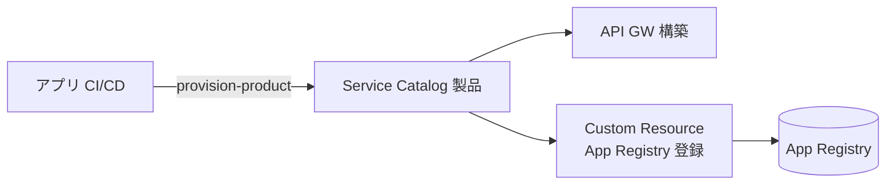
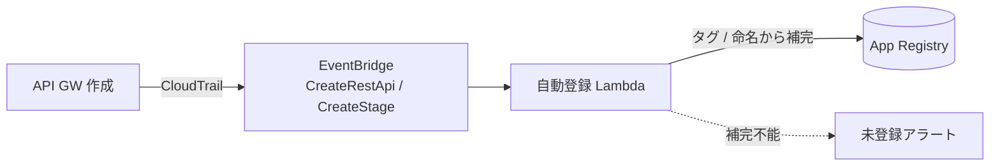
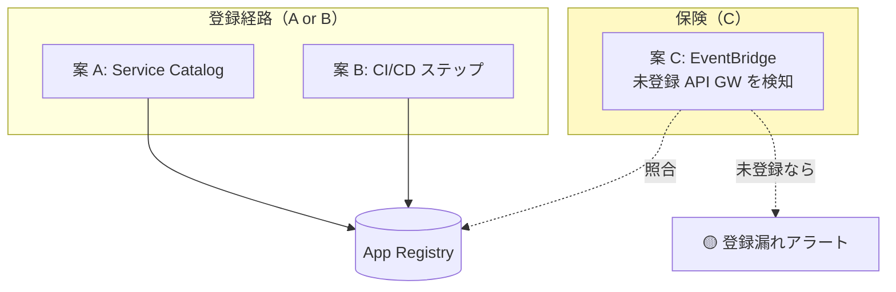
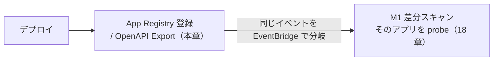

# 17. デプロイ検知と登録（Service Catalog / CI/CD / EventBridge）

前提: [00-basic-design-plan.md](00-basic-design-plan.md) / [12-app-registry-design.md](12-app-registry-design.md) / [16-cross-account-iam-design.md](16-cross-account-iam-design.md)
実装: [code-samples/app-registry-lambda/](code-samples/app-registry-lambda/)

---

## §17.0 前提と背景

**この章で定めること**: 「アプリがデプロイされたことをどう検知し、App Registry に登録するか」。Pattern β で「Deploy 漏れ = ゼロ」を実運用で成立させる登録トリガの設計。
**なぜ要るか**: 認証実装確認処理は App Registry に載っているアプリしか監視しない。**登録漏れ = 監視漏れ**。登録をどうトリガするかが機構全体の実効性を決める。

---

## §17.1 Service Catalog 製品とは何か

**AWS Service Catalog** = 承認済み IaC テンプレート（CloudFormation / Terraform / CDK）を組織内に配布するサービス。「**製品（Product）**」= 1 つのテンプレート。

```
製品「api-gateway-rest-public」の中身（1 パッケージ、§C-API-5）:
  ├─ API Gateway（REST）
  ├─ Origin Protection（Resource Policy + Custom Header）  ← ADR-039 §C-4
  ├─ 必須タグ（app-id / env / cost-center / owner）        ← 03 章 BL-1
  ├─ Custom Resource: App Registry 登録                    ← 12 章
  └─ Custom Resource: OpenAPI Export                       ← 13 章
```

アプリチームが**この製品を「起動（provision）」すると、認証必須・Origin Protection・監視登録が全部込みで立つ**。個別に正しく実装する必要がない。

### §17.1.1 製品内蔵の具体像（誰が何を作り、アプリは何をするか）⭐

> **本標準は案 A（製品内蔵）を既定**とする。ここでは「プラットフォームチームが一度作る成果物」と「アプリが API ごとにやること」を具体化する。登録処理は**製品テンプレに内蔵**され、**アプリ開発者は登録コードを書かない**。

**プラットフォームチームが一度だけ作る成果物**:

| # | 成果物 | 中身 |
|---|---|---|
| 1 | **`product-api.yaml`**（製品テンプレ本体）| API GW/ALB を **認証必須・Origin Protection・アクセスログ・必須タグ込み**で生成。下記 2 つの Custom Resource を内蔵 |
| 2 | Portfolio + 共有設定 | AWS Organizations / RAM でアプリ アカウントへ配布 |
| 3 | Launch ロール / 制約 | 起動時に中央 Lambda（登録 / Export）を クロスアカウント 呼べる権限（16 章）|
| 4 | （既存）`app-registry-lambda` / `openapi-export-lambda` | 中央アカウントに配置済み（[code-samples/](code-samples/)）|
| 5 | （任意）SCP | 製品を通さない API GW/ALB 直作成を禁止（§17.5）|

**製品テンプレに内蔵する Custom Resource（＝アプリ開発者が書かない登録処理）のイメージ**:

```yaml
Parameters:
  AppId: { Type: String }
  Env:   { Type: String, AllowedValues: [prod, stg, dev] }
  CostCenter: { Type: String }
  Owner: { Type: String }
  AuthPattern: { Type: String, AllowedValues: [api-gw-jwt, alb-code-jwt, bff-cookie-session, api-gw-iam, lambda-url-iam] }
  AlertP1TopicArn: { Type: String }   # 通知先を 1 回だけ選ぶ

Resources:
  Api:                                # ← 認証必須・Origin Protection・ログ・タグは
    Type: AWS::ApiGateway::RestApi    #    テンプレ側に固定で埋め込み済み（アプリは触らない）
    # ...

  AppRegistryRegister:                # ← DynamoDB(App Registry) へ登録する Custom Resource
    Type: Custom::AppRegistryRegister
    Properties:
      ServiceToken: !Sub arn:aws:lambda:${AWS::Region}:${CommonPlatformAcctId}:function:app-registry-register
      appId: !Ref AppId
      env:   !Ref Env
      baseUrl: !Sub https://${AppId}.example.com
      authPattern: !Ref AuthPattern
      openApiS3Key: !Sub ${AWS::AccountId}/${Api}/openapi.yaml
      alertRouting: { p1: !Ref AlertP1TopicArn }
      enabled: true

  OpenApiExport:                      # ← 実 API GW から OpenAPI を中央 S3 へ export（13 章）
    Type: Custom::OpenApiExport
    Properties:
      ServiceToken: !Sub arn:aws:lambda:${AWS::Region}:${CommonPlatformAcctId}:function:openapi-export
      restApiId: !Ref Api
      stageName: !Ref Env
```

- `Custom::AppRegistryRegister` は stack の **Create/Update/Delete に応じて**中央 DynamoDB へ PutItem/DeleteItem（クロスアカウント）。実装は既存の [`app-registry-lambda`](code-samples/app-registry-lambda/)。
- `ServiceToken` に中央 Lambda の ARN を指すだけで、**登録ロジックはアプリ側に一切書かれない**。

**アプリチームが API ごとにやること（これだけ）**:

| 手順 | 内容 |
|---|---|
| 1 | Service Catalog で製品を **launch**、パラメータ入力（AppId / Env / CostCenter / Owner / **AuthPattern をドロップダウン選択** / 通知先 SNS）|
| 2 | OpenAPI に **公開印（[MON-1](13-openapi-registry-design.md)）** を付ける（public endpoint のみ `x-synthetics-skip-auth-check: true`）|

→ 登録・OpenAPI Export・認証必須・Origin Protection・タグ・ログは**すべてテンプレが自動**。アプリの負担は「**製品をパラメータ選択で起動する**」＋「**OpenAPI に公開印を付ける**」の 2 点だけ。「Custom Resource がアプリ側に見えるが必要か」への答え = **処理は製品内蔵でアプリ開発者の作業ではない**（DynamoDB は監視対象台帳＋M1 トリガ源として引き続き必要、12 章）。

---

## §17.2 登録トリガの 3 選択肢

| 案 | 仕組み | Service Catalog | CI/CD 統合 | 登録漏れ |
|---|---|:---:|---|:---:|
| **A: 製品の Custom Resource** | 製品 deploy 時に自動登録 | 必要 | 「製品を使う」こと自体 | 原理的にゼロ |
| **B: CI/CD に登録ステップ** | パイプライン末尾で登録 API/CLI | 不要 | register アクション追加 | パイプライン外 deploy は漏れる |
| **C: EventBridge 自動検知** | CloudTrail `CreateRestApi` を拾い登録 | 不要 | 不要 | メタデータ補完が課題 |

### §17.2.1 案 A：Service Catalog 製品の Custom Resource


- **CI/CD 統合の実体 = 「アプリのインフラ定義が Service Catalog 製品を使う」こと**（`aws servicecatalog provision-product` or CFN で製品参照）
- ✅ 登録込みでアプリチーム作業ゼロ、Deploy 漏れゼロ
- ⚠ **Service Catalog の全社導入が前提**

### §17.2.2 案 B：CI/CD に登録ステップ

```yaml
# アプリの deploy パイプライン（GitHub Actions 例）
- name: Deploy API
  run: cdk deploy
- name: Register to 認証実装確認処理         # ← 追加ステップ
  run: |
    aws lambda invoke --function-name app-registry-register \
      --payload '{"appId":"expense-api","env":"prod","baseUrl":"https://expense.example.com",
                  "authPattern":"api-gw-jwt","openApiS3Key":"...","testTokenSecret":"canary-central-readonly",
                  "alertRouting":{...},"enabled":true}' /dev/null
```
- ✅ **Service Catalog 不要**、既存 CI/CD に 1 ステップ足すだけ
- ⚠ パイプラインを経ない手動 deploy は登録漏れ、メタデータをパイプラインが持つ必要

### §17.2.3 案 C：EventBridge 自動検知


- ✅ CI/CD も Service Catalog も不要、API GW が作られたら自動で拾う
- ⚠ **CloudFront URL / authPattern / 通知先が CloudTrail イベントから分からない** → タグ・命名規約から補完、できなければ「メタデータ不足」アラート

---

## §17.3 推奨：3 層構成（理想 + 現実 + 保険）

単一案でなく 3 層で「Deploy 漏れゼロ」を実運用で担保する。

| 層 | 案 | 役割 |
|---|---|---|
| **理想** | A（Service Catalog）| 導入済みアプリは登録込みで漏れゼロ |
| **現実** | B（CI/CD ステップ）| Service Catalog 未導入アプリは CI/CD に register 追加 |
| **保険** | C（EventBridge 検知）| **どの経路でも未登録の API GW を検知してアラート**（登録漏れの検出網）|



→ **案 C を保険として常時回せば、A/B のどちらで登録しても、漏れた API GW は必ず検出**される。これが [§C-6.6.9 / ADR-059 §F](../proposal/common/06-external-api-auth-architecture.md) の「登録漏れ検出網」の実装。

### §17.3.1 登録イベントは M1 スキャンのトリガも兼ねる

本章の登録（deploy 検知）は、[18 章 M1（デプロイ差分スキャン）](18-scan-modes-and-scheduling.md) のトリガと**同一イベント**。「登録が走る = デプロイされた = そのアプリを probe すべき」なので、以下が 1 本の流れになる:



→ 登録（誰を監視するかの更新）と M1（変更を即検証）は、デプロイという 1 つの契機から派生する。トリガ源の確定は M-Q-18-2。

---

## §17.4 モノリス（API GW なし）の扱い

案 C は CloudTrail の API GW イベントに依存するため、**ALB 直の Cookie モノリスは拾えない**。

| アプリ種別 | 登録経路 |
|---|---|
| API GW ベース | 案 A / B（登録）+ 案 C（保険で検知）|
| **Cookie モノリス（ALB 直）** | **案 A / B のみ**（案 C の保険が効かない → 明示登録が必須）|

→ モノリスは「案 C の保険が効かない」ため、案 A/B での明示登録を運用ルールで徹底する。これも「案 C だけに頼らない」理由。

---

## §17.5 SCP による強制（オプション、案 A 採用時）

案 A（Service Catalog）を全社標準にする場合、**Service Catalog 外の直接 API GW 作成を SCP で禁止**すれば、「製品を使わざるを得ない = 必ず登録される」を構造的に強制できる（[ADR-059 §F 手段 1](../../adr/059-central-auth-check-canary-architecture.md)）。

```
SCP: apigateway:POST /restapis を Deny
  （PrincipalTag CreatedBy=ServiceCatalog を除く）
```

→ ただし全社 SCP はハードルが高い。導入可否は組織判断（M-Q-17-1）。

---

## §17.6 設計判断

| ID | 判断 | 根拠 |
|---|---|---|
| D-M-17-1 | 登録は単一案でなく 3 層（A 理想 / B 現実 / C 保険）で担保 | Service Catalog 未導入でも B で登録でき、C で漏れを検出 |
| D-M-17-2 | 案 C（EventBridge）は「登録経路」でなく「登録漏れ検出網」と位置づけ | メタデータ補完が不完全なため、主経路は A/B |
| D-M-17-3 | モノリスは案 A/B の明示登録を必須化（C の保険が効かない）| CloudTrail は ALB 直を API 監視対象として拾えない |
| D-M-17-4 | SCP 強制は組織判断のオプション | 全社 SCP はハードルが高い |

---

## §17.7 未決事項

| ID | 内容 |
|---|---|
| M-Q-17-1 | Service Catalog の全社導入可否 / SCP 強制の採否 |
| M-Q-17-2 | 案 C のメタデータ補完ルール（タグ命名規約から baseUrl/authPattern/通知先をどう導くか）|
| M-Q-17-3 | 案 B の register アクションの標準化（共通 GitHub Action / CLI の配布）|
| M-Q-17-4 | 登録更新（endpoint 追加時）と削除（アプリ廃止時）の運用フロー |
