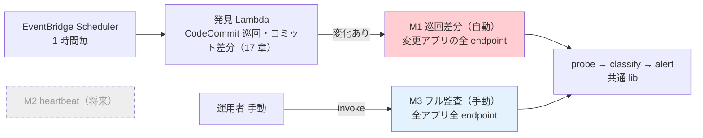
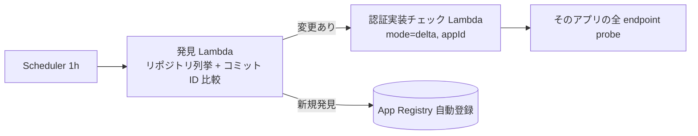

# 18. スキャン実行モードとスケジューリング

前提: [00-basic-design-plan.md](00-basic-design-plan.md) / [11-central-probe-architecture.md](11-central-probe-architecture.md) / [17-deployment-integration-and-registration.md](17-deployment-integration-and-registration.md)
実装: [code-samples/central-probe-lib/](code-samples/central-probe-lib/)（probe lib を流用）

> **本章は認証実装チェックの実行モデルの SSOT**。実行基盤は **Lambda**、実行モードは **M1 デプロイ差分（自動）+ M3 フル監査（手動）**（+ 将来 M2）。CloudWatch Synthetics は不使用（将来オプション、§18.4）。10/11 章の頻度・基盤の記述は本章が上書きする。実行モデルを Synthetics から Lambda に定めた**経緯・理由は [ADR-059](../../adr/059-central-auth-check-canary-architecture.md)**。

---

## §18.0 前提と背景（なぜこの実行モデルか）

認証実装チェックは **「常時監視」と「デプロイ検証」を分けて**設計する。両者を 1 つの重い全量スキャン（例: 5 分周期で全アプリ全 endpoint を Negative + Positive）で回すと非効率になる。

| 規模 | 1 回の probe 数 | 仮に 5 分周期なら 1 日 |
|---|---|---|
| 10 アプリ × 20 endpoint × 2 | 400 | **約 11.5 万 probe/日**（大半は無変更 endpoint の無駄打ち）|

→ そこで **2 つの関心事を分離**し、デプロイ契機（M1）と手動フル（M3）の**イベント駆動**にする。

---

## §18.1 実行モード（2 モード + 将来 1）

| モード | トリガ | 範囲 | 頻度 | 状態 |
|---|---|---|---|:---:|
| **M1 巡回差分** | **中央巡回**（発見 Lambda が 1 時間毎に **CodeCommit のコミット差分**を確認、[17 章 §17.2](17-deployment-integration-and-registration.md) / [ADR-061 改訂](../../adr/061-deploy-detection-pull-model.md)）| **変更のあったアプリの全 endpoint** | 1 時間毎（検知遅延 最大 1h）| ✅ Phase 1 |
| **M3 フル監査** | **手動** | 全アプリ全 endpoint | オンデマンド | ✅ Phase 1 |
| ~~M2 常時 heartbeat~~ | スケジュール | 重要 endpoint のサブセット | 5-15 分 | ⏸ **将来**（重要 endpoint の定義はアプリと会話後）|



### §18.1.1 M1 の巡回と M2 heartbeat の違い（M2 を一旦なしにする理由）

- **M1 の巡回は「リポジトリの読み取り」**（コミット ID 比較）であり、probe（HTTP 検査）は**変更のあったアプリだけ**に飛ぶ。M2 heartbeat は「**endpoint への probe を常時定期実行**」する別物で、重要 endpoint の定義がないと全量 probe の重さに戻る。
- **重要 endpoint の定義はアプリチームと会話しないと決められない**（全 GET か / 認証必須のみか / 業務上の重要度か）。
- M1（巡回差分）で「コミット = 変更の事実」を最大 1 時間遅れで捕捉でき、M3（手動フル）で「網羅確認」ができるため、**常時 probe がなくても認証漏れの主要な入り口（コード変更）は塞げる**（git に現れない変更の補完は 17 章 §17.2.2）。
- M2 は将来、アプリと重要 endpoint を合意した上で追加する（§18.6 未決）。

---

## §18.2 M1 巡回差分（自動）

### §18.2.1 差分の粒度は「アプリ単位」

⚠ **重要な設計判断**: M1 の範囲は「**デプロイされたアプリの全 endpoint**」であり、OpenAPI 差分のあった endpoint だけではない。

| 粒度 | 見逃すケース | 採否 |
|---|---|:---:|
| endpoint 単位（OpenAPI diff）| **コードで認証 middleware を外したが OpenAPI は不変** → 差分に出ず見逃す | ✗ |
| **アプリ単位（変更アプリの全 endpoint）** | — | ✅ 採用 |

→ 認証漏れの典型（`AuthorizationType=NONE` / middleware 削除）は **OpenAPI に現れないことが多い**。だから「変更されたアプリは全 endpoint を probe」する。全アプリ全量よりは軽く（変更アプリのみ）、endpoint 差分より安全。

### §18.2.2 トリガ：中央巡回（pull、17 章が SSOT）

変更検知は **発見 Lambda の 1 時間毎巡回（CodeCommit のコミット差分 = `lastCheckedCommitId` 比較）**（[17 章 §17.2](17-deployment-integration-and-registration.md)）が行い、変更のあったアプリだけ M1 を起動する。アプリ側イベントには依存しない（[ADR-061 改訂](../../adr/061-deploy-detection-pull-model.md)）。



> ⚠ **git 単独検知の穴と補完**（[17 章 §17.2.2](17-deployment-integration-and-registration.md)）: コンソール直変更は検知できない（→ L2 Config Rules + M3 + SCP）。コミット直後は未デプロイの可能性（→ 次回巡回の再検査 + M3）。

### §18.2.3 実行基盤：Lambda（発見 → probe の 2 段）

| 項目 | 内容 |
|---|---|
| 発見 Lambda | EventBridge Scheduler（1h）起動。Organizations 列挙 + 読み取り AssumeRole + 差分判定（17 章）|
| 認証実装チェック Lambda | 発見 Lambda から invoke（変化アプリのみ）。payload `{ mode:'delta', appId, env }` |
| probe ロジック | **`lib/probe.js` / `classify.js` / `emit.js` を共通流用**。synthetics 抽象を素の https 実装で注入（[probe-integration.test.js で実証済みの手法](research/phase4-local-verification-results.md)）|

→ **probe/classify/alert の資産は全て再利用**。Synthetics 固有の `executeHttpStep` を https 実装に差し替えるだけ。

---

## §18.3 M3 フル監査（手動）

| 項目 | 内容 |
|---|---|
| トリガ | **手動**（運用者が CLI / コンソールから invoke）|
| 範囲 | 全アプリ全 endpoint（台帳 registry/ を List）|
| 用途 | 初回の全量確認 / 大きな変更後 / 監査前 / 定期棚卸し（人が判断）|
| 実行基盤 | **M1 と同じ 認証実装チェック Lambda**（`mode=full`）。実装 1 つを payload で切替 |

起動例:
```bash
aws lambda invoke --function-name central-auth-probe \
  --payload '{"mode":"full"}' /dev/null    # 全アプリ Scan → 全 endpoint probe
# 特定アプリだけ全量: {"mode":"full","appId":"expense-api","env":"prod"}
```

→ **スケジュール実行しない**ため、常時コストはゼロ。必要な時だけ人が回す。

---

## §18.4 実行基盤：Lambda（Synthetics 不採用の理由）

巡回起点（M1）+ 手動（M3）はいずれも**単発の probe 実行**で、Synthetics canary の「endpoint への定期 probe」メリットが効かない（巡回のスケジュールは軽量な発見 Lambda 側にあり、probe は変化時のみ）。よって実行基盤は **認証実装チェック Lambda に一本化**し、CloudWatch Synthetics は採用しない（将来オプション、§18.4.1）。

| 要素 | Synthetics canary（不採用）| **Lambda（採用）** |
|---|---|---|
| 実行モデル | 全 endpoint へのスケジュール定期 probe | **巡回差分（M1）/ 手動（M3）時のみ probe** |
| probe lib | 共通 | **共通（不変）** |
| classify / alert | 共通 | **共通（不変）** |
| アラーム | canary FAIL → SuccessPercent<100 | **CloudWatch metric `AuthCheckCritical > 0`** |
| コスト | run ごと $0.0012 上乗せ + 定期実行分 | **巡回 + 変化時 probe で概ね無料枠内**（価格比較は [ADR-059](../../adr/059-central-auth-check-canary-architecture.md)）|

> **実装資産は無駄にならない**: `central-probe-lib/lib/*` はそのまま Lambda から流用。`index.js`（Synthetics handler）を Lambda handler に転用し、synthetics 注入を https 実装に差し替える（後続の実装タスク、[code-samples/](code-samples/) に `probe-lambda/` として追加）。

### §18.4.1 Synthetics を将来使う場合

M2（常時 heartbeat）を追加する / HAR・スクリーンショット・Multilocation・run 履歴 UI が要る場合は、Synthetics canary を M2 の実行環境として復活させる。その時も probe lib は共通。

---

## §18.5 設計判断

| ID | 判断 | 根拠 |
|---|---|---|
| D-M-18-1 | 「5 分全量」を廃し、M1 巡回差分（自動・1h）+ M3 フル（手動）の 2 モードに | 常時監視とデプロイ検証を分離、常時負荷を桁で削減 |
| D-M-18-7 | M1 のトリガは**中央巡回（pull、1 時間毎）**。アプリ側イベントに依存しない | 登録漏れ構造ゼロ・トリガー中央統一（[ADR-061](../../adr/061-deploy-detection-pull-model.md) / 17 章）|
| D-M-18-2 | M1 の差分粒度は **アプリ単位**（変更アプリの全 endpoint）| OpenAPI 不変の認証コード変更（middleware 削除等）を見逃さない（§18.2.1）|
| D-M-18-3 | M2 常時 heartbeat は**当面なし**（将来、重要 endpoint をアプリと合意後）| 重要 endpoint の定義に業務会話が要る、決め打ち全量は本末転倒 |
| D-M-18-4 | M3 フルは**手動**（スケジュールなし）| 網羅確認は人の判断契機（初回/監査/大変更後）で十分、常時コストゼロ |
| D-M-18-5 | 実行基盤を Lambda に一本化、Synthetics は将来オプション | M2 廃止で定期実行メリットが不要、probe lib は共通で資産流用 |
| D-M-18-6 | アラームは CloudWatch metric（AuthCheckCritical>0）| canary FAIL 依存をやめ Lambda でも成立させる |

---

## §18.6 未決事項

| ID | 内容 |
|---|---|
| M-Q-18-1 | **M2 の重要 endpoint 定義**（アプリチームと会話）+ 追加時期。定義できたら `x-canary-heartbeat: true` アノテーション + Synthetics canary で実装 |
| ~~M-Q-18-2~~ | ~~M1 トリガの確定~~ → **解決**: 中央巡回（pull、1h）に統一（[ADR-061](../../adr/061-deploy-detection-pull-model.md)）|
| M-Q-18-3 | M3 手動実行の権限・実行者（共通基盤チームのみか、アプリチームも自アプリを回せるか）|
| ~~M-Q-18-4~~ | ~~モノリスの変更を M3 で補う~~ → **解消**: git 巡回でモノリスも自動発見・自動検知（17 章 §17.4）。M3 の役割は「git に現れない変更（コンソール直変更等）の網羅確認」に純化 |

---

## §18.x 関連

- [11-central-probe-architecture.md](11-central-probe-architecture.md) — probe / classify / 4×4 の詳細（実行モデルは本章が上書き）
- [17-deployment-integration-and-registration.md](17-deployment-integration-and-registration.md) — M1 トリガとなるデプロイ検知・登録
- [13-openapi-registry-design.md](13-openapi-registry-design.md) — OpenAPI の S3 versioning（差分の元データ）
