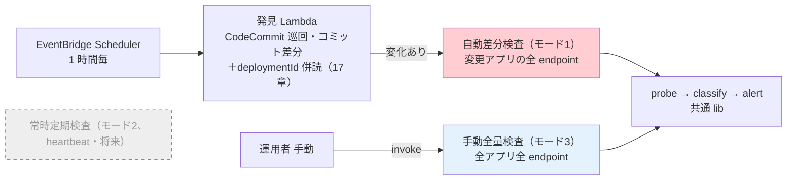
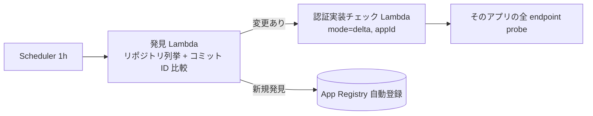

# 18. スキャン実行モードとスケジューリング

前提: [00-basic-design-plan.md](00-basic-design-plan.md) / [11-central-probe-architecture.md](11-central-probe-architecture.md) / [17-deployment-integration-and-registration.md](17-deployment-integration-and-registration.md)
実装: [code-samples/central-probe-lib/](code-samples/central-probe-lib/)（probe lib を流用）

> **本章は認証実装チェックの実行モデルの SSOT**。実行基盤は **Lambda**、実行モードは **自動差分検査（モード1、旧称 M1・自動）+ 手動全量検査（モード3、旧称 M3・手動）**（+ 将来の常時定期検査（モード2、旧称 M2））。CloudWatch Synthetics は不使用（将来オプション、§18.4）。10/11 章の頻度・基盤の記述は本章が上書きする。実行モデルを Synthetics から Lambda に定めた**経緯・理由は [ADR-059](../../adr/059-central-auth-check-canary-architecture.md)**。

---

## §18.0 前提と背景（なぜこの実行モデルか）

認証実装チェックは **「常時監視」と「デプロイ検証」を分けて**設計する。両者を 1 つの重い全量スキャン（例: 5 分周期で全アプリ全 endpoint を Negative + Positive）で回すと非効率になる。

| 規模 | 1 回の probe 数 | 仮に 5 分周期なら 1 日 |
|---|---|---|
| 10 アプリ × 20 endpoint × 2 | 400 | **約 11.5 万 probe/日**（大半は無変更 endpoint の無駄打ち）|

→ そこで **2 つの関心事を分離**し、デプロイ契機の自動差分検査（モード1）と手動全量検査（モード3）の**イベント駆動**にする。

---

## §18.1 実行モード（2 モード + 将来 1）

| モード | トリガ | 範囲 | 頻度 | 状態 |
|---|---|---|---|:---:|
| **自動差分検査（モード1）** | **中央巡回**（発見 Lambda が 1 時間毎に **CodeCommit のコミット差分 + API GW deploymentId を併読**、[17 章 §17.2](17-deployment-integration-and-registration.md) / [ADR-061 追記 2026-08-19](../../adr/061-deploy-detection-pull-model.md)）| **変更のあったアプリの全 endpoint** | 1 時間毎（検知遅延 最大 1h）| ✅ Phase 1 |
| **手動全量検査（モード3）** | **手動** | 全アプリ全 endpoint | オンデマンド | ✅ Phase 1 |
| ~~常時定期検査（モード2、heartbeat）~~ | スケジュール | 重要 endpoint のサブセット | 5-15 分 | ⏸ **将来**（重要 endpoint の定義はアプリと会話後）|



### §18.1.1 自動差分検査（モード1）の巡回と常時定期検査（モード2、heartbeat）の違い（モード2 を一旦なしにする理由）

- **自動差分検査（モード1）の巡回は「リポジトリの読み取り」**（コミット ID 比較）であり、probe（HTTP 検査）は**変更のあったアプリだけ**に飛ぶ。常時定期検査（モード2、heartbeat）は「**endpoint への probe を常時定期実行**」する別物で、重要 endpoint の定義がないと全量 probe の重さに戻る。
- **重要 endpoint の定義はアプリチームと会話しないと決められない**（全 GET か / 認証必須のみか / 業務上の重要度か）。
- 自動差分検査（モード1）で「コミット = 変更の事実」を最大 1 時間遅れで捕捉でき、手動全量検査（モード3）で「網羅確認」ができるため、**常時 probe がなくても認証漏れの主要な入り口（コード変更）は塞げる**（git に現れない変更の補完は 17 章 §17.2.2）。
- 常時定期検査（モード2）は将来、アプリと重要 endpoint を合意した上で追加する（§18.7 未決）。

---

## §18.2 自動差分検査（モード1）

### §18.2.1 差分の粒度は「アプリ単位」

⚠ **重要な設計判断**: 自動差分検査（モード1）の範囲は「**デプロイされたアプリの全 endpoint**」であり、OpenAPI 差分のあった endpoint だけではない。

| 粒度 | 見逃すケース | 採否 |
|---|---|:---:|
| endpoint 単位（OpenAPI diff）| **コードで認証 middleware を外したが OpenAPI は不変** → 差分に出ず見逃す | ✗ |
| **アプリ単位（変更アプリの全 endpoint）** | — | ✅ 採用 |

→ 認証漏れの典型（`AuthorizationType=NONE` / middleware 削除）は **OpenAPI に現れないことが多い**。だから「変更されたアプリは全 endpoint を probe」する。全アプリ全量よりは軽く（変更アプリのみ）、endpoint 差分より安全。

### §18.2.2 トリガ：中央巡回（pull、17 章が SSOT）

変更検知は **発見 Lambda の 1 時間毎巡回**が行う。シグナルは **git 主（CodeCommit のコミット差分 = `lastCheckedCommitId` 比較）＋ deploymentId 併読（API GW stage の deploymentId を前回値と比較、手動変更のデプロイ反映を検知）**（[17 章 §17.2](17-deployment-integration-and-registration.md)）で、いずれかに変化のあったアプリだけ自動差分検査（モード1）を起動する。アプリ側イベントには依存しない（[ADR-061 追記 2026-08-19](../../adr/061-deploy-detection-pull-model.md)）。



> ⚠ **検知の穴と補完**（[17 章 §17.2.2](17-deployment-integration-and-registration.md)、2026-08-19 更新）: コンソール直変更は **deploymentId 併読**（デプロイ反映時に検知）+ **Config Rules 実体化** + ガイド明記の三重で補完。コミット直後は未デプロイの可能性（→ 次回巡回の再検査 + 手動全量検査（モード3））。

### §18.2.3 実行基盤：Lambda（発見 → probe の 2 段）

| 項目 | 内容 |
|---|---|
| 発見 Lambda | EventBridge Scheduler（1h）起動。Organizations 列挙 + 読み取り AssumeRole + 差分判定（17 章）|
| 認証実装チェック Lambda | 発見 Lambda から invoke（変化アプリのみ）。payload `{ mode:'delta', appId, env }` |
| probe ロジック | **`lib/probe.js` / `classify.js` / `emit.js` を共通流用**。synthetics 抽象を素の https 実装で注入（[probe-integration.test.js で実証済みの手法](research/phase4-local-verification-results.md)）|

→ **probe/classify/alert の資産は全て再利用**。Synthetics 固有の `executeHttpStep` を https 実装に差し替えるだけ。

---

## §18.3 手動全量検査（モード3）

| 項目 | 内容 |
|---|---|
| トリガ | **手動**（運用者が CLI / コンソールから invoke）|
| 範囲 | 全アプリ全 endpoint（台帳 registry/ を List）|
| 用途 | 初回の全量確認 / 大きな変更後 / 監査前 / 定期棚卸し（人が判断）|
| 実行基盤 | **自動差分検査（モード1）と同じ 認証実装チェック Lambda**（`mode=full`）。実装 1 つを payload で切替 |
| 実行方式 | `mode=full` は台帳を List した後、**アプリ単位に自分自身を `mode=delta` 相当で fan-out invoke** する（1 Lambda 実行 = 1 アプリ）。全量を 1 実行で回さないため、アプリ数が増えても Lambda 15 分制限に当たらない（§18.5.3）|

起動例:
```bash
aws lambda invoke --function-name central-auth-probe \
  --payload '{"mode":"full"}' /dev/null    # 全アプリ Scan → 全 endpoint probe
# 特定アプリだけ全量: {"mode":"full","appId":"expense-api","env":"prod"}
```

→ **スケジュール実行しない**ため、常時コストはゼロ。必要な時だけ人が回す。

---

## §18.4 実行基盤：Lambda（Synthetics 不採用の理由）

巡回起点の自動差分検査（モード1）+ 手動全量検査（モード3）はいずれも**単発の probe 実行**で、Synthetics canary の「endpoint への定期 probe」メリットが効かない（巡回のスケジュールは軽量な発見 Lambda 側にあり、probe は変化時のみ）。よって実行基盤は **認証実装チェック Lambda に一本化**し、CloudWatch Synthetics は採用しない（将来オプション、§18.4.1）。

| 要素 | Synthetics canary（不採用）| **Lambda（採用）** |
|---|---|---|
| 実行モデル | 全 endpoint へのスケジュール定期 probe | **自動差分検査（モード1）/ 手動全量検査（モード3）時のみ probe** |
| probe lib | 共通 | **共通（不変）** |
| classify / alert | 共通 | **共通（不変）** |
| アラーム | canary FAIL → SuccessPercent<100 | **CloudWatch metric `AuthCheckCritical > 0`** |
| コスト | run ごと $0.0012 上乗せ + 定期実行分 | **巡回 + 変化時 probe で概ね無料枠内**（価格比較は [ADR-059](../../adr/059-central-auth-check-canary-architecture.md)）|

> **実装資産は無駄にならない**: `central-probe-lib/lib/*` はそのまま Lambda から流用。`index.js`（Synthetics handler）を Lambda handler に転用し、synthetics 注入を https 実装に差し替える（後続の実装タスク、[code-samples/](code-samples/) に `probe-lambda/` として追加）。

### §18.4.1 Synthetics を将来使う場合

常時定期検査（モード2、heartbeat）を追加する / HAR・スクリーンショット・Multilocation・run 履歴 UI が要る場合は、Synthetics canary を常時定期検査（モード2）の実行環境として復活させる。その時も probe lib は共通。

---

## §18.5 運用設計（メタ監視・エラー処理・スケール上限）

### §18.5.1 メタ監視 —「巡回が止まっていること」を検知する

**監視の空白 = 認証漏れの検知空白**。監視系自身の停止・失敗を、被監視系（AuthCheck 系メトリクス）とは別系統で検知する。通知先はいずれも **P2（Platform）**（監視系の障害はアプリの障害ではないため）。

| # | 検知対象 | 手段 | アラーム条件（初期値）|
|---|---|---|---|
| MM-1 | **巡回の停止**（最重要）| 発見 Lambda が巡回成功時に `DiscoveryLastSuccess` メトリクス（Count=1）を emit | **2 時間欠損**（= 巡回 2 回分未実行）で発報 |
| MM-2 | 発見 Lambda の失敗 | Lambda 標準 `Errors` / Scheduler の起動失敗 | Errors ≥ 1 |
| MM-3 | 一部アカウントの巡回失敗 | `DiscoveryAccountErrors` メトリクス（失敗アカウント数）| ≥ 1（§18.5.2 の部分失敗と連動）|
| MM-4 | 検査 Lambda の失敗 | Lambda 標準 `Errors` + 非同期 invoke の **DLQ（SQS）** | Errors ≥ 1 or DLQ 滞留 ≥ 1 |
| MM-5 | Alert Router の失敗 | 既存の throw → リトライ / DLQ（15 §15.4）| DLQ 滞留 ≥ 1 |

- 保険系アラーム（`AuthCheckCritical > 0`、§18.4）は「**検知した結果**の発報」、本節は「**検知できていない状態**の発報」で役割が異なる。両方そろって初めて検知網が閉じる
- 各 Lambda のログは [06 章 OBS-1〜4](06-logging-monitoring.md) に準拠（実行 ID を相関 ID として出力、トークン・コミット内容はマスク、保持期間明示）

### §18.5.2 エラー処理・リトライ・冪等性

| 箇所 | 方針 |
|---|---|
| 発見 Lambda の巡回 | **アカウント単位で try-catch し、1 アカウントの失敗（AssumeRole 不可・スロットリング等）で全体を止めない**。失敗数を `DiscoveryAccountErrors` で emit（MM-3）し、次回巡回で自然リトライ |
| `lastCheckedCommitId` の更新タイミング | **自動差分検査（モード1）の起動が成功した後にのみ更新**（17 §17.2.1 ⑦）。途中失敗時は据え置かれ、次回巡回が同じ差分を再検知する（**at-least-once**）。probe は読み取り検査で冪等のため重複実行は無害 |
| 発見 → 検査の invoke | **非同期（Event invoke）**。Lambda 標準の自動リトライ（2 回）+ **DLQ（SQS）** を設定（MM-4）。同期にしないのは、1 アプリの検査失敗で巡回全体を巻き込まないため |
| 検査 Lambda 内の endpoint 失敗 | endpoint 単位で継続（1 endpoint のタイムアウトで残りを打ち切らない）。接続不能は 4×4 の WARN（構成）系に分類 |
| Alert Router | 既存設計のとおり（1 件でも失敗したら throw → リトライ / DLQ、15 §15.4）|
| CodeCommit スロットリング | CodeCommit API はアカウント単位のレート制限あり（AWS 公式）。SDK 標準リトライ（指数バックオフ）+ 発見 Lambda の直列処理で吸収。並列化する場合の制御は M-Q-16-2 |

### §18.5.3 スケール上限（Lambda 15 分制限）と fan-out 方針

Lambda の最大実行時間は **15 分**。1 実行に詰め込まない構造にする。

| 実行 | 1 実行の範囲 | 15 分制限への設計 |
|---|---|---|
| 発見 Lambda（巡回）| 全アカウント走査（現行）| 処理はアカウント単位の読み取り（数 API 呼び出し / repo）で軽く、**Phase 1 の前提規模（対象約 3 アカウント）では 1 実行に十分収まる**。収まらない規模に達したら**親（列挙のみ）/ 子（1 アカウント処理）の fan-out に分割**する（構造は手動全量検査（モード3）と同型。閾値監視は Lambda `Duration` アラームで前倒し検知）|
| 検査 Lambda（自動差分検査(モード1)）| **1 アプリ**の全 endpoint | 20 endpoint × 2 probe × 数秒でも数分オーダー。1 アプリ = 1 実行なので endpoint 数が極端でない限り収まる |
| 検査 Lambda（手動全量検査(モード3)）| 台帳 List → **アプリ単位に fan-out**（§18.3）| 全量を 1 実行で回さないため上限に当たらない |

---

## §18.6 設計判断

| ID | 判断 | 根拠 |
|---|---|---|
| D-M-18-1 | 「5 分全量」を廃し、自動差分検査（モード1、1h）+ 手動全量検査（モード3）の 2 モードに | 常時監視とデプロイ検証を分離、常時負荷を桁で削減 |
| D-M-18-7 | 自動差分検査（モード1）のトリガは**中央巡回（pull、1 時間毎）**。アプリ側イベントに依存しない | 登録漏れ構造ゼロ・トリガー中央統一（[ADR-061](../../adr/061-deploy-detection-pull-model.md) / 17 章）|
| D-M-18-8 | **メタ監視を被監視系と別系統で設計**（巡回鮮度 `DiscoveryLastSuccess` 2h 欠損アラーム + Lambda Errors + DLQ 滞留。通知は P2）| 監視の空白 = 検知の空白。保険系（AuthCheckCritical）は「検知結果」、メタ監視は「検知不能状態」の発報で役割が異なる（§18.5.1）|
| D-M-18-9 | **at-least-once + 冪等**（lastCheckedCommitId は自動差分検査（モード1）の起動成功後のみ更新、発見→検査は非同期 invoke + DLQ、アカウント単位の部分失敗分離）。手動全量検査（モード3）と大規模巡回は**アプリ / アカウント単位の fan-out** | Lambda 15 分制限に構造で当たらない。probe は読み取り検査で重複無害（§18.5.2-3）|
| D-M-18-2 | 自動差分検査（モード1）の差分粒度は **アプリ単位**（変更アプリの全 endpoint）| OpenAPI 不変の認証コード変更（middleware 削除等）を見逃さない（§18.2.1）|
| D-M-18-3 | 常時定期検査（モード2、heartbeat）は**当面なし**（将来、重要 endpoint をアプリと合意後）| 重要 endpoint の定義に業務会話が要る、決め打ち全量は本末転倒 |
| D-M-18-4 | 手動全量検査（モード3）は**手動**（スケジュールなし）| 網羅確認は人の判断契機（初回/監査/大変更後）で十分、常時コストゼロ |
| D-M-18-5 | 実行基盤を Lambda に一本化、Synthetics は将来オプション | 常時定期検査（モード2）廃止で定期実行メリットが不要、probe lib は共通で資産流用 |
| D-M-18-6 | アラームは CloudWatch metric（AuthCheckCritical>0）| canary FAIL 依存をやめ Lambda でも成立させる |

---

## §18.7 未決事項

| ID | 内容 |
|---|---|
| M-Q-18-1 | **常時定期検査（モード2）の重要 endpoint 定義**（アプリチームと会話）+ 追加時期。定義できたら `x-canary-heartbeat: true` アノテーション + Synthetics canary で実装 |
| ~~M-Q-18-2~~ | ~~自動差分検査（モード1）トリガの確定~~ → **解決**: 中央巡回（pull、1h）に統一（[ADR-061](../../adr/061-deploy-detection-pull-model.md)）|
| M-Q-18-3 | 手動全量検査（モード3）の手動実行の権限・実行者（共通基盤チームのみか、アプリチームも自アプリを回せるか）|
| ~~M-Q-18-5~~ | ~~前提規模の確定~~ → **解決（2026-08-18）**: Phase 1 の対象は**約 3 アカウント**。単一実行で 15 分制限に十分な余裕があり、fan-out 分割（§18.5.3）への移行は不要。規模拡大時に再評価 |
| ~~M-Q-18-4~~ | ~~モノリスの変更を手動全量検査（モード3）で補う~~ → **解消**: git 巡回でモノリスも自動発見・自動検知（17 章 §17.4）。手動全量検査（モード3）の役割は「git に現れない変更（コンソール直変更等）の網羅確認」に純化 |

---

## §18.x 関連

- [11-central-probe-architecture.md](11-central-probe-architecture.md) — probe / classify / 4×4 の詳細（実行モデルは本章が上書き）
- [17-deployment-integration-and-registration.md](17-deployment-integration-and-registration.md) — 自動差分検査（モード1）のトリガとなるデプロイ検知・登録
- [13-openapi-registry-design.md](13-openapi-registry-design.md) — OpenAPI の spec コピー置き場（正本はリポジトリ。差分判定はコミット ID、S3 Versioning は履歴用）
