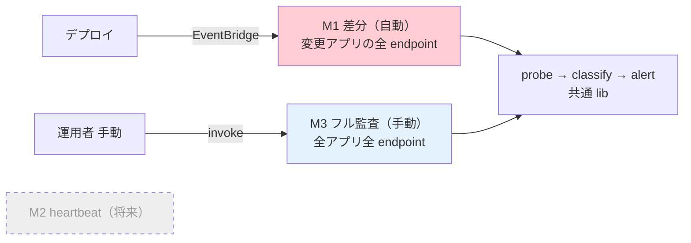
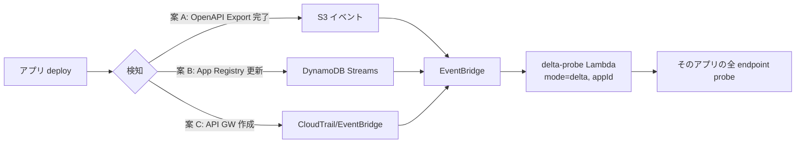

# 18. スキャン実行モードとスケジューリング

前提: [00-basic-design-plan.md](00-basic-design-plan.md) / [11-central-canary-architecture.md](11-central-canary-architecture.md) / [17-deployment-integration-and-registration.md](17-deployment-integration-and-registration.md)
実装: [code-samples/central-canary-puppeteer/](code-samples/central-canary-puppeteer/)（probe lib を流用）

> **本章は実行モデルの SSOT**。11 章（Central Canary アーキ）が定めた「5 分周期の全量スキャン」を本章で見直し、**2 モード（+ 将来 1 モード）**に再設計する。11/10 章の頻度・実行基盤の記述は本章が上書きする。

---

## §18.0 前提と背景（なぜ見直すか）

11 章初版は「5 分周期で全アプリ全 endpoint を Negative + Positive」だった。これは **「常時監視」と「デプロイ検証」を 1 つの重い全量スキャンで混同**していた。

| 規模 | 1 回の probe 数 | 5 分周期の 1 日 |
|---|---|---|
| 10 アプリ × 20 endpoint × 2 | 400 | **約 11.5 万 probe/日** |

→ 大半は「変わっていない endpoint を無駄に叩き続けている」。**2 つの関心事（常時監視 / デプロイ検証）を分離**する。

---

## §18.1 実行モード（2 モード + 将来 1）

| モード | トリガ | 範囲 | 頻度 | 状態 |
|---|---|---|---|:---:|
| **M1 デプロイ差分** | イベント（デプロイ検知）| **デプロイされたアプリの全 endpoint** | デプロイ毎（即時）| ✅ Phase 1 |
| **M3 フル監査** | **手動** | 全アプリ全 endpoint | オンデマンド | ✅ Phase 1 |
| ~~M2 常時 heartbeat~~ | スケジュール | 重要 endpoint のサブセット | 5-15 分 | ⏸ **将来**（重要 endpoint の定義はアプリと会話後）|



### §18.1.1 なぜ常時ポーリング（M2）を一旦なしにするか

- **重要 endpoint の定義はアプリチームと会話しないと決められない**（全 GET か / 認証必須のみか / 業務上の重要度か）。決め打ちで全量を回すと現状の重さに戻る。
- M1（デプロイ差分）で「変更が入った瞬間」を捕捉でき、M3（手動フル）で「網羅確認」ができるため、**常時ポーリングがなくても認証漏れの主要な入り口（デプロイ）は塞げる**。
- M2 は将来、アプリと重要 endpoint を合意した上で追加する（§18.6 未決）。

---

## §18.2 M1 デプロイ差分（自動）

### §18.2.1 差分の粒度は「アプリ単位」

⚠ **重要な設計判断**: M1 の範囲は「**デプロイされたアプリの全 endpoint**」であり、OpenAPI 差分のあった endpoint だけではない。

| 粒度 | 見逃すケース | 採否 |
|---|---|:---:|
| endpoint 単位（OpenAPI diff）| **コードで認証 middleware を外したが OpenAPI は不変** → 差分に出ず見逃す | ✗ |
| **アプリ単位（変更アプリの全 endpoint）** | — | ✅ 採用 |

→ 認証漏れの典型（`AuthorizationType=NONE` / middleware 削除）は **OpenAPI に現れないことが多い**。だから「変更されたアプリは全 endpoint を probe」する。全アプリ全量よりは軽く（変更アプリのみ）、endpoint 差分より安全。

### §18.2.2 トリガ

デプロイ検知（17 章）の登録/更新イベントを契機にする。



- 主トリガは **OpenAPI Export 完了（S3 PutObject）or App Registry 更新（DynamoDB Streams）**
- 17 章の登録（案 A/B/C）と統合：登録が走る = デプロイされた、なので登録イベントを M1 のトリガに使える

### §18.2.3 実行基盤：EventBridge 起動 Lambda

| 項目 | 内容 |
|---|---|
| 実行環境 | **通常 Lambda**（Synthetics canary でなく）|
| 理由 | デプロイ契機の単発実行は Lambda が素直（Synthetics はスケジュール実行モデルで単発が苦手）|
| probe ロジック | **`lib/probe.js` / `classify.js` / `emit.js` を共通流用**。synthetics 抽象を素の https 実装で注入（[probe-integration.test.js で実証済みの手法](research/phase4-local-verification-results.md)）|
| payload | `{ mode:'delta', appId, env }`（対象アプリ）|

→ **probe/classify/alert の資産は全て再利用**。Synthetics 固有の `executeHttpStep` を https 実装に差し替えるだけ。

---

## §18.3 M3 フル監査（手動）

| 項目 | 内容 |
|---|---|
| トリガ | **手動**（運用者が CLI / コンソールから invoke）|
| 範囲 | 全アプリ全 endpoint（App Registry を Scan）|
| 用途 | 初回の全量確認 / 大きな変更後 / 監査前 / 定期棚卸し（人が判断）|
| 実行基盤 | **M1 と同じ probe Lambda**（`mode=full`）。実装 1 つを payload で切替 |

起動例:
```bash
aws lambda invoke --function-name central-auth-probe \
  --payload '{"mode":"full"}' /dev/null    # 全アプリ Scan → 全 endpoint probe
# 特定アプリだけ全量: {"mode":"full","appId":"expense-api","env":"prod"}
```

→ **スケジュール実行しない**ため、常時コストはゼロ。必要な時だけ人が回す。

---

## §18.4 実行基盤の一本化（Synthetics → Lambda）

M2（定期スケジュール）を当面なしにしたため、**Synthetics canary の「定期実行」メリットが不要**になった。実行基盤を **probe Lambda に一本化**する。

| 要素 | 見直し前（11 章初版）| 見直し後（本章）|
|---|---|---|
| 実行基盤 | Synthetics canary（5 分スケジュール）| **Lambda**（M1 イベント / M3 手動）|
| probe lib | 共通 | **共通（不変）** |
| classify / alert | 共通 | **共通（不変）** |
| アラーム | canary FAIL → SuccessPercent<100 | **CloudWatch metric `AuthCheckCritical > 0` → アラーム** |
| Synthetics canary | 中心 | **将来 M2 / ダッシュボード要件時のオプションに格下げ** |

> **実装資産は無駄にならない**: `central-canary-puppeteer/lib/*` はそのまま Lambda から流用。`index.js`（Synthetics handler）を Lambda handler に転用し、synthetics 注入を https 実装に差し替える（後続の実装タスク、[code-samples/](code-samples/) に `probe-lambda/` として追加）。

### §18.4.1 Synthetics を将来使う場合

M2（常時 heartbeat）を追加する / HAR・スクリーンショット・Multilocation・run 履歴 UI が要る場合は、Synthetics canary を M2 の実行環境として復活させる。その時も probe lib は共通。

---

## §18.5 設計判断

| ID | 判断 | 根拠 |
|---|---|---|
| D-M-18-1 | 「5 分全量」を廃し、M1 差分（自動）+ M3 フル（手動）の 2 モードに | 常時監視とデプロイ検証を分離、常時負荷を桁で削減 |
| D-M-18-2 | M1 の差分粒度は **アプリ単位**（変更アプリの全 endpoint）| OpenAPI 不変の認証コード変更（middleware 削除等）を見逃さない（§18.2.1）|
| D-M-18-3 | M2 常時 heartbeat は**当面なし**（将来、重要 endpoint をアプリと合意後）| 重要 endpoint の定義に業務会話が要る、決め打ち全量は本末転倒 |
| D-M-18-4 | M3 フルは**手動**（スケジュールなし）| 網羅確認は人の判断契機（初回/監査/大変更後）で十分、常時コストゼロ |
| D-M-18-5 | 実行基盤を Lambda に一本化、Synthetics は将来オプション | M2 廃止で定期実行メリットが不要、probe lib は共通で資産流用 |
| D-M-18-6 | アラームは CloudWatch metric（AuthCheckCritical>0）| canary FAIL 依存をやめ Lambda でも成立させる |

---

## §18.6 未決事項

| ID | 内容 |
|---|---|
| M-Q-18-1 | **M2 の重要 endpoint 定義**（アプリチームと会話）+ 追加時期。定義できたら `x-canary-heartbeat: true` アノテーション + Synthetics canary で実装 |
| M-Q-18-2 | M1 トリガの確定（OpenAPI Export S3 イベント / DynamoDB Streams / CloudTrail のどれを主にするか、17 章の登録案と統合）|
| M-Q-18-3 | M3 手動実行の権限・実行者（Network 監査チームのみか、アプリチームも自アプリを回せるか）|
| M-Q-18-4 | M1 でデプロイ検知漏れ（17 章案 C の保険が効かないモノリス等）の場合、M3 手動フルで補う運用ルール |

---

## §18.x 関連

- [11-central-canary-architecture.md](11-central-canary-architecture.md) — probe / classify / 4×4 の詳細（実行モデルは本章が上書き）
- [17-deployment-integration-and-registration.md](17-deployment-integration-and-registration.md) — M1 トリガとなるデプロイ検知・登録
- [13-openapi-registry-design.md](13-openapi-registry-design.md) — OpenAPI の S3 versioning（差分の元データ）
