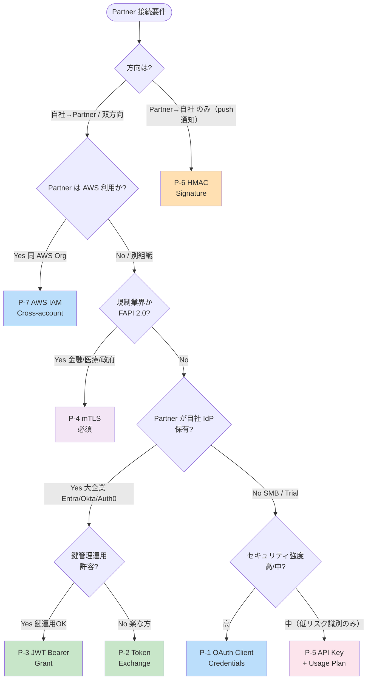
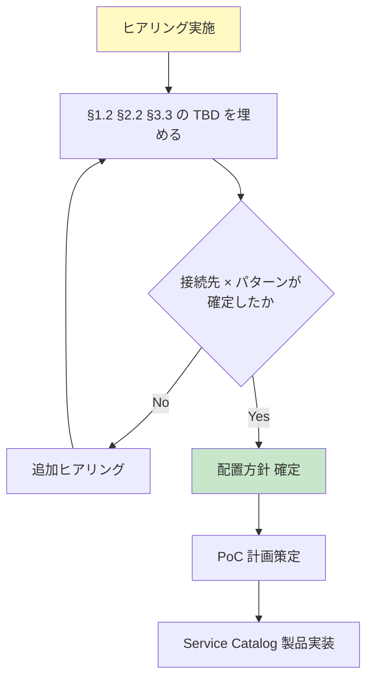

# 外部 API 認証 配置方針 — 顧客向け検討資料

> **位置付け**: 「Partner / Private API の認証を**共通基盤に置くか / 各アプリに置くか**」を顧客と合意するための検討資料兼ヒアリング準備資料。
> **対象読者**: 顧客の情報システム部門 / API オーナー / アーキテクト / セキュリティ責任者
> **使い方**: §1 でヒアリング項目を埋める → §2-3 で配置方針を顧客と合議 → §4 のアクションに移行
> **関連標準**: [§C-API-6 外部 API 認証アーキテクチャ](../proposal/common/06-external-api-auth-architecture.md) （標準側 SSOT、本資料の根拠）
> **改訂**: 2026-06-19 初版

---

## 目次

1. [前提（ヒアリングで埋める）](#1-前提ヒアリングで埋める)
2. [Partner について](#2-partner-について)
3. [Private について](#3-private-について)
4. [次のアクション](#4-次のアクション)
5. [ヒアリング項目総括（チェックリスト）](#5-ヒアリング項目総括チェックリスト)

---

## 1. 前提（ヒアリングで埋める）

### 1.1 現状の API 3 カテゴリ

本標準は外部から呼ばれる API を **3 カテゴリ** に分類して認証方式を整理する：

| カテゴリ | 呼出元 | 業務例 |
|---|---|---|
| **Public** | エンドユーザー（ブラウザ / モバイル）+ 認証なし公開（公開ドキュメント等）| B2C / B2B 顧客の Web UI、ヘルスチェック、JWKS |
| **Partner** | 外部企業の Backend（M2M）、外部 SaaS Webhook 等 | 受発注、在庫同期、決済通知、API 統合 |
| **Private** | 社内 / AWS-to-AWS / 非 AWS 内部 | マイクロサービス間、GitHub Actions、on-prem |

### 1.2 各カテゴリの現状認証方式（要ヒアリング埋め）

| カテゴリ | 現状の認証方式 | 認証種別（大分類）| 該当 7 パターン（§2.1）| 共通基盤の関与 | ヒアリング ID |
|---|---|---|---|---|:---:|
| **Public** | <span style="color:gray">TBD: 共有認証基盤（Keycloak / Cognito）が JWT 発行、各アプリ API GW が JWT 検証</span> | **OAuth トークン** | P-1 / P-2 / P-3 のいずれか相当 | ✅（既定）| `H-CTX-1` |
| **Partner** | <span style="color:gray">TBD: 現在連携 Partner なし / 既存連携あり（方式：____）</span> | <span style="color:gray">TBD: OAuth トークン / 証明書 (mTLS) / 共有秘密キー (API Key・HMAC) / AWS IAM / その他</span> | <span style="color:gray">TBD: P-1〜P-7 のうち該当</span> | <span style="color:gray">TBD</span> | `H-CTX-2` |
| **Private** | <span style="color:gray">TBD: AWS IAM SigV4 / VPC Lattice / mTLS / その他</span> | <span style="color:gray">TBD: AWS IAM / 証明書 (mTLS) / その他</span> | <span style="color:gray">TBD: P-4 (mTLS) / P-7 (AWS IAM) 相当</span> | <span style="color:gray">TBD</span> | `H-CTX-3` |

#### 認証種別（大分類）の定義

| 大分類 | 内容 | 該当 7 パターン |
|---|---|---|
| **OAuth トークン** | IdP で credential 認証 → Bearer JWT 取得 → API 呼出に提示 | **P-1**（Client Credentials）/ **P-2**（Token Exchange）/ **P-3**（JWT Bearer）|
| **証明書 (mTLS)** | クライアント証明書を TLS handshake で検証 | **P-4** mTLS |
| **共有秘密キー** | 事前共有 secret を提示（静的）または署名計算（動的）| **P-5** API Key / **P-6** HMAC Signature |
| **AWS IAM 署名** | AWS SDK が SigV4 で各リクエスト署名 | **P-7** AWS IAM Cross-account |
| **その他** | 上記いずれにも該当しない独自方式 | 個別検討 |

> ✏️ **ヒアリング埋め**：上記の TBD 部分は顧客の現状認証方式 / Partner 数 / Private 連携方式を確認して埋める。
> 📎 **「大分類」と「7 パターン」の使い分け**：顧客との初期会話では「大分類」（OAuth / 証明書 / キー / IAM）で把握、技術詳細議論は「7 パターン」（P-1〜P-7）で精密化、というレイヤーで使い分ける。

### 1.3 §1.2「現状認証方式」と §2.1「7 パターン」の関係（Tier 廃止の補足）

| 観点 | §1.2 現状認証方式 | §2.1 7 パターン カタログ |
|---|---|---|
| **目的** | 顧客の **現在の認証実装状況**を捉える | **設計判断のための分類フレーム** |
| **粒度** | カテゴリ単位（Public / Partner / Private 3 区分）| 接続先単位（個別 Partner / SaaS 単位、5-15 件想定）|
| **使い方** | ヒアリングで現状把握 | 接続先ごとに「どのパターンか」を判定 |
| **連携** | §1.2 で把握した現状 →  §2.1 のどのパターンに該当するかをマッピング | §2.2 接続先マッピング表で統合 |

#### 旧 Tier 表現の廃止について

これまで議論で使っていた **Bronze / Silver / Gold tier 表現は本標準では使わない**。理由：

| 観点 | Tier フレーム | §2.1 7 パターン フレーム |
|---|---|---|
| **抽象度** | 抽象的（Bronze って具体的に何？が残る）| 具体的（P-2 = RFC 8693 と直接ひもづく）|
| **網羅性** | Bronze/Silver/Gold の 3 段（HMAC / IAM が漏れる）| 7 パターンで網羅 |
| **顧客説明** | 「Silver tier」と言われても意味不明 | 「OAuth Token Exchange」と言えば技術者に伝わる |
| **プラットフォーム選定への寄与** | 関連不明 | §2.1 表で直接 Keycloak/Cognito 対応可否が見える |

→ **ユーザ指摘通り、§2.1 の「認証方式直接分類」の方が分かりやすい**。Tier 表現は廃止し、本資料以降は **「P-1〜P-7 のどれか」で議論する**。

### 1.4 本資料の検討範囲

| カテゴリ | 本資料での検討 |
|---|---|
| **Public** | 共通基盤（共有認証基盤）採用で確定。本資料の検討対象外 |
| **Partner** | ⭐ **アプリ側 vs 共通基盤** の配置を検討（§2）|
| **Private** | ⭐ **IAM 単独で十分か、共通基盤も検討対象か**（§3）|

### 1.5 検討の動機

- **アプリチームの自律性**：リリースサイクルや SaaS 選定をアプリチームが自己完結したい
- **責任境界の明確化**：認証基盤チームとアプリチームの役割分担
- **業務適合性**：Partner / SaaS との運用関係は業務に深く紐づく、アプリチームが詳しい
- **ガバナンス担保**：自律化しても認証実装漏れが発生しないか確認したい

---

## 2. Partner について

### 2.1 Partner 認証 7 パターン（顧客自己分類用）

> ⚠️ **本表の適用範囲（重要）**：本表は **Inbound（外部 Partner / SaaS → 自社 API）** の認証パターンを整理したもの。**Outbound（自社 → 外部 SaaS）** は接続先 SaaS が認証 protocol を決めるため、自由に選べる設計判断ではない（§2.1.A 参照）。
> 🗑️ **Tier 表現（Bronze/Silver/Gold）は廃止**：本標準では「7 パターン」を正規モデルとし、抽象的な Tier 表現は使わない。「どのパターンに該当するか」で接続先ごとに直接判定する。

外部企業 / SaaS と本システムを Inbound 連携する場合、認証方式は **7 つの基本パターン**に分類される。顧客は接続先ごとにどのパターンが該当するかを判断する。

#### 7 パターン早見表（Inbound）

| # | パターン | **大分類**（§1.2 連携）| セキュリティ強度 | Partner 側に必要な機能 | 業界実例 | **Keycloak 対応** | **Cognito 対応** |
|:---:|---|:---:|:---:|---|---|:---:|:---:|
| **P-1** | **OAuth 2.0 Client Credentials Grant** | **OAuth トークン** | 中-高 | client_id / client_secret を保管できる | Salesforce, Microsoft Graph, Stripe (モダン版) | ✅ ネイティブ | ✅ Plus tier (2024-11 GA) |
| **P-2** | **OAuth 2.0 Token Exchange (RFC 8693)** | **OAuth トークン** | 高 | 自社 OIDC IdP（Entra ID / Okta / Auth0 等）を保有 | OIDC Federation, Auth0 multi-org, Curity | ✅ ネイティブ（v22+ で v2 GA）| ❌ **未対応** |
| **P-3** | **OAuth 2.0 JWT Bearer Grant (RFC 7523)** | **OAuth トークン** | 高 | 自社 PKI で JWT 署名できる | GitHub Apps, Snowflake | ✅ ネイティブ | ❌ 未対応 |
| **P-4** | **mTLS（Mutual TLS, RFC 8705）** | **証明書 (mTLS)** | 最高 | クライアント証明書発行運用ができる | 金融 / 決済 / FAPI 2.0 / 医療 | ✅ ネイティブ（X.509 Authenticator）| △ Cognito 単体不可、API GW Custom Domain mTLS で別レイヤー実装 |
| **P-5** | **API Key + Usage Plan** | **共有秘密キー** | 低 | 文字列を保管できる | Stripe（一部）, Twilio, SendGrid | – 認証基盤対象外（API GW Usage Plan）| – 認証基盤対象外 |
| **P-6** | **HMAC Signature（Webhook 受信）** | **共有秘密キー** | 中 | shared secret + 署名計算 | Stripe → 決済通知, GitHub → push event | – 認証基盤対象外（Lambda Authorizer 実装）| – 認証基盤対象外 |
| **P-7** | **AWS IAM Cross-account (SigV4)** | **AWS IAM 署名** | 高 | AWS アカウント保有 + IAM Role 設定 | AWS-to-AWS Partner（VPC Peering / Lattice）| – 認証基盤対象外（AWS IAM）| – 認証基盤対象外 |

#### Keycloak / Cognito 対応観点でのプラットフォーム選定示唆

| 採用 protocol | 推奨プラットフォーム | 根拠 |
|---|---|---|
| **P-1 のみ** | Cognito Plus tier or Keycloak | どちらでも可、コスト・運用負荷で選定 |
| **P-2 Token Exchange を採用** | **Keycloak 必須**（Cognito 未対応）| RFC 8693 サポートは Keycloak のみ |
| **P-3 JWT Bearer Grant を採用** | **Keycloak 必須** | Cognito 未対応 |
| **P-4 mTLS を採用** | Keycloak が望ましい | Cognito は API GW 別レイヤー実装必要 |
| **P-5/P-6/P-7** | 認証基盤に依存しない（API GW / IAM）| プラットフォーム選定への影響なし |

→ **本標準で Keycloak を採用する根拠の中核は P-2 / P-3 / P-4**。これらを使わない前提なら Cognito Plus も選択肢。

#### Tier 表現との対応（廃止）

旧 Tier 表現を廃止し、7 パターンに統一する：

| 旧 Tier 表現 | 新 7 パターン表現 | 利点 |
|---|---|---|
| Bronze tier | P-1 OAuth Client Credentials または P-5 API Key | 「何の protocol か」が明確 |
| Silver tier | **P-2 Token Exchange** | RFC 8693 という具体仕様 |
| Gold tier | **P-4 mTLS** + P-1/P-2 のいずれか（併用）| 「mTLS + OAuth」と組合せ明示可 |
| Tier 該当なし | P-3 / P-6 / P-7 | 旧フレームでは表現できなかった protocol を網羅 |

→ **「Bronze/Silver/Gold で語る」習慣を捨て、「P-1〜P-7 のどれか」で議論する**。

#### ⚠️ Outbound（自社 → 外部 SaaS）の扱い

Outbound は **接続先 SaaS が認証 protocol を決める**ため、Inbound のような「設計判断としての 7 パターン選定」は発生しない。我々がやることは **「SaaS の規定に従ってクライアント実装する + credential を Secrets Manager で安全保管する」**のみ。

##### 代表 SaaS 別 Outbound 認証

| SaaS | SaaS が要求する protocol | 我々の実装 |
|---|---|---|
| **Stripe** | API Key（Secret Key）または OAuth Connect | `Authorization: Bearer <key>` 送信 |
| **SendGrid** | API Key | `Authorization: Bearer <key>` 送信 |
| **OpenAI** | API Key | `Authorization: Bearer <key>` 送信 |
| **Slack** | OAuth 2.0 Auth Code Flow | OAuth Flow 実装 + token 保管 + Refresh 運用 |
| **GitHub API（個人 PAT）** | API Key 相当（PAT）| Header 送信 |
| **GitHub App** | JWT Bearer + Installation Token | JWT 署名実装 + Token 取得 |
| **Microsoft Graph** | OAuth Client Credentials | P-1 と同等の Outbound 版 |
| **AWS Services** | AWS SDK SigV4 | SDK 自動署名（追加実装ゼロ）|

→ Outbound 設計判断は「**どの SaaS を採用するか**」と「**credential をどう保管・ローテするか**」の 2 点のみ。protocol は SaaS 側依存。

##### Outbound で 7 パターンを「逆向き」に見ると

技術的にプロトコルは双方向で使えるが、Outbound での典型出現頻度：

| パターン | Inbound 典型度 | Outbound 典型度 | Outbound 採用 SaaS 例 |
|---|:---:|:---:|---|
| P-1 OAuth Client Credentials | ✅ 主流 | ⚠ 一部 | Microsoft Graph, Salesforce |
| P-2 Token Exchange | ✅ 主流 | ❌ ほぼなし | – |
| P-3 JWT Bearer Grant | ✅ 主流 | ⚠ 限定 | GitHub App |
| P-4 mTLS | ✅ 主流 | ⚠ 限定 | 金融機関 API 連携時 |
| P-5 API Key | ⚠ | ✅ **主流** | **Stripe / SendGrid / OpenAI** |
| P-6 HMAC | ✅（受信）| ⚠（送信）| 自社が Webhook 送信する時 |
| P-7 AWS IAM | ✅ | ✅（AWS-to-AWS）| AWS Service / Marketplace Partner |

→ **Outbound の主流は P-5 API Key**（業界の SaaS 主流が API Key のため）。本資料の §2.4 配置比較も「API Key 中心の Outbound」を前提に整理している。

#### 各パターンの特徴詳細

##### P-1: OAuth 2.0 Client Credentials Grant

| 項目 | 内容 |
|---|---|
| **概要** | Partner が `client_id + client_secret` を共有認証基盤の `/oauth2/token` に送って Bearer JWT を取得、API 呼出時に Bearer ヘッダで提示 |
| **メリット** | OAuth 2.0 業界標準、SDK 豊富、Token TTL で被害限定 |
| **デメリット** | client_secret 漏洩リスク、ローテ運用必要 |
| **典型ユースケース** | Partner が自社 IdP を持たない SMB / Trial、一般的な B2B SaaS 連携 |
| **セキュリティ要件適合** | 機密度：中、規制：通常 B2B、頻度：高頻度 OK |

##### P-2: OAuth 2.0 Token Exchange (RFC 8693)

| 項目 | 内容 |
|---|---|
| **概要** | Partner が自社 IdP で発行した token を `/oauth2/token` で exchange、本基盤発行 token に変換して API 呼出 |
| **メリット** | Partner 側で credential 管理完結、ローテ Partner 自社運用、我々が secret 配布不要 |
| **デメリット** | Partner 側 IdP 保有が前提、信頼台帳の運用必要 |
| **典型ユースケース** | Partner が大企業で Entra ID / Okta / Auth0 保有、Federation 重視 |
| **セキュリティ要件適合** | 機密度：中-高、規制：通常 B2B + 監査強化、頻度：高頻度 OK |

##### P-3: OAuth 2.0 JWT Bearer Grant (RFC 7523)

| 項目 | 内容 |
|---|---|
| **概要** | Partner が自社秘密鍵で署名した JWT を `assertion` として送信、認証基盤が公開鍵で検証 |
| **メリット** | shared secret 不要、暗号学的検証、漏洩リスク低 |
| **デメリット** | Partner 側で鍵管理 + JWT 署名実装必要、運用負荷高 |
| **典型ユースケース** | GitHub Apps、データ分析 SaaS、エンタープライズ自社開発システム |
| **セキュリティ要件適合** | 機密度：高、規制：強化、頻度：高頻度 OK |

##### P-4: mTLS（Mutual TLS, RFC 8705）

| 項目 | 内容 |
|---|---|
| **概要** | TLS handshake 時に Partner のクライアント証明書を検証、API GW Custom Domain で mTLS 終端 |
| **メリット** | TLS 層で認証完結、最高セキュリティ、Certificate-bound Token も可（cnf claim） |
| **デメリット** | 証明書発行・配布・失効運用（CRL）が必要、CloudFront 経由不可 |
| **典型ユースケース** | 金融 / 決済 / オープンバンキング / FAPI 2.0 / 医療 / 政府連携 |
| **セキュリティ要件適合** | 機密度：最高、規制：金融 / HIPAA / FedRAMP、頻度：中-高頻度 |

##### P-5: API Key + Usage Plan

| 項目 | 内容 |
|---|---|
| **概要** | API Gateway 発行の API Key を `x-api-key` ヘッダで送信、Usage Plan で識別 + クォータ管理 |
| **メリット** | 最もシンプル、開発工数最小、即時オンボーディング |
| **デメリット** | **AWS 公式：認証用途は非推奨**（識別のみ）、漏洩リスク高、暗号学的検証なし |
| **典型ユースケース** | 公開 API のトライアル、識別 + 課金専用、低リスク連携 |
| **セキュリティ要件適合** | 機密度：低、規制：なし、頻度：低-中 |

##### P-6: HMAC Signature（Webhook 受信）

| 項目 | 内容 |
|---|---|
| **概要** | 外部 SaaS（Stripe / GitHub 等）が本システムに push する際、shared secret で HMAC 署名、本システムが検証 |
| **メリット** | Webhook 専用、SaaS 業界標準、Replay 対策と組合せ可 |
| **デメリット** | OAuth は使えない（送信側が SaaS のため）、shared secret ローテ必要 |
| **典型ユースケース** | Stripe → 決済通知、GitHub → push event、Auth0 → user event |
| **セキュリティ要件適合** | 機密度：中、規制：SaaS 側準拠、頻度：イベント駆動 |

##### P-7: AWS IAM Cross-account (SigV4)

| 項目 | 内容 |
|---|---|
| **概要** | Partner も AWS アカウント保有、IAM Role を Cross-account Assume、SigV4 で API 呼出 |
| **メリット** | AWS マネージドで完結、credential 不要（STS 動的発行）、最小権限細粒度 |
| **デメリット** | Partner も AWS 利用が前提、AWS 外 Partner には適用不可 |
| **典型ユースケース** | AWS Marketplace SaaS、AWS パートナー企業との B2B、VPC Lattice cross-account |
| **セキュリティ要件適合** | 機密度：高、規制：AWS 環境内、頻度：高頻度 OK |

#### セキュリティ要件 → パターン推奨フロー

接続先ごとの **セキュリティ要件**から推奨パターンを判定：



### 2.2 想定接続先 × パターン マッピング表（ヒアリング埋め）

顧客が想定する Partner / SaaS の接続先と適用パターンを整理：

| # | 接続先（想定）| 方向 | パターン | セキュリティ要件 | ヒアリング ID |
|:---:|---|:---:|:---:|---|:---:|
| 1 | <span style="color:gray">TBD: 例 Stripe（決済）</span> | Inbound | P-6 HMAC | 機密度高、PCI 関連 | `H-CON-1` |
| 2 | <span style="color:gray">TBD: 例 自社モバイルアプリ Partner</span> | Inbound | P-1 OAuth | 機密度中 | `H-CON-2` |
| 3 | <span style="color:gray">TBD: 例 大企業 Salesforce 連携</span> | Inbound | P-2 Token Exchange | 機密度中-高 | `H-CON-3` |
| 4 | <span style="color:gray">TBD: 例 銀行 API 連携</span> | Inbound | P-4 mTLS | 規制金融 | `H-CON-4` |
| 5 | <span style="color:gray">TBD: 例 SendGrid（メール送信）</span> | **Outbound** | API Key + IP allowlist | 機密度低 | `H-CON-5` |
| 6 | <span style="color:gray">TBD: 例 OpenAI API</span> | **Outbound** | API Key | 機密度中 | `H-CON-6` |
| 7 | <span style="color:gray">TBD: 例 Slack 通知</span> | **Outbound** | OAuth + Webhook | 機密度中 | `H-CON-7` |
| 8 | <span style="color:gray">TBD: 例 AWS Marketplace Partner</span> | 双方向 | P-7 AWS IAM | 機密度高 | `H-CON-8` |

> ✏️ **ヒアリング埋め**：顧客の想定接続先 5-15 件をリストアップ、各々の方向 / パターン / セキュリティ要件を確認。

### 2.3 Inbound / Outbound サマリ

外部 API 連携には **方向が 2 種類**あり、認証の構造が異なる：

| 観点 | Inbound（外部 → 自社）| Outbound（自社 → 外部）|
|---|---|---|
| **代表ユースケース** | Partner B2B システムが自社 API を呼ぶ / SaaS Webhook 受信 | 自社 Lambda が Stripe / SendGrid / OpenAI を呼ぶ |
| **credential 発行者** | **自社認証基盤**（Engine） | **外部 SaaS**（Engine）|
| **credential 保管場所** | Partner 側で保管 | 自社 Secrets Manager |
| **検証実施場所** | 自社 API GW で検証 | 外部 SaaS で検証 |
| **方向別の認証パターン** | P-1〜P-4, P-6, P-7 | API Key / OAuth / Bearer（外部 SaaS 規格に従う）|
| **対抗先との運用関係** | 自社アプリチーム ↔ Partner | 自社アプリチーム ↔ SaaS Vendor |
| **「アプリに寄せる」議論対象** | ⭐ Yes（§2.4-2.5 参照）| ⭐ Yes（§2.4-2.5 参照）|

→ **方向に関わらず、対抗先との運用関係（契約・credential 配布・ローテ調整）はアプリチームに集中する**。これが「アプリ自律性」の正当化根拠。

### 2.4 Outbound（自社 → SaaS）配置比較

自社アプリが外部 SaaS を呼ぶ際の credential 管理を **どこで実装するか**：

#### A. 各アプリで実装（分散モデル）

```
[App A account]
  Lambda → 自 account の Secrets Manager（Stripe credential）→ Stripe

[App B account]
  Lambda → 自 account の Secrets Manager（SendGrid credential）→ SendGrid
```

| 観点 | メリット | デメリット |
|---|---|---|
| **自律性** | ✅ アプリチームが SaaS 選定・契約・credential 取得を完結 | – |
| **リリース連動** | ✅ 新規 SaaS 採用がアプリリリースと同時 | – |
| **責任境界** | ✅ 障害・トラブル対応は自アプリ完結 | – |
| **コスト按分** | ✅ 各 account 課金でクリア | – |
| **ガバナンス** | – | ⚠ Approved SaaS Allowlist を中央で管理する仕組みが必要 |
| **secret 散在** | – | ⚠ N アプリ × N SaaS で credential が分散、棚卸し困難 |
| **ローテ運用** | – | ⚠ アプリチームの実装品質次第、ローテ漏れリスク |
| **DPA / 法務確認** | – | ⚠ 各アプリで個別確認すると重複・漏れ |

#### B. 共通基盤で実装（中央モデル）

```
[共通基盤 account]
  Secrets Manager Vault → SaaS credential 中央管理
    ↑ API
[App A account] Lambda → 共通基盤 API で credential 取得 → Stripe
[App B account] Lambda → 共通基盤 API で credential 取得 → SendGrid
```

| 観点 | メリット | デメリット |
|---|---|---|
| **ガバナンス** | ✅ Approved SaaS / DPA 確認が中央 1 箇所 | – |
| **棚卸し** | ✅ 全社の SaaS 利用一覧化が容易 | – |
| **ローテ運用** | ✅ 中央で標準化 | – |
| **secret 集中管理** | ✅ Vault パターン | – |
| **自律性** | – | ❌ 新規 SaaS 採用は中央承認待ち、リードタイム長 |
| **リリース連動性** | – | ❌ アプリリリースと SaaS credential 設定が別動線 |
| **複雑性** | – | ⚠ 中央 API 経由 = 追加 hop / 追加障害点 |
| **業務適合性** | – | ❌ アプリ固有の SaaS 選定理由を中央が判断するのは困難 |

#### 推奨：A（各アプリ実装）+ 中央ガバナンス補強

| 中央が担保すべきガバナンス | 仕組み |
|---|---|
| **Approved SaaS Allowlist** | Security / Legal レビュー後にカタログ化、Service Catalog テンプレで強制 |
| **Secret 保管標準** | Secrets Manager + CMK + 自動ローテ、Config Rule で強制 |
| **DPA / 法務確認** | 法務台帳 + タグで紐付け、年次棚卸し |
| **コスト可視化** | FinOps タグ + Cost Explorer |
| **検知** | 環境変数 credential を持つ Lambda の deploy 拒否（cfn-guard / Service Catalog）|

→ **「各アプリ実装 + 中央 5 項目ガバナンス」**で自律性とガバナンスを両立。

### 2.5 Inbound（SaaS → 自社）配置比較

外部 Partner が自社 API を呼ぶ際の Engine（OAuth / JWT 発行・検証基盤）を **どこに置くか**：

#### A. 各アプリで実装（分散モデル）

```
[App A account]
  Cognito User Pool A → Partner X 用 M2M client 発行
  API GW → 自 account Cognito Authorizer で検証

[App B account]
  Cognito User Pool B → Partner Y 用 M2M client 発行
  API GW → 自 account Cognito Authorizer で検証
```

| 観点 | メリット | デメリット |
|---|---|---|
| **自律性** | ✅ アプリチームが Pool を所有、運用完全自律 | – |
| **Blast radius** | ✅ 別 account / 別 Pool で完全独立 | – |
| **コスト按分** | ✅ 各 account 課金 | – |
| **AWS native** | ✅ Cognito Authorizer ネイティブ統合 | – |
| **責任境界** | ✅ Pool SLA / 障害対応はアプリチーム責任 | – |
| **Partner UX**（複数アプリ連携時）| – | ❌ Partner が N 個 credential を管理、N 個 token endpoint |
| **P-2 Token Exchange 対応** | – | ❌ Cognito M2M は RFC 8693 未対応 |
| **P-4 mTLS（FAPI 2.0）対応** | – | ❌ Cognito M2M は mTLS at /token 未対応 |
| **Federation**（Partner IdP 信頼台帳）| – | ❌ Cognito 未対応 |
| **追加コスト** | – | ⚠ Cognito M2M Active Client 課金（~¥1,000/月/client）|
| **メモリ整合（既存 Keycloak 確定方向）**| – | ⚠ P-2 / P-3 / P-4 不可になりプラットフォーム選定根拠と矛盾 |

#### B. 共通基盤で実装（中央モデル）

```
[共通基盤 account]
  Keycloak Public Realm  → End User
  Keycloak Partner Realm → 全 Partner（P-1〜P-4 全パターン対応）
    ↓ JWT 発行
[App A account] API GW → JWT 検証
[App B account] API GW → JWT 検証
```

| 観点 | メリット | デメリット |
|---|---|---|
| **Partner UX** | ✅ 1 credential で複数アプリ呼出可（業界標準）| – |
| **P-2 Token Exchange** | ✅ Keycloak ネイティブ対応 | – |
| **P-4 mTLS（FAPI 2.0）**| ✅ Keycloak + mTLS Custom Domain で対応 | – |
| **Federation** | ✅ Partner IdP 信頼台帳一元 | – |
| **ガバナンス** | ✅ 命名規約 / scope policy / 監査 中央 | – |
| **業界標準** | ✅ Auth0 Organizations / Okta CIC と同パターン | – |
| **自律性**（運用関係） | ✅ Self-Service Developer Portal でアプリチーム自律可能 | – |
| **Engine 中央依存** | – | ⚠ Public 障害が Partner に波及（Realm 分離で軽減）|
| **追加コスト** | – | ✅ なし（既存 Keycloak で吸収）|

#### 推奨：B（共通基盤）+ Self-Service Developer Portal

**Engine 機能（OAuth / JWT / Token Exchange / mTLS）は中央、Relationship 運用（契約・credential 配布・ローテ調整）はアプリチーム**という分担で、自律性とガバナンスを両立。

| 役割 | 担当 |
|---|---|
| Engine 提供（共有認証基盤 Partner Realm）| 認証基盤チーム（中央）|
| Self-Service Developer Portal 提供 | 認証基盤チーム（中央）|
| Partner Client 作成（Portal 経由）| **アプリチーム自律** |
| Partner Secret 配布・ローテ | **アプリチーム自律** |
| Partner SLA 管理・契約 | **アプリチーム自律** |

#### 例外：P-1 / P-5 のみで完結する場合の判断

P-2 / P-3 / P-4 が **将来も不要**と判断できる場合のみ、A（各アプリ Cognito）も選択肢になる：

| 判断条件 | Yes なら | No なら |
|---|---|---|
| Token Exchange（RFC 8693）必要か | B 中央 | A 検討可 |
| mTLS / FAPI 2.0 必要か | B 中央 | A 検討可 |
| Partner クロスアプリ連携あるか | B 中央 | A 検討可 |
| 追加コスト ¥100-200 万/年許容か | A 検討可 | B 中央 |

→ **現状要件のヒアリング次第**（`H-PAT-1` 〜 `H-PAT-4`）。

### 2.6 Inbound 配置 4 象限比較（横断ビュー）

| 配置 \ 方向 | Inbound（外部 → 自社）| Outbound（自社 → 外部）|
|---|---|---|
| **各アプリ実装** | ⚠ P-2/P-3/P-4 不可、Partner UX 悪化 | ✅ **推奨**（自律性活用）|
| **共通基盤実装** | ✅ **推奨**（Engine 中央 + Portal で自律担保）| ⚠ 過剰中央化、業務適合性低下 |

→ **Inbound = 共通基盤、Outbound = 各アプリ**の Cross 配置が業界標準。両方とも対抗先運用はアプリチームが所有。

---

## 3. Private について

### 3.1 Private 認証は IAM 単独か？

Private（社内 / 内部）API 認証は **AWS IAM SigV4 が主流だが、他にも選択肢あり**：

| # | 方式 | 対象 | 業界実例 |
|:---:|---|---|---|
| **PR-1** | **AWS IAM SigV4** | AWS-to-AWS（Lambda / ECS / EC2）| AWS native、最一般 |
| **PR-2** | **VPC Lattice Auth Policy** | AWS-to-AWS（クロス VPC / cross-account）| AWS 2023 GA、Service Mesh 代替 |
| **PR-3** | **ECS Service Connect / App Mesh** | ECS 間 mTLS 自動 | Service Mesh パターン |
| **PR-4** | **Resource-based Policy**（S3 / Lambda 等）| AWS 内 Service-to-Service | パッシブ Policy |
| **PR-5** | **OIDC Federation → STS AssumeRole** | 非 AWS Internal（GitHub Actions / on-prem）| IRSA, GitHub OIDC, EKS Pod Identity |
| **PR-6** | **mTLS（Custom Domain）** | 非 AWS Internal（on-prem システム）| Hybrid Cloud, ハイブリッド構成 |
| **PR-7** | **VPN / Direct Connect + IP allowlist** | NW 層認証（補助） | ハイブリッド、Zero Trust 違反のため単独不可 |

→ **Private = IAM 単独ではなく、対象システムの種類で 7 選択肢から選ぶ**。

### 3.2 Private 認証 配置比較

#### A. 各システムで実装（分散モデル）

```
App A → IAM SigV4 で App B の API GW を呼出
App B → IAM SigV4 で App C の API GW を呼出
（各 API GW で AuthorizationType=AWS_IAM）
```

| 観点 | メリット | デメリット |
|---|---|---|
| **AWS native** | ✅ 追加運用ゼロ、AWS SDK 自動署名 | – |
| **レイテンシ** | ✅ 最小（追加 hop なし）| – |
| **コスト** | ✅ 追加コスト基本なし | – |
| **設計シンプル** | ✅ IAM Role の最小権限設計のみ | – |
| **マネージド** | ✅ AWS が証明書ローテ等を運用 | – |
| **Cross-cutting policy** | – | ⚠ retry / circuit breaker / mTLS auto は別途実装 |
| **可観測性** | – | ⚠ Service Mesh 標準メトリクスなし |

#### B. 共通基盤（Service Mesh）で実装（中央モデル）

```
App A → Sidecar Envoy → mTLS auto → App B Sidecar → App B
        ↑ 中央 Control Plane が policy 配布
```

| 観点 | メリット | デメリット |
|---|---|---|
| **Cross-cutting policy** | ✅ retry / timeout / mTLS auto / circuit breaker 一元 | – |
| **可観測性** | ✅ メトリクス / トレース自動 | – |
| **mTLS 自動化** | ✅ 証明書ローテ Mesh が管理 | – |
| **言語非依存** | ✅ アプリコードは認証ロジック不要 | – |
| **運用負荷** | – | ❌ Control Plane / Sidecar の運用負荷大 |
| **レイテンシ** | – | ⚠ Sidecar 経由 +5-20ms |
| **コスト** | – | ❌ Sidecar リソース + Control Plane インフラ |
| **学習曲線** | – | ❌ Istio / App Mesh / Linkerd の専門知識 |

#### C. AWS マネージド（VPC Lattice）— 中間アプローチ

```
App A → VPC Lattice Service → App B
        ↑ Auth Policy（IAM 統合）+ Network 統合
```

| 観点 | メリット | デメリット |
|---|---|---|
| **AWS マネージド** | ✅ Sidecar 不要、Control Plane 不要 | – |
| **IAM 統合** | ✅ Auth Policy で IAM Principal ベース | – |
| **Service Discovery** | ✅ 統合 DNS | – |
| **Cross-VPC / Cross-account** | ✅ 自然対応 | – |
| **mTLS 自動化** | – | ⚠ VPC Lattice は TLS 終端、mTLS は未対応（2026 時点）|
| **業界実績** | – | ⚠ 2023 GA で実績まだ少ない |

#### 配置別 評価まとめ

| 配置 | レイテンシ | 運用負荷 | Cross-cutting Policy | 推奨用途 |
|---|:---:|:---:|:---:|---|
| **A. 各アプリ IAM SigV4** | ✅ 最小 | ✅ 最小 | – | デフォルト推奨 |
| **B. Service Mesh** | ⚠ +5-20ms | ❌ 大 | ✅ 強 | 大規模 mesh / 複雑 routing 要件 |
| **C. VPC Lattice** | ⚠ +少 | ⚠ 中 | ⚠ 中 | Cross-account / Cross-VPC 多 |

#### 推奨：A（各アプリ IAM）+ C（VPC Lattice）のハイブリッド

| シナリオ | 推奨配置 |
|---|---|
| 同一 account 内 Service-to-Service | **A: IAM SigV4** |
| Cross-account / Cross-VPC | **C: VPC Lattice + IAM Auth Policy** |
| 非 AWS Internal（GitHub Actions）| **PR-5: OIDC Federation → STS** |
| 非 AWS Internal（on-prem）| **PR-6: mTLS Custom Domain** |
| 大規模 mesh / Istio 既存資産 | **B: Service Mesh** |

→ **基本は A + C のハイブリッド、Mesh は組織的に既に運用していなければ採用しない**。

### 3.3 Private 配置 ヒアリング項目

| 項目 | 内容 | ID |
|---|---|:---:|
| 想定される Private 連携の対象システム | <span style="color:gray">TBD: AWS-to-AWS / 非 AWS Internal / on-prem</span> | `H-PRV-1` |
| 連携頻度・レイテンシ要件 | <span style="color:gray">TBD: 高頻度 / 低頻度 / リアルタイム</span> | `H-PRV-2` |
| Cross-account / Cross-VPC の有無 | <span style="color:gray">TBD: あり / なし</span> | `H-PRV-3` |
| Service Mesh 既存採用状況 | <span style="color:gray">TBD: あり / なし / 検討中</span> | `H-PRV-4` |
| mTLS 必須要件の有無 | <span style="color:gray">TBD: あり / なし</span> | `H-PRV-5` |

---

## 4. 次のアクション

### 4.1 ヒアリング → 配置確定までのフロー



### 4.2 配置確定後の PoC 候補

| Phase | 内容 |
|---|---|
| PoC-1 | P-1 OAuth Client Credentials の Inbound 動作検証 |
| PoC-2 | P-2 Token Exchange の Inbound 動作検証（該当する場合）|
| PoC-3 | P-4 mTLS の Inbound 動作検証（該当する場合）|
| PoC-4 | Outbound SaaS（Stripe / SendGrid / OpenAI 等）の credential 管理パターン検証 |
| PoC-5 | Private（IAM SigV4 / VPC Lattice）の Cross-account 動作検証 |

---

## 5. ヒアリング項目総括（チェックリスト）

### 5.1 現状把握（H-CTX）

| ID | 質問 | 確認内容 |
|:---:|---|---|
| `H-CTX-1` | 現状の Public API 認証方式 | 共有認証基盤の有無 / IdP の種類 / JWT 検証実装場所 |
| `H-CTX-2` | 現状の Partner API 認証方式 | 連携 Partner の有無 / 既存方式（API Key / OAuth / mTLS）|
| `H-CTX-3` | 現状の Private API 認証方式 | AWS IAM / VPC Lattice / Service Mesh / その他 |

### 5.2 Partner 想定接続先（H-CON）

| ID | 質問 | 確認内容 |
|:---:|---|---|
| `H-CON-1〜N` | 想定接続先リスト | 5-15 件、方向（In/Out）、業界、規模、機密度 |
| `H-CON-X1` | Partner 数の現状と将来想定 | 現状 / 1 年 / 3 年後の想定 |
| `H-CON-X2` | クロスアプリ Partner の有無 | 1 Partner が複数アプリと連携するか |

### 5.3 Partner 認証方式選定（H-PAT）

| ID | 質問 | 確認内容 |
|:---:|---|---|
| `H-PAT-1` | Token Exchange（RFC 8693）必要性 | Partner が大企業 IdP 保有か、Federation 重視か |
| `H-PAT-2` | mTLS / FAPI 2.0 必要性 | 金融 / 医療 / 政府連携の有無 |
| `H-PAT-3` | Webhook 受信パターン（HMAC）| 外部 SaaS からの push 通知の有無（Stripe / GitHub 等）|
| `H-PAT-4` | AWS IAM Cross-account パターン | Partner が AWS Marketplace 等か |
| `H-PAT-5` | 追加コスト許容範囲 | Cognito M2M ¥100-200 万/年 vs Keycloak 既存吸収 |

### 5.4 Outbound（自社 → SaaS）（H-OUT）

| ID | 質問 | 確認内容 |
|:---:|---|---|
| `H-OUT-1` | 想定 SaaS リスト | 5-15 件、用途、機密度 |
| `H-OUT-2` | DPA / 法務確認状況 | 既に締結済 / 未確認の区分 |
| `H-OUT-3` | Approved SaaS Allowlist 承認プロセス | Security / Legal の関与 |
| `H-OUT-4` | アプリチームの credential 管理運用 | Secrets Manager 既利用 / 環境変数利用 |

### 5.5 Private（H-PRV）

| ID | 質問 | 確認内容 |
|:---:|---|---|
| `H-PRV-1` | 想定 Private 連携対象 | AWS-to-AWS / 非 AWS Internal / on-prem |
| `H-PRV-2` | 連携頻度・レイテンシ要件 | 高頻度 / 低頻度 / リアルタイム |
| `H-PRV-3` | Cross-account / Cross-VPC | 有無 / 規模 |
| `H-PRV-4` | Service Mesh 既存採用 | あり / なし / 検討中 |
| `H-PRV-5` | mTLS 必須要件 | あり / なし |

### 5.6 自律性 vs ガバナンス（H-GOV）

| ID | 質問 | 確認内容 |
|:---:|---|---|
| `H-GOV-1` | アプリチームと認証基盤チームの分離度 | 別組織 / 同組織 / マトリクス |
| `H-GOV-2` | リリース自律性の重要度 | 月次 / 週次 / 任意のタイミング |
| `H-GOV-3` | ガバナンス要件（監査・コンプラ）| PCI / APPI / GDPR / SOC2 |
| `H-GOV-4` | Self-Service Developer Portal 採用可否 | 採用 / 検討 / 不採用 |
| `H-GOV-5` | Two-Track 承認モデル受容 | 日常自律 + 増分リスク承認 OK か |

---

## 改訂履歴

- **2026-06-19 初版**：3 カテゴリ前提 + Partner 7 パターン × ユースケース + 接続先マッピング + Inbound/Outbound 4 象限比較 + Private 7 選択肢比較 + ヒアリング項目総括 30+ 項目を統合。顧客説明可能な水準でドキュメント化、TBD はヒアリング後に埋める前提。

---

## 関連ドキュメント

- [§C-API-6 外部 API 認証アーキテクチャ](../proposal/common/06-external-api-auth-architecture.md) — 本資料の根拠となる標準側 SSOT
- [§FR-API-0 外部 API 実行 6 タイプ](../proposal/fr/00-external-api-consumption-overview.md) — Inbound 詳細
- [§FR-API-2 認証認可詳細](../proposal/fr/02-authn-authz.md) — Engine 機能仕様
- [hearing-checklist.md](../hearing-checklist.md) — 既存ヒアリング項目との統合候補
