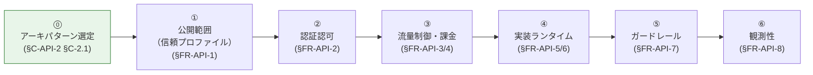

# API プラットフォーム標準 要件定義 提示版（proposal）

> **本フォルダは SSOT**：API プラットフォーム標準の要件を関係者に**提示する**ためのドキュメント群。
> 親 SSOT: [../requirements-document-structure.md](../requirements-document-structure.md) — 章立て・ナラティブ・依存関係
> 元データ: 機能要件カタログ（functional-requirements.md、TBD）／非機能要件カタログ（non-functional-requirements.md、TBD）

---

## §0 はじめに：本標準の基本方針

本標準は **「絶対安全に、どんなアプリでも、効率よく API を提供でき、運用負荷やコストがかからない」共通の API プラットフォーム標準** を目指す。すべての要件は次の 4 軸で評価する：

| 基本方針の柱 | 解釈 |
|---|---|
| **絶対安全** | WAF / 認証必須 / 暗号化必須 / 最小権限 / シークレット管理（OWASP Top 10 / AWS Well-Architected Security Pillar 準拠） |
| **どんなアプリでも** | Serverless（API GW + Lambda）／Container（ECS）の **2 系統標準カタログ**。新規アプリは原則どちらかに収まる |
| **効率よく** | 標準テンプレ・Service Catalog・IaC モジュール・Landing Zone で **アプリ開発者が self-service** |
| **運用負荷・コスト最小** | マネージドサービス優先、監査アカウントから **FMS / Config Rules** で横断ガードレール配信、Cost allocation tag で利用者按分 |

各章はこの 4 軸への立場を明示する。

### 本標準のアーキテクチャ前提：Federated（連邦型）

本標準は **「中央集権的な共通 API 基盤」ではなく、「分散ガイド + 共通要素のみ中央化」** を採用する：

| 中央集約すべき要素 | 各システムで分散すべき要素 |
|---|---|
| 共有認証基盤（OIDC / OAuth） | API Gateway / WAF / Lambda / ECS |
| 監査アカウント（FMS / CloudTrail / Config）| 流量制御の閾値・カスタムルール |
| Service Catalog（標準テンプレ配布）| アプリ DB / permission |
| Organization SCP | 各システム独自の業務ロジック |

**根拠**：対象システムが独立しており API も重複しない条件下で、共通化のメリット（重複削減・再利用）が消失する一方、分散のメリット（障害分離・要件最適化・リリース独立性）はフル活用される。業界主流（Netflix Paved Road / Spotify Golden Path）と整合。詳細：[common/01-reference-architecture.md §C-1.5](common/01-reference-architecture.md)。

---

## §1 要件定義の 7 ステップ（語る順序）

| Step | 章 | 答える問い |
|:---:|---|---|
| ⓪ | [§C-API-2 §C-2.1 アーキパターン選定](common/02-runtime-selection-criteria.md) | フロント・バックエンドをどう分けるか？ SPA+API / SSR+API / SSR モノリスの 3 パターン |
| ① | [§FR-API-1 公開範囲（信頼プロファイル）](fr/01-exposure-boundary.md) | どの Profile に出す API か？ パブリック（認証有/オープン）/ 社内 / パートナー / 社内限定 |
| ② | [§FR-API-2 認証認可](fr/02-authn-authz.md) | 誰が呼ぶか？ 共有認証基盤連携・API Key・mTLS・IAM auth |
| ③ | [§FR-API-3 流量制御](fr/03-throttling-quota.md) / [§FR-API-4 課金](fr/04-metering-billing.md) | どれだけ使えるか？ 誰がどれだけ使ったか？ |
| ④ | [§FR-API-5 Serverless](fr/05-serverless-standard.md) / [§FR-API-6 Container](fr/06-container-standard.md) | どう実装するか？ 2 系統標準と選定基準（モノリス vs マイクロサービス含む） |
| ⑤ | [§FR-API-7 ガードレール](fr/07-guardrails.md) | 何を全 API で必ず守らせるか？ |
| ⑥ | [§FR-API-8 観測性](fr/08-observability.md) | どう運用観測するか？ |

**ステップ ⓪ の意義**：本標準は **「外部から HTTP(S) を受ける Workload」全般**（API / SSR モノリス含む）を対象とする。3 アーキパターンをすべてサポートし、選定は各アプリに委ねる（決定木で支援）。⓪ の選定結果が ①〜⑥ の各章のデフォルト設定に影響する。

---

## §2 章ナビ

### 機能要件（[fr/](fr/00-index.md)）

| 章 | タイトル |
|---|---|
| [§FR-API-1](fr/01-exposure-boundary.md) | 公開範囲（信頼プロファイル）— 5 Profile を統合概念で扱う |
| [§FR-API-2](fr/02-authn-authz.md) | 認証認可（共有認証基盤連携 / API Key / mTLS / IAM） |
| [§FR-API-3](fr/03-throttling-quota.md) | 流量制御・クォータ |
| [§FR-API-4](fr/04-metering-billing.md) | 利用者識別・課金按分 |
| [§FR-API-5](fr/05-serverless-standard.md) | 標準アーキテクチャ：Serverless |
| [§FR-API-6](fr/06-container-standard.md) | 標準アーキテクチャ：Container（ECS） |
| [§FR-API-7](fr/07-guardrails.md) | ガードレール（監査アカウント FMS 連携） |
| [§FR-API-8](fr/08-observability.md) | 観測性（ログ・トレース・メトリクス） |

### 非機能要件（[nfr/](nfr/00-index.md)）— IPA 非機能要求グレード対応

| 章 | タイトル | IPA |
|---|---|---|
| [§NFR-API-1](nfr/01-availability.md) | 可用性 | A. |
| [§NFR-API-2](nfr/02-performance.md) | 性能 | B. |
| [§NFR-API-3](nfr/03-scalability.md) | 拡張性 | B. |
| [§NFR-API-4](nfr/04-security.md) | セキュリティ（死守事項） | E. |
| [§NFR-API-5](nfr/05-dr.md) | DR / BCP | A. |
| [§NFR-API-6](nfr/06-operations.md) | 運用 | C. |
| [§NFR-API-7](nfr/07-compliance.md) | コンプライアンス | E + C |
| [§NFR-API-8](nfr/08-cost.md) | コスト・課金可視化 | 範囲外 |
| [§NFR-API-9](nfr/09-compatibility.md) | 互換性・移行性 | D. |

### 横断章（[common/](common/00-index.md)）

| 章 | タイトル |
|---|---|
| [§C-API-1](common/01-reference-architecture.md) | 全体参照アーキテクチャ（Serverless / Container 並列） |
| [§C-API-2](common/02-runtime-selection-criteria.md) | 実装ランタイム選定基準 |
| [§C-API-3](common/03-shared-auth-boundary.md) | 共有認証基盤との接続点 |
| [§C-API-4](common/04-audit-governance.md) | 監査アカウントとのガバナンス境界 |
| [§C-API-5](common/05-self-service-catalog.md) | 標準提供物（Service Catalog / IaC モジュール） |

---

## §3 各章の冒頭規約（§X.0 前提と背景）

proposal/ 配下の各章は冒頭に **§X.0「前提と背景」**を必ず置く：

1. **用語整理** — 本章で扱う概念の定義（API プラットフォーム標準の文脈で）
2. **なぜここ（§X）で決めるか** — 他章との関係（必要に応じて mermaid）
3. **§X.0.A 本標準のスタンス** — 基本方針 4 軸への立場明示
4. **本章で扱うサブセクションの一覧**

NFR 章は加えて **IPA グレードの中項目とのマッピング表**を §X.0 内に置く。

各サブセクション規約（lead-in 3 行）：
1. **このサブセクションで定めること**
2. **主な判断軸**
3. **§X 全体との関係**

理由：標準化対象のアプリ開発者は **AWS の API プラットフォーム細部の専門家とは限らない**ため、各章でいきなり要件案を出すと「なぜそれを決める必要があるのか」が伝わらず合意取りが空回りする。

---

## §4 認証基盤 proposal との対比

| 観点 | doc/requirements/proposal/（認証基盤） | doc/api-platform/proposal/（本領域） |
|---|---|---|
| 中核ストーリー | プラットフォーム 1 つを選定（Cognito vs Keycloak） | 2 系統並行カタログ（Serverless / Container）+ ガードレール |
| §C-2 の主題 | 実装プラットフォーム選定 | **実装ランタイム選定基準**（カタログ提供前提） |
| §FR の章数 | 9 章 | 8 章 |
| §NFR の章数 | 9 章 | 9 章 |
| §C の章数 | 5 章 | 5 章 |

---

## §5 ステータス

すべての章は **🚧 ドラフト初版（骨格）**。lead-in + ベースライン要件 + TBD/要確認 の構造で記述。
ヒアリング後に詳細値を確定し、`🟡 デフォルト → ✅ 確定` に状態遷移する。
