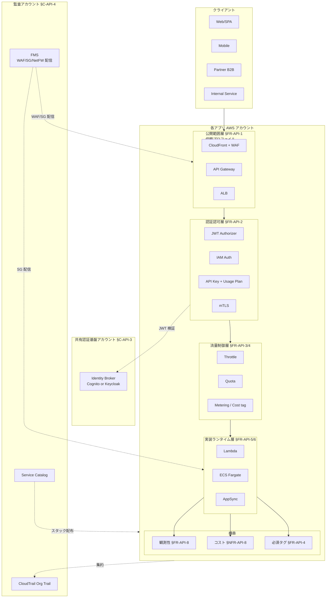
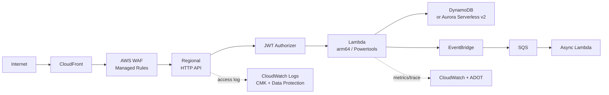
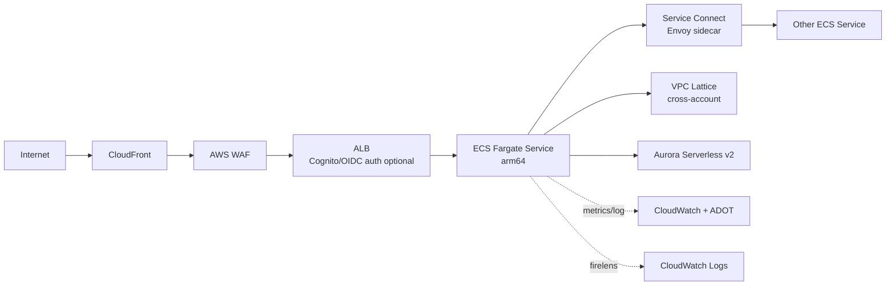
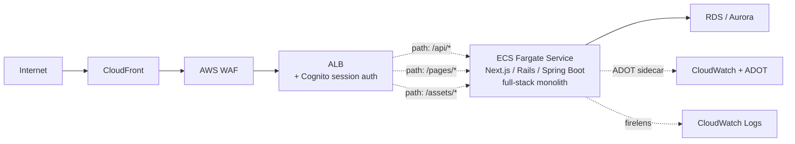

# §C-API-1 全体参照アーキテクチャ

> 親 SSOT: [../00-index.md](../00-index.md) §C-API-1
> ヒアリング: [../../hearing-script/00-common.md](../../hearing-script/00-common.md)

---

## §C-1.0 前提と背景

### §C-1.0.1 用語整理

| 用語 | 定義 |
|---|---|
| **4 層モデル** | 公開範囲 / 認証認可 / 流量制御 / 実装ランタイム の層構造。**AWS が公式に命名したフレームワークではなく**、API Gateway Developer Guide / Well-Architected Serverless Lens / Prescriptive Guidance / 業界標準の API Gateway パターン等に共通する論述順を抽出した本標準の合成（根拠は [SSOT 付録 A.0](../../requirements-document-structure.md)） |
| **Landing Zone** | AWS Organizations + Control Tower + 標準アカウント体系の総称 |
| **共有認証基盤アカウント** | OIDC/OAuth 認可サーバを提供する集中アカウント |
| **監査アカウント** | FMS Delegated Admin、CloudTrail / Config 集約先 |

### §C-1.0.2 なぜここ（§C-1）で決めるか

§FR-API-1 〜 §FR-API-8 / §NFR-API-1 〜 §NFR-API-9 の各章は **「ある層・ある側面」の標準** を定義する。本章は **全体図** を 1 つに統合し、横串で見たときの整合性を保証する。

### §C-1.0.3 §C-1.0.A 本標準のスタンス

| 基本方針 | 本章での具体化 |
|---|---|
| 絶対安全 | 全体図で監査アカウントからの配信経路（FMS / CloudTrail）を明示 |
| どんなアプリでも | Serverless / Container を並列で図示、いずれの選択でも整合性を保つ |
| 効率よく | Service Catalog で配布される「製品」と各層の対応を見える化 |
| 運用負荷・コスト最小 | マネージドサービスを最大限活用する構成 |

### §C-1.0.4 本章で扱うサブセクション

| § | サブセクション |
|---|---|
| §C-1.1 | 4 層モデル全体図 |
| §C-1.2 | Serverless パターン参照アーキ |
| §C-1.3 | Container（ECS）パターン参照アーキ — **マイクロサービス / モノリス 両方** |
| §C-1.4 | アカウント体系（Landing Zone との関係） |

---

## §C-1.1 4 層モデル全体図

**このサブセクションで定めること**：本標準の中核となる 4 層構造を 1 つの図で示す。
**主な判断軸**：層ごとの責務分離、横串（観測性・コスト・ガードレール）の整理。
**§C-1 全体との関係**：他のサブセクションがこの図の特殊化。

### §C-1.1.1 ベースライン



### §C-1.1.2 図の読み方

- **縦方向の流れ**：クライアント → L1 → L2 → L3 → L4
- **横方向の連携**：L2 が共有認証基盤と JWT 検証で連携、横串で観測・コスト・タグ
- **監査アカウントからの配信**：FMS / SCP / Service Catalog はトップダウンで各アプリへ
- **集約**：CloudTrail / Config の証跡は各アプリから監査アカウントへ

---

## §C-1.2 Serverless パターン参照アーキ

**このサブセクションで定めること**：Serverless 標準（§FR-API-5）の完成形参照アーキ。
**主な判断軸**：マネージド優先、低コスト。
**§C-1 全体との関係**：§C-1.1 を Serverless で具現化したもの。

### §C-1.2.1 公開範囲別 Serverless 構成



### §C-1.2.2 標準要素

- **CloudFront**：Public は前段必須（WAF / 直叩き防止）
- **AWS WAF**：FMS 配信 Managed Rules + rate-based + アプリ独自
- **API Gateway**：HTTP API 既定、REST は Usage Plan/API Key 必要時
- **Lambda**：Powertools 必須、ADOT で OpenTelemetry tracing
- **DB**：DynamoDB on-demand を新規既定
- **イベント**：EventBridge + SQS で非同期化

### §C-1.2.3 TBD / 要確認

- Q: 全 Serverless API で CloudFront を必須化するか → `API-B-105`（§FR-API-1 と同じ）
- Q: ADOT / X-Ray の選定（新規 ADOT 必須化）→ `API-C-821`（§FR-API-8 と同じ）

---

## §C-1.3 Container（ECS）パターン参照アーキ

**このサブセクションで定めること**：Container 標準（§FR-API-6）の完成形参照アーキ。
**主な判断軸**：Fargate 既定、Service Connect / Lattice。
**§C-1 全体との関係**：§C-1.1 を Container で具現化したもの。

### §C-1.3.1 公開範囲別 Container 構成



### §C-1.3.2 標準要素

- **CloudFront / WAF**：Public は同じく前段必須
- **ALB**：共有 ALB で複数 ECS service を host/path 振り分け
- **ECS Fargate**：arm64、`spread` AZ strategy、Service Connect で内部通信
- **VPC Lattice**：クロスアカウント / クロス VPC 時に採用
- **DB**：Aurora Serverless v2 / RDS Proxy（要件次第）
- **観測**：ADOT Collector サイドカー、Fluent Bit でログルーティング

### §C-1.3.3 SSR モノリスパターン参照アーキ

[§C-API-2 §C-2.1](02-runtime-selection-criteria.md) のパターン C（SSR モノリス）を採用する場合の参照アーキ：



#### モノリスパターンの標準要素

- **CloudFront / WAF**：Public は前段必須（マイクロサービスと同じ）
- **ALB**：path-based routing で 1 ECS Service に集約。**ALB 認証（Cognito）が第一選択**
- **ECS Fargate**：1 Service / 1 Task Definition、フルスタックエンジニアの構成
- **Service Connect / VPC Lattice**：**不要**（同一プロセス内で完結）
- **DB**：RDS / Aurora 主流（リレーショナル中心のフレームワークが多い）
- **観測**：ADOT Collector サイドカー + OTel SDK（言語別）、Fluent Bit でログルーティング

→ 詳細は [§FR-API-6 §6.1.A モノリス vs マイクロサービス](../fr/06-container-standard.md) 参照。

### §C-1.3.4 TBD / 要確認

- Q: Service Connect vs VPC Lattice の **デフォルト境界**確定 → `API-B-106`（§FR-API-1 と同じ）
- Q: モノリスパターン用 **Service Catalog 製品**の整備優先度 → `API-D-2201-α`

---

## §C-1.4 アカウント体系（Landing Zone との関係）

**このサブセクションで定めること**：本標準が想定する AWS アカウント体系。
**主な判断軸**：Control Tower / LZA 既定との整合、責務分離。
**§C-1 全体との関係**：監査アカウント（§C-4）・共有認証基盤（§C-3）の位置づけ。

### §C-1.4.1 ベースライン

```mermaid
flowchart TB
    Mgmt[Management Account<br/>Org root]

    subgraph Security[Security OU]
        Audit[Audit / Security Tooling<br/>FMS Delegated Admin<br/>CloudTrail / Config 集約]
        LogArc[Log Archive]
    end

    subgraph Platform[Platform OU]
        AuthAcc[共有認証基盤アカウント]
        Catalog[Service Catalog 配布元]
    end

    subgraph Workload[Workload OU]
        App1[App 1 (prod)]
        App2[App 2 (prod)]
        App3[App 3 (stg)]
    end

    Mgmt --> Security
    Mgmt --> Platform
    Mgmt --> Workload
    Audit -.WAF/SG 配信.-> App1
    Audit -.WAF/SG 配信.-> App2
    Audit -.WAF/SG 配信.-> App3
    AuthAcc -.JWT.-> App1
    AuthAcc -.JWT.-> App2
```

### §C-1.4.2 アカウント区分

| OU / アカウント | 役割 |
|---|---|
| **Management** | Org root、SCP 設定 |
| **Audit / Security Tooling** | FMS Delegated Admin、Security Hub、GuardDuty 集約 |
| **Log Archive** | CloudTrail / Config / S3 access log の集約先 |
| **共有認証基盤** | Identity Broker（[../../requirements/](../../requirements/00-index.md)）|
| **Workload (prod/stg/dev)** | 各アプリ。**本標準が適用される対象** |

### §C-1.4.3 TBD / 要確認

- Q: 既存アカウント体系の **再編要否**（Landing Zone Accelerator 未導入なら導入計画要）→ `API-D-1801`
- Q: Workload OU の **環境分離**（prod / stg / dev でアカウント分離 vs 同一アカウント内）→ `API-D-1802`

---

## §C-1.x 関連ドキュメント

- [§C-API-2 ランタイム選定基準](02-runtime-selection-criteria.md) — 図のうちどちらを選ぶか
- [§C-API-3 共有認証基盤との接続点](03-shared-auth-boundary.md) — 認証基盤アカウントとの境界
- [§C-API-4 監査ガバナンス](04-audit-governance.md) — 監査アカウントとの境界
- [§C-API-5 Service Catalog](05-self-service-catalog.md) — 標準提供物
