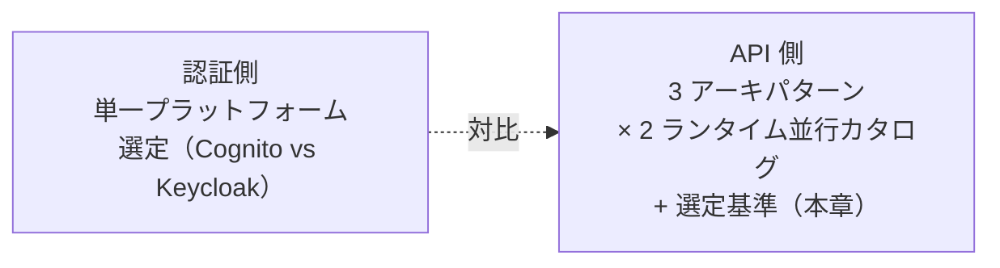
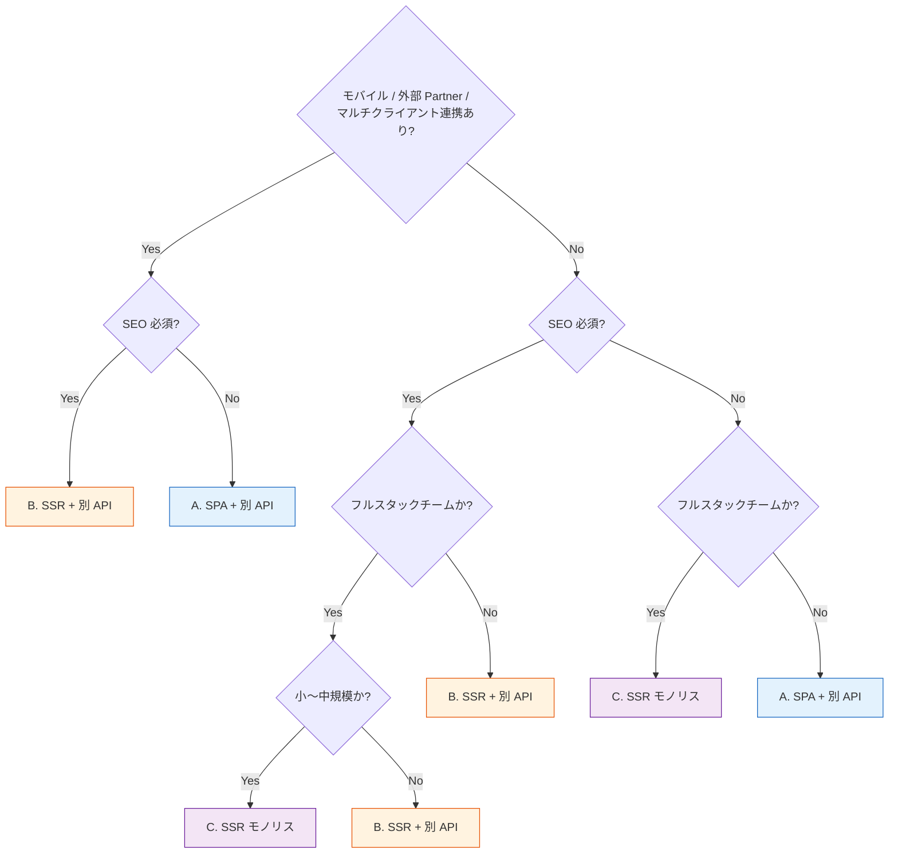

# §C-API-2 アーキパターン選定 + 実装ランタイム選定基準

> 親 SSOT: [../00-index.md](../00-index.md) §C-API-2
> ヒアリング: [../../hearing-script/00-common.md](../../hearing-script/00-common.md), [../../hearing-script/12-architecture-pattern.md](../../hearing-script/12-architecture-pattern.md)

---

## §C-2.0 前提と背景

### §C-2.0.1 用語整理

| 用語 | 定義 |
|---|---|
| **アーキパターン** | フロント・バックエンドの分離方式（SPA+API / SSR+API / SSR モノリス）。本標準のスコープ定義の中核 |
| **実装ランタイム** | API バックエンドが動く実行環境（Lambda / ECS Fargate / Function URL / AppSync 等） |
| **2 系統並行カタログ** | 本標準では Serverless / Container の 2 系統をどちらも標準として提供 |
| **モノリス** | フロントエンドとバックエンドが 1 プロセスに同居する構成（Next.js full-stack / Rails / Spring Boot 等） |
| **マイクロサービス** | 1 機能 1 サービスで疎結合に構成、サービス間は API で通信 |

### §C-2.0.2 なぜここ（§C-2）で決めるか

本標準は 2 段階の選定を扱う：

1. **§C-2.1 アーキパターン選定**（フロント・バックエンドをどう分けるか）
2. **§C-2.2 実装ランタイム選定**（バックエンドを何で実装するか）

両者は **独立した軸** で、組合せで具体構成が決まる。例：

| アーキパターン | 実装ランタイム |
|---|---|
| A. SPA + 別 API | API は Serverless / Container どちらでも |
| B. SSR + 別 API | フロント Container 多い、API は両方可 |
| C. SSR モノリス | **Container 一択**（Lambda の制約で SSR モノリスは事実上不可） |

認証側 SSOT が **「Cognito vs Keycloak の単一選定」** を中核に据えるのに対し、API 側は **「3 パターンすべてサポート + 2 系統並行カタログ」** が中核。本章は **「プラットフォーム選定書」の API 版**相当だが、**唯一解ではなく決定木**を提供する。



### §C-2.0.3 §C-2.0.A 本標準のスタンス

| 基本方針 | 本章での具体化 |
|---|---|
| 絶対安全 | 選定外の選択（独自スタック）は例外承認制 |
| どんなアプリでも | **3 アーキパターン × 2 ランタイム をすべて対応**、独自構成は例外承認 |
| 効率よく | 機械的な決定木で属人判断を避ける |
| 運用負荷・コスト最小 | デフォルト推奨を明示（迷ったら：API は Serverless、フロント+API は SPA + 別 API） |

### §C-2.0.4 本章で扱うサブセクション

| § | サブセクション |
|---|---|
| §C-2.1 | **アーキパターン選定**（3 パターン：SPA+API / SSR+API / SSR モノリス） |
| §C-2.2 | **実装ランタイム選定**（Serverless / Container、モノリス vs マイクロサービス） |
| §C-2.3 | ハイブリッド構成の判断 |
| §C-2.4 | 例外承認プロセス |

---

## §C-2.1 アーキパターン選定（3 パターン）

**このサブセクションで定めること**：フロントエンドとバックエンドをどう分けるかの選定基準。
**主な判断軸**：チームスキル、SEO、機動性、規模、移行容易性。
**§C-2 全体との関係**：§C-2.2 実装ランタイム選定の前段（パターン C を選ぶと実装は Container 一択になる等、選択肢が狭まる）。

### §C-2.1.1 3 アーキパターン比較

| 観点 | A. SPA + 別 API | B. SSR + 別 API | C. SSR モノリス |
|---|---|---|---|
| **構成** | フロント (S3+CloudFront) + バックエンド API（別サービス） | SSR フロント (Lambda/ECS) + バックエンド API（別サービス） | フロント + ビジネスロジックが 1 プロセス |
| **代表例** | React/Vue SPA + REST/GraphQL API | Next.js + 別 API、Nuxt + 別 API | Next.js full-stack、Rails、Spring Boot + Thymeleaf |
| **公開境界 §FR-API-1** | フロントは CloudFront、API は Regional API GW | フロント・API で別境界 | **ALB 1 つで両方**、path-based |
| **認証認可 §FR-API-2** | Browser で JWT 保持、API は JWT Authorizer | Session cookie + サーバ側 JWT 保持 | **ALB + Cognito** または **アプリ内 session** |
| **流量制御 §FR-API-3** | API GW Usage Plan / WAF | API GW Usage Plan / WAF | **WAF rate-based のみ**（API GW Usage Plan 不可） |
| **課金按分 §FR-API-4** | per-tenant API Key 容易 | 同左 | **per-tenant は session ID / JWT クレーム計測** |
| **実装ランタイム §FR-API-5/6** | Serverless / Container 両方可 | フロント Container 多い、API は両方可 | **Container 一択** |
| **チームスキル要件** | フロント / バック 分業可 | 同左 | **フルスタックエンジニア必要** |
| **コスト特性** | 変動費中心 | 中間 | 固定費中心（ECS 常時稼働） |
| **SEO 対応** | クライアントレンダリングのため SSG / pre-render 必要 | SSR で対応容易 | SSR で対応容易 |
| **初期表示パフォーマンス** | JS バンドル後 | サーバ側で HTML 生成、TTFB 速い | 同左 |
| **適性規模** | 大規模 / マルチクライアント / B2B SaaS | SEO 重視 + 高機能 + モバイル併用 | 小〜中規模 / 単一クライアント |
| **モバイルアプリ連携** | API 共用容易 | 同左 | API 切り出し追加実装が必要 |

### §C-2.1.2 アーキパターン選定フロー（決定木）



### §C-2.1.3 デフォルト推奨

- **迷ったら：A. SPA + 別 API**
  - 理由：将来のモバイル連携・マルチクライアント拡張に対応可能、フロント・バック分業可、業界主流
- **SEO 要件 + フルスタックチーム + 中小規模なら：C. SSR モノリス**
  - 理由：開発速度最速、初期表示パフォーマンス良、運用シンプル
- **SEO 要件 + 大規模 / モバイル連携あり：B. SSR + 別 API**
  - 理由：SSR と API 分離で各々スケール、API のマルチクライアント対応

### §C-2.1.4 アーキパターン別のチェックリスト

各パターン採用時、以下が成立することを確認：

**A. SPA + 別 API 採用時のチェック**
- [ ] フロント / バックを別チームで開発可、または同一チームでも別リポジトリ
- [ ] SEO は SSG / pre-render で十分、または不要
- [ ] CloudFront + S3 + API GW (or ALB+ECS) のスタックを運用できる

**B. SSR + 別 API 採用時のチェック**
- [ ] SSR フロントを別サービスで運用可（Lambda or ECS）
- [ ] フロントと API の境界設計（GraphQL / REST）が定義可
- [ ] Cold start / レイテンシ要件を満たす実装ランタイム選定可

**C. SSR モノリス採用時のチェック**
- [ ] フルスタックエンジニアが揃っている
- [ ] 規模が小〜中（モバイル別アプリ・マルチクライアント連携の予定がない）
- [ ] API Gateway Usage Plan が不要（B2B per-tenant 課金が要件にない）
- [ ] **将来モバイルアプリ等で API 切り出し要件が生じる可能性が低い**
- [ ] Container（ECS Fargate）運用ができる

### §C-2.1.5 TBD / 要確認

- Q: **3 パターンすべてサポート**の方針確定 → `API-B-001`
- Q: SSR モノリスの **将来マイクロ化リスク** をどう扱うか → `API-B-001-α`
- Q: パターン C の **規模上限**（タスク数 / TPS）の目安設定 → `API-B-001-β`

---

## §C-2.2 実装ランタイム選定（Serverless / Container）

**このサブセクションで定めること**：API バックエンドを Serverless / Container のどちらで実装するかの選定基準。
**主な判断軸**：トラフィック特性、コストモデル、チームスキル、既存資産、レイテンシ。
**§C-2 全体との関係**：§C-2.1 でアーキパターンが決まった後の実装選択。

### §C-2.2.1 評価軸

| # | 評価軸 | 重み | 説明 |
|---|---------|------|------|
| 1 | **リクエスト特性** | 高 | 不定期/常時、長時間/短時間、ピーク係数 |
| 2 | **コストモデル適合性** | 高 | 変動費前提 / 固定費前提 |
| 3 | **レイテンシ要件** | 高 | Cold start 許容可否（Real-time Tier） |
| 4 | **チームスキル** | 高 | Lambda 経験 / コンテナ経験 |
| 5 | **既存資産** | 中 | 既存コードベース・コンテナ化容易性 |
| 6 | **統合要件** | 中 | VPC アクセス / 長時間処理 / WebSocket / gRPC |
| 7 | **データアクセス** | 中 | DynamoDB 親和 vs RDB 中心 |
| 8 | **運用性** | 中 | パッチ・ベンダー依存 |
| 9 | **コンプライアンス** | 低 | 特殊データ専有要件 |

### §C-2.2.2 選定フロー（決定木）

```mermaid
flowchart TD
    Start{アーキパターン = C SSR モノリス?}
    Start -->|Yes| Container0[Container 一択<br/>§C-2.1 §6.1.A モノリスサブパターン]
    Start -->|No| Q1{長時間処理が必要<br/>(>15 分)?}
    Q1 -->|Yes| Container1[Container 推奨]
    Q1 -->|No| Q2{WebSocket /<br/>gRPC / 常時接続?}
    Q2 -->|Yes| Container2[Container 推奨]
    Q2 -->|No| Q3{Cold start NG<br/>(Real-time Tier)?}
    Q3 -->|Yes| Q3a{Provisioned Concurrency<br/>コスト許容?}
    Q3a -->|Yes| Serverless1[Serverless<br/>+ Provisioned Concurrency]
    Q3a -->|No| Container3[Container 推奨]
    Q3 -->|No| Q4{既存資産が<br/>コンテナ前提?}
    Q4 -->|Yes| Container4[Container 推奨]
    Q4 -->|No| Q5{チームスキル<br/>Serverless 経験あり?}
    Q5 -->|Yes| Serverless2[Serverless 推奨]
    Q5 -->|No| Q6{学習コスト許容?}
    Q6 -->|Yes| Serverless3[Serverless 推奨<br/>(学習投資)]
    Q6 -->|No| Container5[Container 採用]

    style Serverless1 fill:#e3f2fd,stroke:#1565c0
    style Serverless2 fill:#e3f2fd,stroke:#1565c0
    style Serverless3 fill:#e3f2fd,stroke:#1565c0
    style Container0 fill:#f3e5f5,stroke:#6a1b9a
    style Container1 fill:#fff3e0,stroke:#e65100
    style Container2 fill:#fff3e0,stroke:#e65100
    style Container3 fill:#fff3e0,stroke:#e65100
    style Container4 fill:#fff3e0,stroke:#e65100
    style Container5 fill:#fff3e0,stroke:#e65100
```

### §C-2.2.3 アーキパターン × 実装ランタイムの組合せ表

| アーキパターン | デフォルト実装ランタイム | 代替選択肢 | 備考 |
|---|---|---|---|
| A. SPA + 別 API | API を Serverless（Lambda + API GW HTTP API）| API を Container（ECS Fargate + ALB / API GW VPC Link）| フロントは S3 + CloudFront 固定 |
| B. SSR + 別 API | フロント Container、API Serverless | フロント Lambda + Function URL、API も Container | SSR は Lambda 可だが長時間処理に弱い |
| C. SSR モノリス | **Container（ECS Fargate）一択** | Lambda は事実上不可（コールドスタート / 15 分制限 / 単一プロセス制約） | §FR-API-6 §6.1.A モノリスサブパターン適用 |

### §C-2.2.4 デフォルト推奨

- **迷ったら Serverless**：コスト最適化・運用負荷最小・スケール自動
- ただし上記決定木で Container 側に倒れる要件があれば Container
- **アーキパターン C を選んだ場合は自動的に Container**

### §C-2.2.5 TBD / 要確認

- Q: 決定木の **質問項目妥当性**（追加すべき軸はあるか）→ `API-D-1911`
- Q: 「Cold start NG」の **判定基準**（Real-time Tier 自動 vs 個別判断）→ `API-D-1912`

---

## §C-2.3 ハイブリッド構成の判断

**このサブセクションで定めること**：1 アプリ内でアーキパターンや実装ランタイムを混在する場合の方針。
**主な判断軸**：複雑性 vs 適材適所、運用負荷。
**§C-2 全体との関係**：§C-2.1 / §C-2.2 の例外形態。

### §C-2.3.1 ベースライン

- **アーキパターン**：
  - **マイクロサービス境界でアーキパターン混在可**（例：管理画面は C モノリス、顧客向けは A SPA + 別 API）
  - **同一アプリ内でのアーキパターン混在は原則禁止**（C モノリスから一部 API だけ切り出すような中途半端は運用が複雑化）
- **実装ランタイム**：
  - **マイクロサービス境界で混在可**（例：API は Lambda、バッチは ECS）
  - **同一サービス内のハイブリッドは原則禁止**
- **データ層は別軸**：実装ランタイムが Lambda でも ECS でも DynamoDB / Aurora は自由

### §C-2.3.2 SSR モノリスから API 切り出しが必要になった場合

- **段階移行パス**：
  1. モノリスのまま `/api/*` を内部 API として整理
  2. モバイル等の外部クライアント要件が確定したら、`/api/*` を別サービスに切り出し
  3. モノリスは SSR + 別 API（パターン B）に進化、または SPA + 別 API（A）にリプラット
- この移行は **本標準の例外申請・移行支援対象**として扱う

### §C-2.3.3 TBD / 要確認

- Q: マイクロサービス境界の **ガイドライン**確定 → `API-D-1921`
- Q: SSR モノリス → 別 API 切り出しの **支援範囲**（IaC テンプレ・移行サンプル）→ `API-D-1922`

---

## §C-2.4 例外承認プロセス

**このサブセクションで定めること**：標準外のアーキパターン / ランタイム選定（EKS / Self-managed EC2 / 別 SaaS）。
**主な判断軸**：明確な理由、影響分離。
**§C-2 全体との関係**：本章の最終逃げ道。

### §C-2.4.1 ベースライン

- **EKS 採用**：既存 Kubernetes 資産 / 特定 Operator 依存 / マルチクラウド要件 → 申請制
- **EC2 採用**：GPU / 専有 / Spot で大量バッチ → 申請制
- **独自フレームワーク**（Server Components / Edge runtime 等の AWS マネージド外）：申請制
- **承認者**：アーキテクチャ委員会 + Platform チーム
- **記録**：例外台帳 + リソースタグ

### §C-2.4.2 TBD / 要確認

- Q: EKS の **本標準への含め方**（第 3 の選択肢に昇格 vs 例外維持）→ `API-D-1931`
- Q: **Edge runtime / Vercel / Cloudflare Workers** 等の AWS 外マネージドの扱い → `API-D-1932`

---

## §C-2.x 関連ドキュメント

- [§FR-API-5 Serverless 標準](../fr/05-serverless-standard.md)
- [§FR-API-6 Container 標準](../fr/06-container-standard.md) — §6.1.A モノリスサブパターン
- [§NFR-API-2 性能](../nfr/02-performance.md) — Cold start
- [§C-API-1 全体参照アーキ](01-reference-architecture.md) — 3 アーキパターン参照アーキ
- [runtime-pattern-decision.md（決定書、TBD）](../../) — 本決定木を運用する判断書
