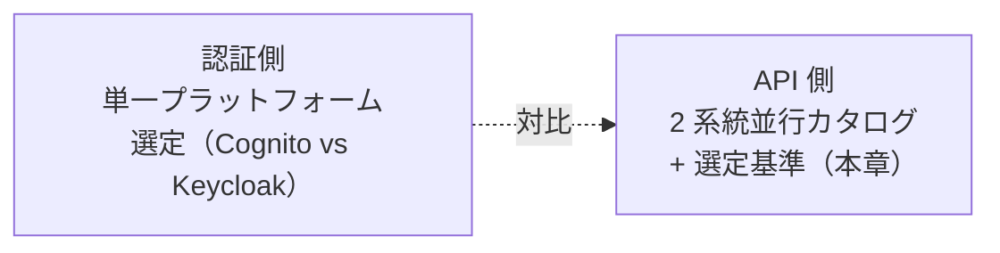

# §C-API-2 実装ランタイム選定基準

> 親 SSOT: [../00-index.md](../00-index.md) §C-API-2
> ヒアリング: [../../hearing-script/00-common.md](../../hearing-script/00-common.md)

---

## §C-2.0 前提と背景

### §C-2.0.1 用語整理

| 用語 | 定義 |
|---|---|
| **実装ランタイム** | API バックエンドが動く実行環境（Lambda / ECS Fargate / Function URL / AppSync 等） |
| **2 系統並行カタログ** | 本標準では Serverless / Container の 2 系統をどちらも標準として提供 |
| **選定基準** | アプリ要件から実装ランタイムを決める判断ロジック |

### §C-2.0.2 なぜここ（§C-2）で決めるか

認証側 SSOT が **「Cognito vs Keycloak の単一選定」** を 中核に据えるのに対し、API 側は **「2 系統並行 + 選定基準」** が中核。本章は「**プラットフォーム選定書**の API 版」相当の位置づけだが、**唯一解ではなく決定木**を提供する。



### §C-2.0.3 §C-2.0.A 本標準のスタンス

| 基本方針 | 本章での具体化 |
|---|---|
| 絶対安全 | 選定外の選択（独自スタック）は例外承認制 |
| どんなアプリでも | Serverless / Container どちらでも対応できる選択肢を網羅 |
| 効率よく | 機械的な決定木で属人判断を避ける |
| 運用負荷・コスト最小 | デフォルト推奨を明示（迷ったら Serverless） |

### §C-2.0.4 本章で扱うサブセクション

| § | サブセクション |
|---|---|
| §C-2.1 | 評価軸 |
| §C-2.2 | 選定フロー（決定木） |
| §C-2.3 | ハイブリッド構成の判断 |
| §C-2.4 | 例外承認プロセス |

---

## §C-2.1 評価軸

**このサブセクションで定めること**：実装ランタイム選定に使う評価軸。
**主な判断軸**：客観性、計測可能性、ビジネス・技術両面。
**§C-2 全体との関係**：§C-2.2 決定木の入力。

### §C-2.1.1 ベースライン

| # | 評価軸 | 重み | 説明 |
|---|---------|------|------|
| 1 | **リクエスト特性** | 高 | 不定期/常時、長時間/短時間、ピーク係数 |
| 2 | **コストモデル適合性** | 高 | 変動費前提 / 固定費前提 |
| 3 | **レイテンシ要件** | 高 | Cold start 許容可否（Real-time Tier） |
| 4 | **チームスキル** | 高 | Lambda 経験 / コンテナ経験 |
| 5 | **既存資産** | 中 | 既存コードベース・コンテナ化容易性 |
| 6 | **統合要件** | 中 | VPC アクセス / 長時間処理 / WebSocket / gRPC |
| 7 | **データアクセス** | 中 | DynamoDB 親和 vs RDB 中心 |
| 8 | **運用性** | 中 | パッチ・ベンダー依存 |
| 9 | **コンプライアンス** | 低 | 特殊データ専有要件 |

### §C-2.1.2 TBD / 要確認

- Q: **重みづけの妥当性**確定 → `API-D-1901`
- Q: 評価軸の **数値化（スコアシート）**を運用するか → `API-D-1902`

---

## §C-2.2 選定フロー（決定木）

**このサブセクションで定めること**：機械的に Serverless / Container を判断する決定木。
**主な判断軸**：先に決まる軸を上位に置く、ループしない。
**§C-2 全体との関係**：§C-2.1 評価軸の運用形態。

### §C-2.2.1 ベースライン

```mermaid
flowchart TD
    Start{長時間処理が必要<br/>(>15 分)?}
    Start -->|Yes| Container1[Container 推奨]
    Start -->|No| Q2{WebSocket /<br/>gRPC / 常時接続?}
    Q2 -->|Yes| Container2[Container 推奨]
    Q2 -->|No| Q3{Cold start NG<br/>(Real-time Tier)?}
    Q3 -->|Yes| Q3a{Provisioned Concurrency<br/>コスト許容?}
    Q3a -->|Yes| Serverless1[Serverless<br/>+ Provisioned Concurrency]
    Q3a -->|No| Container3[Container 推奨]
    Q3 -->|No| Q4{既存資産が<br/>コンテナ前提?}
    Q4 -->|Yes| Container4[Container 推奨]
    Q4 -->|No| Q5{チームスキル<br/>Serverless 経験あり?}
    Q5 -->|Yes| Serverless2[Serverless 推奨]
    Q5 -->|No| Q6{学習コスト許容?}
    Q6 -->|Yes| Serverless3[Serverless 推奨<br/>(学習投資)]
    Q6 -->|No| Container5[Container 採用]

    style Serverless1 fill:#e3f2fd,stroke:#1565c0
    style Serverless2 fill:#e3f2fd,stroke:#1565c0
    style Serverless3 fill:#e3f2fd,stroke:#1565c0
    style Container1 fill:#fff3e0,stroke:#e65100
    style Container2 fill:#fff3e0,stroke:#e65100
    style Container3 fill:#fff3e0,stroke:#e65100
    style Container4 fill:#fff3e0,stroke:#e65100
    style Container5 fill:#fff3e0,stroke:#e65100
```

### §C-2.2.2 デフォルト推奨

- **迷ったら Serverless**：コスト最適化・運用負荷最小・スケール自動
- ただし上記決定木で Container 側に倒れる要件があれば Container

### §C-2.2.3 TBD / 要確認

- Q: 決定木の **質問項目妥当性**（追加すべき軸はあるか）→ `API-D-1911`
- Q: 「Cold start NG」の **判定基準**（Real-time Tier 自動 vs 個別判断）→ `API-D-1912`

---

## §C-2.3 ハイブリッド構成の判断

**このサブセクションで定めること**：1 アプリ内で Serverless / Container を混在する場合の方針。
**主な判断軸**：複雑性 vs 適材適所、運用負荷。
**§C-2 全体との関係**：§C-2.2 の例外形態。

### §C-2.3.1 ベースライン

- **マイクロサービス境界でハイブリッド可**（例：API は Lambda、バッチは ECS）
- **同一サービス内のハイブリッドは原則禁止**（運用が複雑化）
- **データ層は別軸**：実装ランタイムが Lambda でも ECS でも DynamoDB / Aurora は自由

### §C-2.3.2 TBD / 要確認

- Q: マイクロサービス境界の **ガイドライン**確定 → `API-D-1921`

---

## §C-2.4 例外承認プロセス

**このサブセクションで定めること**：標準外のランタイム選定（EKS / Self-managed EC2 / 別 SaaS）。
**主な判断軸**：明確な理由、影響分離。
**§C-2 全体との関係**：本章の最終逃げ道。

### §C-2.4.1 ベースライン

- **EKS 採用**：既存 Kubernetes 資産 / 特定 Operator 依存 / マルチクラウド要件 → 申請制
- **EC2 採用**：GPU / 専有 / Spot で大量バッチ → 申請制
- **承認者**：アーキテクチャ委員会 + Platform チーム
- **記録**：例外台帳 + リソースタグ

### §C-2.4.2 TBD / 要確認

- Q: EKS の **本標準への含め方**（第 3 の選択肢に昇格 vs 例外維持）→ `API-D-1931`

---

## §C-2.x 関連ドキュメント

- [§FR-API-5 Serverless 標準](../fr/05-serverless-standard.md)
- [§FR-API-6 Container 標準](../fr/06-container-standard.md)
- [§NFR-API-2 性能](../nfr/02-performance.md) — Cold start
- [runtime-pattern-decision.md（決定書）](../../) — 本決定木を運用する判断書
