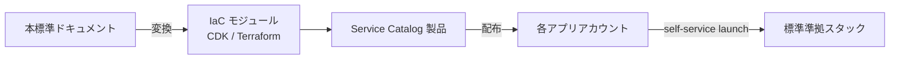

# §C-API-5 標準提供物（Service Catalog / IaC モジュール）

> 親 SSOT: [../00-index.md](../00-index.md) §C-API-5
> ヒアリング: [../../hearing-script/07-guardrails.md](../../hearing-script/07-guardrails.md)

---

## §C-5.0 前提と背景

### §C-5.0.1 用語整理

| 用語 | 定義 |
|---|---|
| **Service Catalog** | AWS Service Catalog。組織内で承認済み AWS 製品（IaC スタック）を配布するサービス |
| **製品（Product）** | Service Catalog で配布される 1 つのテンプレート（CloudFormation / Terraform） |
| **IaC モジュール** | 再利用可能な Infrastructure-as-Code 部品（CDK Construct / Terraform Module） |
| **開発者ポータル** | アプリ開発者向けの API カタログ・ドキュメント・サンプル提示 UI |

### §C-5.0.2 なぜここ（§C-5）で決めるか

要望テーマの「**効率よく**」の中核。本標準を **「ドキュメント」だけで提供すると形骸化する**。Service Catalog / IaC モジュールという **配布可能な形** に落とすことで、開発者が標準に従うのが自然な選択肢になる。



### §C-5.0.3 §C-5.0.A 本標準のスタンス

| 基本方針 | 本章での具体化 |
|---|---|
| 絶対安全 | 製品起動時点で **セキュリティ死守事項**（暗号化・タグ・ログ）が自動充足 |
| どんなアプリでも | カテゴリ別の製品ラインナップ（公開範囲 × ランタイム の組合せ） |
| 効率よく | アプリ開発者が **数クリック / IaC 一行** で標準準拠スタック起動 |
| 運用負荷・コスト最小 | 製品の更新・バージョン管理は Platform チーム集約 |

**Self-Service Developer Portal との関係（追記 2026-06-19）**: Service Catalog（IaC 製品配布）と **Self-Service Developer Portal**（Partner Client 作成 UI）は別物だが補完関係。前者はインフラ deploy 自律化、後者は Partner Auth 運用自律化。両者を組み合わせて [§C-API-6 §C-6.4](06-external-api-auth-architecture.md) の「アプリチーム完全自律 + 中央 Engine 活用」を実現。

### §C-5.0.4 本章で扱うサブセクション

| § | サブセクション |
|---|---|
| §C-5.1 | 製品ラインナップ |
| §C-5.2 | IaC モジュール体系 |
| §C-5.3 | バージョン管理・更新通知 |
| §C-5.4 | 開発者ポータル |

---

## §C-5.1 製品ラインナップ

**このサブセクションで定めること**：Service Catalog Portfolio で提供する標準製品。
**主な判断軸**：公開範囲 × ランタイムの代表的な組合せ、過剰な細分化を避ける。
**§C-5 全体との関係**：§FR-API-1〜6 の出口。

### §C-5.1.1 ベースライン

| 製品名（暫定） | 構成 | 想定アプリ |
|---|---|---|
| `api-gateway-http-public-lambda-dynamodb` | CloudFront + WAF + HTTP API + JWT Authorizer + Lambda + DynamoDB | B2C 公開 API |
| `api-gateway-rest-partner-lambda` | REST API + Custom Domain + Usage Plan + WAF + Lambda | B2B 課金 API |
| `api-gateway-private-internal-lambda` | Private API + Lambda + Resource Policy | 社内マイクロサービス |
| `lambda-function-url-internal` | Function URL + IAM auth | Webhook / 内部 |
| `ecs-fargate-public-alb` | CloudFront + WAF + ALB + ECS Fargate | B2C コンテナ |
| `ecs-fargate-internal-lattice` | VPC Lattice + ECS Fargate + Service Connect | クロスアカウント内部 API |
| `ecs-fargate-partner-alb-mtls` | ALB + mTLS + WAF + ECS Fargate | B2B mTLS |
| `appsync-graphql-public` | AppSync + Cognito Authorizer + DynamoDB | GraphQL / モバイル |

各製品には必須要素を組み込み済：
- 必須タグセット（§FR-API-4 §4.3）
- CloudWatch Log Group + Retention + CMK
- ADOT / X-Ray 有効化
- アラート（標準セット）
- IAM 最小権限ロール
- ⭐ **Authorizer 必須化**（[§FR-API-2 §2.8 Fail-closed 原則](../fr/02-authn-authz.md)）：
  - 全 API Gateway 製品テンプレで **Authorizer フィールド必須**（IAM / JWT / Lambda / Cognito、`AuthType=NONE` 不可）
  - ALB ベースの製品テンプレで **認証統合 or アプリ middleware 認証タグ必須**
  - Lambda Function URL 採用製品は `AuthType=AWS_IAM` 必須
  - IaC validation hook（cfn-guard / CDK Aspect 等）で deploy 前に強制
- ⭐ **Origin Protection 必須化**（[ADR-039 §C-4](../../../adr/039-centralized-network-account-edge-layer.md)）：
  - パブリック公開する全 API Gateway REST / Public ALB 製品テンプレで **Resource Policy / Listener Rule 自動注入**
    - Resource Policy: CloudFront 管理 Prefix List `com.amazonaws.global.cloudfront.origin-facing` 制限 + `X-Origin-Verify` Custom Header 検証 + 不一致時 Deny
    - ALB Listener Rule: `X-Origin-Verify` ヘッダ検証 + 不一致時 fixed-response 403
    - Security Group: `pl-58a04531`（CloudFront origin-facing prefix list）のみ 443 許可
  - **Secret Rotation 機構**を製品の初期構成として組み込み：
    - Network Acct の Secrets Manager に紐付け（Cross-account Resource Policy）
    - Network Acct の Rotation Lambda が App Acct の Resource Policy / Listener Rule を自動更新（Cross-account AssumeRole）
    - 30 日周期 + Overlap 24-72h
  - **Synthetics canary**を製品テンプレに同梱（API GW / ALB 直接 curl で 403 期待の probe）

→ **アプリ開発者は「Network Acct CloudFront 経由必須」を意識せずに製品起動で自動準拠**。製品テンプレは ADR-039 § C-4 の Pattern A（Custom Header + IP Allowlist）を実装、Internal ALB 用は Pattern B（VPC Origins）を実装。

- ⭐ **OpenAPI ドリブン Auth Synthetics canary 自動構成**（[§C-API-6 §C-6.6.8](06-external-api-auth-architecture.md) L5 Behavioral 実装手段）：

  製品テンプレが OpenAPI を入力として受け取り、API GW 構築 + 認証 probe canary 自動デプロイを一連で実行する。アプリチームは canary コードを一切書かない。

  - **構成要素 4 つ**（製品テンプレが連動）：
    1. **(a) アプリの OpenAPI 仕様**（アプリチーム維持）→ パラメータ `OpenAPIS3Url` で受け取る
    2. **(b) Service Catalog 製品テンプレ**（Platform チーム保守）→ CFN 内で OpenAPI を `AWS::ApiGateway::RestApi.Body` に展開し API GW 構築
    3. **(c) 共通 canary Lambda コード**（Platform チーム配布、Shared S3）→ canary は全アプリ共通の 1 本、API 仕様を Registry から動的取得して probe
    4. **(d) OpenAPI Registry**（Shared S3、Platform-managed）→ deploy 後の正本を `{accountId}/{apiId}/openapi.yaml` に export

  - **製品テンプレに同梱されるリソース**：
    ```yaml
    Resources:
      ApiGateway:                # OpenAPI から API GW 構築
        Type: AWS::ApiGateway::RestApi
        Properties:
          Body: { Fn::Transform: { Name: AWS::Include, Parameters: { Location: !Ref OpenAPIS3Url } } }
      OpenApiExporter:           # deploy 後 OpenAPI を Registry に export
        Type: Custom::OpenApiExport
        Properties:
          ServiceToken: !ImportValue SharedOpenApiExportFunction
          RestApiId: !Ref ApiGateway
          TargetS3Bucket: !ImportValue SharedOpenApiRegistryBucket
      AuthCheckCanary:           # 共通 canary を 5 分周期で起動
        Type: AWS::Synthetics::Canary
        Properties:
          Code: { S3Bucket: !ImportValue SharedCanaryBucket, S3Key: "canary-code/auth-check-v1.zip" }
          RunConfig: { EnvironmentVariables: { OPENAPI_S3_URL: ... } }
      AuthCheckAlarm:            # 違反時 Slack 通知
        Type: AWS::CloudWatch::Alarm
    ```

  - **Hybrid 検証（Negative + Positive 併用）**：「認証が正しく実装されている」を担保するには **negative test だけでは不十分**（テスト構成ミスと認証漏れが区別できない）。Service Catalog 製品テンプレは以下の 2 種を組み合わせて実装：
    - **Negative test**：未認証リクエスト → 401/403 期待（認証実装漏れ検知）
    - **Positive test**：valid token + valid body → 200/201/204 期待（API 稼働 + テスト健全性検証）
    - **Smoke test**：canary 冒頭で既知 endpoint に対する正常 / 異常呼出を行い、テスト用 token 自体の健全性確認
    - 詳細な Hybrid canary 実装と 4×4 真偽値表は [§C-API-6 §C-6.6.8](06-external-api-auth-architecture.md) 参照

  - **OpenAPI アノテーションで認証 probe 対象を制御**：
    ```yaml
    paths:
      /api/users:
        get:
          x-canary-positive-test: true                       # ⭐ positive test 有効（GET なので production 含む全環境）
          x-canary-test-token-secret: "canary-readonly-token"  # ⭐ 使用 token（Secrets Manager 名）
          responses: { ... }                                 # 認証必須として probe 対象（negative はデフォルト ON）
      /api/users/{userId}:
        get:
          x-canary-positive-test: true
          x-canary-path-params:                              # ⭐ path parameter dummy
            userId: "canary-probe-user-001"
          responses: { ... }
      /api/orders:
        post:
          x-canary-positive-test: pre-prod-only              # ⭐ 副作用あり、production は negative のみ
          x-canary-test-token-secret: "canary-write-token"
          x-canary-cleanup:                                  # ⭐ probe 後の後処理
            action: DELETE
            path: "/api/orders/{orderId}"
            idFrom: response.body.orderId
          requestBody:
            content:
              application/json:
                example: { productId: "canary-probe-product", quantity: 1 }  # ⭐ dummy body
          responses: { ... }
      /_/health:
        get:
          x-synthetics-skip-auth-check: true                 # ⭐ public endpoint、negative 対象外
          x-canary-positive-test: true                       # positive のみ実施（health 確認）
    ```

  - **環境別 probe 動作**：
    - **Production**：全 endpoint negative + GET endpoint positive（read-only）+ smoke test
    - **Staging / Dev**：全 endpoint negative + 全 endpoint positive（POST 等は cleanup 付き）+ smoke test
  - **テスト用 token の運用**：Service Catalog 製品が `canary-readonly-token` / `canary-write-token` などの Secrets Manager Secret を初期構築時に作成、Rotation Lambda が共有認証基盤の M2M Client を 30 日周期で更新。アプリチーム作業ゼロ。
  - **アプリチームの作業量はゼロ近い**：OpenAPI を S3 にアップ + Service Catalog 起動するだけ。canary コード / Alarm 設定 / Registry 仕組み / token 管理はすべて Platform 提供。
  - **新規 endpoint 追加時も自動追従**：次回 deploy で OpenAPI が更新されれば canary が自動的に新 endpoint を probe 対象にする。
  - **OpenAPI を持たないレガシー API**は別製品 `api-gateway-legacy-public`（Pattern D: Resource Explorer 自動発見）で対応、ただし positive test は別途 endpoint メタ情報必須。

→ **アプリ開発者が「認証なし API」を Service Catalog 経由で作れない構造**を製品テンプレレベルで担保。例外は別途申請制（[§FR-API-2 §2.8.3](../fr/02-authn-authz.md)）。

### §C-5.1.2 TBD / 要確認

- Q: **初期ラインナップ**を上記 8 種類で確定するか → `API-D-2201`
- Q: 各製品の **対応リージョン**（東京 / 大阪両対応か） → `API-D-2202`
- Q: Authorizer 強制の IaC validation hook 実装（cfn-guard / CDK Aspect / OPA）→ `API-B-251`（§FR-API-2 §2.8 と同じ）

---

## §C-5.2 IaC モジュール体系

**このサブセクションで定めること**：Service Catalog 製品の元となる IaC モジュールの体系。
**主な判断軸**：再利用性、テスト可能性、CDK / Terraform の選定。
**§C-5 全体との関係**：§C-5.1 の実装基盤。

### §C-5.2.1 ベースライン

- **IaC 言語**：CDK（TypeScript / Python）を第一推奨、Terraform は既存資産との整合性次第
- **モジュール階層**：
  - Level 1: AWS リソース直接（CDK L1）
  - Level 2: 共通パターン（CDK L2、AWS 標準）
  - Level 3: 本標準の独自 Construct（必須タグ・ログ・モニタリングセット）
  - Level 4: 製品テンプレ（§C-5.1 の製品をまとめたもの）
- **配布**：内部 npm / PyPI / GitHub Packages
- **テスト**：CDK assertions / Terraform plan diff、CI で自動実行

### §C-5.2.2 TBD / 要確認

- Q: **CDK vs Terraform の社内推奨**確定 → `API-C-2211`
- Q: 既存資産が **CloudFormation のみ**のアプリへの対応 → `API-C-2212`

---

## §C-5.3 バージョン管理・更新通知

**このサブセクションで定めること**：製品・モジュールのバージョン管理ルール。
**主な判断軸**：Semantic Versioning、Breaking change の通知期間。
**§C-5 全体との関係**：§NFR-API-9 互換性と相似。

### §C-5.3.1 ベースライン

- **SemVer 採用**（major.minor.patch）
- **Breaking change（major）**：30 日前通知、旧バージョン製品も併存
- **新機能（minor）**：通知のみ
- **バグ修正（patch）**：自動更新（Critical のみ）
- **製品の Lifecycle**：Active / Deprecated / Sunset
- **通知**：changelog + Slack + メール

### §C-5.3.2 TBD / 要確認

- Q: 旧バージョン製品の **併存期間**（6 ヶ月 / 12 ヶ月）→ `API-C-2221`
- Q: アプリ側の **アップデート義務**（minor / major で異なる）→ `API-C-2222`

---

## §C-5.4 開発者ポータル

**このサブセクションで定めること**：アプリ開発者向けの API カタログ・サンプル・ドキュメント提示。
**主な判断軸**：self-service の実効性、検索性。
**§C-5 全体との関係**：本標準の出口の UX。

### §C-5.4.1 ベースライン

- **API カタログ**：OpenAPI 仕様書を公開（社内向け / Partner 向け別）
- **製品カタログ**：Service Catalog UI（標準）または社内開発者ポータル
- **サンプルコード**：GitHub 内 リファレンス実装リポジトリ
- **ドキュメント**：本標準（doc/api-platform/）+ Confluence / Notion / mkdocs

### §C-5.4.2 TBD / 要確認

- Q: 開発者ポータルの **構築範囲**（Service Catalog UI のみで足りるか、Backstage 等の追加プラットフォーム要件か）→ `API-D-2241`
- Q: OpenAPI 公開の **必須化範囲** → `API-C-1702`（§NFR-API-9 と同じ）

---

## §C-5.x 関連ドキュメント

- [§FR-API-7 ガードレール](../fr/07-guardrails.md) — Service Catalog 配信
- [§C-API-1 全体参照アーキ](01-reference-architecture.md) — 製品が実装する構成
- [reference-implementations.md（付録）](../../) — 参考実装スニペット（TBD）
