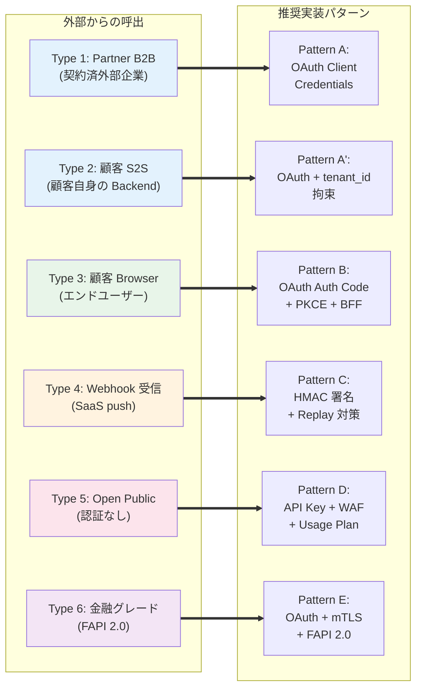
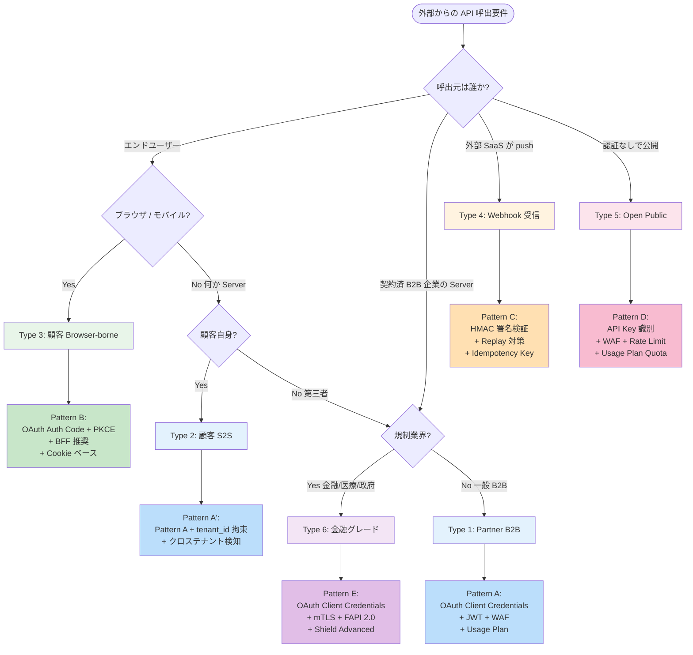
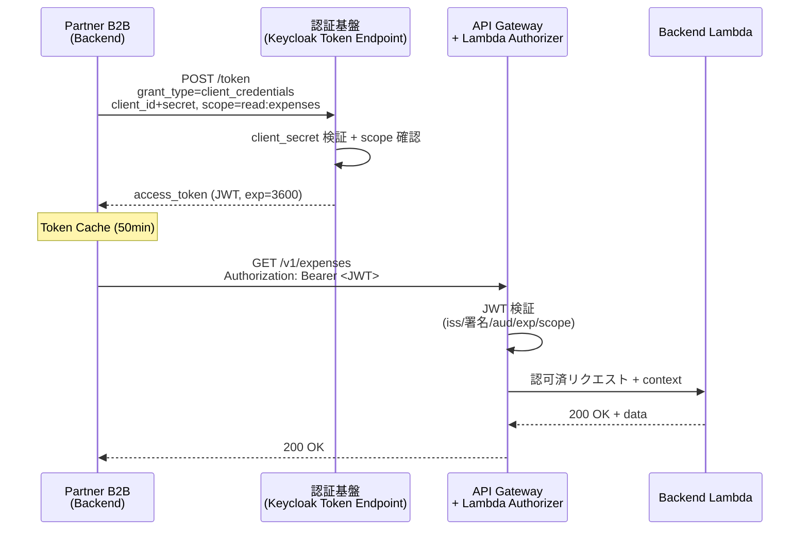
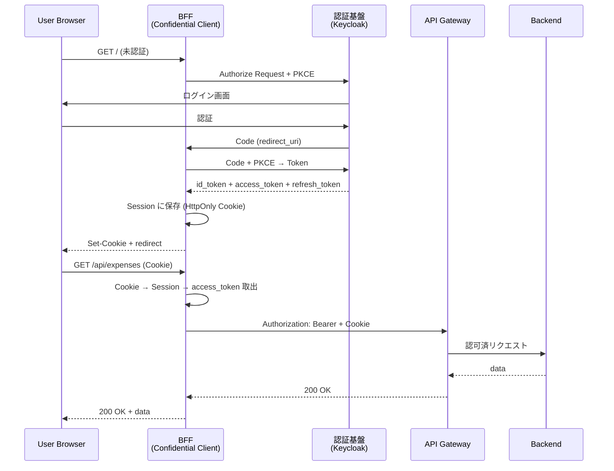
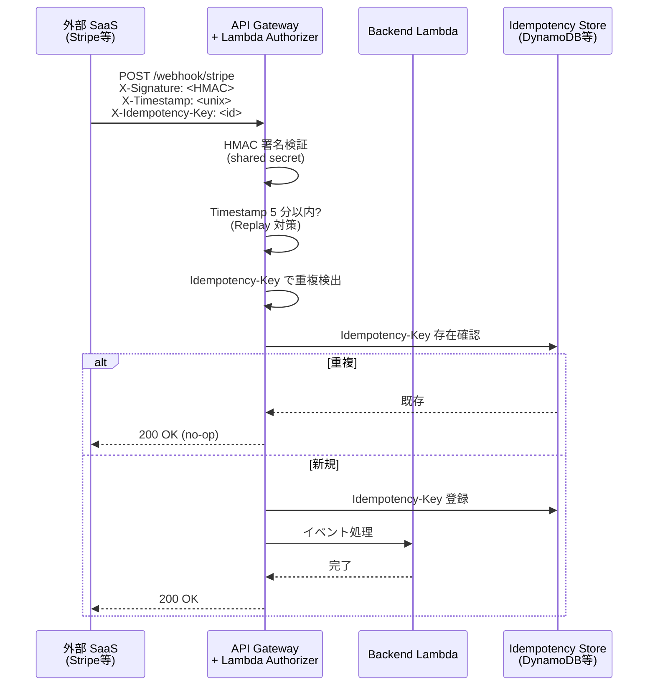
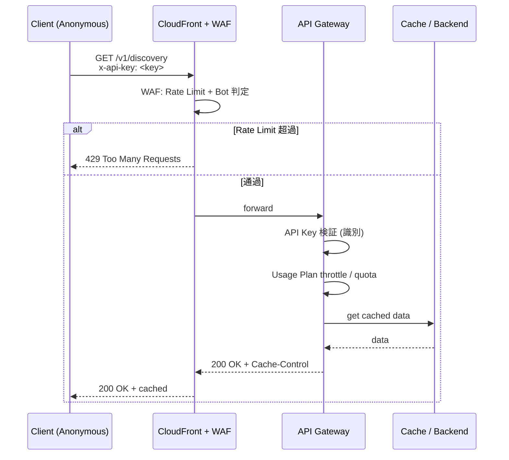
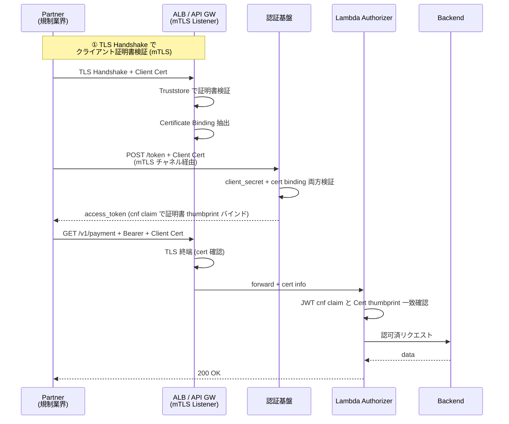

# §FR-API-0 外部サービスからの API 実行 — 網羅的設計検討 / 章プロローグ

> **本ドキュメントの位置付け**: API プラットフォーム標準（§FR-API-1〜8 + §C-API-3〜6）を「**外部サービスから API を呼ばれる（Inbound）**」という横断テーマで俯瞰するエントリポイント SSOT。**6 タイプの外部サービス × 10 観点のマトリクス**で全体像を提示し、各論は既存 doc に深く委譲する。
> **対象読者**: API 設計者 / セキュリティ設計 / 顧客折衝担当 / 新規 API オーナー
> **読み方**: §1〜2 で全体像把握 → §3 でタイプ判定 → §4 でタイプ別推奨パターン → §5〜10 で実装詳細
> **Outbound（自アプリ → 外部 SaaS）**: 本章スコープ外。Outbound の対応は [§C-API-6 §C-6.2 Inbound/Outbound 対称性](../common/06-external-api-auth-architecture.md) 参照。
> **関連 doc（深掘り時の道案内は §11）**:
> - [§C-API-6 外部 API 認証アーキテクチャ（Engine/Relationship モデル）⭐](../common/06-external-api-auth-architecture.md) — 本章の責務分担モデルの根拠
> - [§FR-API-1 公開境界 / 信頼プロファイル](01-exposure-boundary.md)
> - [§FR-API-2 認証認可](02-authn-authz.md)（125 節、最重要 input source）
> - [§FR-API-3 throttling / quota](03-throttling-quota.md)
> - [§FR-API-4 metering / billing](04-metering-billing.md)
> - [§FR-API-7 guardrails](07-guardrails.md)
> - [§FR-API-8 observability](08-observability.md)
> - [§C-API-3 共有認証境界](../common/03-shared-auth-boundary.md)
> - [§C-API-4 audit / governance](../common/04-audit-governance.md)
> - [§C-API-5 self-service catalog](../common/05-self-service-catalog.md)
> - [pci-dss-appi-compliance-gap.md](../../../common/pci-dss-appi-compliance-gap.md)
> - [ADR-014 認証パターン範囲](../../../adr/014-auth-patterns-scope.md)

---

## 目次

1. [30 秒サマリ — 結論](#1-30-秒サマリ--結論)
2. [なぜ網羅的に検討するか](#2-なぜ網羅的に検討するか)
3. [外部サービス 6 タイプの定義](#3-外部サービス-6-タイプの定義)
4. [タイプ別 推奨パターンとサマリ](#4-タイプ別-推奨パターンとサマリ)
5. [10 観点 × 6 タイプ責任配置マトリクス](#5-10-観点--6-タイプ責任配置マトリクス)
6. [決定フローチャート — 受領 → 構成決定](#6-決定フローチャート--受領--構成決定)
7. [タイプ別 実装テンプレ + シーケンス図](#7-タイプ別-実装テンプレ--シーケンス図)
8. [オンボーディング → 運用 → オフボーディング](#8-オンボーディング--運用--オフボーディング)
9. [規制適合チェック](#9-規制適合チェック)
10. [アンチパターン集約](#10-アンチパターン集約)
11. [本基盤 PoC 検証実績との対応マップ](#11-本基盤-poc-検証実績との対応マップ)
12. [既存 doc クロスリンク集](#12-既存-doc-クロスリンク集)

---

## 1. 30 秒サマリ — 結論

> 外部サービスからの API 実行は **6 タイプ** に大別される。各タイプは **推奨パターン**が異なり、混同するとセキュリティ・運用両面で破綻する。

```
┌─ Type 1: Partner B2B (契約済 B2B) ──────→ Pattern A: OAuth Client Credentials
├─ Type 2: 顧客 Server-to-Server ──────→ Pattern A': OAuth Client Credentials + tenant 拘束
├─ Type 3: 顧客 Browser-borne (SPA/SSR) ─→ Pattern B: OAuth Authorization Code + PKCE / BFF
├─ Type 4: Vendor SaaS Webhook 受信 ────→ Pattern C: HMAC 署名検証 + Replay 対策
├─ Type 5: Open Public (認証なし) ──────→ Pattern D: API Key + Usage Plan + WAF（識別のみ）
└─ Type 6: 金融グレード / 規制業界 ──────→ Pattern E: OAuth Client Credentials + mTLS + FAPI 2.0
```

### 各タイプの「絶対外せない 3 点」

| タイプ | 認証 | NW 境界 | 監査 |
|---|---|---|---|
| 1. Partner B2B | OAuth Client Credentials | TLS 1.2+ / WAF | token 発行 + API 呼出ログ 12 ヶ月 |
| 2. 顧客 S2S | OAuth Client Credentials + tenant_id 検証 | TLS 1.2+ / Custom Domain | tenant 境界違反検知 |
| 3. 顧客 Browser | OAuth Auth Code + PKCE + BFF（推奨）| HTTPS / SameSite Cookie | session + iss/aud 検証 |
| 4. Webhook 受信 | HMAC 署名（必須）+ Replay 対策 | TLS 1.2+（受信側）| Idempotency key 監査 |
| 5. Open Public | （認証なし、識別のみ）| WAF + Rate Limit 必須 | アクセスログのみ |
| 6. 金融グレード | OAuth + mTLS + FAPI 2.0 | mTLS Listener / PrivateLink | 不可改ざんログ + Audit Trail |

---

## 2. なぜ網羅的に検討するか

### 設計の歯抜けは事故に直結

外部からの API 呼出は **境界を越えた信頼関係** であり、1 つの観点が抜けると以下のリスクが現実化する:

| 抜けた観点 | 起きる事故 |
|---|---|
| 認証 | 不正アクセス、データ漏洩 |
| 認可（scope / tenant_id） | クロステナント漏洩、権限昇格 |
| NW 境界 | DDoS / 内部 API への到達 |
| Identity モデル | 漏洩源特定不能、緊急 rotation 不能 |
| クレデンシャル ライフサイクル | 退職者の永続的アクセス、漏洩キー放置 |
| Rate / Quota | 課金事故、サービス停止 |
| Error 契約 | クライアント実装不具合、ループ攻撃 |
| 監査 | 規制非適合（PCI DSS Req 10 / APPI 法 23）|
| 監視 / SLA | 障害検知遅延、契約違反 |
| オンボーディング | プロビジョニング事故、契約外利用 |

### 規制適合の証跡として必要

PCI DSS v4.0.1 Req 8.6 / 10.5、APPI 法 23 / 26、GDPR Article 32 はいずれも「**外部 API 経由のアクセスを含む全体の安全管理措置**」を要求。**タイプ別の整理されたドキュメント** が監査人への説明資料として必須。

### 顧客提案・契約交渉で参照される

B2B 顧客は調達プロセスで「外部サービス連携の安全性」を必ず質問する（DDQ / 監査）。**6 タイプ × 10 観点マトリクス**は、Trust Center / DDQ 回答テンプレ・SLA の根拠資料になる。

---

## 3. 外部サービス 6 タイプの定義

外部からの API 呼出を以下の 6 タイプに分類する。**信頼関係の性質 + 認証主体** で区別。

### Type 1: Partner B2B（契約済 B2B 企業の Backend）

**定義**: 契約済の他企業の Backend システムから、本基盤の API を M2M で呼び出す。

| 項目 | 内容 |
|---|---|
| 認証主体 | Partner 企業の App（≠ 顧客の従業員）|
| 認証契機 | 契約締結 + Client 発行（オンボーディング）|
| 業界実例 | Salesforce ↔ ERP 連携、Stripe ↔ 加盟店、API 統合 SaaS |
| 信頼プロファイル | [partner](01-exposure-boundary.md) |
| 主な業務 | 受発注、在庫同期、ユーザー同期、レポート取得 |

### Type 2: 顧客 Server-to-Server（顧客自身の Backend）

**定義**: 本サービスを契約した顧客の Backend システムから、自テナントの API を呼び出す。

| 項目 | 内容 |
|---|---|
| 認証主体 | 顧客自身の App（顧客 = テナント）|
| 認証契機 | 契約後、顧客が自テナント内で Client を発行 |
| 業界実例 | 顧客が自社 ERP/CRM から SaaS API を呼ぶ、SAP ↔ Salesforce |
| 信頼プロファイル | [internal](01-exposure-boundary.md) または [partner](01-exposure-boundary.md)（テナント所有・外部実行）|
| 主な業務 | 業務データ取得、設定変更、ユーザー同期 |
| Type 1 との違い | Partner = 第三者企業 / 顧客 S2S = テナント保有者本人。**tenant_id 拘束が厳格に効く** |

### Type 3: 顧客 Browser-borne（顧客のエンドユーザー）

**定義**: 顧客のエンドユーザー（従業員 / B2C 顧客）が、ブラウザ・モバイル経由で本サービスの SPA/SSR を使用し、その背後で API を呼ぶ。

| 項目 | 内容 |
|---|---|
| 認証主体 | エンドユーザー（顧客の従業員 or B2C ユーザー）|
| 認証契機 | エンドユーザーログイン時 |
| 業界実例 | 経費精算 SaaS の Web UI、顧客企業の SaaS dashboard |
| 信頼プロファイル | [public-auth](01-exposure-boundary.md) |
| 主な業務 | 業務 UI 操作、データ閲覧・編集 |
| 特徴 | **ユーザー認証経由** = JWT に `sub`(user) + `tenant_id` + `roles` が乗る |

### Type 4: Vendor SaaS Webhook 受信

**定義**: 外部 SaaS（Stripe / GitHub / Slack / Salesforce 等）が、本基盤の Webhook 受信 endpoint に **push** してくる。

| 項目 | 内容 |
|---|---|
| 認証主体 | 外部 SaaS のシステム |
| 認証契機 | Webhook 設定時に shared secret 交換 |
| 業界実例 | Stripe → 決済通知、GitHub → push event、Auth0 → user event |
| 信頼プロファイル | [public-auth](01-exposure-boundary.md)（受信 endpoint は公開 + HMAC 検証）|
| 主な業務 | イベント通知、状態同期 |
| 特徴 | **OAuth は使わない**（送信側が SaaS なので OAuth 取得不能）。HMAC 署名 + Replay 対策が標準 |

### Type 5: Open Public（認証なし、識別のみ）

**定義**: 公開ドキュメント API・ヘルスチェック・OAuth Discovery 等、**認証を要求しない** API。

| 項目 | 内容 |
|---|---|
| 認証主体 | なし（識別は API Key で行うがあくまで「識別」）|
| 認証契機 | – |
| 業界実例 | OpenAPI spec 配布、Status page、JWKS endpoint |
| 信頼プロファイル | [public-open](01-exposure-boundary.md) |
| 主な業務 | メタデータ提供、ヘルス監視、OAuth Discovery |
| 特徴 | **API Key は識別目的**（[AWS 公式明記](https://docs.aws.amazon.com/apigateway/latest/developerguide/api-gateway-api-usage-plans.html)、「認証ではない」と明示）。WAF + Rate Limit が主防御 |

### Type 6: 金融グレード / 規制業界（FAPI 2.0 / 高セキュリティ）

**定義**: 金融・医療・政府等の規制業界からの呼出で、FAPI 2.0 / HIPAA / FedRAMP 等の準拠を要求される。

| 項目 | 内容 |
|---|---|
| 認証主体 | Partner 企業の App（規制業界）|
| 認証契機 | 契約 + 厳格な KYC + 証明書交換 |
| 業界実例 | オープンバンキング、決済代行、医療情報交換 |
| 信頼プロファイル | [partner](01-exposure-boundary.md) Gold tier |
| 主な業務 | 金融取引、医療情報、政府データ |
| 特徴 | **OAuth + mTLS 必須**、CloudFront 不可（mTLS は ALB / API GW 直接）、FAPI 2.0 準拠 |

### 6 タイプの俯瞰図



---

## 4. タイプ別 推奨パターンとサマリ

| タイプ | 推奨パターン | 認証方式 | NW | 識別単位 | Tier 例 |
|---|---|---|---|---|---|
| **1. Partner B2B** | Pattern A | OAuth Client Credentials | TLS / WAF / CloudFront | Per-Partner-App × Per-Env | Silver（OAuth + JWT）|
| **2. 顧客 S2S** | Pattern A' | OAuth Client Credentials + `tenant_id` 拘束 | TLS / WAF | Per-Tenant-App × Per-Env | Silver |
| **3. 顧客 Browser** | Pattern B | OAuth Auth Code + PKCE（+ BFF 推奨）| HTTPS / SameSite Cookie | Per-User（JWT に sub）| 標準 |
| **4. Webhook 受信** | Pattern C | HMAC 署名検証 + Replay 対策 | TLS 1.2+（受信側）| Per-Source-System | – |
| **5. Open Public** | Pattern D | なし（API Key は識別のみ）| WAF + Rate Limit + CloudFront | Per-API-Key（識別目的）| Bronze 互換 |
| **6. 金融グレード** | Pattern E | OAuth Client Credentials + mTLS | mTLS Listener / PrivateLink | 同 Pattern A + 証明書 | Gold |

### 「許容される代替」「やってはいけない」のサマリ

| タイプ | 推奨 | 許容代替 | 禁止 |
|---|---|---|---|
| 1. Partner B2B | Pattern A | mTLS 単独（Token Exchange 推奨）| API Key 単独 |
| 2. 顧客 S2S | Pattern A' | IAM SigV4（AWS 完結時）| API Key 単独 |
| 3. 顧客 Browser | Pattern B + BFF | SPA 直接 token 保持（XSS リスク許容時）| Implicit Grant、ROPC |
| 4. Webhook 受信 | HMAC 必須 | mTLS（送信側 SaaS が対応する場合）| 認証なし、IP allowlist 単独 |
| 5. Open Public | API Key + WAF | API Key + IP Allowlist | 完全公開・Rate Limit なし（DDoS 脆弱）|
| 6. 金融グレード | OAuth + mTLS | OAuth + DPoP（RFC 9449、新しい）| OAuth 単独、Partner B2B 通常パターン |

---

## 5. 10 観点 × 6 タイプ責任配置マトリクス

「外部 API 実行」を設計する際に**抜けてはいけない 10 観点** をタイプ別に整理:

| # | 観点 | Type 1 Partner B2B | Type 2 顧客 S2S | Type 3 顧客 Browser | Type 4 Webhook | Type 5 Open Public | Type 6 金融 |
|---|---|---|---|---|---|---|---|
| ① | **認証 (AuthN)** | OAuth Client Credentials | OAuth Client Credentials | OAuth Auth Code + PKCE | HMAC 署名検証 | なし（識別のみ）| OAuth + mTLS |
| ② | **認可 (AuthZ)** | scope ベース | scope + tenant_id 拘束 | scope + sub + tenant_id | event type 判定 | Rate Limit 内のみ | scope + cert binding |
| ③ | **NW 境界** | CloudFront + WAF + ALB/API GW | 同左 + Custom Domain | CloudFront + WAF + CORS | TLS 1.2+ 受信 | CloudFront + WAF | mTLS Listener + PrivateLink |
| ④ | **Identity モデル** | Per-Partner-App × Per-Env | Per-Tenant-App × Per-Env | Per-User（sub）+ Per-Client | Per-Source-System | Per-API-Key（識別）| 同 Type 1 + 証明書 |
| ⑤ | **クレデンシャル ライフサイクル** | 90/180/365 日 rotation, Overlap 24-72h | 同左 | Token TTL 15-60min, Refresh 90 日 | shared secret 90 日 rotation | API Key 180 日 | 証明書 1-2 年, Overlap 必須 |
| ⑥ | **レート制限** | Usage Plan + WAF（Tier 別）| Usage Plan + WAF | WAF（Per-IP/User）| Replay 防止優先（rate より）| WAF rate limit + Quota | Usage Plan + Shield Advanced |
| ⑦ | **エラー契約** | HTTP status + 標準 error body | 同左 | UI 連動 | 2xx 即返却（処理は async）| キャッシュ可 | 同 Type 1 + 不可改ざんログ |
| ⑧ | **監査・ログ** | token 発行 + API 呼出 12 ヶ月 | 同左 + tenant 境界違反検知 | session + iss/aud 検証 | Idempotency key 監査 | アクセスログのみ | 不可改ざんログ + Audit Trail |
| ⑨ | **監視・SLA** | SLO + Per-Partner SLA | SLO + Per-Tenant SLA | UX SLO（latency / error rate）| Webhook 重複検出 SLA | best effort | RTO/RPO 厳格 |
| ⑩ | **オンボーディング / オフボーディング** | 契約 → Client 発行 → 配布 → 失効時即無効化 | テナント管理者経由 | ユーザー登録経由 | Webhook 設定 → secret 交換 | API Key 発行のみ | KYC + 証明書発行（厳格）|

### マトリクスを読む時の注意

| ⚠ よくある混乱 | 正しい理解 |
|---|---|
| Type 1 と Type 2 は同じ Pattern A | **異なる**: Type 2 は `tenant_id` クレームでテナント拘束、Type 1 は scope のみ |
| Type 3 SPA は直接 API を呼んで OK | **BFF 推奨**（XSS / Token 流出耐性 + Cookie ベース）|
| Type 4 Webhook は OAuth を使う | **使えない**: 送信側 SaaS が OAuth を取得する関係性ではない |
| Type 5 Open Public は何でもアクセス可 | **WAF + Rate Limit 必須**: 無防備 endpoint は DDoS / Bot の標的 |
| Type 6 は OAuth だけで十分 | **不十分**: 規制で mTLS / FAPI が要求される、両方必要 |

---

## 6. 決定フローチャート — 受領 → 構成決定

新規外部呼出要件が来た時の判定フロー:



### 補助質問（Pattern 内のサブ選択）

各 Pattern を選んだ後、以下の補助質問でサブ仕様を絞る:

| 補助質問 | 影響 |
|---|---|
| マイクロサービス間でユーザーコンテキスト伝播が必要か? | Yes → **Token Exchange (RFC 8693)** を追加（[Path C Silver 主流](02-authn-authz.md)）|
| Partner 数 5 社未満で当面増えない? | Yes → **Bronze（OAuth + API Key 併用 fallback）** 許容 |
| Partner 数 50 社以上 / 動的増減? | Yes → **Self-service 開発者ポータル**（[§C-API-5](../common/05-self-service-catalog.md)）必須 |
| 金融グレードに加え FAPI 2.0 準拠? | Yes → **DPoP (RFC 9449) / PAR (RFC 9126) 検討** |
| Webhook で重複 OK（idempotent operation）か? | Yes → **Idempotency Key 不要**、ログのみ |
| Browser 経由で機微情報を扱うか? | Yes → **BFF 必須**、SPA 直接 token 持たせない |

---

## 7. タイプ別 実装テンプレ + シーケンス図

### Pattern A: Partner B2B（OAuth Client Credentials）

**詳細**: [§FR-API-2 §2.2.7](02-authn-authz.md)（11 サブ節、リクエスト/レスポンス具体例 / SDK / 監査ログ識別まで完備）



**Key Configurations**:
- Identity: Per-Partner-App × Per-Env (`acme-prod`, `acme-stg`)
- Scope: `read:expenses`, `write:approvals` 等の細分化
- Rate: Usage Plan Tier（Bronze/Silver/Gold）+ WAF
- 監査: token 発行ログ + API 呼出ログ、両方 12 ヶ月保存

### Pattern A': 顧客 S2S（OAuth Client Credentials + tenant_id 拘束）

Pattern A とほぼ同じだが **2 点が違う**:

1. **`tenant_id` クレームの強制注入**: 顧客の Client は必ず自テナントの `tenant_id` を持つ
2. **API 側でクロステナント検証必須**: リクエストパス / ボディの tenant 指定が JWT の `tenant_id` と一致するか検証

```python
# API 側の擬似コード
def handler(event, context):
    jwt_tenant = event['requestContext']['authorizer']['tenant_id']
    requested_tenant = event['pathParameters'].get('tenant_id')

    if requested_tenant and requested_tenant != jwt_tenant:
        return {'statusCode': 403, 'body': 'Cross-tenant access denied'}

    # ↓ 通常のロジック
```

### Pattern B: 顧客 Browser-borne（OAuth Auth Code + PKCE + BFF）

**詳細**: [bff-implementation-notes.md](../../../common/bff-implementation-notes.md)



**BFF 採用の利点**:
- ユーザーのブラウザに access_token を持たせない（XSS 耐性）
- HttpOnly + Secure + SameSite Cookie で CSRF / Token 流出耐性
- Refresh Token も BFF 内で完結

### Pattern C: Webhook 受信（HMAC 署名検証 + Replay 対策）



**設計の要点**:
- ② 2xx 即返却（処理は async） — SaaS は timeout で再送するため
- ③ Replay 対策（timestamp 5 分窓 + Idempotency Key）
- ⑤ shared secret rotation 90 日 + Overlap 期間（新旧両方検証）

### Pattern D: Open Public（API Key + WAF）



**設計の要点**:
- API Key は「識別」目的（認証ではない、AWS 公式明記）
- WAF が最重要（Rate Limit / Bot / Geo / OWASP）
- CloudFront でキャッシュ可能なら積極利用（負荷分散）

### Pattern E: 金融グレード（OAuth + mTLS + FAPI 2.0）



**設計の要点**:
- mTLS 必須（CloudFront 経由不可、ALB / API GW 直接）
- Certificate-bound Token（cnf claim、RFC 8705）で token 盗難耐性
- Truststore 運用（顧客 CA バンドル管理、CRL チェック）
- Shield Advanced + WAF 強化（ATP / Bot Control）

---

## 8. オンボーディング → 運用 → オフボーディング

外部サービス利用の全ライフサイクル:

```mermaid
flowchart LR
    subgraph Onboard["①オンボーディング"]
        O1[要件確認]
        O2[契約締結<br/>NDA/DPA/SLA]
        O3[Client 発行<br/>or API Key]
        O4[Secret 配布<br/>Secrets Manager]
        O5[テスト環境利用]
        O6[本番昇格]
    end

    subgraph Run["②運用"]
        R1[Token 発行・利用]
        R2[Rate / Quota 監視]
        R3[監査ログ]
        R4[Credential rotation<br/>90/180/365 日]
        R5[期限通知<br/>30 日 / 7 日前]
        R6[異常検知<br/>(ITDR)]
    end

    subgraph Offboard["③オフボーディング"]
        F1[利用終了通知]
        F2[Credential 無効化]
        F3[Token Revocation]
        F4[最終監査ログ封印]
        F5[データ削除<br/>(GDPR/APPI)]
    end

    O1 --> O2 --> O3 --> O4 --> O5 --> O6
    O6 ==> R1
    R1 <--> R2
    R1 <--> R3
    R3 --> R4
    R4 --> R5
    R3 --> R6
    R6 -.Compromise.-> F2
    R1 --> F1
    F1 --> F2 --> F3 --> F4 --> F5

    style Onboard fill:#e3f2fd
    style Run fill:#e8f5e9
    style Offboard fill:#fce4ec
```

### タイプ別オンボーディング工程の所要時間目安

| タイプ | 申請→本番 標準 | 主担当 |
|---|---|---|
| 1. Partner B2B | 2-4 週間（契約交渉含む）| 営業 + API オーナー |
| 2. 顧客 S2S | 3-5 営業日（テナント管理者がセルフ）| Self-service ([§C-API-5](../common/05-self-service-catalog.md))|
| 3. 顧客 Browser | 即時（ユーザー新規登録 1 分）| 顧客自身 |
| 4. Webhook 受信 | 1-2 営業日（shared secret 交換）| API オーナー |
| 5. Open Public | 即時（API Key 即発行）| Self-service |
| 6. 金融グレード | 4-8 週間（KYC + 証明書発行）| Compliance + 営業 |

---

## 9. 規制適合チェック

### PCI DSS v4.0.1 適用要件

詳細: [pci-dss-appi-compliance-gap.md](../../../common/pci-dss-appi-compliance-gap.md)

| Req | 内容 | 影響タイプ |
|---|---|---|
| **8.3.1** | 認証要素必須 | 全タイプ（Type 5 除く）|
| **8.6.2** | ハードコード禁止 | Type 1/2/6（client_secret は Secrets Manager）|
| **8.6.3** | Client Secret rotation | Type 1/2/6（90-180 日）|
| **10.5.1** | 監査ログ 12 ヶ月保存 | 全タイプ |
| **11.4.2/3** | ペネトレ年 1 回 | 全タイプ（特に Type 1/6）|

### APPI 適合要件

| 法条 | 内容 | 影響タイプ |
|---|---|---|
| **法 23 条** | 安全管理措置 | 全タイプ |
| **法 26 条** | 漏えい等報告 | Type 2/3 で重要（顧客個人データ）|
| **法 28 条** | 外国第三者提供 | Type 4 で米国 SaaS 利用時 |
| **法 33-35 条** | 開示・訂正・利用停止 | Type 2/3（個人データ保持）|

### GDPR 適合要件

| Article | 内容 | 影響タイプ |
|---|---|---|
| Art 32 | 安全管理 | 全タイプ |
| Art 17 | 削除権 | Type 2/3（30 日以内応答）|
| Art 28 | 委託先（Data Processor）契約 | Type 1/4 で DPA 必須 |

---

## 10. アンチパターン集約

### 全タイプ共通

| ❌ アンチパターン | 起きる事故 | 対策 |
|---|---|---|
| credential を URL クエリに付与 | ログ漏洩で即漏えい | Authorization ヘッダのみ |
| credential をログ出力 | ログ閲覧者で漏えい | 構造化ログで自動マスク |
| credential を Git commit | 公開リポなら即漏えい | git-secrets / pre-commit hook |
| TLS 1.0/1.1 許容 | プロトコル脆弱性 | TLS 1.2+ 必須 |
| ネットワーク到達 = 認証済とみなす | 内部攻撃で全滅 | JWT 検証必須（[ADR-012 ゼロトラスト](../../../adr/012-vpc-lambda-authorizer-internal-jwks.md)）|
| エラー時に詳細を漏らす | 攻撃情報提供 | 標準 error body（generic）|

### タイプ別

| タイプ | ❌ よくあるアンチパターン |
|---|---|
| 1. Partner B2B | API Key 単独で済ます（[§FR-API-2 §2.2.7.10](02-authn-authz.md)）/ Token cache 未実装 |
| 2. 顧客 S2S | tenant_id 検証忘れ → クロステナント漏洩 |
| 3. 顧客 Browser | SPA に access_token を localStorage 保存（XSS で全漏洩）/ Implicit Grant |
| 4. Webhook 受信 | HMAC 検証なし / Replay 対策なし / Idempotency なし |
| 5. Open Public | Rate Limit なし（DDoS 脆弱）/ API Key を「認証」と誤解 |
| 6. 金融グレード | mTLS 省略 / DPoP/PAR 未対応 / cert rotation 計画なし |

---

## 11. 本基盤 PoC 検証実績との対応マップ

詳細: [phase10-stage-a-verification.md](../../../common/phase10-stage-a-verification.md)

| タイプ | Phase | 実装・検証状況 |
|---|:-:|---|
| **1. Partner B2B Pattern A** | Phase 9 | ✅ Client Credentials Token 取得実機検証済（[realm.json `auth-poc-backend`](../../../../keycloak/config/realm-export.json)）|
| **1. Partner B2B + Token Exchange** | Phase 10 Stage A | ✅ Token Exchange v2 (RFC 8693) GA 動作確認済 |
| **2. 顧客 S2S Pattern A'** | Phase 8 | ✅ `tenant_id` クレーム注入実機検証済（Pre Token Lambda V2 / Protocol Mapper）|
| **3. 顧客 Browser Pattern B** | Phase 1-2 / 6-7 | ✅ Auth Code + PKCE フロー実機検証済（Cognito + Keycloak）|
| **3. + BFF パターン** | – | ❌ 未検証（[bff-implementation-notes.md](../../../common/bff-implementation-notes.md) で設計のみ）|
| **4. Webhook 受信 Pattern C** | – | ❌ 未検証 |
| **5. Open Public Pattern D** | Phase 3-9 | 🟡 JWKS endpoint で部分実装（公開 + WAF なし）|
| **6. 金融グレード Pattern E** | – | ❌ 未検証（ADR-014 で Won't 判定、要件次第で再評価）|

### Stage B / C への追加検証推奨

| Task | 内容 | 工数 |
|---|---|---|
| EXT-B1 | BFF パターン（Pattern B）の実装検証（Cookie + Session + Refresh）| 1 週間 |
| EXT-B2 | Webhook 受信 Pattern C の実装検証（HMAC + Replay + Idempotency）| 2-3 日 |
| EXT-B3 | クロステナント検証ロジックの自動テスト | 2 日 |
| EXT-C1 | Pattern E (mTLS + FAPI 2.0) の実装検証（金融顧客要件次第）| 2-3 週間 |

---

## 12. 既存 doc クロスリンク集

### 認証認可深掘り

| トピック | 参照 |
|---|---|
| 5 信頼プロファイル | [§FR-API-1 §1.1.1](01-exposure-boundary.md) |
| Partner 認証 Tier 戦略（Bronze/Silver/Gold）| [§FR-API-2 §2.2.5](02-authn-authz.md) |
| OAuth Client Credentials 詳細フロー（11 サブ節）| [§FR-API-2 §2.2.7](02-authn-authz.md) |
| Token Exchange (RFC 8693) 詳細フロー | [§FR-API-2 §2.2.8](02-authn-authz.md) + [token-exchange-spec-and-patterns.md](../../../common/token-exchange-spec-and-patterns.md) |
| mTLS 構成テンプレ | [§FR-API-2 §2.2.3.C](02-authn-authz.md) |
| 共有認証基盤との接続契約 | [§C-API-3 §3.1](../common/03-shared-auth-boundary.md) |
| 認証パターン Must/Should/Could/Won't | [ADR-014](../../../adr/014-auth-patterns-scope.md) |

### ネットワーク・流量

| トピック | 参照 |
|---|---|
| Profile 別 NW 構成標準 | [§FR-API-1 §1.2](01-exposure-boundary.md) |
| Rate Limit / Usage Plan | [§FR-API-3](03-throttling-quota.md) |
| 課金按分 | [§FR-API-4](04-metering-billing.md) |
| WAF / CloudFront 標準 | [ADR-013](../../../adr/013-cloudfront-waf-ip-restriction.md) |

### 運用・監査

| トピック | 参照 |
|---|---|
| Guardrails（安全策・規約強制）| [§FR-API-7](07-guardrails.md) |
| Observability（ログ・メトリクス・トレース）| [§FR-API-8](08-observability.md) |
| Audit / Governance | [§C-API-4](../common/04-audit-governance.md) |
| Self-service カタログ / 開発者ポータル | [§C-API-5](../common/05-self-service-catalog.md) |
| PCI DSS / APPI 適合分析 | [pci-dss-appi-compliance-gap.md](../../../common/pci-dss-appi-compliance-gap.md) |

### 認証基盤側（input source）

| トピック | 参照 |
|---|---|
| broker が保持するデータモデル | [broker-data-model.md](../../../common/broker-data-model.md) |
| iss 検証はアプリ側責務 | [realm-separation-citations.md §3](../../../common/realm-separation-citations.md) |
| VPC Lambda Authorizer + Internal JWKS | [ADR-012](../../../adr/012-vpc-lambda-authorizer-internal-jwks.md) |
| Identity Broker パターン | [identity-broker-multi-idp.md](../../../common/identity-broker-multi-idp.md) |

---

## 改訂履歴

- 2026-06-19: 初版作成。6 タイプの外部サービス分類 + 10 観点責任配置マトリクス + 決定フローチャート + タイプ別実装テンプレ + ライフサイクル + 規制適合 + アンチパターン + PoC 検証マップ + 既存 doc クロスリンク集を統合。既存 §FR-API-1〜8 + §C-API-3〜5 + ADR-014 + token-exchange-spec-and-patterns.md を input source として活用、Aggregator/Synthesis doc として機能
