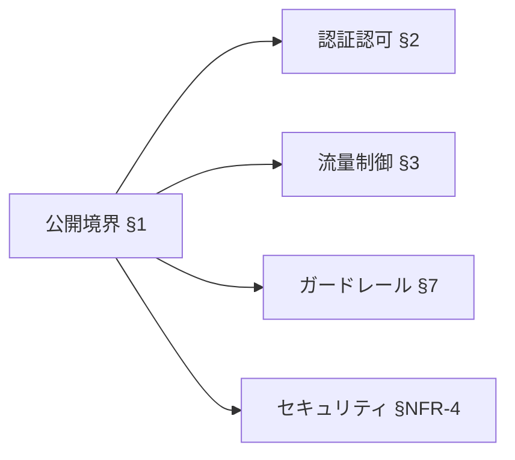
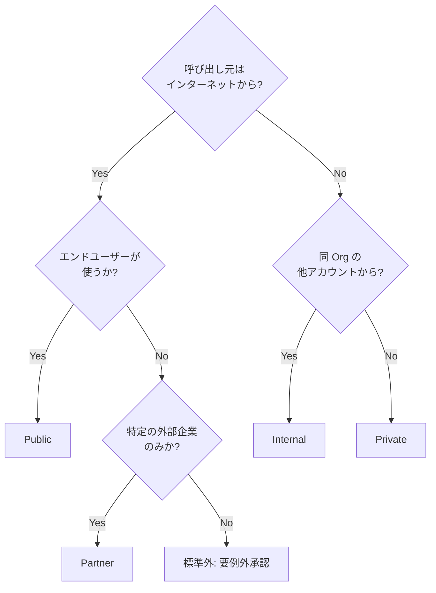

# §FR-API-1 公開境界（Public / Internal / Partner / Private）

> 親 SSOT: [../00-index.md](../00-index.md) §FR-API-1
> ヒアリング: [../../hearing-script/01-exposure-boundary.md](../../hearing-script/01-exposure-boundary.md)

---

## §1.0 前提と背景

### §1.0.1 用語整理

| 用語 | 定義 |
|---|---|
| **公開境界（exposure boundary）** | API がどのネットワーク領域から到達可能かを示す区分 |
| **Public** | インターネット経由で誰でも到達可能（認証は別軸） |
| **Internal** | 同一 AWS Organization 内のみ到達可能（VPC / PrivateLink / VPC Lattice 経由） |
| **Partner** | 外部の特定企業からのみ到達可能（IP allowlist / mTLS / API Key + WAF 経由） |
| **Private** | 同一 VPC 内のみ到達可能（同一アカウントの内部利用） |

### §1.0.2 なぜここ（§1）で決めるか

公開境界は **後続のすべての要件（§2 認証認可・§3 流量制御・§4 課金・§7 ガードレール・§NFR-4 セキュリティ）の前提**になる。Public か Internal かによって：

- 認証方式（IAM auth が使えるか、JWT 必須か）
- WAF の必要性（Public は必須、Private は不要）
- ネットワーク構成（CloudFront 前段、PrivateLink、VPC Lattice）

が **自動的に絞り込まれる**ため、最初に決める必要がある。

### §1.0.3 §1.0.A 本標準のスタンス

| 基本方針 | 本章での具体化 |
|---|---|
| 絶対安全 | デフォルトは Public 不可。**Public 公開は明示的な承認制**。 |
| どんなアプリでも | 4 区分を AWS マネージドサービスで自然に表現できるパターンに整理 |
| 効率よく | 区分判定は **判定フロー**で機械的に決まる（属人判断を避ける） |
| 運用負荷・コスト最小 | 区分ごとに **標準ネットワーク構成テンプレ**を Service Catalog で提供 |

### §1.0.4 本章で扱うサブセクション

| § | サブセクション | 主題 |
|---|---|---|
| §1.1 | 公開境界区分の定義 | 4 区分の定義・選定フロー |
| §1.2 | ネットワーク構成の標準 | 各区分の AWS 構成テンプレ |
| §1.3 | 区分変更（昇格・降格）プロセス | Internal → Public 等の変更承認 |

---

## §1.1 公開境界区分の定義

**このサブセクションで定めること**：4 区分の定義・典型ユースケース・選定の決定木。
**主な判断軸**：呼び出し元の所在（インターネット / 同 Org / 外部企業 / 同 VPC）、認証可否。
**§1 全体との関係**：本サブセクションが §1.2 構成標準・§2 認証認可の選択肢を決める。

### §1.1.1 ベースライン

| 区分 | 呼び出し元 | 典型ユースケース | 認証方式の前提 |
|---|---|---|---|
| **Public** | インターネット任意 | B2C アプリ、Public Web API | JWT（共有認証基盤）必須、未認証 API は WAF + rate-based + ボット対策で限定 |
| **Internal** | 同 Org の他アカウント | 社内マイクロサービス間 API | IAM auth（SigV4）または JWT。VPC Lattice / PrivateLink |
| **Partner** | 特定外部企業 | B2B 接続 API、外部 SaaS との webhook | API Key + WAF、または mTLS（API Gateway Custom Domain） |
| **Private** | 同一 VPC 内 | 同一アプリのバックエンド間通信 | IAM auth または VPC SG 制御 |

### §1.1.2 選定フロー（決定木）

### §1.1.3 TBD / 要確認

- Q: **「Internal だが将来 Public 化の可能性あり」** のとき、初期から Public 構成を取るか、Internal で組んで後で昇格させるか（昇格コストの算定要）→ ヒアリング項目 `API-B-101`
- Q: **既存アプリで区分が曖昧なもの**は再評価が必要か、現状維持か → `API-A-103`
- Q: 「IP allowlist のみで Public」を許容するか（**本標準は原則 Partner 区分扱い** を推奨）→ `API-B-102`

---

## §1.2 ネットワーク構成の標準

**このサブセクションで定めること**：各区分の AWS 構成テンプレ（API Gateway / ALB / CloudFront / PrivateLink）。
**主な判断軸**：マネージドサービス優先、運用負荷最小、Service Catalog で配布可能な単位。
**§1 全体との関係**：§1.1 で選んだ区分 → 本サブセクションのテンプレに 1:1 マッピング。

### §1.2.1 ベースライン

| 区分 | Serverless 系標準構成 | Container 系標準構成 |
|---|---|---|
| **Public** | CloudFront → AWS WAF → Regional API Gateway（HTTP API or REST API）→ Lambda | CloudFront → AWS WAF → ALB → ECS Fargate |
| **Internal** | Private API Gateway + VPC Interface Endpoint（execute-api）+ Resource Policy で Org/VPCE 制限、または VPC Lattice 経由 Lambda target | Internal ALB + VPC Lattice service network（クロスアカウント共有時）または PrivateLink endpoint service |
| **Partner** | Regional REST API + Custom Domain（mTLS optional）+ WAF + Usage Plan + API Key | ALB（mTLS optional）+ WAF + IP allowlist |
| **Private** | Lambda Function URL（IAM auth）または API Gateway Private | Internal ALB + 同 VPC 内 SG 制御 |

### §1.2.2 共通必須要素

- **TLS 1.2 以上**（ACM 証明書）
- **HTTPS のみ**（HTTP redirect 不可）
- **カスタムドメイン**（Public / Partner は必須、`*.execute-api.{region}.amazonaws.com` 直は本番不可）
- **CloudFront を前段に置く場合は Origin Custom Header secret で直叩き防止**（origin の API Gateway 単独到達を WAF Rule で拒否）

### §1.2.3 TBD / 要確認

- Q: **HTTP API vs REST API のデフォルト選定**（HTTP API は安価・低レイテンシだが Usage Plan/API Key 非対応、Private endpoint 直接不可）→ §3 / §4 要件と合わせて確定 → `API-B-104`
- Q: **CloudFront を全 Public API で必須化するか**（最大正面 WAF とエッジキャッシュ・直叩き防止だが固定費）→ `API-B-105`
- Q: VPC Lattice の採用範囲（クロスアカウント Internal で標準化するか、既存 PrivateLink との混在を許容するか）→ `API-B-106`

---

## §1.3 区分変更（昇格・降格）プロセス

**このサブセクションで定めること**：既存 API の区分を変更する際の承認・実装手順。
**主な判断軸**：区分昇格（Private → Public 等）は影響範囲が大きいため、ガバナンス必須。降格は基本自由。
**§1 全体との関係**：§7 ガードレール（FMS 配信ルール）と連動。

### §1.3.1 ベースライン

| 変更方向 | 必要な手続き |
|---|---|
| **昇格**（より公開範囲を広げる） 例: Private → Internal、Internal → Public、Partner 追加 | 1. 設計レビュー申請 2. セキュリティチーム承認 3. WAF / 認証構成の事前確認 4. ガードレールタグ（`Exposure=public` 等）の付与 |
| **降格**（より公開範囲を狭める） | 既存利用者への通知のみ（承認不要） |
| **横移動**（Public ↔ Partner 等） | 利用者影響あり次第ケース判断 |

### §1.3.2 TBD / 要確認

- Q: **昇格の承認権限者**は誰か（セキュリティチーム / アーキテクチャ委員会 / プロジェクトオーナー）→ `API-D-101`
- Q: 昇格申請のリードタイム目標（標準 N 営業日）→ `API-D-102`
- Q: **緊急昇格**（インシデント対応等）のエスケープハッチを許容するか → `API-D-103`

---

## §1.A SSR モノリスでの留意点

[§C-API-2 §C-2.1](../common/02-runtime-selection-criteria.md) のパターン C（SSR モノリス）を採用する場合、公開境界の扱いが API Gateway ベースとは異なる：

| 観点 | API Gateway 系 | SSR モノリス |
|---|---|---|
| 境界判定の単位 | API（メソッド・リソース）単位 | **path 単位**（`/api/*`、`/admin/*`、`/pages/*`、`/assets/*`）|
| Public / Internal の混在 | 別 stage / 別 API で分離 | **同一 ALB の path-based routing で分離**、Public/Internal の境界は path で表現 |
| エンドポイントの区分 | API Gateway endpoint type | **ALB scheme**（internet-facing / internal）+ path |
| Partner（B2B）| API Key / mTLS | mTLS（ALB mTLS Listener）+ 専用 path |
| Private | Private API Gateway + VPCE | **Internal ALB + SG / NACL** で制御 |

→ モノリスでは「**path ベースで公開境界を切る**」設計が前提。例：
- `/api/v1/admin/*` → Internal 扱い（同一 ECS だが path で論理境界）
- `/api/v1/public/*` → Public、WAF + Cognito session
- `/assets/*` → Public、CloudFront キャッシュ

詳細は [§FR-API-6 §6.1.A モノリス vs マイクロサービス](06-container-standard.md) 参照。

---

## §1.x 関連ドキュメント

- [§FR-API-2 認証認可](02-authn-authz.md) — 各区分で採用可能な認証方式の詳細
- [§FR-API-7 ガードレール](07-guardrails.md) — 区分別 FMS 配信ルール
- [§C-API-1 全体参照アーキ](../common/01-reference-architecture.md) — 区分別構成図の全体俯瞰
- [§C-API-2 §C-2.1 アーキパターン選定](../common/02-runtime-selection-criteria.md) — モノリス採用判断
- [§C-API-4 監査ガバナンス](../common/04-audit-governance.md) — 区分変更承認のフロー
