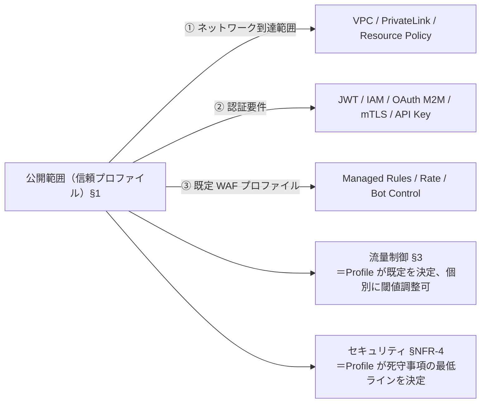

# §FR-API-1 公開範囲（信頼プロファイル）

> 親 SSOT: [../00-index.md](../00-index.md) §FR-API-1
> ヒアリング: [../../hearing-script/01-exposure-boundary.md](../../hearing-script/01-exposure-boundary.md)

---

## §1.0 前提と背景

### §1.0.1 用語整理

| 用語 | 定義 |
|---|---|
| **公開範囲（信頼プロファイル / Exposure Profile）**| API の **「誰がどう到達できるか + 認証が要るか / どう認証するか + 既定で WAF を当てるか」** の 3 要素を **1 つのパッケージ** にした概念 |
| **① ネットワーク到達範囲**（Network Reachability）| どこから到達可能か（VPC / SG / PrivateLink / Resource Policy）|
| **② 認証要件**（Authentication）| 認証必須か / どの方式（JWT / IAM / OAuth M2M / mTLS / API Key）|
| **③ 既定 WAF プロファイル**（Default Protection）| Managed Rules / Rate-based / Bot Control / ATP / ACFP の既定セット |

→ 本標準では、5 つの公開範囲（Profile）から **1 つを選べば、3 要素の既定セットが自動で決まる**。Service Catalog 製品とも 1:1 で対応する。

### §1.0.2 なぜ統合概念にするか

公開範囲は **後続のすべての要件（§2 認証認可・§3 流量制御・§7 ガードレール・§NFR-4 セキュリティ）の前提**になる。

「ネットワーク」「認証」「WAF」を **バラバラに選ぶと組合せが破綻** する（Public なのに WAF なし等）。**「公開範囲」という 1 つのプロファイルにまとめる** ことで：

- アプリ開発者は **「この API はどのプロファイル？」を 1 回答えるだけ** で 3 要素の既定が決まる
- レビュー / 監査が **「Profile が妥当か」だけで完結** する
- Service Catalog 製品 = Profile 1 個 = 1 つの IaC モジュール、と 1:1 対応



### §1.0.3 §1.0.A 本標準のスタンス

| 基本方針 | 本章での具体化 |
|---|---|
| 絶対安全 | Profile 既定で多層防御（ネットワーク + 認証 + WAF）が成立、デフォルト Public 不可 |
| どんなアプリでも | 5 Profile で実務の大半をカバー、例外は申請制 |
| 効率よく | Profile 選定は **判定フロー** で機械的に決まる、3 要素を別々に組み立てる必要なし |
| 運用負荷・コスト最小 | Profile ごとに **標準テンプレ**を Service Catalog で提供（IaC モジュール 1:1）|

### §1.0.4 本章で扱うサブセクション

| § | サブセクション | 主題 |
|---|---|---|
| §1.1 | **公開範囲（信頼プロファイル）の定義** | 5 Profile の統合表 + 選定フロー |
| §1.2 | ネットワーク構成の標準 | 各 Profile の AWS 構成テンプレ |
| §1.3 | Profile 変更（昇格・降格）プロセス | 社内 → パブリック 等の変更承認 |

---

## §1.1 公開範囲（信頼プロファイル）の定義

**このサブセクションで定めること**：5 つの信頼プロファイル（Profile）の統合定義・選定フロー。
**主な判断軸**：3 要素（ネットワーク到達範囲 × 認証要件 × 既定 WAF プロファイル）を **1 つのパッケージ** として束ねる。
**§1 全体との関係**：本サブセクションが §1.2 構成標準・§2 認証認可の選択肢を決める。

### §1.1.1 5 つの信頼プロファイル（統合表）

| Profile（日本語名）| ID | ① ネットワーク到達範囲 | ② 認証要件 | ③ 既定 WAF プロファイル |
|---|---|---|---|---|
| **パブリック（認証有）** | `public-auth` | インターネット任意 | **JWT 必須**（共有認証基盤）| Managed Rules + Rate-based（中）+ Bot Control（オプショナル）|
| **パブリック（オープン）** | `public-open` | インターネット任意 | **不要**（未認証 OK） | Managed Rules + **強い** Rate-based + CloudFront 長 TTL キャッシュ + Bot Control 検討 |
| **社内** | `internal` | 同 Org の他アカウント | IAM auth（SigV4）または JWT | （内部のため WAF 不要）+ Resource Policy / VPC Endpoint で制御 |
| **パートナー** | `partner` | 特定外部企業 | **OAuth Client Credentials**（デフォルト、§2.2.0 条件付き）/ API Key（legacy）/ mTLS（規制対応）| Managed Rules + Per-tenant Rate + scope 別 throttle |
| **社内限定** | `private` | **同一 VPC 内** | IAM / SG 制御 | （VPC 内で完結、WAF 不要）|

> **「社内」と「社内限定」の違い**：
> - **社内** = AWS Organization 内の **他アカウント** からも到達可（Cross-account、VPC Lattice / PrivateLink 経由）
> - **社内限定** = **同一アプリの同一 VPC 内** のみ到達可（マイクロサービス間通信、Internal ALB 等）

### §1.1.2 Profile の典型ユースケース

| Profile | 典型ユースケース | 例 |
|---|---|---|
| パブリック（認証有） | B2C アプリ業務 API | `/api/v1/orders`, `/api/v1/users/me` |
| パブリック（オープン）| ランディング / マーケ / 公開データ API | `/`, `/pricing`, `/api/v1/public/*`, `robots.txt` |
| 社内 | 社内マイクロサービス間 API | アプリ A → アプリ B のクロスアカウント呼び出し |
| パートナー | B2B 接続 API、外部 SaaS との webhook | 顧客企業からの注文連携 API |
| 社内限定 | 同一アプリのバックエンド間通信 | API サービス → DB アクセス層 |

### §1.1.3 Profile 既定の上書き / チューニング

**Profile を選ぶと 3 要素の既定値が決まる**が、別軸でチューニング可能：

| チューニング軸 | 詳細 | どこで定義 |
|---|---|---|
| 流量制御の閾値 | Profile 既定の Rate-based 強度を業務要件で個別調整 | §FR-API-3 流量制御 |
| WAF Bot Control / ATP / ACFP の採用範囲 | コスト感度高、Profile 既定はオプショナル、業務リスク次第 | §FR-API-7 §7.1 |
| mTLS escalation | パートナー Profile 内で規制業界向けは mTLS 必須 | §FR-API-2 §2.2 |
| アプリ独自 WAF ルール | FMS の First/Last rule group の間にアプリが追加可能 | §FR-API-7 §7.1 |

→ **Profile = 既定値、別軸 = チューニング可能** の構造で、ガードレール（中央統制）と自治（アプリ判断）のバランスが取れる。

### §1.1.4 「パブリック（オープン）」採用時の特記事項

「パブリック（オープン）」の本標準デフォルトスタンスは「**アプリ UI を持たない**」（業界主流：Salesforce / Workday / ServiceNow / Slack / Notion 等が認証基盤 Hosted UI に委譲）。

これにより「パブリック（オープン）」の対象は **マーケティング・公開データ系** に絞られ、設計がシンプルになる。サインイン / サインアップ UI は認証基盤側に委譲。詳細は [§FR-API-2 §2.B 未認証エンドポイントの標準保護パターン](02-authn-authz.md)。

### §1.1.5 Profile 選定フロー（決定木）

```mermaid
flowchart TD
    Q1{呼び出し元は<br/>インターネットから?}
    Q1 -->|Yes| Q1a{認証が必要?}
    Q1 -->|No| Q3{同 Org の<br/>他アカウントから?}
    Q1a -->|Yes| Q2{エンドユーザーか?<br/>(JWT で識別する)}
    Q1a -->|No| PubOpen[パブリック<br/>(オープン)<br/>public-open]
    Q2 -->|Yes| PubAuth[パブリック<br/>(認証有)<br/>public-auth]
    Q2 -->|No| Q4{特定の外部企業<br/>のみか?}
    Q4 -->|Yes| Partner[パートナー<br/>partner]
    Q4 -->|No| Reject[標準外: 要例外承認]
    Q3 -->|Yes| Internal[社内<br/>internal]
    Q3 -->|No| Private[社内限定<br/>private]

    style PubOpen fill:#fff3e0,stroke:#e65100
    style PubAuth fill:#e3f2fd,stroke:#1565c0
    style Partner fill:#f3e5f5,stroke:#6a1b9a
```

### §1.1.6 TBD / 要確認

- Q: **「社内だが将来パブリック化の可能性あり」** のとき、初期からパブリック構成を取るか、社内で組んで後で昇格させるか → ヒアリング項目 `API-B-101`
- Q: **既存アプリで Profile が曖昧なもの**は再評価が必要か、現状維持か → `API-A-103`
- Q: 「IP allowlist のみでパブリック」を許容するか（**本標準は原則パートナー扱い** を推奨）→ `API-B-102`
- Q: **未認証アクセスが必須のエンドポイント棚卸し**（ランディング / マーケ / 公開データ API のリスト）→ `API-B-103`
- Q: **サインイン / サインアップ UI をアプリで持つアプリの有無**（認証基盤側方針と連動、原則 Hosted UI 委譲）→ `API-B-107`

---

## §1.2 ネットワーク構成の標準

**このサブセクションで定めること**：各区分の AWS 構成テンプレ（API Gateway / ALB / CloudFront / PrivateLink）。
**主な判断軸**：マネージドサービス優先、運用負荷最小、Service Catalog で配布可能な単位。
**§1 全体との関係**：§1.1 で選んだ区分 → 本サブセクションのテンプレに 1:1 マッピング。

### §1.2.1 ベースライン

| Profile（ID） | Serverless 系標準構成 | Container 系標準構成 |
|---|---|---|
| **パブリック（認証有）** `public-auth` | CloudFront → AWS WAF → Regional API Gateway（HTTP API or REST API）→ Lambda + JWT Authorizer | CloudFront → AWS WAF → ALB → ECS Fargate（ALB Cognito session or app middleware）|
| **パブリック（オープン）** `public-open` | CloudFront（**長 TTL キャッシュ**）→ AWS WAF → API Gateway / Lambda or S3（静的）| CloudFront → AWS WAF → ALB → ECS Fargate（path-based に「`/api/v1/public/*`」を分離）|
| **社内** `internal` | Private API Gateway + VPC Interface Endpoint（execute-api）+ Resource Policy で Org/VPCE 制限、または VPC Lattice 経由 Lambda target | Internal ALB + VPC Lattice service network（クロスアカウント共有時）または PrivateLink endpoint service |
| **パートナー** `partner` | Regional REST API + Custom Domain（mTLS optional）+ WAF + **JWT Authorizer（OAuth Client Credentials）**、API Key は legacy/trial 用に Usage Plan 併用可 | ALB + Custom Domain（mTLS optional）+ WAF + Cognito M2M Authorizer |
| **社内限定** `private` | Lambda Function URL（IAM auth）または API Gateway Private | Internal ALB + 同 VPC 内 SG 制御 |

### §1.2.2 共通必須要素

- **TLS 1.2 以上**（ACM 証明書）
- **HTTPS のみ**（HTTP redirect 不可）
- **カスタムドメイン**（Public / Partner は必須、`*.execute-api.{region}.amazonaws.com` 直は本番不可）
- **CloudFront を前段に置く場合は Origin Custom Header secret で直叩き防止**（origin の API Gateway 単独到達を WAF Rule で拒否）

### §1.2.3 TBD / 要確認

- Q: **HTTP API vs REST API のデフォルト選定**（HTTP API は安価・低レイテンシだが Usage Plan/API Key 非対応、Private endpoint 直接不可）→ §3 / §4 要件と合わせて確定 → `API-B-104`
- Q: **CloudFront を全 Public API で必須化するか**（最大正面 WAF とエッジキャッシュ・直叩き防止だが固定費）→ `API-B-105`
- Q: VPC Lattice の採用範囲（クロスアカウント Internal で標準化するか、既存 PrivateLink との混在を許容するか）→ `API-B-106`

---

## §1.3 Profile 変更（昇格・降格）プロセス

**このサブセクションで定めること**：既存 API の Profile を変更する際の承認・実装手順。
**主な判断軸**：Profile 昇格（社内限定 → パブリック 等）は影響範囲が大きいため、ガバナンス必須。降格は基本自由。
**§1 全体との関係**：§7 ガードレール（FMS 配信ルール）と連動。

### §1.3.1 ベースライン

| 変更方向 | 必要な手続き |
|---|---|
| **昇格**（より公開範囲を広げる）<br/>例: 社内限定 → 社内、社内 → パブリック、パートナー追加 | 1. 設計レビュー申請<br/>2. セキュリティチーム承認<br/>3. WAF / 認証構成の事前確認<br/>4. ガードレールタグ（`Exposure=public-auth` 等の Profile ID）の付与 |
| **降格**（より公開範囲を狭める） | 既存利用者への通知のみ（承認不要） |
| **横移動**（パブリック ↔ パートナー 等） | 利用者影響あり次第ケース判断 |

### §1.3.2 TBD / 要確認

- Q: **昇格の承認権限者**は誰か（セキュリティチーム / アーキテクチャ委員会 / プロジェクトオーナー）→ `API-D-101`
- Q: 昇格申請のリードタイム目標（標準 N 営業日）→ `API-D-102`
- Q: **緊急昇格**（インシデント対応等）のエスケープハッチを許容するか → `API-D-103`

---

## §1.A SSR モノリスでの留意点

[§C-API-2 §C-2.1](../common/02-runtime-selection-criteria.md) のパターン C（SSR モノリス）を採用する場合、Profile の扱いが API Gateway ベースとは異なる：

| 観点 | API Gateway 系 | SSR モノリス |
|---|---|---|
| Profile 判定の単位 | API（メソッド・リソース）単位 | **path 単位**（`/api/*`、`/admin/*`、`/pages/*`、`/assets/*`）|
| パブリック / 社内 の混在 | 別 stage / 別 API で分離 | **同一 ALB の path-based routing で分離**、Profile の境界は path で表現 |
| エンドポイントの Profile | API Gateway endpoint type | **ALB scheme**（internet-facing / internal）+ path |
| パートナー（B2B）| API Key / mTLS | mTLS（ALB mTLS Listener）+ 専用 path |
| 社内限定 | Private API Gateway + VPCE | **Internal ALB + SG / NACL** で制御 |

→ モノリスでは「**path ベースで Profile を切る**」設計が前提。例：
- `/api/v1/admin/*` → 社内扱い（同一 ECS だが path で論理境界）
- `/api/v1/public/*` → パブリック（認証有）、WAF + Cognito session
- `/assets/*` → パブリック（オープン）、CloudFront キャッシュ

詳細は [§FR-API-6 §6.1.A モノリス vs マイクロサービス](06-container-standard.md) 参照。

---

## §1.x 関連ドキュメント

- [§FR-API-2 認証認可](02-authn-authz.md) — 各区分で採用可能な認証方式の詳細
- [§FR-API-7 ガードレール](07-guardrails.md) — 区分別 FMS 配信ルール
- [§C-API-1 全体参照アーキ](../common/01-reference-architecture.md) — 区分別構成図の全体俯瞰
- [§C-API-2 §C-2.1 アーキパターン選定](../common/02-runtime-selection-criteria.md) — モノリス採用判断
- [§C-API-4 監査ガバナンス](../common/04-audit-governance.md) — 区分変更承認のフロー
