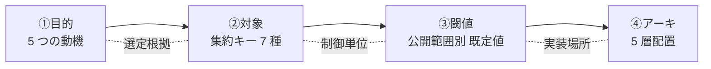

# §FR-API-3 流量制御・クォータ

> 親 SSOT: [../00-index.md](../00-index.md) §FR-API-3
> ヒアリング: [../../hearing-script/03-throttling-quota.md](../../hearing-script/03-throttling-quota.md)

---

## §3.0 前提と背景

### §3.0.1 用語整理

| 用語 | 定義 |
|---|---|
| **Throttle（スロットル）** | 単位時間あたりの最大リクエスト数の制限 |
| **Burst** | 短時間に許容する瞬間最大値（rate を超える短期スパイク許容） |
| **Quota** | 期間（日 / 週 / 月）あたりの累積上限 |
| **Rate limit** | throttle の英語表現、本書では同義扱い |
| **Account-level throttling** | AWS アカウント全体での API Gateway の上限（既定 10,000 RPS / Burst 5,000） |
| **Usage Plan** | API Gateway REST API が提供する API Key 単位の throttle + quota の組み合わせ |

### §3.0.2 なぜここ（§3）で決めるか

流量制御は「**死守すべきセキュリティ**」と「**コスト管理**」の両面で必須：

- **セキュリティ**：DDoS 緩和・暴走クライアントの遮断・他テナント影響の隔離
- **コスト**：従量課金リソース（Lambda 実行・データ転送・DB クエリ）の暴騰防止

ただし AWS 公式は明確に「**Usage Plan の throttle/quota は best-effort であり、ハードリミットではない**」「**Usage Plan を予算管理に使うな**（→ AWS Budgets / AWS WAF を使え）」と明記している。本標準ではこの公式ガイダンスに沿う。

### §3.0.3 §3.0.A 本標準のスタンス

| 基本方針 | 本章での具体化 |
|---|---|
| 絶対安全 | **全公開 API に rate-based WAF rule を必須化**（IP 単位、5 分窓） |
| どんなアプリでも | REST API は Usage Plan、HTTP API は WAF + アプリ内制御の二本立てを許容 |
| 効率よく | Service Catalog で **API カテゴリ別の標準 throttle テンプレ**（Public / Internal / Partner）を配布 |
| 運用負荷・コスト最小 | 標準値で 80% カバー、個別調整は申請制 |

### §3.0.4 本章で扱うサブセクション

| § | サブセクション | 主題 |
|---|---|---|
| §3.1 | スロットル設計 | API・メソッド・利用者単位の throttle/burst、**集約キー 7 種** |
| §3.2 | クォータ設計 | 日次・月次の累積上限 |
| §3.3 | 超過時挙動 | 429 応答・Retry-After・クライアント規約 |
| §3.4 | HTTP API での流量制御代替 | Usage Plan 非対応への対処、**WAF ヘッダ集約による tenant 単位制御** |

### §3.0.5 流量制限 4 観点の整理（目的 → 対象 → 閾値 → アーキ）

検討の論理順序：**「なぜ（目的）→ 誰を（対象/集約キー）→ どこから NG（閾値）→ どう実装（アーキ）」**

| # | 観点 | 概要 | 方針案 |
|---|---|---|---|
| **1** | **流量制限の目的** | なぜ制限が必要か。**多目的の防御策**として整理 | **5 つの目的を併せ持つ**：①保護（DDoS/バーストから上流系を守る）② 公平性（マルチテナント環境で 1 顧客が全体を占有しない）③ コスト管理（従量課金リソースの暴走防止）④ SLA 遵守（契約 TPS の自動強制）⑤ 異常検知（credential stuffing / scraping / Bot 検出）|
| **2** | **流量制限の対象**（集約キー）| 「誰の」リクエストをカウントするか。識別単位の選定で **防御の意味が決まる** | **多層集約キーを併用**（詳細は §3.1）：IP / Forwarded IP / **HTTP ヘッダ値（tenant_id 等）** ⭐ / Cookie / クエリ文字列 / URI Path / JA3・JA4 fingerprint / **複合キー（最大 5）**。**「テナント単位の集約」は WAF ヘッダ集約で REST/HTTP 両 API 共通に実現可** |
| **3** | **流量制限の閾値** | どの値で発動するか、超過時の挙動。**公開範囲別の既定値** + 個別調整 | **公開範囲別 既定値**：パブリック（認証有）1,000 req/min/user、パブリック（オープン）100 req/min/IP（強）、社内 5,000 req/sec/service、パートナー tier 別（Bronze 100 / Silver 1,000 / Gold 10,000 req/min）。**超過時**：429 + Retry-After ヘッダ、warn（80%）→ block（100%）の 2 段階、CloudWatch Alarm 連動 |
| **4** | **リファレンスアーキテクチャ** | どの AWS サービスでどう実装するか。**5 層の組合せ** | **5 層**：①CloudFront + WAF rate-based（IP / ヘッダ / 複合キー）② API Gateway throttling（stage/method 単位）③ API Gateway Usage Plan + API Key（REST のみ、Partner 主役）④ Lambda Authorizer + DynamoDB counter（業務 logic 駆動の細粒度）⑤ アプリ内 middleware（resource-level）。**公開範囲別の組合せ**は §3.4 参照 |



---

## §3.1 スロットル設計

**このサブセクションで定めること**：API・メソッド・利用者単位の throttle / burst の標準値。
**主な判断軸**：DDoS 緩和を優先、正規利用は阻害しない、アカウント上限から逆算。
**§3 全体との関係**：本サブセクションが流量制御の主要レイヤ。§3.2 quota は累積、§3.1 rate は瞬間。

### §3.1.1 ベースライン

- **階層構造**（API Gateway 公式の優先順）：
  1. クライアント/メソッド単位（Usage Plan）
  2. メソッド単位（Stage 設定）
  3. API 全体（Stage 設定）
  4. アカウントレベル（AWS 既定 / 申請上限）
  5. **AWS Regional 上限**（地域全体）
- **標準値（暫定）**：

| API カテゴリ | Rate（RPS） | Burst |
|---|---:|---:|
| Public B2C | 1,000 / API key | 2,000 |
| Internal microservice | 5,000 / service | 10,000 |
| Partner B2B | 100 / API key | 200 |
| Private | 個別 | 個別 |

- **WAF rate-based rule** を **全 Public/Partner API に必須**：標準値 2,000 req / 5min（既定 IP 集約）

### §3.1.2 WAF rate-based の集約キー 7 種（2024〜 拡張）

**重要な更新（2024〜）**：WAF rate-based は **IP 単位だけでなく、ヘッダ値・複合キー** での集約が可能になった（[AWS 公式 Aggregating rate-based rules](https://docs.aws.amazon.com/waf/latest/developerguide/waf-rule-statement-type-rate-based-aggregation-options.html)）。これにより **テナント単位の制限が REST/HTTP 両 API 共通で可能**。

#### §3.1.2.1 集約キーの選択肢

| # | 集約キー | 説明 | 用途 |
|---|---|---|---|
| 1 | **IP アドレス**（デフォルト）| 送信元 IP 単位でカウント | DDoS / 単純ブルートフォース対策 |
| 2 | **Forwarded IP**（X-Forwarded-For 等）| CDN 経由でも実 IP を取得 | CloudFront 配下の真の送信元 IP |
| 3 | **HTTP ヘッダ値** ⭐ | 任意のヘッダ値（`x-tenant-id`、`x-api-key`、`Authorization` 等）| **マルチテナント / 顧客単位の集約**（本標準デフォルト）|
| 4 | **Cookie 値** | 特定 Cookie の値 | セッション単位（B2C 等）|
| 5 | **クエリ文字列** | クエリパラメータ値 | URL パラメータ単位 |
| 6 | **URI Path** | path 単位 | エンドポイント別（`/login` / `/signup` 強保護）|
| 7 | **JA3 / JA4 fingerprint**（2025）| TLS handshake の fingerprint | Bot / 異常クライアント検知 |
| 複合 | **複合キー（最大 5 個）**| 上記の組合せ | `tenant_id + URI path` 等の細粒度制御 |

#### §3.1.2.2 コスト・制約

| 項目 | 値 |
|---|---|
| カスタムキー 1 個あたり追加 WCU | **30 WCU** |
| Web ACL の WCU 上限 | 1,500 WCU（拡張可）|
| 評価ウィンドウ | 60 / 120 / 300 / 600 秒（2024〜）|
| 1 Rule の閾値範囲 | 100 〜 20,000,000,000 req / 評価ウィンドウ |

#### §3.1.2.3 公開範囲別の集約キー組合せ（本標準デフォルト）

| 公開範囲（Profile）| 集約キー組合せ | 既定値（暫定）|
|---|---|---|
| パブリック（認証有）| **IP + ヘッダ（`x-tenant-id` or JWT クレーム由来）** | 1,000 req/min/user-tenant 複合 |
| パブリック（オープン）| **IP + URI Path** | 100 req/min/IP（強）|
| 社内 | （内部のため WAF 不要、IAM auth で制御）| – |
| パートナー | **API Key + URI Path**（REST API + Usage Plan）or **ヘッダ + URI Path**（HTTP API）| tier 別（Bronze 100 / Silver 1,000 / Gold 10,000 req/min）|
| 社内限定 | 制限なし（SG で代替）| – |

→ 「**テナント単位の集約はできない**」は古い前提。**WAF ヘッダ集約で REST/HTTP 両 API 共通に成立する**。

### §3.1.3 TBD / 要確認

- Q: **既定 throttle 値の妥当性**（アプリごとのトラフィック実績に基づいて再設定要）→ `API-B-301`
- Q: アカウントレベル throttle の **増枠申請を予防的に行うか**（10k RPS のままで足りるか）→ `API-B-302`
- Q: **メソッド単位**（POST は厳しく、GET は緩く 等）の標準化テンプレを用意するか → `API-B-303`
- Q: **WAF ヘッダ集約キーで使用するヘッダ名の標準**（`x-tenant-id` / `Authorization` の JWT クレーム由来 等）→ `API-B-304` ⭐
- Q: 複合キー採用時の **WCU 予算**（カスタムキー 1 個 = 30 WCU、Web ACL 上限 1,500 WCU）→ `API-B-305`

---

## §3.2 クォータ設計

**このサブセクションで定めること**：日次・月次の累積リクエスト上限。
**主な判断軸**：商用契約・無料枠・サブスクリプションプランへの対応。
**§3 全体との関係**：§3.1 の瞬間制御に対し本サブセクションは長期累積。

### §3.2.1 ベースライン

- **REST API + Usage Plan** で API Key ごとに `quota.limit` + `period`（DAY / WEEK / MONTH）を設定
- 標準プラン例（暫定）：

| プラン | 月次 quota | 想定用途 |
|---|---:|---|
| Free | 10,000 / month | 開発・評価 |
| Basic | 100,000 / month | 小規模商用 |
| Pro | 1,000,000 / month | 中規模商用 |
| Enterprise | 個別 | 大規模 / 専用契約 |

- **HTTP API は Usage Plan 非対応** → §3.4 で代替

### §3.2.2 TBD / 要確認

- Q: **商用 API に quota を全面適用するか、内部利用は無制限とするか** → `API-B-311`
- Q: **超過時の課金モデル**（追加課金 / ハードカット）→ `API-B-312`
- Q: 月初リセットの **タイムゾーン**（UTC か JST か）→ `API-B-313`

---

## §3.3 超過時挙動

**このサブセクションで定めること**：throttle / quota 超過時のレスポンス規約。
**主な判断軸**：クライアント側で正しくリトライできる、Observability で検出できる。
**§3 全体との関係**：§3.1 / §3.2 の挙動仕様。

### §3.3.1 ベースライン

- **HTTP ステータス**：429 Too Many Requests
- **必須ヘッダ**：
  - `Retry-After`（秒数 or 日時、推奨：秒数）
  - `X-RateLimit-Limit` / `X-RateLimit-Remaining` / `X-RateLimit-Reset`（任意だが推奨）
- **クライアント規約**：**Exponential backoff + jitter** での retry を義務化、最大 retry 回数・累積待機時間を SDK / 規約で標準化
- **観測**：429 を CloudWatch メトリクスに分離（`4XXError` から分離するため Logs Insights で集計）、SLO 違反通知

### §3.3.2 TBD / 要確認

- Q: 429 を **アラート化するしきい値**（1% / 5% / 10% を超えたら通知）→ `API-B-321`
- Q: **429 を SLO の対象外とするか含めるか** → `API-B-322`

---

## §3.4 HTTP API での流量制御代替

**このサブセクションで定めること**：HTTP API（Usage Plan 非対応）採用時の流量制御代替手段。
**主な判断軸**：マネージド優先、複雑性最小、検知可能性。
**§3 全体との関係**：§3.1 / §3.2 を HTTP API でも実現するための手段。

### §3.4.1 ベースライン（更新：WAF ヘッダ集約がデフォルト）

**重要（2024〜）**：WAF rate-based の **ヘッダ集約キー** で **HTTP API でも tenant 単位の流量制御が可能**になった。これにより従来の「HTTP API は自前実装必須」前提が不要に。

#### 代替手段の優先順位

| 優先 | 手段 | tenant 単位制御 | 実装複雑性 | コスト |
|:---:|---|:---:|:---:|---|
| **1（デフォルト）⭐** | **AWS WAF rate-based + ヘッダ集約キー**（`x-tenant-id` 等）| ✅ | 低（マネージド）| WAF + カスタムキー 30 WCU/key |
| 2 | **API Gateway stage throttling**（API 全体・メソッド単位） | ❌（粗粒度）| 最低 | 無料 |
| 3 | **CloudFront function** でヘッダベース簡易制御 | △（path-based 等）| 中 | CloudFront function 料金 |
| 4 | **Lambda Authorizer + DynamoDB アトミックカウンタ**（業務 logic 駆動の細粒度時のみ）| ✅ | 高（自前実装）| Lambda + DDB（write 重い）|
| 5 | アプリ内（Lambda 内）でのトークンバケット実装 | ✅ | 高 | 開発負荷大 |

#### 公開範囲（Profile）別 推奨組合せ（HTTP API 時）

| Profile | 推奨組合せ |
|---|---|
| パブリック（認証有） | 層 1（WAF：IP + `x-tenant-id` 複合キー）+ 層 2（API GW stage throttling）+ 層 5（アプリ middleware）|
| パブリック（オープン）| 層 1（WAF：IP + URI Path、強 rate）+ 層 2 |
| 社内 | 層 2 + 層 5 |
| パートナー（HTTP API 時）| 層 1（WAF：`x-api-key` ヘッダ集約 + URI Path）+ 層 2 + 層 5 |

#### WAF ヘッダ集約の具体例

`x-tenant-id` ヘッダで tenant 単位の rate-limit：

```yaml
# AWS WAF Rule (CloudFormation)
- Name: TenantRateLimit
  Statement:
    RateBasedStatement:
      Limit: 1000              # 1000 req per 5 min per tenant
      AggregateKeyType: CUSTOM_KEYS
      CustomKeys:
        - Header:
            Name: x-tenant-id
            TextTransformations:
              - Priority: 0
                Type: NONE
        - UriPath:
            TextTransformations:
              - Priority: 0
                Type: NONE
      EvaluationWindowSec: 300
  Action:
    Block: {}
```

→ **HTTP API + WAF ヘッダ集約で、tenant 単位の細粒度制御が REST API + Usage Plan と同等に実現可能**。
→ 自前実装（Lambda Authorizer + DDB counter）は **業務 logic 駆動の特殊ケースのみ**に退く。

### §3.4.2 TBD / 要確認

- Q: HTTP API + WAF ヘッダ集約での tenant 単位制御を **デフォルトとするか** → `API-B-341`（**改訂版**）
- Q: WAF ヘッダ集約キーで使用するヘッダ名標準（`x-tenant-id` / JWT クレーム → API GW transformation 由来）→ `API-B-304`
- Q: 自前実装（Lambda Authorizer + DDB）の DynamoDB スキーマ・コスト試算（必要時）→ `API-B-342`

---

## §3.A SSR モノリスでの留意点

[§C-API-2 §C-2.1](../common/02-runtime-selection-criteria.md) のパターン C（SSR モノリス）では、流量制御の手段が大きく異なる：

| 観点 | API Gateway 系（API） | SSR モノリス（ALB + ECS）|
|---|---|---|
| **Usage Plan + API Key** | 利用可（REST API） | **利用不可**（ALB に Usage Plan なし）|
| Throttle | API GW stage / method throttle | **WAF rate-based rule のみ**（IP / 5min 窓）|
| Quota | Usage Plan で per-key | **自前実装**（DynamoDB アトミックカウンタ等）|
| 429 応答 | API GW 自動 | アプリ自前または ALB レベル（リクエスト容量超過時） |
| **代替手段** | （該当なし） | WAF rate-based + アプリ内 throttling（middleware）+ DynamoDB カウンタ |

**モノリス採用時の流量制御パス（推奨）**：
1. **第 1 層：CloudFront / WAF rate-based**（IP 単位、5min 窓、ボットや DDoS 対策）
2. **第 2 層：ALB**（target group の max connections / desired count スケール制御）
3. **第 3 層：アプリ内 middleware**（session ID / tenant_id 単位の throttling、必要時は DynamoDB）
4. **B2B 課金が要件化したら**：§C-API-2 §C-2.3 段階移行パスで `/api/*` を別サービスに切り出し、API Gateway + Usage Plan を導入

**留意点**：
- Usage Plan が使えないため、**per-tenant 課金が必須要件のアプリはモノリスを避ける**（パターン A / B を選ぶ）
- WAF rate-based の窓は固定 5min、より細かい制御は middleware で実装
- DynamoDB アトミックカウンタは **コスト感度が高い**ため、テナント数 × リクエスト頻度を要見積

詳細は [§FR-API-6 §6.1.A モノリス vs マイクロサービス](06-container-standard.md) 参照。

---

## §3.x 関連ドキュメント

### 本標準内クロスリファレンス

- [§FR-API-4 課金](04-metering-billing.md) — 利用者識別子（API Key）の活用
- [§FR-API-6 §6.1.A モノリス vs マイクロサービス](06-container-standard.md) — モノリスでの流量制御
- [§FR-API-7 ガードレール](07-guardrails.md) — WAF rate-based rule の FMS 配信
- [§NFR-API-4 セキュリティ](../nfr/04-security.md) — DDoS 対策の死守事項
- [§NFR-API-8 コスト](../nfr/08-cost.md) — 流量制御で防ぐべきコスト暴騰シナリオ

### AWS 公式（WAF rate-based、最新仕様）

- [Aggregating rate-based rules in AWS WAF](https://docs.aws.amazon.com/waf/latest/developerguide/waf-rule-statement-type-rate-based-aggregation-options.html) — **集約キー 7 種の公式仕様**（IP / Forwarded IP / Header / Cookie / Query / URI Path / JA3・JA4）
- [Rate-based rule aggregation instances and counts](https://docs.aws.amazon.com/waf/latest/developerguide/waf-rule-statement-type-rate-based-aggregation-instances.html) — 集約インスタンスの仕組み
- [RateBasedStatementCustomKey - AWS WAFv2 API](https://docs.aws.amazon.com/waf/latest/APIReference/API_RateBasedStatementCustomKey.html) — カスタムキー API リファレンス
- [Discover the benefits of AWS WAF advanced rate-based rules (AWS Security Blog)](https://aws.amazon.com/blogs/security/discover-the-benefits-of-aws-waf-advanced-rate-based-rules/) — **マルチテナント用例の公式 Blog**
- [AWS WAF now supports JA4 fingerprinting (2025-03)](https://aws.amazon.com/about-aws/whats-new/2025/03/aws-waf-ja4-fingerprinting-aggregation-ja3-ja4-fingerprints-rate-based-rules/) — JA4 集約キー対応の announcement
- [Use an aggregation key to configure a rate limit rule (AWS re:Post)](https://repost.aws/knowledge-center/waf-rate-limit-rule-aggregation-key) — 実装ガイド

### API Gateway throttling 関連

- [Throttle requests to your REST APIs (API Gateway docs)](https://docs.aws.amazon.com/apigateway/latest/developerguide/api-gateway-request-throttling.html) — REST API throttling 仕様
- [Usage plans and API keys for REST APIs](https://docs.aws.amazon.com/apigateway/latest/developerguide/api-gateway-api-usage-plans.html) — Usage Plan + API Key 仕様
