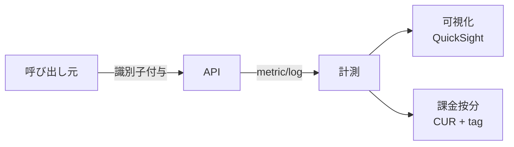

# §FR-API-4 利用者識別・課金按分

> 親 SSOT: [../00-index.md](../00-index.md) §FR-API-4
> ヒアリング: [../../hearing-script/04-metering-billing.md](../../hearing-script/04-metering-billing.md)

---

## §4.0 前提と背景

### §4.0.1 用語整理

| 用語 | 定義 |
|---|---|
| **利用者識別子** | 「誰が API を呼んだか」を一意に表すキー（API Key / JWT sub / mTLS CN / IAM Principal） |
| **Metering（計測）** | リクエスト数・処理時間・転送量等を利用者単位で記録すること |
| **Cost allocation tag** | AWS リソースに付与するタグで、CUR / Cost Explorer に表示される |
| **CUR** | Cost and Usage Report、AWS の利用料・使用量の詳細レポート（S3 出力、Athena でクエリ可） |
| **按分（あんぶん）** | 共有リソース（VPC・DB 等）のコストを利用量比で各利用者に割り振ること |

### §4.0.2 なぜここ（§4）で決めるか

「**どの利用者がどのくらい使ったか識別、管理する方法**」（要望テーマ）の中核。流量制御（§3）と表裏一体で、§3 が **上限制御**、§4 が **可視化・課金按分** を担う。

### §4.0.3 §4.0.A 本標準のスタンス

| 基本方針 | 本章での具体化 |
|---|---|
| 絶対安全 | 識別子の発行・配布は **Secrets Manager 経由**、ログには **マスク化したサフィックスのみ**出力 |
| どんなアプリでも | API Key / JWT sub / IAM Principal / mTLS CN の **4 系統識別子を統一スキーマで扱える** |
| 効率よく | Cost allocation tag は **必須タグセット**を Service Catalog で配布、欠落は Config Rule で検知 |
| 運用負荷・コスト最小 | 集計は CUR + Athena + QuickSight の **マネージドパイプライン**、独自集計基盤は作らない |

### §4.0.4 本章で扱うサブセクション

| § | サブセクション | 主題 |
|---|---|---|
| §4.1 | 利用者識別子の体系 | 識別子の種類・発行・ローテーション |
| §4.2 | 計測（Metering） | リクエスト数・処理時間・転送量の記録 |
| §4.3 | Cost allocation tag 標準 | 必須タグ・タグ正規化・配信 |
| §4.4 | 課金按分・請求 | CUR + Athena による按分、内部請求の根拠データ |

---

## §4.1 利用者識別子の体系

**このサブセクションで定めること**：利用者を一意に識別する識別子の種類・発行・管理の標準。
**主な判断軸**：API Gateway / IAM / OIDC との自然な統合、ローテーション可能、マスクログ。
**§4 全体との関係**：本サブセクションが §4.2 計測の入力。

### §4.1.1 ベースライン

| 識別子種別 | 発行元 | 適用境界 | 計測の主体 |
|---|---|---|---|
| **API Key** | API Gateway / IaC | Partner | API Gateway access log + Usage Plan |
| **JWT `sub` / `tenant_id`** | 共有認証基盤 | Public | カスタムログフィールド + EMF |
| **IAM Principal ARN** | IAM | Internal / Private | CloudTrail + access log |
| **mTLS Subject DN** | Partner / 自社 PKI | Partner | API Gateway access log |

- **識別子と人の対応**：API Key ↔ 法人テナント、JWT sub ↔ エンドユーザー、IAM ↔ サービスアカウント
- 重要：**識別子ローテーション後も過去ログでの追跡可能性を保つ**ため、ローテーション履歴を別管理（Secrets Manager の version、または別 DDB テーブル）

### §4.1.2 TBD / 要確認

- Q: **テナント単位のメインの識別子は API Key か JWT のカスタムクレームか**（B2B SaaS なら通常 API Key、マルチテナント SPA なら JWT クレーム）→ `API-B-401`
- Q: API Key の **マスク方針**（先頭 4 文字 + 末尾 4 文字のみログ出力する等）→ `API-B-402`

---

## §4.2 計測（Metering）

**このサブセクションで定めること**：API 呼び出し量・処理量を利用者単位で計測する標準手段。
**主な判断軸**：マネージド機能優先、低オーバヘッド、リアルタイム性。
**§4 全体との関係**：§4.1 識別子をキーに、§4.4 課金按分の元データを作る。

### §4.2.1 ベースライン

- **API Gateway access log** に必須フィールドを設定（§FR-API-8 観測性 §8.1 で詳細化）：
  - `requestId` / `httpMethod` / `path` / `status` / `latency` / `responseLength`
  - `apiKey`（マスク済）/ `userArn` / `identity.user`
  - `xrayTraceId` / `wafResponseCode`
- **CloudWatch Embedded Metric Format (EMF)** で構造化ログから直接メトリクスを生成（次元：`tenant_id`, `api_id`, `method`）
- **API Gateway 自体のメトリクス**：`Count`, `4XXError`, `5XXError`, `IntegrationLatency`, `Latency`
- **Lambda 側**：`Invocations`, `Duration`, `Errors`, `ConcurrentExecutions`（テナント別を切るなら EMF）
- 集計：**CloudWatch Logs Insights** で日次・月次に集計、長期はログを S3 export → Athena

### §4.2.2 TBD / 要確認

- Q: 「**処理時間 × 利用者**」の按分（Lambda 実行時間ベース）を要件にするか、Request 数のみで十分か → `API-B-411`
- Q: EMF カスタムメトリクスの **次元数・カーディナリティ上限**（CloudWatch は次元数で課金発生）→ `API-B-412`

---

## §4.3 Cost allocation tag 標準

**このサブセクションで定めること**：すべての API 関連リソースに必須で付与するタグ。
**主な判断軸**：CUR で按分集計可能、Config Rule で必須化監視。
**§4 全体との関係**：§4.4 課金按分の前提。リソース単位で按分するための鍵。

### §4.3.1 ベースライン（必須タグセット）

| タグキー | 値の例 | 用途 |
|---|---|---|
| `CostCenter` | `dept-ec`, `dept-hr` | 内部部門単位の按分 |
| `Project` | `proj-checkout-api` | プロジェクト単位 |
| `Environment` | `prod`, `stg`, `dev` | 環境別コスト追跡 |
| `Application` | `app-billing` | アプリ単位 |
| `Exposure` | `public`, `internal`, `partner`, `private` | §1 公開範囲連動、FMS 配信のキー |
| `Tenant` | `tenant-xxxx` | マルチテナント運用時のテナント単位 |
| `DataClassification` | `pii`, `internal`, `public` | ログ・暗号化方針の決定 |

- **2025: アカウントレベル cost allocation tag が AWS Organizations で配信可能**になったため、Org 管理アカウントから一括 ON 化
- **untaggable リソース**（データ転送など）は **AWS Application Cost Profiler** か **Application Tagging（split charge rule）** で按分

### §4.3.2 TBD / 要確認

- Q: 必須タグの**最終確定（特に `CostCenter` の粒度）** → `API-D-401`
- Q: Tag enforcement の手段（Config Rule + SCP / IaC validation hooks）→ `API-B-431`
- Q: 既存リソースへの **遡及付与**スコープ → `API-B-432`

---

## §4.4 課金按分・請求

**このサブセクションで定めること**：CUR + Athena + QuickSight による按分パイプラインと、内部請求への接続。
**主な判断軸**：マネージドパイプライン、後付け再集計可能、監査証跡。
**§4 全体との関係**：§4.1〜§4.3 の集大成。

### §4.4.1 ベースライン

- **CUR 2.0（FOCUS-aligned）** を Org 管理アカウントの S3 に集約出力
- **Athena** で `cost allocation tag` 列を含めてクエリ、テナント / 部門 / 環境別に集計
- **QuickSight** で利用者向け / 内部部門向けダッシュボード（標準テンプレ提供）
- **AWS Marketplace SaaS** で従量課金 SaaS を提供する場合は SaaS Listings + Metering API（特殊）
- 内部請求への連携は、Athena クエリ結果を会計システムに月次連携（仕組みは別途）

### §4.4.2 TBD / 要確認

- Q: **按分の最小粒度**（テナント単位 / 部門単位 / アプリ単位 のどれを義務化するか）→ `API-D-411`
- Q: **共有リソース**（VPC・Transit Gateway・データ転送）の按分ルール → `API-D-412`
- Q: 内部請求のサイクル（月次 / 四半期）と確定タイミング → `API-D-413`

---

## §4.A SSR モノリスでの留意点

[§C-API-2 §C-2.1](../common/02-runtime-selection-criteria.md) のパターン C（SSR モノリス）では、利用者識別と按分の設計が API Gateway 系と異なる：

| 観点 | API Gateway 系（API） | SSR モノリス |
|---|---|---|
| **テナント識別子** | API Key（per-key 計測容易）| **JWT クレーム `tenant_id` / Session ID** |
| 計測手段 | API Gateway access log / Usage Plan の Usage data | **アプリ内で EMF カスタムメトリクス出力** |
| EMF カスタム次元 | （API Gateway 連携）| アプリ middleware で次元を埋め込む（Powertools 等） |
| Cost allocation tag | Service Catalog 製品で自動付与 | 同左（ECS Service / Task Definition / ALB に付与） |
| 課金按分 | per-tenant API Key で粒度高 | **session / `tenant_id` 計測の粒度に依存**、按分精度がやや低い |

**モノリス採用時の計測パス（推奨）**：
1. アプリ middleware で **request 毎に `tenant_id` を確定**（JWT クレームまたは session 参照）
2. アプリ内の構造化ログ + EMF カスタムメトリクスで **`tenant_id` 次元を CloudWatch に送信**
3. ECS Service / Task / ALB に **必須タグ**（CostCenter / Application / Tenant 等）を付与
4. CUR + Athena で **tag-based 按分**、テナント別は EMF メトリクスと突き合わせ
5. **per-tenant 課金が要件化した場合**：§C-API-2 §C-2.3 段階移行で `/api/*` を別サービス化、API Key + Usage Plan を導入

**EMF カーディナリティ注意**：
- テナント数が大きい場合、`tenant_id` 次元をそのまま EMF に出すと CloudWatch コストが急増
- **上位 N テナント + その他** に集約するか、CUR + アプリログ集計の併用が現実的

詳細は [§FR-API-6 §6.1.A モノリス vs マイクロサービス](06-container-standard.md) 参照。

---

## §4.x 関連ドキュメント

- [§FR-API-3 流量制御](03-throttling-quota.md) — Usage Plan と API Key の連動
- [§FR-API-6 §6.1.A モノリス vs マイクロサービス](06-container-standard.md) — モノリスでの計測
- [§FR-API-8 観測性](08-observability.md) — access log・EMF の詳細
- [§NFR-API-8 コスト](../nfr/08-cost.md) — コスト可視化・予算アラート
- [§C-API-5 標準提供物](../common/05-self-service-catalog.md) — 必須タグの IaC モジュール
