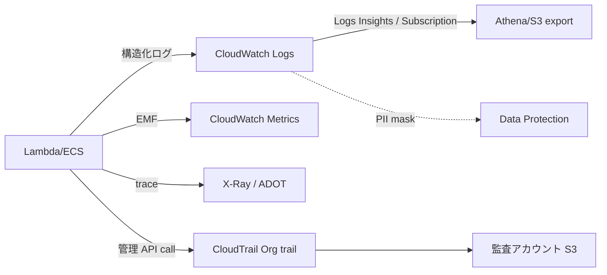

# §FR-API-8 観測性（ログ・トレース・メトリクス）

> 親 SSOT: [../00-index.md](../00-index.md) §FR-API-8
> ヒアリング: [../../hearing-script/08-observability.md](../../hearing-script/08-observability.md)

---

## §8.0 前提と背景

### §8.0.1 用語整理

| 用語 | 定義 |
|---|---|
| **構造化ログ** | JSON など機械可読な形式で出力するログ。CloudWatch Logs Insights / OpenSearch でクエリ可能に |
| **EMF** | CloudWatch Embedded Metric Format。構造化ログからメトリクスを自動生成 |
| **Powertools for AWS Lambda** | AWS 公式の Lambda 用ライブラリ（Logger / Tracer / Metrics）、Python / TypeScript / Java / .NET |
| **ADOT** | AWS Distro for OpenTelemetry。**X-Ray SDK が 2026-02-25 に maintenance mode 入り**、ADOT への移行が事実上必須 |
| **CloudTrail Org trail** | Organizations 横断の管理 API call 監査ログ、監査アカウントの S3 に集約 |

### §8.0.2 なぜここ（§8）で決めるか

要望テーマの「**ログのベストプラクティス**」の中核。観測性は単に運用のためだけでなく、課金按分（§4）・ガードレール準拠監視（§7）・セキュリティ検知（§NFR-4）の根拠データになるため、横断的な標準を本章で定義する。



### §8.0.3 §8.0.A 本標準のスタンス

| 基本方針 | 本章での具体化 |
|---|---|
| 絶対安全 | PII を含むログは **Data Protection Policy で自動マスキング**、保存期間明示、Log Group は KMS CMK 暗号化 |
| どんなアプリでも | Lambda は Powertools / ECS は OpenTelemetry SDK でフォーマット統一、access log の必須フィールド統一 |
| 効率よく | CloudWatch / X-Ray のマネージドを優先、独自集計基盤は作らない |
| 運用負荷・コスト最小 | Log Group の **Retention 必須化**（既定 infinite は事故の元）、サンプリングで高ボリュームのコスト抑制 |

### §8.0.4 本章で扱うサブセクション

| § | サブセクション | 主題 |
|---|---|---|
| §8.1 | アプリケーションログ | 構造化ログ・必須フィールド・PII マスキング |
| §8.2 | トレース | ADOT 移行・X-Ray 互換・サンプリング |
| §8.3 | メトリクス・アラート | EMF・CloudWatch Alarms・SLO |
| §8.4 | 監査ログ（CloudTrail） | 管理 API call の集約と保管 |

---

## §8.1 アプリケーションログ

**このサブセクションで定めること**：API 呼び出しごとのログの構造・必須フィールド・保管。
**主な判断軸**：機械可読性、PII 除外、課金按分のデータソース。
**§8 全体との関係**：本サブセクションが観測性のベース。

### §8.1.1 ベースライン

#### API Gateway access log（必須フィールド）

JSON フォーマットで以下を出力（マネージド変数を使用）：

```json
{
  "requestId": "$context.requestId",
  "requestTime": "$context.requestTime",
  "httpMethod": "$context.httpMethod",
  "path": "$context.path",
  "status": "$context.status",
  "latency": "$context.responseLatency",
  "responseLength": "$context.responseLength",
  "userArn": "$context.identity.userArn",
  "apiKey": "$context.identity.apiKeyMasked",
  "xrayTraceId": "$context.xrayTraceId",
  "wafResponseCode": "$context.waf.action"
}
```

**Authorization ヘッダ・クエリ文字列の機密値は絶対に出さない**。

#### アプリケーションログ

- Lambda：**Powertools Logger** を必須化（JSON、相関 ID 自動、サンプリング）
- ECS：**OpenTelemetry SDK** で構造化ログ、Fluent Bit / awsfirelens で CloudWatch / S3 / OpenSearch にルーティング
- 共通：`requestId`, `traceId`, `tenant_id`, `userId`（マスク済）, `level`, `message`, `error.kind`, `error.stack`

#### Log Group 標準

| 項目 | 標準 |
|---|---|
| **Retention** | 30d / 90d / 1y / 7y のいずれか。**default の "Never expire" は禁止** |
| **暗号化** | KMS CMK |
| **PII マスキング** | **CloudWatch Logs Data Protection Policy** で managed identifier（クレカ、SSN、AWS access key）マスク GA |
| **長期保管** | S3 export + Glacier / Object Lock（WORM）、Athena でクエリ |

### §8.1.2 TBD / 要確認

- Q: Log Group Retention の **業務カテゴリ別マッピング**（一般 30d / 監査 7y 等）→ `API-C-811`
- Q: Data Protection Policy の **追加カスタムパターン**（社内固有の機密パターン）→ `API-C-812`
- Q: 高ボリューム API（ヘルスチェック等）の **サンプリング率** → `API-C-813`

---

## §8.2 トレース

**このサブセクションで定めること**：分散トレースの標準（**ADOT への移行を踏まえて**）。
**主な判断軸**：標準（OpenTelemetry）準拠、マネージド可視化（X-Ray コンソール）の継続利用。
**§8 全体との関係**：ログ・メトリクスと相互参照（trace ID）。

### §8.2.1 ベースライン

- **AWS X-Ray SDK は 2026-02-25 maintenance mode 入り** → **新規プロジェクトは ADOT (OpenTelemetry) を採用**
- **既存 X-Ray SDK プロジェクト**：当面継続利用可、計画的に ADOT 移行
- **X-Ray コンソール体験は ADOT 採用後も継続可能**（exporter で X-Ray バックエンドに送信）
- **Lambda**：ADOT Lambda Layer で zero-code instrumentation、Powertools Tracer と併用可
- **ECS**：ADOT Collector をサイドカー or DaemonSet
- **サンプリング**：X-Ray sampling rules（既定 1 req/sec + 5%）、コスト最適化のため要件別に調整

### §8.2.2 TBD / 要確認

- Q: **新規プロジェクトの ADOT 採用を必須化するか** → `API-C-821`
- Q: 既存 X-Ray SDK プロジェクトの **ADOT 移行スケジュール** → `API-C-822`
- Q: サンプリング率の **業務別デフォルト**（決済 100% / 一般 5%）→ `API-C-823`

---

## §8.3 メトリクス・アラート

**このサブセクションで定めること**：API 健全性のメトリクス・しきい値・アラート。
**主な判断軸**：SLO（Service Level Objective）連動、誤検知抑制。
**§8 全体との関係**：§NFR-1 可用性 / §NFR-2 性能 の達成可否判定の根拠。

### §8.3.1 ベースライン（標準メトリクス）

| メトリクス | 出力元 | アラートしきい値（暫定） |
|---|---|---|
| `Count` / RPS | API Gateway / ALB | 急増・急減（前週比 ±30%） |
| `4XXError` / `5XXError` | API Gateway / ALB | 5XX > 1% / 5min |
| `Latency p99` | API Gateway / ALB / X-Ray | API ごと SLO に基づき設定 |
| `Throttles` / `Errors` | Lambda | Errors > 1% / 5min |
| `ConcurrentExecutions` | Lambda | 80% / Reserved or Account limit |
| `CPUUtilization` / `MemoryUtilization` | ECS | 80% / 5min |
| WAF `BlockedRequests` | WAF | 急増（前週比 +500%） |
| `429 (RateLimited)` | API Gateway | 5% / 5min |

- **EMF**（Embedded Metric Format）でテナント別等のカスタム次元
- **CloudWatch Alarms** + SNS → PagerDuty / Slack 等の通知先
- **Synthetics Canary** で外形監視（必要時）

### §8.3.2 TBD / 要確認

- Q: SLO の **デフォルトテンプレ**（可用性 99.5% / レイテンシ p99 500ms 等）→ `API-C-831`
- Q: アラート通知先・エスカレーションルール → `API-C-832`
- Q: Synthetics の **必須化範囲**（重要 Public API のみ等）→ `API-C-833`

---

## §8.4 監査ログ（CloudTrail）

**このサブセクションで定めること**：管理 API call の記録と長期保管。
**主な判断軸**：監査要件、規制対応、改ざん防止。
**§8 全体との関係**：§NFR-7 コンプラとの接点。

### §8.4.1 ベースライン

- **Organization trail**：Org 管理アカウントから設定、全アカウントの管理 call を監査アカウントの S3 に集約
- **保管期間**：標準 7 年（コンプラ要件に従う）、Object Lock で WORM
- **S3 暗号化**：CMK
- **CloudTrail Lake**（リレーショナルクエリ）か **Athena**（S3 export）で検索
- **Data Events**（S3 object-level / Lambda Invoke）は別料金、**重要バケット・重要関数のみ有効化**
- **アプリログと監査ログを混ぜない**（CloudTrail は管理 API call、CloudWatch Logs はアプリ）

### §8.4.2 TBD / 要確認

- Q: Data Events の **対象範囲**（重要 S3 bucket / Lambda Invoke の選定）→ `API-D-841`
- Q: 保管期間 **7 年でよいか**（業界別規制で延長要否）→ `API-D-842`

---

## §8.A SSR モノリスでの留意点

[§C-API-2 §C-2.1](../common/02-runtime-selection-criteria.md) のパターン C（SSR モノリス）では、観測性スタックが Lambda 系と異なる：

| 観点 | Lambda 系 | SSR モノリス（ECS）|
|---|---|---|
| **構造化ログ** | Powertools for AWS Lambda（Python / TypeScript / Java / .NET）| **OTel / Pino / Bunyan / Logback / Logrus 等の言語別 SDK** |
| **ログ送信** | Lambda CloudWatch 直接出力 | **Fluent Bit / Firelens サイドカー** で CloudWatch Logs / S3 / OpenSearch ルーティング |
| **トレース** | ADOT Lambda Layer + auto-instrumentation | **ADOT Collector サイドカー + OpenTelemetry SDK**（言語別） |
| **メトリクス** | EMF（Powertools Metrics）| OpenTelemetry Metrics SDK + ADOT Collector |
| **アプリ内 instrumentation** | Powertools が標準ライブラリ統合（boto3 等）| 言語別に **OpenTelemetry SDK の auto-instrumentation** を使う |
| access log | API Gateway access log | **ALB access log（S3 出力）** + アプリ内 request log |

**モノリス採用時の観測性スタック（推奨）**：
1. **アプリ内 OpenTelemetry SDK**（auto-instrumentation 推奨）
   - Node.js / Python / Ruby / Java / Go の言語別 OTel SDK
2. **ADOT Collector サイドカー**（同一 task definition 内）
   - アプリから OTLP 受信 → CloudWatch / X-Ray / Prometheus へエクスポート
3. **Fluent Bit サイドカー**（Firelens）でログルーティング
4. **ALB access log** を S3 に出力（Athena でクエリ）
5. **アプリ内 middleware で `tenant_id` / `request_id` を構造化ログに埋め込み**

**留意点**：
- Powertools for AWS Lambda は **Lambda 専用**、ECS には適用不可
- OpenTelemetry SDK のバージョンと言語別の成熟度を要確認（Node / Python / Java は成熟、Ruby はやや遅れ）
- ADOT Collector サイドカーのメモリ消費を **task definition のリソース上限に織り込む**

詳細は [§FR-API-6 §6.1.A モノリス vs マイクロサービス](06-container-standard.md) 参照。

---

## §8.x 関連ドキュメント

- [§FR-API-4 課金](04-metering-billing.md) — access log を課金按分のデータソースとして利用
- [§FR-API-6 §6.1.A モノリス vs マイクロサービス](06-container-standard.md) — モノリスでの観測性
- [§NFR-API-4 セキュリティ](../nfr/04-security.md) — 暗号化・PII マスク
- [§NFR-API-6 運用](../nfr/06-operations.md) — 監視・アラート要件
- [§NFR-API-7 コンプラ](../nfr/07-compliance.md) — 監査ログ保管期間
