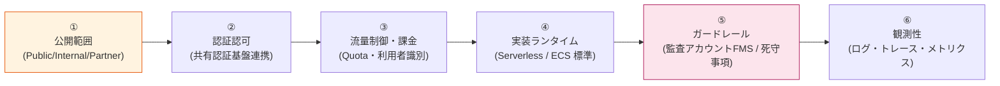
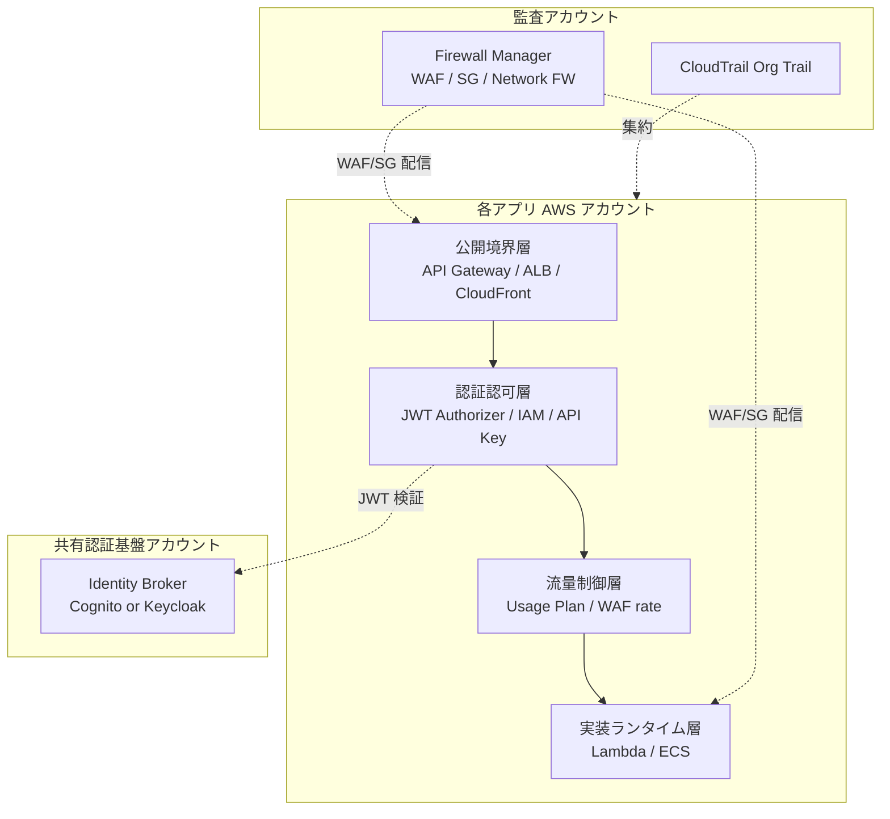
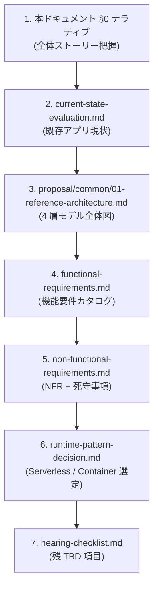
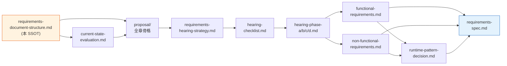

# API プラットフォーム標準 要件定義 構成案（SSOT）

> 目的: 各アプリの AWS アカウントに適用する **API プラットフォーム標準** の要件定義フェーズで作成すべきドキュメント体系・作成順序・**語る順序（ナラティブ）**・状態の単一情報源
> 位置付け: 本ドキュメントは API プラットフォーム標準 要件定義の **SSOT (Single Source of Truth)**。共有認証基盤の SSOT（[../requirements/requirements-document-structure.md](../requirements/requirements-document-structure.md)）とは独立した別ドメイン。

---

## 0. 要件定義の語る順序（ナラティブ）

### 0.1 本標準の基本方針（全要件のトーン判断基準）

本標準は **「絶対安全に、どんなアプリでも、効率よく API を提供でき、運用負荷やコストがかからない」共通の API プラットフォーム標準** を目指す。すべての要件は次の 4 軸で評価する：

| 基本方針の柱 | 解釈 |
|---|---|
| **絶対安全** | WAF / 認証必須 / 暗号化必須 / 最小権限 / シークレット管理（AWS WAF Managed Rules・OWASP Top 10・Well-Architected Security Pillar 準拠） |
| **どんなアプリでも** | Serverless（API Gateway + Lambda）／コンテナ（ECS）の **2 系統標準** をカタログとして提供。新規アプリは原則どちらかに収まる |
| **効率よく** | 標準テンプレ・Service Catalog・IaC モジュール・Landing Zone で **アプリ開発者がガードレール内で self-service** |
| **運用負荷・コスト最小** | マネージドサービス優先、監査アカウントから **Firewall Manager / Config Rules** で横断ガードレール配信、**Cost allocation tag** で利用者按分 |

すべての要件は **AWS マルチアカウント前提**で、各アプリアカウントが本標準を適用する。proposal/ 配下の各ファイル / functional-requirements.md / non-functional-requirements.md の各セクションは、この 4 軸に対する立場を明示すること。

### 0.2 要件定義の 6 ステップ（語る順序）

API プラットフォーム要件定義書および対関係者説明資料は、以下の 6 ステップで論理を組み立てる。**「公開境界 → 認証認可 → 流量制御 → 実装ランタイム → ガードレール → 観測性」** が本フェーズの中核ストーリー。



**認証基盤の SSOT との対比**：認証側は ④「Cognito vs Keycloak の単一選定」が中核だが、API 側は **2 系統並行カタログ**（Serverless / ECS）と **ガードレール配信**（FMS）が中核。`プラットフォーム選定` 章は存在せず、代わりに `実装パターン選定基準` を common 章に置く。

### 0.3 各ステップで答える問い

| Step | 答える問い | 一次ソース（予定） | 補強ドキュメント |
|:---:|---|---|---|
| ① | **どんな公開境界の API を扱うか？**（Public / Internal / Partner / Private、判定フロー） | `functional-requirements.md §FR-API-1 公開境界` | API Gateway endpoint type / CloudFront / PrivateLink パターン |
| ② | **誰がその API を呼ぶか？どう認証認可するか？**（共有認証基盤との接続点） | `functional-requirements.md §FR-API-2 認証認可` | [../requirements/](../requirements/00-index.md) 共有認証基盤の連携面 |
| ③ | **どれだけ使えるか？誰がどれだけ使ったか？**（throttle / quota / 利用者識別 / 課金按分） | `functional-requirements.md §FR-API-3 流量制御 / §FR-API-4 課金管理` | Usage Plan・WAF rate-based・Cost allocation tag・CUR |
| ④ | **どう実装するか？**（Serverless / ECS の 2 系統標準、選定基準） | `functional-requirements.md §FR-API-5 Serverless / §FR-API-6 Container` | Well-Architected Serverless Lens / ECS Best Practices |
| ⑤ | **何を全 API で必ず守らせるか？**（監査アカウント FMS 配信ルール、セキュリティ死守事項） | `functional-requirements.md §FR-API-7 ガードレール`、`non-functional-requirements.md §NFR-API-4 セキュリティ` | AWS Firewall Manager / Control Tower / SCP |
| ⑥ | **どう運用観測するか？**（構造化ログ・X-Ray/ADOT・メトリクス・CloudTrail） | `functional-requirements.md §FR-API-8 観測性`、`non-functional-requirements.md §NFR-API-6 運用` | Powertools / ADOT / CloudWatch Logs Data Protection |

### 0.4 ステップ ④（実装ランタイム）の論理構造

API 側の ④ は認証側のような「単一プラットフォーム選定」ではなく、**「2 系統並行カタログ + 選定基準」**：

| 観点 | Serverless（API GW + Lambda） | Container（ECS Fargate） |
|---|---|---|
| 想定ワークロード | 短時間処理 / イベント駆動 / 不定期トラフィック | 長時間処理 / 常時稼働 / 既存資産活用 |
| コストモデル | リクエスト課金（変動費中心） | 時間課金（固定費中心） |
| デプロイ単位 | Function / Stage | Service / Task Definition |
| 公開境界 | API Gateway（HTTP/REST）/ Function URL | ALB / NLB / API Gateway VPC Link |
| 主な落とし穴 | Cold start、Usage Plan は REST のみ、in-VPC のコスト | サイドカー OOM、Task Role 設計、AZ rebalancing |

→ 「どちらを選ぶか」ではなく「**両方の標準テンプレを揃えた上で、選定基準を明文化**」が要件定義の役割。選定基準は common 章で扱う。

### 0.5 4 層モデル × 共有認証基盤との境界



各層がそれぞれ FR/NFR のどこに対応するかは §1 / §4 で示す。

---

## 1. ドキュメント体系の全体像

```
doc/api-platform/
├── 00-index.md                           ← 本フォルダのインデックス
├── requirements-document-structure.md    ← 本 SSOT
│
├── [顧客向け／関係者向け 要件提示・社内総括]
│   ├── proposal/                         ← 提示版（fr/ nfr/ common/ にサブフォルダ化）
│   │   ├── 00-index.md                   ← proposal SSOT（基本方針・6 ステップ・章ナビ）
│   │   ├── fr/                           ← 機能要件 §FR-API-1 〜 §FR-API-8
│   │   │   ├── 00-index.md
│   │   │   ├── 01-exposure-boundary.md   ← §FR-API-1 公開境界（Public/Internal/Partner）
│   │   │   ├── 02-authn-authz.md         ← §FR-API-2 認証認可（共有認証基盤連携 + API Key/mTLS/IAM）
│   │   │   ├── 03-throttling-quota.md    ← §FR-API-3 流量制御・クォータ
│   │   │   ├── 04-metering-billing.md    ← §FR-API-4 利用者識別・課金按分
│   │   │   ├── 05-serverless-standard.md ← §FR-API-5 標準アーキ：Serverless
│   │   │   ├── 06-container-standard.md  ← §FR-API-6 標準アーキ：Container（ECS）
│   │   │   ├── 07-guardrails.md          ← §FR-API-7 ガードレール（監査アカウント FMS 連携）
│   │   │   └── 08-observability.md       ← §FR-API-8 観測性（ログ・トレース・メトリクス）
│   │   ├── nfr/                          ← 非機能要件 §NFR-API-1 〜 §NFR-API-9（IPA グレード対応）
│   │   │   ├── 00-index.md               ← NFR 索引 + IPA 6 大項目マッピング
│   │   │   ├── 01-availability.md        ← §NFR-API-1 可用性 (IPA A.)
│   │   │   ├── 02-performance.md         ← §NFR-API-2 性能 (IPA B.)
│   │   │   ├── 03-scalability.md         ← §NFR-API-3 拡張性 (IPA B.)
│   │   │   ├── 04-security.md            ← §NFR-API-4 セキュリティ（死守事項）(IPA E.)
│   │   │   ├── 05-dr.md                  ← §NFR-API-5 DR (IPA A. 災害対策)
│   │   │   ├── 06-operations.md          ← §NFR-API-6 運用 (IPA C.)
│   │   │   ├── 07-compliance.md          ← §NFR-API-7 コンプラ (IPA E + C)
│   │   │   ├── 08-cost.md                ← §NFR-API-8 コスト・課金可視化
│   │   │   └── 09-compatibility.md       ← §NFR-API-9 互換性・移行性・バージョニング (IPA D.)
│   │   └── common/                       ← 横断章 §C-API-1 〜 §C-API-5
│   │       ├── 00-index.md
│   │       ├── 01-reference-architecture.md  ← §C-API-1 全体参照アーキ（Serverless / Container 並列）
│   │       ├── 02-runtime-selection-criteria.md ← §C-API-2 実装ランタイム選定基準
│   │       ├── 03-shared-auth-boundary.md ← §C-API-3 共有認証基盤との接続点
│   │       ├── 04-audit-governance.md    ← §C-API-4 監査アカウントとのガバナンス境界
│   │       └── 05-self-service-catalog.md ← §C-API-5 標準提供物（Service Catalog / IaC モジュール）
│   └── current-state-evaluation.md       ← 社内向け：既存アプリの現状評価・標準化対象スコーピング
│
├── [ヒアリング]
│   ├── requirements-hearing-strategy.md  ← ヒアリング戦略
│   ├── hearing-checklist.md              ← ヒアリング項目 単一一覧
│   ├── hearing-phase-a.md                ← Phase A: 既存アプリ現状ヒアリング
│   ├── hearing-phase-b.md                ← Phase B: 公開・認証・流量要件
│   ├── hearing-phase-c.md                ← Phase C: 実装ランタイム・運用要件
│   └── hearing-phase-d.md                ← Phase D: ガードレール・コスト確認
│
├── [要件定義書]
│   ├── requirements-spec.md              ← API プラットフォーム標準 要件定義書（本体）
│   ├── functional-requirements.md        ← 機能要件一覧
│   ├── non-functional-requirements.md    ← 非機能要件一覧
│   └── runtime-pattern-decision.md       ← Serverless / Container 選定基準書
│
└── [付録]
    ├── reference-implementations.md      ← 参考実装（IaC スニペット・サンプル構成）
    ├── migration-playbook.md             ← 既存アプリの標準化適用手順
    └── cost-baseline.md                  ← コストベースラインと利用者按分の標準
```

---

## 2. 各ドキュメントの概要と作成順序

### Phase 1: 骨子・SSOT（Week 1 前半）

| # | ドキュメント | 目的 | 状態 |
|---|------------|------|------|
| 1 | **requirements-document-structure.md（本書）** | SSOT。ナラティブ・章構成・依存関係 | 🚧 ドラフト初版（本書） |
| 2 | current-state-evaluation.md | 既存アプリの現状評価・標準化対象のスコーピング | 📋 未着手 |

### Phase 2: 提示版（proposal/）骨格作成（Week 1 後半 〜 Week 2）

| # | ドキュメント | 目的 | 状態 |
|---|------------|------|------|
| 3 | proposal/00-index.md | proposal SSOT（基本方針・6 ステップ・章ナビ） | 📋 未着手 |
| 4 | proposal/fr/ 各章（§FR-API-1〜§FR-API-8） | 機能要件ベースライン提示 + TBD | 📋 未着手 |
| 5 | proposal/nfr/ 各章（§NFR-API-1〜§NFR-API-9） | 非機能要件ベースライン提示 + IPA マッピング | 📋 未着手 |
| 6 | proposal/common/ 各章（§C-API-1〜§C-API-5） | 横断章（参照アーキ・選定基準・ガバナンス境界） | 📋 未着手 |

### Phase 3: ヒアリング実施（Week 2-4）

| # | ドキュメント | 目的 | 作成タイミング |
|---|------------|------|-------------|
| 7 | requirements-hearing-strategy.md | ヒアリング計画 | Phase 2 と並行 |
| 8 | hearing-checklist.md | 単一一覧 | Phase 2 確定後 |
| 9 | hearing-phase-a.md | 既存アプリ現状の確認結果 | Week 2 |
| 10 | hearing-phase-b.md | 公開・認証・流量の確認結果 | Week 3 |
| 11 | hearing-phase-c.md | 実装・運用の確認結果 | Week 3-4 |
| 12 | hearing-phase-d.md | ガードレール・コスト確認結果 | Week 4 |

### Phase 4: 要件定義書作成（Week 4-5）

| # | ドキュメント | 目的 | 作成タイミング |
|---|------------|------|-------------|
| 13 | requirements-spec.md | 要件定義書（本体） | ヒアリング完了後 |
| 14 | functional-requirements.md | 機能要件詳細（~60-80 件） | 13 と並行 |
| 15 | non-functional-requirements.md | 非機能要件詳細（~50-70 件） | 13 と並行 |
| 16 | runtime-pattern-decision.md | Serverless / Container 選定基準書 | 要件確定後 |

### Phase 5: 付録・補足資料（Week 5-6）

| # | ドキュメント | 目的 | 作成タイミング |
|---|------------|------|-------------|
| 17 | reference-implementations.md | 参考実装・IaC モジュール一覧 | 要件確定後 |
| 18 | migration-playbook.md | 既存アプリの標準化適用手順 | 要件確定後 |
| 19 | cost-baseline.md | コストベースラインと按分の標準 | プラットフォーム確定後 |

---

## 3. 要件定義書（requirements-spec.md）の構成案

API プラットフォーム標準の中核ドキュメント。ヒアリング結果を統合して作成する。

```markdown
# API プラットフォーム標準 要件定義書

## 1. はじめに
  1.1 文書の目的
  1.2 対象範囲（適用対象アプリの範囲・除外対象）
  1.3 用語定義
  1.4 関連ドキュメント（共有認証基盤 / Landing Zone / Control Tower）

## 2. ビジネス要件
  2.1 標準化の背景と目的
  2.2 対象アプリケーション一覧と現状
  2.3 ステークホルダー（アプリ開発チーム / Platform / 監査 / SecOps）
  2.4 制約（既存資産・運用体制・移行コスト）

## 3. システム概要
  3.1 4 層モデル（公開境界 / 認証認可 / 流量 / 実装）+ 横串
  3.2 共有認証基盤との接続点
  3.3 監査アカウント（FMS / CloudTrail / Config）との境界
  3.4 責任分界点（Platform / Application / Audit）

## 4. 機能要件（→ functional-requirements.md で詳細化）
  4.1 §FR-API-1 公開境界（Public / Internal / Partner / Private 区分と判定）
  4.2 §FR-API-2 認証認可（共有認証基盤連携 / API Key / mTLS / IAM auth）
  4.3 §FR-API-3 流量制御・クォータ（rate / burst / quota の標準値）
  4.4 §FR-API-4 利用者識別・課金按分（API Key 体系 / cost allocation tag）
  4.5 §FR-API-5 標準アーキテクチャ：Serverless
  4.6 §FR-API-6 標準アーキテクチャ：Container（ECS）
  4.7 §FR-API-7 ガードレール（監査アカウント FMS 配信ルール / Service Catalog）
  4.8 §FR-API-8 観測性（ログ / トレース / メトリクス / アラート）

## 5. 非機能要件（→ non-functional-requirements.md で詳細化）
  5.1 可用性（マルチ AZ / マネージドサービス SLA / 障害分離）
  5.2 性能（応答時間 / スループット / Cold start）
  5.3 拡張性（同時実行 / Throttle limit / アカウント上限）
  5.4 セキュリティ（WAF / 暗号化 / シークレット / 死守事項）
  5.5 DR / BCP（マルチリージョン / バックアップ）
  5.6 運用性（監視 / アラート / デプロイ / パッチ）
  5.7 コンプライアンス（PII 取扱 / 監査ログ保管 / 規制対応）
  5.8 コスト（按分可視化 / 予算アラート）
  5.9 互換性・移行性（バージョニング / 後方互換 / 既存資産移行）

## 6. 外部インターフェース
  6.1 共有認証基盤との接続インターフェース（JWT / Discovery）
  6.2 監査アカウントとの連携（FMS / Config Rules / CloudTrail）
  6.3 利用者向け API（API カタログ / OpenAPI 公開）
  6.4 開発者ポータル・Service Catalog（self-service）

## 7. データ要件
  7.1 ログデータ（保存先・保管期間・暗号化）
  7.2 メトリクス・トレースデータ
  7.3 課金・使用量データ（CUR / cost allocation tag）
  7.4 シークレット・証明書（Secrets Manager / ACM）
  7.5 データフロー図

## 8. 制約事項
  8.1 技術的制約（AWS リージョン / マネージドサービス制約 / Quota）
  8.2 法的制約（個人情報保護法 / 業界規制）
  8.3 組織的制約（運用体制 / 既存アプリの状態）

## 9. 前提条件
  9.1 Landing Zone（Control Tower / LZA）の存在前提
  9.2 共有認証基盤の利用前提
  9.3 監査アカウントの存在前提

## 10. リスクと対策
  10.1 技術リスク（HTTP API の Usage Plan 非対応・X-Ray maintenance mode 等）
  10.2 運用リスク（FMS WCU 上限・Bot Control コスト・ログ容量）
  10.3 ビジネスリスク（既存アプリの非準拠化）

## 11. 実装ランタイム選定基準（→ runtime-pattern-decision.md で詳細化）
  11.1 評価軸（コスト / 運用 / レイテンシ / 既存資産 / チームスキル）
  11.2 Serverless / Container 選定フロー
  11.3 ハイブリッド構成の判断基準

## 12. ロードマップ
  12.1 標準確定 → 既存アプリ移行のマイルストーン
  12.2 標準のバージョン管理・改廃プロセス
  12.3 例外運用（標準外を許容するケース）
```

---

## 4. 機能要件一覧（functional-requirements.md）の構成案

機能要件の **実体（ID 一覧・優先度・対応状況）は functional-requirements.md を一次ソース**とする。本セクションでは構成原則のみを示す。

### 4.1 カテゴリ体系（FR-API）

| § | カテゴリ | 接頭辞 | 想定サブセクション |
|---|---|---|---|
| 1 | 公開境界 | `FR-API-EXP-*` | §1.1 区分定義 / §1.2 判定フロー / §1.3 ネットワーク構成 |
| 2 | 認証認可 | `FR-API-AUTH-*` | §2.1 共有認証基盤連携 / §2.2 API Key・mTLS / §2.3 IAM auth / §2.4 Authorizer 選定 |
| 3 | 流量制御 | `FR-API-RATE-*` | §3.1 throttle / §3.2 quota / §3.3 burst / §3.4 超過時挙動 |
| 4 | 利用者識別・課金 | `FR-API-MTR-*` | §4.1 識別子体系 / §4.2 計測 / §4.3 cost allocation / §4.4 按分・請求 |
| 5 | Serverless 標準 | `FR-API-SLS-*` | §5.1 API Gateway / §5.2 Lambda / §5.3 イベント駆動 / §5.4 DB アクセス |
| 6 | Container 標準 | `FR-API-CNT-*` | §6.1 ECS / §6.2 ALB/NLB / §6.3 Service Connect・Lattice / §6.4 デプロイ |
| 7 | ガードレール | `FR-API-GRD-*` | §7.1 FMS 配信 / §7.2 SCP・Config Rules / §7.3 Service Catalog / §7.4 例外プロセス |
| 8 | 観測性 | `FR-API-OBS-*` | §8.1 ログ / §8.2 トレース / §8.3 メトリクス・アラート / §8.4 監査ログ |

### 4.2 表項目の必須カラム

functional-requirements.md の各表は以下のカラムを必ず持つ:

| カラム | 用途 |
|---|---|
| ID | `FR-API-{CAT}-NNN` |
| 要件 | 短い記述 |
| 優先度 | Must / Should / Could / Won't / TBD |
| Serverless 列 | ✅ / ⚠ / ❌ + 実現方法の手がかり |
| Container 列 | 同上 |
| 監査アカウント関与 | あり / なし / 一部 |
| 状態 | ✅ 確定 / 🟡 デフォルト / 🔴 TBD |

---

## 5. 非機能要件一覧（non-functional-requirements.md）の構成案

非機能要件の **実体は non-functional-requirements.md を一次ソース**とする。

### 5.1 カテゴリ体系（NFR-API）

| § | カテゴリ | 接頭辞 | 想定サブセクション |
|---|---|---|---|
| 1 | 可用性 | `NFR-API-AVL-*` | （フラット） |
| 2 | 性能 | `NFR-API-PERF-*` | §2.1 応答時間 / §2.2 スループット / §2.3 Cold start |
| 3 | 拡張性 | `NFR-API-SCL-*` | （フラット） |
| 4 | セキュリティ | `NFR-API-SEC-*` | §4.1 通信暗号化 / §4.2 シークレット / §4.3 WAF / §4.4 死守事項 |
| 5 | DR / BCP | `NFR-API-DR-*` | （フラット） |
| 6 | 運用 | `NFR-API-OPS-*` | §6.1 監視・アラート / §6.2 デプロイ・パッチ / §6.3 体制 SLA |
| 7 | コンプライアンス | `NFR-API-COMP-*` | §7.1 PII・規制 / §7.2 監査ログ保管 / §7.3 業界認定 |
| 8 | コスト | `NFR-API-COST-*` | §8.1 按分可視化 / §8.2 予算アラート / §8.3 標準ベースライン |
| 9 | 互換性・移行性 | `NFR-API-COMPAT-*` | §9.1 バージョニング / §9.2 後方互換 / §9.3 既存資産移行 |

### 5.2 表項目の必須カラム

| カラム | 用途 |
|---|---|
| ID | `NFR-API-{CAT}-NNN` |
| 要件 | 短い記述 |
| 目標値 | 数値 or 定性記述（TBD 可） |
| Serverless での実現方法 | |
| Container での実現方法 | |
| 計測手段 | CloudWatch / X-Ray / CUR 等 |
| 状態 | ✅ / 🟡 / 🔴 |

---

## 6. 実装ランタイム選定基準書（runtime-pattern-decision.md）の構成案

```markdown
# 実装ランタイム選定基準書

## 1. 評価軸

| # | 評価軸 | 重み | 説明 |
|---|---------|------|------|
| 1 | リクエスト特性 | 高 | 不定期 / 常時、長時間 / 短時間 |
| 2 | コストモデル適合性 | 高 | 変動費前提 / 固定費前提 |
| 3 | チームスキル | 高 | Lambda 経験 / コンテナ経験 |
| 4 | 既存資産 | 中 | 既存コードベースの移植性 |
| 5 | レイテンシ要件 | 中 | Cold start 許容可否 |
| 6 | 統合要件 | 中 | VPC アクセス / 既存 NW |
| 7 | コンプライアンス | 低 | データ所在・専有要件 |
| 8 | 運用性 | 中 | パッチ・ベンダー依存 |

## 2. 選定フロー（決定木）

(mermaid 図：質問に答えていくと Serverless / Container / ハイブリッドのいずれかに至る)

## 3. ハイブリッド構成の判断基準

## 4. 例外承認プロセス（標準外パターン採用時）

## 5. 改廃プロセス（標準パターンの追加・廃止）
```

---

## 7. 作成スケジュール（暫定）

```
Week 0 (2026-05-21):
  ✅ 00-index.md（フォルダ立ち上げ）
  ✅ requirements-document-structure.md（本書、SSOT 初版）

Week 0-1 (2026-05-22):
  ✅ proposal/00-index.md（proposal SSOT）
  ✅ proposal/fr/ 全章 骨格（§FR-API-1〜8）
  ✅ proposal/nfr/ 全章 骨格 + IPA マッピング（§NFR-API-1〜9）
  ✅ proposal/common/ 全章 骨格（§C-API-1〜5）
  ✅ hearing-checklist.md 初版（135 項目）
  ✅ hearing-script/ 初版（11 ファイル）
  📋 current-state-evaluation.md（既存アプリ現状評価）
  📋 requirements-hearing-strategy.md

Week 3:
  📋 hearing-checklist.md
  📋 hearing-phase-a.md（既存アプリ現状ヒアリング）

Week 4:
  📋 hearing-phase-b/c.md（公開・認証・流量・実装・運用）
  📋 requirements-spec.md（ドラフト着手）

Week 5:
  📋 hearing-phase-d.md（ガードレール・コスト）
  📋 functional-requirements.md
  📋 non-functional-requirements.md

Week 6:
  📋 runtime-pattern-decision.md
  📋 requirements-spec.md（確定版）
  📋 付録（reference-implementations / migration-playbook / cost-baseline）
```

---

## 8. ドキュメント間の依存関係と読み順

### 8.1 読み順（新規参画者向け）



### 8.2 書く順序（作成依存関係）



---

## 9. ドキュメント状態ダッシュボード

### 9.1 提示版・社内総括

| ドキュメント | 役割 | 状態 |
|---|---|:---:|
| **[proposal/](proposal/00-index.md)** ⭐ | 関係者向け要件定義 提示版（fr/ §FR-API-1〜8、nfr/ §NFR-API-1〜9、common/ §C-API-1〜5 全 22 章） | 🚧 骨格初版（全章記載） |
| current-state-evaluation.md | 既存アプリ現状評価 | 📋 未着手 |

### 9.2 ヒアリング

| ドキュメント | 役割 | 状態 |
|---|---|:---:|
| [hearing-checklist.md](hearing-checklist.md) | 全項目 単一一覧（135 項目、Phase A〜D） | 🚧 初版 |
| [hearing-script/](hearing-script/README.md) | 関係者送付用 敬体スクリプト（章別 11 ファイル） | 🚧 初版 |
| requirements-hearing-strategy.md | Phase A〜D の進め方 | 📋 未着手 |
| hearing-phase-a.md | 既存アプリ現状 | ⏳ 未実施 |
| hearing-phase-b.md | 公開・認証・流量 | ⏳ 未実施 |
| hearing-phase-c.md | 実装・運用 | ⏳ 未実施 |
| hearing-phase-d.md | ガードレール・コスト | ⏳ 未実施 |

### 9.3 要件定義書

| ドキュメント | 役割 | 状態 |
|---|---|:---:|
| **requirements-document-structure.md（本 SSOT）** | 構成・ナラティブ・状態 | 🚧 ドラフト v0.2（2026-05-22 更新）|
| functional-requirements.md | 機能要件一覧 | 📋 未着手 |
| non-functional-requirements.md | 非機能要件一覧 | 📋 未着手 |
| runtime-pattern-decision.md | Serverless / Container 選定基準 | 📋 未着手 |
| requirements-spec.md | 要件定義書本体 | 📋 未着手 |

### 9.4 付録

| ドキュメント | 役割 | 状態 |
|---|---|:---:|
| reference-implementations.md | 参考実装・IaC モジュール | 📋 未着手 |
| migration-playbook.md | 既存アプリの標準化適用手順 | 📋 未着手 |
| cost-baseline.md | コストベースライン・按分標準 | 📋 未着手 |

### 9.5 状態凡例

| 記号 | 意味 |
|:---:|---|
| ✅ Done | 完成。継続的な微修正のみ |
| 🔄 進行中 | 主要内容は揃っているが更新中 |
| 🚧 ドラフト | 骨格はあるが内容未確定 |
| ⏳ 未実施 | 前提イベント（ヒアリング等）待ち |
| 📋 未着手 | 着手予定 |

---

## 10. ID 体系と改廃ルール

### 10.1 ID 体系

| 種別 | 形式 | 例 | 採番ルール |
|---|---|---|---|
| 機能要件 | `FR-API-{CAT}-NNN` | `FR-API-EXP-002` | カテゴリごとに連番。一度採番した ID は再利用しない |
| 非機能要件 | `NFR-API-{CAT}-NNN` | `NFR-API-SEC-001` | 同上 |
| ヒアリング | `API-{Phase}-NNN` | `API-B-104` | Phase（A/B/C/D）+ 連番 |

### 10.2 ドキュメント追加・廃止時の手順

1. 本 SSOT §9 ダッシュボードに行を追加 / 廃止理由を残す
2. §1 体系図に位置づけを追記
3. §0 ナラティブのどの Step に対応するか明記
4. 他ドキュメントからのリンクが必要なら追記 / 廃止時は grep で更新

---

## 11. 認証基盤の要件定義との関係

API プラットフォーム標準は共有認証基盤（[../requirements/](../requirements/00-index.md)）の **利用側**として位置づけられる。両者の境界：

| 観点 | 共有認証基盤（doc/requirements/） | API プラットフォーム標準（本領域） |
|---|---|---|
| 主成果物 | 認証基盤の機能 / 非機能要件 | 各アプリ AWS アカウントが守るべき標準 |
| 含むもの | OIDC / OAuth フロー、IdP 連携、JWT 発行 | 受け取った JWT の検証方法、認証必須化ルール |
| 含まないもの | API の流量制御、ECS 標準構成、FMS 連携 | JWT の発行・IdP 連携自体 |
| インターフェース | JWKS / Discovery endpoint を提供 | 各アプリが JWKS を消費（Authorizer で検証） |

要件レベルで境界が曖昧になりそうなときは、**「JWT を発行するか／受け取って検証するか」** で切り分ける。

---

## 12. 関連ドキュメント

- [00-index.md](00-index.md): 本フォルダの入口
- [../requirements/requirements-document-structure.md](../requirements/requirements-document-structure.md): 共有認証基盤の SSOT（構造の雛形）
- [../00-index.md](../00-index.md): doc/ 全体の入口

---

## 付録 A: 調査ノート（2026-05-21 時点）— 章立て根拠の根拠

本 SSOT の章立ては以下の AWS 公式・準公式ベストプラクティスを根拠としている。

### A.1 API Gateway / 公開境界
- Endpoint type 3 種（Edge / Regional / Private）の使い分け
- HTTP API vs REST API：HTTP は安価・低レイテンシだが **Usage Plan / API Key / Private endpoint 非対応**
- 2025: HTTP API に AWS WAF サポート追加
- CloudFront + WAF + Regional API Gateway が「perimeter protection」の AWS 推奨形
- PrivateLink / VPC Lattice によるクロスアカウント API

### A.2 認証認可
- Authorizer 4 種：IAM auth / Cognito User Pool (REST) / JWT Authorizer (HTTP) / Lambda Authorizer
- API Key は **識別であって認証ではない**（必ず Authorizer 併用）
- mTLS は API Gateway Custom Domain でサポート（B2B）

### A.3 流量制御・課金
- Usage Plan は REST API 専用、HTTP API は WAF rate-based / Lambda Authorizer + DynamoDB で代替
- Usage Plan の throttle/quota は **best-effort（ハードリミットではない）**
- 2025: アカウントレベル cost allocation tag を Org で配信可能に
- CUR 2.0（FOCUS-aligned）+ Athena/QuickSight が利用者按分の標準パイプライン

### A.4 監査アカウント / FMS
- FMS が配信できる：WAF v2 / Shield Advanced / SG / Network Firewall / Route53 Resolver DNS Firewall
- Multi-admin（最大 10 名）GA、Restricted administrative scope で OU/Account/Policy/Region 単位の管轄絞り
- FMS が配信する Web ACL は **First/Last rule group** として 2 枠を占有 → 各アプリ中央に独自ルール差し込み可
- Bot Control / TGT_ML_* は **プレミアム課金**、URI スコープを絞る

### A.5 Serverless 標準
- API GW + Lambda がデフォルト、Function URL は Webhook / IAM 限定内部用途
- VPC Lattice GA → クロス VPC / Account の service-to-service の標準パスに
- Aurora Serverless v2 min ACU=0（2025）、RDS Proxy との二重コスト注意
- AppSync は GraphQL / subscription / 複数バックエンド集約の選択肢

### A.6 Container 標準（ECS）
- Fargate デフォルト、EC2 は GPU / Spot / 専有が必要なとき
- ECS Service Connect（Envoy ベース）が新規推奨、VPC Lattice はクロス VPC/Account に拡張
- Task Role / Execution Role の最小権限
- 2025.09: ECS AZ rebalancing デフォルト有効化

### A.7 観測性
- 構造化ログ（JSON）+ Powertools for AWS Lambda がデファクト
- **X-Ray SDK が 2026-02-25 maintenance mode 入り → ADOT (OpenTelemetry) 移行が事実上必須**
- CloudWatch Logs Data Protection Policy で PII マスキング GA
- CloudTrail Org trail で監査アカウントに集約

### A.8 横断 / 全体俯瞰
- AWS Well-Architected Framework + Serverless Applications Lens
- AWS Security Reference Architecture (SRA)
- Control Tower controls + Landing Zone Accelerator (LZA)
- Service Catalog で標準スタックを配布

> 主要ソース URL は調査メモ（記載予定）に集約。

---

## 付録 B: 検討事項の抽出方針

> 「本要件定義の検討事項はどのような方針で抽出したか」への対外説明用。
> 第三者（社内レビュアー / 顧客 / 監査）から問われた際、属人判断ではなく **3 つの公的フレームを組み合わせた構造的抽出** であることを根拠付きで示せる。

### B.1 方針（1 文要約）

**「標準化対象の意思決定を AWS 流の 4 層モデル × IPA 非機能グレードで分解し、各単位で『AWS 公式ベースライン』と『組織判断・実測データ・トレードオフの選好』を対で抽出した」**

属人判断ではなく、**3 つの公的フレーム**（AWS 公式ガイダンス / IPA 非機能要求グレード / 認証側で合意済みの要件定義流儀）に乗せて機械的に切り出した、と説明可能な構造。

### B.2 抽出を支える 4 つの軸

#### 軸 1: 章立て構造 — AWS 流 4 層モデル

公開境界 → 認証認可 → 流量制御 → 実装ランタイム + 横串（観測性・ガードレール・コスト）

**根拠ソース**:
- AWS Well-Architected Framework（6 pillars）
- Serverless Applications Lens
- AWS Prescriptive Guidance「Multi-tenant SaaS API access authorization」「Multi-account strategy」
- AWS Security Reference Architecture (SRA)

**効果**: AWS の API 設計議論で**自然に出てくる切り口**であり、独自分類ではない。ユーザー要望の 6 テーマがこの 4 層 + 横串に機械的に **8 章 FR + 9 章 NFR + 5 章 common** へマップされる。

#### 軸 2: 非機能の網羅性 — IPA 非機能要求グレード 2018

A 可用性 / B 性能・拡張性 / C 運用保守 / D 移行性 / E セキュリティ を §NFR-API-1〜9 と 1:1 マッピング。

**根拠ソース**: IPA「非機能要求グレード 2018」（公開ガイドライン）

**効果**: 非機能の網羅性を **公開ガイドラインベースで監査可能**。漏れがないと第三者にも示せる。F（システム環境・エコロジー）はクラウド前提で省略可、コスト・コンプラ・互換性は独立章として補強。

#### 軸 3: 中身の基準 — AWS 公式ベストプラクティス（2024-2026 最新）

各サブセクションの「ベースライン」は AWS 公式の現行推奨に紐づく。代表例：

| 章 | 引用根拠 |
|---|---|
| §FR-API-1 公開境界 | API Gateway endpoint type 3 種、HTTP API vs REST API、CloudFront + WAF Perimeter Protection |
| §FR-API-2 認証認可 | JWT Authorizer (HTTP API)、Cognito Authorizer (REST API)、IAM auth、API Key は識別であって認証ではない（AWS 公式明記）|
| §FR-API-3 流量制御 | Usage Plan の throttle/quota は best-effort、HTTP API は Usage Plan 非対応、**2025: HTTP API への AWS WAF サポート追加** |
| §FR-API-4 課金按分 | **2025: アカウントレベル cost allocation tag を Org で配信可能**、CUR 2.0 FOCUS-aligned |
| §FR-API-5 Serverless | Powertools for AWS Lambda（公式ライブラリ）、Aurora Serverless v2 min ACU=0（2025）、Lambda SnapStart |
| §FR-API-6 Container | Fargate デフォルト、ECS Service Connect、**2025.09: AZ rebalancing デフォルト有効化** |
| §FR-API-7 ガードレール | FMS Multi-admin GA、Restricted scope、First/Last rule group |
| §FR-API-8 観測性 | **X-Ray SDK が 2026-02-25 maintenance mode → ADOT (OpenTelemetry) 移行が事実上必須**、CloudWatch Logs Data Protection Policy GA |

**効果**: 「**勝手な独自基準ではなく、AWS 公式が推奨する現行ベースライン**」と説明可能。再現確認可能。

#### 軸 4: ヒアリング項目化 — 3 カテゴリの判断必要箇所

各章で「ベースライン」と対で、以下 3 つを TBD として抽出：

| カテゴリ | 例 | 主な優先度 |
|---|---|:---:|
| **組織判断**（承認権限・予算・体制） | 公開境界昇格の承認者、SecOps と Platform の境界、必須タグ CostCenter 粒度 | 🔥 |
| **実測データ・現状情報** | 既存アプリのトラフィック、Lambda/Container 分布、AWS アカウント体系 | 🟡 |
| **トレードオフの選好** | Bot Control のコスト vs 防御、CloudFront 全面適用要否、arm64 移行範囲 | 🟡 / 🟢 |

**効果**: 各 TBD は「**この情報が決まらないと本標準のどの章を確定できないか**」を hearing-script の「目的」欄で明示。属人ヒアリングではなく **設計判断と紐づいた質問**になっている。

### B.3 優先度（🔥/🟡/🟢）のつけ方

| 優先度 | 基準 | 件数 |
|:---:|---|---:|
| 🔥 最優先 | 他の章の前提になる項目（公開境界デフォルト、ランタイム選定方針、共有認証基盤との境界、必須タグ、Service Catalog 初期ラインナップ 等）+ 中核ストーリーに直結 | 25 |
| 🟡 重要 | 個別設計に影響、組織判断や実測データが必要 | ~70 |
| 🟢 通常 | 細部のチューニング、運用最適化 | ~40 |
| **合計** | | **135** |

**Stage 1**: 🔥 25 項目を先行確認すれば、Service Catalog 製品の設計に着手可能な状態が作れる Path 設計。

### B.4 結果として担保される性質

| 性質 | 担保のされ方 |
|---|---|
| **網羅性** | 4 層 × IPA 6 大項目で漏れを公開ガイドラインベースで監査可能 |
| **再現性** | AWS 公式を基準にしているので、別チームが同じ方針でやり直しても同じ章立て・項目に到達する |
| **対外説明性** | 「独自判断ではなく公的根拠に基づく」と即答可能 |
| **収束性** | 🔥 25 項目で中核判断確定 → Service Catalog 製品設計に着手、という段階的収束 |

### B.5 対外説明テンプレ（コピペ用）

> 検討事項は属人判断ではなく、**3 つの公的フレーム** を組み合わせて構造的に抽出しました。
>
> 1. **章立て構造**：AWS 公式の API 設計議論で自然に出てくる **4 層モデル（公開境界 → 認証認可 → 流量制御 → 実装ランタイム）+ 横串（観測性・ガードレール・コスト）** で機能要件を切り出しました。Well-Architected Framework / Serverless Applications Lens / Prescriptive Guidance に共通する分解です。
>
> 2. **非機能の網羅性**：IPA 非機能要求グレード 2018 の 6 大項目を §NFR-API-1〜9 と 1:1 マッピングし、公開ガイドラインベースで網羅性を監査可能にしました。
>
> 3. **個別要件の根拠**：各章のベースラインは **AWS 公式ベストプラクティス（2024-2026 最新）** を引用根拠としています。X-Ray → ADOT 移行、HTTP API への WAF サポート、cost allocation tag の Org 配信、FMS Multi-admin など、現行マネージドサービスの公式推奨に沿っています。
>
> 4. **ヒアリング項目**：各章で「**AWS 公式の推奨ベースライン**」と「**組織判断が必要 / 実測データが必要 / トレードオフの選好が必要**」な項目を対で書き出し、後者を 135 項目に整理。各項目に「この情報が無いと本標準のどの判断が確定しないか」を紐づけており、ヒアリング後に直接要件確定に繋がる構造です。
>
> 5. **優先度**：「他章の前提」「中核ストーリーに直結」する項目を 🔥 最優先（25 項目）とし、Stage 1 で先行確認すれば Service Catalog 製品設計に着手可能な状態を作っています。
>
> したがって、検討事項は **AWS 公式ガイダンス + IPA グレード + 既存認証側の要件定義流儀** の組み合わせによる **構造的抽出** の結果です。

### B.6 想定 Q&A（補強質問への準備）

**Q1: なぜ AWS の枠組みばかりで、自社固有論点が薄いのではないか？**

A: 標準化のベースが AWS から外れないことが重要なので意図的にそうしています。自社固有の論点は **Phase A（既存アプリ現状）** と **Phase D（最終判断）** に集約しており、既存アプリ実装分布・社内体制・規制対応・移行計画は自社固有として **47 項目（Phase D）+ 10 項目（Phase A）** 抽出済みです。

**Q2: ユーザー要望の 6 テーマを 8 章 FR に増やしたのはなぜか？**

A: 章の独立性を優先しました。「監査アカウント FMS」（テーマ 3）は **配信機構（§FR-API-7 ガードレール）** と **監査ガバナンス境界（§C-API-4 横断章）** の 2 つに分けないと責任分界が曖昧になるため分離。同様に「流量制限と課金管理」（テーマ 2）は **流量（§FR-API-3）** と **課金按分（§FR-API-4）** で分離。テーマ数より章の独立性・FR/NFR の切れ味を優先しています。

**Q3: ヒアリング 135 項目は多すぎないか？**

A: 全件を一度に揃える必要はなく、🔥 **25 項目（Stage 1）** で本標準の中核判断（公開境界デフォルト、Serverless/Container 選定方針、監査アカウント役割、Service Catalog 初期ラインナップ）が確定する設計です。残り 110 項目は標準の細部チューニングで、Phase B/C で段階的に確認。**段階的収束を前提とした構造**であり、項目数の多さは網羅性の表れです。

**Q4: 認証側（doc/requirements/）との重複・差分は？**

A: 認証側は「**プラットフォーム 1 つを選定する**」（Cognito vs Keycloak）が中核ストーリー。API 側は「**2 系統並行カタログ + ガードレール配信**」が中核で、選定書も**決定木型**（§C-API-2）です。共通の章立て流儀（§X.0 背景 + FR/NFR/common 三分割、IPA マッピング、提示版/ヒアリング/SSOT の 3 層構造）は踏襲しつつ、**中核ストーリーが構造的に異なる**点を明示しています。

**Q5: AWS 公式ベースラインの引用源はどこにあるか？**

A: SSOT の **「付録 A: 調査ノート」** に主要な事実関係を集約。具体的引用源は、API Gateway / FMS / Lambda / ECS / WAF / CloudTrail / Cost Explorer の公式 doc + AWS Security / Compute / Networking Blog の 2024-2026 記事 + AWS Prescriptive Guidance / Well-Architected Framework です。再現確認可能。

**Q6: 「組織判断」「実測データ」「トレードオフ」の 3 カテゴリ分類は妥当か？**

A: ヒアリング設計の業界一般則です。**「決まれば確定する」** 性質の項目を 3 つに分けると、ヒアリング相手も自然に決まります：
- 組織判断 → **経営層・SecOps・アーキテクチャ委員会**（Phase D）
- 実測データ → **アプリリード・既存運用担当**（Phase A / Phase B 一部）
- トレードオフ選好 → **アプリリード + 経営層の合議**（Phase B / Phase D）

実際の hearing-script は「**対象**」欄で送付先を明示しており、各 Phase が誰宛のヒアリングかが自動的に決まる構造です。

### B.7 抽出方針の限界・明示すべき前提

対外説明では以下も併せて明示することを推奨：

1. **前提**：本標準は **AWS マネージドサービス前提**。マルチクラウドや自前データセンタを主軸にする組織には適用範囲が変わる。
2. **前提**：**Landing Zone（Control Tower / LZA）の存在を前提**にしている部分がある（§C-API-1 §C-1.4 / §FR-API-7）。未導入なら導入計画が先行課題。
3. **限界**：**業界規制対応アプリ**（PCI DSS / HIPAA / FISC 等）は本標準の **ベース** にアドオン要件を重ねる前提。完全に統合した標準にはなっていない。
4. **限界**：**特殊ワークロード**（GPU / 大規模 Spot バッチ / EKS 既存資産）は §C-API-2 §C-2.4 の例外承認制扱いで、ファーストクラスではない。

これらを正直に開示することで、対外説明の説得力が増し、後の例外要望への対応にもブレない。
