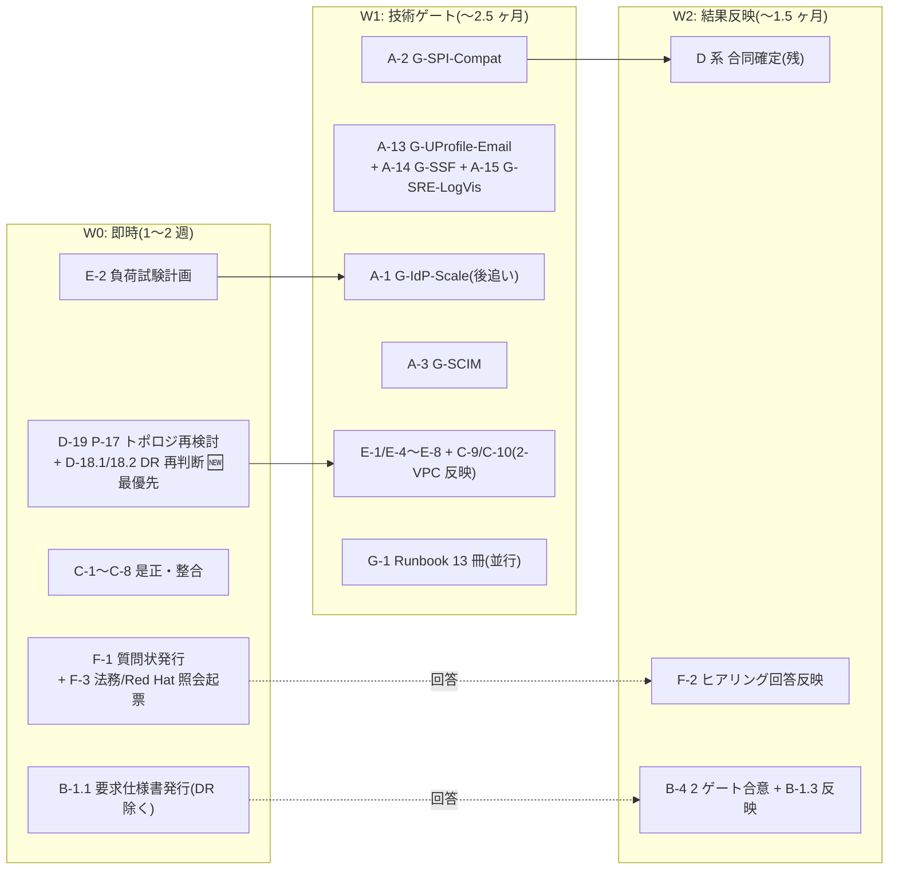

# 基本設計 残検討事項の全量棚卸しとタスク・工数計画

作成: 2026-07-30 / ステータス: **v2(粒度精緻化版 2026-08-26)** — 原子タスク分解 + 場合分け(条件付き増分)導入 + 8 月決定の同期
入力: ①設計書内未決事項の全量収集(約 187 件、00〜10 + 02a + 06a + research 4 本)②要件側ゲート棚卸し(hearing-checklist 127 項目 + G-* 9 種)③決定済み領域マップ(正式決定 101 件 + P-01〜18 + U2/U5 節決定)④外部ベストプラクティス突合(Keycloak/ROSA/AWS 公式・一次情報)

## §0 本書の位置づけ・なぜ今この棚卸しか

基本設計 10 冊は初版完成済み(正式決定 101 件)だが、その決定の一部は「条件付き」(P-16 は G-IdP-Scale 未通過、RTO 1h は G-EDGE-DR 未合意、等)であり、各書末尾の未決トラッカー(O-* 約 60 件)+ 要件側ゲート(B-* / G-*)+ 外部突合で新規判明した検討漏れ領域が残っている。**詳細設計・構築・テストの計画を立てる前に、「基本設計として何を調査・検討し切る必要があるか」を 1 冊に集約し、正直で余裕を持った工数を付ける**のが本書の目的。

- **調査** = 事実確認・実測・PoC(答えは世界側にある。設計判断の入力を得る作業)
- **検討** = 設計判断 + 文書化(答えは我々が決める。レビュー往復・関連文書反映込み)
- **外部待ち** = 顧客ヒアリング / 他組織回答 / 法務 / 別スレッド。工数は「内部の準備・追撃・反映」分のみ計上し、先方リードタイムは計上外
- 重要事実: **hearing-checklist 全 127 項目中、回答済みは PoC 自己解決 4 件のみ(顧客回答ゼロ)**。**G-* PoC ゲートは全て未実施**。基本設計は暫定前提 P-01〜20 の凍結で「書き切った」状態

### 2026-07-30 意思決定による更新(v1.2)

ユーザー判断 10 件を反映(SSOT は [Baseline §1.4a](01-architecture-baseline.md))。要点:

- **解消/確定**: C-201 FIPS 不要(→**2026-08-16 に「顧客確認未了」へ格下げ**、F-2 分岐参照) / A-5-2 利用者カテゴリ(P-1〜P-4 全受入・全ユーザーフェデ化)/ B-BROK-1 = 50:50 暫定 / B-LDAP-1 LDAP 廃止 / B-PCI-1 PCI 対応不要 / G-IdP-Scale 仮定値化 / G-EGRESS 合意方向。
- **スコープ除外(タスク削除)**: G-LDAP(A-4)・LDAP 追加 Flow(D-10)/ G-PCI-WAF・B-MFA-PCI-1。
- **新規改訂タスク**: **D-17 アイデンティティモデル改訂** / **D-18 DR 改訂**(→ 2026-08-16 P-05 再オープンで D-18 は「再判断込み」に再構成、§2 参照)。

### v2(2026-08-26)の精緻化規約 — §2.0

ユーザー指摘「粒度不足・複数タスク混在・場合の網羅なし」を受け、次の規約で §1/§2 を全面改稿した:

1. **原子タスク = 0.5〜3 人日・1 行 1 成果物(または 1 判断)**。3 人日超は必ずサブ分解(x-y.z 採番)。
2. **場合分け(分岐)を明示**: 「〜の状態で〜の場合」に発生する追加作業は、各クラスタ末尾の**分岐表(C-* プール)**に「トリガー → 追加作業 → 増分人日」で列挙。**ベース合計には含めない**(期待経路のみ)。顕在化した時点でベースに繰入れる。
3. **8 月決定の同期**: 解消済みタスクは 0 化(取消線)、新規ゲート(G-UProfile-Email / G-SSF / G-SRE-LogVis)と再オープン(P-05 DR / P-17 トポロジ)、2-VPC 分離(B 案)反映をタスク化。
4. **v1.2 の算術不整合を是正**: A(表 87/実 88)・B(表 22/実 24)・D(表 50/実 43)・§1 244 vs §6 242。v2 は全行ボトムアップ再集計。

### 工数の前提(正直・余裕込み)

- 1 人日 = シニア設計者 1 名の実働(会議・レビュー往復・関連文書への反映込み)。**バッファ約 40% 込み**の値
- PoC 系はクラウド利用費・環境(ROSA クラスタ等)を別途要する。環境構築は各タスクに含む
- 並列性: クラスタ A(PoC)は 2 名並走可。クラスタ C/G は他と独立に着手可
- 本書は「基本設計を閉じる」までのタスク。詳細設計・構築・テスト計画は別掲([00b](00b-design-unit-breakdown.md) / [wbs-gap-audit §10](research/wbs-gap-audit-2026-08-12.md))

---

## §1 タスククラスタ一覧(サマリ、v2)

| クラスタ | 性質 | 調査(人日) | 検討(人日) | 条件付き(C プール) | 外部依存 |
|---|---|---:|---:|---:|---|
| **A. PoC・技術ゲート実測** | 「条件付き確定」を外す実測群 + **新規ゲート 3 件(A-13〜15)** | **98** | — | +27 | クラウド費用のみ |
| **B. 他組織・エッジ連携確定** | 要求仕様書 v1 の発行〜回答反映(G-PCI-WAF 廃止分を是正) | — | **23** | +12 | 他組織回答 |
| **C. 設計是正・文書整合** | 既知の不整合是正 + **2-VPC 分離(B 案)の本文再編(C-9/10)** | — | **22** | — | なし |
| **D. 未確定設計の合同確定** | 合同設計判断。**D-3/D-4 解消・D-5 縮小 / D-18 再構成・D-19(P-17)・D-20 新規** | — | **56** | +13 | 一部 A/B 待ち |
| **E. 新規検討領域** | 外部突合で判明した領域抜け(v1 から据置・内訳列挙) | **10** | **23** | — | なし |
| **F. ヒアリング・契約・法務** | 質問状・回答反映(**悪い回答時の増分は分岐表**)+ Red Hat 照会追加 | — | **15** | +13 | 顧客・法務・Red Hat |
| **G. 運用実体化** | Runbook 13 冊の個別列挙・体制・図版 | — | **22** | — | なし |
| **ベース合計(期待経路)** | | **108** | **161** | | **総計 269 人日** |
| **条件付きプール(トリガー顕在時のみ)** | 分岐表 C-* の総和 | | | **+65** | |
| (参考)G-2 Runbook 残 23 冊 | リリース後 3 ヶ月以内で可 | — | (20) | | 総計外 |

**v1.2(244) → v2(269) の差分内訳**: 算術不整合是正 ±0(表記を実計へ)/ 解消 2 件(D-3/D-4)と D-5 縮小 **-7** / 新規ゲート A-13〜15 **+10** / 再オープン D-18 増分+D-19 新規 **+8** / 2-VPC 本文再編 C-9/10 **+5** / B-4 PCI 廃止是正 **-1** / F 追加(Red Hat 照会ほか) **+2** / 実計ベース差(88/24/43 起点) **+8**。**場合分け(+65)はベース外**で、従来「見えない超過リスク」だったものを明示化した。

**体制目安**: 2 名専任で約 6.5 ヶ月 / 3 名で約 4.5 ヶ月(A 並走時)。壁時計の律速は外部リードタイム(他組織回答・顧客ヒアリング・Red Hat DPA/照会)— W0 で外部依頼を先に投げるのが最重要(§4)。

---

## §2 クラスタ別タスク詳細(v2: 原子分解 + 分岐表)

### 横串ビュー — ServiceNow / JIT(クラスタ横断で散らばるため一覧化)

**ServiceNow 連携**(基本設計は U10 で決定済み、残は検証と移行設計の詰め):

| 段階 | 該当タスク / 参照 | 状態 |
|---|---|---|
| 基本設計の決定 | U10 D-U10-01〜06(パターン②=L1 SCIM+L2 SAML JIT / SAML Client CL-SN-01 / Matching Field / 並走 M0〜M3 / 削除連鎖 / Break Glass) | ✅ 確定済み |
| 実機検証 | **A-12** SAML Client 実機 + パターン②統合 + Matching Field + Webhook | 未実施 |
| 移行・並走・削除連鎖の設計詰め | **D-16** M0〜M3 詳細 + 削除連鎖 + Break Glass 実体 | 未着手 |
| SAML 証明書ローテ運用 | D-12(U10-OP-1、2 証明書並走) | D-12 に内包 |
| パターン選択・規模・PW 移行 | B-SN 系 21 項目(F-1/F-2、ヒアリング)。**②以外の回答時 = 分岐 C-A12** | 未回答 |
| 実装(作り込み) | [00b](00b-design-unit-breakdown.md) DU-U10-08 ほか | 基本設計スコープ外 |

**JIT の作り込み**(SPI 入出力仕様は確定済み。実装本体は構築フェーズ):

| 段階 | 該当タスク / 参照 | 状態 |
|---|---|---|
| SPI 入出力仕様 | U2 §2.4.1、U3 D3-07/09/12 | ✅ 確定済み |
| deprovisioning(退職者遮断) | U9 D-U9-17 + [ADR-064 outbox](../adr/064-deprovisioning-propagation-outbox.md) | ✅ 確定済み |
| 経路別 SPI 発火の検証 | A-2(SPI 互換)/ ~~A-4 LDAP 廃止~~ / A-5(SAML)/ A-6(実 IdP)/ **A-13(email 非保有)** | 未実施 |
| 追加設計(検証結果反映) | ~~D-10 廃止~~ / D-11(SAML テンプレート) | A-5 待ち |
| 契約前ゲート(ポリシー確定) | B-JIT-LC-1 / B-JIT-RA-1 / B-SCIM-JIT-1 / B-JIT-DEL-1/2(F-1/F-2) | 未回答 |

### A. PoC・技術ゲート実測(調査 98 人日 + 分岐 +27)

| # | サブタスク | 内容(成果物/完了条件) | 人日 | 依存 |
|---|---|---|---:|---|
| A-1.1 | G-IdP-Scale: 環境+データセット | ROSA 試験環境 + 1000/2000 IdP・Org 生成投入スクリプト(keycloak-benchmark/Gatling) | 5 | E-2 計画 |
| A-1.2 | G-IdP-Scale: 認証実測 | フェデ/HRD 解決の p99(ベースライン比 +10% 以内判定) | 4 | A-1.1 |
| A-1.3 | G-IdP-Scale: Admin/オンボーディング実測 | IdP 追加・一覧応答・Terraform plan 分割閾値の実測 | 4 | A-1.1 |
| A-1.4 | G-IdP-Scale: キャッシュ/メモリ実測 | realm cache メモリ・ウォームアップ・Pod 再起動後回復(O-U8-4) | 4 | A-1.1 |
| A-1.5 | G-IdP-Scale: パッチ回帰 | 1000 IdP 状態での rolling patch 回帰(K-11 の前提) | 3 | A-1.4 |
| A-1.6 | G-IdP-Scale: infra Pool/監視入力 | O-11/O-U9-2(監視系列数・infra Pool サイジング)への実測値整理 | 2 | A-1.2〜4 |
| A-1.7 | G-IdP-Scale: 設計反映 | U2 §2.7 キャッシュ最終値・U6 サイジング・ゲート判定記録 | 3 | A-1.2〜6 |
| A-2.1 | G-SPI-Compat: 環境 | RHBK 26.4 + Operator Custom Image ビルドチェーン | 2 | RHBK 環境 |
| A-2.2 | G-SPI-Compat: SPI×4 個別互換 | HRD / JIT 案 B / Re-Activation / mfa_indicator の各機能互換 | 3 | A-2.1 |
| A-2.3 | G-SPI-Compat: Flow 配置発火 | 3 系統 Flow + forms サブフロー(PoC F-6 準拠)で全経路発火 | 2 | A-2.2 |
| A-2.4 | G-SPI-Compat: 周辺互換 | storeToken=false×id_token_hint・属性ポリシー・CVE-2025-14559 回避 | 2 | A-2.1 |
| A-2.5 | G-SPI-Compat: Micrometer 計装 | SPI 内計装の RHBK 互換(O-U9-5) | 1 | A-2.2 |
| A-3.1 | G-SCIM: Facade プロトタイプ | SCIM 2.0 受信・認証・テナントルーティングの最小実装 | 5 | — |
| A-3.2 | G-SCIM: Validator 準拠 | Entra/Okta SCIM Validator 合格 | 3 | A-3.1 |
| A-3.3 | G-SCIM: D1/D2 E2E | 作成/更新/DELETE→Soft Delete 写像・deprovisioned_at セット | 3 | A-3.1 |
| A-3.4 | G-SCIM: テナントスケール | 500/1000 テナント externalId 検索 p99 | 3 | A-3.1 |
| A-3.5 | G-SCIM: バルク+流量 | バルク 5 万件・Writer 流量制御下の他テナント遅延 | 3 | A-3.4 |
| A-3.6 | G-SCIM: 射影読取+反映 | 統合射影の読取 p99 + U3 §3.7/3.8 への反映 | 3 | A-3.3 |
| A-5.1 | SAML 経由 JIT: モック環境 | SAML IdP モック(B-SCIM-12) | 1 | — |
| A-5.2 | SAML 経由 JIT: NameID 差検証 | persistent/unspecified 差での SPI 発火・突合 | 2 | A-5.1 |
| A-5.3 | SAML 経由 JIT: D-11 入力整理 | テンプレート設計への差分整理 | 1 | A-5.2 |
| A-6.1 | 実 IdP: Entra ID trial | Claims・iss・login_hint・amr の実機差 | 3 | A-5 後推奨 |
| A-6.2 | 実 IdP: Okta trial | 同上の Okta 差分 | 2 | A-6.1 |
| A-6.3 | 実 IdP: SPI 発火+mfa_indicator | 実 IdP での SPI 発火・mfa_indicator Mapper 動作 | 2 | A-6.1 |
| A-6.4 | 実 IdP: 設計反映 | U2 §2.4 Mapper・HRD への差分反映 | 1 | A-6.3 |
| A-7.1 | G-OSAKA: 在庫・クォータ照会 | 大阪 c7g/c7i 在庫・vCPU クォータ実確認 | 1.5 | — |
| A-7.2 | G-OSAKA: arm64 対応確認 | arm64 Machine Pool・RHBK Operator arm64 + 反映 | 1.5 | A-7.1 |
| A-8 | Argon2id スループット実測 | KC デフォルト(m=7MiB/t=5)req/s 実測 → サイジング補正 | 2 | A-1 環境相乗り |
| A-9 | SAML メタデータ自動更新の実機確認 | 「Use metadata descriptor URL + Refresh period」実在・動作(Discussion #27828) | 2 | — |
| A-10.1 | SPI 負荷: debounce | 100 RPS×24h×10 万ユーザの Aurora IOPS / invalidate / Pod リソース | 3 | A-1 環境相乗り |
| A-10.2 | SPI 負荷: Event Listener emit | 同期 PutEvents の Token p99 影響・スロットリング・実流量(U7 D-U7-04a) | 3 | A-10.1 |
| A-11 | 小粒実機確認バンドル(4 点×0.5) | ① multi-cluster v2 版数+EUS/チャネル ② ROSA SA issuer JWKS ③ RFC 8414 形式提供有無(kc#45271) ④ kc_idp_hint テナント存在オラクル 3 パターン+SAML descriptor 到達性(O-U7-10) | 2 | — |
| A-12.1 | SN 実機: SAML Client | CL-SN-01(NameID=username/RSA-SHA256/IdP-init 無効)実機 | 2 | — |
| A-12.2 | SN 実機: パターン②統合 | L1 SCIM→L2 SAML JIT 統合フロー | 2 | A-12.1 |
| A-12.3 | SN 実機: 突合+Webhook | Matching Field(employee_number)+Webhook(HMAC/冪等) | 2 | A-12.2 |
| **A-13** 🆕 | **G-UProfile-Email 実機**(2026-08-03 ゲート、v1 未収載) | email 任意化で 3 経路(新規/JIT/Admin)完走・kc#21265/#33497 回避確認(U2 §2.8.1) | 3 | A-2 環境相乗り |
| **A-14** 🆕 | **G-SSF 実機**(2026-08-12 ゲート、[ADR-065](../adr/065-continuous-access-caep-shared-signals.md)) | KC experimental SSF transmitter 動作・receiver 要否・outbox 自作 SET エミッタ比較 | 4 | — |
| **A-15** 🆕 | **G-SRE-LogVis 実機**(2026-08-14 ゲート、[research](research/rosa-sre-live-log-visibility-2026-08-14.md)) | `oc logs` に PII 非出力(ソース側マスク+ログレベル)実機確認 + Approved Access 有効化手順確認 | 3 | D-20 方式 |
| | **A 小計** | | **98** | |

**A 分岐表(条件付き増分・トリガー顕在時のみ)**:

| 分岐 ID | トリガー(〜の状態で〜の場合) | 追加作業 | 増分 |
|---|---|---|---:|
| C-A1 | A-1 実測で p99 がベースライン比 +10% を超過した場合 | キャッシュ増強・構成見直しの対策設計 + 再実測 | +8 |
| C-A2 | A-2 で RHBK 互換 FAIL の場合 | upstream KC 継続判断 or SPI 改修方針の再設計(P-01 影響評価込み) | +5 |
| C-A3 | A-3 で Validator 不合格項目が出た場合 | 写像・スキーマ再設計 + 再検証 | +3 |
| C-A6 | A-6 で実 IdP にて SPI 不発火ケースを発見した場合 | Flow 配置再設計 + 回帰 | +3 |
| C-A9 | A-9 で自動更新機能が実在しない場合 | D-12 で運用代替(手動ローテ+監視)設計 | +2 |
| C-A10 | A-10.2 で同期 emit が p99 を悪化させる場合 | 非同期化(buffer/バッチ)再設計 | +3 |
| C-A12 | B-SN-3 回答がパターン②以外の場合 | 該当パターンで A-12 再検証 + U10 改訂 | +3 |

### B. 他組織・エッジ連携確定(検討 23 人日 + 分岐 +12 + 外部リードタイム)

REQ 全群(REQ-IN-01〜13 / REQ-OUT-01〜06 / REQ-DR-01〜05 = 全件未回答)がここに連鎖。~~G-PCI-WAF~~ は廃止済(v1.2 の B-4 記載は誤り、v2 で是正)。**REQ-DR 系は D-18(P-05 再判断)の結論が要求内容を決める**ため D-18 先行。

| # | サブタスク | 内容 | 人日 | 依存 |
|---|---|---|---:|---|
| B-1.1 | 要求仕様書 v1 体裁化・発行 | REQ-IN/OUT/DR 全 24 件の要求仕様書化 + O-4/O-7/O-10 論点添付 | 4 | DR 系のみ D-18.2 |
| B-1.2 | 先方 QA 対応 | 質疑往復(2 巡想定)・論点整理 | 3 | B-1.1 |
| B-1.3 | 回答反映(期待経路) | 回答が要求どおり合意した場合の各単元反映 | 5 | B-1.2 |
| B-2.1 | CF→エッジ LB 到達方式の技術詰め | custom origin vs VPC origins × NFW ingress ルート × In-B 相性(REQ-IN-13/O-APP-1) | 3 | — |
| B-2.2 | 協議資料化 | 先方向け比較資料 | 2 | B-2.1 |
| B-3 | CIDR 台帳の凍結 | 社内 NW・他組織・顧客 CIDR 入手と衝突確認(install 後変更不可のため構築前必須) | 2 | 社内 NW |
| B-4.1 | G-EGRESS 合意資料 | 方式①(初期一括+都度)の SLA 文言確定資料 | 1 | B-1.1 |
| B-4.2 | G-EDGE-DR 合意資料 | DR 方式再判断(D-18.2)結果を反映した合意資料 | 2 | **D-18.2** |
| B-5 | Canary Bot 除外合意 | Canary 送信元の WAF 誤検知除外を REQ 追補へ | 1 | B-1.1 |
| | **B 小計** | | **23** | |

**B 分岐表**:

| 分岐 ID | トリガー | 追加作業 | 増分 |
|---|---|---|---:|
| C-B1 | 他組織回答が要求と乖離した場合(In-B 不可・NFW 例外不可・ヘッダ挿入不可等) | 該当箇所の設計再検討 + REQ 再発行 | +6 |
| C-B2 | zero-egress の TGW 接続不可(O-10)の場合 | 案 A(NAT GW→NFW)への egress 再設計 | +3 |
| C-B3 | VPC origins 不可の場合 | custom origin 前提の SG/prefix list 設計へ切替 | +2 |
| C-B4 | B-3 で CIDR 衝突が発覚した場合 | CGNAT 退避([research](research/rosa-vpc-ip-conservation-2026-08-17.md))の適用設計 | +1 |

### C. 設計是正・文書整合(検討 22 人日、即着手可)

| # | サブタスク | 内容 | 人日 |
|---|---|---|---:|
| C-1.1 | U6 是正: Pod モデル | 「27 Pod」不整合是正・少数大型 Pod モデルへの設計判断 | 1.5 |
| C-1.2 | U6 是正: 接続予算 | D-U6-08 への接続予算規約追加 | 1 |
| C-1.3 | U6 是正: 再計算 | フェデ:IdP-KC=50:50 + **P-02 時点分離(初回 100〜500 万 MAU)** での初期サイジング/コスト再計算(2026-08-16 反映) | 1.5 |
| C-2 | Baseline 整合 3 点(各 0.5〜1) | ① NFR-3 10M 改訂 ② §C-7 改訂ステータスの 01/00-index 突合 ③ P-09「RT 30 日」精密化 | 2 |
| C-3 | ADR 反映残の一括処理(7 本×0.5) | ADR-051(12 項目)/053/059/019/048/038/023 §L.8 | 4 |
| C-4 | 小粒登録 4 点 | legacy_spi D3-04 行 / REQ-IN-12 U6 登録 / REQ-OUT-06 起票 / A6a-2 承認 | 1 |
| C-5 | 宙に浮いた参照 8 件の解消 | idp_priority(→D-1)/AAL 一覧(→D-2)/canary(→D-9)/L4 JIT API(→D-15)/drawio(→G-4)/00 計画書 Sorry 旧記述/§C-7 ⬜/ADR-040/036 追跡(→F-4)。**+ D-3/D-4 解消の後始末**(U3-OP-2/3 クローズ記録) | 2 |
| C-6 | research 波及文書修正 | rosa-detailed-analysis §4/§7、rhbk-support-and-pricing §4.5 | 1 |
| C-7 | PCI DSS スコープの Phase 1 除外化 | U7 の PCI 記述を「Phase 1 対象外(将来再開可)」へ降格 | 2 |
| C-8 | LDAP 経路の対象外化 | U2/U3・ADR-025 §H へ「Phase 1 対象外」注記 | 1 |
| **C-9** 🆕 | **U6 §6.2 の 2-VPC 分離(B 案)本文再編** | 決定ブロック止まりの現状を、サブネット 4 層→**VPC-K/VPC-M 2 VPC 構成**の本文として全面改稿([topology note](research/brand-unit-2vpc-topology-2026-08-18.md) を正、CIDR 実値は P-17(D-19)確定待ちの変数化) | 3 |
| **C-10** 🆕 | **06a §A.6 の 2-VPC 反映** | 全体図・アカウント別詳細・IP 割当表を 2-VPC/EPS-OIDC/EPS-Admin 構成へ更新 | 2 |
| | **C 小計** | | **22** |

### D. 未確定設計の合同確定(検討 56 人日 + 分岐 +13)

| # | サブタスク | 内容 | 人日 | 依存 |
|---|---|---|---:|---|
| D-1 | idp_priority + Org セレクター表示順 | U2×U4 合同(U2 §2.1.4 / U4 #10) | 2 | — |
| D-2 | AAL2/AAL3 要求操作一覧 | RP 契約の前倒し確定(U5 §5.9.1 #2) | 3 | B-APP-STEPUP-1 暫定可 |
| ~~D-3~~ | ~~idmap 補助 DB 物理配置~~ ✅ **解消(2026-08-06 ADR-063: authz 系 Aurora 同居)** | — | 0 | — |
| ~~D-4~~ | ~~SCIM Facade 実行形態~~ ✅ **解消(2026-08-06 O-9: Lambda substrate)** | — | 0 | — |
| D-5 | idm-api S2S 認可の残分 | **大半解消(ADR-062/063/064: 内部 NLB・越境 EventBridge 2 本)**。残 = 越境イベント経路の S2S 認可具体(U5 §5.8 `idm:*` スコープ) | 1 | — |
| D-6 | SES/メール送信設計 | サンドボックス解除・SPF/DKIM・realm 単位 SMTP as-code(A6a-1) | 3 | — |
| D-7 | ITDR DynamoDB 大阪 + Break-Glass 大阪実体 | U7×U8 合同(O-U7-7/O-U8-9)。D-18 の DR 方式と整合 | 3 | D-18.2 |
| D-8 | D3-17 `portal` 値 + `ext_` 受入枠 + `app` 90 日オプトイン | U3 §3.8 / U2 §2.6 | 2 | — |
| D-9.1 | エンタイトルメント×App Registry スキーマ統合 | U10-OP-3 | 1.5 | — |
| D-9.2 | 管理操作監査ログの配置(per-brand vs 中央) | **DU-U9O-09 の先行判断と同一論点**(保持年数 WORM 7 年整合込み) | 1.5 | — |
| D-9.3 | 承認 UI 共用 + canary スコープ + SLO 境界 | U10-OP-6/7/8(各 0.5〜1) | 2 | — |
| D-11 | SAML IdP テンプレート(Mapper 定義) | U2 §2.8.2。A-5 の NameID 差分を反映 | 2 | **A-5** |
| D-12 | IdP 証明書ローテーション運用設計 | A-9 結果反映 + SP 側 SAML 鍵ローテ(U10-OP-1)+ Realm 鍵 3-6 ヶ月ローテ | 3 | **A-9** |
| D-13 | ロックアウト×Broker リスクスコア整合 | U7 §7.2.1 | 2 | — |
| D-14 | ATP フォームフィールド添付 + HRD 文言最終稿 | U7 §7.8.1 / U4 §4.1.3 | 1 | — |
| D-15 | L3 昇格 API 配置 | U7 §7.6.1(ADR-040 完了後) | 2 | F-4 |
| D-16.1 | SN 移行: M0〜M3 詳細手順 | 並走 4 Phase の詳細(U10 §10.4) | 2 | B-SN 暫定可 |
| D-16.2 | SN 移行: 削除連鎖 + Break Glass 実体 | L1 Soft Delete→SAML 拒否で L2 遮断・sys_user 残置(D-U10-06) | 1 | — |
| D-16.3 | SN 移行: SN-only ユーザ移行/PW 移行判定 | B-SN-9/10/18/19 の暫定判断 | 1 | — |
| D-17.1 | identity 改訂: U2 Browser Flow | P-07 転換の Flow 書換(§2.3.1) | 1 | — |
| D-17.2 | identity 改訂: U3 プロビ経路表 | D3-04 経路表・provisioned_by=local-admin 限定 | 1.5 | — |
| D-17.3 | identity 改訂: U4 MFA UX | D-U4-04 ケース再定義 | 1 | — |
| D-17.4 | identity 改訂: U7 MFA 責任分界 | D-U7-14 の P-2 フェデ側責任へ書換 | 1 | — |
| D-17.5 | identity 改訂: 整合レビュー | 4 単元横断の突合 | 0.5 | D-17.1〜4 |
| **D-18.1** | **DR 再判断: 成立性分析**(2026-08-16 P-05 再オープン) | 顧客希望(RTO 1 日/DR 障害時 3 日/RPO 5 分)vs コールド DR(RTO≈14 日)の矛盾を、Aurora Global/PITR 制約(U8 §8.3.1a)込みで定量分析 | 2 | — |
| **D-18.2** | **DR 再判断: 方式決定** | ① コールド維持+SLA 文言調整 ② 部分ウォーム復活(Aurora Global 常設+クラスタのみコールド等)の比較と決定(ヒアリング B-DR 系と連動) | 3 | D-18.1 |
| D-18.3 | DR 改訂: U8/U6/ADR-051 反映 | 決定方式での本文改訂(2 障害シナリオ・イミュータブル SS・Vault Lock 込み) | 4 | D-18.2 |
| D-18.4 | DR 改訂: Runbook 骨子 | 大阪再構築+リストア Runbook 骨子(G-1 の DR-00〜05 と連動) | 2 | D-18.3 |
| **D-19** 🆕 | **P-17 クラスタトポロジ再検討**(2026-08-16 凍結解除) | 「IdP-KC をどうするか」= 別 Acct 2 クラスタ(従前) vs 1 クラスタ 2 Realm vs 他、の比較・決定(ADR-033 改訂。2-VPC 設計(C-9)の CIDR 実値・DR 対象・コストの前提) | 5 | — |
| **D-20** 🆕 | **SRE stdout マスキング方式設計**(G-SRE-LogVis の設計側) | Keycloak がノードに書く stdout に PII を出さない方式(logger 設定/イベント出力設計/本番ログレベル固定 = 禁則 K-13 の実現方式)。A-15 実機の入力 | 2 | — |
| | **D 小計** | | **56** | |

**D 分岐表**:

| 分岐 ID | トリガー | 追加作業 | 増分 |
|---|---|---|---:|
| C-D18 | D-18.2 で部分ウォーム復活を決定した場合 | U6 常時コスト・大阪常設構成・C-1 コストの再設計 | +5 |
| C-D19 | D-19 で 2 クラスタ構成を変更する決定の場合 | U6/06a/CIDR/ADR-033/062/063 の波及改訂 + 2-VPC 設計(C-9/C-10)の手戻り | +8 |

### E. 新規検討領域(調査 10 + 検討 23 人日)

| # | サブタスク | 内容 | 種別 | 人日 |
|---|---|---|---|---:|
| E-1.1 | dev/stg: 調査 | 既存慣行・ROSA 非本番の費用/共用オプション調査 | 調査 | 2 |
| E-1.2 | dev/stg: Acct/クラスタ方針 | Acct 構成・クラスタ数/共用方針の決定 | 検討 | 3 |
| E-1.3 | dev/stg: テストデータ + コスト | 合成データ方針(D-U9-19 連動)+ 環境コスト見積 | 検討 | 3 |
| E-2 | 負荷試験一元計画書 | keycloak-benchmark/Gatling・dataset・合格基準・「Pod 増で 1 Pod 性能低下」織込み(A-1 の前提) | 検討 | 4 |
| E-3 | FinOps/継続コスト管理 | タグ戦略(SCP/Config 補完)・予算アラート・テナント別原価・O-6 回収 | 検討 | 4 |
| E-4 | KC 本番設定の詰め漏れ反映(5 項目×1) | `http-max-queued-requests` / 公開パス遮断表 / JGroups mTLS 30 日ローテ / jdbc-ping / persistent-user-sessions 確認 | 調査 2+検討 3 | 5 |
| E-5 | アップグレード運用の精密化 | `update-compatibility check` CI 組込み / recreate=全停止のメンテ窓設計 / RHBK EUS(A-11 連動) | 調査 2+検討 3 | 5 |
| E-6 | Aurora 接続の公式部品採否 | AWS Advanced JDBC Wrapper / `migration-strategy` 選定 / 暗号化範囲確認 | 調査 2+検討 1 | 3 |
| E-7 | ROSA 監査ログの中央集約制約 | CloudWatch 別 Acct 直接転送非サポート確認 + D-U9-01/05 整合 | 調査 2+検討 1 | 3 |
| E-8 | brute force 戦略 + アカウント列挙対策 | 公式 4 戦略から選定・明文化 | 検討 | 1 |
| | **E 小計** | | | **33** |

### F. ヒアリング・契約・法務(検討 15 人日 + 分岐 +13 + 外部リードタイム)

| # | サブタスク | 内容 | 人日 |
|---|---|---|---:|
| F-1 | ヒアリング質問状のパッケージ化 | 127 項目の優先度圧縮(残は B-SN/B-MIG/B-TAP/B-DR/UX 系中心。customer-questionnaire/ 整備と連動) | 2 |
| F-2 | 回答反映(期待経路) | 回答が暫定前提を**追認**した場合の P 表更新+影響単元反映 | 8 |
| F-3 | 法務・Red Hat 照会の起票と追撃 | Red Hat DPA(SRE 越境)+ **B-SRE-LOG-1/2(Approved Access・oc logs 監査可視性)+ B-DPA-2(SRE 地理制限)** + Key Custodian + PPC 雛形 + 契約テンプレ | 3 |
| F-4 | ADR-040/036 別スレッド完了後の統合 | OOS 残存参照整理(O-U9-9) | 2 |
| | **F 小計** | | **15** |

**F 分岐表(悪い回答時の増分 — v1 で「別途増分」とだけ書かれ数字が無かったもの)**:

| 分岐 ID | トリガー | 追加作業 | 増分 |
|---|---|---|---:|
| C-F1 | FIPS(C-201)が「必要」と回答された場合(2026-08-16 に確定→未了へ格下げ済) | U7 FIPS 140-3 対応設計(暗号モジュール・ROSA FIPS モード・影響全単元) | +8 |
| C-F2 | B-DR 系で顧客が RTO/RPO 強化を譲らない場合 | → C-D18(ウォーム復活)に合流 | (C-D18) |
| C-F3 | 識別子/UX 系(B-IDM/B-62x)で特殊要望が出た場合 | HRD 文言・識別子体系の部分再設計 | +2 |
| C-F4 | B-MIG 系で移行方式変更(一括→段階等)が出た場合 | U10 §10.4 移行設計の再構成 | +3 |

### G. 運用実体化(検討 22 人日 + 参考 20)

| # | サブタスク | 内容 | 人日 |
|---|---|---|---:|
| G-1.1 | Runbook: TEN-01(テナント追加) | IdP オンボーディング 6 ステップの手順書化 | 1.5 |
| G-1.2 | Runbook: TEN-03(テナント離脱) | 段階削除(30/90 日+エクスポート+証明書) | 1.5 |
| G-1.3 | Runbook: SEC-01(インシデント初動) | ITDR L3/L4 起点の初動(APPI 速報タイマ連動) | 1.5 |
| G-1.4 | Runbook: SEC-02(漏えい報告 SOP 実体) | D-U7-15 の 7 ステップ実手順 | 1.5 |
| G-1.5 | Runbook: SEC-04(緊急鍵ローテ) | §7.1.3 の実手順 | 1 |
| G-1.6 | Runbook: SEC-05(Break-Glass) | 発動・使用・事後(役員承認・監査) | 1.5 |
| G-1.7 | Runbook: SEC-06(強制ログアウト 3 粒度) | U5 §5.4 の粒度別実手順 | 1 |
| G-1.8 | Runbook: DR-00(発動判断) | 判断基準・ITDR フラグ(K-4) | 1 |
| G-1.9 | Runbook: DR-01〜02(大阪再構築) | ROSA 再構築+IaC 適用(D-18 決定方式で書く) | 2.5 |
| G-1.10 | Runbook: DR-03〜04(リストア) | PITR/イミュータブル SS リストア(論理破壊系) | 2 |
| G-1.11 | Runbook: DR-05(切戻し) | 東京復帰・整合確認 | 1 |
| G-3 | オンコール/アラート Routing 実体 | PagerDuty 契約・ローテーション(O-U9-6) | 2 |
| G-4.1 | drawio 清書: overview | 2-VPC/ブランドユニット反映の AWS アイコン版 | 2 |
| G-4.2 | drawio 清書: network-detail | 旧 EKS 図置換 + EPS-OIDC/EPS-Admin/EventBridge 経路 | 2 |
| | **G 小計** | | **22** |
| (G-2) | (参考・総計外)残り 23 冊 — リリース後 3 ヶ月以内 | D-U9-07 | (20) |

> ⚠ G-1 の必須 13 冊 = TEN-01/03 + SEC-01/02/04/05/06 + DR-00〜05([U9 D-U9-07](09-operations-observability-design.md) が正。SEC-03 はエッジ WAF が他組織回答依存のため含めない — 2026-08-18 是正)。

---

## §2C 条件付きプール一覧(トリガー顕在時のみベースへ繰入れ)

| 群 | 分岐 | 小計 |
|---|---|---:|
| A(PoC FAIL 系) | C-A1(+8) C-A2(+5) C-A3(+3) C-A6(+3) C-A9(+2) C-A10(+3) C-A12(+3) | **+27** |
| B(他組織回答乖離系) | C-B1(+6) C-B2(+3) C-B3(+2) C-B4(+1) | **+12** |
| D(再オープン決定系) | C-D18(+5) C-D19(+8) | **+13** |
| F(悪い回答系) | C-F1(+8) C-F3(+2) C-F4(+3) | **+13** |
| **合計** | | **+65** |

- 運用: 分岐が顕在化したら該当 C-* をベースに繰入れ、§1 サマリを更新する。**予算計画上は「269 + リスク引当 65 = 334 人日を上限」**と読む。
- 相互排他に注意: C-F2 は C-D18 と同一実体(二重計上しない)。C-A12 は SN 再検証+U10 改訂込み。

---

## §3 外部待ち全量(工数外・アクション管理)

### 3.1 ブロック度「高」の現状

**2026-07-30 に 11 件中 9 件解消 → 2026-08 の再オープンで実質残は 4 件**:

| ID | 状態 |
|---|---|
| **G-SPI-Compat** | ⏳ 検証する(A-2、残ブロッカー①) |
| **G-DPA** | ⏳ APPI 同意は取得方針。残 = Red Hat SRE 越境閲覧の確認(**G-SRE-LogVis に細分化**、A-15/D-20/F-3) |
| **P-05 DR** 🆕 | ⚠ 再オープン(2026-08-16、顧客希望 RTO1 日/RPO5 分 vs コールド矛盾)→ D-18.1/18.2 |
| **P-17 トポロジ** 🆕 | ⚠ 再オープン(2026-08-16、2 クラスタ構成の再検討)→ D-19 |
| ~~C-201 FIPS~~ | ⚠ 「不要(見込み)」へ格下げ(2026-08-16)。Yes 転回時は C-F1(+8) |
| ~~A-5-2 / B-BROK-1 / B-LDAP-1 / B-PCI-1 / G-LDAP / G-EDGE-DR / G-EGRESS~~ | ✅ 解消(v1.2 のとおり) |
| G-IdP-Scale | ⬇ 仮定値化(A-1 は後追い検証) |

### 3.2 群単位の外部待ち(回答受領後 F-2 で反映)

- **Phase 1 契約前ゲート束**: U3 の 8 項目(B-JIT-LC-1 / B-JIT-RA-1 / B-SCIM-JIT-1/3 / B-JIT-DEL-1/2 / B-TENANT-SWITCH-1 / B-TENANT-EXIT-1)+ B-PAM-1/2 + G-DPA(G-SRE-LogVis 含む)+ G-EGRESS
- **ヒアリング群**: B-SN 系 21 / B-MIG 系 12 / B-IDM 系 12 / B-TAP 系 10 / B-DR 系 5(**P-05 再オープンで最優先化**)/ B-APP-OIDC 3 / B-618〜629(UX)/ B-AA・B-ITDR / B-OBS 2〜5 / B-KMS-3 / B-LOG-1 ほか(未回答 123)
- **Red Hat 照会** 🆕: B-SRE-LOG-1(Approved Access の break-glass ゲート・HCP GA)/ B-SRE-LOG-2(oc logs read の顧客監査可視性)/ B-DPA-2(SRE 地理制限の契約保証)
- **他組織回答**: REQ-IN-01〜13 / REQ-OUT-01〜06 / REQ-DR-01〜05(B-1 で発行)
- **社内・その他**: Stage A Terraform 書換工数承認(ADR-056 採用条件 ③)/ ROSA 3y 見積(O-6)/ 社内 NW CIDR(B-3)/ ADR-040/036 別スレッド(F-4)

---

## §4 推奨実行順序(Wave)とクリティカルパス

- **クリティカルパス(内部)**: **D-19(P-17)と D-18.1/18.2(DR)が最上流**(CIDR 実値・DR 対象・REQ-DR 内容・C-1 コストの前提)→ C-9/C-10 → A 系 → D 残
- **クリティカルパス(外部)**: F-1/B-1/F-3 の発行が遅れるほど W2 が後ろへずれる。**工数より先に「依頼を出す」ことが律速** — W0 は 2 週間で完了させる
- **リスク早期化**: C-F1(FIPS)・C-D19(トポロジ変更)・G-DPA/G-SRE-LogVis は「顕在時の設計影響が最大」— W0 で D-19/D-18 と Red Hat 照会を必ず先行

## §5 本書の次(詳細設計・構築・テストへの接続)

本書のタスクが閉じた時点で、以下を別途計画する(本書のスコープ外):

1. **詳細設計**: 各 D-* 決定のパラメータ表・Terraform モジュール構造・SPI 詳細仕様・idm-api OpenAPI 詳細化(U10)・RP 実装ガイド完全版(U5 §5.6)
2. **構築**: Stage A Terraform(6-8 週、ADR-056)→ ROSA/RHBK → SPI/Facade 実装 → ServiceNow SAML Client / Webhook Dispatcher 構築
3. **テスト**: **[wbs-gap-audit §10](research/wbs-gap-audit-2026-08-12.md) の 30 項目 363 人日を正とする**(E-2 計画・DR Game Day・A11y・ペネトレ含む)
4. **移行**: U10 §10.4 の 4 集団移行のリハーサル計画(RB-MIG-01)

## §6 実装(構築)フェーズの概算工数 — 予備見積り

> **2026-08 注記**: 本節は v1 の粗見積(レンジ)。**詳細設計+構築の確定値は [00b](00b-design-unit-breakdown.md)(全 DU ボトムアップ ≈1,044 人日)/ テストは [wbs-gap-audit §10](research/wbs-gap-audit-2026-08-12.md)(363 人日)を正**とし、本節は参考(内訳の考え方)として保持する。

| # | ワークストリーム | 主な中身 | 人日(レンジ) |
|---|---|---|---:|
| I-1 | IaC / Terraform | マルチアカウント・ROSA HCP(大阪はオンデマンド)・Aurora×2・KMS・IRSA・PrivateLink/TGW。Stage A 書換(6-8 週)含む | 45–60 |
| I-2 | Keycloak/RHBK 基盤構成 | Operator デプロイ・Realm/Org・User Profile・Flow 木・Mapper・Client Scope の as-code | 15–20 |
| I-3 | Custom SPI ×4 | JIT 制御 / HRD / Event Listener / mfa_indicator + ビルド・署名・テストハーネス | 35–45 |
| I-4 | SCIM Facade(自作) | SCIM 2.0 受信・テナント別ルーティング・Admin API 写像・冪等/流量制御 | 20–30 |
| I-5 | idm-api | OpenAPI・CC スコープ・/api/me/*・エンタイトルメント・Webhook Dispatcher | 30–40 |
| I-6 | 管理 SPA | 自作 SPA・3 層スコープ(ADR-038) | 25–35 |
| I-7 | UX SPA 群 | ログイン Theme(i18n/WCAG 2.2 AA)+ Sorry SPA + Launchpad SPA | 30–40 |
| I-8 | ServiceNow 連携 | SAML Client + L2 JIT + Webhook 配信 | 10–15 |
| I-9 | ライフサイクルバッチ | 退職者遮断 CronJob + 日次リコンサイル | 8–12 |
| I-10 | 可観測性 | OTel/AMP/AMG・SLO・Fluent Bit scrubbing・ITDR 検知 | 25–35 |
| I-11 | CI/CD | GitHub Actions・ArgoCD・ESO・ドリフト検知 | 18–25 |
| ~~I-12~~ | ~~移行ツール~~ 🚫 対象外(2026-08-17 — 移行はアプリ側) | — | 0 |
| I-13 | セキュリティ構成 | KMS・IRSA・PAM(IIC/SSM)・WAF 要求連携 | 12–18 |
| | **構築 小計** | | **285–393** |

- **前提**: 詳細設計完了後に着手。基本設計クローズ(v2: 269 人日 + 条件付き 65)とは別。
- **並列性**: I-1/I-2(基盤)が先行、I-3〜I-9 は基盤後に 3-4 名並走可。壁時計では ~6〜9 ヶ月。

## 改訂履歴

- 2026-07-30 (v1): 初版。4 系統調査を統合し 7 クラスタ・総計 232 人日で棚卸し。
- 2026-07-30 (v1.1): ServiceNow タスク明示化(A-12/D-16)+ 横串ビュー追加。総計 242 人日。
- 2026-07-30 (v1.2): ユーザー意思決定 10 件反映(LDAP/PCI 除外・D-17/D-18 新設・G-IdP-Scale 仮定値化)。総計 244 人日(表記)。§6 構築概算 ≈325〜455 人日 新設。
- 2026-08-26 (v2): **粒度精緻化版(ユーザー指摘: 粒度不足/複数タスク混在/場合の網羅なし)**。①原子タスク 0.5〜3 人日へ全行分解(35 行→約 90 行)②**場合分け = 分岐表 C-*(条件付きプール +65 人日)を新設**(PoC FAIL/他組織回答乖離/悪い回答/再オープン決定)③ 8 月決定の同期(D-3/D-4 解消・D-5 縮小 / A-13 G-UProfile-Email・A-14 G-SSF・A-15 G-SRE-LogVis 新規 / D-18 再構成(P-05 再オープン)・D-19(P-17 再検討)・D-20(stdout マスキング)・C-9/C-10(2-VPC 本文再編)/ F-3 Red Hat 照会)④ v1.2 算術不整合 4 件是正(A 87/88・B 22/24・D 50/43・§1 244 vs §6 242)。**ベース総計 244 → 269 人日 + 条件付き 65(上限 334)**。§4 Wave を D-19/D-18 最優先に再構成。
