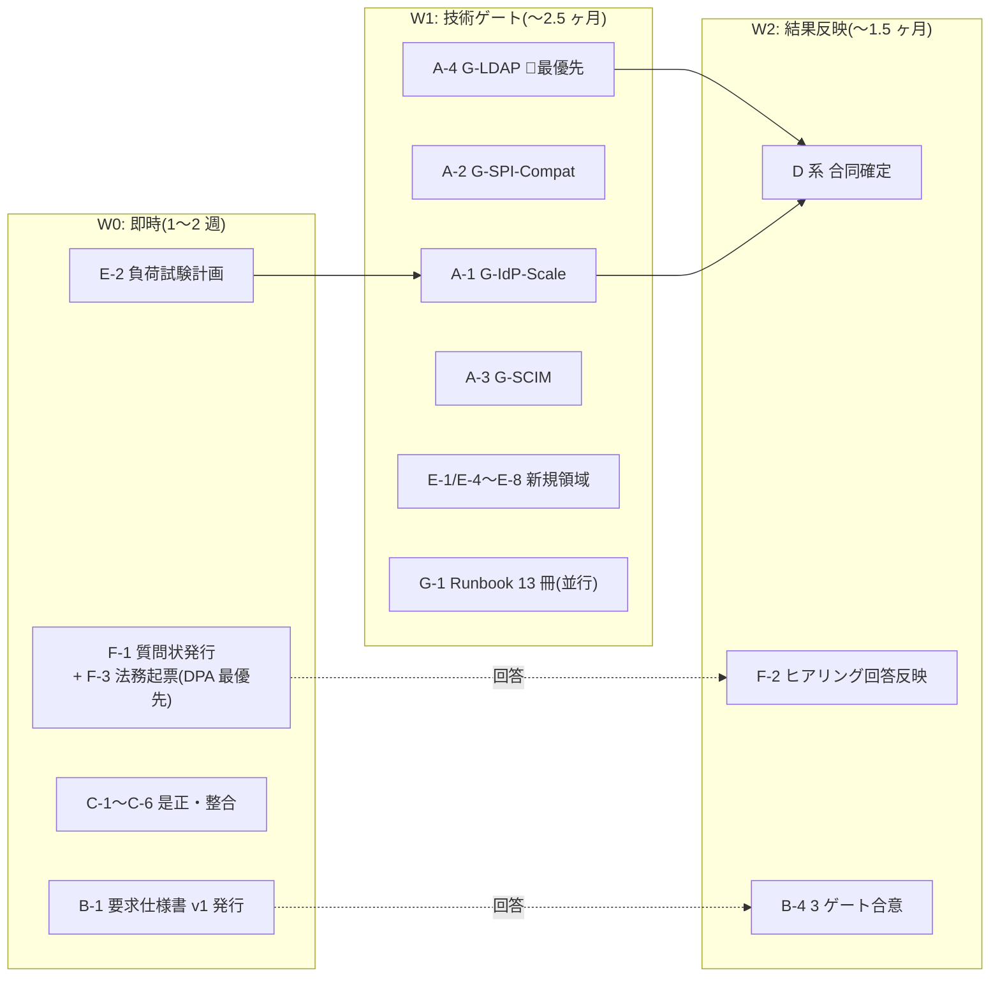

# 基本設計 残検討事項の全量棚卸しとタスク・工数計画

作成: 2026-07-30 / ステータス: v1(棚卸し初版)
入力: ①設計書内未決事項の全量収集(約 187 件、00〜10 + 02a + 06a + research 4 本)②要件側ゲート棚卸し(hearing-checklist 127 項目 + G-* 9 種)③決定済み領域マップ(正式決定 101 件 + P-01〜18 + U2/U5 節決定)④外部ベストプラクティス突合(Keycloak/ROSA/AWS 公式・一次情報)

## §0 本書の位置づけ・なぜ今この棚卸しか

基本設計 10 冊は初版完成済み(正式決定 101 件)だが、その決定の一部は「条件付き」(P-16 は G-IdP-Scale 未通過、RTO 1h は G-EDGE-DR 未合意、等)であり、各書末尾の未決トラッカー(O-* 約 60 件)+ 要件側ゲート(B-* / G-*)+ 外部突合で新規判明した検討漏れ領域が残っている。**詳細設計・構築・テストの計画を立てる前に、「基本設計として何を調査・検討し切る必要があるか」を 1 冊に集約し、正直で余裕を持った工数を付ける**のが本書の目的。

- **調査** = 事実確認・実測・PoC(答えは世界側にある。設計判断の入力を得る作業)
- **検討** = 設計判断 + 文書化(答えは我々が決める。レビュー往復・関連文書反映込み)
- **外部待ち** = 顧客ヒアリング / 他組織回答 / 法務 / 別スレッド。工数は「内部の準備・追撃・反映」分のみ計上し、先方リードタイムは計上外
- 重要事実: **hearing-checklist 全 127 項目中、回答済みは PoC 自己解決 4 件のみ(顧客回答ゼロ)**。**G-* PoC ゲート 9 種は全て未実施**。基本設計は暫定前提 P-01〜18 の凍結で「書き切った」状態

### 2026-07-30 意思決定による更新(v1.2)

ユーザー判断 10 件を反映(SSOT は [Baseline §1.4a](01-architecture-baseline.md))。要点:

- **解消/確定**: C-201 FIPS 不要 / A-5-2 利用者カテゴリ(P-1〜P-4 全受入・全ユーザーフェデ化)/ B-BROK-1 = 50:50 暫定 / B-LDAP-1 LDAP 廃止 / B-PCI-1 PCI 対応不要 / G-IdP-Scale 仮定値化 / G-EGRESS 合意方向。
- **スコープ除外(タスク削除)**: G-LDAP(A-4)・LDAP 追加 Flow(D-10)/ G-PCI-WAF・B-MFA-PCI-1。
- **新規改訂タスク(決定が設計本文の書き換えを生む)**: **D-17 アイデンティティモデル改訂**(顧客テナント管理者 P-2 = フェデ / ローカルは Broker・IdP-KC の基盤運用者 P-1 のみ・踏み台接続)/ **D-18 DR コールド化 + データ保全改訂**(手動 14 日・大阪オンデマンド再構築 + イミュータブルスナップショット/PITR で論理破壊にも対応)。
- **正味**: 総工数はほぼ横ばい(LDAP/PCI 除外分を identity/DR 改訂が相殺)。ただし**ブロック度「高」11 件の大半が解消**し、着手可能性は大きく前進。

### 工数の前提(正直・余裕込み)

- 1 人日 = シニア設計者 1 名の実働(会議・レビュー往復・関連文書への反映込み)。**バッファ約 40% 込み**の値
- PoC 系はクラウド利用費・環境(ROSA クラスタ等)を別途要する。環境構築は各タスクに含む
- 並列性: クラスタ A(PoC)は 2 名並走可。クラスタ C/G は他と独立に着手可
- 本書は「基本設計を閉じる」までのタスク。詳細設計・構築・テスト計画は本書確定後に別途(§5)

---

## §1 タスククラスタ一覧(サマリ)

| クラスタ | 性質 | 調査(人日) | 検討(人日) | 外部依存 |
|---|---|---:|---:|---|
| **A. PoC・技術ゲート実測** | 自社単独で着手可能。設計の「条件付き」を外す(SN 実機検証 A-12 含む。LDAP 除外で -6) | **87** | — | クラウド費用のみ |
| **B. 他組織・エッジ連携確定** | 要求仕様書 v1 の発行〜回答反映 | — | **22** | 他組織回答(リードタイム外部) |
| **C. 設計是正・文書整合** | 内部完結・即着手可。既知の不整合の是正(PCI/LDAP 除外反映 +3) | — | **17** | なし |
| **D. 未確定設計の合同確定** | 単元間合同で残った設計判断(SN D-16 + 2026-07-30 の identity D-17/DR D-18) | — | **50** | 一部は A/B の結果待ち |
| **E. 新規検討領域(外部突合で判明)** | 設計書に領域ごと抜けていた論点 | **10** | **23** | なし |
| **F. ヒアリング・契約・法務** | 質問状パッケージ化と回答反映(高ブロック解消で -3) | — | **13** | 顧客・法務(リードタイム外部) |
| **G. 運用実体化** | Runbook・体制・図版 | — | **22** | なし |
| **合計(Phase 1 基本設計クローズまで)** | | **97** | **147** | **総計 244 人日** |
| (参考)G-2 Runbook 残 23 冊 | リリース後 3 ヶ月以内で可 | — | (20) | 総計外 |

**体制目安**: 2 名専任で約 6 ヶ月 / 3 名で約 4 ヶ月(A クラスタ並走時)。ただし**壁時計時間の律速は工数でなく外部リードタイム**(他組織回答・顧客ヒアリング・Red Hat DPA 法務)になる公算が高い → W0 で外部依頼を先に投げるのが最重要(§4)。

---

## §2 クラスタ別タスク詳細

### 横串ビュー — ServiceNow / JIT(クラスタ横断で散らばるため一覧化)

タスクはクラスタ A〜G に機能分類しているため、「ServiceNow」「JIT」のように**1 つの機能が複数クラスタに跨る**ものは一望しにくい。主要 2 機能を横串で示す。

**ServiceNow 連携**(基本設計は U10 で決定済み、残は検証と移行設計の詰め):

| 段階 | 該当タスク / 参照 | 状態 |
|---|---|---|
| 基本設計の決定 | U10 D-U10-01〜06(パターン②=L1 SCIM+L2 SAML JIT / SAML Client CL-SN-01 / Matching Field / 並走 M0〜M3 / 削除連鎖 / Break Glass) | ✅ 確定済み |
| 実機検証 | **A-12(新規)** SAML Client 実機 + パターン②統合 + Matching Field + Webhook | 未実施 |
| 移行・並走・削除連鎖の設計詰め | **D-16(新規)** M0〜M3 詳細 + 削除連鎖 + Break Glass 実体 | 未着手 |
| SAML 証明書ローテ運用 | D-12(U10-OP-1、2 証明書並走) | D-12 に内包 |
| パターン選択・規模・PW 移行 | B-SN 系 21 項目(F-1/F-2、ヒアリング) | 未回答 |
| 実装(作り込み) | §5「構築」= SAML Client / Webhook Dispatcher 構築 | 基本設計スコープ外 |

**JIT(Just-In-Time プロビジョニング)の作り込み**(SPI 入出力仕様は確定済み、残は検証と追加設計。実装本体は構築フェーズ):

| 段階 | 該当タスク / 参照 | 状態 |
|---|---|---|
| SPI 入出力仕様(Custom Authenticator 案 B / Re-Activation 分岐 / provisioned_by 管理) | U2 §2.4.1、U3 D3-07/09/12 | ✅ 確定済み |
| deprovisioning(退職者遮断) | U9 D-U9-17(in-cluster CronJob) | ✅ 確定済み |
| 経路別 SPI 発火の検証 | A-2(SPI 互換)/ **A-4(LDAP 🚨)**/ A-5(SAML)/ A-6(実 IdP) | 未実施 |
| 追加設計(検証結果反映) | D-10(LDAP 追加 Flow)/ D-11(SAML テンプレート) | A-4/A-5 待ち |
| 契約前ゲート(ポリシー確定) | B-JIT-LC-1 / B-JIT-RA-1 / B-SCIM-JIT-1 / B-JIT-DEL-1/2(F-1/F-2) | 未回答 |
| 実装(作り込み) | §5「構築」= Custom Authenticator SPI 案 B の実装 | 基本設計スコープ外 |

> つまり **JIT/SCIM の「作り込み=SPI・Facade の実装」は基本設計のスコープ外**(§5 構築)であり、基本設計の残タスクは「経路別の発火検証(A)」と「検証結果を受けた追加 Flow 設計(D)」+「ポリシーのヒアリング確定(F)」に分かれる。

### A. PoC・技術ゲート実測(調査 87 人日)

「条件付き確定」を外す実測群。**G-LDAP が最優先**(FAIL 時の設計影響が最大かつ即着手可能)。

| # | タスク | 包含 ID(出典) | 内容 | 人日 | 依存 |
|---|---|---|---|---:|---|
| A-1 | **G-IdP-Scale 実測 PoC** | G-IdP-Scale P-1〜P-7(U2 §2.8.1)、O-11/O-U9-2(infra Pool)、O-U8-4(ウォームアップ)、キャッシュ最終値(U2 §2.7.6) | 1000/2000 IdP+Org 投入・認証 p99・Admin 応答・キャッシュメモリ/ウォームアップ・波及・Terraform plan 分割閾値・パッチ回帰。**公式実測が存在せず本 PoC が一次検証**(keycloak-benchmark#382)。**2026-07-30: IdP 数決定困難 → 仮定値(1000/2000・フェデ:IdP-KC=50:50)で設計継続、本 PoC は後追い検証に格下げ・着手優先度↓** | 25 | E-2 の試験計画を先行 |
| A-2 | **G-SPI-Compat(RHBK 互換)** | ①〜⑥(U2 §2.8.4 #1/2、§2.2.5 #1、§2.6 制約 3、CVE-2025-14559、O-U9-5 Micrometer) | RHBK 26.4 × Custom SPI 4 機能 + HRD Flow 配置 + storeToken=false×id_token_hint + 属性ポリシー + Micrometer 計装 | 10 | RHBK 環境 |
| A-3 | **G-SCIM(Facade 準拠+スケール)** | G-SCIM 再定義版(U3 §3.7.2)、Facade スケール手当て(D3-16) | 自作 SCIM Facade プロトタイプ実装 + Entra/Okta Validator + D1/D2 E2E + Soft Delete 写像 + 500/1000 テナント p99 + バルク 5 万件 | 20 | — |
| ~~A-4~~ | ~~G-LDAP(B-SCIM-13)~~ ❌ **廃止(2026-07-30、LDAP 顧客なし)** | — | — | 0 | — |
| A-5 | B-SCIM-12(SAML 経由 JIT) | U3 §3.7.2、SAML IdP テンプレート(U2 §2.8.2)の入力 | SAML IdP 経由フェデ JIT の SPI 検証(NameID handling 差) | 4 | — |
| A-6 | B-SCIM-14(実 IdP 統合) | U3 §3.7.2、login_hint 挙動差・mfa_indicator Mapper(U2 §2.4.2/2.4.4)同梱 | Entra ID / Okta trial での Claims・iss・SPI 発火・login_hint・amr 差の検証(Phase 1 β 前必須) | 8 | A-4/A-5 後推奨 |
| A-7 | G-OSAKA | O-1/O-U8-2(U6 §6.8.1) | 大阪 c7g/c7i 在庫・vCPU クォータ・arm64 Machine Pool/RHBK Operator arm64 対応 | 3 | — |
| A-8 | Argon2id スループット実測 | U6 §6.5.1 / U7 §7.8.2 | KC デフォルト(m=7MiB/t=5)での req/s 実測 → サイジング補正 | 2 | A-1 環境相乗り可 |
| A-9 | **SAML メタデータ自動更新の実機確認** | 新規(外部突合: Discussion #27828 未解決 — 文書と実装の乖離疑い) | 「Use metadata descriptor URL + Refresh period」が実機に存在・動作するか。**1000+ IdP の証明書ローテ運用の前提**。無ければ運用代替(D-12 と連動) | 2 | — |
| A-10 | SPI debounce 負荷試験(B-SCIM-9) | hearing L226 | 100 RPS × 24h × 10 万ユーザの Aurora IOPS / Infinispan invalidate / Pod リソース | 5 | A-1 環境相乗り可 |
| A-11 | 小粒実機確認バンドル | O-U8-6(multi-cluster v2 版数)、O-U7-8(ROSA SA issuer JWKS)、E-11(Red Hat docs 403 分: EUS/Operator チャネル/監査ログ制約の本文確認) | 3 点セットで 1 バッチ化 | 2 | — |
| A-12 | **ServiceNow SP 連携の実機検証** | U10 D-U10-01〜06、B-SN-3(パターン②暫定) | SAML Client CL-SN-01(NameID=username / RSA-SHA256 / IdP-initiated 無効)実機 + L1 SCIM→L2 SAML JIT(パターン②)統合フロー + Matching Field(employee_number)突合 + Webhook 配信(HMAC/冪等)。パターン選択 B-SN-3 未回答のため暫定②で検証 | 6 | B-SN-3 は暫定でよい |

### B. 他組織・エッジ連携確定(検討 24 人日 + 外部リードタイム)

REQ 全群(**REQ-IN-01〜13 / REQ-OUT-01〜06 / REQ-DR-01〜05 = 全件未回答**)がここに連鎖。G-EGRESS / G-EDGE-DR / G-PCI-WAF の 3 ゲートは要求仕様の回答そのもの。

| # | タスク | 包含 ID | 内容 | 人日 | 依存 |
|---|---|---|---|---:|---|
| B-1 | **要求仕様書 v1 の発行〜回答反映** | REQ-IN-01〜11/13、REQ-OUT-01〜06、REQ-DR-01〜05、O-4(In-A/In-B)、O-7(NW Acct 管理主体)、O-10(zero-egress の TGW 接続可否) | 既存 B 部記述を要求仕様書として体裁化・発行、先方 QA 対応、回答の各単元反映 | 12 | 発行は即可 |
| B-2 | CloudFront→エッジ LB 到達方式 + NFW ルート設計の技術詰め | REQ-IN-13、O-APP-1(U6 §6.8.1 / 06a §A.1.1) | custom origin vs VPC origins × NFW ingress ルート × In-B(TCP パススルー NLB)の相性整理、先方協議資料 | 5 | B-1 と同時発行 |
| B-3 | CIDR 台帳の凍結 | A6a-5(06a §A.5) | 社内 NW・他組織・顧客 CIDR の入手と衝突確認。**install 後変更不可のため構築前必須** | 2 | 社内 NW チーム |
| B-4 | 3 ゲート合意の交渉サポート資料 | G-EGRESS(O-2/O-U9-1)、G-EDGE-DR(O-U8-1)、G-PCI-WAF(REQ-IN-01 明細 + ATP フィールド添付) | SLA 選択肢・未合意時の要件改訂影響(NFR-3 / RTO 1h SLA 文言)を先方向けに整理 | 4 | B-1 |
| B-5 | Canary Bot 除外合意 | A6a-3 | Canary 送信元の WAF 誤検知除外を REQ 追補へ | 1 | B-1 |

### C. 設計是正・文書整合(検討 17 人日、即着手可)

既知の不整合・反映残。**C-1 は設計判断を含む要是正**(research ノートに「U6 未反映」と明記済み)。

| # | タスク | 包含 ID | 内容 | 人日 |
|---|---|---|---|---:|
| C-1 | **U6 サイジング是正(Pod モデル+接続予算)** | research/rosa-hcp-machine-pool-egress-notes §6(4 点)、公式算定式突合(外部突合: 15 req/s/vCPU・+150% ヘッドルーム・100 req/s あたり Aurora 1,400 Write IOPS) | 「27 Pod」不整合是正、**少数大型 Pod モデルへ寄せる設計判断**、D-U6-08 に接続予算規約追加。**2026-07-30: フェデ:IdP-KC = 50:50(B-BROK-1 暫定)を入力に再計算**(従前 70/30 → IdP-KC 負荷が上がる方向) | 4 |
| C-2 | Baseline 整合 3 点 | NFR-3 10M 改訂、§C-7 改訂ステータスの 01/00-index 矛盾突合、P-09「RT 30 日」精密化 | 01 §1.4 残タスクの消化 | 2 |
| C-3 | ADR 反映残の一括処理 | ADR-051(12 項目)/053/059/019/048/038/023 §L.8 + research 波及文書修正 | 各設計書で確定済みの内容を ADR 側へ反映するのみ | 4 |
| C-4 | 小粒登録 4 点 | legacy_spi の D3-04 行追加、REQ-IN-12 の U6 登録、REQ-OUT-06 起票、A6a-2(Pod/Service CIDR ずらし承認) | 単純追記 | 1 |
| C-5 | 宙に浮いた参照 8 件の解消 | idp_priority(→D-1)、AAL 操作一覧(→D-2)、canary スコープ(→D-10)、L4 特権 JIT API(→D-15)、drawio(→G-4)、00 計画書の Sorry 旧記述、§C-7 ⬜、ADR-040/036 トリガー追跡(→F-4) | 行き先を確定しトラッカーに載せ直す | 2 |
| C-6 | research 波及文書修正 | rosa-detailed-analysis §4/§7、rhbk-support-and-pricing §4.5 | 記述更新 | 1 |
| C-7 | **PCI DSS スコープの Phase 1 除外化(2026-07-30 B-PCI-1)** | U7 §7.7/§7.8、Baseline ゲート | U7 の PCI 対応記述を「Phase 1 対象外(将来再開可)」へ降格(削除でなく無効化注記)。G-PCI-WAF/B-MFA-PCI-1 の参照除去。**pci-dss-* / hearing-checklist は別スレッド編集中のため触らない** | 2 |
| C-8 | **LDAP 経路の対象外化(2026-07-30 B-LDAP-1)** | U2/U3 の LDAP 記述、ADR-025 §H、D3-04 ldap 経路 | 「Phase 1 対象外」注記(削除でなく降格)。provisioned_by=ldap は将来用に予約 | 1 |

### D. 未確定設計の合同確定(検討 50 人日)

単元間で「あちらで確定」と言い合ったまま残った設計判断群。一部は A/B の結果が入力。

| # | タスク | 包含 ID | 人日 | 依存 |
|---|---|---|---:|---|
| D-1 | idp_priority 属性 + Org セレクター表示順(U2×U4 合同) | U2 §2.1.4 / U4 #10 | 2 | — |
| D-2 | AAL2/AAL3 要求操作一覧(RP 契約の前倒し確定) | U5 §5.9.1 #2 / U2 §2.8.4 #9 | 3 | B-APP-STEPUP-1 は暫定でよい |
| D-3 | idmap 補助 DB 物理配置 | O-8/U3-OP-2 | 2 | — |
| D-4 | SCIM Facade 実行形態(U3×U6×U9 三者) | O-9/U3-OP-3/O-U9-4 | 3 | A-3 実測が入力 |
| D-5 | idm-api 内部ルート + サービス間認可 | O-12(U6 §6.3.2)、U5 §5.8 | 3 | — |
| D-6 | SES/メール送信設計(サンドボックス解除・SPF/DKIM・realm 単位 SMTP as-code) | A6a-1 + 外部突合(SMTP realm 単位) | 3 | — |
| D-7 | ITDR DynamoDB 大阪方式 + Break-Glass 大阪実体(U7×U8) | O-U7-7/O-U8-9 | 3 | — |
| D-8 | D3-17 `portal` 値 + `ext_` 拡張属性受入枠 + `app` 90 日バッチオプトイン | U3 §3.8 / U2 §2.6 / U3-OP-1 | 2 | — |
| D-9 | idm-api 周辺 5 点(エンタイトルメント×App Registry スキーマ統合 / 監査二重書き / 承認 UI 共用 / canary スコープ / SLO 境界) | U10-OP-3/4/6/7/8 + U9 | 5 | — |
| ~~D-10~~ | ~~LDAP 経路の追加 Flow 設計~~ ❌ **廃止(2026-07-30、LDAP なし)** | — | 0 | — |
| D-11 | SAML IdP テンプレート(Mapper 定義) | U2 §2.8.2 | 2 | **A-5** |
| D-12 | IdP 証明書ローテーション運用設計(自動更新機能の実在結果を反映。SP 側 SAML 鍵ローテ U10-OP-1 含む) | A-9 結果 + U10-OP-1 + 外部突合(Realm 鍵 3-6 ヶ月ローテ・passive 保持) | 3 | **A-9** |
| D-13 | ロックアウト×Broker リスクスコア整合 | U7 §7.2.1 | 2 | — |
| D-14 | ATP フォームフィールド添付 + HRD 文言最終稿 | U7 §7.8.1 / U4 §4.1.3 | 1 | — |
| D-15 | L3 昇格 API 配置 | U7 §7.6.1(ADR-040 完了後) | 2 | F-4 |
| D-16 | **ServiceNow 移行・並走・削除連鎖の設計詰め** | U10 §10.4(M0〜M3)、D-U10-06(削除連鎖)、B-SN-9/10/18/19 | 並走 4 Phase(M0〜M3)詳細手順 + 削除連鎖(L1 Soft Delete→SAML 拒否で L2 遮断・sys_user 残置)+ SN Break Glass 実体 + SN-only ユーザ移行/PW 移行判定 | 4 | B-SN 群(暫定で骨子可) |
| **D-17** | **アイデンティティモデル改訂(2026-07-30 A-5-2)** | P-07 転換、U2 §2.3.1(Browser Flow)/U3 D3-04(プロビ経路)/U4 D-U4-04・U7 D-U7-14(MFA) | **全顧客ユーザー(顧客テナント管理者 P-2 含む)をフェデ化**(顧客 IdP 保有=顧客 IdP / 非保有=IdP-KC 収容、通常 Web ログイン)。**ローカル管理者 = Broker と IdP-KC 両 Keycloak の基盤運用者 P-1 のみ、踏み台/SSM クローズド接続**(D-U6-11/12・D-U7-12 の特権経路)。「管理者=ローカル PW+WebAuthn」を P-1 運用者に限定し、P-2 テナント管理者は MFA=フェデ側責任へ書換。**別レイヤ注意: IdP-KC が収容する IdP なしテナントのエンドユーザはローカル PW だが通常 Web ログイン経由(踏み台ではない)**。provisioned_by=local-admin は P-1 運用者作成分に限定 | 5 | — |
| **D-18** | **DR コールド化 + データ保全改訂(2026-07-30 G-EDGE-DR)** | P-05/P-15 転換、U8 全体・U6 §6.2・ADR-051、D-U8-06(復元 2 経路) | **ピロットライト → 手動コールド DR**(RTO ≈ 14 日、大阪は平時プロビジョニングなし・被災時オンデマンド再構築)。**2 障害シナリオを区別**: ① リージョン災害 → 大阪で ROSA 再構築 + データリストア / ② **論理破壊(IdP データ破壊・誤削除・ランサム)→ PITR/イミュータブルスナップショットからその場リストア**。データ保全 = Aurora 自動バックアップ + PITR + 定期スナップショット(大阪クロスリージョンコピー)+ **イミュータブルスナップショット(AWS Backup Vault Lock Compliance mode or 別 Acct コピーで削除権限分離)**。大阪再構築 Runbook + リストア Runbook(RB-DR 改訂)+ U6 大阪常時コスト削除。エッジ自動切替(REQ-DR-01/02)撤回 | 8 | Aurora バックアップ/Backup Vault 設計と合同 |

### E. 新規検討領域 — 外部突合で判明した「領域ごと抜け」(調査 10 + 検討 23 人日)

決定済みマップの薄領域判定(dev/stg=△、負荷試験=△、コスト=△)と、公式ベストプラクティス突合の差分。

| # | タスク | 根拠(出典) | 種別 | 人日 |
|---|---|---|---|---:|
| E-1 | **dev/stg 環境設計**(Acct 構成・ROSA クラスタ数/共用方針・テストデータ・コスト。6 Acct 体系は prod 前提で現状どの単元にも無い) | 決定済みマップ薄領域判定 ①、U9 §9.6.1 の断片のみ | 調査 2 + 検討 6 | 8 |
| E-2 | **負荷試験一元計画書**(keycloak-benchmark/Gatling・dataset 投入・合格基準・「Pod 増で 1 Pod 性能低下」公式警告の織込み。実施自体は A-1 等) | 薄領域判定 ②、keycloak.org サイジングガイド「必ず自前の負荷試験を」 | 検討 | 4 |
| E-3 | **FinOps/継続コスト管理**(タグ戦略〔Tag Policy は必須タグを強制できない→SCP/Config 補完〕・予算アラート・テナント別原価・O-6 の 3y 見積回収) | 薄領域判定 ③、AWS Organizations/Cost 公式 | 検討 | 4 |
| E-4 | **KC 本番設定の詰め漏れ反映**: `http-max-queued-requests`(デフォルト無制限→ロードシェディング必須)、公開パス遮断表(`/admin` `/metrics` `/health` `/realms/master` はプロキシ遮断が hostname 分離と別作業)、JGroups mTLS 30 日自動ローテ、jdbc-ping、persistent-user-sessions 前提確認 | keycloak.org configuration-production / reverseproxy / caching | 調査 2 + 検討 3 | 5 |
| E-5 | **アップグレード運用の精密化**: `update-compatibility check` の CI 組込み(rolling 可否の機械判定)、**DB/cache 系変更は recreate=全停止**のメンテ窓設計、RHBK EUS/チャネル確認(A-11 と連動) | keycloak.org update-compatibility、RHBK ライフサイクル | 調査 2 + 検討 3 | 5 |
| E-6 | **Aurora 接続の公式部品採否**: AWS Advanced JDBC Wrapper(failover プラグイン)採否、`migration-strategy`(manual/update/validate)選定、WAL/バックアップ暗号化範囲確認 | keycloak.org server/db | 調査 2 + 検討 1 | 3 |
| E-7 | **ROSA 監査ログの中央集約制約**: CloudWatch 別 Acct 直接転送非サポート(要本文確認)+ 4.17.2+ OAuth ログ肥大 → D-U9-01/05 の監査 Acct 集約方針と整合 | access.redhat.com/solutions/7002219(🔶) | 調査 2 + 検討 1 | 3 |
| E-8 | brute force 戦略選定 + アカウント列挙対策の明文化(公式 4 戦略、ロックアウト起点の列挙リスク) | keycloak.org server_admin | 検討 | 1 |

### F. ヒアリング・契約・法務(検討 13 人日 + 外部リードタイム)

| # | タスク | 包含 ID | 人日 |
|---|---|---|---:|
| F-1 | **ヒアリング質問状のパッケージ化**(127 項目を優先度圧縮。**2026-07-30 で高ブロック 6 件は解消済み** → 残りは B-SN/B-MIG/B-TAP/B-DR/UX 系が中心) | hearing 全量(§3 参照) | 2 |
| F-2 | 回答反映(P 表更新 → 影響単元改訂。C-201=Yes 等の悪い回答時は別途増分) | P-03/04/07/17、B-* 全群 | 8 |
| F-3 | 法務系の起票と追撃(**Red Hat DPA = クラウド利用 APPI 同意は取得方針・残は SRE 越境閲覧確認中の 1 点**、Key Custodian Agreement、PPC 報告雛形、契約テンプレ〔Responsibility Matrix / MFA 責任分界。**12.9.2 は PCI 除外で不要**〕) | O-U7-5、U7 §7.1.2/7.7.3、U10 §10.6.3 | 2 |
| F-4 | ADR-040/036 別スレッド完了後の統合(OOS 残存参照整理) | O-U9-9 | 2 |

### G. 運用実体化(検討 22 人日 + 参考 20)

| # | タスク | 包含 ID | 人日 |
|---|---|---|---:|
| G-1 | **Runbook Phase 1 必須 13 冊の執筆**(TEN-01/03、SEC-01〜06、DR-00〜05。仕様は各単元確定済み) | D-U9-07 | 16 |
| G-2 | (参考・総計外)残り 23 冊 — リリース後 3 ヶ月以内 | D-U9-07 | (20) |
| G-3 | オンコール/アラート Routing 実体(PagerDuty 契約・ローテーション) | O-U9-6 | 2 |
| G-4 | drawio 清書(mermaid → AWS アイコン版、旧 EKS 図置換) | A6a-4 | 4 |

---

## §3 外部待ち全量(工数外・アクション管理)

### 3.1 ブロック度「高」11 件(これが決まらないと確定できない)

**2026-07-30 更新: 11 件中 9 件が解消/軟化。残る実質ブロッカーは G-SPI-Compat の検証 と G-DPA の SRE 越境確認の 2 点のみ。**

| ID | 2026-07-30 時点の状態 |
|---|---|
| ~~C-201 FIPS~~ | ✅ 解消(不要で確定) |
| ~~A-5-2/3 利用者~~ | ✅ 解消(P-1〜P-4 全受入・全ユーザーフェデ化)→ 改訂タスク D-17 へ |
| ~~B-BROK-1 フェデ比率~~ | ✅ 50:50 暫定で進行(C-1 の入力) |
| ~~B-LDAP-1 LDAP~~ | ✅ 解消(LDAP なし)→ A-4/D-10 廃止 |
| ~~B-PCI-1 PCI~~ | ✅ 解消(PCI 対応不要)→ G-PCI-WAF/B-MFA-PCI-1 廃止、C-7 で降格 |
| **G-IdP-Scale** | ⬇ 仮定値化(後追い検証)。A-1 は継続だが非ブロッカー |
| **G-SPI-Compat** | ⏳ **検証する(A-2、実質残ブロッカー①)** |
| ~~G-LDAP~~ | ✅ 廃止 |
| **G-DPA** | ⏳ **APPI 同意は取得方針。残 = Red Hat SRE 越境閲覧の確認中(実質残ブロッカー②)** |
| ~~G-EDGE-DR~~ | ✅ 転換(手動 14 日・大阪オンデマンド)→ 改訂タスク D-18 へ |
| ~~G-EGRESS~~ | ✅ 合意方向(初期一括+追加は都度・当日/翌日)→ NFR-3 成立 |

### 3.2 群単位の外部待ち(回答受領後 F-2 で反映)

- **Phase 1 契約前ゲート束**: U3 の 8 項目(B-JIT-LC-1 / B-JIT-RA-1 / B-SCIM-JIT-1/3 / B-JIT-DEL-1/2 / B-TENANT-SWITCH-1 / B-TENANT-EXIT-1)+ B-PAM-1/2 + B-MFA-PCI-1 + G-PCI-WAF + G-DPA + G-EGRESS + G-EDGE-DR
- **ヒアリング群**: B-SN 系 21 / B-MIG 系 12 / B-IDM 系 12 / B-TAP 系 10 / B-DR 系 5 / B-APP-OIDC 3 / B-618〜629(UX)/ B-AA・B-ITDR / B-OBS 2〜5 / B-KMS-3 / B-LOG-1 / A-11 ブランディング / D-6/D-7 前提合意ほか(hearing-checklist 全 127 項目中未回答 123)
- **他組織回答**: REQ-IN-01〜13 / REQ-OUT-01〜06 / REQ-DR-01〜05(B-1 で発行)
- **社内・その他**: Stage A Terraform 書換 6-8 週の工数承認(ADR-056 採用条件 ③)/ ROSA 3y 見積(O-6)/ 社内 NW CIDR 一覧(B-3)/ ADR-040/036 別スレッド(F-4)/ IdP-KC 同居アプリ実行形態(A6a-6、アプリチーム)

---

## §4 推奨実行順序(Wave)とクリティカルパス

- **クリティカルパス(内部)**: E-2 → A-1(G-IdP-Scale 25 人日)→ C-1/D 系(キャッシュ・Pod・接続予算の最終値)
- **クリティカルパス(外部)**: F-1/B-1/F-3 の発行が遅れるほど W2 が後ろへずれる。**工数より先に「依頼を出す」ことが律速** — W0 は 2 週間で完了させる
- **リスク早期化**: A-4(G-LDAP)と F-3(G-DPA)は「FAIL/不成立時の設計影響が最大」— W0/W1 冒頭で必ず先行

## §5 本書の次(詳細設計・構築・テストへの接続)

本書のタスクが閉じた時点で、以下を別途計画する(本書のスコープ外):

1. **詳細設計**: 各 D-* 決定のパラメータ表・Terraform モジュール構造・SPI 詳細仕様・idm-api OpenAPI 詳細化(U10)・RP 実装ガイド完全版(U5 §5.6)
2. **構築**: Stage A Terraform(6-8 週、ADR-056)→ ROSA/RHBK → SPI/Facade 実装 → **ServiceNow SAML Client / Webhook Dispatcher 構築**
3. **テスト**: E-2 計画に基づく負荷試験本番・DR Game Day H1・A11y 検査・ペネトレ(他組織 WAF 連携)
4. **移行**: U10 §10.4 の 4 集団移行のリハーサル計画(RB-MIG-01)

## §6 実装(構築)フェーズの概算工数 — 予備見積り

ユーザー要望により「作り込み(実装)」の工数も概算する。**これは §5 の詳細設計が終わった後の構築フェーズ**の見積りで、本書 §1〜§4(基本設計クローズ 242 人日)とは別。**詳細設計で ±30% 精緻化される予備値**であり、バッファ約 40% 込み・レンジ表記。テスト(結合/E2E/負荷/DR)は別掲。

| # | ワークストリーム | 主な中身 | 人日(レンジ) |
|---|---|---|---:|
| I-1 | IaC / Terraform | マルチアカウント・ROSA HCP(**大阪は DR 時オンデマンドで常時構築なし → 軽減**)・Aurora×2・KMS・IRSA・PrivateLink/TGW・ネットワーク。Stage A 書換(6-8 週)含む | 45–60 |
| I-2 | Keycloak/RHBK 基盤構成 | Operator デプロイ・Realm/Org・User Profile・Flow 木・Mapper・Client Scope の as-code | 15–20 |
| I-3 | Custom SPI ×4 | JIT 制御(案 B・Re-Activation 分岐)/ HRD / Event Listener / mfa_indicator + ビルド・署名・テストハーネス(Trivy/Cosign/SBOM) | 35–45 |
| I-4 | SCIM Facade(自作) | SCIM 2.0 受信・テナント別ルーティング・Admin API 写像・冪等/流量制御 | 20–30 |
| I-5 | idm-api | OpenAPI・2 デプロイ・CC スコープ 8 種・/api/me/*・エンタイトルメント・Webhook Dispatcher | 30–40 |
| I-6 | 管理 SPA(テナント管理者ポータル) | 自作 SPA・3 層スコープ(ADR-038) | 25–35 |
| I-7 | UX SPA 群 | ログイン Theme(i18n/WCAG 2.2 AA)+ Sorry SPA + Launchpad SPA | 30–40 |
| I-8 | ServiceNow 連携 | SAML Client + L2 JIT + Webhook 配信 | 10–15 |
| I-9 | ライフサイクルバッチ | 退職者遮断 CronJob + 日次リコンサイル | 8–12 |
| I-10 | 可観測性 | OTel/AMP/AMG・SLO・Fluent Bit scrubbing・ITDR 検知 | 25–35 |
| I-11 | CI/CD | GitHub Actions・ArgoCD・ESO・ドリフト検知 | 18–25 |
| I-12 | 移行ツール | 旧 IAM 用 User Storage SPI + 移行スクリプト | 12–18 |
| I-13 | セキュリティ構成 | KMS・IRSA・PAM(IIC/SSM)・WAF 要求連携(**PCI 除外で軽減**) | 12–18 |
| | **構築 小計** | | **285–393** |
| T-1 | テスト | 結合/E2E + 負荷試験本番(E-2 計画)+ DR Game Day + A11y + ペネトレ | 40–60 |
| | **構築 + テスト 合計** | | **≈ 325–455 人日(約 16〜22 人月)** |

- **前提**: 詳細設計完了後に着手。上記は「実装+単体」中心で、詳細設計(§5)と本書の基本設計クローズ(242 人日)は含まない。
- **2026-07-30 決定の効き**: 大阪ウォーム待機廃止(I-1 軽減)/ PCI 除外(I-13 軽減)/ LDAP 除外(I-3・I-4 わずかに軽減)。逆に identity モデル改訂は詳細設計側(§5)で吸収。
- **並列性**: I-1/I-2(基盤)が先行、I-3〜I-9(アプリ/SPI)は基盤後に 3-4 名並走可。**壁時計では ~6〜9 ヶ月**(基本設計クローズと一部オーバーラップ可能)。
- 次段階で **詳細設計(§5)完了後にワークストリーム単位で再見積り**すること。

## 改訂履歴

- 2026-07-30 (v1): 初版。4 系統調査(未決全量 187 件 / 要件ゲート / 決定済みマップ / 外部突合)を統合し、7 クラスタ・総計 232 人日(調査 97 + 検討 135)で棚卸し。
- 2026-07-30 (v1.1): ユーザー確認を受け **ServiceNow 連携タスクを明示化**(A-12 実機検証 6 + D-16 移行設計 4)+ **ServiceNow / JIT の横串ビュー**を §2 冒頭に追加。総計 242 人日(調査 103 + 検討 139)。JIT の作り込み=SPI 実装は §5 構築(基本設計スコープ外)であることを明記。
- 2026-07-30 (v1.2): **ユーザー意思決定 10 件を反映**(§0 決定ログ)。LDAP 除外(A-4/D-10 廃止)・PCI 除外(C-7 降格)・identity モデル改訂(D-17)・DR コールド化改訂(D-18)・G-IdP-Scale 仮定値化。総計 242 人日(調査 97 + 検討 145、composition 変化)。ブロック度「高」11 件 → 実質残 2 件(G-SPI-Compat / G-DPA SRE 確認)。**§6 実装(構築)フェーズ概算工数 ≈ 325〜455 人日(16〜22 人月)を新設**。
