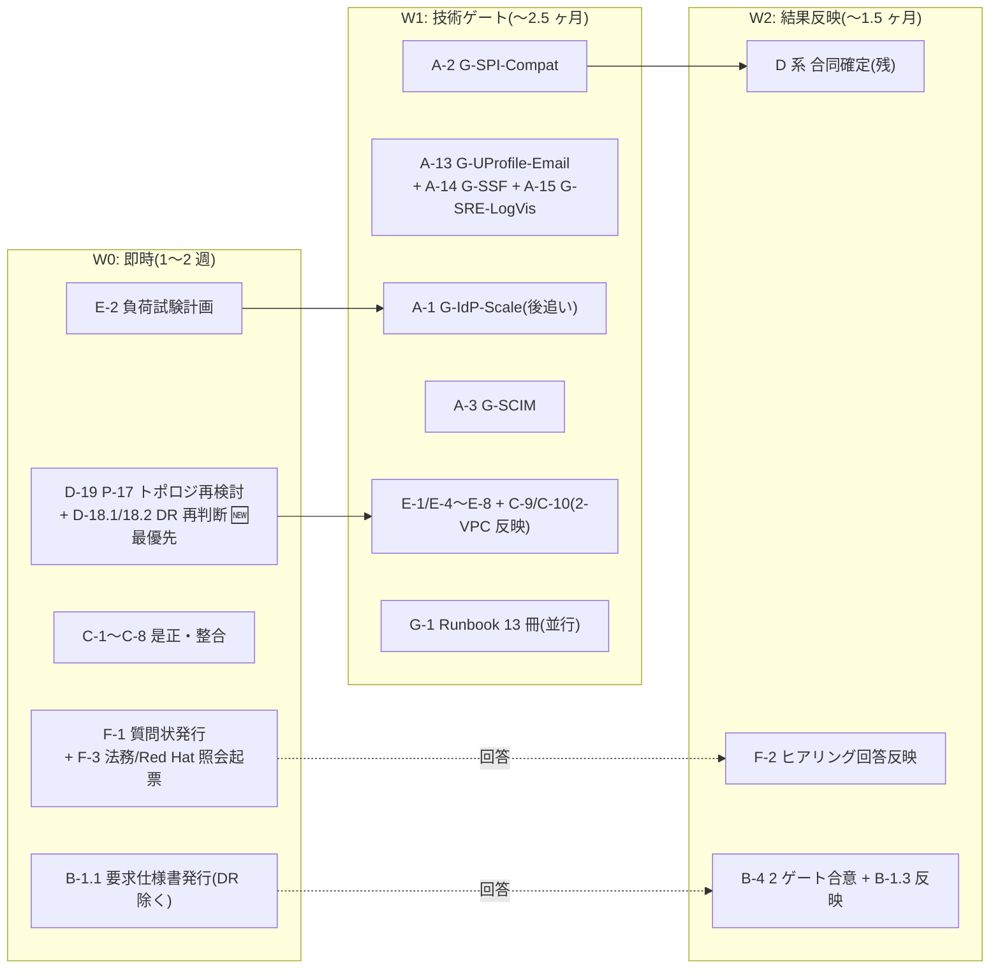

# 基本設計 残検討事項の全量棚卸しとタスク・工数計画

作成: 2026-07-30 / ステータス: **v2.2(2026-08-26)** — v2(原子タスク分解 + 場合分け + 8 月決定同期) に **クラスタ H「設計成果物の執筆」327 人日/116 項目を追加**(設計項目の網羅洗い出し。従来ゼロ計上だった最大の漏れ。v2.2 で完全原子化 + 漏れ 17 件追加)
入力: ①設計書内未決事項の全量収集(約 187 件、00〜10 + 02a + 06a + research 4 本)②要件側ゲート棚卸し(hearing-checklist 127 項目 + G-* 9 種)③決定済み領域マップ(正式決定 101 件 + P-01〜18 + U2/U5 節決定)④外部ベストプラクティス突合(Keycloak/ROSA/AWS 公式・一次情報)

## §0 本書の位置づけ・なぜ今この棚卸しか

基本設計 10 冊は初版完成済み(正式決定 101 件)だが、その決定の一部は「条件付き」(P-16 は G-IdP-Scale 未通過、RTO 1h は G-EDGE-DR 未合意、等)であり、各書末尾の未決トラッカー(O-* 約 60 件)+ 要件側ゲート(B-* / G-*)+ 外部突合で新規判明した検討漏れ領域が残っている。**詳細設計・構築・テストの計画を立てる前に、「基本設計として何を調査・検討し切る必要があるか」を 1 冊に集約し、正直で余裕を持った工数を付ける**のが本書の目的。

- **調査** = 事実確認・実測・PoC(答えは世界側にある。設計判断の入力を得る作業)
- **検討** = 設計判断 + 文書化(答えは我々が決める。レビュー往復・関連文書反映込み)
- **外部待ち** = 顧客ヒアリング / 他組織回答 / 法務 / 別スレッド。工数は「内部の準備・追撃・反映」分のみ計上し、先方リードタイムは計上外
- 重要事実: **hearing-checklist 全 127 項目中、回答済みは PoC 自己解決 4 件のみ(顧客回答ゼロ)**。**G-* PoC ゲートは全て未実施**。基本設計は暫定前提 P-01〜20 の凍結で「書き切った」状態

### 2026-07-30 意思決定による更新(v1.2)

ユーザー判断 10 件を反映(SSOT は [Baseline §1.4a](01-architecture-baseline.md))。要点:

- **解消/確定**: C-201 FIPS 不要(→**2026-08-16 に「顧客確認未了」へ格下げ**、F-2 分岐参照) / A-5-2 利用者カテゴリ(P-1〜P-4 全受入・全ユーザーフェデ化)/ B-BROK-1 = 50:50 暫定 / B-LDAP-1 LDAP 廃止 / B-PCI-1 PCI 対応不要 / G-IdP-Scale 仮定値化 / G-EGRESS 合意方向。
- **スコープ除外(タスク削除)**: G-LDAP(A-4)・LDAP 追加 Flow(D-10)/ G-PCI-WAF・B-MFA-PCI-1。
- **新規改訂タスク**: **D-17 アイデンティティモデル改訂** / **D-18 DR 改訂**(→ 2026-08-16 P-05 再オープンで D-18 は「再判断込み」に再構成、§2 参照)。

### v2(2026-08-26)の精緻化規約 — §2.0

ユーザー指摘「粒度不足・複数タスク混在・場合の網羅なし」を受け、次の規約で §1/§2 を全面改稿した:

1. **原子タスク = 0.5〜3 人日・1 行 1 成果物(または 1 判断)**。3 人日超は必ずサブ分解(x-y.z 採番)。
2. **場合分け(分岐)を明示**: 「〜の状態で〜の場合」に発生する追加作業は、各クラスタ末尾の**分岐表(C-* プール)**に「トリガー → 追加作業 → 増分人日」で列挙。**ベース合計には含めない**(期待経路のみ)。顕在化した時点でベースに繰入れる。
3. **8 月決定の同期**: 解消済みタスクは 0 化(取消線)、新規ゲート(G-UProfile-Email / G-SSF / G-SRE-LogVis)と再オープン(P-05 DR / P-17 トポロジ)、2-VPC 分離(B 案)反映をタスク化。
4. **v1.2 の算術不整合を是正**: A(表 87/実 88)・B(表 22/実 24)・D(表 50/実 43)・§1 244 vs §6 242。v2 は全行ボトムアップ再集計。

### 工数の前提(正直・余裕込み)

- 1 人日 = シニア設計者 1 名の実働(会議・レビュー往復・関連文書への反映込み)。**バッファ約 40% 込み**の値
- PoC 系はクラウド利用費・環境(ROSA クラスタ等)を別途要する。環境構築は各タスクに含む
- 並列性: クラスタ A(PoC)は 2 名並走可。クラスタ C/G は他と独立に着手可
- 本書は「基本設計を閉じる」までのタスク。詳細設計・構築・テスト計画は別掲([00b](00b-design-unit-breakdown.md) / [wbs-gap-audit §10](research/wbs-gap-audit-2026-08-12.md))

---

## §1 タスククラスタ一覧(サマリ、v2)

| クラスタ | 性質 | 調査(人日) | 検討(人日) | 条件付き(C プール) | 外部依存 |
|---|---|---:|---:|---:|---|
| **A. PoC・技術ゲート実測** | 性能実測 40 を ④へ移管（2026-08-27）+ **判定基準 3 条件での絞り込み 58 → 41（2026-08-31、[絞り込みノート](research/poc-scope-narrowing-2026-08-31.md)）**。**不足 3 項目を新規追加**（ブランド画面 / 閉域接続 / サポート範囲照会） | **41** | — | **+29** | クラウド費用のみ |
| **B. 他組織・エッジ連携確定** | 要求仕様書 v1 の発行〜回答反映(G-PCI-WAF 廃止分を是正) | — | **23** | +12 | 他組織回答 |
| **C. 設計是正・文書整合** | 既知の不整合是正 + **2-VPC 分離(B 案)の本文再編(C-9/10)** | — | **22** | — | なし |
| **D. 未確定設計の合同確定** | 合同設計判断。**D-3/D-4 解消・D-5 縮小 / D-18 再構成・D-19(P-17)・D-20 新規** | — | **56** | +13 | 一部 A/B 待ち |
| **E. 新規検討領域** | 外部突合で判明した領域抜け(v1 から据置・内訳列挙) | **10** | **23** | — | なし |
| **F. ヒアリング・契約・法務** | 質問状・回答反映(**悪い回答時の増分は分岐表**)+ Red Hat 照会追加 | — | **15** | +13 | 顧客・法務・Red Hat |
| **G. 運用実体化** | Runbook 13 冊の個別列挙・体制・図版 | — | **22** | — | なし |
| **H. 設計成果物の執筆** 🆕 | **設計項目（機能/画面/データ/IF/バッチ/権限）の網羅と資料作成**。**v2 まで工数ゼロ計上だった最大の漏れ**。v2.6 で **231 項目**（+ H-L ガイド 108 / 機能 91 実列挙 +15 / **データ設計をストア単位に分解し Keycloak と自前 DB を分離 +18**） | — | **560** | +87 | 一部 顧客レビュー |
| **ベース合計(期待経路)** | | **51** | **699** | | **総計 750 人日**（C 完了 -22 / PoC 絞り込み -17） |
| **条件付きプール(トリガー顕在時のみ)** | 分岐表 C-* / CH-* の総和 | | | **+152** | |
| (参考)G-2 Runbook 残 23 冊 | リリース後 3 ヶ月以内で可 | — | (20) | | 総計外 |

> ⚠ **クラスタ H は v2.1（2026-08-26 追加）**。ユーザー指摘「**基本設計に設計項目が全く入っていない**」を受け、**「設計書という成果物を書く工数」がゼロ計上だった**ことが判明。既存 10 冊（7,622 行）は決定記録・方式設計であり、**機能一覧 0 / API 一覧 0 / バッチ一覧 0 / 権限マトリクス 0 / ER 図 0 / コード体系 0**（機械検索で確認）。詳細は **[basic-design-deliverables-2026-08-26.md](research/basic-design-deliverables-2026-08-26.md)**。

**v1.2(244) → v2(269) の差分内訳**: 算術不整合是正 ±0(表記を実計へ)/ 解消 2 件(D-3/D-4)と D-5 縮小 **-7** / 新規ゲート A-13〜15 **+10** / 再オープン D-18 増分+D-19 新規 **+8** / 2-VPC 本文再編 C-9/10 **+5** / B-4 PCI 廃止是正 **-1** / F 追加(Red Hat 照会ほか) **+2** / 実計ベース差(88/24/43 起点) **+8**。**場合分け(+65)はベース外**で、従来「見えない超過リスク」だったものを明示化した。

**体制目安**: **クラスタ H(424 人日) 追加により大幅増** — 2 名専任で約 16 ヶ月 / 3 名で約 11 ヶ月 / 4 名で約 8.5 ヶ月。設計成果物(H)は調査系(A)と並走可能なため、**A/H の 2 系統並走**が最も効く。壁時計の律速は外部リードタイム(他組織回答・顧客ヒアリング・Red Hat DPA/照会)— W0 で外部依頼を先に投げるのが最重要(§4)。

---

## §2 クラスタ別タスク詳細(v2: 原子分解 + 分岐表)

### 横串ビュー — ServiceNow / JIT(クラスタ横断で散らばるため一覧化)

**ServiceNow 連携**(基本設計は U10 で決定済み、残は検証と移行設計の詰め):

| 段階 | 該当タスク / 参照 | 状態 |
|---|---|---|
| 基本設計の決定 | U10 D-U10-01〜06(パターン②=L1 SCIM+L2 SAML JIT / SAML Client CL-SN-01 / Matching Field / 並走 M0〜M3 / 削除連鎖 / Break Glass) | ✅ 確定済み |
| 実機検証 | **A-12** SAML Client 実機 + パターン②統合 + Matching Field + Webhook | 未実施 |
| 移行・並走・削除連鎖の設計詰め | **D-16** M0〜M3 詳細 + 削除連鎖 + Break Glass 実体 | 未着手 |
| SAML 証明書ローテ運用 | D-12(U10-OP-1、2 証明書並走) | D-12 に内包 |
| パターン選択・規模・PW 移行 | B-SN 系 21 項目(F-1/F-2、ヒアリング)。**②以外の回答時 = 分岐 C-A12** | 未回答 |
| 実装(作り込み) | [00b](00b-design-unit-breakdown.md) DU-U10-08 ほか | 基本設計スコープ外 |

**JIT の作り込み**(SPI 入出力仕様は確定済み。実装本体は構築フェーズ):

| 段階 | 該当タスク / 参照 | 状態 |
|---|---|---|
| SPI 入出力仕様 | U2 §2.4.1、U3 D3-07/09/12 | ✅ 確定済み |
| deprovisioning(退職者遮断) | U9 D-U9-17 + [ADR-064 outbox](../adr/064-deprovisioning-propagation-outbox.md) | ✅ 確定済み |
| 経路別 SPI 発火の検証 | A-2(SPI 互換)/ ~~A-4 LDAP 廃止~~ / A-5(SAML)/ A-6(実 IdP)/ **A-13(email 非保有)** | 未実施 |
| 追加設計(検証結果反映) | ~~D-10 廃止~~ / D-11(SAML テンプレート) | A-5 待ち |
| 契約前ゲート(ポリシー確定) | B-JIT-LC-1 / B-JIT-RA-1 / B-SCIM-JIT-1 / B-JIT-DEL-1/2(F-1/F-2) | 未回答 |

### A. PoC・技術ゲート実測(調査 41 人日 + 分岐 +29)

> 🔴 **2026-09-02: 災害対策（別地域への切替）を Phase 1 スコープ外に決定**（ユーザー判断）。**該当行は人日を残したまま「❌対象外（災害対策）」を付けた**（**復活時の見積りをそのまま使えるようにするため**）。**対象外の合計 20 人日**。同一地域内の復元は**残す**。詳細 = [dr-scope-decision](research/dr-scope-decision-2026-09-02.md)。

> **2026-08-27: 性能実測 40 人日を ④テストへ移管**（[移管ノート](research/perf-poc-to-test-2026-08-27.md)）。
> **2026-08-31: さらに絞り込み 58 → 41 人日**（[絞り込みノート](research/poc-scope-narrowing-2026-08-31.md)）。
> **判定基準 = ①外れたら設計が壊れる ②公開情報・照会では分からない ③後で判明すると高くつく の 3 つすべてを満たすものだけ PoC とする**。1 つでも欠ければ机上・照会・後工程へ回した。
> **不足していた 3 項目（A-16/17/18、7 人日）を新規追加**。
> ⚠ 本表は 2026-08-31 に**移管済み 12 行の削除漏れも是正**済み（旧・小計 98 のままだった）。

| # | サブタスク | 内容(成果物/完了条件) | 人日 | 依存 |
|---|---|---|---:|---|
| A-1.7 | 仮定値の根拠整理 | 接続先の数を実測せず仮定値で進める根拠と、あとで見直す条件の明文化 | 2 | — |
| **A-2.1** | **自社拡張の検証環境** | 製品版 + 独自イメージのビルド・配布チェーン（**配布運用そのものの検証を兼ねる**） | 2 | — |
| **A-2.2** 🔴 | **自社拡張 4 種の個別互換** | 振り分け / 自動登録 / 再有効化 / 多要素の記録 の各機能が製品版で動くか。**動かなければ振り分け方式から選び直し** | 3 | A-2.1 |
| **A-2.3** 🔴 | **拡張が全経路で発火するか** | 3 系統の配置で全経路発火（**置き場所を 1 つ間違えると発火しないことが検証済み**） | 2 | A-2.2 |
| A-2.4 | 周辺の互換 | 認証情報を保持しない設定での挙動・属性ポリシー（**脆弱性の回避は版数固定＝机上のため除外**） | 1 | A-2.1 |
| **A-3.1** | **受け取り窓口の試作** | 標準仕様の受信・認証・振り分けの最小実装（A-3.2 の前提。**性質は「作る作業」**） | 5 | — |
| **A-3.2** 🔴 | **相手方の適合検査に通るか** | 大手 2 社の検査ツールに合格（**文書化されていない癖があり、不合格なら顧客が利用者を送れない**） | 3 | A-3.1 |
| A-3.3 | 作成・更新・削除の写像 | 削除の受信を「消さずに無効化」へ写す設計の詰め（**端から端の確認は ④ST-03/04 と重複のため縮小**） | 1 | A-3.1 |
| **A-6.1** 🔴 | **相手方 実機① との差** | 発行元表記・ヒント・**多要素実施の記録**の実機差。**「顧客側が実施し本基盤は記録のみ」の責任分界がこれに依存** | 3 | — |
| A-6.2 | 相手方 実機② との差 | 実機②の差分。**旧方式（SAML）の検証を兼ねる**（旧 A-5 の模擬環境を統合。**実機の方が模擬より確度が高い**） | 2 | A-6.1 |
| **A-6.3** 🔴 | **実機での拡張の発火と記録** | 実機経由で拡張が発火し、多要素の記録が正しく載るか | 2 | A-6.1 |
| A-6.4 | 実機差の設計反映 | 属性の対応づけ・振り分け設計への差分反映 | 1 | A-6.3 |
| **A-13** 🔴 | **メール非保有者の 3 経路完走** | メールを任意にした状態で新規・自動登録・管理者作成の 3 経路が通るか。**製品側に既知の不具合が 2 件あり踏む可能性が高い** | 3 | A-2.1 |
| **A-16** 🆕🔴 | **ブランドごとの画面切替が 1 つの基盤で成立するか** | 組織単位でのテーマ適用・接続先の紐付け・振り分け画面との併用。**成立しなければブランドごとに基盤を分けることになり費用構造が変わる**。組織単位の切替は**製品の新機能で公開情報が乏しい** | **3** | A-2.1 |
| **A-17** 🆕🔴 | **分離した 2 つのネットワーク間の閉域接続が通るか** | 管理口・認証の裏経路への到達 / **逆向きに接続できないこと** / 名前解決の切り分け / 受け口作成の承認手続と所要時間。**区画は作成後に変更できない**ため構築前に必要 | **3** | — |
| **A-18** 🆕 | **製品ベンダーのサポート範囲の照会** | 自社拡張を載せた状態・独自イメージ配布・別系統 CPU の対応可否（A-7 と同時に照会）。**対象外なら 24 時間対応の体制設計の前提が変わる** | **1** | — |
| A-7 | 切替先の機材確保 ❌**対象外（災害対策）** | 在庫・上限・対応可否（**PoC ではなく AWS / ベンダーへの照会**で足りるため 3 → 1 に縮小） | 1 | — |
| A-9 | 接続情報の自動追随 | 該当機能の実在と動作（**管理画面を開けば実在有無は分かる**ため 2 → 0.5） | 0.5 | — |
| A-11 | テナントの存在を推測されないか | **旧 4 点のうち 3 点は公開情報・5 分で確認できるため除外**。振り分けヒントから存在有無が漏れないかのみ残す | 0.5 | — |
| A-14 | 状態変化の即時通知 | **製品側が試験的位置づけで本番採用しない前提**のため、自作との**机上比較**に留める（4 → 1） | 1 | — |
| A-15 | 記録の可視性 | **承認ゲートの有効化可否の照会のみ**。個人情報を出さないことの確認は ④SEC-06 と重複のため移管（3 → 1） | 1 | — |
| | **A 小計** | **21 行（旧 26 行）** | **41** | |

**A 分岐表(条件付き増分・トリガー顕在時のみ)**:

| 分岐 ID | トリガー(〜の状態で〜の場合) | 追加作業 | 増分 |
|---|---|---|---:|
| C-A2 | 自社拡張が製品版で動かない場合 | 上流製品の継続利用の判断 or 拡張の作り直し方針（実行基盤の前提への影響評価込み） | +5 |
| C-A3 | 適合検査で不合格項目が出た場合 | 写像・項目定義の再設計 + 再検証 | +3 |
| C-A6 | 実機で拡張が発火しないケースを発見した場合 | 配置の再設計 + 回帰 | +3 |
| C-A9 | 自動追随の機能が実在しない場合 | 手動入替 + 監視での運用代替設計（D-12） | +2 |
| **C-A12**（置換） | **業務システム連携が Phase 1 スコープに入る場合**（顧客回答 B-SN-3 待ち。**外れても認証基盤自体は成立する**ため本体から条件付きへ移動） | 接続設定・統合フロー・突合と通知の実機検証 | **+6** |
| **C-A16** 🆕 | **ブランド単位の画面切替が成立しない場合** | 接続元アプリ単位への降格設計 + 提案内容の修正 | **+4** |
| **C-A17** 🆕 | **閉域接続が成立しない場合** | ネットワーク構成の再設計（区画の採り直しを含む） | **+6** |
| | **合計** | | **+29** |

> **削除した分岐**: C-A1（性能未達）/ C-A10（同期送出が応答を悪化）は**性能実測の ④移管に伴い CT-2 へ統合済み**。
>
> 🔴 **着手順序の注意**: **A-6（8 人日）は相手方の試用環境の入手が律速**。**申込を最初に出し、待ち時間で A-2 / A-3 を進める**こと。

### B. 他組織・エッジ連携確定(検討 23 人日 + 分岐 +12 + 外部リードタイム)

REQ 全群(REQ-IN-01〜13 / REQ-OUT-01〜06 / REQ-DR-01〜05 = 全件未回答)がここに連鎖。~~G-PCI-WAF~~ は廃止済(v1.2 の B-4 記載は誤り、v2 で是正)。**REQ-DR 系は D-18(P-05 再判断)の結論が要求内容を決める**ため D-18 先行。

| # | サブタスク | 内容 | 人日 | 依存 |
|---|---|---|---:|---|
| B-1.1 | 他組織への要求事項の文書化と提出 | REQ-IN/OUT/DR 全 24 件の要求仕様書化 + O-4/O-7/O-10 論点添付 | 4 | DR 系のみ D-18.2 |
| B-1.2 | 先方からの質問への回答対応 | 質疑往復(2 巡想定)・論点整理 | 3 | B-1.1 |
| B-1.3 | 回答内容の設計への反映 | 回答が要求どおり合意した場合の各単元反映 | 5 | B-1.2 |
| B-2.1 | 配信基盤から先方の入口までの繋ぎ方の技術検討 | custom origin vs VPC origins × NFW ingress ルート × In-B 相性(REQ-IN-13/O-APP-1) | 3 | — |
| B-2.2 | 先方協議用の比較資料の作成 | 先方向け比較資料 | 2 | B-2.1 |
| B-3 | 使用するネットワーク番号の確定と重複確認 | 社内 NW・他組織・顧客 CIDR 入手と衝突確認(install 後変更不可のため構築前必須) | 2 | 社内 NW |
| B-4.1 | 外向き通信の許可運用に関する合意資料 | 方式①(初期一括+都度)の SLA 文言確定資料 | 1 | B-1.1 |
| B-4.2 | 災害時の入口切替に関する合意資料 ❌**対象外（災害対策）** | DR 方式再判断(D-18.2)結果を反映した合意資料 | 2 | **D-18.2** |
| B-5 | 死活監視を攻撃と誤検知させないための合意 | Canary 送信元の WAF 誤検知除外を REQ 追補へ | 1 | B-1.1 |
| | **B 小計** | | **23** | |

**B 分岐表**:

| 分岐 ID | トリガー | 追加作業 | 増分 |
|---|---|---|---:|
| C-B1 | 他組織の回答が要求と食い違った場合（入口方式・例外扱い・識別情報の付加などが認められない） | 該当箇所の設計再検討 + REQ 再発行 | +6 |
| C-B2 | 外向き通信を閉じる方式が採れない場合 | 案 A(NAT GW→NFW)への egress 再設計 | +3 |
| C-B3 | 配信基盤からの直接接続方式が採れない場合 | custom origin 前提の SG/prefix list 設計へ切替 | +2 |
| C-B4 | ネットワーク番号の重複が判明した場合 | CGNAT 退避([research](research/rosa-vpc-ip-conservation-2026-08-17.md))の適用設計 | +1 |

### C. 設計是正・文書整合 ✅ **2026-08-27 全 12 項目 完了（22 → 0 人日）**

> **ユーザー指示「C については既に直してしまいたい」により、WBS 項目として持たず実施した。**
> 実施の記録: [C-1/C-6 コミット](../../) `ed761a1` ／ [C-9/C-10] `cafa850` ／ [C-7/C-8] `2254326` ／ [C-2〜C-5] `e09e899`
>
> **是正の過程で新たに判明した重要事項 4 件**（いずれも当初の C の記述には無かった）:
> 1. **[D-U6-18 少数大型 Pod モデル](06-infra-network-design.md)を新設**（1 ノード 1 Pod）。「27 Pod」自体は正しかったが**前提モデルが未明文**で、同じ節の「Pod requests 2 vCPU」と矛盾していた。
> 2. **フェデ 50:50 で上限台数が不足**（IdP-KC 18 → **29**）。さらに**「ベースライン = 小型 3 台」が成立するのは 100 万 MAU かつ下限 TPS のときだけ**と判明し、初回リリースだけで費用に **3.7 倍の幅**があることが明確になった（[§6.2.3a](06-infra-network-design.md)）。
> 3. **[接続予算表](06-infra-network-design.md)を新設**。従来は認証製品の分だけ見て「大幅余裕」と評価しており、**関数群・バッチ・監視の枠が未計上**だった。
> 4. **前提が反転していた参照が 2 件**（Sorry 画面の実装位置 / **PAM は Out of Scope ではなく Phase 1 対象**）。

| # | サブタスク | 内容 | 人日 |

| # | サブタスク | 内容 | 人日 |
|---|---|---|---:|
| ✅ ~~C-1.1~~ | U6 是正: Pod モデル | 「27 Pod」不整合是正・少数大型 Pod モデルへの設計判断 | 1.5 |
| ✅ ~~C-1.2~~ | U6 是正: 接続予算 | D-U6-08 への接続予算規約追加 | 1 |
| ✅ ~~C-1.3~~ | U6 是正: 再計算 | フェデ:IdP-KC=50:50 + **P-02 時点分離(初回 100〜500 万 MAU)** での初期サイジング/コスト再計算(2026-08-16 反映) | 1.5 |
| ~~C-2~~ | ~~Baseline 整合 3 点~~ | ✅ **2026-08-27 完了** — ① NFR-3 は 10M 改訂済み(反映確認のみ) ② §C-7 は改訂済みで 01 側の「⬜ 残」が古かった → 解消記録に是正 ③ **「RT 30 日」は設定上限で実効は最大 24h** と精密化(U5 §5.2.2 で解消済みだったが U5 冒頭・P-09 表記が未追随) | ~~2~~ → 0 |
| ✅ ~~C-3~~ | ADR 反映残の一括処理(7 本×0.5) | ADR-051(12 項目)/053/059/019/048/038/023 §L.8 | 4 |
| ✅ ~~C-4~~ | 小粒登録 4 点 | legacy_spi D3-04 行 / REQ-IN-12 U6 登録 / REQ-OUT-06 起票 / A6a-2 承認 | 1 |
| ✅ ~~C-5~~ | 宙に浮いた参照 8 件の解消 | idp_priority(→D-1)/AAL 一覧(→D-2)/canary(→D-9)/L4 JIT API(→D-15)/drawio(→G-4)/00 計画書 Sorry 旧記述/§C-7 ⬜/ADR-040/036 追跡(→F-4)。**+ D-3/D-4 解消の後始末**(U3-OP-2/3 クローズ記録) | 2 |
| ✅ ~~C-6~~ | research 波及文書修正 | rosa-detailed-analysis §4/§7、rhbk-support-and-pricing §4.5 | 1 |
| ✅ ~~C-7~~ | PCI DSS スコープの Phase 1 除外化 | U7 の PCI 記述を「Phase 1 対象外(将来再開可)」へ降格 | 2 |
| ✅ ~~C-8~~ | LDAP 経路の対象外化 | U2/U3・ADR-025 §H へ「Phase 1 対象外」注記 | 1 |
| ✅ ~~**C-9** 🆕~~ | **U6 §6.2 の 2-VPC 分離(B 案)本文再編** | 決定ブロック止まりの現状を、サブネット 4 層→**VPC-K/VPC-M 2 VPC 構成**の本文として全面改稿([topology note](research/brand-unit-2vpc-topology-2026-08-18.md) を正、CIDR 実値は P-17(D-19)確定待ちの変数化) | 3 |
| ✅ ~~**C-10** 🆕~~ | **06a §A.6 の 2-VPC 反映** | 全体図・アカウント別詳細・IP 割当表を 2-VPC/EPS-OIDC/EPS-Admin 構成へ更新 | 2 |
| | **C 小計** | **全件完了（実施済み）** | **0** |

### D. 未確定設計の合同確定(検討 56 人日 + 分岐 +13)

> **2026-08-27 改訂**: **項目名を平易な日本語に書き換え**、`エンタイトルメント` / `ITDR` / `ATP` / `AAL` / `S2S` などの用語は**内容列へ移動**した。あわせて **1 行に複数の事柄が束ねられていた 3 行（旧 D-7 / D-8 / D-9.3）を 8 行に分割**（人日は不変）。

| # | サブタスク | 内容 | 人日 | 依存 |
|---|---|---|---:|---|
| D-1 | 接続先の表示順の決め方 | 1 つの組織に複数の接続先がある場合の優先順位と、選択画面での並び順をどう決めるか。U2×U4 合同（`idp_priority` 属性案、U2 §2.1.4 / U4 #10）| 2 | — |
| D-2 | 強い本人確認を要求する操作の一覧 | どの操作のときに追加の本人確認を求めるかの一覧。アプリ側との取り決めになるため前倒しで確定（AAL2/AAL3 の要求操作、U5 §5.9.1 #2）| 3 | B-APP-STEPUP-1 暫定可 |
| ~~D-3~~ | ~~対応づけデータの置き場所~~ ✅ **解消(2026-08-06 ADR-063: 権限系 Aurora に同居)** | — | 0 | — |
| ~~D-4~~ | ~~受け取り窓口の実行形態~~ ✅ **解消(2026-08-06 O-9: Lambda)** | — | 0 | — |
| D-5 | システム間で呼び合うときの権限の残り | 大半は解消済み（ADR-062/063/064: 内部 NLB・越境イベント 2 本）。残るのは**アカウントをまたぐイベント経路で、呼び出し側にどの権限を持たせるか**（サーバー間認可 `idm:*` スコープ、U5 §5.8）| 1 | — |
| D-6 | メール送信の設計 | 送信サービスの制限解除、なりすまし防止のための DNS 設定、ブランドごとの送信設定をコードで管理する方式（SES サンドボックス解除・SPF/DKIM・realm 単位 SMTP as-code、A6a-1）| 3 | — |
| **D-7a** | **不審な挙動の検知データを切替先にも置くか** ❌**対象外（災害対策）** | 検知の判定材料（端末・場所などの履歴）を保持する DB を大阪側にも持つか。持たないと切替直後に**全員が「初めての端末」扱い**になり追加確認が多発する（ITDR 用 DynamoDB、U7 O-U7-7）| **1.5** | D-18.2 |
| **D-7b** | **緊急時の入り口を切替先にどう用意するか** | 通常経路が使えないときに管理者が入るための仕組みを、大阪側にどう実体として持つか（Break-Glass、U8 O-U8-9）。**平時にクラスタが無い方式のため、入り口だけ先に用意できるかが論点** | **1.5** | D-18.2 |
| **D-8a** | **管理画面から作った利用者の区分値を分けるか** | テナント管理者が管理画面から作った利用者に、運用者が作った場合と**別の区分値を与えるか**（`provisioned_by=portal` の新設要否、U3 §3.8 D3-17）| **1** | — |
| **D-8b** | **顧客独自の項目をどこまで受け入れるか** | 顧客ごとに異なる追加項目を受け入れる**枠の決め方**（受入可能な項目名の接頭辞と上限、U2 §2.6）| **0.5** | — |
| **D-8c** | **アプリが作った利用者の扱いを選べるようにするか** | アプリ経由で作られた利用者を、**90 日の自動整理の対象にするかどうかをテナントが選べる**ようにするか（U3 §3.8）| **0.5** | — |
| D-9.1 | 権限テーブルとアプリ台帳のスキーマ統合 | 「誰がどのアプリを使えるか」の表と「どんなアプリがあるか」の台帳を、同じ場所・同じ ID 体系で持つ（U10-OP-3）| 1.5 | — |
| D-9.2 | 管理操作の記録をどこに置くか | 誰が何をしたかの記録を**ブランドごとに分けて持つか、中央に集めるか**。保存年数（消せない設定で 7 年）との整合込み（DU-U9O-09 と同一論点）| 1.5 | — |
| **D-9.3a** | **承認画面を他機能と共用するか** | 顧客追加の承認を行う画面を、既存の管理画面と共用するか独立させるか（U10-OP-6）| **0.5** | — |
| **D-9.3b** | **監視用の読み取り専用資格の権限範囲** | 死活監視が使う資格に、**どこまで読める権限を与えるか**の規約（U10-OP-7、U5 §5.8 のスコープ規約に準拠）| **1** | — |
| **D-9.3c** | **管理 API の応答目標をどこまで含めるか** | 管理 API の応答時間の目標値を、どこからどこまでの区間で測るかの境界（U10-OP-8）| **0.5** | — |
| D-11 | 旧方式の接続先を追加するときの雛形 | 旧方式（SAML）の接続先を登録する際の、属性の対応づけを含む設定の雛形（U2 §2.8.2。A-5 の識別子の差分を反映）| 2 | **A-5** |
| D-12 | 証明書・鍵の入れ替え運用の設計 | 接続先の証明書、連携先へ渡す鍵、署名用の鍵の**3 種類それぞれの入れ替え手順と周期**（A-9 結果反映 + U10-OP-1 + 3〜6 ヶ月周期）| 3 | **A-9** |
| D-13 | 締め出しと危険度判定の整合 | 連続失敗による締め出しの条件と、危険度スコアによる追加確認の条件が**互いに矛盾しないか**の突合（U7 §7.2.1）| 2 | — |
| D-14 | 攻撃対策の画面側対応と文言の最終化 | 前段の攻撃対策が必要とする**画面側の埋め込み**と、接続先の振り分け画面の**文言の最終稿**（ATP フォームフィールド、U7 §7.8.1 / U4 §4.1.3）| 1 | — |
| D-15 | 権限を一時的に上げる仕組みの置き場所 | 運用者が必要なときだけ管理権限を得る仕組みを、**管理画面の裏側に同居させるか独立させるか**（U7 §7.6.1。**[ADR-040](../adr/040-pam-jit-admin-privilege-management.md) は Phase 1 実装対象**）| 2 | F-4 |
| D-16.1 | 業務システム移行: 段階ごとの手順 | 並走しながら 4 段階で切り替える手順の詳細（U10 §10.4）| 2 | B-SN 暫定可 |
| D-16.2 | 業務システム移行: 停止の連鎖と緊急時の入り口 | 本基盤側で止めると連携先の利用も止まる仕組みと、緊急時の入り口の実体（連携先の利用者情報は履歴保持のため残す、D-U10-06）| 1 | — |
| D-16.3 | 業務システム移行: 連携先のみの利用者の扱い | 連携先にしか存在しない利用者を移すか、パスワードを引き継ぐかの判断（B-SN-9/10/18/19）| 1 | — |
| D-17.1 | 全員が外部連携になる前提への改訂: ログイン処理の順序 | 運用者以外は全員が外部の認証システムを使う前提への書き換え（U2 §2.3.1）| 1 | — |
| D-17.2 | 同上: 利用者の作られ方の一覧 | 利用者が生まれる経路の表を、運用者が直接作る場合に限定する形へ書き換え（D3-04 経路表）| 1.5 | — |
| D-17.3 | 同上: 追加確認の画面の流れ | 追加確認が必要な場面の分類を再定義（D-U4-04）| 1 | — |
| D-17.4 | 同上: 追加確認を誰が実施するかの分界 | 外部連携の利用者については**顧客側が実施し、本基盤は記録のみ**とする形へ書き換え（D-U7-14）| 1 | — |
| D-17.5 | 同上: 4 冊まとめての整合レビュー | 上記 4 件が互いに矛盾していないかの突合 | 0.5 | D-17.1〜4 |
| **D-18.1** | **切替方式の再判断: 成立するかの分析** ❌**対象外（災害対策）** | 顧客希望（切替 1 日 / 切替先も壊れた場合 3 日 / 失うデータ 5 分以内）と現行方式（切替に約 14 日）の矛盾を、DB の制約込みで定量分析（U8 §8.3.1a。2026-08-16 P-05 再オープン）| 2 | — |
| **D-18.2** | **切替方式の再判断: 方式決定** ❌**対象外（災害対策）** | ① 現行維持 + 契約文言の調整 ② 一部を常時動かす方式への変更、の比較と決定（ヒアリング B-DR 系と連動）| 3 | D-18.1 |
| D-18.3 | 切替方式の改訂: 本文への反映 ❌**対象外（災害対策）** | 決定した方式での本文改訂（2 つの障害想定・消せないバックアップ込み）。**2 ネットワーク分離と DB 3 系統を織り込んだ復旧順序の再定義を含む**（[ADR-051 §2026-08 追記](../adr/051-multi-region-dr-failover.md)）| 4 | D-18.2 |
| D-18.4 | 切替方式の改訂: 手順書の骨子 ❌**対象外（災害対策）** | 切替先での再構築と復元の手順書の骨子（G-1 の DR-00〜05 と連動）| 2 | D-18.3 |
| **D-19** 🆕 | **クラスタの分け方の再検討** | 「利用者を直接収容する側をどうするか」= **別アカウントで 2 クラスタ（従前）／1 クラスタに 2 区画／その他**の比較・決定（ADR-033 改訂）。**2 ネットワーク分離（C-9）の CIDR 実値・切替対象・費用の前提になる**（2026-08-16 凍結解除）| 5 | — |
| **D-18.5** 🆕 | **災害対策をスコープ外とする判断の記録と顧客への説明資料** | 「別地域への切替は行わない」判断の根拠・リスク・契約文言案・**将来復活する場合の追加見積**をまとめる | 2 | — |
| **D-21** 🆕 | **将来の切替先のための番号予約** | 別地域に切り替える構成を将来足せるよう、**ネットワークの番号だけ確保しておく**。**作成後に変更できないため、今やらないと将来やりたくなっても入り口で詰まる** | 0.5 | — |
| **A-19** 🆕 | **処理の重さが違うものを同居させて成立するかの実測** | パスワード計算の集中が、顧客の認証システム経由のログインに与える影響を実機で測る。**悪化する場合の緩和策（優先度・上限）まで含める**。**飛ばすと本番で「パスワードログインが増えた日に他が遅くなる」事象を踏む** | 3 | A-2.1 |
| **D-20** 🆕 | **生ログに個人情報を出さない方式の設計** | 認証製品がノードに書き出す記録に個人情報を含めない方式（出力設定・記録の出し方・本番の出力レベル固定 = 禁則 K-13 の実現方式）。**[基盤の運用元から閲覧されうる](research/rosa-sre-live-log-visibility-2026-08-14.md)ため根本対策にあたる**。A-15 の実機確認の入力 | 2 | — |
| | **D 小計** | **33 行（旧 28 行。複数事項が束ねられていた 3 行を 8 行に分割）** | **56** | |

**D 分岐表**:

| 分岐 ID | トリガー | 追加作業 | 増分 |
|---|---|---|---:|
| C-D18 | D-18.2 で一部常時稼働の方式を決定した場合 | 常時費用・切替先の常設構成・設備費の再設計 | +5 |
| C-D19 | D-19 でクラスタ構成を変更する決定の場合 | U6/06a/CIDR/ADR-033/062/063 の波及改訂 + 2 ネットワーク分離設計（C-9/C-10）の手戻り | +8 |

### E. 新規検討領域(調査 10 + 検討 23 人日)

| # | サブタスク | 内容 | 種別 | 人日 |
|---|---|---|---|---:|
| E-1.1 | 開発・検証環境: 費用と共用方式の調査 | 既存慣行・ROSA 非本番の費用/共用オプション調査 | 調査 | 2 |
| E-1.2 | 開発・検証環境: 構成と共用方針の決定 | Acct 構成・クラスタ数/共用方針の決定 | 検討 | 3 |
| E-1.3 | 開発・検証環境: 試験用データの作り方と費用見積 | 合成データ方針(D-U9-19 連動)+ 環境コスト見積 | 検討 | 3 |
| E-2 | 性能試験の全体計画書 | keycloak-benchmark/Gatling・dataset・合格基準・「Pod 増で 1 Pod 性能低下」織込み(A-1 の前提) | 検討 | 4 |
| E-3 | 継続的な費用管理の仕組み | タグ戦略(SCP/Config 補完)・予算アラート・テナント別原価・O-6 回収 | 検討 | 4 |
| E-4 | 認証製品の本番設定 5 項目の詰め | `http-max-queued-requests` / 公開パス遮断表 / JGroups mTLS 30 日ローテ / jdbc-ping / persistent-user-sessions 確認 | 調査 2+検討 3 | 5 |
| E-5 | 製品更新の運用手順の精密化 | `update-compatibility check` CI 組込み / recreate=全停止のメンテ窓設計 / RHBK EUS(A-11 連動) | 調査 2+検討 3 | 5 |
| E-6 | DB 接続に公式部品を使うかの判断 | AWS Advanced JDBC Wrapper / `migration-strategy` 選定 / 暗号化範囲確認 | 調査 2+検討 1 | 3 |
| E-7 | 基盤の記録を中央に集める際の制約確認 | CloudWatch 別 Acct 直接転送非サポート確認 + D-U9-01/05 整合 | 調査 2+検討 1 | 3 |
| E-8 | 総当たり攻撃と利用者名の推測への対策 | 公式 4 戦略から選定・明文化 | 検討 | 1 |
| | **E 小計** | | | **33** |

### F. ヒアリング・契約・法務(検討 15 人日 + 分岐 +13 + 外部リードタイム)

| # | サブタスク | 内容 | 人日 |
|---|---|---|---:|
| F-1 | 顧客向け質問状の整理と提出形式化 | 127 項目の優先度圧縮(残は B-SN/B-MIG/B-TAP/B-DR/UX 系中心。customer-questionnaire/ 整備と連動) | 2 |
| F-2 | 顧客回答の設計への反映 | 回答が暫定前提を**追認**した場合の P 表更新+影響単元反映 | 8 |
| F-3 | 法務およびベンダーへの照会と回収 | Red Hat DPA(SRE 越境)+ **B-SRE-LOG-1/2(Approved Access・oc logs 監査可視性)+ B-DPA-2(SRE 地理制限)** + Key Custodian + PPC 雛形 + 契約テンプレ | 3 |
| F-4 | 並行検討していた運用要件の本体への統合 | OOS 残存参照整理(O-U9-9) | 2 |
| | **F 小計** | | **15** |

**F 分岐表(悪い回答時の増分 — v1 で「別途増分」とだけ書かれ数字が無かったもの)**:

| 分岐 ID | トリガー | 追加作業 | 増分 |
|---|---|---|---:|
| C-F1 | 特定の暗号規格への準拠が「必要」と回答された場合(2026-08-16 に確定→未了へ格下げ済) | U7 FIPS 140-3 対応設計(暗号モジュール・ROSA FIPS モード・影響全単元) | +8 |
| C-F2 | 顧客が復旧時間・データ損失の目標を譲らない場合 | → C-D18(ウォーム復活)に合流 | (C-D18) |
| C-F3 | 識別子や画面まわりで特殊な要望が出た場合 | HRD 文言・識別子体系の部分再設計 | +2 |
| C-F4 | B-MIG 系で移行方式変更(一括→段階等)が出た場合 | U10 §10.4 移行設計の再構成 | +3 |

### G. 運用実体化(検討 22 人日 + 参考 20)

| # | サブタスク | 内容 | 人日 |
|---|---|---|---:|
| G-1.1 | 手順書: 顧客の追加 | IdP オンボーディング 6 ステップの手順書化 | 1.5 |
| G-1.2 | 手順書: 顧客の解約 | 段階削除(30/90 日+エクスポート+証明書) | 1.5 |
| G-1.3 | 手順書: 事故発生時の初動 | ITDR L3/L4 起点の初動(APPI 速報タイマ連動) | 1.5 |
| G-1.4 | 手順書: 情報漏えい時の報告 | D-U7-15 の 7 ステップ実手順 | 1.5 |
| G-1.5 | 手順書: 鍵の緊急入れ替え | §7.1.3 の実手順 | 1 |
| G-1.6 | 手順書: 緊急時の管理者アクセス | 発動・使用・事後(役員承認・監査) | 1.5 |
| G-1.7 | 手順書: 強制ログアウト（3 つの範囲別） | U5 §5.4 の粒度別実手順 | 1 |
| G-1.8 | 手順書: 災害時の切替判断 ❌**対象外（災害対策）** | 判断基準・ITDR フラグ(K-4) | 1 |
| G-1.9 | 手順書: 切替先での再構築 ❌**対象外（災害対策）** | ROSA 再構築+IaC 適用(D-18 決定方式で書く) | 2.5 |
| G-1.10 | 手順書: データの復元 | PITR/イミュータブル SS リストア(論理破壊系) | 2 |
| G-1.11 | 手順書: 元の地域への復帰 ❌**対象外（災害対策）** | 東京復帰・整合確認 | 1 |
| G-3 | 当番体制と通知先の割り当て | PagerDuty 契約・ローテーション(O-U9-6) | 2 |
| G-4.1 | 構成図の清書: 全体図 | 2-VPC/ブランドユニット反映の AWS アイコン版 | 2 |
| G-4.2 | 構成図の清書: ネットワーク詳細図 | 旧 EKS 図置換 + EPS-OIDC/EPS-Admin/EventBridge 経路 | 2 |
| | **G 小計** | | **22** |
| (G-2) | (参考・総計外)手順書の残り 23 冊 — リリース後 3 ヶ月以内 | D-U9-07 | (20) |

> ⚠ G-1 の必須 13 冊 = TEN-01/03 + SEC-01/02/04/05/06 + DR-00〜05([U9 D-U9-07](09-operations-observability-design.md) が正。SEC-03 はエッジ WAF が他組織回答依存のため含めない — 2026-08-18 是正)。

### H. 設計成果物の執筆(検討 280 人日 + 分岐 +87) 🆕

**v2 まで工数ゼロだった「設計書を書く」工数**。既存 10 冊は下敷きとして活用する前提の単価。**詳細な項目別内訳は [basic-design-deliverables-2026-08-26.md](research/basic-design-deliverables-2026-08-26.md) §3**（H-01〜H-32 の 32 成果物、各内訳付き）。

| 群 | 項目数 | 主な成果物（❌ = 既存カバー皆無 / 🆕 = v2.2 漏れ追加） | 人日 |
|---|---:|---|---:|
| H-A 全体・方式 | 27 | 総則/全体構成図・方式設計(エラー/ログ/Tx/**🆕排他制御**/**🆕キャッシュ**/**🆕採番**)・設計標準規約・**🆕性能設計書**・**🆕キャパシティ/データ量見積**・**🆕ブラウザ方針**・**❌トレーサビリティ**・**🆕鍵管理設計書(ADR-045)**・**🆕NHI 台帳設計(ADR-066)** | 56 |
| H-B 機能設計 | 38 | **❌機能 ID 体系・機能一覧（約 70 機能を系統別に洗い出し）**・**❌機能仕様書 70 本**・業務フロー 15・状態遷移 2・**🆕検索/一覧表示**・**🆕ファイル入出力**・**🆕レポート/エクスポート**。**機能 91 を実列挙（[機能一覧](research/function-list-2026-08-26.md)）+ 機能仕様書 22 行に再分割** | 93.5 |
| H-C 画面設計 | 11 | 画面一覧/遷移図 2 系統・**❌画面仕様書 32 本**・UI 標準(A11y)・**❌メッセージ/エラーコード 3 種**・**🆕メール通知テンプレート** | 40 |
| H-D データ設計 | 25 | **❌ER 図(論理/物理)**・**❌テーブル定義書(自前 20 を 3 分割)**・属性辞書・**❌コード体系 3 種**・**❌CRUD 図**・**🆕データ保持/アーカイブ**・**🆕インデックス/パーティション**。**ストア単位に分解（[データストア別 WBS](research/data-store-wbs-refinement-2026-08-26.md)）** | 58 |
| H-E IF 設計 | 20 | **❌IF 一覧 3 種**・API 仕様書(idm-api 30EP を 3 分割)・SCIM IF・イベント IF・Webhook・認証プロトコル IF・外部システム IF 3 種・**🆕証明書/鍵一覧**・**🆕FQDN/DNS 一覧** | 53 |
| H-F バッチ設計 | 7 | **❌バッチ一覧**・実行基盤・バッチ仕様書 3 群・ジョブスケジュール・多重起動/リラン | 13.5 |
| H-G 権限・監査 | 8 | ロール定義・**❌権限マトリクス 2 種**・監査ログイベント一覧/取得項目表・認可判定ログ統合・**🆕ITDR 検知ルール/Golden シグナル(ADR-035/060)**・**🆕攻撃経路対応表(33 経路)** | 21 |
| H-H 運用補完 | 5 | 監視項目一覧 2 種・閾値/通知先・**🆕テナントオンボーディング設計**・**🆕環境設計書** | 12 |
| H-I レビュー・合意 | 6 | 整合性レビュー 2 巡(各レビュー+改訂)・ステークホルダー説明資料/説明会 | 22 |
| **H-J プロダクト固有設計** 🆕 | 19 | **Realm/Organizations 構成・Authentication Flow 木・Custom SPI 仕様 4 本・Protocol Mapper/Client Scope・User Profile 宣言・Client 登録テンプレ・Realm パラメータ・2-tier フェデ・ブランドユニット・Broker shadow・IdP 接続仕様テンプレ・IdP 属性マッピング・HRD 解決ロジック・ROSA クラスタ構成・RHBK Operator/CR・ROSA 運用境界** | 56 |
| **H-K 契約・顧客提供成果物** 🆕 | 9 | **責任分界表(ADR-037)・SLA/SLO・RP 実装ガイド・テナント管理者ガイド・顧客 IdP 接続ガイド・Trust Center・DSAR 手順・オンボ案内・サービス仕様/制約事項一覧** | 30 |
| **H-L 認証実装ガイド** 🆕 | 53 | **10 部 50 章**（統合前の意思決定/オンボーディング/アプリ種別別/**コア実装 12 章**/セキュリティ/エラー/連携/運用/テスト移行/リファレンス。[目次ノート](research/rp-integration-guide-toc-2026-08-26.md)） | 108 |
| | **231** | **H 小計** | **560** |

**規模前提**（変動時は CH-* で吸収）: 機能 約 70 / 画面 約 32 / 自前テーブル 約 20 / API 約 45EP / バッチ 8。**単価 = 棚卸し + 執筆 + 図版 + レビュー 2 巡 + 改訂**（±40% 込み）。
**精度向上の要点**: **HB-01〜08 機能一覧(11.5 人日)を最優先で実施**し、完了時点で規模前提を実測値に更新して **HB-09〜14 / HC-04〜05 を再見積り**するのが最も効く。**全 116 項目の一覧は [basic-design-deliverables §3](research/basic-design-deliverables-2026-08-26.md)**（HA-01〜HI-06、1 項目 1 行）。

---

## §2C 条件付きプール一覧(トリガー顕在時のみベースへ繰入れ)

| 群 | 分岐 | 小計 |
|---|---|---:|
| A(PoC FAIL 系) | C-A1(+8) C-A2(+5) C-A3(+3) C-A6(+3) C-A9(+2) C-A10(+3) C-A12(+3) | **+27** |
| B(他組織回答乖離系) | C-B1(+6) C-B2(+3) C-B3(+2) C-B4(+1) | **+12** |
| D(再オープン決定系) | C-D18(+5) C-D19(+8) | **+13** |
| F(悪い回答系) | C-F1(+8) C-F3(+2) C-F4(+3) | **+13** |
| **H(設計成果物系)** 🆕 | CH-1 レビュー大幅指摘(+20) CH-2 機能数超過 100 超(+18) CH-3 画面数増 32→50(+9) CH-4 要件追加(+15) CH-5 既存 10 冊の全面清書(+25) | **+87** |
| **合計** | | **+152** |

- 運用: 分岐が顕在化したら該当 C-* をベースに繰入れ、§1 サマリを更新する。**予算計画上は「750 + リスク引当 154 = 904 人日を上限」**と読む。
- 相互排他に注意: C-F2 は C-D18 と同一実体(二重計上しない)。C-A12 は SN 再検証+U10 改訂込み。

---

## §3 外部待ち全量(工数外・アクション管理)

### 3.1 ブロック度「高」の現状

**2026-07-30 に 11 件中 9 件解消 → 2026-08 の再オープンで実質残は 4 件**:

| ID | 状態 |
|---|---|
| **G-SPI-Compat** | ⏳ 検証する(A-2、残ブロッカー①) |
| **G-DPA** | ⏳ APPI 同意は取得方針。残 = Red Hat SRE 越境閲覧の確認(**G-SRE-LogVis に細分化**、A-15/D-20/F-3) |
| **P-05 DR** 🆕 | ⚠ 再オープン(2026-08-16、顧客希望 RTO1 日/RPO5 分 vs コールド矛盾)→ D-18.1/18.2 |
| **P-17 トポロジ** 🆕 | ⚠ 再オープン(2026-08-16、2 クラスタ構成の再検討)→ D-19 |
| ~~C-201 FIPS~~ | ⚠ 「不要(見込み)」へ格下げ(2026-08-16)。Yes 転回時は C-F1(+8) |
| ~~A-5-2 / B-BROK-1 / B-LDAP-1 / B-PCI-1 / G-LDAP / G-EDGE-DR / G-EGRESS~~ | ✅ 解消(v1.2 のとおり) |
| G-IdP-Scale | ⬇ 仮定値化(A-1 は後追い検証) |

### 3.2 群単位の外部待ち(回答受領後 F-2 で反映)

- **Phase 1 契約前ゲート束**: U3 の 8 項目(B-JIT-LC-1 / B-JIT-RA-1 / B-SCIM-JIT-1/3 / B-JIT-DEL-1/2 / B-TENANT-SWITCH-1 / B-TENANT-EXIT-1)+ B-PAM-1/2 + G-DPA(G-SRE-LogVis 含む)+ G-EGRESS
- **ヒアリング群**: B-SN 系 21 / B-MIG 系 12 / B-IDM 系 12 / B-TAP 系 10 / B-DR 系 5(**P-05 再オープンで最優先化**)/ B-APP-OIDC 3 / B-618〜629(UX)/ B-AA・B-ITDR / B-OBS 2〜5 / B-KMS-3 / B-LOG-1 ほか(未回答 123)
- **Red Hat 照会** 🆕: B-SRE-LOG-1(Approved Access の break-glass ゲート・HCP GA)/ B-SRE-LOG-2(oc logs read の顧客監査可視性)/ B-DPA-2(SRE 地理制限の契約保証)
- **他組織回答**: REQ-IN-01〜13 / REQ-OUT-01〜06 / REQ-DR-01〜05(B-1 で発行)
- **社内・その他**: Stage A Terraform 書換工数承認(ADR-056 採用条件 ③)/ ROSA 3y 見積(O-6)/ 社内 NW CIDR(B-3)/ ADR-040/036 別スレッド(F-4)

---

## §4 推奨実行順序(Wave)とクリティカルパス

- **クリティカルパス(内部)**: **D-19(P-17)と D-18.1/18.2(DR)が最上流**(CIDR 実値・DR 対象・REQ-DR 内容・C-1 コストの前提)→ C-9/C-10 → A 系 → D 残
- **クリティカルパス(外部)**: F-1/B-1/F-3 の発行が遅れるほど W2 が後ろへずれる。**工数より先に「依頼を出す」ことが律速** — W0 は 2 週間で完了させる
- **リスク早期化**: C-F1(FIPS)・C-D19(トポロジ変更)・G-DPA/G-SRE-LogVis は「顕在時の設計影響が最大」— W0 で D-19/D-18 と Red Hat 照会を必ず先行

## §5 本書の次(詳細設計・構築・テストへの接続)

本書のタスクが閉じた時点で、以下を別途計画する(本書のスコープ外):

1. **詳細設計**: 各 D-* 決定のパラメータ表・Terraform モジュール構造・SPI 詳細仕様・idm-api OpenAPI 詳細化(U10)・RP 実装ガイド完全版(U5 §5.6)
2. **構築**: Stage A Terraform(6-8 週、ADR-056)→ ROSA/RHBK → SPI/Facade 実装 → ServiceNow SAML Client / Webhook Dispatcher 構築
3. **テスト**: **[wbs-gap-audit §10](research/wbs-gap-audit-2026-08-12.md) の 30 項目 363 人日を正とする**(E-2 計画・DR Game Day・A11y・ペネトレ含む)
4. **移行**: U10 §10.4 の 4 集団移行のリハーサル計画(RB-MIG-01)

## §6 実装(構築)フェーズの概算工数 — 予備見積り

> **2026-08 注記**: 本節は v1 の粗見積(レンジ)。**詳細設計+構築の確定値は [00b](00b-design-unit-breakdown.md)(全 DU ボトムアップ ≈1,044 人日)/ テストは [wbs-gap-audit §10](research/wbs-gap-audit-2026-08-12.md)(363 人日)を正**とし、本節は参考(内訳の考え方)として保持する。

| # | ワークストリーム | 主な中身 | 人日(レンジ) |
|---|---|---|---:|
| I-1 | 基盤構成をコードで管理する仕組み | マルチアカウント・ROSA HCP(大阪はオンデマンド)・Aurora×2・KMS・IRSA・PrivateLink/TGW。Stage A 書換(6-8 週)含む | 45–60 |
| I-2 | 認証製品の基盤構成 | Operator デプロイ・Realm/Org・User Profile・Flow 木・Mapper・Client Scope の as-code | 15–20 |
| I-3 | 自社で作る拡張機能 4 種 | JIT 制御 / HRD / Event Listener / mfa_indicator + ビルド・署名・テストハーネス | 35–45 |
| I-4 | 利用者情報の受け取り窓口（自社開発） | SCIM 2.0 受信・テナント別ルーティング・Admin API 写像・冪等/流量制御 | 20–30 |
| I-5 | 管理用 API | OpenAPI・CC スコープ・/api/me/*・エンタイトルメント・Webhook Dispatcher | 30–40 |
| I-6 | 管理画面 | 自作 SPA・3 層スコープ(ADR-038) | 25–35 |
| I-7 | 利用者向け画面群 | ログイン Theme(i18n/WCAG 2.2 AA)+ Sorry SPA + Launchpad SPA | 30–40 |
| I-8 | 業務システムとの連携 | SAML Client + L2 JIT + Webhook 配信 | 10–15 |
| I-9 | 利用者の整理を行う定期処理 | 退職者遮断 CronJob + 日次リコンサイル | 8–12 |
| I-10 | 監視・記録の仕組み | OTel/AMP/AMG・SLO・Fluent Bit scrubbing・ITDR 検知 | 25–35 |
| I-11 | 自動ビルド・自動配備の仕組み | GitHub Actions・ArgoCD・ESO・ドリフト検知 | 18–25 |
| ~~I-12~~ | ~~移行ツール~~ 🚫 対象外(2026-08-17 — 移行はアプリ側) | — | 0 |
| I-13 | セキュリティ設定一式 | KMS・IRSA・PAM(IIC/SSM)・WAF 要求連携 | 12–18 |
| | **構築 小計** | | **285–393** |

- **前提**: 詳細設計完了後に着手。基本設計クローズ(v2: 269 人日 + 条件付き 65)とは別。
- **並列性**: I-1/I-2(基盤)が先行、I-3〜I-9 は基盤後に 3-4 名並走可。壁時計では ~6〜9 ヶ月。

## 改訂履歴

- 2026-07-30 (v1): 初版。4 系統調査を統合し 7 クラスタ・総計 232 人日で棚卸し。
- 2026-07-30 (v1.1): ServiceNow タスク明示化(A-12/D-16)+ 横串ビュー追加。総計 242 人日。
- 2026-07-30 (v1.2): ユーザー意思決定 10 件反映(LDAP/PCI 除外・D-17/D-18 新設・G-IdP-Scale 仮定値化)。総計 244 人日(表記)。§6 構築概算 ≈325〜455 人日 新設。
- 2026-08-26 (v2): **粒度精緻化版(ユーザー指摘: 粒度不足/複数タスク混在/場合の網羅なし)**。①原子タスク 0.5〜3 人日へ全行分解(35 行→約 90 行)②**場合分け = 分岐表 C-*(条件付きプール +65 人日)を新設**(PoC FAIL/他組織回答乖離/悪い回答/再オープン決定)③ 8 月決定の同期(D-3/D-4 解消・D-5 縮小 / A-13 G-UProfile-Email・A-14 G-SSF・A-15 G-SRE-LogVis 新規 / D-18 再構成(P-05 再オープン)・D-19(P-17 再検討)・D-20(stdout マスキング)・C-9/C-10(2-VPC 本文再編)/ F-3 Red Hat 照会)④ v1.2 算術不整合 4 件是正(A 87/88・B 22/24・D 50/43・§1 244 vs §6 242)。**ベース総計 244 → 269 人日 + 条件付き 65(上限 334)**。§4 Wave を D-19/D-18 最優先に再構成。
- 2026-08-26 (v2.1): **ユーザー指摘「基本設計に設計項目が全く入っていない」を受け クラスタ H「設計成果物の執筆」= 280 人日を新設**。既存 10 冊(7,622 行)は決定記録・方式設計であり、**機能一覧 0 / 機能仕様 0 / API 一覧 0 / バッチ一覧 0 / 権限マトリクス 0 / ER 図 0 / コード体系 0 / メッセージ一覧 0**（機械検索で確認）＝ **業務システム設計の中核が体系として不在**だった。H-01〜H-32 の 32 成果物を網羅列挙し、**資料作成工数(棚卸し+執筆+図版+レビュー 2 巡+改訂)**で分解（詳細 = [basic-design-deliverables-2026-08-26.md](research/basic-design-deliverables-2026-08-26.md)）。分岐 CH-1〜5(+87) を追加。**ベース 269 → 549 人日 / 条件付き 65 → 152 / 上限 701**。体制目安を 2 名 13 ヶ月 / 3 名 9 ヶ月へ改訂。
- 2026-08-26 (v2.2): **ユーザー指摘「項目ごとになっていない(`;` 区切りを 1 行に)」「基本設計の漏れを確実に確認」を反映**。① クラスタ H を **32 成果物 → 116 項目に完全原子化**（`;` 連結を全廃、HA-01〜HI-06 の 1 項目 1 行・各 1〜5 人日）② **一般的な基本設計成果物 42 種と突合し漏れ 17 件を追加**（排他制御 / キャッシュ / 採番 / API バージョニング / **性能設計書** / **キャパシティ・データ量見積** / ブラウザ方針 / 検索・一覧表示 / ファイル入出力 / レポート・エクスポート / **メール通知テンプレート** / データ保持・アーカイブ / インデックス・パーティション / **証明書・鍵一覧** / FQDN・DNS 一覧 / テナントオンボーディング設計 / 環境設計書）。**H 280 → 327 人日。ベース 549 → 596 / 上限 748**。工程総計 2,000 → **2,047**（上限 2,322）。
- 2026-08-26 (v2.3): **ユーザー指摘「ADR・設計成果・検討事項一覧と突合して漏れを見よ(IdP 側/ブローカー構成/ROSA)」を反映**。v2.2 までは**汎用の成果物体系 42 種**との突合のみで、**案件固有資産(ADR 68 本 × 設計書 10 冊)と突合したところ 2 領域が丸ごと欠落**していた。① **H-J プロダクト固有設計(56 人日/19 項目)** = Realm/Organizations 構成・**Authentication Flow 木**・**Custom SPI 仕様 4 本**・Protocol Mapper/Client Scope・User Profile 宣言・Client 登録テンプレ・Realm パラメータ・**2-tier フェデ**・**ブランドユニット**・Broker shadow ライフサイクル・**IdP 接続仕様テンプレ**・IdP 属性マッピング・**HRD 解決ロジック**・**ROSA クラスタ構成**・RHBK Operator/CR・**ROSA 運用境界(Red Hat SRE 分担)** ② **H-K 契約・顧客提供成果物(30 人日/9 項目)** = **責任分界表(ADR-037)**・SLA/SLO・**RP 実装ガイド**・テナント管理者ガイド・**顧客 IdP 接続ガイド**・Trust Center・DSAR 手順・オンボ案内・サービス仕様/制約事項一覧 ③ セキュリティ ADR 由来 4 項目(鍵管理設計書/NHI 台帳/ITDR 検知ルール/攻撃経路対応表)。**H 327 → 424 人日・116 → 148 項目。ベース 596 → 693 / 上限 845**。工程総計 2,047 → **2,144**(上限 2,419)。体制 2 名 16 ヶ月 / 3 名 11 ヶ月。**②詳細設計との重複なし**(H-J = 何を設定するか、② = どう実装するか)。
