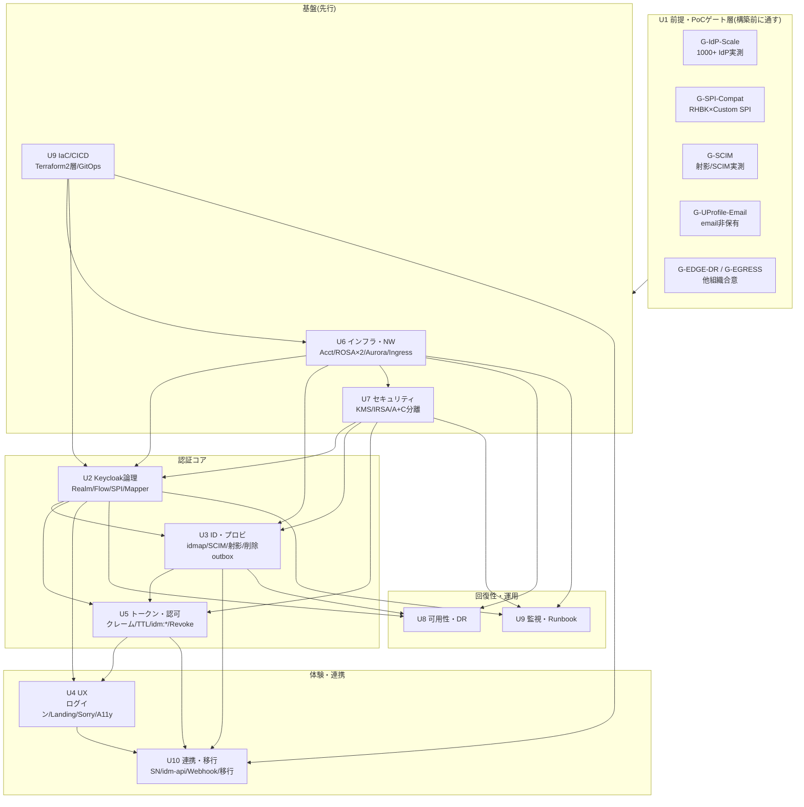

# 基本設計 → 詳細設計・構築 単元分解（Design Unit WBS）

作成: 2026-08-10 / 基盤: basic-design 10 冊（正式決定 170 件）+ ADR-062/063/064 + 網羅性監査（2026-08-10）

## 0. 本書の位置づけ・なぜ今これか

[00a（残タスク・工数）](00a-remaining-tasks-and-effort.md) は「**基本設計を閉じる**ための調査・検討タスク（244 人日）」を棚卸しした。本書はその次段 —— **基本設計で確定した決定を、詳細設計・構築・PoC・契約が着手できる「実装可能単位（Design Unit, DU）」まで分解**する WBS である。

- **1 DU = 1 チームが 1 スプリント〜数スプリントで着手・完了を判定できる作業単位**。成果物・完了定義（DoD）・依存・PoC ゲート紐付け・工数目安を必ず持つ。
- **SSOT は各設計書の決定（D-Ux-nn / D3-nn / §）**。本書はそれを「作れる形」に組み替えた**ビュー**であり、決定内容は変えない。差異が出たら設計書が正。
- 網羅性監査（2026-08-10）で判明した**要件抜け 5 件・書き漏れ再分類**を新規 DU として明示（`🆕` 印）。

### 採番・凡例

- **DU-U{単元}-{連番}**（例: DU-U2-04）。U1 は前提凍結層のためゲートとして扱い、構築 DU は持たない。
- **成果物種別**: `IaC`（Terraform/Helm）/ `SPI`（Java 拡張）/ `App`（Lambda/SPA/Facade）/ `Config`（Realm/Policy 定義）/ `Doc`（Runbook/契約/ガイド）/ `Test`（検証・負荷）。
- **PoC ゲート**: 着手前 or 並行で通す必要がある実測ゲート（G-*）。空欄 = ゲート非依存。
- **工数**: 詳細設計 + 構築の粗見積（[00a §5](00a-remaining-tasks-and-effort.md) の 325–455 人日を DU へ配分した目安。±40% バッファ込み・PoC 環境費別）。
- **状態**: 🔒確定(設計) / 🟡条件付き(ゲート待ち) / 🆕新規(監査由来・要件化/決定化が先行)。

---

## 1. 単元依存マップ（DU グループ間）

**クリティカルパス**: `G-IdP-Scale/G-SPI-Compat`（実測）→ `U6 基盤`（Acct/ROSA/Aurora/Ingress、CIDR は install 後変更不可ゆえ最優先凍結）→ `U2 認証コア`（Realm/Flow/SPI）→ `U3 プロビ`（SCIM/射影/削除）→ `U5 トークン`→ `U4/U10 体験・連携`。U7/U9I は U6 と並走で先行。

---

## 2. U1 ゲート層（構築 DU なし・通過条件）

U1 は前提凍結（P-01〜18）と PoC・契約前ゲートの管理層。構築 DU は持たないが、**下表ゲートは対応 DU の着手前提**。

| ゲート | 内容 | 律速する DU | 出典 |
|---|---|---|---|
| G-IdP-Scale | 1000+ IdP でログイン/HRD/Admin API p99 実測 | DU-U2-08, DU-U6-02 | [01 §1.5](01-architecture-baseline.md) |
| G-SPI-Compat | RHBK 26.x × Custom SPI 4 機能 + Flow 配置発火 | DU-U2-03/04, DU-U3-02/07 | 00a A-2 |
| G-SCIM | 射影読取 p99 + SCIM 2.0 準拠 + Soft Delete 写像 | DU-U3-03/04 | [03 §3.8](03-identity-provisioning-design.md) |
| G-UProfile-Email | email 非保有で 3 経路完走（#21265/#33497 回避） | DU-U2-06 | [02 §2.8.1](02-keycloak-logical-design.md) |
| G-EDGE-DR / G-EGRESS | 他組織エッジの DR/Egress 要求仕様合意 | DU-U6-04/07, DU-U8-02 | 00a B-1 |

---

## 3. U2 Keycloak 論理設計 → DU

| DU | 単元名 | 主要成果物 | DoD（完了定義） | 依存 | PoC | 工数 | 状態 |
|---|---|---|---|---|---|---|---|
| DU-U2-01 | Realm/Organizations 構成 | Config: broker/idp 2 Realm + Org 定義（1 顧客 1 Org） | 両 Realm が IaC で再現・Org attribute=表示名/hrd_mode のみ | DU-U6-01 | — | S | 🔒 |
| DU-U2-02 | 2-tier フェデ（idpkc-oidc01） | Config: client/scope/mapper（broker-federation） | Broker→IdP-KC の code/JWKS/userinfo が PrivateLink 経由で成立、storeToken=false | DU-U2-01, DU-U6-05 | G-SPI-Compat | M | 🟡 |
| DU-U2-03 | Authentication Flow 5 系統 | Config: browser-std/HRD/first-broker/post-broker/forms | 3 系統に SPI 配置で JIT が全経路発火（PoC F-6/V3'' 準拠） | DU-U2-04 | G-SPI-Compat | M | 🟡 |
| DU-U2-04 | Custom SPI（3 JAR / 4 機能） | SPI: HRD Authenticator / Re-Activation / provisioned_by setter / Micrometer 計装 | RHBK 26.x で 4 機能が動作・Flow 配置で発火・単体テスト固定 | DU-U2-03 | G-SPI-Compat | L | 🟡 |
| DU-U2-05 | Protocol Mapper セット | Config: クレーム辞書 Stage 1（sid/tenant_id/amr…、PII 非搭載） | JWT に辞書どおり搭載・per-Mapper syncMode=IMPORT で保護属性を上書きしない | DU-U2-01, DU-U5-01 | — | S | 🔒 |
| DU-U2-06 | User Profile 宣言 | Config: Declarative User Profile（email optional） | 新規/JIT/Admin の 3 経路で email 非保有ユーザが完走（#21265/#33497 回避） | DU-U2-01 | G-UProfile-Email | M | 🟡 |
| DU-U2-07 | SAML IdP 発行テンプレート | Config: SAML Client テンプレ（alias `-saml01`、NameID/署名） | ServiceNow 等 SP に IdP として振る舞える（FR-FED-006）、Mapper 定義確定 | DU-U2-01 | — | S | 🔒 |
| DU-U2-08 | 1000+ IdP スケール設定 | Config/IaC: 必須対策 7 点（キャッシュ/HRD/接続予算…） | G-IdP-Scale の合格基準（ベースライン比 +10% 以内）を満たす | DU-U6-02 | G-IdP-Scale | M | 🟡 |

## 4. U3 ID・プロビジョニング → DU

| DU | 単元名 | 主要成果物 | DoD | 依存 | PoC | 工数 | 状態 |
|---|---|---|---|---|---|---|---|
| DU-U3-01 | 3 階層識別子 + idmap DB | IaC: authz 系 Aurora スキーマ（sub/brand_id/external_id/idmap） | brand_id 一級キー・cross-brand join 不能・不変条件 4 点を制約で担保 | DU-U6-03 | — | M | 🔒 |
| DU-U3-02 | provisioned_by 6 値 + 判別ロジック | SPI/Config: JIT/SCIM 判別（D3-07 判定 1-3・Case 1-6） | scim_active 最強フラグ・除外条件・安全側拒否が単体テストで固定 | DU-U2-04 | G-SPI-Compat | M | 🟡 |
| DU-U3-03 | SCIM Facade（自作） | App: SCIM 2.0 受信 Lambda（D2/D1）+ 属性正準化（D3-15） | Entra/Okta SCIM Validator 合格・DELETE→Soft Delete 写像・テナント二重照合 | DU-U3-01 | G-SCIM | L | 🟡 |
| DU-U3-04 | 統合射影（read model） | App/IaC: projection ストア + 3 書込フィード（EventBridge 冪等 upsert） | `/api/me/context` が 1 read・越境ゼロ・読取 p99 が G-SCIM 合格 | DU-U3-01, DU-U3-03 | G-SCIM | L | 🟡 |
| DU-U3-05 | 削除/デプロビ = outbox | App: outbox リレー Lambda + 中央 shadow 制御 Lambda（[ADR-064](../adr/064-deprovisioning-propagation-outbox.md)） | soft-delete+outbox 1Tx・必達送信・shadow 冪等無効化・数分リコンサイル | DU-U3-01, DU-U6-01, DU-U6-05 | — | M | 🔒 |
| DU-U3-06 | 状態機械 S1-S10 + 3 段階削除 | Config/App: 4 状態機械 + 遮断/Soft/物理（Phase 2） | deprovisioned_at 必須セット・起算=deprovisioned_at・idpkc% は 90 日除外 | DU-U3-05 | — | M | 🔒 |
| DU-U3-07 | Re-Activation SPI 統合 | SPI: 同一 Tx 判定（SCIM 除外条件・想定外値の安全側拒否） | 危険誤発火シナリオを単体テストで固定（USER_REACTIVATED 監査ログ） | DU-U2-04, DU-U3-02 | G-SPI-Compat | M | 🟡 |
| DU-U3-08 | 90 日休眠バッチ | App: ROSA infra Pool Kubernetes CronJob（Lambda 不採用） | jit のみ対象・idpkc% 除外・10M 規模で完走（バッチ破綻回避） | DU-U6-02, DU-U3-06 | — | M | 🔒 |

## 5. U4 認証体験・UX → DU

| DU | 単元名 | 主要成果物 | DoD | 依存 | PoC | 工数 | 状態 |
|---|---|---|---|---|---|---|---|
| DU-U4-01 | Identifier-First + HRD UX | Config/Theme: ログイン画面 1（IdP 一覧非表示）+ HRD 降格 | 応答同一化・書式ヒント・PW フォーム降格が全応答で貫徹 | DU-U2-03 | — | M | 🔒 |
| DU-U4-02 | ブランディング（Pattern A 統一） | Theme: ニュートラルテーマ 1 本（messages 集約・FTL 直書き禁止） | CSRF hidden/session_code 不改変を PR レビュー必須項目化 | DU-U4-01 | — | S | 🔒 |
| DU-U4-03 | MFA UX 4 ケース | Theme/Config: WebAuthn/TOTP エンロール（QR + 手動キー） | ケース A/B/C/D の UX 完走・フォールバックリンク成立 | DU-U4-01, DU-U7-08 | — | M | 🔒 |
| DU-U4-04 | Landing / Launchpad SPA | App: 許可サービスタイル SPA（Pattern 1、判定=エンタイトルメント API） | launchpad URL 直叩きのみ着地・`/api/me/apps` で表示判定 | DU-U10-02 | — | M | 🔒 |
| DU-U4-05 | Sorry SPA | App: 権限不足画面（表示必須 6/禁止 5 項目） | 403→Sorry 誘導規約（U5 §5.6.6）とアプリ側実装義務が契約に反映 | DU-U5-05 | — | S | 🔒 |
| DU-U4-06 🆕 | アクセシビリティ（WCAG 2.2 AA / JIS X 8341-3） | Doc/Test: A11y 準拠 + PR 自動検査 + 手動/当事者テスト | **要件化 or レベル決定を先行**（監査: 要件不在）。全 10 画面準拠・CI ゲート | DU-U4-01〜05 | — | M | 🆕 |
| DU-U4-07 🆕 | i18n / 日本語ロケール明示 | Config/Doc: messages 集約 + 「Phase 1=日本語のみ」決定 | 多言語化の将来余地（messages 分離）を確認・決定を明文化 | DU-U4-02 | — | S | 🆕 |
| DU-U4-08 | セルフサービス PW リセット画面 | Theme: Forgot Password 画面（FR-AUTH-013） | ホストローカル PW ユーザの自己リセット経路が完走（本人確認方式決定） | DU-U4-01, DU-U7-08 | — | S | 🟡 |

## 6. U5 トークン・セッション・認可 → DU

| DU | 単元名 | 主要成果物 | DoD | 依存 | PoC | 工数 | 状態 |
|---|---|---|---|---|---|---|---|
| DU-U5-01 | クレーム辞書 + TTL 最終 | Config: Stage 1 クレーム + TTL（AT 30 分/RT Rotation） | PII 非搭載チェックリスト 7 項目が 3 箇所（レビュー/CI/四半期）で回る | DU-U2-05 | — | S | 🔒 |
| DU-U5-02 | Token Exchange Pattern 2/3 | Config: TE クライアント設定 | 委譲/なりすまし境界がスコープで表現・監査ログ必須 | DU-U5-01 | — | M | 🔒 |
| DU-U5-03 | Revocation / ITDR L4 / Back-Channel Logout | Config/App: not-before push + 一斉 revoke + BCL | 3 粒度の強制ログアウト・ゾンビ窓 ≤30 分・L4 Runbook 連動 | DU-U5-01, DU-U7-03 | — | M | 🔒 |
| DU-U5-04 | idm:* スコープ + CC 認可 | Config: Phase 1 スコープセット（リソース×操作 2 軸） | idm:users:read/write/deactivate… が CC で開放・物理削除スコープ非定義 | DU-U5-01, DU-U10-02 | — | S | 🔒 |
| DU-U5-05 | RP 実装ガイド | Doc: BFF/PKCE 規約 + Sorry 規約 + ゾンビ窓/ログアウト限界の契約明示 | アプリ開発者の実装義務（403→Sorry、SPA 限界）が契約/ガイドに落ちる | DU-U5-01 | — | M | 🔒 |

## 7. U6 インフラ・ネットワーク → DU（基盤・先行）

| DU | 単元名 | 主要成果物 | DoD | 依存 | PoC | 工数 | 状態 |
|---|---|---|---|---|---|---|---|
| DU-U6-01 | 6 アカウント + 越境 8 経路 | IaC: Org/Acct + EventBridge クロスアカウント（D-U6-02） | 越境は EventBridge 8 経路 + フェデ PrivateLink のみ・IAM 相互信頼なし | DU-U9I-01 | — | M | 🔒 |
| DU-U6-02 | ROSA HCP×2 + Machine Pool | IaC: Broker#1 / IdP-KC#2 クラスタ（2 系統 Pool・サイジング） | 少数大型 Pod モデル・接続予算規約・G-IdP-Scale データセット併走可 | DU-U6-01 | G-IdP-Scale | L | 🟡 |
| DU-U6-03 | Aurora×2（A+C 分離） | IaC: identity Aurora / authz 系 Aurora（別 CMK/SG/ロール、D-U7-19） | 両方に届く単一ロール/SG が存在しない・projection リードレプリカ余地 | DU-U6-01, DU-U7-01 | — | M | 🔒 |
| DU-U6-04 | Ingress 3 系統 | IaC: auth/idp（NFW→TGW→ALB）/ api（API GW 例外）/ SPA（OAC 例外） | REQ-IN-12/13 準拠・api. は NFW 経路外で成立・他組織要求仕様発行 | DU-U6-01 | G-EGRESS | M | 🟡 |
| DU-U6-05 | 内部 NLB + フェデ PrivateLink | IaC: kc-admin 内部 NLB（scheme=internal）+ idpkc backchannel | Admin API はインターネット非露出・SG を Lambda SG 限定・server-TLS | DU-U6-02 | — | M | 🔒 |
| DU-U6-06 | idm-api Lambda 実行基盤 | IaC: Lambda（層③ ENI）+ API GW（JWT L1）+ 専用サブネット | [ADR-062](../adr/062-idm-api-execution-form-lambda.md) 準拠・cold start 許容・別障害ドメイン | DU-U6-01, DU-U6-04 | — | M | 🔒 |
| DU-U6-07 | zero-egress / NFW 要求仕様 | IaC/Doc: VPC Endpoint 群 + Egress ルールグループ要求（B 部） | 顧客 IdP 1000+ FQDN の許可申請フロー・LDAPS 撤去反映 | DU-U6-01 | G-EGRESS | M | 🟡 |
| DU-U6-08 | /admin 3 層防御 + hostname-admin | IaC/Config: L2 Listener 403 + SG エッジ限定 + hostname 分離 | エンドユーザ経路で /admin 403・踏み台/SSM 経路のみ管理到達 | DU-U6-04 | — | S | 🔒 |
| DU-U6-09 | IP 割当計画凍結 | Doc/IaC: CIDR 台帳（4 VPC + 他組織 + 顧客） | **install 後変更不可ゆえ構築前に凍結**・衝突確認済み | DU-U6-01 | — | S | 🔒 |

## 8. U7 セキュリティ → DU（基盤・先行）

| DU | 単元名 | 主要成果物 | DoD | 依存 | PoC | 工数 | 状態 |
|---|---|---|---|---|---|---|---|
| DU-U7-01 | KMS 3 階層 6 Acct 写像 | IaC: CMK 命名/Key Policy 3 ロール（管理/利用/監査） | 職務分離・IRSA のみ利用・削除/変更は即時通知 | DU-U6-01 | — | M | 🔒 |
| DU-U7-02 | JWT 署名鍵 90 日ローテ | Config/App: Realm Key 90 日 + 30 日並走 CronJob | 鍵ローテ監視・失敗時手動手順・JWKS 追随 | DU-U2-01, DU-U7-01 | — | S | 🔒 |
| DU-U7-03 | ITDR / Risk Engine | App: Event Listener→EventBridge→Risk Engine（Golden 4 シグナル） | Compromised Credentials + Brute Force 検知・Phase 1a 通知のみ | DU-U6-01, DU-U2-04 | — | L | 🔒 |
| DU-U7-04 | Log scrubbing 辞書 | App/Config: マスキング集中適用（M-1〜14） | 全ソースが scrubbing 通過後に保存・平文トークン非残置 | DU-U9O-02 | — | M | 🔒 |
| DU-U7-05 | IRSA / Workload Identity | IaC: Pod Identity + Federated Credentials | 人間へ鍵付与禁止・SA 単位最小権限 | DU-U6-02, DU-U7-01 | — | S | 🔒 |
| DU-U7-06 | PAM 統合 + Break-Glass | IaC/Doc: AWS IIC + Session Manager + Break-Glass（[ADR-040](../adr/040-pam-jit-admin-privilege-management.md)） | Phase 1α 実装 10 項目・役員承認・監査ログ・訓練手順 | DU-U6-08, DU-U7-01 | — | L | 🔒 |
| DU-U7-07 | A+C credential-authz 分離 | IaC: identity/authz の DB/CMK/ロール/SG 4 軸分離（D-U7-19） | 橋渡しコンポーネント最小権限・2 Acct 分割の不変条件維持 | DU-U6-03 | — | M | 🔒 |
| DU-U7-08 | PW ポリシー / MFA 要素 | Config: length12/履歴 5/初回強制/WebAuthn/TOTP（email OTP 除外） | D-U7-14/17 反映・フェデは対象外・両 Realm Policy | DU-U2-01 | — | S | 🔒 |
| DU-U7-09 | Bot/DDoS（WAF 要求 + KC 最低線） | Doc/Config: REQ-IN-01 明細要求 + KC Brute Force/Enumeration | B 部不成立でも最低防御線成立・Turnstile Phase 2 トリガー定義 | DU-U6-04 | — | M | 🔒 |

## 9. U8 可用性・DR → DU

| DU | 単元名 | 主要成果物 | DoD | 依存 | PoC | 工数 | 状態 |
|---|---|---|---|---|---|---|---|
| DU-U8-01 | SLO 定義 + Burn Rate | IaC/Config: 4 サービス SLO + Multi-burn-rate（D-U9-04） | AMP Recording Rules + AMG Alerting・性能目標（NFR-PERF-003/004）反映 | DU-U9O-01 | — | M | 🔒 |
| DU-U8-02 | コールド DR（RTO≈14 日） | IaC/Doc: パイロットライト → 手動コールド再構築（大阪オンデマンド） | 2 障害シナリオ区別（リージョン災害/論理破壊）・エッジ自動切替撤回 | DU-U6-02 | G-EDGE-DR | M | 🟡 |
| DU-U8-03 | データ保全 3 層 | IaC: Aurora Global + PITR + イミュータブルスナップショット（Vault Lock） | L1/L2/L3 が並立・スナップショット大阪クロスリージョンコピー | DU-U6-03 | — | M | 🔒 |
| DU-U8-04 | RB-DR Runbook + Game Day | Doc/Test: 再構築/リストア Runbook + DR Game Day H1 | RTO≈14 日を演習で実証・切り戻しは計画切替（喪失ゼロ） | DU-U8-02, DU-U8-03 | — | M | 🔒 |
| DU-U8-05 | 復元 2 経路 | IaC/Doc: IaC 再適用 + Aurora Global（Realm Export 全廃） | 両経路が独立に成立・keycloak-config-cli 不採用と整合 | DU-U9I-01, DU-U8-03 | — | S | 🔒 |

## 10. U9 運用・監視・IaC → DU

| DU | 単元名 | 主要成果物 | DoD | 依存 | PoC | 工数 | 状態 |
|---|---|---|---|---|---|---|---|
| DU-U9I-01 | IaC 2 層 + state 分離 | IaC: Terraform モジュール分割 + state マトリクス（keycloak-config-cli 不採用） | 基盤/テナント層分離・ドリフト検知（日次 CI） | — | — | L | 🔒 |
| DU-U9I-02 | CI/CD | IaC: GitHub Actions + GitOps + ECR ミラー | 版数固定・SLSA 対応・secret 直書き CI lint 検査 | DU-U9I-01 | — | M | 🔒 |
| DU-U9O-01 | OTel 可観測性 + IdP 数関数監視 | IaC/App: OTel Collector + Micrometer 計装 | IdP 追加バッチ前後比較・Cardinality 規約・Trace Sampling | DU-U6-02 | — | M | 🔒 |
| DU-U9O-02 | ログ 3 層 + SIEM | IaC: Hot(90 日)/Cold(7 年 Object Lock)/SIEM 相関 | 全ソース scrubbing 後保存・予備地域配備・週 1 監査スキャン | DU-U6-01, DU-U7-04 | — | M | 🔒 |
| DU-U9O-03 | Runbook 体系 + 禁則集 | Doc: Runbook 35 冊（必須 13）+ 禁則 K-1〜11 | 禁則が CI/レビューで機械強制・ゲート G-* 9 種 | 各 DU | — | L | 🔒 |
| DU-U9O-04 | IdP オンボーディング パイプライン | App/IaC: 6 ステップ自動化（自作オンボーディング API） | SAML メタデータ自動更新（A-9 実機）・証明書ローテ運用 | DU-U2-01, DU-U9I-01 | — | M | 🔒 |
| DU-U9O-05 | Central Canary（監査 Acct） | App/IaC: 認証外形監視 + 実装漏れ検知（[ADR-059](../adr/059-central-auth-check-canary-architecture.md)） | 弊社監査 Acct 集約・App/OpenAPI Registry 連携 | DU-U9O-01 | — | M | 🔒 |

## 11. U10 連携・移行 → DU

| DU | 単元名 | 主要成果物 | DoD | 依存 | PoC | 工数 | 状態 |
|---|---|---|---|---|---|---|---|
| DU-U10-01 | ServiceNow SP 連携 | Config/Test: SAML Client CL-SN-01 + L1 SCIM→L2 SAML JIT（パターン②） | Matching Field 突合 + IdP-initiated 無効 + 実機検証（A-12） | DU-U2-07, DU-U3-03 | — | M | 🔒 |
| DU-U10-02 | idm-api v1（OpenAPI×2） | App: idm-api Lambda + OpenAPI 2 本 + `/api/me/apps` | CRUD/権限/authz/projection の実体・ユーザ AT/CC 経路差替 | DU-U6-06, DU-U3-01, DU-U5-04 | — | L | 🔒 |
| DU-U10-03 | Webhook Dispatcher | App: HMAC 署名 + DLQ + 再送 8 回/24h + 待避 14 日 | 配信 7 種・個人情報非搭載・冪等・±5 分リプレイ防止 | DU-U10-02 | — | M | 🔒 |
| DU-U10-04 | 移行 4 集団 | Doc/App: PW ハッシュ判定 + legacy_user_id 廃止 + 引き当て | 突合項目選定 + 内部 ID 保全 + 集団別移行手順 | DU-U3-01, DU-U3-03 | — | M | 🟡 |
| DU-U10-05 | DSAR Phase 1（手動） | Doc: 削除要求対応 SOP（仮名化 + 7 年保管、応答期限決定） | 物理削除しない方針・NFR-COMP-009 応答日数を契約確定 | DU-U3-06 | — | S | 🟡 |
| DU-U10-06 | 退職時 削除連鎖 T-1〜5 | Doc/App: 遮断連鎖 + 一括ログアウト + 残余時間契約明示 | SN 側 sys_user 残置 + 認証チェーン遮断・残余 30 分を契約化 | DU-U3-05, DU-U5-03 | — | S | 🔒 |

---

## 12. 監査由来の新規/要対応 DU（2026-08-10）

| DU | 由来 | 先行アクション |
|---|---|---|
| DU-U4-06 🆕 | アクセシビリティ要件不在（設計は確定） | **要件化 or レベル決定**（AA/A）を U4 着手前に |
| DU-U4-07 🆕 | 多言語/日本語ロケール明示なし | 「Phase 1=日本語のみ」を決定化 |
| （要件追記） | アカウントリンク / 利用者セルフセッション / OAuth 同意 | **Phase 1 非対応 or 対象外を明示**（穴を塞ぐ、要件文追記） |
| （再分類） | Landing/管理API/Break-Glass/Sorry = スコープ増→書き漏れ | 要件側に追記（DU-U4-04/U10-02/U7-06/U4-05 の根拠付け） |

## 12b. 継続アクセス・ガバナンス・新興ID 由来の追加 DU（2026-08-12 網羅性再監査 / ADR-065〜067）

大規模認証 BP 突合（RFC 9700 / CAEP-SSF Final 2025-09 / NIST 800-63-4 / CSA NHI 等）で判明した真の漏れを ADR 化・設計反映済み。対応する新規 DU:

| DU | 単元名 | 主要成果物 | DoD | 依存 | PoC | 工数 | 状態 |
|---|---|---|---|---|---|---|---|
| DU-U5-06 | 継続アクセス（CAEP/SSF） | App: outbox 起点 自作 SET エミッタ + SSF Stream 管理 + RP receiver SDK（[ADR-065](../adr/065-continuous-access-caep-shared-signals.md)） | Phase 1 = 暫定ブリッジ + opt-in RP へ `session-revoked`/RISC 配信、ゾンビ窓を高価値経路で数秒化 | DU-U3-05, DU-U5-03 | **G-SSF** | L | 🟡 |
| DU-U5-07 | プロトコル堅牢化 | Config: at+jwt 検証(7点) / RFC 9470 API層 step-up / 同時セッション制限(SPI) / TE act・may_act+ダウンスコープ（U5 §5.10） | 7 点検証 + 重要 API チャレンジ + 管理系セッション上限が成立 | DU-U5-01, DU-U2-03 | — | M | 🔒 |
| DU-U4-09 | セルフサービス セッション/デバイス管理 | App/Theme: 自セッション一覧 + 自己失効（D-U4-09） | 利用者が自端末を失効可・本基盤セッションのみ対象 | DU-U4-01 | — | S | 🔒 |
| DU-U4-10 | セキュアなエンロール（登録 ATO） | Config: 2 台目/再登録に step-up 必須（D-U4-10） | 第 1 要素のみの追加登録を拒否 | DU-U4-03 | — | S | 🔒 |
| DU-U7-10 | NHI ガバナンス台帳 | App/IaC: NHI 台帳 + 命名規約 + 孤立検知 CronJob + 失効伝播（[ADR-066](../adr/066-non-human-identity-governance.md)） | owner 必須・90 日孤立検知・ADR-064 機構で失効 | DU-U3-01, DU-U7-05 | — | M | 🔒 |
| DU-U9O-06 | 認可判定ログ + アクセス再認証 | App/Doc: idm-api 決定ログ（サンプリング）+ 3 層 recert キャンペーン（[ADR-067](../adr/067-authz-decision-logging-and-access-recertification.md)） | deny+高権限全件ログ + recert 完了記録（ISO A.9.2.5） | DU-U10-02, DU-U9O-02 | — | M | 🔒 |
| DU-U9O-07 | 非本番 PII マスキング | IaC/CI: 静的マスキング or 合成データ + 平文 PII 非着地の機械検査（D-U9-19） | 非本番に本番 PII が入らない・負荷試験データも合成 | DU-U9I-01 | — | S | 🔒 |
| DU-U6-10 | テナント隔離契約・公平性 | IaC/Config: 認証フローの per-tenant レート制限 + `tenant_id` 一貫強制 + realm 分離基準（D-U6-14） | 1 テナントのバーストが他を枯渇させない・分離脱出条件明文 | DU-U6-02, DU-U6-04 | — | M | 🟡 |
| DU-U7-11 | 同意管理・同意レシート | App/Doc: 同意記録 + 撤回 + レシート（D-U7-21、越境テナント必須） | 越境/第三者提供テナントで記録・撤回可 | DU-U10-02 | — | S | 🟡 |
| DU-U10-07 | RTBF vs 監査境界 | Doc: 消去対象 vs 仮名化保持の境界 + 決定ログ `sub` 仮名化（D-U10-13b） | 都度判断でなく境界を契約明記 | DU-U3-06 | — | S | 🟡 |

> 姿勢のみ（Phase 1 実装なし、hearing 回答待ち）: FAPI 2.0（PAR/JAR、B-FAPI-1）/ IPSIE 準拠（B-IPSIE-1）/ AI エージェント ID（B-AGENT-1、NHI 台帳 `type` 拡張で受ける）。

## 13. 未確定・引き渡し

- **工数の総和**は [00a §5](00a-remaining-tasks-and-effort.md) の 325–455 人日レンジと整合させる（本表の S/M/L は配分の目安。確定は詳細設計時に PoC 実測を織り込んで再見積）。
- **PoC ゲート未通過 DU（🟡）は着手可だが「凍結」まで進めない**（G-IdP-Scale/G-SPI-Compat/G-SCIM/G-UProfile-Email/G-EDGE-DR/G-EGRESS）。
- 本書は Wave 進行（[00a §4](00a-remaining-tasks-and-effort.md)）と接続: W0（外部依頼・ゲート実測）→ 基盤 DU（U6/U7/U9I）→ 認証コア DU（U2/U3/U5）→ 体験・連携 DU（U4/U10）→ 回復性・運用 DU（U8/U9O）。

## 改訂履歴

- 2026-08-12 (v1.1): **§12b 追加** — 継続アクセス・ガバナンス・新興ID 由来の追加 DU 10 件（DU-U5-06 CAEP/07 プロトコル堅牢化 / U4-09 自セッション/10 セキュア登録 / U7-10 NHI 台帳/11 同意 / U9O-06 認可ログ+recert/07 非本番マスキング / U6-10 テナント隔離 / U10-07 RTBF 境界）を ADR-065〜067 + U4/U5/U6/U7/U9/U10 反映と同期。gate G-SSF 追加。
- 2026-08-10 (v1.0): 新規作成。basic-design 10 冊の正式決定 170 件 + ADR-062/063/064 + 網羅性監査を、実装可能単位（DU-U*-nn 約 60 単元）へ分解。DU グループ間依存 mermaid + クリティカルパス + PoC ゲート紐付け + 監査由来の新規 DU 4 群を収録。
