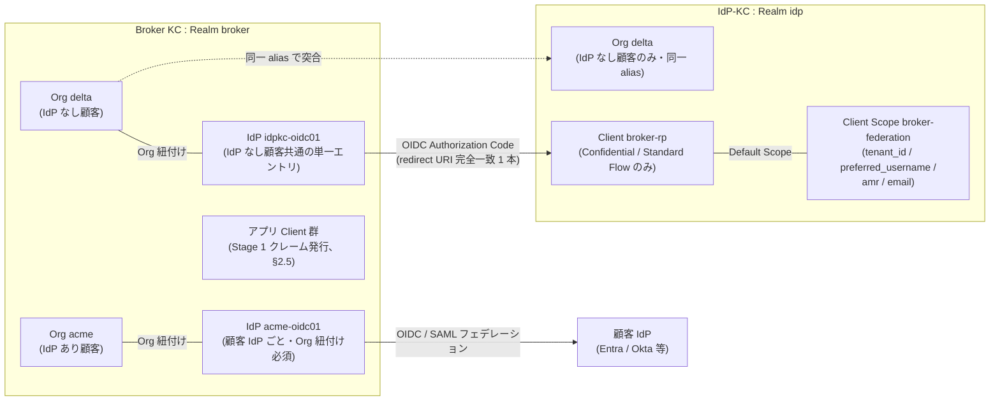
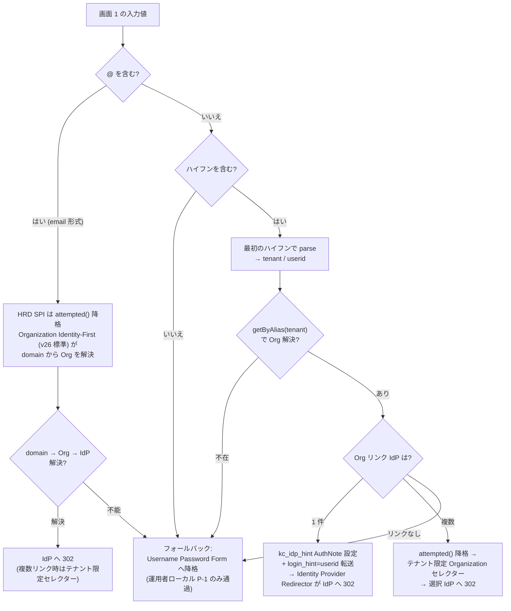
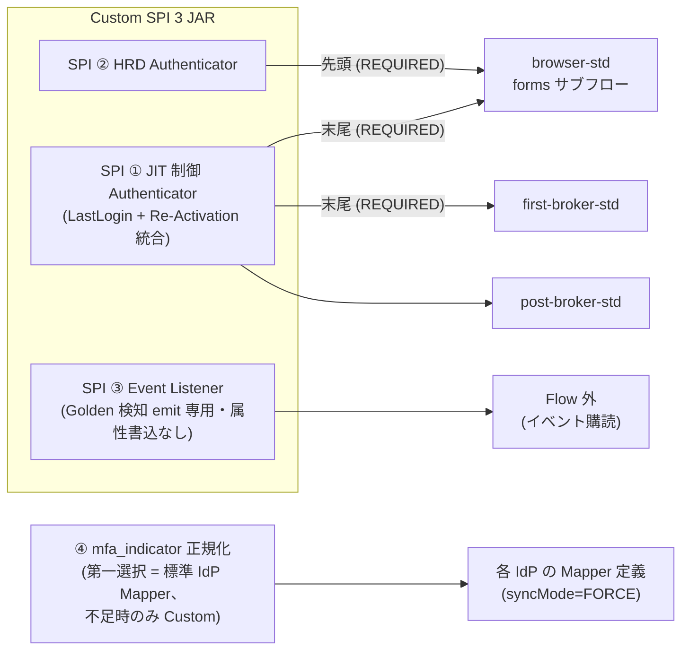

# U2: Keycloak 論理設計（Realm / Organizations / Flow / SPI / Mapper / User Profile）

作成日: 2026-07-23
ステータス: Draft v1（Wave 1）
**前提: [01-architecture-baseline.md](01-architecture-baseline.md) Baseline v1（P-01〜P-20）**
> **[P-19 ブランドユニット](01-architecture-baseline.md)（2026-08-17 採番）**: **brand=Realm**（2026-08-15 確定）。本書の Realm 設計は「Broker = 共有 1 Realm」+「ブランドごとに Realm」の 2 軸で読む。テナント軸（単一 Realm + Organizations、P-06）とは**別粒度で非衝突**。Phase 1 スコープ = 1 ブランド
上位文書: [00-basic-design-plan.md](00-basic-design-plan.md) §U2

---

## 2.0 背景・なぜここで決めるか（スコープ・境界）

### 2.0.1 背景

要件定義（ADR-017/033/055 ほか）で「Keycloak / 2-tier / 単一 Realm + Organizations / HRD Custom SPI」という**方式レベル**の判断は確定した。しかし実装に入るには、Realm・Organization・IdP の命名規則、Authentication Flow の具体的な木構造、Custom SPI の配置と入出力、Protocol Mapper と User Profile の宣言内容といった**論理設定レベル**の決定が必要であり、これらは相互依存する（例: HRD の識別子形式 `<tenant>-<userid>` が Organization alias 規則を拘束し、alias 規則が IdP alias・tenant_id クレームを拘束する）。本書はこの論理設定一式を一箇所で確定させる。

さらに P-16（接続 IdP 1000 超・条件付き成立）により、[research/keycloak-1000idp-scalability-research.md](research/keycloak-1000idp-scalability-research.md) の**必須対策 7 点を「設計制約」として本書に落とし込む**ことが U2 の必須要件となった（§2.7）。PoC（V1〜V3''）で実機確定した制約（SPI 3 系統 Flow 配置 / User Profile 明示宣言 / per-Mapper syncMode、[jit-scim §10.4.F](../common/jit-scim-coexistence-keycloak.md)）も本書で正式な設計制約に昇格させる。

### 2.0.2 スコープと U3 / U6 との境界

| 領域 | 本書（U2） | U3（ID・プロビ） | U6（インフラ・NW） |
|---|---|---|---|
| Realm / Organizations 構成・命名 | ✅ 決定 | 参照 | 参照 |
| 2-tier 間フェデレーション | ✅ **論理設定**（client / scope / mapper） | — | クロスアカウント HTTPS 経路・mTLS・DNS |
| Authentication Flow / Custom SPI | ✅ 決定 | JIT/SCIM 判別・ライフサイクル S1-S10 の**ポリシー** | — |
| Protocol Mapper / User Profile | ✅ 決定 | 3 階層識別子の DB スキーマ・マッピング DB | — |
| SCIM 受信エンドポイント | 属性契約のみ（§2.6） | ✅ 決定（/scim/v2、自作 Facade — U3 D3-11） | — |
| IdP-KC 同居アプリからのユーザ CRUD 経路（P-17） | 前提のみ | ✅ 決定 | 経路設計 |
| 1000+ IdP 対策 | ✅ 設計制約化 + PoC ゲート定義 | — | Egress 許可申請（G-EGRESS） |
| キャッシュ・Pod サイジングの最終値 | 初期値のみ（§2.7.6） | — | ✅ 決定 |

トークン TTL / クレーム辞書の最終値は U5、ITDR・Adaptive の Risk Engine 実装は U7。U5 の Back-Channel Logout / Token Exchange 設計確定時に本書の Client 設計（§2.2.3）へフィードバックを受ける。

### 2.0.3 本書の前提（Baseline v1 からの主参照）

P-01（ROSA HCP + RHBK）/ P-02（10M MAU）/ P-06（L2 単一 Realm + Organizations + tenant_id）/ P-07（全ユーザーフェデ化: 顧客ユーザ〔テナント管理者含む〕はフェデ、ローカルは基盤運用者 P-1 のみ。2026-07-30 D-17）/ P-08（3 階層識別子）/ P-10（JWT Stage 1 最小・PII 非搭載）/ P-12（JIT + SCIM 併用、SPI 案 B、3 系統 Flow 配置）/ P-16（1000+ IdP 条件付き成立）/ P-17（IdP-KC 別 Acct・2 クラスタ）。

---

## 2.1 Realm / Organizations 構成

### 2.1.1 Realm 構成

**採用**: Broker KC = **単一 Realm `broker`** + Organizations、IdP-KC = **単一 Realm `idp`** + Organizations。両クラスタとも `master` Realm は Keycloak 自体の管理専用とし、業務ユーザ・業務 Client を置かない。

- **根拠**: ADR-017（マルチ Realm は 100-400 で運用劣化、L2 論理分離採用）+ ADR-033（両 Tier とも Single Realm + Organizations）。Realm 名は issuer URL（`https://<host>/realms/broker`）に埋め込まれ事実上変更不可のため、環境名・バージョン等を含まない普遍的な短名とする。
- **「単一 Realm」の適用軸（2026-08-15 明確化、[ADR-063 ブランド Realm モデリング](../adr/063-brand-unit-architecture.md)）**: ここでの「単一 Realm」は**テナント軸**の決定（数千テナントに Realm を割らず Organizations で分離）。**ブランド軸は別**で、**ブランド = Realm（brand=Realm 確定）**。ADR-017 のマルチ Realm 劣化はテナント数千を Realm 化した場合の話であり、**ブランドは少数（Phase 1 = 1、将来も数個）なので非衝突**。Phase 1 = 1 ブランド = 本 `broker` / `idp` の単一 Realm のまま。将来ブランド追加時は Realm を IaC テンプレートから機械派生（[DU-U2-09](00b-design-unit-breakdown.md)、per-realm theme/issuer/IdP-KC Realm）。issuer は**ブランド毎に単一**（[U5 §5.6.3 の単一 issuer 前提はこの読み替え](05-token-session-authz-design.md)、アプリはブランド設定から解決）。
- **代替案**: テナント別 Realm（B 案）— 規制要件でデータ物理分離が契約上強制される顧客のみ例外適用（ADR-017 の例外条件 3 つ）。その場合も既定 Realm 設計のコピーではなく本書設定のサブセットを IaC で派生させる。
- **未決事項**: ホスト名（`auth.<domain>`）と admin 専用ホスト名分離（`hostname-admin`）は U6。DR（大阪）側 Realm 複製方式は U8（§2.7.4 の realm export 禁止制約と要整合）。

### 2.1.2 Organizations の使い方（顧客 = Org、IdP は必ず Org 紐付け）

**採用**:

| 項目 | Broker KC（Realm `broker`） | IdP-KC（Realm `idp`） |
|---|---|---|
| Organization | **全顧客**（IdP あり + IdP なし）を 1 顧客 = 1 Org で登録 | **IdP なし顧客のみ**登録 |
| Org ↔ IdP | 顧客 IdP は**必ず**当該顧客 Org に紐付けて登録（Org 非紐付けのグローバル IdP 禁止、§2.7.3） | IdP 登録なし（IdP-KC 自身がローカル認証） |
| Org domain | 顧客がメールドメインを保有し HRD A 案（メールドメイン）を使う場合のみ検証済みドメインを登録 | 同左（Identity-First 用） |
| Org attribute | `tenant_display_name` / `hrd_mode`（§2.3.3）/ 課金・契約メタは持たない（管理画面 Backend 側 DB、ADR-038） | 同左最小 |
| Org membership | JIT / SCIM 作成時に自動メンバー登録（tenant 境界の物理表現） | 同 |

- **根拠**: P-06 / ADR-017 / ADR-033 テナント設計。Org 紐付けは 26.0 の IdP 専用ストレージ（`IdentityProviderStorageProvider`）の org 単位クエリに乗るため 1000+ IdP の性能前提でもある（research 必須対策 3）。Organizations スケール目標は 10k orgs（keycloak#30085 Closed）で、1000 org は目標の 1/10。
- **代替案**: Org を使わず `tenant_id` user attribute のみで論理分離 — HRD（`getByAlias()`）と domain→IdP 解決を自前実装する必要が生じ不採用。Phase Two keycloak-orgs 拡張 — v26 ネイティブ Organizations が GA のため不要。
- **未決事項**: Org attribute の格納制約（属性あたりサイズ・件数上限）の実測は G-IdP-Scale P-1 に含める。26.7 の org 管理 fine-grained 委譲ロールの採用可否は ADR-038（管理画面）側で判断。

### 2.1.3 Org 命名規則・alias 規則（HRD `<tenant>-<userid>` と整合）

**採用**:

| 対象 | 規則 | 例 |
|---|---|---|
| **Org alias** | `^[a-z][a-z0-9]{1,19}$`（小文字英数字、**ハイフン禁止**、2〜20 文字、先頭英字）。**tenant_id クレーム値・ログイン ID の tenant プレフィックスと完全一致**。作成後**変更不可** | `acme`, `globex`, `delta` |
| Org name | 表示名（日本語可、変更可） | `Acme 株式会社` |
| **Broker/IdP-KC 間の対応** | IdP なし顧客は**両クラスタで同一 alias** で Org を作成（突合キー） | Broker `delta` ↔ IdP-KC `delta` |
| 予約語 | `master`, `admin`, `broker`, `idp`, `api`, `scim`, `test` 等は Org alias に使用禁止（運用パス・内部名との衝突防止） | — |

- **根拠**: ADR-055 確定の HRD 識別子 `<tenant>-<userid>` は**最初のハイフンで parse** する（`identifier.indexOf('-')`）。tenant 部にハイフンを許すと parse が破綻するため alias にハイフンを禁止する。§FR-1.2.0.D Layer B（`acme-EMP-0042` → tenant=`acme`）と一致。alias = tenant_id とすることで HRD SPI（`getByAlias()`）・JWT `tenant_id`・Org membership が単一の値で貫通する。
- **代替案**: alias と tenant_id を別管理 — マッピング表が増え、ADR-055 の「外部 DB なし」方針に反するため不採用。
- **未決事項**: 顧客名変更・M&A 時の alias 扱い（alias 不変 + 表示名変更で吸収する運用ルール）は U9 Runbook へ。userid 部の文字種規約（顧客独自 ID の受入範囲）は B-IDM-2 回答待ち（U3）。

### 2.1.4 IdP alias 規則

**採用**: 顧客 IdP alias = **`<orgAlias>-<proto><NN>`**（`proto` ∈ {`oidc`,`saml`}、`NN` = 01 起番の 2 桁連番）。例: `acme-oidc01`, `acme-saml01`。IdP 製品名（entra/okta 等）は `displayName` にのみ記載し **alias には含めない**。

- **根拠**: alias は Broker のコールバック URL `/realms/broker/broker/<alias>/endpoint` に固定され、顧客 IdP 側に redirect URI として登録される。alias 変更 = 顧客側再設定であり、IdP 製品乗換（jit-scim §10.4.G S8: Entra→Okta 差替）で alias を変えずに済むよう製品中立の命名とする。`<orgAlias>-` プレフィックスにより IdP 一覧の検索・Terraform/API 操作のスコープが機械的に切れる。
- **代替案**: `acme-entra` 等の製品名入り（ADR-033 図・PoC の例）— 可読性は高いが S8 で破綻するため本番規則としては不採用。
- **未決事項**: 同一 Org 複数 IdP（hrd-implementation §4 パターン B）の優先度・セレクタ表示順の属性設計は U4（UX）と合同で確定 → **決着させる作業は [00a D-1「接続先の表示順の決め方」](00a-remaining-tasks-and-effort.md)（2 人日、U2×U4 合同）**（2026-08-27 参照付与 — C-5）。

---

## 2.2 2-tier 間フェデレーション（Broker KC ↔ IdP-KC）

> クロスアカウント HTTPS 経路・名前解決・mTLS・SG 設計は **U6**。本節は論理設定のみ（ADR-033、P-17）。

### 2.2.1 位置付け

**採用**: Broker KC から見た IdP-KC は「**OIDC IdP の 1 つ**」として登録する（Keycloak-to-Keycloak federation 標準パターン、ADR-033 §A）。IdP-KC 側では Broker を OIDC confidential client として登録する。

### 2.2.2 Broker 側 IdP 登録（IdP-KC 向け）

**採用**: **IdP なし顧客共通の単一 OIDC IdP エントリ `idpkc-oidc01`** を作成し、IdP なし顧客の各 Org すべてに紐付ける。

| 設定 | 値 | 補足 |
|---|---|---|
| alias | `idpkc-oidc01` | §2.1.4 の例外（org プレフィックスなし、基盤内部 IdP） |
| providerId | `oidc`（issuer discovery 使用） | `https://<idpkc-host>/realms/idp` |
| Flow | Authorization Code | response_type=code |
| `loginHint` | `true`（`login_hint` を IdP-KC へ転送） | HRD SPI が書き換えた `<userid>` を IdP-KC の Identity-First に渡す |
| `hideOnLoginPage` | `true` | §2.7.2（IdP 一覧非表示）に従い全 IdP 共通 |
| `trustEmail` | `false` | §FR-2.2.1.A（Trust Email は IdP 単位明示、デフォルト false） |
| syncMode | `IMPORT`（既定）+ Mapper 単位 override（§2.5.4） | PoC V2 確定 |
| First/Post Broker Login Flow | `first-broker-std` / `post-broker-std`（§2.3.2） | SPI 3 系統配置 |
| storeToken | `false` | broker-data-model §2 ①（IdP トークン非保存） |
| **Allowed clock skew** | **`30`（秒）** | **2026-08-24 追加**。ID Token の `exp` / `iat` 検証時に許容する時刻差。**既定 0 のままだと、わずかな時刻ずれでフェデ全体が落ちる**。値は [U5 §5.2.1](05-token-session-authz-design.md) の「RP 検証側 ≤ 60 秒」より狭く取る（基盤内は [U6 D-U6-17](06-infra-network-design.md) の同期精度により実測ミリ秒オーダー、30 秒でも 3 桁の余裕）。**顧客 IdP 側のエントリにも同値を既定適用**（オンボーディングパイプラインのテンプレート、§9.7 ステップ 4） |

- **根拠**: 顧客ごとに IdP-KC 向けエントリを分けると IdP なし顧客数だけ Broker の IdP 総数が増え、P-16 の IdP 数バジェットを浪費する。テナント判別は IdP-KC が発行する `tenant_id` クレーム（§2.2.4）+ Org membership で成立するため共有エントリで足りる。
- **代替案**: 顧客別 IdP エントリ（顧客別 client_id / 独立監査）— 規制顧客で IdP-KC インスタンス自体を分ける場合（ADR-033 Phase 4）のみ、その専用 IdP-KC 向けに別エントリを追加する。
- **未決事項**: IdP なし顧客の比率が判明（B-BROK-1）した時点で、共有エントリのレート・監査粒度が十分か再評価。

### 2.2.3 IdP-KC 側 Client 登録（Broker 向け）

**採用**:

| 設定 | 値 |
|---|---|
| client_id | `broker-rp` |
| タイプ | Confidential / Standard Flow のみ（Implicit・Direct Access Grants・Service Account 無効） |
| redirect URI | `https://<broker-host>/realms/broker/broker/idpkc-oidc01/endpoint` の**完全一致 1 本のみ**（ワイルドカード禁止） |
| クライアント認証 | Phase 1 = `client_secret_post`（Secret は IaC 外・Secrets 管理、ローテーション U7）。**Phase 2 で `private_key_jwt` へ昇格** |
| Web Origins / CORS | なし（ブラウザ直アクセスさせない） |
| Default Client Scope | `openid`, `broker-federation`（§2.2.4 専用 scope） |

- **根拠**: ADR-033 §H セキュリティ（IdP-KC は Broker 経由のみ公開）。redirect URI 完全一致は Golden 系攻撃面の最小化（ADR-060）。
- **代替案**: mTLS クライアント認証 — ADR-033 で「推奨」だが証明書配布・更新は U6/U7 の設計待ちのため Phase 1 は secret + Phase 2 昇格とする。
- **未決事項**: private_key_jwt / mTLS の採用時期（U6 のクロスアカウント経路設計と同時決定）。

### 2.2.4 2-tier 間のクレーム受け渡し（scope / mapper）

**採用**: IdP-KC 側に専用 Client Scope **`broker-federation`** を作り、以下の Protocol Mapper を集約。Broker はこれを IdP Mapper で取り込む。

| # | IdP-KC 側 Mapper（scope `broker-federation`） | クレーム | Broker 側 IdP Mapper | syncMode |
|---|---|---|---|---|
| 1 | User Attribute `tenant_id` → claim `tenant_id` | `tenant_id` | Attribute Importer → user attribute `tenant_id` | `IMPORT` |
| 2 | username → `preferred_username` | `preferred_username` | Username Template Importer（§2.5.3 の命名規則） | `IMPORT` |
| 3 | （IdP-KC 標準）`amr` | `amr` | **mfa_indicator 正規化 Mapper**（§2.4.4） | `FORCE` |
| 4 | `email`（保有ユーザのみ） | `email` | Attribute Importer（補助属性扱い） | `IMPORT` |

- **根拠**: JIT 突合キーは `tenant_id + persistent sub`（§FR-1.2.0.D / §FR-2.2.1.A）。email は補助。`tenant_id` は IdP-KC 側 Org（= 同一 alias）から供給されるため両クラスタで値が一致する。
- **未決事項**: IdP-KC ユーザの roles を Broker に伝播するか（Phase 1 は伝播しない。認可はアプリ/管理画面 DB 側 — ADR-038 ハイブリッド C と整合）。

§2.1〜§2.2 で決定した Realm / Organization / IdP / Client の対応関係を 1 枚に図示する（2026-07-26 図示追加）:



> 凡例: 実線 = 認証・登録関係、点線 = alias 突合（IdP なし顧客は両クラスタに同一 alias で Org を作成、§2.1.3）。図は代表例（acme = IdP あり、delta = IdP なし）のみ示す。

### 2.2.5 2-tier 間のセッション・ログアウト・再認証の整合（2026-07-24 追加、[02a](02a-broker-idpkc-federation.md) GAP-1〜5 の解消）

**採用**:

| # | 項目 | 決定 | GAP |
|---|------|------|-----|
| 1 | **ログアウト連鎖** | `idpkc-oidc01` に `backchannelSupported=true` を設定し、**Broker のログアウト（L2/L4/管理者強制/ITDR L4）時に IdP-KC セッションも常時破棄**する（顧客 IdP と異なり自社基盤のため越境問題なし — U5 §5.5.1 例外行と対）。⚠ 検証: `storeToken=false` 下での logout 時 `id_token_hint` 取り回し（Keycloak はセッションノートに ID Token を保持するはずだが実機確認）→ **G-SPI-Compat の検証項目に追加** | GAP-1 |
| 2 | **IdP-KC 側 Realm セッション TTL** | Realm `idp` の SSO Session Idle / Max を **Broker Realm と同値（Idle 1h / Max 24h）**に固定（IaC で両 Realm 共通変数化し、独立変更を構造的に防ぐ）。P-09 絶対 24h は 2 層合成で担保 | GAP-2 |
| 3 | **ステップアップ（AAL3）の転送** | Broker の Step-up Flow（§2.3.4）で対象ユーザの認証元が `idpkc-oidc01` の場合、**IdP-KC へ `acr_values="3"` + `prompt=login` を付けて再リダイレクト**し、IdP-KC 側 Browser Flow の LoA Condition が WebAuthn（AAL3）を実行 → `amr` で返し mfa_indicator Mapper（FORCE）が Broker 側 acr 判定に反映する。IdP-KC 側にも ACR-to-LoA マッピング（"1"/"2"/"3"、Broker §2.3.4 と同一値体系）を定義する | GAP-3 |
| 4 | **`prompt=login` / `max_age` の転送方針** | Broker が受けた `prompt=login` / `max_age` / `acr_values` は、認証元が `idpkc-oidc01` のユーザに対しては **IdP-KC へ転送する**（Keycloak の IdP 設定は既定で全て転送しないため、`forwardParameters` 相当の設定/SPI 対応を明示。L4 不信任オプション §FR-4.2 の成立条件）。**外部顧客 IdP へは転送しない**（挙動が IdP 依存で保証できないため、外部 IdP ユーザの再認証強制は Broker 側 max_age 評価で代替） | GAP-4 |
| 5 | **`login_hint` の書式契約** | Broker → IdP-KC へ渡す値は **`<userid>`（tenant プレフィックス除去後）のみ**とし、IdP-KC 側 Identifier-First は「`<userid>` 単独」を正、「`<tenant>-<userid>` 完全形」を**受理して除去する寛容受理**とする（誤設定・ブックマーク経由でもループしない）。この契約を両クラスタのログイン SPI の入出力仕様（§2.4）に明記 | GAP-5 |

- **根拠**: [02a §3/§7](02a-broker-idpkc-federation.md)（セッション二重構造の分析とギャップ検出）。
- **未決事項**: #1 の実機確認（G-SPI-Compat 追加分）、#3 の IdP-KC 側 Flow 詳細（§2.3.4 の Step-up Flow 定義を IdP-KC Realm にも複製するか簡略版とするか — **PoC P-2 の測定シナリオに含めて確定**）。

---

## 2.3 Authentication Flow 設計（5 系統）

> **全系統共通の設計制約 = 禁則 [K-6](09-operations-observability-design.md)（PoC F-6、[jit-scim §10.4.F.3](../common/jit-scim-coexistence-keycloak.md)）**: Keycloak のフロー評価は「同一レベルに REQUIRED があると同レベルの ALTERNATIVE が無視される」。`requiresUser()=true` の Custom SPI を **top-level に REQUIRED で置いてはならない**。必ず forms サブフロー内（Username Password Form の後）または Broker Flow 末尾に配置する。本制約は IaC レビューのチェック項目（U9）に必ず含める。

### 2.3.1 系統①: ローカル認証（Browser Flow、基盤運用者 P-1 のみ）

**採用**: カスタム Browser Flow **`browser-std`**（Realm `broker` の既定 Browser Flow に設定）:

```
browser-std
├── Cookie                                   (ALTERNATIVE)
├── Identity Provider Redirector             (ALTERNATIVE)   ← kc_idp_hint / HRD AuthNote を処理
├── Organization                             (ALTERNATIVE)   ← Org Identity-First（email ドメイン A 案）
└── forms                                    (ALTERNATIVE)
    ├── HRD Authenticator（Custom SPI ②）    (REQUIRED)      ← 識別子先行 D 案。§2.4.2
    ├── Username Password Form               (REQUIRED)
    ├── Conditional - webauthn/OTP サブフロー (CONDITIONAL)   ← 管理者 MFA 必須
    └── Last Login Tracker（Custom SPI ①）   (REQUIRED)      ← PoC V3' 実測位置
```

- **対象（2026-07-30 D-17 改訂）**: Broker の `browser-std` ローカル PW 認証に到達するのは**基盤運用者 P-1 のみ**（`provisioned_by=local-admin`、Platform Admin + Break-Glass）。**アクセスは踏み台/SSM のクローズド接続に限定**（/admin 3 層防御 = U6 D-U6-11/12・U7 D-U7-12）。**顧客テナント管理者（P-2）は Broker ローカルではなくフェデ**: 顧客 IdP 保有テナント = 顧客 IdP、非保有テナント = **IdP-KC 収容**（Broker からは idpkc-oidc01 経由のフェデ）。よって一般ユーザ（P-3）もテナント管理者（P-2）も HRD で必ずフェデ経路へ流れ、**Broker の browser-std には到達しない**。
- **運用者 MFA**: P-1 は WebAuthn/Passkey 必須（§FR-3.4、broker-data-model §5）。**IdP-KC 側 Realm `idp` の Browser Flow は 2 用途を担う**（HRD Authenticator 不要、Organization Identity-First + forms のみの同型）: ① IdP-KC 自身の運用者 P-1 のローカル認証（踏み台）② **IdP なしテナントのエンドユーザ・テナント管理者のローカル PW 認証（通常 Web ログイン、Broker からはフェデ）**。②の MFA（WebAuthn/TOTP エンロール強制）は IdP-KC 側で強制（U4 D-U4-04 ケース B/C、U7 D-U7-14）。**PW ポリシー length(12) と WebAuthn Policy（attestation / user verification）の具体値は U7 §7.7.2 / §7.8.1 参照**。
- **Composite Role 2 状態（U7 引き渡しの受領）**: PAM L3 の JIT 昇格モデルとして **`<role>-eligible` / `<role>-active` の 2 状態 Composite Role（ADR-040 / U7 §7.6）を両 Realm（`broker` / `idp`）の Role 設計に含める**（例: `realm-admin-eligible` / `realm-admin-active`。昇格 API + EventBridge 自動剥奪は U7 §7.6.1）。
- **根拠**: PoC V3' PASS 構成をそのまま採用（forms 内 REQUIRED 配置）。
- **代替案**: 管理者専用 Realm 分離 — Realm 数増と ADR-017 の趣旨に反するため不採用。管理者ログインは /admin 保護（U6、ADR-039 §E）+ 専用 client で境界を作る。
- **決定（2026-07-30 D-17）**: 顧客テナント管理者（P-2）はフェデ確定（Broker ローカルから除外）。Broker ローカルは基盤運用者 P-1 + Break-Glass のみに縮退。**残: P-1 運用者自身を将来弊社内 IdP でフェデ化するか**は B-ADM 系ヒアリング待ち（確定すれば Broker ローカルは Break-Glass のみへ更に縮退）。

### 2.3.2 系統②: フェデレーション（First Broker Login + Post Broker Login）

**採用**: 全 IdP（顧客 IdP + `idpkc-oidc01`）に共通の 2 Flow を紐付ける:

```
first-broker-std（First Broker Login Flow）
├── Review Profile                       (DISABLED)   ← JIT でユーザ入力を挟まない
├── Create User If Unique                (ALTERNATIVE)
├── Handle Existing Account サブフロー    (ALTERNATIVE)
│     └── 自動リンク Authenticator は置かない（下記）
├── Organization Member Onboard          (REQUIRED)   ← Org membership 自動付与
└── JIT 制御 Authenticator（SPI ①）      (REQUIRED)   ← フロー末尾。provisioned_by 未設定時のみ jit /
                                                        jit_idp_alias / jit_created_at 書込（既設定値は
                                                        上書き禁止）+ last_login（PoC V3'' T4 PASS）

post-broker-std（Post Broker Login Flow）
└── JIT 制御 Authenticator（SPI ①）      (REQUIRED)   ← last_login 更新（debounce 1 日）+
                                                        Re-Activation 分岐（§2.4.3、PoC V3'' T5 PASS）
```

- **重複検出**: §FR-2.2.1.A に従い**自動リンクは行わない**。`Handle Existing Account` で衝突した場合はエラー画面 + 監査イベント + 管理者通知（詳細ポリシーとリンク手順は U3 の Case 1-5 判別ロジックに従属）。突合キーは `tenant_id + IdP persistent sub`（`federated_identity`）、email は使わない。
- **初回二重発火への対応**: 初回ログインでは First → Post が**連続して発火**する（PoC V3'' 新知見）。SPI の debounce・Re-Activation 分岐は両 Flow 兼用で冪等に実装する（§2.4.3）。
- **根拠**: PoC V3''（フェデ JIT 経路 P-3 主用途）で 3 系統配置の動作を実測 PASS（[jit-scim §10.4.F.9](../common/jit-scim-coexistence-keycloak.md)、[ADR-060 §C.2.3](../adr/060-auth-protocol-attack-path-residual-tbd.md)）。
- **代替案**: Event Listener SPI での属性書込 — Keycloak Issue #14942 により動作しない可能性が高く不採用（案 B = Authenticator SPI 確定）。
- **未決事項**: **V3'' の外部 IdP は Keycloak モック（OIDC のみ）**。SAML IdP（B-SCIM-12）/ 実 IdP 統合（B-SCIM-14）は Phase 1 前ゲート（§2.8）。~~LDAP User Federation（B-SCIM-13）~~ → 🔴 **2026-08-27 廃止（C-8）**: **LDAP 経路は Phase 1 対象外**（P-12、LDAP 利用の顧客が存在しないため）。将来 LDAP 顧客が入る場合は本ゲートを復活させる。

### 2.3.3 系統③: HRD（Home Realm Discovery）

**採用**: **識別子先行 D 案（`<tenant>-<userid>`、主経路）+ メールドメイン A 案（email 保有顧客の補助経路）のハイブリッド**。実装は方式 A = Custom Authenticator SPI（ADR-055 確定）。

| 入力 | 判定 | 遷移 |
|---|---|---|
| `acme-001234`（ハイフンあり・@なし） | HRD SPI: `getByAlias("acme")` → Org リンク IdP 解決 | `kc_idp_hint` AuthNote 設定 → Identity Provider Redirector が IdP へ 302。`login_hint=<userid>` 転送 |
| `alice@acme.com`（@あり） | HRD SPI は attempted() で降格 → Organization Identity-First Login（v26 標準）が domain → Org → IdP 解決 | IdP 複数リンク時はテナント限定セレクター（hrd-implementation §4 パターン B、v26 自動動作） |
| 解決不能（Org なし / IdP リンクなし） | フォールバック | Username Password Form へ降格。**このフォールバックの目的は「誰かを通すこと」ではなく[ユーザ列挙の防止（応答同一化）](04-auth-ux-design.md)** — 下記注記を参照 |

> **フォールバックの目的（2026-08-24 明確化、D-17 との整合是正）**: 従来「= 運用者ローカル P-1 のみ通過し得る」と記載していたが、**2026-07-30 の D-17 改訂により基盤運用者 P-1 のアクセスも踏み台/SSM のクローズド接続に限定**された（§2.3.1）。よって**公開経路（`auth.` ドメイン）でこのフォールバックを通過できる主体は存在しない**。それでも降格を残すのは、**Org 不在時に「組織が見つかりません」を返すと会社コードの総当たりで顧客企業名を列挙できてしまう**ため（[ADR-020 §F](../adr/020-hrd-hint-keys-mixed-login.md)、[U4 §4.1.3 D-U4-02](04-auth-ux-design.md)）。**実質的にはダミー終端であり、「通過者がいないから不要」という判断で削除してはならない**（削除すると列挙対策が失われる）。

上表の判定を時系列のフローチャートとして図示する（2026-07-26 図示追加）:



> 凡例: HRD SPI は常に fail-open（§2.4.2）— 図中の全フォールバックはエラー終端ではなく後続 Authenticator への降格。

- **HRD モード制御**: Org attribute `hrd_mode`（`identifier` / `email` / `both`、既定 `both`）で顧客ごとの受入経路を宣言（U4 の画面文言と連動）。
- **根拠**: ADR-055（P3: ハイフン区切り + 薄い SPI + Organizations 内部データ、外部 DB なし）、ADR-020（ヒントキー戦略）、§FR-1.2.0.D。**HRD による IdP 一覧非表示は UX 選好ではなく 1000+ IdP の性能成立条件**（§2.7.2、research 必須対策 2）。
- **代替案**: 方式 C（顧客別 URL + CloudFront Function）は Phase 2 の大口顧客オプション（ADR-055 §F）。方式 B（SPA 主導 kc_idp_hint）はポータル・ディープリンク限定の補助（Universal Login 原則維持）。
- **未決事項**: HRD SPI が `requiresUser()=false` で forms 先頭 REQUIRED に置けることの Flow 互換確認（F-6 は requiresUser()=true の SPI で実測。HRD SPI の同位置動作は G-SPI-Compat の PoC 項目に追加）。ハイフンなし・@なし入力（素の userid）の扱い（エラー文言 vs 運用者ローカル試行）は U4。

### 2.3.4 系統④: ステップアップ認証（acr / LoA）

> **2026-07-26 追記 — 対応要否は未決（アプリ側回答待ち、hearing B-APP-STEPUP-1）だが「どちらでも対応できる」フックを Phase 1 に用意する**:
> 1. **基盤側（コストほぼゼロ、Phase 1 実施）**: ACR-to-LoA マッピング（"1"/"2"/"3"）の Realm 定義 / Optional Client Scope `acr-step-up`（U5 §5.1.2 — 付与しなければ既定トークンに影響なし）/ 本 Flow の分岐実装（管理者 WebAuthn は PCI 上どのみち必須のため AAL3 手段は常設）/ IdP-KC への acr_values 転送仕様（§2.2.5 #3）
> 2. **アプリ側に今求めるのは 1 点のみ**: 認可リクエストの組み立てを 1 箇所に集約しておく（将来 `acr_values`/`max_age` パラメータを 1 行足せる構造）。重い操作 API への acr 検査は必要になった時に追加
> 3. **適用範囲**: 管理者層 + IdP-KC 収容ユーザ。外部フェデユーザは対象外（Phase 2 の per-IdP 転送解禁オプション、U4 §4.3 改訂注記）
> → 要否が「不要」となっても無駄になるのは Flow 分岐のみ（管理系画面では U7 L4 JIT 承認で使用するため完全な無駄にはならない）。

**採用**: Keycloak 標準の **ACR to LoA Mapping + Conditional - Level of Authentication** を使用（ADR-026）:

| 設定 | 値 |
|---|---|
| Realm ACR-to-LoA | `acr "1"`→LoA1（AAL1）/ `acr "2"`→LoA2（AAL2）/ `acr "3"`→LoA3（AAL3） |
| Step-up Flow | `browser-std` の forms 配下に LoA Conditional サブフローを追加: LoA2 = WebAuthn/OTP、LoA3 = WebAuthn（Phishing-resistant のみ、パスキー/セキュリティキー） |
| フェデユーザの充足判定 | IdP の MFA 主張は **`mfa_indicator` 正規化属性**（§2.4.4）で評価。`mfa_indicator` に MFA 系値なし = 未済（fail-safe、ADR-031）。**2026-07-26 改訂: 外部フェデユーザは補完せず記録・監視のみ（ステップアップ対象外 — 適用範囲は管理者層 + IdP-KC 収容ユーザに限定、U4 D-U4-04 改訂 / ADR-031 注記）** |
| `auth_time` 制約 | 高セキュ操作 `max_age=900`、AAL3 は `max_age=300`（ADR-026 §H。最終値は U5 の TTL 体系と同時確定） |

- **根拠**: ADR-026（A 案採用: 本基盤が不足分を補う）、RFC 9470、NIST SP 800-63B Rev4。アプリは `acr_values` 宣言のみで全 IdP の方言差を吸収できる。
- **代替案**: AAL 不足時のエラー返却（C 案）— 顧客 IdP 改修を強制することになり不採用。
- **未決事項**: AAL2/AAL3 を要求する具体的操作の一覧（アプリ側契約）は U5 のクレーム辞書 + RP 実装ガイドで確定。ステップアップ用クレデンシャル（フェデユーザが基盤側に WebAuthn を登録する例外ケース）のデータ保持は §FR-3.4.0.B の 4 ケース整理に従い U3 で確定。

### 2.3.5 系統⑤: Adaptive（Phase 1 縮小スコープ）

**採用**: Phase 1 は **(a) Brute Force Detection（Keycloak 標準、Realm 設定で有効化）+ (b) Compromised Credentials 検出（ローカル PW = 管理者のみが対象。**PW 変更時 + ローカル PW ログイン成功時**の漏えい DB（HIBP）照合 — U7 §7.2.2）** のみ。IP レピュテーション / Impossible Travel / デバイス指紋等のフル Risk Scoring は Phase 2（ADR-034 §Phase 1 定義、ADR-035 ITDR と統合、実装は U7）。

- **根拠**: ADR-034 のロードマップ（Phase 1 = Brute Force + Compromised Credentials）。本基盤はフェデ主体でありローカル PW 面が管理者に限定されるため、Phase 1 の投資対効果は検知系（ITDR / Golden 検知 G-1〜6、ADR-060）に置く。
- **代替案**: コミュニティ Risk-based Authenticator の即時導入 — RHBK サポート対象外リスクと §2.7.1 バージョン固定方針に反し Phase 1 では不採用。
- **未決事項**: Compromised Credentials の照合先（HIBP API か商用 Threat Intel か）は U7。Adaptive Phase 2 の Flow 挿入位置（Conditional サブフロー設計）は本書改訂で追補。

---

## 2.4 Custom SPI 一覧と仕様概要

**採用**: Phase 1 の Custom SPI は以下 3 JAR・4 機能に限定する。開発体制・CI/CD は U9 D-U9-12（GitHub Actions + ECR + OpenShift GitOps）を全 SPI で共用（ADR-055 §A.6 の併記から確定）。

| # | SPI | 種別 | 配置 Flow | 状態 |
|---|---|---|---|---|
| ① | **JIT 制御 Authenticator**（LastLogin + Re-Activation 統合） | Authenticator | Browser `forms` 末尾 / First Broker 末尾 / Post Broker（3 系統） | PoC V3'/V3'' 実測 PASS |
| ② | **HRD Authenticator** | Authenticator | Browser `forms` 先頭 | ADR-055 確定（実装 1-1.5 週） |
| ③ | **Event Listener（Golden 検知 emit 専用）** | EventListener | （Flow 外） | ADR-060 §C.3。**属性書込は行わない** |
| ④ | **mfa_indicator 正規化** | Identity Provider Mapper | 各 IdP の Mapper として | §2.4.4（標準 Mapper で不足する場合のみ Custom） |

3 JAR・4 機能と配置先の対応を図示する（2026-07-26 図示追加）:



> 凡例: SPI ① から出る 3 本の矢印が「3 系統 Flow 配置」（PoC V3'/V3'' PASS、§2.3 冒頭の全系統共通制約）。

- **根拠**: SPI の数を絞るのは RHBK バージョン追従コスト（年 1-2 回の互換確認、ADR-055 §A.7）を面積で抑えるため。①③ の分離は Keycloak Issue #14942（Event Listener からの属性書込不可）による確定事項。
- **共通未決事項（G-SPI-Compat）**: **RHBK 26.4 × upstream 26.x での全 Custom SPI 互換確認は未実施（TBD）**。PoC は upstream 26.6 で実施しており、RHBK ビルドでの `AuthenticationFlowContext` / `OrganizationProvider` API 互換・Operator Custom Image での動作を Phase 1 実装前ゲートとする（Baseline §1.5）。
- **バージョンゲート（2026-07-27 追加、公式検証）**: 採用版が **[CVE-2025-14559](https://advisories.gitlab.com/pkg/maven/org.keycloak/keycloak-services/CVE-2025-14559/)（Token Exchange 実装欠陥で disabled ユーザにトークン発行）**の非該当（パッチ済み）であることを G-SPI-Compat の確認項目に含める。本基盤は Token Exchange を採用（U5 §5.3）かつ退職者遮断を `enabled=false` に依存する（[session-lifecycle-and-flows.md Q8/§8](../common/session-lifecycle-and-flows.md)）ため影響が直撃する。あわせて **[keycloak#37981](https://github.com/keycloak/keycloak/issues/37981)（`enabled=false` は既存セッション/AT を自動失効させない）**を前提に、無効化は必ず Session Revoke とペアで実装する（U3 §3.5 / D3-17 で担保済み）。

### 2.4.1 SPI ①: JIT 制御 Authenticator（`last-login-tracker` 発展形）

| 項目 | 内容 |
|---|---|
| 入力 | `AuthenticationFlowContext`（user 確定後 = `requiresUser()=true`）、user attributes `provisioned_by` / `scim_active` / `last_login` |
| 処理 | (1) **Re-Activation 分岐**（`enabled=false` の場合）: `provisioned_by=scim` or `scim_active=true` → **拒否**（SCIM 明示削除の再有効化禁止 = セキュリティ上重大）/ `local-admin` → 拒否（運用者操作待ち）/ `app` → **拒否 + 専用監査ログ**（アプリ経由 reactivate API のみ許可、D3-05）/ `ldap` → 拒否（LDAP Sync 委譲）/ `jit` → `setEnabled(true)` + `reactivated_at` 書込 + `USER_REACTIVATED` 監査イベント / 未設定等の想定外 → **安全側拒否**。(2) `last_login` 書込（epoch ms、**debounce 1 日**、初回 First+Post 連続発火に対し冪等） (3) `provisioned_by` **未設定の場合のみ** `jit` / `jit_idp_alias` / `jit_created_at` を書込。**既設定値は経路を問わず上書き禁止**（D3-04 Case 1/6 保護 — SCIM 先登録ユーザの初回フェデログインで `scim`→`jit` 上書きを防ぐ） |
| 失敗時挙動 | Re-Activation 拒否 = `USER_DISABLED` でログイン失敗（fail-closed）。**属性書込失敗はログイン自体を失敗させない**（WARN ログ + イベント emit のみ。可用性 > 記録完全性。書込欠落は 90 日バッチ側の安全側判定（無効化前アラート）で補償 — U3） |
| 根拠 | [ADR-060 §C.2.3](../adr/060-auth-protocol-attack-path-residual-tbd.md)（案 B 確定 + Re-Activation 統合）、[jit-scim §10.4.F/I](../common/jit-scim-coexistence-keycloak.md)、PoC V3'/V3'' |
| 未決事項 | ~~LDAP User Federation 経路での発火設計（B-SCIM-13）~~ → **2026-08-27 Phase 1 対象外（C-8）**。Re-Activation の要否・条件自体は B-JIT-RA-1（顧客合意、U3 ゲート） |

### 2.4.2 SPI ②: HRD Authenticator

| 項目 | 内容 |
|---|---|
| 入力 | username フォームパラメータ（識別子 `<tenant>-<userid>` または email）、`OrganizationProvider` |
| 処理 | 最初のハイフンで parse → `getByAlias(tenant)` → Org リンク IdP alias を `KC_IDP_HINT` AuthNote に設定 + `LOGIN_USERNAME`（userid 部）を login_hint として保持 → `attempted()`。@ 含み or ハイフンなし or Org 不在 → 即 `attempted()`（後続の Organization / Username Password Form に降格） |
| 失敗時挙動 | **常に fail-open で後続 Authenticator に降格**（HRD は経路解決であって認証判定ではない。存在しない tenant の探索に対しユーザ列挙を防ぐ応答同一化は U4 の画面設計と連動） |
| 特性 | `requiresUser()=false`。実装 ~50-100 行（ADR-055 実装スケッチ）。複数 IdP リンク時は先頭 1 件でなく **`attempted()` 降格 → Organization セレクター**に委ねる（hrd-implementation §4 パターン B） |
| 根拠 | [ADR-055](../adr/055-hrd-implementation-method-selection.md) 方式 A 改訂版（Phase 1 採用確定）、[hrd-implementation-keycloak.md §2.3/2.7](../common/hrd-implementation-keycloak.md) |
| 未決事項 | Phase 2 拡張（regex / IP / 時刻ルーティング）の要否は Q4 ヒアリング。`LOGIN_USERNAME` → IdP `login_hint` 転送の IdP 側互換（Entra/Okta の挙動差）は B-SCIM-14 統合テストで確認 |

### 2.4.3 SPI ①に統合: Re-Activation の SCIM 除外条件（再掲・制約）

**制約として明記**: Re-Activation ロジックは**単独 SPI として分離しない**（SPI ①に統合、同一トランザクションで判定）。SCIM 除外条件（`provisioned_by=scim` / `scim_active=true` の再有効化禁止）と想定外値の安全側拒否は**削除不可の必須分岐**とし、単体テストで固定する（誤発火シナリオ: [ADR-060 §C.2.3 2026-07-14 追記](../adr/060-auth-protocol-attack-path-residual-tbd.md)）。大量 `USER_REACTIVATED` の検知は ADR-035 ITDR（U7）。

### 2.4.4 mfa_indicator 正規化 Mapper

| 項目 | 内容 |
|---|---|
| 目的 | OIDC `amr` / SAML `AuthnContextClassRef` / Microsoft 拡張 `authnmethodsreferences` の 3 方言を統一 user attribute **`mfa_indicator`** に正規化し、ステップアップ判定（§2.3.4）を単一属性評価にする（ADR-031） |
| 実装 | **第一選択 = Keycloak 標準 IdP Mapper**（Attribute Importer / Hardcoded 系）を IdP 種別ごとに定義。標準 Mapper で値のホワイトリスト化（RFC 8176 の MFA 系値のみ通す）が表現できない場合のみ Custom IdP Mapper SPI を起こす |
| syncMode | **`FORCE`（Mapper 単位 override）** — 認証のたびに最新の MFA 主張で上書き必須（IMPORT では初回値が固定され危険） |
| 失敗時挙動 | 属性不在 / 空 / 非 MFA 値 = すべて「MFA 未済」扱い（fail-safe、ADR-031 §B）→ 基盤側ステップアップ補完 |
| 未決事項 | Custom Mapper が必要になるか否かは実 IdP 統合テスト（B-SCIM-14）で判定。IdP 別ホワイトリストの管理場所（IdP config attribute 案）は実装時に確定 |

---

## 2.5 Protocol Mapper 設計（Broker KC → アプリ向け JWT）

### 2.5.1 Stage 1 クレーム（既定発行、P-10）

**採用**: 全アプリ Client の既定発行クレームを **Stage 1 最小**に固定（ADR-030）:

| クレーム | 供給元 | Mapper |
|---|---|---|
| `iss` / `exp` / `iat` / `sub` / `sid` | Keycloak 標準（`sid` は ADR-030 Stage 1 外。Back-Channel Logout 前提の既定発行 — **U5 §5.1.1 で確定済み（既定発行）**、ADR-030 に判断記録） | （標準） |
| `azp` | Keycloak 標準（= client_id） | （標準） |
| `aud` | Client 専用 scope | `oidc-audience-mapper`（§2.5.2） |
| `tenant_id` | user attribute `tenant_id` | `oidc-usermodel-attribute-mapper`、共通 Default Client Scope **`tenant`** に集約 |

- **PII 非搭載原則**: `email` / `name` / `given_name` / `family_name` 等の PII 系標準 Mapper（`profile` / `email` scope）は**アプリ Client の Default Scope から外す**。UI 表示は userinfo エンドポイント or アプリ DB 参照（ADR-030）。`preferred_username` も既定では発行しない（`<tenant>-<userid>` はログイン ID であり API 認可に不要）。
- **`provisioned_by` / `scim_active` / `last_login` は JWT に載せない**（PoC V3'' F.9.6 の要判断事項への回答）。これらは基盤内部のライフサイクル属性であり、アプリに漏らすと契約外の依存を生む。必要になれば U5 のクレーム辞書改訂で審査。
- **根拠**: ADR-030 Stage 1（約 300 byte）、P-10。
- **未決事項**: Stage 2（`scope` / `auth_time` / `jti` / `client_id`）への昇格タイミングと `acr` の常時発行（ステップアップ利用アプリ向け）は U5 クレーム辞書で確定。

### 2.5.2 audience Mapper

**採用**: アプリ API ごとに専用 Client Scope **`aud-<api名>`** を作成し `oidc-audience-mapper`（Included Custom Audience = API の識別子）を 1 つ載せる。フロント Client にはアクセス先 API の `aud-*` scope のみ Default 付与。多重 aud は scope の複数付与で表現（`aud` 配列 + `azp` で発行先を判別、ADR-030 §C）。

- **根拠**: token confused deputy 防御（API は自分宛 `aud` を必ず検証）。scope 単位にすることで「どのフロントがどの API を叩けるか」が Keycloak 設定として監査可能。
- **未決事項**: `aud` 値の命名規約（URI 形式 vs 短名）は U5 の RP 実装ガイドと同時確定。

### 2.5.3 tenant_id / username の供給経路

**採用**: `tenant_id` user attribute は次の 3 経路のいずれかで必ず設定され、**アプリ向け JWT には常に単一値**で出る:

1. フェデ JIT: Broker 側 IdP Mapper（Hardcoded Attribute `tenant_id` = IdP 所属 Org alias、顧客 IdP ごとに固定値）— 顧客 IdP のクレームを信用せず**基盤側で焼き込む**
2. IdP-KC 経由: §2.2.4 の Attribute Importer（IdP-KC が Org alias から発行）
3. 管理者ローカル: 管理画面 Backend が Admin API で設定（U3/ADR-038）

Broker 内部 username は `<orgAlias>-<userid>`（Username Template Importer で生成）とし、Realm 内一意性を Org プレフィックスで担保する。

- **根拠**: tenant_id は認可キーであり顧客 IdP アサーション由来の値をそのまま使うとテナント越境（IDOR）リスク（ADR-030 §E: tenant_id は削るな / identity-broker-multi-idp の分離原則）。
- **未決事項**: 1 ユーザ複数テナント所属（§FR-2.3.C）の表現は Phase 1 スコープ外の再確認を U3 で実施。

### 2.5.4 roles（オプション C = ハイブリッド）と syncMode 既定

**採用**:
- **roles**: Phase 1 は**ハイブリッド C**（Phase 5 設計確認で確定）— JWT には基盤ロールを**管理系 Client（テナント管理画面等）に限り** `oidc-usermodel-realm-role-mapper` で発行し、業務アプリの細粒度認可はアプリ側 DB / 管理画面 Backend で管理。業務アプリ Client には roles Mapper を付けない（Stage 3 は必要時のみ、ADR-030）。
  - **2026-07-24 補強（U3 §3.8 D3-14）**: 粗粒度認可（エンタイトルメント + 組織コンテキスト + 機能ロール割当の器）の **SSOT = ADR-038 Backend DB**、配信 = `/api/me/context`（API pull）。**Keycloak の groups/roles を業務認可の authoring に使わない**（単一 Realm × 1000+ テナントでの肥大回避・JWT 非搭載方針・アプリの Admin API 結合回避）。KC は認証 + `tenant_id`（+ 組織属性の**保管**、D3-15）に専念。
- **syncMode 既定**: IdP レベル既定 = **`IMPORT`**。Mapper 単位 override は §2.4.4（`mfa_indicator`=FORCE）のみ許可し、**`scim_active` / `provisioned_by` / `last_login` を IdP Mapper の対象にすることを禁止**（SCIM/SPI 書込値の上書き事故防止。PoC V2 で per-Mapper syncMode の動作を実測確認済み）。
- **②基盤付与属性を①顧客写像で上書きしない規約（2026-08-06、属性正準化 [U3 D3-15](03-identity-provisioning-design.md)）**: 管理画面 authoring で基盤付与した組織属性（source ケース②）は、顧客 IdP が後から同名クレームを送っても保持するため、**当該属性の Mapper を非設定 or syncMode=IMPORT（初回のみ取込）**にする。①顧客写像の属性にのみ Mapper を設定し、**属性ごとに source（顧客写像 / 基盤付与）を宣言**する（U3 D3-15 の source 解決 3 ケース）。
- **根拠**: [jit-scim §10.4.F.4](../common/jit-scim-coexistence-keycloak.md)、ADR-033 §G.3（Minimum Storage L2: Import 属性を絞る）。
- **未決事項**: 顧客 IdP の groups クレーム → 基盤ロール自動付与（Advanced Claim to Role）は Phase 1 では使わない方針だが、B-604 系ヒアリングの結果次第で再評価（U3）。

---

## 2.6 User Profile スキーマ（明示宣言）

**採用**: Realm `broker` / `idp` とも **User Profile を明示宣言**し、`unmanagedAttributePolicy = DISABLED`（未宣言属性は保存不可）とする。設定は **User Profile API（`/admin/realms/{r}/users/profile`）経由で IaC 化**する。

**属性正準化の観点（2026-08-06、[U3 D3-15](03-identity-provisioning-design.md) / [attribute-canonicalization ノート](research/attribute-canonicalization-notes.md)）**: 宣言属性 = **アプリへの正準スキーマ契約**（アプリはこの集合のみ受領）。`unmanagedAttributePolicy=DISABLED` により**未宣言 = 顧客 IdP の生クレームは保存段階で物理破棄**され、生クレームのサイレント混入・アプリへの流出を構造的に防ぐ。

**宣言属性の SSOT は U3 D3-01（[03-identity-provisioning-design.md](03-identity-provisioning-design.md)）。本表はその realm.json 化である。**

| 属性 | 表示/編集権限 | 書込主体 | 備考 |
|---|---|---|---|
| `username` / `email`(optional) / `firstName`(opt) / `lastName`(opt) | 標準 | JIT Importer / Admin | email は補助属性（必須にしない、§FR-1.2.0.D） |
| `tenant_id` | admin view のみ | IdP Mapper / Admin API | 認可キー。ユーザ編集不可 |
| `external_id` / `external_id_history` | admin view のみ | IdP Mapper / SCIM Facade / API 層 | Layer B 生値と改番履歴（D3-01） |
| `provisioned_by` | admin view のみ | SPI ① / SCIM 受信 / Admin API | `jit` / `scim` / `ldap` / `local-admin` / `app` / `realm_import`（D3-04 確定） |
| `provisioned_app` | admin view のみ | API 層のみ | アプリ発 CRUD 時の発行元 client_id（D3-04） |
| `scim_active` | admin view のみ | SCIM 受信のみ | 削除保護フラグ |
| `scim_external_id` | admin view のみ | SCIM 受信のみ | RFC 7643 externalId 突合 |
| `scim_last_sync` | admin view のみ | SCIM Facade のみ | 最終 SCIM 同期時刻（Health Check 入力） |
| `last_login` | admin view のみ | SPI ①のみ | epoch ms |
| `jit_created_at` / `jit_idp_alias` | admin view のみ | SPI ①のみ | 初回 JIT 時 |
| `deprovisioned_at` / `deprovisioned_reason` | admin view のみ | 90 日バッチ / 離脱処理（U3） | Phase 2 物理削除起算点（jit-scim §10.4.K.6） |
| `reactivated_at` | admin view のみ | SPI ①のみ | Re-Activation 監査 |
| `mfa_indicator` | 非表示 | IdP Mapper（FORCE） | ステップアップ判定用 |

> 注記: `retention_years` は Realm（テナント）属性（U3 D3-09、jit-scim §10.4.K.6.6）であり User Profile 宣言対象外。

**設計制約（PoC 実測由来）**:
1. **F-3**: `unmanagedAttributePolicy` は **realm 属性では無効**。必ず User Profile API/config で設定する。
2. **F-8**: User Profile JSON に **`_comment` 等の未定義キーを入れると拒否される**。IaC テンプレートにコメントを書かない（コメントは IaC 側コードコメントで）。
3. ライフサイクル属性（`scim_active` 等）の permissions は admin のみ（`ADMIN_EDIT` 相当）。SPI 書込属性のポリシーは [jit-scim §10.4.F.4.4](../common/jit-scim-coexistence-keycloak.md) に従い `ENABLED` を既定とし、`ADMIN_EDIT` で足りるかは G-SPI-Compat で実測確定する。
4. **`email(optional)` 宣言の実機成立性（2026-08-03 追加、FC-5 → G-UProfile-Email）**: 上表は `email` を必須にしない（§FR-1.2.0.D、email 非保有=工場系顧客を収容）。しかし Keycloak には (a) Declarative User Profile で email を optional にすると **firstName/lastName 等の依存属性のバリデーションが失敗**する既知不具合（[keycloak#21265](https://github.com/keycloak/keycloak/issues/21265)）、(b) **`UPDATE_EMAIL` Required Action / Verify Profile 画面が optional 指定を無視し email 必須のまま**振る舞う不具合（[keycloak#33497](https://github.com/keycloak/keycloak/issues/33497)）がある。**email 非保有前提の本基盤では必ず踏む地雷**のため、`email(optional)` 宣言が (a)(b) を回避して 3 経路（新規登録 / JIT Importer / Admin 作成）で完走することを Phase 1 前 PoC ゲート **G-UProfile-Email**（§2.8.1）で確認する。

- **根拠**: [jit-scim §10.4.F.4.4](../common/jit-scim-coexistence-keycloak.md)（User Profile 明示宣言は Phase 1 必須）、broker-data-model §2 ③、ADR-033 §G.3 Minimum Storage L2（宣言属性を上表に限定 = 保有データ最小化の物理的強制）。
- **代替案**: `unmanagedAttributePolicy=ADMIN_EDIT` で未宣言属性を許容 — 属性のサイレント増殖と PII 混入を防げないため不採用（Minimum Storage 方針に反する）。
- **未決事項**: 顧客拡張属性（顧客固有メタデータ）の受入枠を設けるか（設ける場合も `ext_` プレフィックス + 宣言必須のルール化）— U3 の SCIM スキーマ設計と同時確定。

---

## 2.7 1000+ IdP 対策の設計制約化（P-16、research 必須対策 7 点 → 本設計の決め）

> 出典: [research/keycloak-1000idp-scalability-research.md](research/keycloak-1000idp-scalability-research.md)（判定: 条件付き成立・要 PoC）。以下は「対策の推奨」ではなく**本設計の制約（違反 = 設計逸脱）**として定める。

### 2.7.1 制約 1: バージョン固定 + 昇格前検証（禁則 [K-11](09-operations-observability-design.md)）

**決め**: Keycloak は **RHBK 26.x 系に固定**（P-01。upstream 混在禁止）。RHBK Operator の OLM は **Explicit Strategy（手動承認）** とし自動更新を禁止。パッチ含む全昇格は **Staging で 1000 IdP 合成データセット（PoC P-1 の投入スクリプトを恒久資産化）に対する回帰測定（ログイン p99 / Admin API p99）を通過してから** Production に適用する（26.5.4 の O(N²) リグレッション #46605 前例のため、パッチも例外にしない）。手順の Runbook 化は U9。

### 2.7.2 制約 2: IdP 一覧を UI に出さない（禁則 [K-8](09-operations-observability-design.md) 前半）

**決め**: (a) 全 IdP・全期間で **`hideOnLoginPage=true` を必須**（IaC の default + CI で lint）。(b) ログインテーマは IdP リストを描画しない（HRD 識別子入力 + Organization Identity-First のみ。U4 のテーマ設計に制約として引き渡し）。(c) Account Console の IdP リンク一覧機能は無効化または対象 IdP 限定（keycloak#45293 未解決の間）。**HRD SPI（§2.3.3）はこの制約の実現手段であり、性能成立の必須条件**（ADR-055 の位置付け格上げ、ADR-017 Consequences 2026-07-23 追記と整合）。

### 2.7.3 制約 3: IdP は必ず Organization 紐付け（禁則 [K-8](09-operations-observability-design.md) 後半）

**決め**: **Org 非紐付けのグローバル IdP の新規作成を禁止**。許容される例外は `idpkc-oidc01`（§2.2.2、ただしこれも IdP なし顧客の各 Org に紐付けて登録する）のみ。オンボーディングパイプライン（§2.7.5）は Org 紐付けのない IdP 作成要求を reject する。

### 2.7.4 制約 4: realm 全体 export / realm representation を扱う運用の禁止（禁則 [K-1](09-operations-observability-design.md)）

**決め**: 日常運用・バックアップ・監査のいずれでも **realm 全体 export（`kc.sh export` / Admin の partial-export 含む）を使用しない**。構成の読取・変更は **IdP 単位 / Org 単位 / Client 単位の Admin API のみ**。
- 構成バックアップ = IaC リポジトリ（Git）+ Aurora スナップショット/PITR を正とする。
- **U8 への申し送り**: ADR-051 系で言及される「Realm Export 自動化」は 1000 IdP 環境では成立しない（改修前実害: realm JSON 30MB / Admin Events 併用時の更新失敗 #14851）。DR の構成復元手順は「IaC 再適用 + Aurora Global DB」前提で U8 が再設計すること。

### 2.7.5 制約 5: Terraform state 分割 + テナ層のオンボーディング API 化（禁則 [K-9](09-operations-observability-design.md)）

**決め**: IaC を 2 層に分離する。

| 層 | 対象 | 手段 |
|---|---|---|
| **基盤層** | Realm 設定 / Authentication Flow / Custom SPI 配備 / 共通 Client Scope / アプリ Client / User Profile | Terraform（単一 state、リソース数は IdP 数に非依存。分割の最終形は U9 D-U9-09） |
| **テナント層** | Organization / 顧客 IdP / IdP Mapper / Org-IdP リンク | **オンボーディングパイプライン（自作オンボーディング API による Keycloak Admin API 差分適用、テナント単位の宣言ファイル）**。keycloak-config-cli は realm representation ベースの import を中核とするため §2.7.4（realm representation を扱う運用の禁止 = U9 禁則 K-1）と原理衝突し**不採用に確定**（U9 D-U9-10）。Terraform で持つ場合はテナント単位 or 50-100 社バッチで state 分割 + `-refresh=false` + 対象限定 apply を CI 標準とする |

単一 state に 1000 IdP（5,000〜8,000 リソース）を置く構成は**設計として不成立**（plan が分〜十分オーダー + Admin API 負荷集中）。分割閾値の実測は PoC P-6。3 レイヤー IdP オンボーディング方針（§FR-2.3.2）・IdP 追加リードタイム SLA との整合は U9。

### 2.7.6 制約 6: Infinispan / IdP キャッシュのサイジング明示

**決め**: キャッシュサイズを既定値のまま運用することを禁止し、**初期値を明示宣言**する（最終値は U6 + PoC P-4 で確定）:

| キャッシュ | 初期値（2000 IdP 余裕込み） | 根拠 |
|---|---|---|
| `realms` キャッシュ（Keycloak 26.0 以降 IdP エントリを含む） | **max-count 200,000 entries** を初期値とし、実設定キーは PoC P-4 前に一次資料で同定 | 26.4 公式ベンチ: cache 10k→200k で Aurora CPU 77.8%→63.8%（research 対策 6）。IdP 2,000 × Mapper 5-6 + Org リンクで数万エントリ想定のためヘッドルーム込み（U6 D-U6-10 と同一表現） |
| `users` キャッシュ | 10M MAU 前提のワーキングセットで U6 が算定 | P-02 |

再起動時のキャッシュウォームアップ時間も P-4 の測定対象（DR フェイルオーバー時間（U8）に直結）。

### 2.7.7 制約 7: IdP 数の関数としての継続監視

**決め**: 次のメトリクスを **IdP 数・Org 数を注記した時系列として継続計測**し、IdP 追加バッチ（例: +100 社）前後で比較できるダッシュボードを U9 が実装する:
- `first-broker-login` 含むログインフロー p99（系統②）
- HRD 解決時間（SPI ② 内計測、`getByAlias` レイテンシ）
- IdP 系 Admin API（作成 / 更新 / 一覧）p99
- IdP キャッシュ hit 率・エントリ数、Aurora CPU

アラート閾値の初期値: 「10 IdP 時点ベースライン比 +10%」（PoC P-2 の合否基準を運用アラートに転用）。

### 2.7.8 超過時の拡張パス（併記）

1000 社を大きく超える場合の第一拡張パスは **ADR-033 の IdP-KC 側シャーディング（例: 500 IdP/クラスタ）で Broker KC の IdP 数を圧縮**（Broker 多段）。Realm 分割は ADR-017 の運用コスト 5 観点が復活するため次善。Custom IdP Storage SPI は Phase 2 研究テーマ（research §限界時の代替）。

---

## 2.8 未決事項・PoC ゲート・他単元への依存

### 2.8.1 Phase 1 前 PoC ゲート（U2 担当分）

| ゲート | 内容 | 合否基準 | 本書の依存箇所 |
|---|---|---|---|
| **G-IdP-Scale P-1** | IdP+Org 一括投入（100/500/1000/2000、各 Mapper 5）の投入時間 | 線形増加 | §2.1.2 / §2.7.5（パイプライン実装の原型） |
| **G-IdP-Scale P-2** | 認証フロー p99（HRD→IdP 解決→フェデ→first-broker-login）1000/2000 vs 10 IdP | 劣化 +10% 以内 | §2.3.2 / §2.3.3 / §2.7.7 |
| **G-IdP-Scale P-3** | Admin Console IdP 一覧・検索・編集、Org 一覧応答 | 3 秒以内 | §2.1 |
| **G-IdP-Scale P-4** | キャッシュメモリ実測 + 再起動時間 | IdP 数に線形 | §2.7.6 初期値の検証 |
| **G-IdP-Scale P-5** | IdP 追加/無効化 1 件の他テナントログイン波及 | 波及なし | §2.7.5 |
| **G-IdP-Scale P-6** | Terraform 単一 vs 分割 state の plan 時間 | 分割閾値決定 | §2.7.5 |
| **G-IdP-Scale P-7** | パッチアップグレード（26.x→26.x+1）を 1000 IdP データセットで実施 | リグレッション検知手順確立 | §2.7.1 |
| **G-SPI-Compat** | RHBK 26.4 × upstream 26.x Custom SPI 互換（SPI ①②③④ 全数 + HRD SPI の forms 先頭配置動作） | 全 SPI 動作 + API 差分ゼロ or 修正済 | §2.4 全体 |
| **G-UProfile-Email** | `email(optional)` 宣言の実機検証（FC-5）: 依存属性 firstName/lastName の検証失敗（[kc#21265](https://github.com/keycloak/keycloak/issues/21265)）と `UPDATE_EMAIL`/Verify Profile の optional 無視（[kc#33497](https://github.com/keycloak/keycloak/issues/33497)）を回避し、email 非保有ユーザーが登録・ログイン・プロフィール更新を完走できる | 3 経路（新規登録 / JIT Importer / Admin 作成）で email 空のまま完走 | §2.6 設計制約 4 |

### 2.8.2 U2 に影響する他ゲート（他単元主管）

| ゲート | 主管 | 本書への影響 |
|---|---|---|
| ~~**B-SCIM-13（LDAP）**~~ | U3 | 🔴 **2026-08-27 廃止（C-8、P-12 で LDAP は Phase 1 対象外）**。技術的な論点（LDAP 経由の利用者は通常のログイン処理を通らないため、そこに置いた拡張が動かない）は**将来 LDAP 顧客が入るときのために記録として残す** |
| B-SCIM-12（SAML フェデ） | U3 | First/Post Broker Flow は共通の見込みだが未実測。SAML IdP テンプレート（IdP alias `-saml01`）の Mapper 定義を実測後に確定 |
| B-SCIM-14（実 IdP 統合） | U3 | login_hint 転送 / claims 差 / `mfa_indicator` 正規化の実地確認（§2.4.4） |
| B-JIT-RA-1 / B-SCIM-JIT-1 / B-JIT-LC-1 | U3 | Re-Activation 要否・JIT/SCIM 混在ポリシー・S7 ポリシー。回答次第で §2.4.1 の分岐仕様を確定版に改訂 |
| G-EGRESS | U6/U9 | 顧客 IdP 追加のたびに他組織へ Egress 許可申請（P-18）。§2.7.5 のオンボーディングパイプラインに申請ステップを組み込む |

### 2.8.3 U3 / U6 への依存・引き渡し事項

**U3 へ**:
- User Profile 属性契約（§2.6 の表）を SCIM 受信実装（自作 Facade、U3 D3-11）の書込先契約とする
- `provisioned_by` の第 3 の値（IdP-KC 同居アプリ発 CRUD、P-17）を追加する場合、SPI ① Re-Activation 分岐（§2.4.1）の扱い（拒否 or 許可）を必ず同時定義すること
- 90 日バッチ（enabled=false）・3 段階削除モデル（jit-scim §10.4.K）は U3 主管。本書は書込属性と SPI 側分岐のみ提供

**U6 へ**:
- Broker ↔ IdP-KC のクロスアカウント HTTPS 経路（issuer discovery / token / JWKS / userinfo 到達性）、mTLS / private_key_jwt 昇格（§2.2.3）
- キャッシュ初期値（§2.7.6）を含む Pod / Aurora サイジング。Keycloak CPU 律速の Tier 別サイジング（ADR-033 §G.2、フェデ比率 B-BROK-1）
- admin 専用ホスト名分離・/admin 保護（§2.1.1 未決）

**U5 からのフィードバック待ち（Wave 2 開始時）**:
- Back-Channel Logout / Token Exchange 対象 Client の追加設定 → §2.2.3 / §2.5 の Client・Scope 定義に反映
- クレーム辞書正式版（Stage 2 昇格・`acr` 常時発行判断）→ §2.5.1

### 2.8.4 本書内の未決事項一覧（再掲サマリ）

| # | 未決事項 | 決定予定 |
|---|---|---|
| 1 | RHBK 26.4 × upstream SPI 互換（全 SPI） | G-SPI-Compat |
| 2 | HRD SPI の forms 先頭配置の Flow 互換実測 | G-SPI-Compat に追加 |
| ~~3~~ | ~~LDAP 経路の SPI 発火設計~~ | 🔴 **2026-08-27 Phase 1 対象外（C-8）** |
| 4 | 2-tier client 認証の private_key_jwt / mTLS 昇格時期 | U6 |
| 5 | 複数 IdP リンク時の優先度属性・セレクター UX | U4 合同 |
| 6 | 顧客拡張属性の受入枠（`ext_` プレフィックス案） | U3（SCIM スキーマと同時） |
| 7 | キャッシュ最終値・分割 state 閾値 | PoC P-4 / P-6 + U6 |
| 8 | DR の構成復元手順（realm export 禁止との整合） | U8 |
| 9 | AAL2/3 要求操作の一覧・max_age 最終値 | U5 |
| 10 | Adaptive Phase 2 の Flow 挿入設計 | U7 + 本書改訂 |
| 11 | SPI 書込属性の unmanagedAttributePolicy（`ENABLED` 既定で `ADMIN_EDIT` に絞れるか、§2.6 設計制約 3） | G-SPI-Compat |
| 12 | User Profile で `email` 任意化時の依存属性・`UPDATE_EMAIL` 不具合回避（FC-5、§2.6 設計制約 4） | G-UProfile-Email |
| **13** | **`kc_idp_hint` のテナント存在オラクル**（Identity Provider Redirector が HRD SPI より前に評価されるため、素の別名を素通しする。成立すれば公開経路で無効化 = SPI で AuthNote 除去） | **[U7 §7.8.1a D-U7-19](07-security-compliance-design.md) / O-U7-10 / 00a A-11** |

---

## 改訂履歴

- 2026-08-24: **§2.3.3 フォールバックの目的を明確化**（D-17 との整合是正 — 「運用者 P-1 のみ通過し得る」は古く、公開経路では**通過者が存在しない**。残す理由は**列挙防止のダミー終端**であり削除禁止）。**§2.2.2 に Allowed clock skew = 30 秒を追加**（既定 0 だとわずかな時刻ずれでフェデ全断、[U6 D-U6-17](06-infra-network-design.md) 連動）。**§2.8.4 未決 #13 新設**（`kc_idp_hint` のテナント存在オラクル → [U7 D-U7-19](07-security-compliance-design.md) / O-U7-10 / 00a A-11）。
- 2026-08-03 (v1.5): **§2.6 に設計制約 4（`email(optional)` 実機成立性、FC-5）を追加** — Declarative User Profile で email 任意化時の Keycloak 既知不具合（依存属性検証失敗 [kc#21265] / `UPDATE_EMAIL`・Verify Profile の optional 無視 [kc#33497]）を回避することを **新規 PoC ゲート G-UProfile-Email**（§2.8.1）で確認。email 非保有=工場系顧客収容の前提条件。§2.8.4 に未決 12 を追加、Baseline §1.5 にゲート登録。
- 2026-07-26 (v1.4): 可読性向上のため mermaid 図 3 点を追加（§2.2.4 Realm/Org/IdP/Client 構成対応図 / §2.3.3 HRD 解決フローチャート / §2.4 SPI 3 JAR・4 機能配置図）。決定内容の変更なし（図示のみ）。
- 2026-07-24 (v1.3): **§2.2.5 新設 — 2-tier セッション・ログアウト・再認証の整合（02a GAP-1〜5 解消）**: idpkc-oidc01 の logout 連鎖既定 ON（backchannelSupported）/ IdP-KC Realm TTL を Broker 同値に固定（IaC 共通変数化）/ AAL3 の acr_values+prompt=login 転送仕様 / prompt・max_age は IdP-KC のみ転送（外部 IdP は Broker 側 max_age 評価で代替）/ login_hint 書式契約（<userid> 正 + 完全形寛容受理）。G-SPI-Compat に storeToken=false × logout id_token_hint 検証を追加。

- 2026-07-23: 初版（Wave 1 起草）。Baseline v1（P-01〜P-18）前提。Realm/Org 命名規則・2-tier 論理設定・Flow 5 系統・Custom SPI 4 種・Protocol Mapper（Stage 1 + tenant/aud/roles C）・User Profile 明示宣言・1000+ IdP 必須対策 7 点の制約化・PoC ゲート（G-IdP-Scale P-1〜P-7 / G-SPI-Compat）を定義。
- 2026-07-23 (v1.1): Wave 2 整合性レビュー反映（L-8、U7/U5 引き渡しの受け皿）— §2.3.1 に Composite Role 2 状態（`<role>-eligible`/`<role>-active`、ADR-040/U7 §7.6）の両 Realm Role 設計包含 + PW ポリシー length(12)・WebAuthn Policy 具体値の U7 §7.7.2 参照注記を追加、§2.3.5 の HIBP 照会を「PW 変更時 + ローカル PW ログイン成功時」（U7 §7.2.2）に拡張、§2.5.1 の `sid` 保留注記を「U5 §5.1.1 で確定済み（既定発行）」へ更新。
- 2026-07-24 (v1.2): Wave 3 最終レビュー反映 — §2.7.5 テナント層の適用エンジンを「Admin API or keycloak-config-cli」から**自作オンボーディング API による Admin API 差分適用に確定**（keycloak-config-cli は K-1〔realm representation 禁止〕と原理衝突のため不採用、U9 D-U9-10 / H-1）、§2.4 の SPI CI/CD を ADR-055 §A.6（Tekton + Quay）併記から U9 D-U9-12（GitHub Actions + ECR + OpenShift GitOps）へ確定（H-4）、§2.7.5 基盤層「単一 state」に分割の最終形 = U9 D-U9-09 を注記（L-7）。
- 2026-08-06: **属性正準化（[attribute-canonicalization ノート](research/attribute-canonicalization-notes.md) / [U3 D3-15](03-identity-provisioning-design.md)）を反映** — §2.5.4 に「②基盤付与属性を①顧客写像で上書きしない規約（Mapper 非設定 or syncMode=IMPORT、属性ごとに source 宣言）」、§2.6 に「宣言属性 = アプリへの正準スキーマ契約 / unmanagedAttributePolicy=DISABLED で未宣言=顧客生クレームを物理破棄」を追記（管理コントロールプレーン確定 [ADR-062](../adr/062-idm-api-execution-form-lambda.md) 系と連動）。
