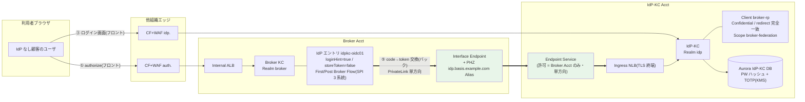
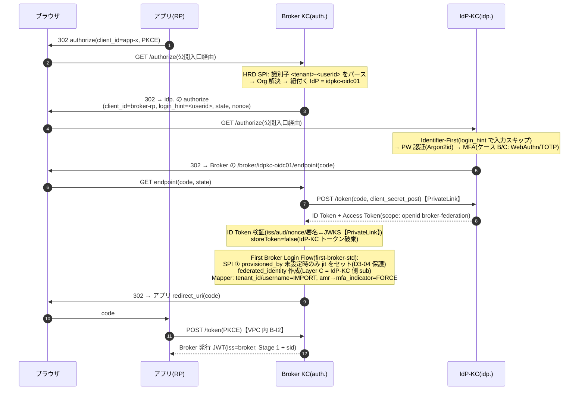

# U2/U6 付属: Broker KC ⇄ IdP-KC 間通信 詳細検討

作成: 2026-07-24 / 前提: Baseline v1、[U2 §2.2](02-keycloak-logical-design.md)(論理設定)・[U6 §6.3](06-infra-network-design.md)(経路)・[06a](06a-network-flow-diagrams.md)(B-O2/I-I2)
ステータス: Draft v1 — 現状決定の集約 + シーケンス詳細化 + **ギャップ 5 件の検出**(§7)

## 0. 現状決定のサマリ(どこで何が決まっているか)

| 観点 | 決定 | 出典 |
|------|------|------|
| 関係の型 | Broker から見て IdP-KC は「OIDC IdP の 1 つ」/ IdP-KC から見て Broker は「confidential client」(Keycloak-to-Keycloak federation 標準形) | ADR-033 §A、U2 §2.2.1 |
| Broker 側 IdP 登録 | **単一共有エントリ `idpkc-oidc01`**(IdP なし顧客の全 Org に紐付け。顧客別エントリは P-16 の IdP 数バジェット浪費のため不採用) | U2 §2.2.2 |
| IdP-KC 側 Client | `broker-rp`(Confidential / Standard Flow のみ / redirect URI 完全一致 1 本 / CORS なし) | U2 §2.2.3 |
| クライアント認証 | Phase 1 = `client_secret_post`(Secrets Manager 90 日ローテ)→ **Phase 2 = `private_key_jwt`**(mTLS は Phase 3 条件付き) | U6 §6.3.2、U7 D-U7-10b |
| バックチャネル経路 | **PrivateLink 単方向**(IdP-KC の Ingress NLB → Endpoint Service〔許可 Principal = Broker Acct のみ〕→ Broker 側 Interface Endpoint + PHZ Alias)。TGW 不使用 = 他組織非依存 | U6 D-U6-06 |
| フロントチャネル | ブラウザリダイレクトは**両クラスタとも公開入口経由**(`auth.` / `idp.` — 他組織 CF+WAF → Internal ALB) | U6 §6.3.1、06a B-I1/I-I1 |
| クレーム受け渡し | IdP-KC 側 Client Scope `broker-federation`(tenant_id / preferred_username / amr / email)→ Broker 側 IdP Mapper(amr → mfa_indicator は FORCE、他 IMPORT) | U2 §2.2.4 |
| identifier 引き継ぎ | `loginHint=true` — Broker の HRD SPI が抽出した `<userid>` を IdP-KC の Identifier-First へ転送(再入力なし) | U2 §2.2.2 |
| トークンの扱い | `storeToken=false`(Broker は IdP-KC トークンを保存しない)。**アプリに渡るのは Broker 再発行 JWT のみ**(IdP-KC はアプリ向けトークンを発行しない。Token Exchange も Broker の責務) | U2 §2.2.2、U5 :215、PoC V3'' |
| SSO 時の通信 | **2 回目以降は Broker 完結**(Broker SSO セッションが生きている間、IdP-KC への通信は発生しない) | ADR-033 §C、U6 D-U6-06 コスト根拠 |
| roles 伝播 | Phase 1 は伝播しない(認可は管理画面 DB 側 — ハイブリッド C) | U2 §2.2.4 未決事項 |

## 1. 全体像(論理 + 物理の合成図)

**重要な性質**: フロントチャネル(ブラウザ)は両クラスタとも公開入口を通る一方、**バックチャネル(code 交換・JWKS 取得・userinfo)だけが PrivateLink を通る**。IdP-KC から Broker へ届く経路は EventBridge PutEvents(idmap/ITDR イベント)のみで、**IdP-KC 侵害時に Broker の HTTP 面へ到達する経路が構造的に存在しない**(D-U6-06 根拠 1)。

## 2. シーケンス詳細

### 2.1 初回ログイン(IdP なし顧客のエンドユーザ)— JIT 発生

ポイント:
- ユーザから見えるのは「auth. → idp. → auth. → アプリ」の 3 リダイレクト。識別子は login_hint 引き継ぎで**再入力なし**(U2 §2.2.2)
- Broker 上のユーザは `provisioned_by=jit` + federated_identity(idpkc-oidc01)で作成される。**IdP-KC 側がマスタ(PW/MFA 保有)、Broker 側は影(フェデユーザ)** — 削除・無効化の連鎖は jit-scim §10.4 の S 系シナリオに従う
- MFA は IdP-KC 側で完結し、`amr` → `mfa_indicator`(FORCE)で Broker に伝播 → Broker は再 MFA しない(§FR-2.2.3 重複回避)

### 2.2 2 回目以降(SSO 中)— IdP-KC 非関与

Broker SSO セッションが有効な間は、別アプリへのログインも **Broker 完結**(IdP-KC への通信ゼロ)。IdP-KC の負荷・可用性がログイン全体に影響するのは「Broker セッション切れ後の再認証時」のみ。

### 2.3 バックチャネルの内訳(B-O2 の中身)

| 通信 | タイミング | 頻度 |
|------|-----------|------|
| OIDC Discovery(`/.well-known/openid-configuration`) | 起動時 + キャッシュ更新 | 低 |
| JWKS 取得 | 署名検証キャッシュ更新時(IdP-KC の Realm Key ローテ 90 日 + 並走 30 日 — U7 D-U7-03 と連動) | 低 |
| `POST /token`(code 交換) | **初回ログイン + Broker セッション切れ後の再認証のみ** | 中(ピーク = 朝) |
| `GET /userinfo` | IdP Mapper が userinfo 参照する設定の場合のみ(既定: ID Token のクレームで足りるため不使用) | ほぼゼロ |

## 3. セッション・トークンの二重構造

| 層 | 保持者 | 実体 | TTL(現状決定) |
|----|--------|------|----------------|
| アプリセッション | 各アプリ | アプリ Cookie 等 | アプリ裁量(RP ガイド) |
| **Broker トークン** | アプリが受領 | AT 30 分 / RT(SSO 従属)+ sid | U5 §5.2(P-09) |
| **Broker SSO セッション** | Broker KC | SSO Idle 1h / Max 24h | U5 §5.2 |
| **IdP-KC SSO セッション** | IdP-KC | idp. ドメインの Cookie | **⚠ 未確定(§7 GAP-2)** |
| IdP-KC 発行トークン | Broker が即時破棄 | storeToken=false | 破棄(残存なし) |

**入れ子の含意**: Broker セッションが切れても IdP-KC セッションが生きていれば、再認証は「リダイレクトだけで無操作 SSO」になる。**実効的なセッション上限は 2 層の合成で決まる**ため、IdP-KC 側 TTL を Broker と独立に長く設定すると P-09 の絶対 24h が骨抜きになる(→ GAP-2)。

## 4. 障害モード

| 障害 | 影響範囲 | 挙動・対策 |
|------|---------|-----------|
| IdP-KC 全停止 | **IdP なし顧客の新規ログイン/再認証のみ**(SSO 中ユーザと IdP あり顧客は無影響) | 障害ドメイン分離が 2-tier の設計意図どおり機能(ADR-033 §D)。Broker のエラー画面文言は U4 Sorry 系と整合させる |
| PrivateLink 断(Endpoint/ES 障害) | 同上(フロントは生きるが code 交換で失敗) | Endpoint は 3AZ 配置。**疎通監視は U6 §6.8.3 で U9 に引き渡し済み** |
| broker-rp Secret ローテ失敗 | 同上 | Secrets Manager 90 日自動ローテ + KC 2 世代並走(U7 D-U7-10b)。Phase 2 の private_key_jwt 化でリスク自体を縮小 |
| IdP-KC Realm Key ローテ | なし(JWKS 並走 30 日で Broker 側キャッシュが追随) | U7 D-U7-03 |
| DR(大阪切替) | **PrivateLink は Region 内リソースのため大阪側に別途複製が必要**(Endpoint Service + Endpoint + PHZ) | U6 §6.8.2 で確定済み。RB-DR 系 Runbook の手順対象 |

## 5. セキュリティ境界の要約(非対称の意図)

- IdP-KC = PW ハッシュ保有側 → **最も閉じる**: 公開面はログイン画面(idp.)と SCIM(scim-idp.)のみ。Broker からの着信は PrivateLink 単方向 + `broker-rp` 完全一致 redirect のみ。AWS 制御面でも IAM 相互信頼なし(D-U6-02)
- Broker = 公開フェデの窓口: 1000+ IdP へ Egress するが、IdP-KC へは「OIDC の RP」としてしか到達できない(Admin API へのクロスアカウント経路なし)
- 監査: 両側の KC イベント + PrivateLink Flow Log は監査 Acct へ集約(B-O4/I-O3)。Golden 系検知(G-2/G-3)は idpkc-oidc01 経由の異常発行も対象

## 6. 関連する既存図

- [06a §A.1](06a-network-flow-diagrams.md): B-O2(送信側)/ I-I2(着信側)
- [ADR-033 §C](../adr/033-keycloak-2tier-broker-idp-architecture.md): シナリオ 2 のシーケンス(要件定義版 — 本書 §2.1 が基本設計版)

## 7. 検出ギャップ(本検討で発見 → **2026-07-24 全 5 件解消済み**)

> **解消先**: GAP-1〜5 の決定は **[U2 §2.2.5](02-keycloak-logical-design.md)**(新設)に集約。GAP-1/2 は **[U5 §5.5.1](05-token-session-authz-design.md)** にも反映(L3 の idpkc-oidc01 例外 ON + TTL 整合 + 既定到達範囲の更新)。残る実機確認 = ① storeToken=false × logout id_token_hint の両立(G-SPI-Compat 追加)② AAL3 転送の IdP-KC 側 Flow 形態(PoC P-2 シナリオ)。

| # | ギャップ | 内容と提案 | 引き渡し先 |
|---|---------|-----------|-----------|
| GAP-1 | **ログアウト連鎖(Broker → IdP-KC)が未設計** | U5 のログアウト 4 レイヤーで L3(フェデ連動)は「既定 OFF」だが、これは**外部顧客 IdP 向けの判断**。IdP-KC は自社基盤であり、L2(Broker RP-Initiated)実行時に IdP-KC セッションを残すと「ログアウトしたのに idp. 経由で無操作再ログインできる」状態になる(共有端末で実害)。**提案: idpkc-oidc01 に限り Broker → IdP-KC の Back-Channel Logout(または RP-Initiated 連鎖)を既定 ON にする** | U5(§5.5 改訂)+ U2 |
| GAP-2 | **IdP-KC 側 SSO セッション TTL が未定義** | §3 の入れ子問題。**提案: IdP-KC の SSO Idle/Max を Broker と同値(1h/24h)以下に揃える**ことを U2 の Realm 設定に明記 | U2 §2.1 / U5 |
| GAP-3 | **ステップアップ(AAL3)の 2-tier 伝播が未設計** | Broker の Step-up Flow(acr "3" 要求)時、IdP なし顧客ユーザの WebAuthn は IdP-KC 側にある。Broker → IdP-KC へ `prompt=login` + `acr_values` を転送し、IdP-KC 側 Flow が AAL3 を実行して amr で返す経路の設計が必要。**提案: idpkc-oidc01 の再認証転送仕様を U2 §2.3.4 に追加** | U2 / U4 |
| GAP-4 | **`prompt=login` / `max_age` の転送方針が未明記** | L4 不信任オプション(§FR-4.2)や再認証要求を IdP-KC に伝えるか。Keycloak の IdP 設定では既定転送されない項目があるため明示が必要 | U2 |
| GAP-5 | **login_hint の書式契約が暗黙** | Broker は `<userid>`(tenant 除去後)を渡す(U2 §2.2.2)が、IdP-KC 側 Identifier-First が `<tenant>-<userid>` 完全形も受けるのか、`<userid>` のみか — 両クラスタの HRD/ログイン SPI 間の**入力契約として明文化**が必要(実装齟齬でループの恐れ) | U2 |

## 改訂履歴

- 2026-07-24 (v1.1): GAP-1〜5 の解消を U2 §2.2.5（新設）+ U5 §5.5.1 に反映済み。§7 に解消先注記。
- 2026-07-24: 初版。U2 §2.2 / U6 §6.3 / U5 / ADR-033 の決定を集約し、初回ログインの基本設計版シーケンス・セッション二重構造・障害モードを詳細化。**GAP-1〜5 を検出**(最重要 = GAP-1 ログアウト連鎖と GAP-2 セッション TTL)。
