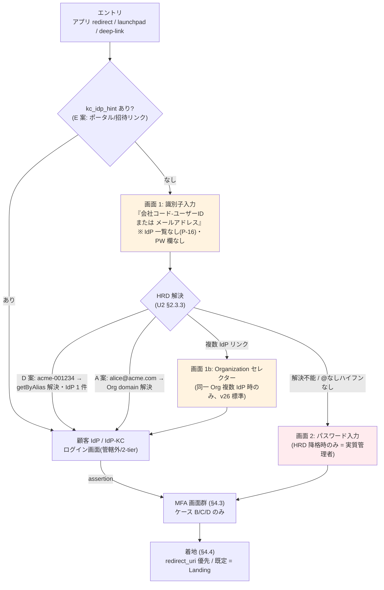
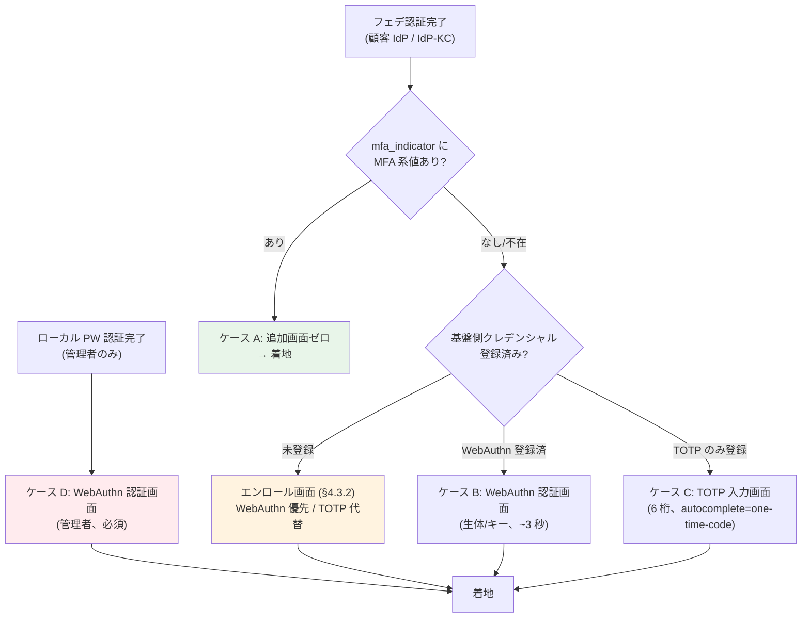

# U4: 認証体験・UX 設計（ログイン画面フロー / ブランディング / MFA UX / Landing / Sorry / A11y）

作成日: 2026-07-23
ステータス: Draft v1（Wave 2）
**前提: [01-architecture-baseline.md](01-architecture-baseline.md) Baseline v1（P-01〜P-18）**
上位文書: [00-basic-design-plan.md](00-basic-design-plan.md) §U4

---

## 4.0 背景・なぜここで決めるか（スコープ・境界）

### 4.0.1 背景

U2（[02-keycloak-logical-design.md](02-keycloak-logical-design.md)）で Authentication Flow 5 系統・HRD SPI・Organizations 構成という**認証の内部機構**は確定した。しかしユーザーが実際に体験するのは Flow の木構造ではなく**画面**である。識別子を 1 回入力するだけで正しい IdP に到達できるか、MFA が二重にならないか、権限のないアプリを踏んだときに「真っ白い 403」ではなく次のアクションが示されるか——これらは Flow 設計と独立に決めないと決まらない。

さらに本基盤固有の制約が UX 設計を通常の Keycloak カスタマイズと大きく変える:

1. **P-16（1000+ IdP）**: ログイン画面に IdP 一覧を出す設計は**性能上成立しない**（U2 §2.7.2 制約 2）。HRD Identifier-First は UX 選好ではなく必須条件（ADR-055 2026-07-23 格上げ）。
2. **P-07（γ シナリオ）**: 一般ユーザ（P-3）は全員フェデ強制。ローカル PW 画面に正当に到達するのは管理者層のみ。画面設計は「PW 入力が例外」という前提で組む。
3. **P-18（インターネット境界 = 他組織管理）**: ADR-022 が推奨したエッジ層 Sorry 制御（CloudFront + Lambda@Edge）は**我々が実装を保証できない**。実装位置の再決定が必要（§4.5）。

本書はこの前提の下で、画面遷移・ブランディング（Keycloak Theme）・MFA 4 ケースの体験・Post-login Landing・Sorry・アクセシビリティを一括で確定する。

### 4.0.2 スコープと他単元との境界

| 領域 | 本書（U4） | U2（Keycloak 論理） | 他単元 |
|---|---|---|---|
| Authentication Flow の木構造・SPI 入出力 | 参照のみ | ✅ 決定（§2.3/§2.4） | — |
| ログイン画面の**画面遷移・文言・フォールバック UX** | ✅ 決定 | — | — |
| Keycloak Theme（login/account）設計 | ✅ 決定 | 制約供給（§2.7.2: IdP 一覧非描画） | — |
| Landing（サービス選択画面）/ Sorry SPA の画面・機能設計 | ✅ 決定 | — | 配信インフラ・要求仕様は U6 |
| MFA の**画面遷移・エンロール UX** | ✅ 決定 | Flow 配置（§2.3.1/§2.3.4） | クレデンシャルデータ保持は U3 |
| ステップアップの acr/max_age **最終値** | 初期値のみ | ACR-to-LoA 設定（§2.3.4） | ✅ U5 で確定 |
| Landing の認可判定 API・エンタイトルメントデータ | 呼出契約のみ | — | 管理画面 Backend（ADR-038 / U10） |
| A11y の CI・当事者テスト運用 | ✅ 方針決定 | — | CI 実装は U9 |
| ユーザ管理画面（テナント管理者 SPA）の UX | 対象外 | — | U10（ADR-038、A11y は ADR-043 準拠のみ本書で言及） |

### 4.0.3 本書の前提（Baseline v1 からの主参照）

P-06（単一 Realm + Organizations）/ P-07（γ）/ P-08（識別子 `<tenant>-<userid>`）/ P-11（SSO L1 完全信頼デフォルト）/ P-16（1000+ IdP・IdP 一覧非表示必須）/ P-18（エッジ他組織管理）。

### 4.0.4 決定サマリ（本書の 8 決定）

| # | 決定 | 節 |
|---|---|---|
| D-U4-01 | ログイン UX = **Identifier-First 2 段階**（識別子画面 → IdP or PW）。IdP 一覧・IdP ボタンは**恒久的に非表示** | §4.1 |
| D-U4-02 | HRD 失敗時は**応答同一化 + 書式ヒント表示 + PW フォーム降格**、複数 IdP は Organization セレクター委譲（U2 attempted() 降格と整合） | §4.1.3 |
| D-U4-03 | ブランディング = **パターン A（基盤統一テーマ 1 本）**。テナント別ロゴ/色は Phase 1 不採用（テキスト確認表示まで）、A' 移行条件を明文化 | §4.2 |
| D-U4-04 | MFA UX = 4 ケース（A スキップ / B WebAuthn / C TOTP / D 管理者 PW+WebAuthn）+ **初回ログイン時エンロール強制** + Recovery Codes 標準発行 | §4.3 |
| D-U4-05 | ステップアップ再認証は**専用文言画面**（「再ログイン」と言わない）、AAL2 max_age=900s / AAL3 max_age=300s（U5 §5.9.1 で確定） | §4.3.4 |
| D-U4-06 | Landing = **Pattern 1（許可サービスのみ filter 表示）+ 申請可能セクション**。判定根拠は JWT roles ではなく**管理画面 Backend のエンタイトルメント API**（暫定、B-627） | §4.4 |
| D-U4-07 | Sorry = **基盤側 Sorry SPA（Landing SPA 同居 `/sorry`）を主実装**。エッジ 403→302 集約（ADR-022 パターン ii）は P-18 により**他組織への要求仕様（REQ-IN-07 詳細化）に降格**、RP 側 redirect を標準規約化 | §4.5 |
| D-U4-08 | A11y = 全 UI 接点 **WCAG 2.2 AA + JIS X 8341-3:2016 AA**、axe-core CI で PR ブロック（ADR-043 の設計適用） | §4.6 |

---

## 4.1 ログイン画面フロー全体図

### 4.1.1 全体フロー

**採用（D-U4-01）**: Identifier-First 2 段階。画面 1 は**識別子入力のみ**（パスワード欄なし・IdP ボタンなし）。HRD 解決結果に応じて IdP リダイレクト / ローカル PW 画面 / セレクターに分岐する。



- **根拠**: ADR-020（Identifier-First は Notion / Dropbox / Microsoft 365 の業界標準。全案の最終フォールバック B = IdP セレクターは、本基盤では**テナント限定セレクター**に縮小して採用）、ADR-055（識別子 D 案 + メール A 案ハイブリッド、U2 §2.3.3 確定値）、U2 §2.7.2（IdP 一覧非表示 = 性能必須条件。realm 全 IdP を出す「グローバルセレクター」は禁止であり、セレクターを出せるのは HRD で Org が確定した後のテナント限定文脈のみ）。
- **画面 1 の入力欄は 1 つ**: 識別子と email を同一フィールドで受ける（HRD SPI が `@`/ハイフンで判別、U2 §2.4.2）。フィールドラベルとプレースホルダは `hrd_mode` Org attribute（`identifier`/`email`/`both`）に依存しない共通文言とする（画面 1 表示時点ではテナント未確定のため。文言例: 「ID（例: acme-001234）またはメールアドレス」）。
- **代替案**: (a) 統合 1 画面（識別子 + PW 同時表示、ADR-024 §B の統合 UI）— γ シナリオでは 98% のユーザに無関係な PW 欄を見せ、「基盤にパスワードを入れる」誤誘導（フィッシング教育上も有害）となるため不採用。(b) IdP ボタン列挙 — P-16 で禁止。(c) 顧客別 URL（方式 C）— Phase 2 大口顧客オプション（ADR-055 §F、B-618/B-621）。
- **未決事項**: HRD Cookie 記憶（ADR-020 補⑥、2 回目以降の画面 1 スキップ）は Phase 1 では実装しない（SSO セッションが生きていれば Cookie Authenticator で画面自体が出ないため効果が薄い）。プライベートブラウジング比率等の実測後に Phase 2 再評価。

### 4.1.2 「2 回ログイン」誤解への画面上の対策

**採用**: 画面 1 に「ここではパスワードを入力しません。所属組織のサインイン画面に移動します」という 1 行説明を常設し、IdP リダイレクト直前のインタースティシャル画面は**設けない**（遷移は即時 302）。顧客説明は ADR-024 §D のテンプレートを一次資料とする。

- **根拠**: ADR-024 §D（操作 2 段階・認証 1 回が業界標準。説明はテキストで足り、画面を増やすと本末転倒）。
- **未決事項**: 顧客 IdP 側画面（ADR-024 の ❷）のブランディング整合は顧客 IT 部門の管轄であり、オンボーディングガイド（U9 Runbook）に「IdP 側画面に自社ロゴを設定すること」を推奨事項として記載する。

### 4.1.3 HRD 失敗時のフォールバック UX

**採用（D-U4-02）**: フォールバックは 3 系統に限定し、いずれも**ユーザ列挙（user enumeration）を防ぐ応答同一化**を守る。

| ケース | SPI 挙動（U2 確定） | 画面挙動（本書決定） |
|---|---|---|
| ① 識別子形式だが Org 不在 / IdP リンクなし（例: `acmee-001234` タイポ） | `attempted()` 降格 → PW フォーム | 画面 2（PW 入力）へ**無言で**遷移。「組織が見つかりません」等の**存在有無を漏らすメッセージは出さない**。PW 認証失敗時は汎用エラー「ID またはパスワードが正しくありません」+ 書式ヒント「組織 ID にお心当たりがない場合は `会社コード-ユーザーID` の形式をご確認ください」 |
| ② email 形式だが Org domain 未登録 | Organization Identity-First が解決不能 → PW フォーム | 同上（応答同一化）。email 保有顧客には HRD A 案登録済みドメイン一覧の社内周知を顧客側運用に依頼（オンボーディングガイド） |
| ③ `@` なし・ハイフンなし（素の userid） | `attempted()` 降格 → PW フォーム | PW フォームへ遷移（管理者ローカルの正規経路）。フォーム上部に恒常ヒント「一般利用者の方は `会社コード-ユーザーID` を入力してください」を表示（U2 §2.3.3 未決事項への回答: **エラー扱いにせず管理者ローカル試行 + ヒント表示**とする） |
| ④ 同一 Org に複数 IdP リンク | `attempted()` 降格 → **Organization セレクター**（v26 標準、hrd-implementation §4 パターン B） | セレクターは**当該 Org にリンクされた IdP のみ**を表示（テナント限定 = P-16 制約に非抵触）。表示順は IdP `displayName` 昇順（優先度属性 `idp_priority` の設計は U2 未決 #5 と合同確定） |

- **根拠**: ADR-020 §F（未登録識別子への即時 `User not found` は列挙リスク。Generic error + 応答同一化が対策）、U2 §2.4.2（HRD SPI は fail-open で常に降格。「応答同一化は U4 の画面設計と連動」の引き取り）、ADR-020 §C（全案の最終フォールバックにセレクターを置くのが業界標準——本基盤ではテナント限定形で採用）。
- **応答時間の同一化**: ① の Org 不在時も `getByAlias()` の失敗を即応答せず、成功時と同等の遷移（PW フォーム描画）に落とすため、タイミング差はフォーム描画コストに吸収される。追加のダミー遅延は入れない（計測して有意差が出た場合のみ U7 と対策検討）。
- **代替案**: フォールバック時に「お問い合わせ窓口」モーダルを出す — 正規の管理者ローカル経路と衝突するため不採用（ヒント文言に窓口リンクを含める形で吸収）。
- **未決事項**: ヒント・エラー文言の最終稿は顧客 UX テスト（Phase 1 パイロット顧客）で確定。`hrd_mode=identifier` 専用テナントのユーザが email を入れた場合の個別文言出し分けは、画面 1 時点でテナント未確定のため**不可能**である旨を仕様として明記（顧客への案内テンプレートで補う）。

### 4.1.4 ディープリンク・着地の原則

**採用**: `redirect_uri` 優先（deep-link 尊重）、認可要求に redirect 先がない基盤起点ログイン（launchpad URL 直叩き）のみ Landing に着地（B-625 推奨案を暫定凍結）。`kc_idp_hint` 付きディープリンク（E 案）は画面 1 をスキップする正規経路として許容する（ポータル・QR・招待メール用途、ADR-020 §B）。hint 不正時は Keycloak 標準動作で画面 1 に降格。

---

## 4.2 ブランディング設計（Keycloak Theme）

### 4.2.1 パターン選定

**採用（D-U4-03）**: **パターン A（認証基盤 = 統一ニュートラルテーマ 1 本、テナント/アプリ別差し替えなし）**を Phase 1 基準とする。カスタムテーマは 1 つ（`basis` login theme + account テーマ）のみを保守する。

| 項目 | Phase 1 の範囲 |
|---|---|
| 基盤ロゴ・配色 | 基盤ブランドのニュートラルデザイン（全テナント・全アプリ共通） |
| テナント別ロゴ / 配色 | **不採用**（画面 1 はテナント未確定で原理的に不可能。HRD 解決後の画面でも出さない） |
| テナントの識別表示 | **テキストのみ**: Organization セレクター（§4.1.3 ④）と基盤側 MFA 画面に Org 表示名（`tenant_display_name`）を表示（「どの組織として認証中か」の確認、Sorry/Landing のテナント名表示と同趣旨） |
| アプリ別（client_id 単位）テーマ | 不採用（A' へ移行するまで） |
| 多言語 | `messages_ja.properties`（主）+ `messages_en.properties`。既定 ja |
| 文言管理 | 全カスタム文言は messages プロパティに集約（FTL 直書き禁止、A11y・翻訳・監査の一元化） |

- **根拠**: ADR-024（ベースライン = A、Slack/Notion 型。テナント別ブランドは顧客 IdP 画面（顧客管轄）と アプリ画面（JWT tenant_id で解釈）が担う二層構造で充足）、branding-strategy-evidence.md §1.A（2 軸 Yes/No 判定で現時点の要望は両軸 No）、U2 §2.7.2(b)（テーマは IdP リストを描画しないことが設計制約）。テーマ 1 本化は A11y 検証対象（§4.6）とバージョン追従（RHBK 年 1-2 回、ADR-055 §A.7）の面積を最小化する。
- **代替案**: パターン B（テナント別ロゴ動的注入、Theme Selector SPI）— SPI が 1 つ増え、1000 テナントの資産管理（ロゴ入稿・検収・CDN 配置）が発生するため Phase 1 不採用。パターン C（完全分離）— Realm 分離が必要で ADR-017 に反する。規制顧客の契約条項で強制された場合のみ ADR-017 例外条件とセットで個別判断。
- **CSRF 制約（設計制約）**: カスタムテーマ実装時、Keycloak 標準の hidden CSRF フィールド・`session_code` を**削除・改変しない**（ADR-057 §D.1 / ADR-024 2026-07-06 追記）。テーマの PR レビューチェックリストに含める（U9）。

### 4.2.2 A' への移行条件（パターン A → A'）

**採用**: 次のいずれかが発生した時点で A'（client_id 単位 Login Theme Override）へ移行する。移行はテーマの派生（Keycloak Theme `parent` 継承）で行い、base テーマ 1 本 + 差分オーバーレイ構成とする:

1. 複数アプリ間でログイン画面のブランド差別化要望が具体化（ADR-024 §H「経費精算と決済で違うブランド体験」型の要望）
2. エッジ層アプリ（§C-6 の 20% 側）が基盤ログインを使いつつ独自ブランドを求めるケース

Keycloak は Client 単位 Theme Override に上限がないため（ADR-024 §G）、A' 移行に技術的ブロッカーはない。**テナント別**（顧客別）要望は A' では解けないため、その場合は Phase 2 方式 C（顧客別 URL + URL 単位ブランディング、ADR-055 §F、B-618/B-621/B-624）で受ける。

### 4.2.3 テーマの構成と保守

**採用**: ADR-043 §B.1 の構成（`themes/basis/login/*.ftl` + `resources/css/accessible.css` + `js/a11y-helpers.js` + messages）を正とし、A11y 要件（§4.6）を**テーマの受け入れ基準**に組み込む。カスタマイズ対象 FTL は次に限定: `login.ftl`（識別子画面 + PW 画面）/ `login-otp.ftl` / `login-otp-config.ftl`（TOTP エンロール）/ `webauthn-authenticate.ftl` / `webauthn-register.ftl` / `login-recovery-authn-code-config.ftl` / `login-recovery-authn-code-input.ftl` / `select-organization.ftl`（セレクター）/ `error.ftl` / `info.ftl`。**上記以外は base（keycloak.v2）継承のまま**とし、Keycloak バージョンアップ時の差分確認対象を最小化する。

- **未決事項**: account テーマ（アカウント設定画面）のカスタマイズ深度（標準 PatternFly ベース + 文言/ロゴのみ、を暫定）。Account Console の IdP リンク一覧無効化（U2 §2.7.2(c)）の具体設定はテーマ実装時に確定。

---

## 4.3 MFA UX（4 ケース + エンロール + ステップアップ）

### 4.3.1 4 ケースの画面遷移（§FR-3.4.0.B 対応）

**採用（D-U4-04）**: §FR-3.4.0.B の 4 ケースを画面遷移に写像する。判定は `mfa_indicator` 正規化属性（ADR-031 / U2 §2.4.4、fail-safe: 不在 = 未済）による。



| ケース | 対象 | 基盤側追加画面 | UX 上の要点 |
|:-:|---|---|---|
| **A** | P-3・顧客 IdP MFA 済（想定 70%） | **ゼロ** | 二重 MFA 回避（ADR-024 §D アンチパターン 1 の防止）が本基盤の中核 UX 価値。画面には何も出ない = 設計成功の状態 |
| **B** | P-3・IdP MFA 未済 + WebAuthn 可（25%） | WebAuthn 認証 1 画面 | プラットフォーム認証器（Touch ID / Windows Hello / パスキー）優先。画面に「所属組織の設定では追加確認が必要です」の説明 1 行（「基盤が勝手に足した」という顧客クレームの予防、§FR-3.4.5 のメッセージと整合） |
| **C** | P-3・WebAuthn 不可（〜5%） | TOTP 入力 1 画面 | `autocomplete="one-time-code"`、入力 6 桁自動送信はしない（誤送信によるロックアウト防止・A11y 2.2.1） |
| **D** | 管理者ローカル（P-1 / IdP なしテナント管理者、〜2%） | PW → WebAuthn 必須 | TOTP への緩和は不可（攻撃の主要標的、§FR-3.4.5）。Break Glass はランブック管理の別手順（U7/U9）で本 UX の対象外 |

- **根拠**: §FR-3.4.0.A/B（案 3 信頼レベル評価方式 + 4 ケース完全整理）、ADR-031（fail-safe）、ADR-026 A 案（不足分を基盤が補完、拒否しない）、U2 §2.3.1（管理者 WebAuthn 必須）/ §2.3.4。
- **代替案**: ケース B/C の説明文言を出さない — 「IdP で認証したのにまた聞かれた」問い合わせが確実に発生するため不採用。SMS OTP — §FR-3.4.6 で不採用確定（NIST 非推奨・PII）。
- **未決事項**: Trust Device（30 日 MFA スキップ、§FR-3.4.6 Should）の採否と対象ケース（B/C のみ、D は対象外とする案）— ヒアリング後に確定。ケース C の対象判定（「WebAuthn 不可」の検出方法: ユーザ自己申告のフォールバックリンク方式を暫定採用、User-Agent 判定は不採用）。

### 4.3.2 エンロールフロー（初回登録 UX）

**採用**: ケース B/C 対象ユーザは**初回ログイン時にエンロール強制**（猶予期間なし。Keycloak Required Action `webauthn-register` を Conditional サブフロー内で発火）。画面遷移:

1. **登録案内画面**: 「追加の本人確認の設定が必要です」+ 所要時間目安（1 分）+ WebAuthn を第一候補として提示
2. **WebAuthn 登録**（`webauthn-register.ftl`）: プラットフォーム認証器優先。認証器名は自動命名（ユーザ入力を必須にしない — WCAG 3.3.8 認知負荷配慮）
3. **フォールバックリンク**: 「この端末で生体認証・セキュリティキーが使えない場合」→ TOTP 登録（`login-otp-config.ftl`、QR + 手動キー併記。手動キーはコピーboタン付き — スクリーンリーダー/QR 読取不能環境対応）
4. **Recovery Codes 発行**（§4.3.3）
5. 完了 → 着地

- **根拠**: §FR-3.4.6（全顧客 MFA 必須化 = Must。猶予期間を置くと「MFA 漏れユーザ」が常在しコンプラ主張が崩れる）、§FR-3.4.4 の移行キャンペーンは既存顧客一括移行時の話であり新規基盤の Phase 1 には適用しない。
- **代替案**: 猶予期間（7 日間スキップ可）— PCI DSS 8.3 / APPI の説明が「原則必須」に弱まるため不採用。
- **未決事項**: 複数クレデンシャル登録推奨（WebAuthn 2 台目）の案内タイミング（エンロール直後 vs アカウント設定画面誘導）。法人共用端末（キオスク）での WebAuthn 運用可否は B-IDM 系ヒアリングと連動（U3）。

### 4.3.3 Recovery Codes

**採用**: Keycloak 標準 **Recovery Authentication Codes** を、基盤側クレデンシャルを持つ全ユーザ（ケース B/C/D）に発行する。

| 項目 | 決定 |
|---|---|
| 発行タイミング | エンロール完了直後に自動発火（Required Action）。一括表示 + 「ダウンロード / 印刷 / コピー」ボタン |
| 保存形式 | ハッシュ化保存（Keycloak 標準。§FR-3.4.1「リカバリーコードは bcrypt ハッシュ化」と整合） |
| 利用画面 | MFA 画面の「別の方法で確認」リンク → コード入力画面（`login-recovery-authn-code-input.ftl`） |
| 使い切り時 | 残数低下（残 3 以下）で MFA 成功後にバナー再発行誘導。全消費時は再発行を Required Action で強制 |
| 紛失時（自己救済不能） | ケース B/C（フェデユーザ）= 顧客テナント管理者がユーザ管理画面から基盤側クレデンシャルをリセット（ADR-038 / U10 に API 要件として引き渡し）。ケース D（管理者）= 弊社運用ランブック（U9、本人確認手順込み） |

- **根拠**: ケース A（大多数）はそもそも基盤側クレデンシャルがなくリカバリー不要 = リカバリー運用面積が小さいのが本設計の利点。リセット権限をテナント管理者に委譲するのは ADR-037 Shared Responsibility と整合。
- **注記**: クレデンシャルリセットは U7 §7.6.1 L4 の管理者 JIT 承認経路のみ（通常操作ではない）。
- **未決事項**: リセット時の本人確認基準（顧客側ポリシー依存）— 顧客案内テンプレートに選択肢として提示（U9/U10）。

### 4.3.4 ステップアップ認証の再認証 UX（AAL2 → AAL3）

**採用（D-U4-05）**: アプリが `acr_values` を上げて再認可要求した際の画面は、通常ログインと**明確に区別された文言**で出す。

| 要求 | 発生条件 | 画面 | max_age 初期値 |
|---|---|---|---|
| AAL2（LoA2） | 重要操作（決済・大量出力等）で `acr_values=2` | 「操作の確認のため、追加の本人確認を行います」+ WebAuthn / TOTP | 900s（15 分） |
| AAL3（LoA3） | 最重要操作で `acr_values=3` | 同上 + **Phishing-resistant のみ**（WebAuthn/パスキー。TOTP は選択肢に出さない） | **300s（5 分）** |

画面遷移の要点:

1. **コンテキスト維持**: 再認証完了後は元の操作画面に `redirect_uri` で戻る（OIDC 標準動作）。アプリ側には「ステップアップ要求時に操作コンテキストを保持して再開する」責務があり、U5 RP 実装ガイドに規約化する。
2. **フェデユーザの AAL3**: 顧客 IdP が AAL3 相当を出せない場合、基盤側 WebAuthn で補完（ADR-026 A 案）。この場合ケース A ユーザでも基盤側 WebAuthn エンロール（§4.3.2）が**初回ステップアップ時に**発生する。画面に「この操作には、所属組織のサインインに加えて本基盤での確認が必要です」の説明を出す。
3. **max_age 超過時**: 「最後の確認から時間が経過しました」文言で再認証（ADR-026 §C。「セッション切れ」と言わない — 認証エラーではないため）。
4. **文言原則**: 「再ログイン」「ログインし直してください」という表現は全ステップアップ画面で禁止（ADR-024 §D の「2 回ログイン」誤解と PW 再入力の無駄を誘発するため。ADR-021 Sorry アンチパターンと同系統）。

- **根拠**: ADR-026 §H（AAL2=15 分 / AAL3=5 分推奨、A 案 = 補完）、RFC 9470、U2 §2.3.4（LoA Conditional サブフロー。max_age は U5 §5.9.1 で確定）。
- **代替案**: C 案（AAL 不足時エラー返却）— ADR-026 で不採用済み。
- **未決事項**: AAL2/AAL3 を要求する操作一覧（アプリ側契約）は U5 クレーム辞書 + RP 実装ガイドで確定（U2 §2.8.4 #9 と同一）。ステップアップ用クレデンシャルの保持整理（§FR-3.4.0.B 4 ケースへの追記）は U3。

---

## 4.4 Post-login Landing（サービス選択画面）

### 4.4.1 位置付けと構成

**採用**: Post-login サービス選択画面を**独立 SPA（launchpad）として構築**（ADR-021 Decision 3 / B-622 A 案を暫定凍結）。Pre-login は B-626 ヒアリング待ちのため本設計に含めない（デフォルト構成 ②「Post + Sorry」、§FR-4.3.B）。

| 項目 | 決定 |
|---|---|
| OIDC Client | `launchpad-spa`（Public Client + PKCE、Standard Flow のみ）。U2 Client テンプレート（U5 §5.9.2 で追加依頼済み）に従い登録 |
| ドメイン | `launchpad.<domain>`（仮）。Sorry（§4.5）と同一 SPA・同一配信 |
| 着地原則 | `redirect_uri` 優先、基盤起点ログインのみ launchpad 着地（§4.1.4 / B-625） |
| Keycloak アカウント設定画面 | 補助（クレデンシャル管理専用導線として launchpad からリンク）。Applications タブは使わない |

- **根拠**: ADR-021 §E（業界標準は独立 SPA。Okta Dashboard / M365 portal / Atlassian start）、アカウント設定画面の Applications タブはタイル UX・ロールベース可視性が不足。
- **代替案**: アカウント設定画面流用（B-622 B 案）— Pattern 1 の filter 表示（下記）が実装できず不採用。

### 4.4.2 Pattern 1（許可サービスのみ filter 表示）

**採用（D-U4-06）**: §FR-4.3.D ベースラインどおり **Pattern 1** を採用。画面構成:

```
┌─ launchpad ──────────────────────────────┐
│ <ユーザ名> さん ／ <テナント表示名>          │
│                                           │
│ 利用可能なサービス:                          │
│  [タイル: サービス名 / 説明 1 行 / 起動]      │
│  （エンタイトルメント API の結果のみ表示）      │
│                                           │
│ ── 申請可能なサービス ──（任意セクション）      │
│  [タイル: サービス名 → 申請リンク]            │
│                                           │
│ フッタ: アカウント設定 / ログアウト / サポート  │
└───────────────────────────────────────────┘
```

| 表示項目 | 供給元 |
|---|---|
| ユーザ名・テナント表示名 | ID Token（`sub`）+ userinfo（PII は JWT 非搭載のため userinfo 経由、ADR-030 / U2 §2.5.1） |
| 利用可能サービス一覧（タイル: 名称・説明・起動 URL・アイコン） | エンタイトルメント API（§4.4.3） |
| 申請可能サービス + 申請導線 | 同 API（`requestable` フラグ）。採否は Sorry 発生頻度を下げる推奨機能（§FR-4.3.E） |
| お気に入り / 最近使った | **Phase 2**（個人化はエンタイトルメント基盤安定後） |

タイルクリック → アプリ URL へ遷移 → アプリの OIDC フローが SSO セッションで即時完了（ADR-021 §G）。

- **根拠**: §FR-4.3.D（Pattern 1 = 業界主流 4 根拠: 失敗しない UX / defense-in-depth / メンタルモデル / 可視性）。**アプリ側認可は Pattern 1 でも Must**（省略は false sense of security、§FR-4.3.D ベースライン）— U5 RP 実装ガイドに明記する。
- **代替案**: Pattern 2（全表示 + アプリ認可のみ）— Sorry が日次の本道になり UX 劣化、不採用（§FR-4.3.D）。

### 4.4.3 認可判定（表示 filter）の呼び出し先

**採用（暫定、B-627 依存）**: launchpad の表示判定は **JWT roles の直読ではなく、管理画面 Backend（ADR-038）のエンタイトルメント照会 API** `GET /api/me/apps`（自身の AT で呼出、応答 = 利用可能/申請可能サービスのリスト）を用いる。

- **根拠**: U2 §2.5.4 で **業務アプリ Client には roles Mapper を付けない**（ハイブリッド C: 細粒度認可はアプリ / 管理画面 Backend DB 側）ことが確定しており、launchpad が自 token の roles を見る方式（ADR-021 §E の JWT 案）は**本基盤のクレーム設計では成立しない**。エンタイトルメントの SSOT を管理画面 Backend DB に一元化することで、アプリ追加時の更新箇所が 1 箇所（App Registry / ADR-059 と接続余地）になる。
- **代替案**: (a) launchpad Client にのみ realm role Mapper を付け JWT 判定 — 「管理系 Client に限り roles 発行」の U2 決定とは整合するが、表示制御のためにロール体系を二重管理することになり不採用。(b) Keycloak Admin API 直叩き — SPA からの Admin API 到達は権限面で不可。
- **未決事項**: B-627（判定根拠）の正式回答で本節を確定。API スキーマ（サービスカタログ項目: 名称 / 説明 / URL / アイコン / requestable / 申請先）は U10（ADR-038 API 仕様）で定義し、本書はフィールド要件のみ引き渡す。テナント別ブランディング（B-624）は Phase 1 不採用（§4.2 と同基準）。

---

## 4.5 Sorry Page

### 4.5.1 実装位置の再決定（P-18 対応）

**採用(D-U4-07)**: Sorry の実装を次の 2 層に再構成する。

| 層 | 内容 | 主体 | 位置付け |
|---|---|---|---|
| **主実装** | **基盤側 Sorry SPA**: launchpad SPA 内ルート `/sorry`（同一 codebase・同一配信）。クエリ `?app=<id>&reason=<code>` を受けてガイダンス表示 | 弊社（自管理） | **Phase 1 必須** |
| **主経路** | **RP（アプリ）側 redirect**: アプリが認可失敗（403）を検知したら `https://launchpad.<domain>/sorry?app=...&reason=...` へ redirect する規約を **U5 RP 実装ガイドの標準要件**とする（SPA/BFF で数行） | 各アプリ | Phase 1 必須 |
| **追加層（要求仕様）** | **エッジ 403→302 集約**（ADR-022 パターン ii: CloudFront + Lambda@Edge origin-response）: P-18 により CloudFront/Lambda@Edge は**他組織管理の監査 Acct 内**にあり、我々は実装を保証できない。U6 の要求仕様体系（06-infra-network-design.md §6.7.1 **REQ-IN-07**）の**詳細化別紙**として要求する | 他組織 | あれば良い層。**受諾されても RP 側 redirect 規約は廃止しない**（二重化） |

- **根拠**: ADR-022 は「CloudFront + Lambda@Edge をアプリごとに自管理配置」（ADR-039 v2 前提）で推奨度 ★5 としたが、その前提が P-18 で崩れた（Lambda@Edge は CloudFront と同一アカウント必須 = 他組織アカウント内実装になる）。**実装も変更 SLA も保証できない層に UX の本道を置けない**ため、ADR-022 のパターン選定自体は維持しつつ、配置主体の変更に伴い「エッジ = 要求仕様・追加層」「自管理 = 主実装」に責務を再配分する。U6 §6.7.1 REQ-IN-07 が既に「詳細は U4/ADR-022 の要求として別紙」と placeholder を置いており、本節がその別紙の内容を確定する。
- **要求仕様（REQ-IN-07 別紙、U6 へ引き渡し）**: (1) 対象 = 各アプリ CloudFront の origin-response、(2) 動作 = `403` かつ `X-Sorry-Reason` ヘッダあり → `302 /sorry?app=&reason=`（ADR-022 §B の実装例）、(3) Sorry SPA origin（弊社側）への追加ビヘイビア、(4) Lambda@Edge 変更のリードタイム SLA。回答（可否・SLA）は U6 の REQ 管理表に追記。
- **代替案**: (a) Keycloak error テーマで Sorry（ADR-021 パターン B）— Sorry は「認証成功 + 認可なし」でありアプリ側 403 が起点。Keycloak を経由しないため実装位置として不成立。(b) アプリ個別 Sorry ページ（パターン A）— N アプリ個別実装で非経済的（B-629 の「集約」を SPA 集約 + redirect 規約で実現）。(c) ALB Native JWT Validation（パターン v）— ALB も他組織管理（P-18 Inbound 構成）のため同様に要求仕様側。粗粒度制御が必要になった場合に REQ として追加検討。
- **未決事項**: B-628/B-629 の正式回答（本節は「集約 = SPA + RP 規約、エッジは要求」を推奨回答として提示）。他組織の REQ-IN-07 受諾可否と SLA（G-EGRESS と同じ交渉トラックで U6/U9 が確認）。

### 4.5.2 表示項目・禁止項目

**採用**: §FR-4.3.E ベースライン（ADR-021 §F の最低限セットの詳細化）をそのまま採用する。

| 表示（必須） | 供給元 |
|---|---|
| 「このサービスをご利用いただけません」（**認証エラーと誤認させない**見出し） | 固定文言 |
| ユーザ名 + テナント表示名（「別人としてログイン中?」の解消） | 自 token / userinfo（launchpad と同経路） |
| 対象サービス名 | `?app=` → エンタイトルメント API のカタログ名解決（未解決時は表示省略、生パラメータは**表示しない** — インジェクション/列挙対策） |
| 拒否理由の要約 | `?reason=` コード → 固定文言辞書（`not_entitled` / `tenant_not_allowed` / `stepup_required` 等）。自由文は受けない |
| 次のアクション: [管理者に申請] [launchpad に戻る] [サポート窓口] | 申請導線はエンタイトルメント API の `requestable` に連動 |
| リクエスト ID + 発生時刻 | SPA 生成（UUID + JST）。監査ログ突合用に Sorry 表示イベントを Backend へ記録 |

**表示禁止**（§FR-4.3.E 禁止リスト準拠）: 他テナントのサービス名/URL・スタックトレース・内部システム名/IP・生 token・他ユーザ情報・内部エラー詳細・「必要ロール vs 現在ロール」の**内部ロール名**（ADR-021 アンチパターン「詳細な権限内訳」。必要権限の表示粒度は「ロール説明文まで」を暫定とし、粒度の最終判断は §FR-4.3.E TBD のヒアリングで確定）。

- **根拠**: §FR-4.3.E（推奨セット + 禁止リスト + 業界実例）、ADR-021 §F（アンチパターン 4 種）。
- **未決事項**: 必要権限の表示粒度 / 申請ワークフローの有無（承認フロー付き申請は ADR-038/U10 のスコープ）/ テナント別 Sorry ブランディング（B-624、Phase 1 不採用）。

---

## 4.6 アクセシビリティ（WCAG 2.2 AA）

### 4.6.1 対象画面と準拠目標

**採用（D-U4-08）**: ADR-043 の Decision を U4 スコープに適用する。本書スコープの対象画面一覧:

| # | 画面 | 実装物 | 準拠目標 |
|---|---|---|---|
| 1 | 識別子入力（画面 1）/ PW（画面 2） | Keycloak Theme `login.ftl` | WCAG 2.2 AA + JIS X 8341-3:2016 AA |
| 2 | Organization セレクター | Theme `select-organization.ftl` | 同上 |
| 3 | MFA 認証（WebAuthn / TOTP / Recovery 入力） | Theme（§4.2.3 の FTL 群） | 同上 |
| 4 | MFA エンロール（案内 / WebAuthn 登録 / TOTP QR / Recovery 発行） | Theme | 同上 |
| 5 | ステップアップ再認証 | Theme（3 と共用 + 文言差分） | 同上 |
| 6 | エラー / 情報画面 | Theme `error.ftl` / `info.ftl` | 同上 |
| 7 | アカウント設定画面 | account テーマ（標準ベース） | 同上（標準テーマの適合性を検証し、違反箇所のみオーバーレイ修正） |
| 8 | launchpad（サービス選択） | 自作 SPA | 同上 |
| 9 | Sorry | 同 SPA `/sorry` | 同上 |
| 10 | Maintenance / Sorry（障害時静的ページ、U6/U8 管轄） | 静的 HTML | WCAG 2.2 AA（axe 自動のみ） |

ユーザ管理画面（ADR-038）は ADR-043 の対象（+ATAG 2.0）だが U10 スコープ。顧客 IdP のログイン画面は顧客管轄（ADR-024 ❷）で対象外——ただしオンボーディングガイドに A11y 推奨を記載。

### 4.6.2 実装方針（Keycloak Theme / SPA 共通）

**採用**: ADR-043 §A.2/§B を実装基準とする。U4 として特に拘束する項目:

1. **1.3.5 / 3.3.7**: 画面 1 の識別子入力に `autocomplete="username"`、TOTP に `autocomplete="one-time-code"`。ステップアップ時に識別子を再入力させない（セッション文脈から自動）。
2. **3.3.8（アクセシブルな認証）**: WebAuthn 主体方針（§4.3）はこの基準に構造的に適合（認知タスクなし）。TOTP は「転記」であり例外許容範囲だが、コピー&ペーストを禁止しない実装とする。
3. **3.3.1 / 4.1.3**: HRD フォールバックのヒント・エラー（§4.1.3）は `role="alert"` + `aria-live="assertive"` で通知。応答同一化文言（汎用エラー）もスクリーンリーダーで完全に読み上げ可能にする。
4. **2.2.1**: Keycloak ログインアクションのタイムアウト到達時は「時間切れです。もう一度お試しください」を明示（無言の白画面禁止）。launchpad のセッション失効は警告 + 継続ボタン。
5. **2.5.8**: 全ボタン・タイル 44×44px 以上（launchpad タイルを含む）。
6. **1.4.3 / 2.4.7**: コントラスト・フォーカスリングは ADR-043 §B.3 の CSS トークンを Theme / SPA で共通ライブラリ化（デザイントークン 1 セット、パターン A の統一テーマ方針 §4.2 と相互強化）。
7. **多言語 / 3.1.1**: `<html lang>` は Keycloak locale に追従。ja/en の 2 ロケールを A11y 検証対象に含める。

### 4.6.3 検証プロセス（axe-core CI）

**採用**: ADR-043 §C の 3 層検証を適用。

| 層 | 内容 | 本書スコープの具体化 |
|---|---|---|
| L1 自動 | **axe-core（Playwright）を PR ごとに実行、WCAG 2.2 AA violation で merge ブロック** | 対象 = Theme（Keycloak テストコンテナで §4.6.1 #1-6 の実画面を起動して検査。FTL 静的検査では不足）+ launchpad/Sorry SPA。CI 実装は U9（SPI ビルドと同じ U9 の CI〔GitHub Actions、U9 D-U9-12〕に同居） |
| L2 手動 | NVDA / VoiceOver、月 1 + Major 改修時 | 代表シナリオ: 識別子ログイン→IdP / TOTP エンロール / Sorry からの申請 |
| L3 当事者 | 年 1 回（ADR-043 §C.3、〜200 万円/年） | 初回は Phase 1 リリース前に 1 回実施（ログイン + launchpad を優先） |

- **根拠**: ADR-043（自動検出は 30-40% のため 3 層必須。コスト・ACR/VPAT 公開は ADR-043/ADR-036 側で確定済み）。
- **未決事項**: Theme 検査用 Keycloak テストコンテナの CI 常設方式（U9）。ACR（VPAT 2.5）作成の対象バージョン起点（Phase 1 GA 時を暫定）。

---

## 4.7 未決事項・ヒアリング依存・他単元への引き渡し

### 4.7.1 未決事項一覧（ヒアリング依存）

| # | 未決事項 | 依存 | 暫定値（本書） |
|---|---|---|---|
| 1 | HRD ヒントキーの顧客別混在・C 案ハイブリッド採否 | **B-618 / B-619 / B-620 / B-621** | D+A ハイブリッド、C 案は Phase 2 大口のみ |
| 2 | launchpad 構築方針・表示判定根拠 | **B-622 / B-627** 🔴 | 別 SPA + エンタイトルメント API（§4.4.3） |
| 3 | Sorry 実装パターン・edge 集約可否 | **B-623 / B-628 / B-629** 🔴 | 基盤側 SPA 主実装 + RP redirect 規約 + エッジは REQ（§4.5.1） |
| 4 | テナント別ブランディング（Landing/Sorry 含む） | **B-624** | Phase 1 不採用（パターン A） |
| 5 | デフォルト着地点 / Pre-login 採否 | **B-625 / B-626** | redirect_uri 優先 / Pre なし |
| 6 | Trust Device（30 日スキップ）採否 | §FR-3.4.6（Should） | 未実装で設計（追加は Flow 設定のみ） |
| 7 | Adaptive 導入時の UX（チャレンジ画面の挿入位置） | **B-AA-1〜4**、ADR-034 Phase 2 | Phase 1 対象外（U2 §2.3.5 と同期） |
| 8 | Sorry の必要権限表示粒度・申請ワークフロー | §FR-4.3.E TBD | ロール説明文まで / 申請リンクのみ |
| 9 | HRD フォールバック文言の最終稿 | パイロット顧客 UX テスト | §4.1.3 の文言案 |
| 10 | 複数 IdP 時のセレクター表示順（`idp_priority`） | U2 未決 #5 と合同 | displayName 昇順 |

### 4.7.2 U2 への引き渡し（Wave 2 フィードバック）

- **素の userid 入力の扱い確定**（U2 §2.3.3 未決事項への回答）: エラーにせず PW フォーム降格 + 恒常ヒント表示（§4.1.3 ③）。SPI 側の追加改修は不要。
- **Theme ↔ Flow 契約**: テーマは IdP 一覧を描画しない（§2.7.2 遵守確認済み）。HRD SPI がフォーム再描画時に使うエラーメッセージキーは messages プロパティ側で定義（キー命名は Theme 実装時に SPI と同時確定）。
- **Organization セレクター**: テナント限定表示が前提（§4.1.3 ④）。v26 標準画面のテーマオーバーライド（`select-organization.ftl`）で実現し、SPI 改修は不要。

### 4.7.3 U5 への引き渡し（RP 実装ガイドへの要求 3 点）

1. **403 → Sorry redirect 規約**（§4.5.1 主経路）: reason コード辞書を含む。
2. **ステップアップ規約**（§4.3.4）: `acr_values` 要求操作一覧・操作コンテキスト保持・max_age（AAL2=900s / AAL3=300s、U5 §5.9.1 で確定）。
3. **launchpad Client 登録**: `launchpad-spa`（Public + PKCE）と userinfo 依存（PII 非搭載 JWT の帰結）を Client/Scope 設計に反映。

### 4.7.4 U6 / U9 / U10 への引き渡し

- **U6**: REQ-IN-07 詳細化別紙（§4.5.1 の要求仕様 4 点）+ **launchpad/Sorry SPA 配信用 CloudFront + WAF セットの REQ 追加提案**（`launchpad.<domain>`、REQ-IN-01〜03/09 と同型式。S3 オリジン + OAC。REQ-IN-11 として U6 §6.7.1 に予約済み）。
- **U9**: axe-core CI（Theme 実画面検査コンテナ含む）、Theme PR チェックリスト（CSRF hidden field 保持 / IdP 一覧非描画 / messages 集約）、Recovery Codes 管理者リセットのランブック、顧客オンボーディングガイド（IdP 側ブランディング・A11y 推奨、HRD ドメイン周知）。
- **U10**: エンタイトルメント API `GET /api/me/apps` のフィールド要件（§4.4.2/§4.4.3）、テナント管理者によるクレデンシャルリセット API（§4.3.3）、ユーザ管理画面の A11y（ADR-043、ATAG 2.0 含む）。
- **ADR 改訂（メインセッション扱い）**: ADR-022 に P-18 対応の位置付け変更（エッジ = 要求仕様・追加層、主実装 = 基盤側 SPA）の追記が必要。本書 §4.5.1 が改訂根拠。

---

## 改訂履歴

- 2026-07-23: 初版（Wave 2 起草）。Baseline v1（P-01〜P-18）前提。Identifier-First 2 段階 + IdP 一覧恒久非表示（D-U4-01）/ HRD フォールバック応答同一化（D-U4-02）/ ブランディング パターン A（D-U4-03）/ MFA 4 ケース UX + エンロール強制（D-U4-04）/ ステップアップ再認証 UX（D-U4-05）/ Landing Pattern 1 + エンタイトルメント API 判定（D-U4-06）/ Sorry 基盤側 SPA 主実装 + エッジ要求仕様化（D-U4-07）/ WCAG 2.2 AA + axe-core CI（D-U4-08）を決定。
- 2026-07-23 (v1.1): Wave 2 整合性レビュー反映 — D-U4-05 の max_age 注記を「U5 §5.9.1 で確定」へ更新（M-7、該当 3 箇所）、launchpad Client 記述を「U2 Client テンプレート（U5 §5.9.2 で追加依頼済み）」へ修正（L-3）、§4.3.3 にクレデンシャルリセット = U7 §7.6.1 L4 経路の注記追加（L-6）、§4.7.4 の SPA 配信 REQ に REQ-IN-11 予約採番を付記（M-9）。
- 2026-07-24 (v1.2): Wave 3 最終レビュー反映 — §4.6.3 の axe-core CI 同居先を「SPI ビルドパイプラインと同じ Tekton」から U9 の CI（GitHub Actions、U9 D-U9-12 で Tekton 不採用確定）へ修正（H-4）。
