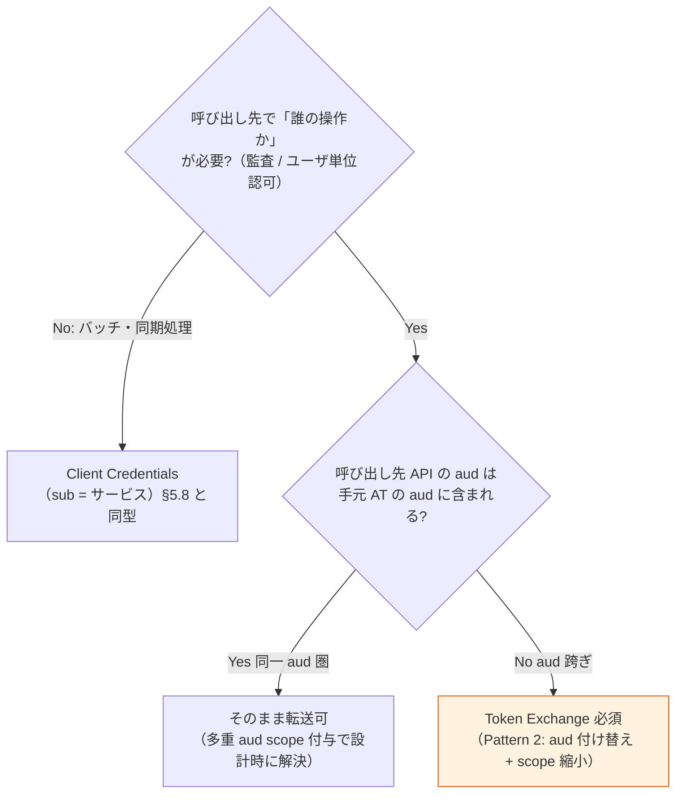

# U5: トークン・セッション・認可設計（JWT クレーム辞書 / TTL / Token Exchange / Revocation / ログアウト / RP ガイド）

作成日: 2026-07-23
ステータス: Draft v1（Wave 2）
**前提: [01-architecture-baseline.md](01-architecture-baseline.md) Baseline v1（P-01〜P-18、特に P-08/P-09/P-10/P-11/P-14）**
上位文書: [00-basic-design-plan.md](00-basic-design-plan.md) §U5

---

## 5.0 背景・なぜここで決めるか（スコープ・境界）

### 5.0.1 背景

要件定義で「Stage 1 最小クレーム（[ADR-030](../adr/030-minimal-jwt-claim-design.md)）/ TTL 推奨値（§NFR-4.2、P-09）/ ログアウト 4 レイヤー（[§FR-5](../requirements/proposal/fr/05-logout-session.md)）/ 認可はアプリ側（[§FR-6](../requirements/proposal/fr/06-authz.md)）」という**方針レベル**の判断は確定した。しかし Wave 1 の U2（[02-keycloak-logical-design.md](02-keycloak-logical-design.md)）・U3（[03-identity-provisioning-design.md](03-identity-provisioning-design.md)）から、次の**宙吊り事項**が本単元に明示的に委ねられている:

1. **`sid` クレームの確定**: ADR-030（2026-07-23 更新）と U2 §2.5.1 は `sid` を「Stage 1.5（セッション系）として既定発行 — **最終確定は U5**」と保留した。`sid` は Back-Channel Logout の前提であり、ログアウト設計（§5.5）と不可分のため本書で同時に閉じる。
2. **TTL 体系の最終値**: ADR-025 §I.5 が AT 30 分（P-09 凍結値）へ改訂済みだが、「最終確定は基本設計 U5」と明記。**RT 30 日と絶対 24h の Keycloak 実装上の関係**（§5.2.2）も未整理。
3. **Token Exchange の適用範囲**: §FR-6.3 の判定フローと [token-exchange-spec-and-patterns.md](../common/token-exchange-spec-and-patterns.md) の 7 パターンから、本基盤で実際に有効化する対象・audience 設計・Client 設定方針を確定する必要がある（U2 §2.8.3 が本書からのフィードバックを待っている）。
4. **専用 API 層の Client Credentials スコープ設計**: U3 D3-05（アプリ発 CRUD = 専用 API 層）が「認可スコープ設計は U2/U5 に引き渡す」とした未決（U3 §3.7.4 #4）。
5. **RP 実装ガイドの正式骨子**: ADR-057（CSRF 3 層分界）L2/L3 の RP 側要求を、アプリ開発者向けガイドの形に確定する。

### 5.0.2 スコープと他単元との境界

| 領域 | 本書（U5） | 他単元 |
|---|---|---|
| JWT クレーム辞書（正式版）・PII 非搭載検証 | ✅ 決定 | U2 §2.5 は Mapper 実装（本書確定値を反映） |
| TTL / セッション体系の最終値・テナント別短縮 | ✅ 決定 | Realm/Client 設定の IaC 化は U2/U9 |
| Token Exchange 適用パターン・Client 設定方針 | ✅ 決定 | Client 定義の realm 反映は U2 §2.2.3/§2.5 |
| Revocation・強制ログアウト運用 | ✅ 決定 | ITDR Risk Engine 本体・検知閾値は U7（ADR-035/060 §C） |
| ログアウト 4 レイヤー採用範囲 | ✅ 決定 | ログアウト UX（ボタン・確認画面）は U4、SN SLO 詳細は U10 |
| RP 実装ガイド骨子 | ✅ 決定 | ガイド完全版（Basis Integration Guide）は Phase 1 実装時に文書化 |
| 専用 API 層 CC スコープ | ✅ 決定 | OpenAPI 詳細は U10、API 層実装は ADR-038 Backend |
| 署名鍵（ES256）ローテーション・Cryptoperiod | 参照のみ | U7（ADR-045 3 階層鍵管理） |

### 5.0.3 本書の前提（Baseline v1 からの主参照）

P-08（3 階層識別子、`sub` = Layer A UUID）/ P-09（AT 30 分 / RT 30 日 + Rotation / 絶対 24h / アイドル 1h / ES256）/ P-10（Stage 1 最小・PII 非搭載）/ P-11（SSO L1 完全信頼デフォルト）/ P-14（新規 = OIDC / 既存 SP = SAML、API 認可は OIDC 貫通 — [saml-vs-oidc §13-16](../common/saml-vs-oidc-comparison.md)、[ADR-023 §L.9-10](../adr/023-servicenow-sp-integration.md)）。

---

## 5.1 JWT クレーム辞書（正式版）

### 5.1.1 Stage 1 + sid: 既定発行クレームの確定

**採用**: 全アプリ Client の既定発行クレーム = **Stage 1 の 7 クレーム + `sid`（Stage 1.5）** に確定する。**`sid` は既定発行を正式決定**し、ADR-030 の宙吊り（「最終確定は U5」）を本書で閉じる。

| # | クレーム | 値 / 供給元 | 契約上の意味（RP が依存してよい範囲） |
|---|---|---|---|
| 1 | `iss` | `https://<broker-host>/realms/broker`（Keycloak 標準） | 署名検証の起点。RP は完全一致検証必須 |
| 2 | `sub` | Layer A UUID（P-08。Keycloak user id、生涯不変） | ユーザ主キー。**アプリ側 DB の外部キーは必ず `sub`**（jit-scim §10.5 アプリ ID 設計標準） |
| 3 | `aud` | `aud-<api>` Client Scope の audience mapper（U2 §2.5.2） | 宛先 API。RP は自分宛か必ず検証 |
| 4 | `azp` | Keycloak 標準（= 取得側 client_id） | 接続元アプリ。トレース + 許可フロント検証（ADR-030 §G） |
| 5 | `tenant_id` | user attribute（基盤焼き込み、U2 §2.5.3） | テナント境界の認可キー。**全 RP で検証必須** |
| 6 | `exp` | 発行 + 30 分（§5.2） | 有効期限 |
| 7 | `iat` | Keycloak 標準 | 発行時刻 |
| **1.5** | **`sid`** | **Keycloak 標準（SSO セッション ID）。ID Token / Access Token / Logout Token に共通の値で発行** | **Back-Channel Logout の突合キー**（§5.5.4）。RP はローカルセッション索引 `sid → session` を保持し、Logout Token 受信時に破棄する。認可判定には**使用禁止** |

- **`sid` 確定の根拠**（Back-Channel Logout 採用可否とセットの決定、§5.5.4 参照）:
  1. L4 Back-Channel Logout を**コア層 OIDC アプリの標準**として採用する（§FR-5.1 ベースライン Should → 本書で Must 化。saml-vs-oidc §14.3: Back-Channel 成功率 90%+ vs Front-Channel/SLO 60-80%）。Logout Token の `sid` がないと RP は「どのセッションを破棄するか」を `sub` 全セッション破棄でしか表現できず、複数端末利用時に過剰破棄となる。
  2. Keycloak は `sid` を標準発行するため**追加 Mapper 実装ゼロ**。削る方が（Lightweight Access Token 化等の）追加設定を要する。
  3. `sid` はランダムなセッション識別子であり PII 非搭載原則（P-10）に抵触しない。
- **位置付け**: Stage 1 の「7 クレーム」定義（ADR-030 §D）は変えず、`sid` は **Stage 1.5（セッション系）** として辞書に併記する。RP 契約上は「Stage 1 + sid が既定」で案内する。
- **Keycloak が標準で付す技術クレームの扱い**: Keycloak は上記以外に `jti` / `typ` / `scope` / `session_state`（非推奨、`sid` と同値）等を既定で付す。これらは**契約外**（本基盤はバージョン間の存続を保証しない）とし、RP は Stage 1 + `sid` のみに依存すること。削除のための Lightweight Access Token 化は Phase 1 では行わない（設定複雑化に対しサイズ削減効果が小さい。トークンサイズ実測は §5.1.4 チェックリストで担保）。
- **代替案**: ① `sid` 非発行 + Front-Channel Logout — 3rd party cookie ブロックで信頼性が低く不採用（saml-vs-oidc §14.2.3）。② `sid` 非発行 + Logout Token を `sub` のみで送る — 過剰破棄 UX + 複数セッション識別不能で不採用。
- **未決事項**: なし（本項で確定）。**U2 への反映**: §2.5.1 の注記「最終確定は U5」を解除し確定扱いに（U2 §2.8.3 フィードバック事項）。ADR-030 のステータス注記も本書参照で更新する。

### 5.1.2 Stage 2 / Stage 3 への昇格規約（Client 単位）

**採用**: Stage 昇格は **Realm 一括ではなく Client（アプリ）単位** とし、昇格条件を次で固定する:

| Stage | 追加クレーム | 昇格条件（いずれか） | 実装 |
|---|---|---|---|
| Stage 2 | `scope` / `client_id` / `auth_time` / `jti` | ① Token Exchange 参加（§5.3。交換の scope 縮小に `scope` 必須）② 監査要件で `jti`（replay 検出 / revocation list）が必要 ③ ステップアップ MFA 利用（`auth_time` で max_age 判定） | Keycloak 標準クレーム（`scope`/`jti` は既定発行済みのため、実質は「契約への昇格」= RP が依存してよい宣言） |
| Stage 3 | `roles` | 管理系 Client のみ（U2 §2.5.4 ハイブリッド C 確定済み）。**業務アプリへの roles 発行は不可**（認可はアプリ側、§FR-6.0.A） | `oidc-usermodel-realm-role-mapper`（管理系 Client 限定） |
| `acr` / `amr` | 認証コンテキスト | ステップアップ MFA を利用する Client のみ、**Optional Client Scope `acr-step-up`** で発行 | 常時発行はしない（U2 §2.5.1 未決への回答。サイズと契約安定性優先） |

- **根拠**: ADR-030 §D の段階設計。Realm 一括昇格は「全アプリの検証ロジック更新」（ADR-030 Negative）を強制するため Client 単位とする。
- **未決事項**: `acr` の値体系（AAL2/AAL3 相当の値定義と max_age）は U2 未決 #9 と合同で確定（§5.9）。

### 5.1.3 顧客拡張クレームの規約（`ext_` プレフィックス）

**採用**: 顧客固有クレーム（部署 ID / コストセンター等、§FR-6.1 オプション C）を発行する場合は次を必須規約とする:

1. **命名**: `ext_<tenant>_<name>` または汎用 `ext_<name>`（例: `ext_cost_center`）。標準クレーム名・`tenant_id` 等の基盤予約名と衝突禁止。
2. **発行単位**: 該当テナント専用の **Optional Client Scope**（`ext-<tenant>` 等）に集約し、必要な Client のみに付与。Default Scope への追加禁止（他テナント・他アプリへの漏出防止）。
3. **PII 審査必須**: 追加前に §5.1.4 チェックリストを通過すること。氏名・メール・電話・住所等の直接 PII は**拒否**（userinfo / アプリ DB 参照へ誘導）。
4. **供給元**: User Profile 宣言済み属性のみ（U2 §2.6 `unmanagedAttributePolicy=DISABLED` により未宣言属性はそもそも保存不可）。属性受入枠の宣言規約は U3/U2 未決 #6（`ext_` プレフィックス案）と同一 SSOT で管理。
5. **サイズバジェット**: 拡張込みで **Access Token ≤ 1KB（base64 後）** を上限とする。groups 等の可変長配列は原則拒否（ADR-030 §A サイズ最小）。

- **根拠**: ADR-030「JWT はポインタ、データストアではない」、§FR-6.1 業界現在地（最小限主義）。
- **代替案**: 顧客拡張を全面禁止 — B2B 要件（ABAC パターン C 顧客）に対応できず不採用。規約付き許可とする。

### 5.1.4 PII 非搭載原則の検証チェックリスト（クレーム追加・変更時に必須）

**採用**: 次のチェックリストを、①新規 Mapper/Scope 追加時のレビュー、② CI（realm 設定 lint）、③四半期監査、の 3 箇所で運用する:

| # | チェック項目 | 検証方法 |
|---|---|---|
| C-1 | AT / ID Token に `email` / `name` / `given_name` / `family_name` / `preferred_username` / 電話・住所系クレームが**含まれない** | 実トークンのデコード検査（CI: テストユーザで token 取得 → クレーム集合を許可リストと突合） |
| C-2 | アプリ Client の Default Scope に `profile` / `email` scope が**付いていない**（U2 §2.5.1） | realm 設定 lint（IaC で機械検査） |
| C-3 | ライフサイクル属性（`provisioned_by` / `scim_active` / `last_login` / `deprovisioned_at` 等）が JWT に**載っていない**（U2 §2.5.1 確定済み原則の維持） | 同上 |
| C-4 | 新規クレームが直接識別子 / 準識別子（生年月日・社員番号生値等）に該当しないか。Layer B 生 ID（`external_id`）は JWT 非搭載（U3 §3.1、idmap は API 層参照） | 追加時レビュー（判定基準: 単体または組合せで個人特定可能か） |
| C-5 | トークンサイズ ≤ 1KB（拡張込み） | CI で実測 |
| C-6 | ログ・APM に AT/ID Token ペイロードが平文出力されない | ADR-060 §A Log scrubbing 辞書と突合（U7 主管） |
| C-7 | userinfo エンドポイントの応答クレームが「PII 提供の唯一の窓口」として scope 最小化されている | userinfo 応答の定期検査 |

- **根拠**: P-10、ADR-030 §E（email/name は削るのが推奨）、ADR-060 §A（ログへのトークン漏洩が攻撃経路）。

---

## 5.2 TTL 体系（最終値）

### 5.2.1 確定値と Keycloak 設定へのマッピング

**採用**: P-09 凍結値を次の Keycloak Realm 設定に確定マッピングする（Realm `broker` 既定値）:

| 論理項目 | 最終値 | Keycloak 設定 | 根拠 |
|---|---|---|---|
| Access Token TTL | **30 分** | `Access Token Lifespan = 30m` | P-09、ADR-025 §I.5（2026-07-23 改訂で 5 分 → 30 分に統一済み） |
| ID Token TTL | **30 分**（AT と同一） | 同上（Keycloak は AT Lifespan を共用） | §FR-5.2 の推奨 15 分は設定粒度の都合で 30 分に統一。ID Token はアクセス制御に使わない（認可は AT のみ）ため許容 |
| アイドルタイムアウト | **1 時間** | `SSO Session Idle = 1h` | P-09、NIST AAL2（§FR-5.2） |
| 絶対タイムアウト | **24 時間** | `SSO Session Max = 24h` | 同上 |
| Refresh Token Rotation | **有効** | `Revoke Refresh Token = ON` | §FR-5.2 ベースライン |
| Reuse Detection | **有効**（再利用検知でセッション失効 = トークンファミリー全停止） | `Refresh Token Max Reuse = 0` | 同上 |
| Client Session Idle/Max | 未設定（SSO セッションに従属） | `0`（既定） | TTL 体系を SSO セッション 1 系統に単純化 |
| オフラインセッション | **Phase 1 無効** | `offline_access` scope を全アプリ Client から除外 | §5.2.2 |
| 署名アルゴリズム | **ES256** | Realm 既定署名 ES256 | P-09、ADR-045（鍵ローテーション・Cryptoperiod は U7） |
| 許容 clock skew（RP 検証側） | ≤ 60 秒 | RP 実装ガイド（§5.6.4） | 業界慣行 |

### 5.2.2 「RT 30 日」の解釈確定（P-09 内の緊張の解消）

**採用**: P-09 の「RT 30 日」は**設定可能上限（Refresh Token TTL のレンジ、§FR-5.2 ベースライン 1〜90 日）を指す**ものと解釈を確定し、Phase 1 の実効値は次の通りとする:

- Keycloak では通常の Refresh Token の寿命は **SSO Session Idle / Max に従属**する（RT 単独で 30 日は成立しない）。したがって **Phase 1 の RT 実効寿命 = アイドル 1h ごとの Rotation 前提で最大 24h（絶対）**。これは NIST AAL2（24h / 1h）と完全整合し、「絶対 24h」と「RT 30 日」の見かけ上の矛盾はここで解消する。
- 30 日級の長期ログイン維持（モバイル常時ログイン等）は Keycloak では **Offline Token（`offline_access` scope）** でのみ実現できるが、**Phase 1 は無効**とする。絶対 24h の防御線を骨抜きにするため、必要になった場合は**アプリ単位の個別審査**（対象 Client への Optional Scope 付与 + Offline Session Max 30 日 + Rotation 必須）で Phase 2 以降に解禁する。
- **根拠**: §FR-5.2（AAL2 絶対 24h が正）、ADR-050（モバイルは System Browser + PKCE。長期セッション要件は SDK 設計時に再評価）。
- **U1 への申し送り**: Baseline P-09 の表記を「RT 30 日（設定上限。Phase 1 実効は SSO セッション従属 = 最大 24h、offline_access 無効）」へ精密化することを推奨（本書が根拠）。

### 5.2.3 テナント別 TTL 短縮オプション（5-15 分）の設定方式

**採用**: 規制業種テナント向けの AT 短縮（5-15 分、ADR-025 §I.5）は **Keycloak 標準の Client 単位 Access Token Lifespan override（Advanced Settings）** で実現する。

- **前提条件**: Client 単位 override はテナント単位の設定ではないため、**短縮対象テナントは専用 Client を発行する**（共有マルチテナント Client のままではテナント別 TTL は不成立）。ADR-017 の例外条件（規制要件顧客）と同じ入口で判定する。
- 短縮とセットで SSO Session Idle の短縮（15-30 分、[session-management-deep-dive §7](../reference/session-management-deep-dive.md): 金融・医療 5-15 分 / 1-2h）も同一テナント判定で適用可能とする（こちらはテナント専用 Client の Client Session Idle override）。
- **代替案**: ① Realm 属性 + カスタム TokenProvider SPI でテナント別 TTL — Custom SPI の追加（G-SPI-Compat 対象増）に見合わず不採用。② Client Scope による TTL 制御 — Keycloak に該当機能がなく不成立。③ 規制テナント専用 Realm — ADR-017 の例外条件を満たす場合のみ（その場合 Realm 既定値で設定）。
- **未決事項**: 短縮対象テナントの有無・値は顧客ヒアリング（PCI DSS / 金融系）待ち。§5.9 に登録。

### 5.2.4 ゾンビウィンドウの侵害シナリオ表（ADR-025 §I.5 整合）

AT は Stateless JWT のため、失効操作後も **最大 30 分（テナント短縮時 5-15 分）** のゾンビウィンドウが残る。シナリオ別の実効遮断時間と緩和策を次で確定し、顧客契約説明（ADR-025 §I.5 の PCI DSS 8.2.5 説明と同一線）に用いる:

| # | 侵害シナリオ | 遮断トリガー | RT の遮断 | AT ゾンビ窓（実効） | 緩和策（多層） |
|---|---|---|---|---|---|
| Z-1 | 退職者を顧客 IdP が削除（SCIM 受信 → Soft Delete） | `enabled=false` 即時（U3 §3.5） | 次回 Refresh 時に拒否（≤30 分） | **≤30 分** | Soft Delete 即時 + RT Rotation + 必要時 Z-3 併用 |
| Z-2 | RT 盗難（Rotation 済みトークンの再利用） | Reuse Detection が正規/攻撃者いずれかの次回利用時に発火 | **セッション失効 = ファミリー全停止（即時）** | 攻撃者が直前に得た AT の残寿命 ≤30 分 | Rotation + Reuse Detection（§5.2.1）|
| Z-3 | 管理者による強制ログアウト（個別ユーザ） | 全セッション削除（§5.4.2） | 即時（セッション消失で Refresh 不能） | **≤30 分** | 重大時は Z-4 へ昇格 |
| Z-4 | ITDR L4 / 大規模侵害（Realm/Client 単位） | not-before push + 全セッション削除（§5.4.3） | 即時 | ローカル検証 RP では ≤30 分（not-before は RP ローカル検証に伝播しない） | Phase 3: API GW での Token Introspection によるリアルタイム化（ADR-025 §I.5 ④） |
| Z-5 | AT 単体の盗難（XSS / ログ漏洩 / MITM） | なし（Bearer の宿命、ADR-060 §B.1） | — | **≤30 分（構造的残余リスク）** | Phase 1 = 短寿命化のみ。**Phase 2 DPoP で完全防御**（ADR-060 §B.4、§5.9） |

- **契約明示事項**（ADR-060 §B.6 と同一方針): 「本基盤は Phase 1 で AT 30 分 + RT Rotation により影響を最小化する。即時遮断（数分以内）を要する規制テナントには TTL 短縮オプション（§5.2.3）を提供し、Phase 2 で DPoP、Phase 3 で Introspection によるリアルタイム失効を計画する」。

---

## 5.3 Token Exchange（RFC 8693、Keycloak Standard Token Exchange V2 — PoC 検証済）

### 5.3.1 適用パターンの確定

**採用**: 本基盤が Phase 1 で有効化する Token Exchange は次の 2 パターンに**限定**する（[token-exchange-spec-and-patterns.md §3/§8](../common/token-exchange-spec-and-patterns.md) の 7 パターン中）:

| 採用 | パターン | 用途 | 発行条件 |
|---|---|---|---|
| ✅ Phase 1 | **Pattern 2: Audience 縮小（Downstream Token）** | マイクロサービス間呼び出しでユーザ文脈（`sub`/`tenant_id`）を保持したまま `aud` を呼び出し先 API に付け替え、scope を縮小 | §FR-6.3 判定フロー Yes 経路（下図） |
| ✅ Phase 1 | **Pattern 3: Scope 縮小** | 同一 aud 内での最小権限化（読み取り専用処理等） | 同上 |
| ⬜ Phase 2 | Pattern 5: Delegation（`act` 連鎖） | 業務代行（サポートが顧客代理） | B-304 回答 + `act` クレームの V2 対応実測後 |
| ⬜ Phase 2+ | Pattern 6/7: クロスドメイン / エッジ橋渡し | §C-6 エッジ層アプリとの橋渡し | エッジ層アプリの発生時 |
| ❌ 不採用 | Pattern 4: Impersonation | 監査追跡性を損なう | テスト環境限定・本番禁止（spec §7.2 B） |

**サービス間呼び出しの方式判定フロー**（§FR-6.3.4 を基盤標準として確定）:



- **禁止事項**: `aud` 跨ぎの**素通し転送は禁止**（受信 API 側の `aud` 検証緩和を誘発し token confused deputy を復活させる。§FR-6.0.B）。同一信頼境界内で複数 API を叩くフロントは、TE ではなく設計時に `aud-*` scope の複数 Default 付与（多重 aud、U2 §2.5.2）で解決するのが第一選択。
- **根拠**: §FR-6.3.5 ベースライン、P-14（API 認可は OIDC 貫通 — SN 等 SAML SP 由来の後続 API 呼び出しも本基盤発行の JWT で行う。ADR-023 §L.10）。

### 5.3.2 audience 設計

**採用**: Token Exchange の `audience` パラメータ値 = **U2 §2.5.2 の `aud-<api>` scope が埋める API 識別子と同一の名前空間**とする（TE 用に別の識別子体系を作らない）。

- `aud` 値の命名規約（U2 §2.5.2 未決への回答）: **短名（Client ID と同一の `<api名>`、例 `expense-api`）** を採用する。URI 形式は SN 等の外部 SP がないコア層 API には冗長で、Keycloak の audience mapper・TE の audience パラメータ・RP 検証コードの 3 箇所で同一文字列を使える短名を優先。エッジ層・外部公開 API で衝突リスクが出た場合のみ URI 形式へ拡張（Phase 2 再評価）。
- 交換後トークンのクレームは **Stage 1 + `sid` を維持**（`sub` = 元ユーザ、`azp` = 交換実行サービスの client_id となり、呼び出し元の追跡は `azp` で成立）。

### 5.3.3 Broker KC 側 Client 設定方針

**採用**:

| 項目 | 方針 |
|---|---|
| 方式 | **Keycloak Standard Token Exchange（V2）**。Legacy(V1) は使用禁止 |
| 交換実行 Client | **Confidential 必須**（Public Client の TE 禁止、spec §8.5）。Service 系は client_secret → Phase 2 private_key_jwt（U2 §2.2.3 の昇格と同時） |
| 有効化単位 | 交換を行う **Client ごとに個別有効化**（Realm 一括禁止）。「どの Client がどの audience へ交換可能か」を Client 設定 + `aud-*` scope 付与のホワイトリストとして表現（spec §7.2 A 対策） |
| scope | **縮小のみ許可**（要求 scope ⊆ 元 AT scope）。拡張要求は Keycloak 側で拒否されることを結合テストで固定 |
| 交換後 AT の TTL | **15 分**（通常 AT より短命、spec §7.1 #6 / §8.5）。該当 Client の AT Lifespan override で実装。Refresh Token は**発行しない** |
| 監査 | `TOKEN_EXCHANGE` イベントを監査ログ必須収集（subject / requester client / audience / scope）。SIEM 連携は U7/U9 |
| 失効伝播 | 元セッション失効（§5.4）時、交換後 AT はセッション紐付けにより Refresh 不能 + 短 TTL（15 分）で吸収 |

- **根拠**: PoC で Keycloak の TE 動作は検証済み（§FR-6.3、K-01 判定で Keycloak 必須化の根拠となった機能）。V2 は 26.x で標準化されており Legacy 固有設定（fine-grained admin permission ベースの交換ポリシー）への依存を避ける。
- **未決事項**: ① `act` クレーム付与（Delegation）の V2 実測 → Phase 2 ゲート（§5.9）。② IdP-KC 側での TE は**提供しない**（TE は Broker の責務。IdP-KC はアプリ向けトークンを発行しない、ADR-033）。
- **U2 への反映**: 交換対象 Client の定義・`aud-*` scope 付与ルールを §2.2.3/§2.5 に追加（U2 §2.8.3 フィードバック事項）。

---

## 5.4 Revocation・強制ログアウト

### 5.4.1 RT Revocation（アプリ・ユーザ起点）

**採用**: RFC 7009 準拠の Revocation エンドポイント（`/realms/broker/protocol/openid-connect/revoke`）を全 RP に開放する。

- RP はログアウト時（L1/L2、§5.5）に**保持中の RT を revoke してから破棄する**ことを RP 実装ガイドの必須項目とする（トークン残骸を残さない、§FR-5.0.A）。
- AT の revoke は同エンドポイントで受理されるが、ローカル検証 RP には伝播しない（ゾンビ窓 §5.2.4 のとおり）。RP には「AT revoke に依存せず短 TTL を前提に設計せよ」と案内する。

### 5.4.2 管理者強制ログアウト

**採用**: 粒度は 3 段階を Phase 1 提供とする（§FR-5.3 C の推奨に対応）:

| 粒度 | 実装 | 入口 |
|---|---|---|
| 個別ユーザ | Admin API `POST /admin/realms/broker/users/{id}/logout`（全セッション削除 → RT 即死 + L4 Back-Channel Logout が対象 RP へ発火） | 管理画面 Backend（ADR-038）経由のみ。テナント管理者は自テナントユーザに限定（3 層スコープ） |
| テナント単位 | 対象 Org メンバーへの一括 logout（Backend がユーザ列挙 + 逐次実行、冪等・再開可能なジョブとして実装） | 基盤運用者 + テナント offboarding 手順（jit-scim §10.4.L（U3 D3-09 経由）サービス離脱と連動） |
| 全体（緊急） | §5.4.3 の ITDR L4 手順 | 基盤 on-call のみ（権限は U7/U9 で規定） |

- セッション削除は Keycloak の Back-Channel Logout 送信を伴うため、**強制ログアウト = L4 伝播込み**で動作する（採用理由の一つ。§5.5.4）。
- 全操作を監査ログ必須（操作者 / 対象 / 理由コード / 粒度）。パスワード変更時の全セッション無効化は**自動切断（推奨動作）**をデフォルトとする（§FR-5.3 C）。

### 5.4.3 ITDR L4 連動（全 Token Revoke）

**採用**: ADR-060 §C.4 の対応レベル 4（重大侵害）発火時の標準手順を次で確定する:

1. **not-before push**（Realm または対象 Client 単位）: 発火時刻以前発行の全トークンを Keycloak 側で無効化（Introspection / Refresh / userinfo は即時拒否）。
2. **対象範囲の全セッション削除**: RT 即死 + L4 Back-Channel Logout 一斉送信。
3. **限界の明示**: ローカル署名検証のみの RP には not-before が伝播しないため、**AT 残寿命 ≤30 分のゾンビ窓が残る**（§5.2.4 Z-4）。Phase 3 の API GW Introspection 導入までは、L4 発火 Runbook に「30 分間の追加監視（対象 `sub`/`azp` の API アクセスを WAF/ログで監視・遮断）」を含める（Runbook 化は U9、検知側は U7）。
4. 発火判定・自動化の閾値（自動 revoke vs 手動承認）は ADR-035/060 §C の Risk Engine 設計（U7）に従う。本書は**実行 API 面の確定のみ**: not-before push = Admin API `push-revocation`、セッション削除 = §5.4.2 と同一 API。

---

## 5.5 ログアウト設計（4 レイヤーの採用範囲と実装）

### 5.5.1 採用範囲の確定

**採用**（§FR-5.1 ベースラインを基本設計として確定）:

| レイヤー | 採用 | 実装 | 責務 |
|---|---|---|---|
| **L1 ローカル** | **Must** | アプリ Cookie / トークンストア破棄 + **保持 RT の revoke（§5.4.1）** | アプリ（ガイド提供） |
| **L2 RP-Initiated Logout** | **Must** | OIDC RP-Initiated Logout。`id_token_hint` 必須 + `post_logout_redirect_uri` は Client に完全一致登録（ワイルドカード禁止）。Logout CSRF 対策として確認画面なし遷移には `id_token_hint` 必須（ADR-057 A.2 B） | 基盤 + アプリ |
| **L3 フェデ連動（顧客 IdP セッション破棄）** | **既定 OFF・テナントオプション** | Broker の IdP 単位設定で顧客 IdP への logout 連鎖を有効化可能 | 基盤（テナント設定） |
| **L4 Back-Channel Logout** | **Must（コア層 OIDC アプリ標準）** | §5.5.4 | 基盤（送信）+ アプリ（受信実装） |
| L4 Front-Channel Logout | **不採用** | — | 3rd party cookie ブロックで信頼性低（saml-vs-oidc §14.2.3） |

- **L3 を既定 OFF とする根拠**: 顧客 IdP（Entra/Okta）のセッションは顧客社内の**他システム SSO も担っており**、本基盤起点の破棄は顧客側 UX・運用への越境となる。責任分界（L1-L3 モデル、jit-scim §10.4.H）上も顧客 IdP セッションは顧客責任。シェア端末・厳格コンプラ等でテナントが明示要求した場合のみ有効化する（hearing B-APP-OIDC-3 / §FR-5.1 TBD A）。
- 既定のログアウト到達範囲 = **L1 + L2 + L4**（本基盤 SSO 圏の全 RP を同期切断、顧客 IdP セッションは維持）。

### 5.5.2 SAML SP（ServiceNow）側の扱い

**採用**: ServiceNow（L2 SAML JIT、P-13 / ADR-023 §L）への SAML SLO は **Phase 1 では実装しない（オプション扱い）**。

- **根拠**: SAML SLO は成功率 60-80%・SOAP 実装複雑（saml-vs-oidc §14.3）で、1 SP の無応答がチェーンを壊す（§FR-5.1）。SN セッションは SN 側アイドルタイムアウト + 次回アクセス時の SAML 認証（基盤セッション破棄済みなら再認証要求）で収束し、L1 SCIM `enabled=false` → SAML 認証拒否の遮断経路（ADR-023 §L の L2 代替根拠）が既にある。
- hearing **B-APP-OIDC-3**（SP = SLO オプション、顧客要件次第）と整合。テナントが SLO を要求した場合は SP-initiated SLO のみ検討し、詳細設計は U10（SN 連携）へ。

### 5.5.3 SPA 直構成の限界の明示

Back-Channel Logout はサーバ間 POST のため、**バックエンドを持たない SPA 直構成は L4 通知を受信できない**。該当アプリは:
- AT 30 分の自然失効 + 次回 Refresh 失敗（セッション消失）で最大 30 分遅れの切断となることを許容するか、
- BFF 構成（§5.6.2）へ移行して L4 受信を実装するか、
のいずれかを選択する。OIDC Session Management（iframe polling）は 3rd party cookie 制約により**推奨しない**。シェア端末を扱うアプリは BFF + L4 を必須とする（§FR-5.1 TBD B）。

### 5.5.4 Back-Channel Logout の実装確定（sid とセット）

**採用**:

| 項目 | 内容 |
|---|---|
| Keycloak 側 | 各アプリ Client に `backchannel_logout_url` を登録、**`Backchannel Logout Session Required = ON`**（Logout Token に `sid` を含める）。`Revoke Offline Tokens` は offline 無効（§5.2.2）のため N/A |
| 発火点 | L2 RP-Initiated Logout / 管理者強制ログアウト（§5.4.2）/ ITDR L4（§5.4.3）のすべてで Keycloak が対象セッションの全 RP へ並行送信 |
| RP 受信実装（ガイド必須項目） | ① `POST /backchannel-logout`（form-encoded `logout_token`）② Logout Token 検証: 署名（JWKS）/ `iss` / `aud` / `iat` / `events` に `http://schemas.openid.net/event/backchannel-logout` / **`nonce` が無いこと** ③ `sid` でローカルセッション索引を破棄（`sid` 不在時は `sub` 全セッション破棄にフォールバック）④ 2xx 応答。冪等実装（同一 `sid` 再受信を許容） |
| 送信失敗時 | Keycloak はベストエフォート（再送保証なし）。**最終防衛線は TTL（AT ≤30 分 + アイドル 1h）**であり、L4 は「即時性の改善」と位置付ける（session-management-deep-dive §5 多層防御と同一整理） |
| 対象範囲 | コア層 OIDC アプリ（BFF/SSR/API 付き SPA）= **必須**。SPA 直 = 適用外（§5.5.3）。M2M Client = 対象外（ユーザセッションなし） |

- **根拠**: §FR-5.1（L4 は Keycloak ネイティブ、PoC Phase 7 実証済み）、saml-vs-oidc §14（Back-Channel が現代標準・成功率 90%+）、基本方針「絶対安全」（認証残骸の排除）。
- **本項が §5.1.1 の `sid` 確定と一体である理由**: L4 採用（Must）→ Logout Token の `sid` 突合が RP 実装の標準形 → `sid` 既定発行が必須、という依存で決定した。

---

## 5.6 アプリ向け RP 実装ガイド骨子（Basis Integration Guide の目次確定）

**採用**: RP 実装ガイド（Phase 1 で顧客・アプリチーム向けに文書化）の必須章立てと各章の規範内容を次で確定する。ADR-057 の L2（基盤がガイドで強制）/ L3（パターン提示）の分界に従う。

### 5.6.1 認可リクエスト（全アプリ必須 — ADR-057 L2）

- `response_type=code` のみ（Implicit / Hybrid 禁止）。
- **`state`（128bit 以上乱数）+ `nonce` + PKCE S256 を必須**。Public Client（SPA/モバイル）は PKCE 必須、Confidential でも PKCE 推奨。
- `state`/`nonce`/`code_verifier` の保存: HttpOnly Cookie or sessionStorage（BFF はサーバセッション）、TTL 10 分、1 回検証で即破棄（ADR-057 D.2.3）。
- Callback で `state` 不一致は 400 拒否。`iss` レスポンスパラメータ検証（mix-up 対策）を推奨項目に含める。

### 5.6.2 BFF vs SPA 直の使い分け

| 判定軸 | BFF（推奨デフォルト） | SPA 直（許容条件付き） |
|---|---|---|
| トークン保管 | サーバ側。ブラウザには HttpOnly + Secure + SameSite=Lax セッション Cookie のみ | AT/RT を **Memory 保管**（localStorage/Cookie 禁止 — ADR-057 C-1。ADR-057 C-1 を Memory のみに厳格化する意図的判断） |
| L4 Back-Channel Logout | ✅ 受信可（§5.5.4 必須実装） | ❌ 不可（§5.5.3 の制約を許容できる場合のみ） |
| CSRF | Cookie セッションのため **Double Submit Cookie 必須**（ADR-057 D.3.2.a） | Bearer 免疫（C-1〜C-3 充足時、CSRF トークン不要） |
| XSS 耐性 | トークン非露出で高い | CSP + escape + DOMPurify 必須（トークン窃取 = Z-5 直結） |
| 適用目安 | 機微データ / シェア端末 / 長時間業務 / Back-Channel 必須アプリ | 社内向け・読み取り中心・短セッションの軽量 SPA |

- **既定推奨は BFF**。SPA 直は上記制約の明示同意（アプリオーナー）を条件に許容する。

### 5.6.3 Bearer 検証（Resource Server 必須 6 点）

```text
1. 署名: ES256、JWKS (/realms/broker/protocol/openid-connect/certs) をキャッシュ（kid ローテーション追従）
2. iss: 完全一致
3. exp / iat: clock skew ≤60 秒
4. aud: 自 API 識別子（§5.3.2 短名）を含むこと。不一致は 401
5. azp: 許可フロント Client のホワイトリスト検証（ADR-030 §G）
6. tenant_id: リクエストが触れる全リソースのテナントスコープと一致強制（IDOR 防御。パス/ボディ中の tenant 指定より JWT 値を常に優先）
```

- 認可判定（リソース単位の can/cannot）はアプリ責務（§FR-6.0.A、パターン A〜D はアプリ選択）。
- AT ペイロードをアプリログへ出力しない（§5.1.4 C-6）。

### 5.6.4 CORS / SameSite

- API の `Access-Control-Allow-Origin` は**具体的 RP origin の許可リスト**（`*` 禁止）。Bearer 方式では `Access-Control-Allow-Credentials: false`（ADR-057 C-3）。
- BFF セッション Cookie は `HttpOnly; Secure; SameSite=Lax` を既定（Strict はフェデリダイレクト帰還で切れるため Lax。ADR-057 D.3.3: Lax で 9 割遮断 + CSRF トークン併用で完全防御）。
- GET で状態変更する API の実装禁止（SameSite=Lax の防御前提を壊さない)。

### 5.6.5 ログアウト・トークンライフサイクル（§5.4/§5.5 の RP 側義務の再掲）

- ログアウト時: RT revoke → ローカル破棄 → L2 RP-Initiated（`id_token_hint` 付き）。
- L4 受信エンドポイント実装（BFF/SSR 必須、§5.5.4）。
- Refresh 失敗（invalid_grant）= セッション終了として再ログイン誘導（Reuse Detection 発火時も同じ経路に収束）。

### 5.6.6 認可失敗（403）→ Sorry 誘導（全アプリ必須）

- アプリは認可失敗（403）を検知したら `https://launchpad.<domain>/sorry?app=<カタログID>&reason=<code>` へ redirect する（U4 §4.5.1 の主経路。SPA/BFF で数行）。
- **reason コードは固定辞書のみ**（`not_entitled` / `tenant_not_allowed` / `stepup_required` 等。SSOT = U4 §4.5.2 の固定文言辞書）。**自由文パラメータの付与は禁止**（インジェクション / 情報漏えい対策）。
- エッジ 403→302 集約（REQ-IN-07b）が他組織に受諾された後も、**本規約（RP 側 redirect）は廃止しない**（二重化、U4 §4.5.1）。

---

## 5.7 （欠番 — 旧構成との対応維持のため予約。RP ガイド完全版は Phase 1 実装時に §5.6 骨子から起こす）

---

## 5.8 専用 API 層（U3 D3-05）の Client Credentials スコープ設計

> U3 §3.7.4 #4「専用 API 層クライアントの CC スコープ設計（U5 連携）」への回答。API 層の実体 = ADR-038 管理画面 Backend と同一のユーザ管理 API（IdP-KC Acct 配置、U3 D3-05 案 C 確定済み）。

### 5.8.1 スコープ命名規約と Phase 1 スコープセット

**採用**: 命名規約 = **`idm:<resource>:<action>`**（identity management。小文字・コロン区切り・複数形リソース）。Phase 1 セット:

| スコープ | 対応操作 | 想定利用者 |
|---|---|---|
| `idm:users:read` | ユーザ参照・検索（自テナント圏） | 同居アプリ / 管理画面 |
| `idm:users:write` | 作成・属性更新（`provisioned_by=app` 経路、U3 D3-04 経路 ⑤） | 同居アプリ |
| `idm:users:deactivate` | Soft Delete（`enabled=false` + `deprovisioned_at` セット） | 同居アプリ / 管理画面 |
| `idm:users:reactivate` | アプリ経由 reactivate（SPI ① は `provisioned_by=app` を拒否するため**この API が唯一の再有効化経路**、U2 §2.4.1） | 同居アプリ（審査制） |
| `idm:idmap:read` / `idm:idmap:write` | 多システム ID マッピング参照 / 更新（U3 §3.1 idmap） | 同居アプリ / 移行バッチ |
| `idm:sessions:revoke` | 強制ログアウト（§5.4.2 の API 面） | 管理画面 / 運用ツール |
| `idm:orgs:read` | Org / テナントメタ参照 | 管理画面 |

- **権限粒度の決定**: 粒度は**「リソース × 操作」の 2 軸**とし、これより細かい行レベル（テナント・ユーザ単位）の制約はスコープで表現**しない**（スコープ爆発の防止）。行レベルは §5.8.2 のテナント制約クレームで表現する。
- 物理削除スコープ（`idm:users:delete`）は **Phase 1 では定義しない**（Phase 1 物理削除禁止、jit-scim §10.5 4 層ガードレールの API 層での物理的強制）。Phase 2 物理削除バッチ（§10.4.K.6）はバッチ専用 Client + 専用スコープを Phase 2 で新設する。

### 5.8.2 Client 発行・テナント制約・トークン設定

**採用**:

| 項目 | 方針 |
|---|---|
| Client 発行単位 | 利用アプリ（システム）ごとに 1 Confidential Client（Service Account 有効・Standard Flow 無効）。共有 Client 禁止 |
| スコープ付与 | 上表スコープを **Optional Client Scope** として定義し、アプリごとに必要最小セットのみ付与（Default 一括付与禁止） |
| **テナント制約** | Client 属性 `allowed_tenants`（カンマ区切り Org alias）→ Hardcoded Claim Mapper で AT に `allowed_tenants` クレームとして焼き込み。**API 層は全リクエストで対象リソースの tenant ∈ `allowed_tenants` を強制**（スコープはリソース×操作、テナント境界はクレーム、の 2 層認可） |
| audience | `aud = idm-api`（`aud-idm-api` scope、§5.3.2 と同一規約） |
| AT TTL | **15 分**（M2M は対話セッション不要のため短縮。Client 単位 override） |
| 監査 | API 層で `azp`（= 発行元アプリ）+ 操作 + 対象を全件記録。`provisioned_app=<client_id>` の書込（U3 D3-04）と突合可能にする |
| レート制限 | Client 単位（API 層実装、閾値は U10/U9） |

- **根拠**: U3 D3-05（案 C 確定・ガードレール Layer 1）、ADR-038 3 層スコープ、最小権限原則。
- **未決事項**: OpenAPI 定義・エラー体系・ページング等の API 仕様詳細は U10。`idm:users:reactivate` の審査基準（どのアプリに許すか）は B-JIT-RA-1 回答と連動（U3）。
- **ユーザ文脈照会（`/api/me/*`）**: フロント（launchpad 等）は自ユーザの AT（`aud-idm-api` scope Default 付与）で呼出。API 層は `sub` + `tenant_id` で自己情報のみ応答する（`idm:*` スコープ不要 — CC 経路と認可モデル分離）。

---

## 5.9 未決事項と他単元への引き渡し

### 5.9.1 未決事項（本書スコープ内・判断待ち）

| # | 未決事項 | 決定トリガー / 予定 |
|---|---|---|
| 1 | **DPoP 導入判断（Phase 2）**: 対象（SPA+BFF 先行 or 全 RP）、SDK 提供範囲 | ADR-060 §B.4 のトリガー ①〜③（ADR-057 §I 検討 / AT 漏洩事案 / 金融顧客要件）。Keycloak 26.1+ で正式サポート済みのため技術ブロックなし |
| 2 | `acr` 値体系 = ACR-to-LoA "1"/"2"/"3"（U2 §2.3.4）、**max_age は AAL2=900s / AAL3=300s で確定**（U4 D-U4-05 初期値を採用、ADR-026 §H）。残未決は『AAL2/AAL3 を要求する操作一覧（アプリ側契約）』のみ | RP 実装ガイド確定時（アプリ側契約） |
| 3 | テナント別 TTL 短縮（5-15 分）の対象テナント・値 | 規制業種顧客ヒアリング（PCI DSS / 金融）。設定方式は §5.2.3 で確定済み |
| 4 | `offline_access` 解禁の個別審査基準（モバイル長期セッション） | ADR-050 Mobile SDK 設計時（Phase 2） |
| 5 | Token Exchange Pattern 5（Delegation / `act` 連鎖）の V2 実測と解禁 | B-304 回答 + Phase 2 PoC |
| 6 | SN への SAML SLO 採否（テナント要求時のみ） | hearing B-APP-OIDC-3 → 詳細は U10 |
| 7 | API GW Token Introspection によるリアルタイム失効（Phase 3） | ADR-025 §I.5 ④。ゾンビ窓 Z-4 の恒久解 |
| 8 | mTLS Bound Access Token（FAPI 2.0 / 金融顧客） | ADR-060 §B.4 Phase 3 |
| 9 | CAEP / Shared Signals（§FR-5.4） | Keycloak 対応待ち。ロードマップ管理のみ |

### 5.9.2 他単元への引き渡し

**U2 へ（§2.8.3「U5 からのフィードバック待ち」への回答）**:
- `sid` 確定（§5.1.1）→ §2.5.1 の保留注記解除。全アプリ Client に `backchannel_logout_url` + `Backchannel Logout Session Required=ON` を Client テンプレートへ追加（§5.5.4）。
- `acr` は常時発行しない・Optional Scope `acr-step-up` 方式（§5.1.2）→ §2.5.1 未決の解。
- `aud` 命名 = 短名（§5.3.2）→ §2.5.2 未決の解。
- Token Exchange 対象 Client の設定方針（§5.3.3）→ §2.2.3/§2.5 に反映。
- TTL の Realm/Client 設定値（§5.2.1/§5.2.3/§5.8.2）→ realm.json / IaC テンプレートへ。
- **`launchpad-spa` Client（Public + PKCE、Standard Flow のみ、Default Scope: `openid` + `aud-idm-api`）を Client テンプレートへ追加**（U4 §4.4.1 の登録依頼受領。§5.8 のユーザ文脈照会経路とセット）。

**U3 へ**: `idm:*` スコープと `provisioned_by=app` 経路・reactivate API の対応関係（§5.8.1）。Soft Delete → RT 遮断のタイミング整合（Z-1）。

**U4 へ**: ログアウト UX（既定到達範囲 = L1+L2+L4、L3 はテナントオプションである旨の画面文言）、再ログイン誘導（Refresh 失敗時）。

**U7 へ**: ITDR L4 実行手順の API 面（§5.4.3）と Runbook 前提（30 分監視窓）。ES256 鍵ローテーションと JWKS キャッシュ整合（ADR-045）。監査イベント（TOKEN_EXCHANGE / revoke 系 / USER_REACTIVATED）の SIEM 取り込み。

**U9 へ**: 強制ログアウト・not-before push の Runbook 化、テナント一括 logout ジョブ、C-1〜C-7 チェックリストの CI 実装（§5.1.4）。

**U10 へ**: 専用 API 層 OpenAPI（§5.8）、SN SLO オプション設計、Webhook（logout 通知をアプリ独自機構で補完したい顧客向け）の要否整理。

**U1 へ**: P-09 表記の精密化提案（RT 30 日 = 設定上限、Phase 1 実効 24h、§5.2.2）。

---

## 改訂履歴

- 2026-07-23: 初版（Wave 2 起草）。`sid` 既定発行 + Back-Channel Logout 採用を確定（ADR-030 宙吊り解消）、クレーム辞書正式版（Stage 1+1.5 / 昇格規約 / `ext_` 規約 / PII チェックリスト C-1〜C-7）、TTL 最終値（AT 30 分 / RT=SSO 従属・offline 無効 / テナント短縮 = Client override 方式）とゾンビ窓 Z-1〜Z-5、Token Exchange V2 の Pattern 2/3 限定採用 + audience 短名規約、Revocation 3 粒度 + ITDR L4 手順、ログアウト 4 レイヤー採用範囲（L3 既定 OFF / SN SLO オプション）、RP 実装ガイド骨子、専用 API 層 `idm:*` CC スコープ設計を定義。
- 2026-07-23 (v1.1): Wave 2 整合性レビュー反映 — §5.6.6 新設（403→Sorry 誘導の RP 必須規約、U4 受け皿 / H-1）+ `launchpad-spa` Client テンプレート追加依頼（§5.9.2）、max_age 確定（AAL2=900s / AAL3=300s、§5.9.1 #2 / M-7）、`/api/me/*` ユーザ AT 経路の明示（§5.8 / M-8）、参照修正（U3 §3.7.4 #4 / jit-scim §10.4.L / L-3）、Memory 保管の意図的厳格化注記（L-4）。
