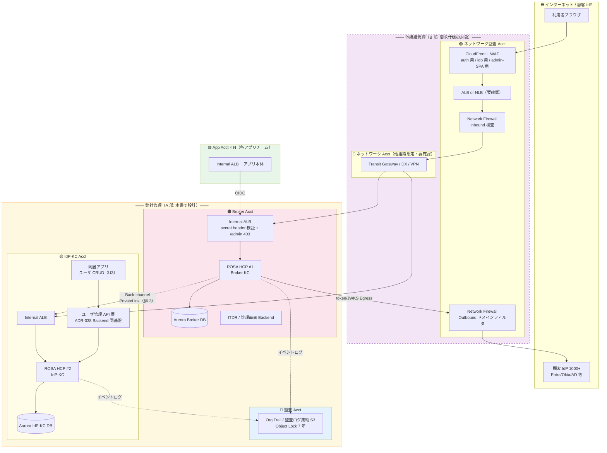

# U6: インフラ・ネットワーク設計

作成日: 2026-07-23
ステータス: Draft v1（Wave 1）
前提: [01-architecture-baseline.md](01-architecture-baseline.md) **Baseline v1（P-01〜P-18）**
上位文書: [00-basic-design-plan.md](00-basic-design-plan.md) U6

---

## 6.0 背景・なぜここで決めるか・スコープ

### 6.0.1 背景

U1 で実行基盤（P-01 ROSA HCP + RHBK Operator）、リージョン（P-15 東京 + 大阪）、クラスタトポロジ（P-17 IdP-KC 別 AWS アカウント・ROSA HCP × 2）、インターネット境界の管理主体（P-18 他組織管理の NW 監査 Acct）が凍結された。本書はこれらを物理構成（アカウント / VPC / クラスタ / DB / 経路 / サイジング）に落とす。

### 6.0.2 本書の最重要構造 — 2 部構成（P-18 由来）

P-18 により、インターネットの Inbound（CloudFront + WAF + ALB or NLB + Network Firewall）と Outbound（Network Firewall ドメインフィルタ）は**他組織管理**であり、我々は設定を実装できない（[ADR-039 v3 注記](../adr/039-centralized-network-account-edge-layer.md)）。したがって本書は次の 2 部で構成し、**混在させない**:

| 部 | 内容 | 我々の統制 |
|---|---|---|
| **A 部（§6.1〜§6.6）** | **自管理アカウント内設計** — Broker Acct / IdP-KC Acct / 監査 Acct の中身。我々が実装・保証する | 完全 |
| **B 部（§6.7）** | **他組織への要求仕様** — NW 監査 Acct / NW Acct に対して「要求として出す」項目（REQ-IN-* / REQ-OUT-*）。我々は要求と受入確認のみ可能で、実装は保証できない | 要求のみ |

この分離の帰結として、**セキュリティの生命線は「B 部が満たされなくても A 部単独で破られない」こと**（例: /admin 保護は WAF Deny〔B 部要求〕が外れても自管理側 Listener Rule 403〔A 部〕で成立、§6.6）。

### 6.0.3 スコープ / 非スコープ

- スコープ: 6 アカウント体系・クロスアカウント IAM / ROSA HCP クラスタ設計 × 2 / Broker ↔ IdP-KC クロスアカウント経路 / Aurora 設計 / サイジング（CPU・キャッシュ）/ /admin 保護 / 他組織要求仕様（Inbound・Outbound）
- 非スコープ: Keycloak 論理設計（Realm/Flow/SPI → U2）、DR フェイルオーバー手順詳細（→ U8、本書は物理配置のみ）、監視実装・IaC 分割（→ U9）、KMS Key Policy 詳細（→ U7）
- 本書確定後、[§C-7.2](../requirements/proposal/common/07-implementation-architecture.md)（旧 EKS / 5 アカウント / Auth Platform Acct 単一表記の SSOT）を本書の内容で一括改訂する（U1 §1.4 の残タスク）

---

# A 部: 自管理アカウント内設計

## 6.1 アカウント体系とクロスアカウント IAM

### 6.1.1 決定 D-U6-01: 6 アカウント体系の確定

ADR-039 の 5 アカウント体系を P-17（Broker / IdP-KC 分割）+ P-18（NW 監査 = 他組織）で読み替え、以下の **6 アカウント体系**で確定する（U1 §1.2 の図面化）:

> ⚠ 図の簡略化注意(2026-07-24): 上図の ALB 箱「secret header 検証 + /admin 403」は簡略表記であり、**主防御は /admin 403 + SG エッジ送信元限定、secret header は追加層**(REQ-IN-06 の重み付け参照)。**詳細版(全フロー ID 付き全体図 + ROSA 内部図)は [06a-network-flow-diagrams.md](06a-network-flow-diagrams.md) を参照**(2026-07-24 新設。同書 §A.3 で本書未記載のフロー 8 系統〔idm-api 公開入口 / Webhook Egress / HIBP / SES / ITDR 経路 6 / LDAPS / Canary / DNS 3 役割〕を追加検出 — SES 送信設計と Pod/Service CIDR 分離は §A.4 未決)。

| # | アカウント | 管理主体 | 主な内容 | 根拠 |
|---|-----------|---------|---------|------|
| 1 | 🟣 ネットワーク監査 Acct | **他組織（管理外）** | Inbound: CloudFront + WAF + ALB or NLB + Network Firewall / Outbound: Network Firewall ドメインフィルタ | P-18、ADR-039 v3 |
| 2 | 🔷 ネットワーク Acct | 他組織想定（**要確認**） | Transit GW / DX / Site-to-Site VPN | P-18、ADR-039 §A.3 |
| 3 | 🔵 監査 Acct | 弊社 | Org Trail / 監査ログ集約 S3（Object Lock 7 年）/ Security Hub / GuardDuty 集約 | ADR-039 §A.2 |
| 4 | 🟠 Broker Acct | 弊社 | ROSA HCP #1（Broker KC）+ Aurora + ITDR + 管理画面 Backend + Route 53 PHZ | P-17、ADR-033 |
| 5 | 🟡 IdP-KC Acct | 弊社 | ROSA HCP #2（IdP-KC）+ Aurora + **同居アプリ（ユーザ CRUD、経路設計は U3）** | P-17、ADR-033 更新注記 |
| 6 | 🟢 App Acct × N | 各アプリチーム | Internal ALB + アプリ本体（JWT 検証は VPC 内 JWKS 経路、ADR-012 パターン踏襲） | ADR-039 §A.2 |

補足:
- 旧「Auth Platform Acct」（§C-7.2.3）は Broker Acct / IdP-KC Acct に**分割済み**。§C-7 改訂は本書確定後（§6.0.3）。
- ADR-039 v2 の「アプリごと独立 CloudFront + WAF」の思想は維持するが、実装主体が他組織になったため **B 部の要求仕様として提示**する（§6.7.1）。

### 6.1.2 決定 D-U6-02: クロスアカウント IAM 原則

| # | 原則 | 内容 | 根拠 |
|---|------|------|------|
| 1 | **Broker ↔ IdP-KC 間に IAM クロスアカウント Role を作らない** | 両 Acct 間は §6.3 のネットワーク経路（OIDC federation HTTPS）のみ。IAM AssumeRole の相互許可は設けず、片方の侵害が他方の AWS 制御面に波及しない構造とする（P-17 の分離目的 = 権限分界・障害隔離を IAM 面でも貫徹） | P-17、ADR-033 |
| 2 | Pod → AWS リソースは **ROSA pod identity webhook + IRSA 方式** | クラスタ OIDC プロバイダを信頼する IAM Role + SA アノテーション。SA Token（短命・自動ローテーション）→ STS の**一時クレデンシャルは最長 1h で失効**（2026-07-24 表現修正） | ADR-041（2026-07-23 更新）、[research](research/rosa-hcp-adoption-research.md) #5 |
| 3 | クロスアカウントは「監査 Acct への書込」「CI/CD」「idmap 更新イベント」「ITDR イベント集約」のみ | 下表の 6 経路に限定。ワイルドカード Principal 禁止、`sts:ExternalId` or OIDC `sub` 条件必須 | ADR-041 §C.3（2 段階 STS チェーン維持） |
| 4 | 他組織 Acct との IAM 関係は**持たない** | NW 監査 Acct / NW Acct とは TGW Attachment / PrivateLink 等のネットワーク受渡しのみ。IAM 信頼は要求仕様にも含めない | P-18 |

**許可するクロスアカウント経路（6 経路）**:

| 経路 | 方式 | 用途 |
|------|------|------|
| Broker Acct → 監査 Acct S3 | IRSA Role + バケットポリシー（`aws:SourceAccount` 限定、書込のみ・削除不可） | KC イベント / ALB ログ / Flow Log 集約 |
| IdP-KC Acct → 監査 Acct S3 | 同上 | 同上 |
| CI/CD（GitHub OIDC）→ Broker / IdP-KC 各 Acct | GitHub OIDC Federation → 各 Acct の Terraform Role（`sub` = リポジトリ/ブランチ条件） | IaC デプロイ（state は Acct ごと分離、U9） |
| App Acct → Broker Acct | **IAM 経路なし**（OIDC/JWKS は HTTPS のみ）。Token Exchange 等もアプリ層プロトコルで完結 | ADR-041 の境界 2b/2c |
| IdP-KC → Broker | **EventBridge クロスアカウントイベント**（イベントバスへの PutEvents のみ許可） | `idmap` 更新（D1 SCIM Facade 発、案 i — U3 D3-11。Layer A FK の一元性を Broker Acct 側で維持） |
| IdP-KC → Broker | **EventBridge PutEvents（itdr-bus への PutEvents のみ許可）** | **ITDR イベント集約**（U7 D-U7-04。IdP-KC 側ローカル PW ログインイベントを Broker Acct の Risk Engine へ送出。経路 5〔idmap〕と同一方式のため増分リスク小） |

---

## 6.2 ROSA HCP クラスタ設計 × 2

### 6.2.1 決定 D-U6-03: クラスタ構成

| 項目 | Broker クラスタ（#1、Broker Acct） | IdP-KC クラスタ（#2、IdP-KC Acct） | 根拠 |
|------|------|------|------|
| 形態 | ROSA HCP（Classic 不採用: 新規作成期限公式化） | 同左 | P-01、[research](research/rosa-hcp-adoption-research.md) #1 |
| SLA | 99.95%（P-04 の 99.9% を上回る） | 同左 | research #1 |
| リージョン | 東京 ap-northeast-1（+ 大阪パイロットライト、§6.2.4） | 同左 | P-15 |
| Multi-AZ | **3 AZ**。HCP の Machine Pool は AZ 単位のため **AZ ごとに 1 Machine Pool × 3** を作成 | 同左 | P-04/P-05 |
| KC 配布 | RHBK Operator（OperatorHub、追加サブスク不要） | 同左 | research #3 |
| Control Plane | **Red Hat サービスアカウント内**（API server × 2 + etcd × 3、3 AZ 冗長）。顧客 VPC には出ない。Worker → CP は顧客 VPC 内の **PrivateLink Endpoint** 経由。CP のサイジングは Worker 数に応じ **Red Hat が自動管理**（顧客関与なし） | 同左 | 2026-07-23 ユーザー検討（[research note](research/rosa-hcp-machine-pool-egress-notes.md)） |
| Ingress | デフォルト IngressController を **Private / NLB** で作成（HCP 新規は CLB でなく **NLB が既定**）。**「platform 用 Private NLB」と「アプリ選択公開用」は追加 IngressController で分離**（OpenShift 4.14+ で HCP もサポート、Red Hat Cloud Experts〔MOBB〕推奨パターン。**ただし追加 IC の LB は Red Hat 管理外の顧客管理リソース扱い** — HCP サービス定義は default IC の LB のみ RH 管理、2026-07-24 検証追記）。前段に自管理 Internal ALB を置き L7 制御（§6.6 の 403 ルール、secret header 検証）を ALB 側で実施 | 同左 | research #1、ユーザー検討、ADR-010 の Private 原則 |
| ネットワーク | 各 Acct に専用 VPC（Private Subnet × 3 AZ + VPC Endpoint 群: S3 / ECR / Logs / KMS / Secrets / STS）。**CIDR は Broker / IdP-KC / 社内 NW / 顧客 AD 系と重複しないよう採番**（§6.3 PrivateLink 採用により必須ではないが、TGW 転換余地を残す） | 同左 | ADR-010 |
| **サブネット 4 層設計（2026-07-24 追記）** | AZ ごとに用途別 4 層で採番: **① TGW Attachment 用 /28** ② **ALB 専用 /26〜/27**（Internal ALB は専用サブネットに分離 — スケール時の ENI 枯渇防止）③ **Worker 用 /24 以上**（**OVN-Kubernetes のため Pod 数でなくノード数ベースで採番**。Failover 後の東京同等スケール〔KC Pool max 9/18 + infra〕を収容）④ **Aurora 用 /27〜/28**。**CIDR はクラスタ install 後に変更不可のため事前確定必須**（大阪側も同サイズで確保、§6.2.4） | 同左 | 2026-07-24 ユーザー検討（[research note](research/rosa-hcp-machine-pool-egress-notes.md)） |
| **Egress 形態（要決定 O-10）** | 通常構成では **AZ ごとに Public Subnet + NAT Gateway が必須**（Worker の registry.redhat.io / quay / OLM / STS 等への outbound）。**案 A**: NAT GW → 他組織 NFW ドメインフィルタ（P-18 接続）/ **案 B**: `zero_egress:true`（ECR ミラー化）+ **TGW で他組織 Outbound 専用経路へ** — **NAT 不要となり P-18（自 Acct に NAT を置かず他組織アウトバウンド経由）と製品仕様が噛み合うため積極検討**。§6.7.3 参照 | 同左 | 2026-07-23 ユーザー検討 |

- **⚠ HCP には専用 Infra Node が存在しない**（Classic の 3 Infra Node は廃止）: ingress **router pod** / in-cluster monitoring(Prometheus) / image registry（デフォルト配備）は **Worker Node に同居**する。**（2026-07-24 公式検証で訂正）OLM 本体（olm/catalog-operator・カタログ Pod）と Ingress Operator・ネットワーク系 Operator は Red Hat 側 Hosted Control Plane 内で稼働**し、Worker 上に載るのは **OperatorHub からインストールした Operator（RHBK Operator 等）とそのワークロード**。KC と infra 系の食い合いを防ぐため、§6.2.2 で **Machine Pool を役割分離**する（2026-07-23 ユーザー検討による設計変更）。
- **接続 3 系統の分離**: ①ユーザ（フロントチャネル）= 他組織エッジ → 自管理 Internal ALB → IngressController NLB → KC Pod / ②Red Hat SRE = **backplane 経由の JIT アクセス（短命トークン・MFA・全操作監査、PrivateLink 経由で CP 管理。昇格は 2h 限定・承認制の Red Hat 側手続。顧客の /admin とは完全別経路。※「break-glass credential」は HCP では顧客側機能の名称のため SRE アクセスの呼称に使わない — 2026-07-24 用語修正）**/ ③顧客側メンテ = SSM ポートフォワード（D-U6-12）。
- **SCIM Facade の配置**: Broker / IdP-KC 各クラスタの **default（infra）Pool** に常駐サービスとして配置（暫定 = U3-OP-3、§6.8.1 O-9）。受信経路は §6.7.1 REQ-IN-09（scim-broker / scim-idp）。

### 6.2.2 決定 D-U6-04: Machine Pool・インスタンスタイプ案（2026-07-23 改訂: 役割分離 2 Pool 構成）

Tier ごとに CPU プロファイルが 10-30 倍異なる（Broker = JWT/SAML 署名系、IdP-KC = Password Hashing 支配、[sizing-guide §5](../reference/keycloak-cpu-bottleneck-sizing-guide.md)）ことに加え、**HCP には Infra Node が無く infra 系が Worker に同居する**（§6.2.1）ため、**クラスタごとに「KC 専用 Pool」と「default（infra）Pool」の 2 系統 Machine Pool** を設計する。

**Pool 役割分離（両クラスタ共通）**:

| Pool | テイント | 載せるもの | スケール特性 |
|------|---------|-----------|-------------|
| **default（infra）Pool** | なし（**ROSA はテイントなし Pool〔レプリカ 2 以上〕が最低 1 つ必須** — 公式制約。rosa CLI 1.2.26+ なら default pool 自体へのテイントも可、KB 7032223） | ingress router pod / in-cluster monitoring（Prometheus。**UWM は新規クラスタで既定無効 → KC メトリクス scrape には Day-2 有効化必須**、2026Q1 仕様変更）/ image registry / **OperatorHub 導入 Operator（RHBK Operator 等。OLM 本体は RH 側 CP）** / **SCIM Facade** / **Fluent Bit Aggregator**（マスキング Filter 集中、U7 §7.3.1） | **準静的**: 負荷でなくクラスタ規模・監視量（1000+ IdP の時系列カーディナリティ）で手動 or 緩い Autoscale。Prometheus メモリを先に見積もり固定気味に確保 |
| **keycloak 専用 Pool** | `dedicated=keycloak:NoSchedule` + nodeSelector/toleration | KC Pod のみ | **動的**: HPA（CPU/予兆）→ Pending → Cluster Autoscaler が本 Pool にのみノード追加。**KC のバーストが infra を巻き込まない** |

- 分離しない場合のリスク: KC の HPA バーストが同居 infra と CPU/メモリを食い合い、**監視が飛ぶ・ingress が詰まる**（router は既定 replica 固定、monitoring は Pod 数で自動増しない）。10M MAU + 1000+ IdP では顕在化必至。
- スケールの 3 主体は独立: **CP = Red Hat 自動 / Worker = Machine Pool 単位（手動 or Autoscaler） / Pod = HPA**。連鎖（HPA → Pending → Autoscaler）はするが制御は別。

| 項目 | Broker クラスタ | IdP-KC クラスタ |
|------|------|------|
| Machine Pool 構成 | `kc-az1/2/3`（テイント付き）+ `default-az1/2/3`（infra） | 同左 |
| KC Pool インスタンス（第一候補） | **c7g.xlarge（4 vCPU/8 GB）** — Phase 1 ベースライン | **c7g.xlarge（4 vCPU/8 GB）** — Phase 1 ベースライン |
| KC Pool スケール上限タイプ | c7g.2xlarge — **サイズ変更 = EC2 作り直しのため、ピーク帯用 c7g.2xlarge Pool を事前に別 Machine Pool として定義**しておき必要時に台数を増やす（Blue/Green、稼働中の作り直し回避） | 同左 |
| KC Pool ノード数（東京） | min 3（AZ × 1）/ max 9 | min 3 / max 18（フェデ比率感度大、§6.5.3） |
| **default（infra）Pool** | **c7g.large × 2〜3/クラスタ**（monitoring 規模で増減、準静的） | 同左 |
| 代替（Graviton 非対応時） | c7i.xlarge | m7i.xlarge（Argon2id メモリ余裕） |
| KC Pod リソース | requests 2 vCPU / 3 GB、`MaxRAMPercentage=60-70`、G1GC | 同左 + Argon2id メモリ余裕（§6.5.4） |

- 根拠: インスタンス候補と 3y RI 単価は [sizing-guide §8](../reference/keycloak-cpu-bottleneck-sizing-guide.md)。c7g（Graviton3）は Broker/IdP-KC とも第一候補。**（2026-07-24 検証済み）ROSA HCP の Graviton/arm64 Machine Pool は 2024-07-24 以降作成クラスタで公式対応済み** — 残る確認は **RHBK Operator の arm64 イメージ提供**と**東京/大阪の c7g 在庫**のみ（未対応なら c7i/m7i 系へ差替、コスト +15-20%）→ §6.8 未決事項。
- ワーカー最小数: HCP はクラスタあたり最小 2 ノードだが、Multi-AZ 要件（P-04）により **KC Pool 最小 3（AZ × 1）を下限**とする。§6.5 のノード数試算（Broker max 9 / IdP-KC max 18）は **KC Pool の数値**であり、infra Pool は別建てで加算（§6.2.3）。
- ノードのスケールアウト/イン・バージョンアップは**ノード完全置換のローリング**（**既定 maxSurge=1 / maxUnavailable=0** — 1 台余分に立ててから抜く。pool ごとに変更可、2026-07-24 公式検証で既定値訂正）+ drain で実施。**PDB が尊重されるのは pool の `node-drain-grace-period`（最大 30 分等の設定値）の範囲内で、超過時は drain が強行される** — KC Pod の PDB + レプリカ配置 + 猶予時間の 3 点が揃って無停止が成立する。
- **Machine Pool 名の実体（2026-07-24 注記）**: HCP はクラスタ作成時にサブネットごとの pool（`workers` / `workers-2`…）を自動作成する。本書の `default-az1/2/3` / `kc-az1/2/3` は論理名であり、IaC 上は「自動作成 pool（infra 役）+ 追加作成 pool（KC 役）」に対応付ける。
- **アップグレード順序制約（U9 引き渡し）**: CP と Machine Pool は独立アップグレードで **CP を先行**、pool は CP から 2 マイナー版以内に維持（U9 §9.6 の KC 昇格ゲートと合わせて Runbook 化）。将来オプション: **AutoNode（Karpenter v1.9 ベース、2026Q2 に HCP 対応）**は Pool 事前定義不要の動的プロビジョニング — 本設計の準静的 infra + 動的 KC には従来型 Autoscaler が適合するため Phase 1 不採用、Phase 2 で再評価。

### 6.2.3 決定 D-U6-05: コスト表（HCP cluster fee 前提、東京 2 + 大阪パイロットライト 2）

前提: HCP cluster fee $0.25/h ≈ $182.5/月/クラスタ、Worker ROSA fee $0.171/4vCPU/h（3y 契約 55% 引はパートナーチーム経由・**見積未取得**）、EC2 は 3y RI 単価（[sizing-guide §8](../reference/keycloak-cpu-bottleneck-sizing-guide.md)）。**概算 ±30%、Phase 1 ベースライン（c7g.xlarge × 3/クラスタ）時点**。

| クラスタ | HCP fee | EC2（3y RI） | ROSA Worker fee（3y 55% 引仮定） | 小計/月 |
|---------|--------:|------------:|-------------------------------:|--------:|
| 東京 Broker（KC Pool c7g.xlarge × 3） | $182.5 | $186 | $169 | **$538** |
| 東京 Broker infra Pool（c7g.large × 3） | — | $93 | $84 | **$177** |
| 東京 IdP-KC（KC Pool c7g.xlarge × 3） | $182.5 | $186 | $169 | **$538** |
| 東京 IdP-KC infra Pool（c7g.large × 3） | — | $93 | $84 | **$177** |
| 大阪 Broker パイロットライト（**infra Pool: c7g.large × 2〔テイントなし〕+ KC 専用 Pool: min 0〔labeled/tainted、事前定義・平時ノードなし〕**） | $182.5 | $62 | $56 | **$301** |
| 大阪 IdP-KC パイロットライト（同左） | $182.5 | $62 | $56 | **$301** |
| **ROSA 合計（4 クラスタ）** | $730 | $682 | $618 | **≈ $2,032/月** |

- **2026-07-23 改訂**: HCP に Infra Node が無い帰結として infra Pool（東京 × 2 クラスタ分 ≈ +$354/月）を別建て加算（旧試算 $1,678 → **$2,032**）。大阪パイロットライトは最小 2 ノード(テイントなし)が infra を兼ねるため増分なし。
- **2026-07-24 修正（大阪 KC Pool の不整合解消）**: KC Pod は `dedicated=keycloak` toleration + nodeSelector を持つ（§6.2.2）ため、**テイントなし infra ノードだけの大阪では Failover 時に KC Pod がスケジュール不能**になる。よって大阪にも **KC 専用 Machine Pool（labeled/tainted、min 0・平時ノード 0 台 = コスト増なし）を事前定義**し、Failover 時に 0 → 3+ へスケールする。U8 §8.5 の「replicas 0→3」「min 0 スケールアップ用プール」はこの KC 専用 Pool を指す。
- クラスタ 1 本の固定増分 ≒ +$500〜680/月という research #7 の見立てと整合。**P-17（別 Acct 2 クラスタ + DR 側 2）の増分コストはユーザー凍結済みの許容範囲**。
- 大阪はパイロットライト（Warm Standby 最小、ADR-051）: 平時 2 ノード + Failover 時に Machine Pool を東京同等へスケールアップ（RB-DR-03 相当、U8）。
- 10M MAU ピーク帯までスケールした場合のワーカー増分は §6.5 の vCPU 試算から別途線形加算（Broker +$350〜1,000/月、IdP-KC +$500〜2,500/月程度。B-BROK-1 確定後に再計算）。
- Aurora / ALB / VPC Endpoint 等は §6.4 と ADR-051 §G を参照（DR 込み Aurora ≈ $2,280/月 × 2 DB 系統ベース）。

### 6.2.4 大阪（DR）側の扱い

- 東京 + 大阪の **ROSA HCP 対称構成が成立**（AWS 公式リージョン表で確認済み、ADR-051 2026-07-23 更新）。
- 残: **G-OSAKA** — 大阪側の該当インスタンスタイプ在庫 + vCPU クォータの実確認（U1 §1.5 ゲート、§6.8）。
- **大阪の Machine Pool 構成（2026-07-24 明確化）**: infra Pool（c7g.large × 2、テイントなし）+ **KC 専用 Pool（labeled/tainted、min 0、東京と同一のテイント/ラベル定義で事前作成）**。CIDR・サブネットも Failover 後の東京同等スケール（KC Pool max 9/18）を収容できるサイズで事前確保する（§6.2.1 サブネット設計参照）。
- DR の Failover 手順・RTO/RPO 設計は U8（本書は「Broker/IdP-KC それぞれ大阪にパイロットライト・クラスタと Aurora Global Secondary を持つ」という物理配置のみ確定）。

---

## 6.3 Broker ↔ IdP-KC クロスアカウント経路

### 6.3.1 前提: フロントチャネルとバックチャネルの分離

2-tier フェデレーション（ADR-033 §C シナリオ 2）では、IdP なし顧客のログイン時にユーザーの**ブラウザが IdP-KC のログイン画面へリダイレクト**される。したがって:

| チャネル | 通信 | 経路 |
|---------|------|------|
| **フロントチャネル**（authorize / ログイン画面） | ブラウザ → IdP-KC | **他組織 Inbound エッジ経由**（`idp.basis.example.com` 用の CloudFront + WAF セットを B 部で要求、REQ-IN-02） |
| **バックチャネル**（token / JWKS / userinfo） | Broker KC Pod → IdP-KC Internal ALB | **本節のクロスアカウント私設経路**（インターネット非経由） |

バックチャネルの名前解決は Split-horizon DNS（ADR-012 Follow-up / [keycloak-network-architecture.md §6.5](../common/keycloak-network-architecture.md)）: Broker Acct の Route 53 Private Hosted Zone で `idp.basis.example.com` を私設経路のエンドポイントに解決させ、`iss` の一致を保ったまま VPC 内完結させる。

### 6.3.2 決定 D-U6-06: バックチャネル経路は PrivateLink を推奨

| 観点 | ① TGW | ② VPC Peering | ③ **PrivateLink（推奨）** |
|------|-------|---------------|--------------------------|
| 方向性 | 双方向（ルーティング次第） | 双方向 | **単方向**（Broker → IdP-KC のみ。逆流不能） |
| 到達範囲 | 経路設定した CIDR 全体 | 相手 VPC 全体 | **公開した NLB/サービスのみ**（最小到達） |
| CIDR 重複 | 不可 | 不可 | **無関係** |
| 管理主体 | **NW Acct = 他組織想定（P-18）**。我々単独で完結しない | 弊社 2 Acct 間で完結 | 弊社 2 Acct 間で完結 |
| コスト | Attachment $0.07/h × 2 + 処理料 | 同 AZ 内転送無料 | Endpoint ~$7/月 + $0.01/GB |
| 帯域・遅延 | 十分 | 十分 | 十分（トークン交換は低トラフィック: 初回ログインのみ、SSO 中は Broker 完結 = ADR-033 §C シナリオ 3） |

**判断**: **③ PrivateLink** を推奨・採用する。
- 根拠 1: P-17 の分離目的（権限分界・障害隔離）と方向一致 — IdP-KC 側から Broker VPC へ**構造的に到達できない**単方向経路は、IdP-KC（PW ハッシュ保有側、ADR-033 §D-1）侵害時の横展開を経路レベルで遮断する。
- 根拠 2: TGW は NW Acct（他組織想定）依存となり、弊社 2 Acct 間の内部経路まで他組織の変更管理に載る。P-18 の教訓（管理外依存の最小化）から回避。
- 根拠 3: HCP worker は自アカウント VPC 内にあり（research #8）、IdP-KC 側 Private Ingress の NLB を Endpoint Service 化する構成は AWS 標準パターン。
- 実装: IdP-KC Acct の Ingress NLB → VPC Endpoint Service（`acceptance_required = true`、許可 Principal = Broker Acct のみ）→ Broker Acct に Interface Endpoint → PHZ `idp.basis.example.com` を Endpoint に Alias。TLS は IdP-KC 側 Ingress で終端（証明書は IdP-KC Acct ACM/cert-manager）。
- 補足: 将来 IdP-KC シャーディング（P-16 超過時の拡張パス、ADR-033 更新注記）でも Endpoint Service を追加するだけで Broker 側設計は不変。
- **アプリ → IdP-KC のユーザ CRUD 経路（P-17）は IdP-KC Acct 内で完結**（同居アプリ → **専用 API 層（ADR-038 Backend 同基盤、IdP-KC Acct 内配置）** → IdP-KC Admin API。U3 D3-05 確定。Admin API 直・SCIM 経由は不採用）。本書はネットワーク面で「IdP-KC Acct の VPC 内経路のみ・クロスアカウント CRUD 経路は設けない」ことのみ確定する。
- **2-tier クライアント認証**: PrivateLink 閉域経路が成立するため Phase 1 は `client_secret_post` を許容。`private_key_jwt` / mTLS への昇格は U7 の Secrets ローテーション設計と同時に判断（Phase 2 開始まで）— U2 未決 #4 への回答。

---

## 6.4 Aurora PostgreSQL 設計

### 6.4.1 決定 D-U6-07: 基本構成

| 項目 | 決定 | 根拠 |
|------|------|------|
| エンジン | Aurora PostgreSQL 16（RHBK 26.4 HA Guide が 15/16/17 を multi-site HA サポート DB に明記） | research #8、ADR-051 更新注記 |
| クラスタ | Broker DB / IdP-KC DB の **2 系統**（各 Acct 内、共有しない） | ADR-033 §E-1 |
| 東京構成 | Writer + Reader × 2（Multi-AZ）、I/O-Optimized（Write IOPS 14,000-42,000 見込み） | ADR-033 §A |
| インスタンス | Broker: db.r7g.xlarge × 3 / IdP-KC: db.r7g.xlarge × 2（Phase 1。10M ピーク帯で Broker db.r7g.2xlarge 化を再評価） | ADR-033 §G、ADR-051 §B.1 |
| DR | Aurora Global Database（大阪 Secondary Reader × 1、RPO < 1 min）。Failover 手順は U8 | ADR-051 §B.1、P-05 |
| 暗号化 | KMS MRK（CMK は Acct ごと。IdP-KC DB は PW ハッシュ保有のためバックアップ暗号化必須） | ADR-045、ADR-033 §H |
| 接続 | **KC Pod SG → Aurora SG の直接続**（HCP でも worker は自 Acct VPC 内のため PrivateLink 不要 — 旧調査の「PrivateLink 経由」は CP↔worker 間の話） | research #8 |
| `idmap` 補助 DB | **Broker Acct Aurora の別 DB（KC スキーマと分離）に暫定配置**（U3-OP-2、§6.8.1 O-8）。更新は Broker Acct 側ハンドラ経由のみ（D1 発は EventBridge クロスアカウントイベント、§6.1.2 経路 5） | U3 D3-03/D3-11 |

### 6.4.2 決定 D-U6-08: jdbc-ping 前提のコネクション設計

KC 26.1 以降 **jdbc-ping がデフォルト**（ノードディスカバリを KC DB の `JGROUPSPING` テーブル経由で実施、multicast 不要。PoC 前提と完全整合 — research #8）。これを前提に:

| 項目 | 設計値（初期） | 理由 |
|------|---------------|------|
| 接続先エンドポイント | **Cluster（Writer）エンドポイントのみ**。Reader エンドポイントを KC に渡さない | jdbc-ping のハートビート書込 + KC のトランザクション整合。読取分散は KC では行わない |
| Pod あたり接続プール | **`db-pool-initial-size` = `db-pool-min-size` = `db-pool-max-size` = 30 の等値**を明示設定（2026-07-23 改訂: 旧 10/30 → Keycloak 公式推奨の等値化。Agroal デフォルト max 100/pod は放置厳禁） | 等値化で接続チャーン回避 + PostgreSQL server-side prepared statement（5 回実行で有効化）が効き **p99 に有利**。トレードオフ: scale-out 時に新 Pod が即 30 本確保するが、下記の Writer 余裕内に収まる |
| 総接続数見積 | 最大 Pod 数 27（Broker 9 + IdP-KC 18）× 30 = **810**。Writer 上限は r7g.xlarge で **max_connections ≈ 3,300**（`LEAST(DBInstanceClassMemory/9531392, 5000)`、32GB）から**予約枠**（superuser 3 + Aurora 内部 + 管理画面 Backend の Admin API クライアント + postgres_exporter + 移行バッチ）を控除して評価 — それでも大幅な余裕 | 2 系統 DB に分かれるため実際はさらに余裕（Broker 270 / IdP-KC 540）。**idmap 補助 DB の接続は API 層/バッチ側の別プールで独立計上**（KC の枠と混ぜない） |
| jdbc-ping 留意 | Failover（Writer 交代 / Global DB Promote）中はディスカバリ書込が一時失敗する。**クラスタ全 Pod の同時再起動を伴う操作は Writer 安定後に実施**する運用制約を U8/U9 Runbook に引き渡す | KC 26.1 リリースノート、ADR-051 |
| タイムアウト | JDBC socket/login timeout を ALB/Route 53 Failover TTL（30s）より短く設定し、Failover 検知を DB 側で先行させる | ADR-051 §D.2 |

### 6.4.3 決定 D-U6-09: RDS Proxy は暫定不採用

| 観点 | 評価 |
|------|------|
| 恩恵 | RDS Proxy の主用途は「大量短命接続（サーバーレス）」の多重化と Failover 短縮。KC は **Quarkus/Agroal の長命プール**で接続数が設計上固定（§6.4.2）のため多重化恩恵がほぼない |
| リスク | セッション状態（prepared statement / advisory lock 系）による**ピン留め**で多重化が無効化 + レイテンシ加算。jdbc-ping のハートビート経路に中間層が挟まる構成は RHBK 26.4 HA Guide / keycloak-benchmark の「ROSA + Aurora 直結」手順（research #8）から外れ、サポート切り分けが不利 |
| コスト | vCPU 課金が Aurora 2 系統 × 東西で加算 |

**判断**: **Phase 1 は不採用（Aurora SG 直接続）**。ただし U8 の DR 検証で「Writer Failover 時の KC 再接続時間」が RTO 内訳を圧迫する場合に限り再評価する（§6.8 未決事項に登録）。
- 一般則の裏付け（2026-07-23 追記）: 外部 pooler が必要になるのは「1 pod あたり接続 < 5 × pod 数百」の形態。本設計は **pod 少数（最大 27）× 中規模プール（30）の長命プール直結**が最適解。将来 P-16 超過で IdP-KC を数百 pod 規模へシャーディングする段階で初めて **PgBouncer transaction mode** を拡張パスとして検討する。

---

## 6.5 サイジング（MAU 10M 上限 / フェデ比率 70/30 暫定 / Argon2id）

### 6.5.1 前提と暫定値の明示

| パラメータ | 値 | 位置づけ |
|-----------|-----|---------|
| MAU | 10M 上限 | P-02（凍結） |
| ピーク Login TPS | 1,000-3,000 | ADR-033 §A（10M MAU 試算） |
| フェデ比率 | **70% フェデ / 30% ローカル — 暫定**。**B-BROK-1（ヒアリング）未回答のため典型値を仮置き**。P-07 γ シナリオ（管理者層のみローカル）が確定すればローカル比率は 5% 未満まで縮小し得るため、**本節の IdP-KC 側は上限保守値** | [sizing-guide §7](../reference/keycloak-cpu-bottleneck-sizing-guide.md)、P-07 |
| PW ハッシュ | **Argon2id**（KC 25+ デフォルト、P-03 FIPS 不要のため維持）。スループット 8-12 TPS/vCPU（t=1/m=64MB 帯の保守値。KC デフォルトパラメータ m=7MiB/t=5 での実測は PoC で補正） | sizing-guide §3/§6 |
| Safety Margin | 1.5x | sizing-guide §6 |

### 6.5.2 Broker クラスタ CPU 試算

公式（sizing-guide §6）: `Broker vCPU ≈ (L × 0.003 + R × 0.002 + 1) × M`、R（Refresh TPS）= L × 4 と仮置き。

| シナリオ | L | R | 必要 vCPU | ワーカー構成（c7g、Pod requests 2 vCPU 前提） |
|---------|---:|---:|----------:|--------------------------------|
| 10M MAU ピーク下限 | 1,000 | 4,000 | **≈ 18** | c7g.2xlarge × 3（24 vCPU） |
| 10M MAU ピーク上限 | 3,000 | 12,000 | **≈ 51** | c7g.2xlarge × 7（56 vCPU）へ HPA + Machine Pool autoscale |
| Phase 1 立上げ（〜1.5M 想定） | 125 | 500 | ≈ 6-9 | **c7g.xlarge × 3（ベースライン、§6.2.2）** |

- Broker は Password Hashing ~0%（sizing-guide §5）のため CPU 需要は署名/検証系で線形。SAML 顧客 IdP 比率が高い場合 DSig 検証分の上振れに注意（監視で補正、U9）。

### 6.5.3 IdP-KC クラスタ CPU 試算（フェデ比率感度）

公式: `IdP-KC vCPU ≈ (L × (1 - F) / T_login) × M`、T_login = 10 TPS/vCPU（Argon2id 中央値）。

| フェデ比率 F | ローカル TPS（L=1,000 / 3,000） | 必要 vCPU | ワーカー構成 |
|-------------|-------------------------------:|----------:|-------------|
| **70/30 ★暫定** | 300 / 900 | **45 / 135** | c7g.2xlarge × 6 〜 × 17 + margin。**最大ケースは Machine Pool max=18 の根拠（§6.2.2）** |
| 90/10 | 100 / 300 | 15 / 45 | c7g.2xlarge × 2 〜 × 6 |
| γ シナリオ確定時（≈97/3） | 30 / 90 | 5 / 14 | **c7g.xlarge × 3 で収まる** |

- **B-BROK-1 の回答が IdP-KC のノード数（= コスト）を 3〜17 台の幅で直接決める**。回答受領時は本節のみ差し替えれば §6.2.3 コスト表まで機械的に再計算できる構造とした。
- ローカル 100% への振れ（フォールバック β）でも c7g.2xlarge × 20 前後で線形に吸収可能（sizing-guide §7）であり、アーキテクチャ変更は不要。

### 6.5.4 メモリ・Argon2id 留意

- Argon2id はメモリハード（sizing-guide §4）。KC デフォルト（m=7MiB）なら同時ハッシュ 900 並列でも +6.3 GB/クラスタ程度で c7g の 1:2 メモリ比で吸収可能。**m=64MB 系へ強化する場合は m7g 系へ変更**（セキュリティパラメータ選定は U7）。
- IdP-KC はスケールアウト時の JVM warmup + Infinispan 参加が遅いため、**Scale-Out 予兆トリガ（`login_success_password_rate` > 8 TPS/node 3 分）を CPU 閾値より優先**（sizing-guide §9）→ U9 に引き渡し。

### 6.5.5 決定 D-U6-10: IdP 1000+ 時の Infinispan キャッシュ初期値

P-16（1000+ IdP、条件付き成立）の必須対策 6「キャッシュサイジング明示設計」（[research](research/keycloak-1000idp-scalability-research.md)）を以下の初期値で確定し、**PoC P-4（キャッシュメモリ実測）で補正**する:

| キャッシュ | 初期値 | 根拠 |
|-----------|-------|------|
| realms 系（IdP 専用キャッシュ含む、KC 26.0 `IdentityProviderStorageProvider` 経由） | **max-count 200,000 entries** | 26.4 公式ベンチ: 10k → 200k entries で Aurora CPU 77.8% → 63.8%（research 必須対策 6）。IdP 2,000 ×（IdP 1 + Mapper 6 + org 紐付け）≈ 16,000 entries に対し 10 倍超の余裕 |
| users | 100,000（アクティブ作業集合ベース。ヒット率 < 90% で増量） | sizing-guide §9 `infinispan_cache_hit_ratio` 監視と連動 |
| sessions 系 | KC 26 の Persistent user sessions（DB 永続）デフォルトを維持し、メモリ側は既定上限。Off-heap 化は負荷試験後（sizing-guide §10 Level 5） | ADR-051 §C.4（Session は Region 間非同期・失効許容） |
| ヒープ影響 | 上記で +1.5〜2 GB/Pod を見込み、Pod メモリ 3 GB → 4 GB へ引上げ可能な余裕を Machine Pool に確保 | §6.2.2 |

- 併せて P-16 必須対策 4「realm 全体 export/import 運用禁止」をインフラ運用禁則として U9 Runbook に引き渡す。

---

## 6.6 /admin 保護（自管理側実装）

### 6.6.1 決定 D-U6-11: 3 層防御 + `hostname-admin` 分離を採用

P-18 により WAF の「/admin 全 IP Deny」は**他組織への要求（保証不能）**に変わった（ADR-039 v3 注記 2）。よって自管理側で完結する防御線を 2 層持ち、WAF は追加層と位置づける:

| 層 | 実装 | 管理主体 | 位置づけ |
|----|------|---------|---------|
| L1（要求） | CloudFront WAF で `/admin/*` 全 IP Deny（REQ-IN-04） | 他組織 | あれば良い追加層。**保証しない** |
| L2（**生命線**） | Broker/IdP-KC Acct の Internal ALB（外部流入側 Listener）で `/admin/*` → **固定 403** ルール（最優先評価）。PoC 実証済みパターン（[keycloak-network-architecture.md §3.1](../common/keycloak-network-architecture.md) Rule Default 403、ADR-039 §E.1） | 弊社 | 我々が保証する第一防御線 |
| L3（構造防御） | **Keycloak `hostname-admin` 分離を採用**（下記） | 弊社 | 設定ミス時の最終防御 |

**`hostname-admin` の採否判断（推奨案）**: **採用する**。
- 設定: `hostname=https://auth.basis.example.com`（公開系）/ `hostname-admin=https://kc-admin.broker.internal`（Admin Console 専用）。`kc-admin.broker.internal` は **Broker Acct の Route 53 PHZ にのみ登録**し、パブリック DNS に存在させない（IdP-KC 側も同様に `kc-admin.idpkc.internal`）。
- 効果: Admin Console の URL 生成・リダイレクトが内部ホスト名に固定され、公開ホスト名側から管理 UI が「開けない」構造になる。**注意: `hostname-admin` 単体はアクセスブロック機構ではない**（パス自体は残る）ため、必ず L2 の 403 ルールと併用する — 3 層で初めて成立する設計であることを明記する。
- 影響: Terraform（keycloak provider）/ ユーザ管理画面 Backend（ADR-038）等の Admin REST API クライアントは**内部ホスト名 + 内部経路経由**に統一する（U2/U9 へ引き渡し）。
- 却下した代替: 「L2 のみ（hostname-admin なし）」— 追加コストほぼゼロの構造防御を捨てる理由がない。「Admin 専用の別公開 ALB」— PoC の Admin ALB パターン（ADR-010 Cons で本番非推奨と整理済み）はインターネット露出が残るため不採用。

### 6.6.2 決定 D-U6-12: Internal 運用経路

| 経路 | 方式 | 用途 |
|------|------|------|
| **標準** | **SSM Session Manager ポートフォワード**（各 Acct の踏み台レス。IAM + SSM ログで監査、監査 Acct へ集約） | 日常の Admin Console / DB メンテ（ADR-010 Follow-up の方針を踏襲） |
| 併用 | 社内 NW / Client VPN →（NW Acct TGW 経由 — **他組織依存のため可用性を保証しない**）→ Internal ALB | チーム常用アクセス。TGW 断時は SSM 経路に退避 |
| 禁止 | インターネットからの /admin 到達経路の新設 | ADR-039 §E |

- SSM 経路は他組織（NW Acct）に依存しない点が P-18 環境での可用性上の利点。**運用経路の二重化（SSM 標準 + VPN 併用）を必須**とする。

---

# B 部: 他組織への要求仕様

## 6.7 ネットワーク監査 Acct / ネットワーク Acct への要求仕様

本節は先方（NW 監査 Acct / NW Acct 管理組織）への**要求として出す形式**で記述する。各項目に REQ 番号を付与し、合意結果（可否・SLA）を本書に追記して管理する。前提となる責任分界は ADR-039 v3 注記。

### 6.7.1 Inbound 要求（REQ-IN）

| # | 要求 | 内容 | 根拠 |
|---|------|------|------|
| REQ-IN-01 | 認証基盤専用 CloudFront + WAF セット | `auth.basis.example.com` 用に**独立した** CloudFront + WAF（他アプリと共有しない）。WAF ルール: Common + Targeted + ATP + 認証専用 Rate Limit | ADR-039 §B.2（独立セット思想の要求化） |
| REQ-IN-02 | IdP-KC フロントチャネル用セット | `idp.basis.example.com` 用の CloudFront + WAF セット（2-tier のログイン画面公開に必須、§6.3.1） | ADR-033 §C |
| REQ-IN-03 | 管理画面 SPA 用セット | `admin.basis.example.com`（顧客テナント管理者向け、外部公開・KC /admin とは別物） | ADR-039 §E.3 |
| REQ-IN-04 | **/admin 全 IP Deny ルール** | REQ-IN-01/02 の WAF に `/admin/*` 全 IP Deny を最優先で設定。**未設定でも弊社側 L2/L3 で防御は成立する（§6.6）が、多層防御として要求** | ADR-039 §E |
| REQ-IN-05 | ビューア IP ヘッダの透過 | CloudFront で `X-Forwarded-For` / `CloudFront-Viewer-Address` を改変せずオリジンへ転送（Rate Limit / ITDR / 監査のクライアント IP 特定に必須） | ADR-035、§6.7.2 |
| REQ-IN-06 | オリジン検証ヘッダ（**追加層**） | CloudFront → オリジン経路に秘密ヘッダ（`X-CloudFront-Secret`）を付与。値は弊社発行・年 2 回ローテーション。弊社 Internal ALB で検証する。**2026-07-24 重み付け修正: 本ヘッダの本来目的（CloudFront 迂回の直アクセス防止）は Internal ALB トポロジで既に達成されているため、主防御 = /admin 403（D-U6-11 L2）+ SG でエッジ送信元限定、secret header = 多層防御の追加層（他組織の設定・ローテーション運用に依存するため主防御に位置づけない）** | ADR-039 §C |
| REQ-IN-07a | Sorry 制御連携（**障害時 Maintenance/Sorry**） | 503・オリジン断時の Sorry ルーティング（Lambda@Edge or CF エラーページ）の設定余地（**U8 主管**、DR/劣化可視化） | ADR-022、U8 |
| REQ-IN-07b | Sorry 制御連携（**認可 Sorry**） | `403` + `X-Sorry-Reason` ヘッダあり → `302 /sorry?app=&reason=` の集約（**U4 別紙**が要求仕様を確定。受諾されても RP 側 redirect 規約は廃止しない — U5 §5.6.6） | ADR-022、U4 §4.5.1 |
| REQ-IN-09 | SCIM 受信用 CloudFront + WAF セット × 2 | `scim-broker.<domain>` / `scim-idp.<domain>` 用（D2: 顧客 IdP → Broker / D1: 顧客 HRIS → IdP-KC）。送信元 IdP/HRIS の IP 許可リスト + テナント別 Rate Limit（初期値 10 req/s、U3 D3-11） | U3 D3-11、ADR-025 §I.1 |
| REQ-IN-10 | CloudFront ログの scrubbing 連携 | 認証系ディストリビューションのログ設定で query string 記録を最小化（`code`/`state` 等が残らない設定）+ ログを弊社監査 Acct へ配信する場合は弊社側マスク経路を通すこと | U7 §7.3 |
| REQ-IN-11 | launchpad SPA 配信用 CloudFront + WAF セット | `launchpad.<domain>`（launchpad/Sorry SPA 配信、S3 オリジン + OAC。**U4 §4.7.4 の追加提案に対する予約採番** — 詳細要求は U4 確定後に追補） | U4 §4.7.4（予約） |

### 6.7.2 ALB 経路か NLB 経路かの場合分け（REQ-IN-08、**先方確認事項**）

P-18 で Inbound が「ALB **または** NLB + Network Firewall」とされているため、両パターンの要求を場合分けして提示し、**先方にどちらかを確認する**（§6.8 未決事項）:

| 観点 | パターン In-A: 先方 ALB 経路 | パターン In-B: 先方 NLB 経路（**弊社推奨**） |
|------|------------------------------|---------------------------------------------|
| TLS 終端 | 先方 ALB で終端（`auth.basis.example.com` の証明書を**先方が保有・更新**） | NLB は TCP:443 パススルー → **TLS 終端は弊社 Internal ALB**（証明書・秘密鍵が自管理に留まる） |
| WAF 適用範囲 | CloudFront（L7）+ 先方 ALB（Regional WAF 可） | **CloudFront のみ**（NLB に WAF 不可）。→ REQ-IN-01 の CloudFront WAF が唯一の WAF となるため**必須条件に格上げ** |
| クライアント IP | CF + 先方 ALB が XFF に追記 → 弊社側は先方 ALB を信頼プロキシに追加 | CF が付与した XFF がそのまま到達（NLB は L4 透過）→ 信頼プロキシは弊社 ALB のみ |
| KC proxy headers 整合 | `proxy-headers=xforwarded` + 信頼チェーンに**先方 ALB を含める**（先方構成変更が弊社 KC 設定に波及） | `proxy-headers=xforwarded` + 信頼チェーンは**弊社 ALB のみで閉じる** |
| 証明書運用 | 先方 ACM。更新失敗 = 全ログイン停止のため**更新 SLA の合意必須** | 弊社 ACM。他組織依存なし |
| 弊社評価 | 依存が増える | **推奨** — TLS 終端・証明書・プロキシ信頼チェーンが自管理で完結し、P-18 の管理外依存を最小化 |

- **In-B 推奨の根拠補足（2026-07-24 追記）**: TLS 終端は 2 箇所で不可避に発生する — ①**CloudFront は WAF（L7 検査）のため終端が不可避**（これはどちらのパターンでも同じ）。②2 段目の終端を先方 ALB に置く（In-A）と**平文 HTTP が他組織 VPC 内に出現**するが、In-B（NLB パススルー）なら**平文の出現位置を自管理 VPC（弊社 Internal ALB 以降）に閉じられる**。P-18 の管理外領域に平文を置かないことが In-B 推奨の本質的理由。

**要求文**: 「NLB（TCP:443 パススルー）経路を推奨する。ALB 経路とする場合は、①証明書更新 SLA、②XFF 付与仕様（追記位置・偽装除去）、③ヘルスチェックパス（`/health/ready`）、④アイドルタイムアウト ≥ 65s、の 4 点の合意を条件とする。」

### 6.7.3 Outbound 要求（REQ-OUT）— フェデレーション Egress

Broker KC は顧客 IdP の authorization/token/JWKS/userinfo エンドポイントへ HTTPS Egress する。IdP 1000+（P-16）ではドメイン数も 1000+ に達し、Outbound の Network Firewall ドメインフィルタ（他組織管理）と正面衝突する（ADR-039 v3 注記 3 の新リスク）。

**zero-egress との関係（2026-07-23 追記）**: §6.2.1 O-10 の **案 B（`zero_egress:true`）を採用する場合、Worker の運用系 outbound（registry 等）は ECR ミラー化で VPC 内完結し、自 Acct に NAT GW を置かずに TGW で他組織 Outbound 専用経路へ接続できる** — P-18 の「アウトバウンドは他組織アカウント経由」と ROSA の**サポート済み標準構成が噛み合う**。この場合も顧客 IdP 1000+ FQDN のフェデレーション Egress は先方 NFW ドメインフィルタを通過するため、本節の REQ-OUT 要求(特に D-U6-13 の委任方式)は**案 A/B いずれでも必要**(zero-egress は REQ-OUT の代替ではなく、NAT と運用系 Egress 統制の代替)。

**選択肢比較**:

| 案 | 方式 | IdP 追加リードタイム < 1 営業日（§NFR-3）との整合 | 統制 | 評価 |
|----|------|----------------------------------------------|------|------|
| ① 都度申請 | IdP 追加ごとに先方へドメイン許可申請 | **申請 SLA 次第で破綻**（先方の変更管理が週次なら SLA 違反が常態化） | 先方フル統制 | ❌ 単独では不成立 |
| ② 認証基盤向け一括ポリシー | 「Broker KC の Egress 専用ルールグループ」を事前合意で設置。宛先 FQDN リストを弊社が管理し、先方は**枠（送信元 = Broker KC Pod CIDR、ポート = 443 のみ、プロトコル = TLS）を統制** | ✅ 追加はリスト更新のみ | 枠 = 先方 / 中身 = 弊社（委任） | ◎ 推奨の主軸 |
| ③ FQDN 許可の自動化 API | 弊社の IdP オンボーディングパイプラインから先方 Firewall のルール更新 API（もしくは先方提供の申請 API）を呼び、自動反映 + 監査ログ | ✅ 分単位 | ②の委任を API 化 | ◎ ② の実装形態として要求 |

**決定 D-U6-13（要求案）**: **② + ③ のハイブリッドを第一要求**とする。
- 要求文: 「認証基盤（Broker KC）専用の Egress ルールグループ（Suricata 互換、送信元 = Broker KC CIDR / TCP:443 / TLS SNI ベース FQDN 許可）を設置し、FQDN リストの更新権限を弊社オンボーディングパイプラインに委任（API または CI 連携）いただきたい。全更新は双方の監査ログに記録し、四半期レビューで先方が棚卸しする。」
- **フォールバック条件（G-EGRESS ゲートの合否基準）**: ② / ③ が受け入れられない場合、①都度申請の**申請 SLA ≤ 4 営業時間**を合意できなければ、§NFR-3 の「IdP 追加リードタイム < 1 営業日」は成立しない → NFR 側改訂（リードタイム緩和）を U9 経由でエスカレーションする。**「SLA 未合意のまま Phase 1 契約」を禁止する**のが本ゲートの趣旨（U1 §1.5 G-EGRESS）。
- 付帯要求: LDAPS 顧客 AD への Egress（TCP:636、ADR-039 §F.1.A の 3 ルール: 許可 CIDR 限定 / 未知宛先 636 drop+alert / 平文 389 全 drop）も同ルールグループ内で**要求仕様として提示**する（実装主体は先方に変更、監査ログ連携 REQ-OUT-03 で受領）。

**その他 Outbound 要求**:

| # | 要求 | 内容 |
|---|------|------|
| REQ-OUT-01 | Egress ルールグループ設置 + 更新委任（上記 D-U6-13 本文） | — |
| REQ-OUT-02 | デフォルト Deny の維持 | Broker/IdP-KC CIDR からの許可外 Egress は drop + alert（C2 通信検知。弊社側も SG Egress 最小化で二重化、ADR-010） |
| REQ-OUT-03 | Firewall Alert/Flow ログの共有 | Network Firewall Alert Log と該当 Flow Log を弊社監査 Acct へ配信（S3 レプリケーション or 購読）。ITDR（L-GD 系検知、ADR-060 §C.2.2）の入力に必要 |
| REQ-OUT-04 | DNS 解決の整合 | 顧客 IdP FQDN の名前解決経路（Route 53 Resolver）と Firewall の FQDN 評価が同一解決系であること（DNS 分裂による誤 drop 防止） |

### 6.7.4 要求仕様の運用

- 本節を抜粋した「要求仕様書 v1」を別紙として先方へ提示し、**回答（可否・SLA・実装時期）を REQ 番号単位で本書に追記**する。
- 受入確認: REQ-IN 系は疎通試験（弊社テストドメインで 403/秘密ヘッダ/XFF の実挙動確認）、REQ-OUT 系はテスト IdP ドメインの追加所要時間実測（G-EGRESS の実測値）で行う。

---

## 6.8 未決事項と他単元への引き渡し

### 6.8.1 未決事項（オープン項目）

| # | 項目 | 内容 | 期限/ゲート |
|---|------|------|------------|
| O-1 | **G-OSAKA** | 大阪 ap-northeast-3 の c7g/c7i 系在庫 + vCPU クォータ実確認（+ ROSA HCP arm64 Machine Pool / RHBK Operator arm64 対応確認、§6.2.2） | Phase 1 前 PoC ゲート（U1 §1.5） |
| O-2 | **G-EGRESS** | Egress 許可方式（②+③ vs ① SLA ≤ 4 営業時間）の先方合意。未合意なら §NFR-3 リードタイム改訂へエスカレーション | Phase 1 契約前（§6.7.3） |
| O-3 | **RDS Proxy 再評価** | U8 DR 検証で Writer Failover 時の KC 再接続時間が RTO 内訳を圧迫した場合のみ再評価（現決定: 不採用 D-U6-09） | U8 検証後 |
| O-4 | **Inbound ALB or NLB の先方確認** | パターン In-A / In-B のどちらか（弊社推奨 = In-B NLB パススルー）。回答により KC proxy 設定・証明書運用が分岐（§6.7.2） | 要求仕様書 v1 回答時 |
| O-5 | B-BROK-1（フェデ比率） | 回答受領で §6.5.3 → §6.2.3 を再計算（IdP-KC 3〜17 ノードの幅が確定） | ヒアリング |
| O-6 | ROSA 3y 契約見積 | Worker fee 55% 引 + cluster fee 割引有無（aws-redhat-partnerteam 経由）。§6.2.3 は 55% 仮定 | 発注前 |
| O-7 | NW Acct の管理主体確認 | 「他組織想定（要確認）」の確定。弊社管理なら §6.6.2 VPN 経路の位置づけが「保証可能」に昇格 | 要求仕様書 v1 回答時 |
| O-8 | **U3-OP-2: `idmap` DB 配置** | 暫定 = Broker Acct Aurora 別 DB（§6.4.1）。独立クラスタ化の要否・アプリ参照経路（API 層経由のみ）の最終確定 | U3 と合同、Phase 1 実装前 |
| O-9 | **U3-OP-3: SCIM Facade 実行形態** | 暫定 = ROSA 同居 namespace（default/infra Pool）の常駐サービス（§6.2.1）。Lambda + API GW 案との比較・レイテンシ要件の最終確定 | U3/U9 と合同、Phase 1 実装前 |
| O-10 | **Egress 形態: 案 A（NAT GW）vs 案 B（egress zero + TGW）** | 案 B は NAT 不要 + P-18/PCI DSS 志向と整合し**積極検討**（§6.2.1/§6.7.3、U7 D-U7-16 でセキュリティ推奨済み）。**（2026-07-24 公式検証）機能名 = "egress zero"、2025Q1 GA、`--properties zero_egress:true`。ミラーは Red Hat が用意する in-region ECR（顧客自前構築ではない、VPC Endpoint 経由）。制約: ① Lightspeed/Telemetry 系機能不可 ② OperatorHub は Red Hat 製 Operator の default チャネルのみミラー → **RHBK Operator の利用チャネルが default であることの確認が採用条件** ③ ROSA CLI v1.2.45+ ④ zero_egress はプラットフォーム egress の排除であり、アプリの外向き（フェデ/HIBP/Webhook）は別管理（REQ-OUT 系）**。先方 TGW 接続可否と併せて決定 | 要求仕様書 v1 回答時（先方経路確認と同時） |
| O-11 | **infra Pool サイジング実測** | c7g.large × 2〜3 暫定（§6.2.2）。1000+ IdP 時の Prometheus 時系列カーディナリティ + **Fluent Bit Aggregator のマスキング処理量**の実測（G-IdP-Scale P-4 と併せて）で確定。**⚠ c7g.large(4GB) は 1000+ IdP・10M MAU の Prometheus には不足懸念 — 比較対象に c7g.xlarge(8GB) とメモリ最適化系(r7g.large 16GB / m7g.large 8GB)を併記して実測**（台数でなくサイズで吸収する方針、2026-07-24 追記） | G-IdP-Scale 実施時 |

### 6.8.2 U8（可用性・DR）への引き渡し

- 物理配置確定分: 大阪パイロットライト 2 クラスタ（§6.2.3/6.2.4）、Aurora Global 2 系統（§6.4.1）、PrivateLink は大阪側にも同構成で複製（Endpoint/Service とも Region 内リソースのため**大阪で別途作成が必要** — Failover 時の Broker→IdP-KC 経路断を防ぐ）。
- 検証依頼: ①Writer Failover 時の jdbc-ping 挙動と KC 再接続時間（O-3 の判定材料）、②大阪 Machine Pool スケールアップ所要時間（RTO 内訳）、③他組織 Inbound エッジの DR 切替（Route 53 Failover は誰の管理か — P-18 の DR 版として要求仕様に追補が必要か判定）。

### 6.8.3 U9（運用・監視・IaC）への引き渡し

- 監視: IdP 系 Admin API p99 / ログイン p99 を **IdP 数の関数として継続計測**（P-16 必須対策 7）、`infinispan_cache_hit_ratio` ≥ 90%（§6.5.5）、IdP-KC Scale-Out 予兆トリガ（§6.5.4）、PrivateLink Endpoint の疎通監視。
- Runbook / 禁則: realm 全体 export/import 禁止（§6.5.5）、クラスタ全 Pod 同時再起動は Writer 安定後（§6.4.2）、SSM/VPN 二重経路の切替手順（§6.6.2）。
- IaC: Terraform state は Acct ごと分離（§6.1.2）+ 1000+ IdP の state 分割 or オンボーディング API 化（P-16 必須対策 5）。IdP オンボーディングパイプラインに **REQ-OUT-01 の FQDN 更新ステップを組み込む**（G-EGRESS 合意形態に依存）。
- ADR-055 CI/CD 併記（EKS vs ROSA）は ROSA HCP 側で確定させる。

### 6.8.4 決定一覧（サマリ）

| # | 決定 | 節 |
|---|------|-----|
| D-U6-01 | 6 アカウント体系確定（Broker / IdP-KC 分割、NW 監査 = 他組織） | §6.1.1 |
| D-U6-02 | クロスアカウント IAM 6 経路限定（EventBridge idmap 更新 + ITDR PutEvents〔U7 D-U7-04〕含む）、Broker↔IdP-KC 間 IAM Role なし | §6.1.2 |
| D-U6-03 | ROSA HCP × 2、3 AZ × Machine Pool、Private NLB Ingress + 自管理 Internal ALB。**CP = Red Hat 管理、Infra Node なし、Egress 形態は O-10（NAT vs zero-egress）** | §6.2.1 |
| D-U6-04 | **役割分離 2 Pool 構成（KC 専用 taint Pool + default/infra Pool c7g.large×2-3）**。KC = c7g.xlarge、2xlarge は事前定義の別 Pool（Blue/Green）、arm64 要確認 | §6.2.2 |
| D-U6-05 | コスト概算 ROSA 4 クラスタ ≈ **$2,032/月**（infra Pool 別建て +$354、3y 55% 仮定） | §6.2.3 |
| D-U6-06 | Broker→IdP-KC バックチャネル = PrivateLink（フロントチャネルはエッジ経由） | §6.3.2 |
| D-U6-07 | Aurora PG16 × 2 系統、SG 直接続、Global DB | §6.4.1 |
| D-U6-08 | Writer エンドポイントのみ + **プール initial=min=max=30 等値**（KC 公式推奨、チャーン回避）、予約枠控除評価、jdbc-ping 運用制約 | §6.4.2 |
| D-U6-09 | RDS Proxy 暫定不採用 | §6.4.3 |
| D-U6-10 | Infinispan realms 系キャッシュ初期値 200k entries 他 | §6.5.5 |
| D-U6-11 | /admin 3 層防御 + `hostname-admin` 分離採用（L2 Listener 403 が生命線） | §6.6.1 |
| D-U6-12 | Internal 経路 = SSM 標準 + VPN 併用の二重化 | §6.6.2 |
| D-U6-13 | Egress 要求 = 専用ルールグループ + 更新委任（②+③）、フォールバック SLA ≤ 4 営業時間 | §6.7.3 |

---

## 改訂履歴

- 2026-07-23: 初版（Wave 1 起草）。Baseline v1（P-01〜P-18）準拠。A 部（自管理設計）/ B 部（他組織要求仕様）の 2 部構成で確定。B-BROK-1 / G-OSAKA / G-EGRESS / In-A/In-B 先方確認は未決事項として §6.8 で追跡。
- 2026-07-23 (v1.1): 整合性レビュー修正（D-U6-02 5 経路化 / REQ-IN-09 / O-8/O-9 / 専用 API 層図示 / §6.3.2 クライアント認証追記）。
- 2026-07-23 (v1.2): **ユーザー検討（[research note](research/rosa-hcp-machine-pool-egress-notes.md)）反映** — ① HCP に Infra Node なし → **役割分離 2 Machine Pool 構成**（D-U6-04 改訂、infra Pool 別建てでコスト $1,678 → $2,032/月）② CP = Red Hat 管理 + 接続 3 系統整理 + Ingress NLB 既定 ③ **Egress 形態 O-10 新設**（NAT GW 必須の明記 + zero-egress 案 B が P-18 と整合するため積極検討）④ **DB プール initial=min=max=30 等値化**（KC 公式推奨）+ max_connections 予約枠控除 + idmap 別プール独立計上 ⑤ PgBouncer はシャーディング段階の拡張パスと明記。
- 2026-07-24 (v1.4): **ユーザー検討 第 2 弾反映** — ① **大阪 KC 専用 Pool（min 0、labeled/tainted）の事前定義**（テイントなし infra のみでは Failover 時に KC Pod がスケジュール不能になる不整合を解消、§6.2.3/§6.2.4 + U8 §8.5 同期）② O-11 に infra Pool サイズ候補併記（c7g.large 4GB では Prometheus 不足懸念 → c7g.xlarge / r7g / m7g を比較対象に）③ **サブネット 4 層設計**（TGW /28・ALB 専用 /26-27・Worker /24+〔OVN のためノード数採番〕・Aurora /27-28、CIDR は install 後不変ゆえ事前確定）④ **secret header の重み付け格下げ**（主防御 = /admin 403 + SG エッジ限定、REQ-IN-06 は追加層）⑤ In-B 推奨の TLS 終端根拠補足（平文出現位置を自管理 VPC に閉じる）⑥ §6.1.1 図の簡略化注意書き。
- 2026-07-24 (v1.5): **ROSA HCP 公式ドキュメント・ファクトチェック反映**（16 項目、検証エージェント。❌1: **OLM 本体は RH 側 CP で稼働** — Worker に載るのは導入 Operator のみ / ⚠5: テイントなし Pool は「レプリカ 2 以上」条件付き〔KB 7032223: CLI 1.2.26+ は default pool テイント可〕・SA Token 表現修正〔1h は STS クレデンシャル側〕・追加 IngressController は 4.14+ HCP 可だが **LB は顧客管理扱い**・ローリング既定は **maxSurge=1/maxUnavailable=0** + PDB 保護は drain 猶予内のみ・**UWM 新規クラスタ既定無効 → Day-2 有効化必須**〔2026Q1 変更〕）。追加反映: **Graviton は HCP 2024-07 対応済み**（残確認は RHBK arm64 + 在庫のみ）/ egress zero 正式情報（2025Q1 GA、Red Hat 管理 in-region ECR、**RHBK Operator の default チャネル確認が採用条件**、Lightspeed/Telemetry 不可）/ pool 名の実体注記（workers 自動作成）/ CP→pool アップグレード順序制約（U9 引き渡し）/ AutoNode 2026Q2 は Phase 2 再評価。主要出典: AWS ROSA architecture / RH Managing machine pools / CIDR range definitions / Egress zero install / KB 7032223 / MOBB Ingress ガイド / RH Developer 2026-02-27（いずれも 2026-07-24 取得、詳細は 06a §A.2.1b）。
- 2026-07-23 (v1.3): Wave 2 整合性レビュー反映 — D-U6-02 **6 経路化**（第 6 経路: IdP-KC → Broker ITDR EventBridge PutEvents、U7 D-U7-04 / M-9）、REQ-IN-07 を **REQ-IN-07a（障害時、U8 主管）/ REQ-IN-07b（認可 Sorry、U4 別紙）に分割** + **REQ-IN-10（CF ログ scrubbing、U7 §7.3）/ REQ-IN-11（launchpad SPA 配信、U4 §4.7.4 予約）追加**（M-9）、infra Pool 積載に Fluent Bit Aggregator 追加 + O-11 見積り対象へ包含（L-2）。
