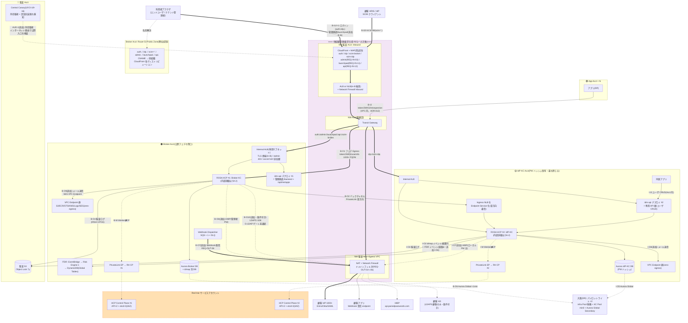
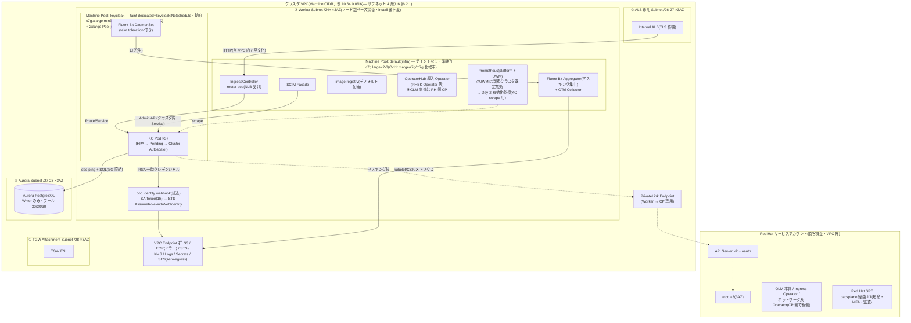

# U6 付属: ネットワークフロー詳細図(基本設計時点)

作成: 2026-07-24 / 前提: [01 Baseline v1](01-architecture-baseline.md) + [06 U6 v1.4](06-infra-network-design.md) / 出典: ユーザー検討(フロー表 B-*/I-* 系)+ 抜けチェック(§A.3)
ステータス: Draft v1(mermaid 版。drawio 清書は別タスク)

## A.0 本書の位置づけ

U6 §6.1.1 の簡略図を、**入口・出口の全フロー(ID 付き)** と **ROSA HCP クラスタ内部** の 2 レベルに詳細化する。作図前提:

- **O-10 は案 B(zero-egress)前提で作図**: クラスタ VPC に NAT を置かず、①運用系(registry/STS 等)= VPC Endpoint 群で VPC 内完結 ②外向き(フェデ等)= TGW → 他組織 Egress VPC(NAT + NFW)。正式クローズは先方 TGW 接続可否確認後(U6 §6.8.1 O-10)
- 名前解決: **弊社(Broker Acct)の Route 53 Public Hosted Zone** で `auth./idp./scim-broker./scim-idp./admin./launchpad./api.` の CNAME(Alias)を**他組織 CloudFront のディストリビューションドメインに向ける**。DNS は弊社統制・エッジ実体は他組織という分担(REQ-OUT-04 の Resolver 整合と対)

## A.1 全体構成図(全フロー ID 付き)

凡例: 太線 = 公開経路(入口/宛先がインターネット)/ 細線 = 私設(弊社 Acct 内・Acct 間)/ 点線 = 管理系・監視・条件付き。`(追加)` = 元表に無かった抜け候補(§A.3)。

## A.2 ROSA HCP クラスタ内部詳細(Broker/IdP-KC 共通、差分は §A.2.2)

**この粒度の図は本書が初出**(U6 §6.1.1 はアカウントレベル、doc/common/drawio は EKS 前提で未改版)。

### A.2.1 クラスタ内 IP レンジ(OVN-Kubernetes)

| レンジ | 既定値(HCP) | 備考 |
|--------|------------|------|
| Machine CIDR | クラスタ VPC の CIDR | サブネット 4 層(U6 §6.2.1)。**install 後変更不可** |
| **Pod CIDR** | `10.128.0.0/14`(hostPrefix /23 → **ノードあたり 510 Pod IP**、公式文言) | OVN のオーバーレイ。**VPC 外に露出しない**が、Machine/Service CIDR・社内 NW・顧客 AD 系と重複禁止。**実効 Pod 密度は kubelet の maxPods 既定 250 で頭打ち**(/23 は余裕枠。HCP のテスト済み上限もノードあたり 250 Pod、2026-07-24 検証追記) |
| Service CIDR | `172.30.0.0/16` | クラスタ内仮想 IP。同上の重複禁止 |
| **OVN 内部予約レンジ(2026-07-24 検証追記)** | `100.64.0.0/16`(join)/ `100.88.0.0/16`(transit)/ `169.254.0.0/17`(masquerade、4.17+)/ **`172.20.0.1`(HCP 内部 K8s API 静的アドレス)** | これらも社内 NW・顧客 AD 系と**重複禁止**(公式 IMPORTANT)。**顧客側が CGN 帯 100.64.0.0/10 を使うケースは実在**するため、顧客オンボーディング時の CIDR 照会項目に含める |
| 採番の含意 | — | Worker サブネットは **Pod 数でなくノード数**で採番すれば足りる(Pod IP はオーバーレイ側)。Broker/IdP-KC 両クラスタで既定値をそのまま使っても衝突しない(オーバーレイは独立)が、**将来の submariner/直接ルーティング余地を残すなら両クラスタで Pod/Service CIDR をずらす**(未決 → U6 O 項目へ) |

### A.2.1b クラスタ内通信の原則(2026-07-24 公式検証で明文化)

- **⚠ private NLB のヘアピン制限**(公式トラブルシューティング): NLB のクライアント IP 保持により、**router pod と同一ノード上のワークロードから、その router を受ける private NLB への通信が失敗しうる**。infra Pool には router pod と SCIM Facade / Aggregator が同居するため、**同一クラスタ内のコンポーネント間通信は外部 FQDN(NLB 経由)を使わず、クラスタ内 Service 経由を原則とする**(§A.2 図の「FAC → KC はクラスタ内 Service」はこの原則の適用)。
- ファクトチェック実施(2026-07-24、公式一次資料 16 項目): ❌ 1 件(OLM 配置 → 修正済み)、⚠ 5 件(レプリカ≥2 条件 / SA Token 表現 / 追加 IC の顧客管理扱い / ローリング既定値 maxSurge=1・maxUnavailable=0 と drain 猶予 / UWM 既定無効)— いずれも本書と U6 v1.5 に反映済み。主要出典は U6 v1.5 改訂履歴参照。

### A.2.2 Broker / IdP-KC の内部差分

| 観点 | Broker #1 | IdP-KC #2 |
|------|-----------|-----------|
| KC Pool max | 9(署名系 CPU) | 18(Argon2id 支配、フェデ比率感度) |
| 外向き(インターネット) | **重い**: B-O1 フェデ 1000+ FQDN + B-O7 Webhook + B-O8 HIBP | **HIBP(I-O7)と SES のみ**(外部 IdP へフェデしない) |
| 追加コンポーネント | idm-api #1(管理画面 Backend)/ ITDR / Webhook Dispatcher | idm-api #2(専用 API 層)/ 同居アプリ |
| PrivateLink | IdP-KC への **送信側**(Endpoint) | Ingress NLB を **Endpoint Service 化して着信のみ**(逆流不能) |
| DB | Broker DB + **idmap 別 DB** | IdP-KC DB(**PW ハッシュ**) |

## A.3 抜けチェック結果(元表に無かったフロー 8 系統)

元表(B-I1〜B-O6 / I-I1〜I-O5)は 10 冊と概ね整合。以下が**追加候補**(図には `(追加)` で反映済み):

| # | フロー | 内容 | 根拠 |
|---|--------|------|------|
| B-I6 | **管理画面 SPA / launchpad / idm-api 公開入口** | テナント管理者 → CF(admin. REQ-IN-03)→ idm-api #1。launchpad SPA 配信(REQ-IN-11)+ `GET /api/me/apps`(REQ-IN-12)+ **Sorry SPA(/sorry)** も同系 | U10 D-U10-08、U4 D-U4-06/07 |
| B-O7 | **Webhook 配信** | Dispatcher(SQS+λ)→ 顧客アプリ endpoint。**REQ-OUT-06(送信元が KC Pod でない別枠)** | U10 D-U10-11 |
| B-O8 / I-O7 | **HIBP Egress** | `api.pwnedpasswords.com`(k-Anonymity・fail-open)。**IdP-KC が主利用者** — 「IdP-KC は外向きほぼ無し」の重要な例外(REQ-OUT-01 の送信元スコープ拡張要求済み) | U7 §7.2.2 |
| B-O9 / I-O8 | **メール送信(SES)** | 招待・PW リセット・MFA 登録・侵害通知テンプレート(U4 §4.3)。SES VPC Endpoint 経由なら zero-egress 維持。**SES サンドボックス解除・SPF/DKIM(Route 53)が未設計 → U6/U9 未決に追加すべき** | U4/U7 |
| I-O6 | **ITDR イベント(経路 6)** | IdP-KC → Broker EventBridge PutEvents。元表 B-I4 は idmap(経路 5)のみで **ITDR 用の経路 6 が漏れ** | U6 D-U6-02 6 経路、U7 D-U7-04 |
| B-O10 | **LDAPS(条件付き)** | 顧客 AD へ TCP:636(REQ-OUT 付帯 3 ルール)。**G-LDAP(B-SCIM-13)ゲート未通過のため点線** | ADR-025 §H、ADR-039 §F.1.A |
| AUD-1 | **Central Canary 外形監視** | 監査 Acct → インターネット経由で公開入口(auth. 等)を合成ログイン検査 + `canary-central-readonly` Client | U9 D-U9-16 |
| DNS 系 | **Route 53 の 3 役割の明示** | ① Public Zone: CNAME → 他組織 CF(弊社統制)② PHZ: Acct 内内部名 ③ **Resolver: NFW の FQDN 評価と同一解決系(REQ-OUT-04)** | U6 §6.7.3 |

補足(元表への軽微な指摘):
- **ServiceNow(CL-SN-01)**: サーバ間通信は不要(SAML POST binding はブラウザ経由)のため B-I1 の変種として扱えば足りる。別フロー不要と判断
- **B-O5/I-O4 の「Zero-egress」表記**: O-10 の正式クローズ前のため「案 B 前提」と注記(§A.0)

## A.4 未決事項(本書発)

| # | 内容 | 引き渡し先 |
|---|------|-----------|
| A6a-1 | SES 送信設計(サンドボックス解除 / SPF/DKIM / 送信ドメイン `no-reply@` の Zone 登録) | U6/U9 |
| A6a-2 | 両クラスタの Pod/Service CIDR をずらすか(既定値共用で衝突はしないが将来の直接ルーティング余地) | U6 O 項目 |
| A6a-3 | Canary の送信元(監査 Acct)からの外形監視経路が他組織 WAF の Bot 対策(REQ-IN-01)に誤検知されない除外合意 | U9/REQ 追補 |
| A6a-4 | drawio 清書(本書 mermaid → AWS アイコン版、doc/common/drawio の EKS 旧図の置換) | 別タスク |

## 改訂履歴

- 2026-07-24: 初版。ユーザー提供のフロー表(B-*/I-* 系)を全量反映 + 抜け 8 系統を追加 + ROSA 内部詳細図(初出)+ OVN IP レンジ表。
- 2026-07-24 (v1.1): **公式ドキュメント・ファクトチェック反映**(16 項目検証、❌1 + ⚠5)— OLM 本体は RH 側 CP(Worker は導入 Operator のみ)/ SRE=backplane JIT(break-glass は顧客側機能の名称)/ UWM 新規クラスタ既定無効 → Day-2 有効化必須 / maxPods 250 追記 / OVN 内部予約レンジ(100.64/16・100.88/16・169.254/17・172.20.0.1)追加 / **NLB ヘアピン制限とクラスタ内 Service 原則の明文化(§A.2.1b)**。
