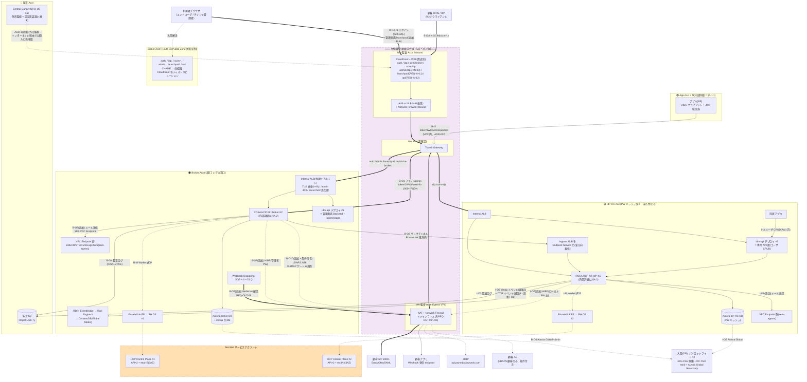
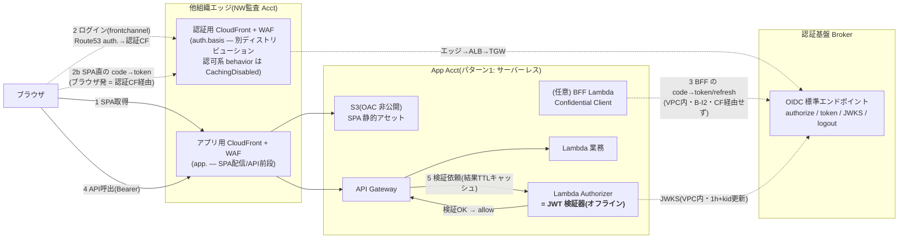
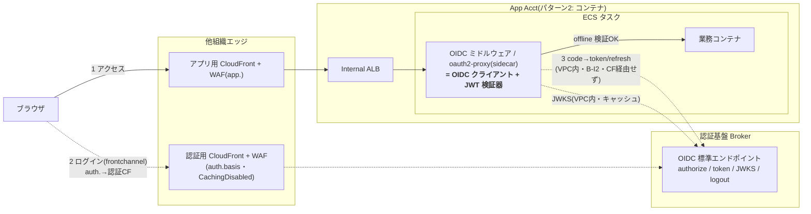
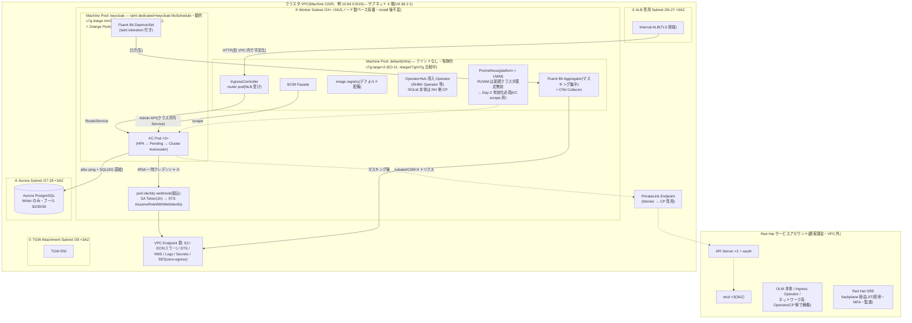
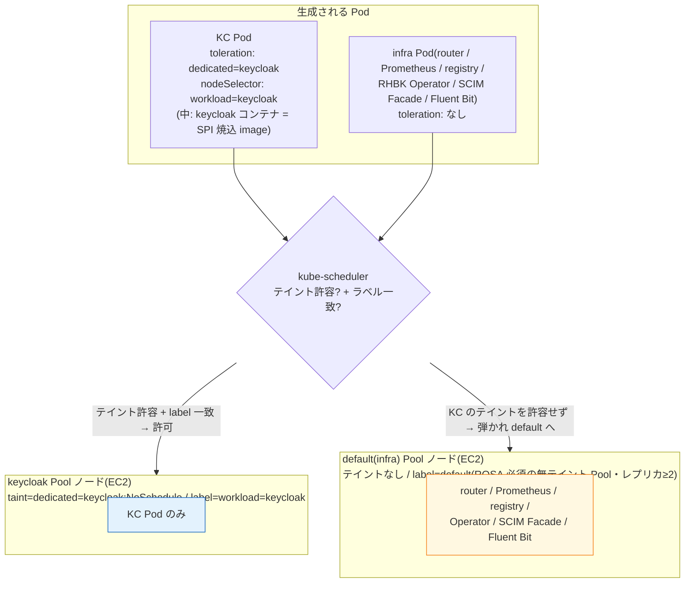
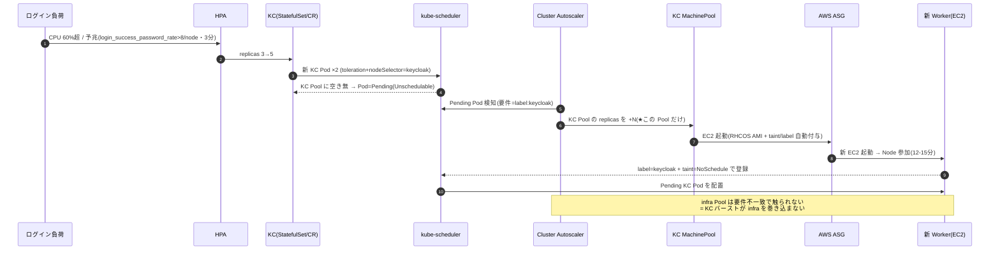
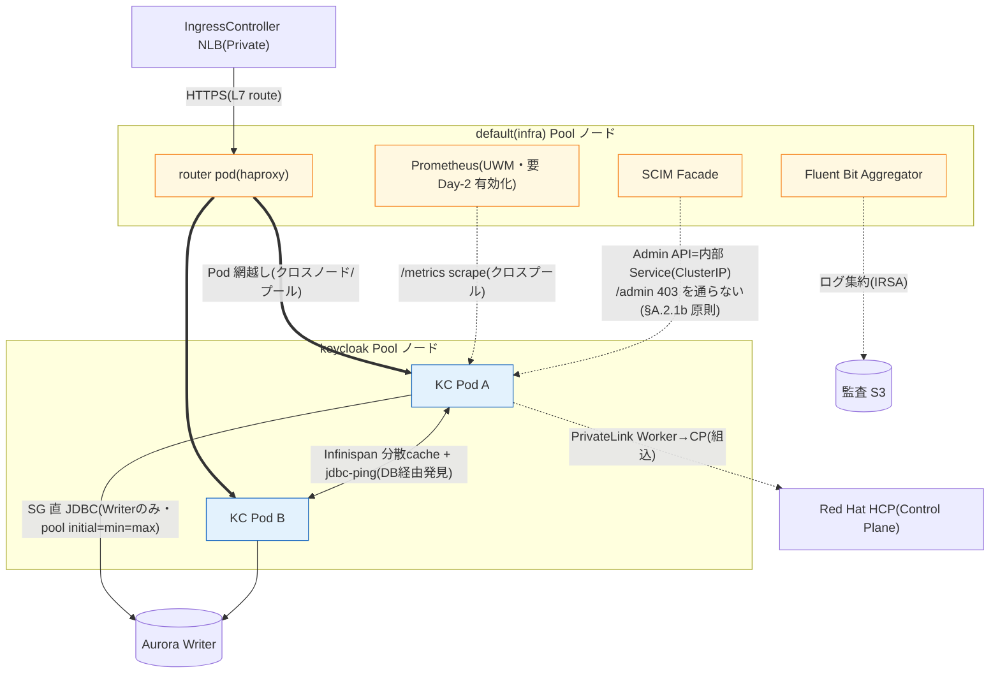
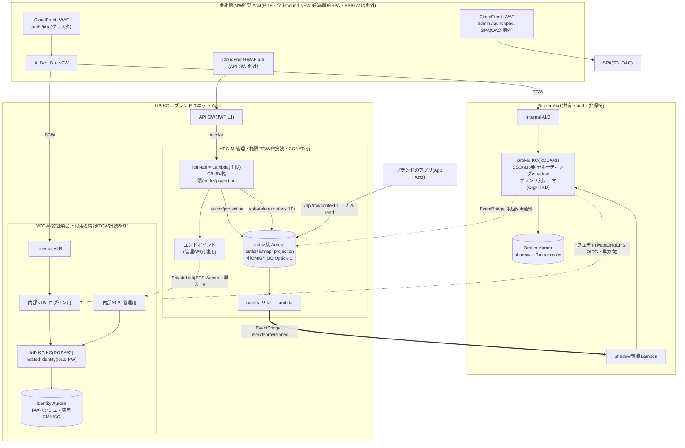

# U6 付属: ネットワークフロー詳細図(基本設計時点)

作成: 2026-07-24 / 前提: [01 Baseline v1](01-architecture-baseline.md) + [06 U6 v1.4](06-infra-network-design.md) / 出典: ユーザー検討(フロー表 B-*/I-* 系)+ 抜けチェック(§A.3)
ステータス: Draft v1(mermaid 版。drawio 清書は別タスク)

## A.0 本書の位置づけ

> **【現行トポロジの SSOT = [§A.6](#a6-アカウント別-詳細構成broker--idp-kc-ブランド2026-08-07-新設)】** §A.1 の全体図のみ初期トポロジ（旧「中央 front door / 管理画面 Backend」・IdP-KC「同居アプリ」）の表記を履歴として残す。**現行呼称に統一（2026-08-18）: 管理コントロールプレーン = `idm-api`（ブランド管理 API・ブランド側が CRUD/権限/authz/projection の実体）＋ `shadow 制御 Lambda`（中央 Broker・遮断のみ）。旧「idm-api #1／#2」番号は撤去**（ADR-062 Lambda / ADR-063 ブランド主役 / ADR-064 削除 outbox）。§A.1 の全体図に残る旧表記は本注記で読み替えること（`ROSA #1/#2` はクラスタ番号で別物）。

U6 §6.1.1 の簡略図を、**入口・出口の全フロー(ID 付き)** と **ROSA HCP クラスタ内部** の 2 レベルに詳細化する。作図前提:

- **O-10 は案 B(zero-egress)前提で作図**: クラスタ VPC に NAT を置かず、①運用系(registry/STS 等)= VPC Endpoint 群で VPC 内完結 ②外向き(フェデ等)= TGW → 他組織 Egress VPC(NAT + NFW)。正式クローズは先方 TGW 接続可否確認後(U6 §6.8.1 O-10)
- 名前解決: **弊社(Broker Acct)の Route 53 Public Hosted Zone** で `auth./idp./scim-broker./scim-idp./admin./launchpad./api.` の CNAME(Alias)を**他組織 CloudFront のディストリビューションドメインに向ける**。DNS は弊社統制・エッジ実体は他組織という分担(REQ-OUT-04 の Resolver 整合と対)

## A.1 全体構成図(全フロー ID 付き)


```mermaid
flowchart TB
  %% ============ 外部 ============
  USER["利用者ブラウザ<br/>(エンドユーザ / テナント管理者)"]
  CIDP["顧客 IdP 1000+<br/>Entra/Okta/SAML"]
  HRIS["顧客 HRIS / IdP<br/>SCIM クライアント"]
  CAPP["顧客アプリ<br/>Webhook 受信 endpoint"]
  HIBP["HIBP<br/>api.pwnedpasswords.com"]
  CAD["顧客 AD<br/>(LDAPS 顧客のみ・条件付き)"]

  %% ============ DNS ============
  subgraph DNSZ["Broker Acct: Route 53 Public Zone(弊社統制)"]
    R53["auth. / idp. / scim-*. / admin. / launchpad. / api.<br/>CNAME → 他組織 CloudFront 各ディストリビューション"]
  end

  %% ============ 他組織 ============
  subgraph OTHER["═══ 他組織管理(要求仕様 REQ-* の対象)═══"]
    subgraph NAIN["NW 監査 Acct: Inbound"]
      CF["CloudFront + WAF(用途別)<br/>auth / idp / scim-broker / scim-idp<br/>admin(REQ-IN-03) / launchpad(REQ-IN-11) / api(REQ-IN-12)"]
      EDGE["ALB or NLB(In-B 推奨)<br/>+ Network Firewall Inbound"]
    end
    subgraph NAOUT["NW 監査 Acct: Egress VPC"]
      NFWO["NAT + Network Firewall<br/>ドメインフィルタ(REQ-OUT-01〜06)"]
    end
    subgraph NWA["NW Acct(要確認)"]
      TGW["Transit Gateway"]
    end
  end

  %% ============ Red Hat ============
  subgraph RH["Red Hat サービスアカウント"]
    CP1["HCP Control Plane #1<br/>API×2 + etcd×3(3AZ)"]
    CP2["HCP Control Plane #2<br/>API×2 + etcd×3(3AZ)"]
  end

  %% ============ Broker Acct ============
  subgraph BRK["🟠 Broker Acct(公開フェデの窓口)"]
    BALB["Internal ALB(専用サブネット)<br/>TLS 終端(In-B) / /admin 403 / secret hdr=追加層"]
    BKC["ROSA HCP #1: Broker KC<br/>(内部詳細は §A.2)"]
    BAPI["idm-api デプロイ #1<br/>= 管理画面 Backend + /api/me/apps"]
    BITDR["ITDR: EventBridge → Risk Engine λ<br/>→ DynamoDB(Global Tables)"]
    BWH["Webhook Dispatcher<br/>SQS + λ + DLQ"]
    BAUR[("Aurora Broker DB<br/>+ idmap 別 DB")]
    BPL["PrivateLink EP → RH CP #1"]
    BVPCE["VPC Endpoint 群<br/>S3/ECR/STS/KMS/Logs/SES(zero-egress)"]
  end

  %% ============ IdP-KC Acct ============
  subgraph IKC["🟡 IdP-KC Acct(PW ハッシュ保有・最も閉じる)"]
    IALB["Internal ALB"]
    IES["Ingress NLB を<br/>Endpoint Service 化(単方向着信)"]
    IKCP["ROSA HCP #2: IdP-KC<br/>(内部詳細は §A.2)"]
    IAPI["idm-api デプロイ #2<br/>= 専用 API 層(ユーザ CRUD)"]
    APPC["同居アプリ"]
    IAUR[("Aurora IdP-KC DB<br/>(PW ハッシュ)")]
    IPL["PrivateLink EP → RH CP #2"]
    IVPCE["VPC Endpoint 群(zero-egress)"]
  end

  %% ============ 監査 / App / 大阪 ============
  subgraph AUD["🔵 監査 Acct"]
    S3A[("監査 S3<br/>Object Lock 7y")]
    CAN["Central Canary(U9 D-U9-16)<br/>外形監視 + 認証実装漏れ検知"]
  end
  subgraph APPA["🟢 App Acct × N(内部詳細 = §A.1.1)"]
    RP["アプリ(RP)<br/>OIDC クライアント + JWT 検証器"]
  end
  OSA["大阪(DR): パイロットライト ×2<br/>infra Pool 稼働 + KC Pool min0 + Aurora Global Secondary"]

  %% ============ フロー(Inbound 公開) ============
  USER -.->|"名前解決"| R53
  USER ==>|"B-I1/I-I1 ログイン(auth./idp.)<br/>+ 管理画面/launchpad(追加 B-I6)"| CF
  CF ==> EDGE ==> TGW
  TGW ==>|"auth./admin./launchpad./api./scim-broker."| BALB
  TGW ==>|"idp./scim-idp."| IALB
  HRIS ==>|"B-I3/I-I4 SCIM(scim-*.)"| CF
  BALB --> BKC
  BALB --> BAPI
  IALB --> IKCP
  IALB --> IAPI

  %% ============ フロー(私設) ============
  RP -->|"B-I2 token/JWKS/introspection<br/>(VPC 内、ADR-012)"| TGW
  BKC -->|"B-O2 バックチャネル<br/>PrivateLink 単方向"| IES --> IKCP
  APPC -->|"I-I3 ユーザ CRUD(Acct 内)"| IAPI --> IKCP
  IKCP -->|"I-O2 idmap イベント(経路5)<br/>+ ITDR イベント(経路6・追加 I-O6)"| BITDR
  BKC --> BAUR
  IKCP --> IAUR
  BKC -->|"B-O4 監査ログ(IRSA+VPCE)"| S3A
  IKCP -->|"I-O3 監査ログ"| S3A
  BWH ==>|"B-O7(追加) Webhook 配信<br/>REQ-OUT-06"| NFWO --> CAPP
  CAN -.->|"AUD-1(追加) 外形監視<br/>インターネット経由で公開入口を検査"| CF

  %% ============ フロー(Outbound 公開) ============
  BKC ==>|"B-O1 フェデ Egress<br/>token/JWKS/userinfo 1000+ FQDN"| TGW
  TGW ==> NFWO ==> CIDP
  BKC -.->|"B-O8(追加) HIBP(管理者 PW)"| NFWO
  IKCP -.->|"I-O7(追加) HIBP(ローカル PW 主)"| NFWO
  NFWO -.-> HIBP
  BKC -.->|"B-O10(追加・条件付き) LDAPS :636<br/>G-LDAP ゲート未通過"| NFWO -.-> CAD
  BKC -->|"B-O9(追加) メール送信<br/>SES VPC Endpoint"| BVPCE
  IKCP -->|"I-O8(追加) メール送信"| IVPCE

  %% ============ 管理系 ============
  BKC -.->|"B-M Worker⇄CP"| BPL -.-> CP1
  IKCP -.->|"I-M Worker⇄CP"| IPL -.-> CP2
  BAUR -.->|"B-O6 Aurora Global <1min"| OSA
  IAUR -.->|"I-O5 Aurora Global"| OSA

  classDef pub fill:#ffebee,stroke:#c62828
  classDef other fill:#f3e5f5,stroke:#7b1fa2,stroke-dasharray: 5 5
  classDef rh fill:#ffe0b2,stroke:#e65100,stroke-dasharray: 3 3
  class OTHER other
  class RH rh
```

凡例: 太線 = 公開経路(入口/宛先がインターネット)/ 細線 = 私設(弊社 Acct 内・Acct 間)/ 点線 = 管理系・監視・条件付き。`(追加)` = 元表に無かった抜け候補(§A.3)。

## A.1.1 アプリ側(RP)の構成 2 パターンと認証基盤への接続(2026-07-28 追記)

§A.1 の `App Acct × N` の中身を詳細化する。**最重要の原則**を先に述べる:

> **認証基盤(Broker)は「OIDC の標準エンドポイント群」を提供するだけ**である — `authorize`(ログイン画面) / `token`(コード→トークン交換・リフレッシュ) / `JWKS`(署名検証用の公開鍵) / `logout` / `userinfo`。**各アプリは "RP(Relying Party)" を自分側に持つ**。RP は 2 つの部品からなる:
> 1. **OIDC クライアント**(ログインのリダイレクトとトークン交換を行う。SPA なら Public Client + PKCE、サーバーサイドなら Confidential Client = BFF)
> 2. **JWT 検証器**(API 呼び出しごとにトークンを検証する。**オフライン検証** = キャッシュした JWKS で署名・`iss`/`aud`/`exp`/`tenant_id` をローカル確認)
>
> **認証基盤はリクエスト毎の経路には立たない**(**JWT=JWS のオフライン検証を採る限り**。opaque token + Introspection〔RFC 7662〕やリアルタイム失効が要る場合はオンライン=per-request 経路になる → 後述の Phase 3 で退避)。JWT 検証はアプリ側でオフライン完結し(RFC 9068 §4: 署名を JWKS 公開鍵で検証 + `iss`/`aud`/`exp` をローカル確認)、認証基盤を叩くのは (a) ログイン時 (b) JWKS の更新(**既定 1h キャッシュ + `kid` 不一致〔鍵ローテーション〕時に即時リフレッシュ** — AWS ベストプラクティス、[ADR-012](../adr/012-vpc-lambda-authorizer-internal-jwks.md) の VPC 内経路)だけ。「毎回認証基盤に問い合わせる」構成ではない。

### パターン 1: CloudFront + WAF + S3 / API Gateway + Lambda(サーバーレス)


```mermaid
flowchart LR
  U["ブラウザ"]
  subgraph EDGE["他組織エッジ(NW監査 Acct)"]
    CFA["アプリ用 CloudFront + WAF<br/>(app. — SPA配信/API前段)"]
    ACF["認証用 CloudFront + WAF<br/>(auth.basis — 別ディストリビューション<br/>認可系 behavior は CachingDisabled)"]
  end
  subgraph AUTH["認証基盤 Broker"]
    AZ["OIDC 標準エンドポイント<br/>authorize / token / JWKS / logout"]
  end
  subgraph APP["App Acct(パターン1: サーバーレス)"]
    S3["S3(OAC 非公開)<br/>SPA 静的アセット"]
    APIGW["API Gateway"]
    LAUTH["Lambda Authorizer<br/><b>= JWT 検証器(オフライン)</b>"]
    LBIZ["Lambda 業務"]
    BFF["(任意) BFF Lambda<br/>Confidential Client"]
  end
  U -->|"1 SPA取得"| CFA --> S3
  U -.->|"2 ログイン(frontchannel)<br/>Route53 auth.→認証CF"| ACF -.->|"エッジ→ALB→TGW"| AZ
  U -.->|"2b SPA直の code→token<br/>(ブラウザ発 = 認証CF経由)"| ACF
  BFF -.->|"3 BFF の code→token/refresh<br/>(VPC内・B-I2・CF経由せず)"| AZ
  U -->|"4 API呼出(Bearer)"| CFA --> APIGW
  APIGW -->|"5 検証依頼(結果TTLキャッシュ)"| LAUTH
  LAUTH -.->|"JWKS(VPC内・1h+kid更新)"| AZ
  LAUTH -->|"検証OK → allow"| APIGW --> LBIZ
```

- **SPA 直(BFF なし)の場合**: BFF Lambda を置かず、SPA(ブラウザ) が Public Client + PKCE でログイン〜`code→token` 交換を**ブラウザからインターネット経由(公開 token エンドポイント)**で行う。トークンは SPA メモリ保持。API 検証は同じく Lambda Authorizer。
- **BFF ありの場合(業務・機密アプリで推奨)**: BFF Lambda が Confidential Client として `code→token` を**サーバーサイド(VPC 内経路 B-I2)**で行い、ブラウザにはアプリセッション Cookie のみ渡す(トークンをブラウザに置かない)。根拠 = IETF OAuth WG 現行ベストプラクティス [OAuth 2.0 for Browser-Based Apps](https://www.ietf.org/archive/id/draft-ietf-oauth-browser-based-apps-26.html)〔RFC 未確定の Internet-Draft〕§6.1: 「strongly recommended for business applications, sensitive applications, and applications that handle personal data」。SPA 直(Public Client)は PKCE 必須。

### パターン 2: LB(ALB) + ECS(コンテナ)


```mermaid
flowchart LR
  U["ブラウザ"]
  subgraph EDGE["他組織エッジ"]
    CFB["アプリ用 CloudFront + WAF(app.)"]
    ACF2["認証用 CloudFront + WAF<br/>(auth.basis・CachingDisabled)"]
  end
  subgraph AUTH["認証基盤 Broker"]
    AZ2["OIDC 標準エンドポイント<br/>authorize / token / JWKS / logout"]
  end
  subgraph APP2["App Acct(パターン2: コンテナ)"]
    ALB["Internal ALB"]
    subgraph ECS["ECS タスク"]
      MW["OIDC ミドルウェア / oauth2-proxy(sidecar)<br/><b>= OIDC クライアント + JWT 検証器</b>"]
      BIZ["業務コンテナ"]
    end
  end
  U -->|"1 アクセス"| CFB --> ALB --> MW
  U -.->|"2 ログイン(frontchannel)<br/>auth.→認証CF"| ACF2 -.-> AZ2
  MW -.->|"3 code→token/refresh<br/>(VPC内・B-I2・CF経由せず)"| AZ2
  MW -.->|"JWKS(VPC内・キャッシュ)"| AZ2
  MW -->|"offline 検証OK"| BIZ
```

- ECS アプリは **OIDC ミドルウェア**(言語フレームワークのライブラリ)or **oauth2-proxy 等の sidecar/リバースプロキシ**で「ログイン(OIDC クライアント)」と「毎リクエストの JWT 検証(オフライン)」の両方を担う。API Gateway / Lambda Authorizer は使わず、**検証はアプリ内(またはサイドカー)**で行う。
- 内部マイクロサービス間の伝播が必要なら Token Exchange(RFC 8693、[U5 §5.3](05-token-session-authz-design.md))を Broker に要求する経路が加わる。

### フロントチャネル(ログイン)は「認証用 CloudFront」を通る(2026-07-28 追記)

図の「ログイン(frontchannel)」の線は **Broker に直結ではなく、認証用 CloudFront(auth.basis) を経由**する。整理すると経路は **発生元** で 2 分される:

| トラフィック | 発生元 | 経路 |
|---|---|---|
| ログイン(authorize/login)/ SPA 直の `code→token` / SPA 直の logout | **ブラウザ発** | **認証用 CloudFront(auth.basis)** → エッジ(ALB/NLB)→ TGW → Broker |
| BFF の `code→token`/refresh / Lambda Authorizer・ミドルウェアの JWKS 取得 / idm-api | **サーバー発** | **VPC 内(B-I2、[ADR-012](../adr/012-vpc-lambda-authorizer-internal-jwks.md))・CloudFront は経由しない** |

- **Route53 で `auth.basis` を認証用 CloudFront のドメインに CNAME(Alias)するのは合理的**([§A.0](#a0-本書の位置づけ) の DNS 方針どおり)。理由: ① DNS は弊社(Broker Acct Route53)統制・エッジ実体は他組織(P-18 の分担と一致)② **auth. は全アプリ共通の単一ドメイン**(SSO Cookie ドメインの一貫性・アプリごとに認証ドメインが割れない)③ WAF / Shield / TLS 終端 / ログイン Theme 静的アセットのキャッシュをエッジで得られる。Auth0/Okta 等も認証エンドポイントを CDN 前段に置く標準構成。
- ⚠ **認証用 CloudFront は各アプリの CloudFront とは別ディストリビューション**。かつ **authorize/token 等の動的レスポンスは必ず `CachingDisabled`(または `UseOriginCacheControlHeaders`)の behavior を割り当てる** — `CachingOptimized` 等 min TTL>0 のポリシーは `Cache-Control: no-store` を無視して最低 TTL 分キャッシュし、**認可コード/トークンのキャッシュ漏洩**という重大事故になり得る([CloudFront managed cache policies](https://docs.aws.amazon.com/AmazonCloudFront/latest/DeveloperGuide/using-managed-cache-policies.html) の CachingDisabled 警告)。
- ⚠ **CloudFront 前段によりオリジンから見た送信元 IP が CloudFront IP になる**(`X-Forwarded-For` 参照が必要)。IdP 側の IP ベース制御・レート制御・監査ログの送信元 IP 記録に影響するため、認証系の proxy-headers / XFF 信頼チェーン(U6 §6.7.2 In-B と同じ論点)を確認する。

### 「認証基盤に来るもの」= 役割・エンドポイント・頻度(両パターン共通)

| # | 何が来るか(呼ぶ側) | 役割 | 叩く先 | 経路 | 頻度 |
|---|---|---|---|---|---|
| 1 | **ブラウザ** | ユーザ認証(ログイン画面) | `authorize` / login | **認証用 CloudFront(auth.basis)経由**(他組織エッジ、frontchannel) | ログイン時のみ |
| 2 | **BFF / ECS ミドルウェア**(= OIDC クライアント) | コード→トークン交換・リフレッシュ | `token` | **BFF/サーバー発 = VPC 内(B-I2)・CF 経由せず。SPA 直(ブラウザ発)は認証用 CloudFront 経由** | ログイン / リフレッシュ時 |
| 3 | **Lambda Authorizer / ECS ミドルウェア**(= JWT 検証器) | 署名検証用の公開鍵取得 | `JWKS` | **VPC 内・1h キャッシュ + `kid` 不一致時更新(ADR-012)** | 定期(**リクエスト毎ではない**) |
| 4 | (任意) アプリ Backend | 組織コンテキスト / エンタイトルメント取得 | idm-api `/api/me/context`([U3 D3-16](03-identity-provisioning-design.md)) | VPC 内 | 認可判断時(短 TTL キャッシュ可) |

→ **JWT の検証そのもの(iss/aud/exp/tenant_id/署名)はアプリ側でオフライン完結**し、この表の 1〜4 のどれも「リクエスト毎に認証基盤を叩く」ものではない。認証基盤は per-request の経路に立たない(= スケール・可用性のボトルネックにならない)。

### 「Lambda Authorizer なのか認証アプリなのか」への回答

- **Lambda Authorizer は "アプリ側の JWT 検証器"** であって「認証基盤が各アプリのために動かす認証アプリ」ではない([AWS 公式](https://docs.aws.amazon.com/apigateway/latest/developerguide/apigateway-use-lambda-authorizer.html): 「Use a Lambda authorizer to implement a custom authorization scheme」)。**オフライン検証**(キャッシュ JWKS + クレーム検証)を行い、認証基盤(JWKS)へ行くのは JWKS キャッシュミス時のみ。**キャッシュは 2 段で別物** — ① API Gateway の**認可結果キャッシュ**(`authorizerResultTtlInSeconds`、既定 300s / 最大 3600s)② Lambda 内の **JWKS キャッシュ**(署名鍵)。①の TTL 期間中は Lambda が再呼出されず**トークン失効・改ざん検知が遅延**するため、短 TTL(や TOKEN でなく REQUEST authorizer)を選ぶ。認証基盤へ毎回問い合わせているわけではない。
- **認証基盤側にアプリごとの "認証アプリ" は存在しない**。認証基盤は標準 OIDC エンドポイントを提供するだけで、RP(OIDC クライアント + 検証器)は各 App Acct 側の実装。検証器の実体がパターン 1 では Lambda Authorizer、パターン 2 では ECS の OIDC ミドルウェア / oauth2-proxy sidecar、という違いだけ。
- リアルタイム失効(退職者即遮断)が要る規制ケースのみ、Phase 3 で **API GW での Token Introspection**(オンライン検証)を選択肢に加える([U5 §5.2.4 Z-4](05-token-session-authz-design.md))。Phase 1 はオフライン検証 + 短 TTL が既定。
- RP 実装の必須事項(state+PKCE / Bearer 検証 / aud・tenant_id 検証 / リフレッシュ実装 / Back-Channel Logout 受信)は [U5 §5.6 RP 実装ガイド](05-token-session-authz-design.md)、認証実装漏れの検知は [Central Canary(ADR-059 / U9 §9.8)](09-operations-observability-design.md)。

### アプリ inbound と Network Firewall の関係(静的/API の経路分離、2026-07-28 追記・公式検証済み)

「CloudFront + WAF → Network Firewall → NLB/ALB → S3/API GW」を検討する際の**構造的制約**を明記する。

**前提**: **Network Firewall は VPC のルートテーブルで firewall endpoint に向けた通信のみ検査する**([AWS 公式](https://docs.aws.amazon.com/network-firewall/latest/developerguide/how-it-works.html): 「you modify your Amazon VPC route tables to send your network traffic through the Network Firewall firewall endpoints」)。**S3 / パブリック API Gateway は VPC 外のマネージドサービス**なので、CloudFront→S3/APIGW の通信は既定では VPC を通らず NFW 経路外。

**難所 = 「LB → S3/APIGW」は native 接続できない**: **ALB/NLB のターゲットは instance/IP/Lambda(ALB)・instance/IP/ALB(NLB)で、S3 は target type に存在しない**([ALB 公式](https://docs.aws.amazon.com/elasticloadbalancing/latest/application/load-balancer-target-groups.html))。よって:

| 対象 | LB 経由で NFW に通せるか | 方法 |
|---|---|---|
| **API Gateway** | ✅ 可能 | **Private API 化**(execute-api Interface Endpoint)→ その **ENI IP を ALB の IP ターゲット**に登録([AWS 公式ブログ](https://aws.amazon.com/blogs/compute/accessing-private-amazon-api-gateway-endpoints-through-custom-amazon-cloudfront-distribution-using-vpc-origins/))。⚠ **ENI IP は固定でなく Lambda カスタムリソース等で動的追従が必要** |
| **S3 静的** | ⚠ プロキシ必須 | ALB → **プロキシ(ECS/nginx or Lambda)** → S3(エンドポイント経由)。静的配信のために常時稼働層が増え、サーバーレスの旨味が消える |

**推奨 = リスクで経路を分ける(全部を NFW に通さない)**:

| 通信 | 経路 | 根拠 |
|---|---|---|
| **静的 SPA(S3)** | CloudFront + WAF + **OAC**(NFW 経路外) | 公開読み取り専用の静的ファイルは低リスク。**S3 は LB 経由でなく OAC 直結が AWS 公式推奨**([OAC](https://docs.aws.amazon.com/AmazonCloudFront/latest/DeveloperGuide/private-content-restricting-access-to-s3.html))。**2026-08-06: 静的 SPA と API GW は NFW 通過必須の例外(組織確定、[U6 REQ-IN-12](06-infra-network-design.md))ゆえ OAC 直結で準拠**(launchpad./admin. SPA も同様) |
| **API(動的・機密)** | CloudFront →(VPC オリジン)監査 ALB → **NFW** → **Private API GW**(Interface Endpoint) | 検査したい本命だけ NFW に通す。CloudFront VPC origins でプライベート LB をオリジンにできる([2024 GA](https://docs.aws.amazon.com/AmazonCloudFront/latest/DeveloperGuide/private-content-vpc-origins.html)) |

⚠ **CloudFront VPC origins と NFW の共存**: VPC origins の CloudFront→オリジン通信を NFW 経路に載せるには **VPC ルートテーブル設計が別途必要**(VPC origins は **NACL 非評価** / **TLS リスナー付き NLB 不可**の仕様に注意)。「CloudFront→NFW→ALB」を素直に描くと、どのルートテーブルで firewall endpoint を通すかは実装時要検証(**O-APP-1 として U6 へ引き渡し**)。

⚠ **API GW を CloudFront 限定にする手段のレイヤ差**: マネージドプレフィックスリスト `com.amazonaws.global.cloudfront.origin-facing` は **SG/ルートテーブルで参照**するもので、**API GW リソースポリシー JSON 内では参照できない**。REST API のリソースポリシーで CloudFront に絞るなら**秘密ヘッダ検証(WAF/リソースポリシー)**または CloudFront IP レンジの `aws:SourceIp` 列挙を使う。

**P-18 の含意**: エッジ(CloudFront+WAF+NFW+LB)は他組織管理の監査 Acct のため、「監査 Acct の LB → 案件 Acct の Private API GW」には**他組織側へ VPC ピアリング/TGW + IP ターゲット追従の要求仕様(REQ-IN 追加)**が要る。静的 S3 を NFW に通す(プロキシ)より、上記の静的/API 分離が他組織依存も最小で素直。

> **⚠ 認証 ROSA パスにも同じ NFW ルート論点(2026-07-29 追記、[U6 REQ-IN-13](06-infra-network-design.md))**: 上記は app のサーバーレスパターンを例にしたが、**認証パス(CloudFront → エッジ LB + NFW → TGW → ROSA)にも「NFW は VPC ルート設計をしないと通らない」が同じく当てはまる**。むしろ P-18 の露出最小化志向でエッジ LB をプライベート(**VPC origins**)にする場合、**「VPC origins × NFW 共存」(管理 ENI 経由・NACL 非評価)は認証パスにこそ本命で効く**。ただし NFW は他組織(NW監査 Acct)の VPC 内にあり、そのルート設計は他組織の実装責任 → **CloudFront→エッジ LB の到達方式 + NFW ingress ルート設計を [U6 REQ-IN-13](06-infra-network-design.md) として要求仕様化**(In-A/In-B の TLS 終端位置とは別軸、[U6 §6.7.2](06-infra-network-design.md))。

**一次資料(2026-07-28 検証、6 主張すべて ✅)**:
- JWT オフライン検証(署名 + iss/aud/exp のローカル確認): [RFC 9068 §4](https://www.rfc-editor.org/rfc/rfc9068.html) / opaque は Introspection = オンライン [RFC 7662](https://www.rfc-editor.org/rfc/rfc7662.html)
- Lambda Authorizer はアプリ側実装 + 結果 TTL キャッシュ: [Use Lambda authorizers](https://docs.aws.amazon.com/apigateway/latest/developerguide/apigateway-use-lambda-authorizer.html) / [CreateAuthorizer(`authorizerResultTtlInSeconds` 既定 300 / 最大 3600)](https://docs.aws.amazon.com/apigateway/latest/api/API_CreateAuthorizer.html)
- JWKS はキャッシュ + kid 不一致時リフレッシュ(AWS ベストプラクティス): [Verifying a JWT (Cognito)](https://docs.aws.amazon.com/cognito/latest/developerguide/amazon-cognito-user-pools-using-tokens-verifying-a-jwt.html)
- BFF 推奨 + PKCE(IETF 現行 BCP、RFC 未確定): [OAuth 2.0 for Browser-Based Apps](https://www.ietf.org/archive/id/draft-ietf-oauth-browser-based-apps-26.html)
- oauth2-proxy = OIDC リバースプロキシ + ヘッダ注入 / Keycloak 対応: [oauth2-proxy 公式](https://oauth2-proxy.github.io/oauth2-proxy/) / [Keycloak OIDC provider](https://oauth2-proxy.github.io/oauth2-proxy/configuration/providers/keycloak_oidc/)
- Keycloak の OIDC エンドポイント群(auth/token/certs/logout/userinfo): [Keycloak Securing apps](https://www.keycloak.org/securing-apps/oidc-layers)

## A.1.2 App Acct 側 連携要件（集約チェックリスト、2026-07-30 新設）

各アプリチーム/顧客アプリが **App Acct 側で用意すべき事項の集約点**。コード面の詳細は [U5 §5.6](05-token-session-authz-design.md)、JWKS/Authorizer の VPC 判断は [ADR-012 R.3](../adr/012-vpc-lambda-authorizer-internal-jwks.md) を正とし、本節はネットワーク/接続を中心に横断整理する。将来 U5 §5.6 の「Basis Integration Guide（Phase 1 成果物）」へ昇格させる土台。

| 分類 | 必要事項 | 参照 |
|---|---|---|
| **A. 構成選択** | パターン 1（S3+APIGW+Lambda）or パターン 2（ALB+ECS、§A.1.1）。**BFF あり（推奨）or SPA-direct** の選択 | §A.1.1 |
| **B. ドメイン（選択の余地なし）** | **BFF/Authorizer/セッション Cookie は必ずアプリドメイン（ファーストパーティ）**。`auth.basis`（Broker）はログイン redirect + JWKS のみ触る。Cookie は HttpOnly + Secure + SameSite | Curity token-handler |
| **C. RP コード** | OIDC クライアント（`response_type=code` + state + nonce + PKCE、redirect_uri 完全一致）/ JWT 検証 6 点（ES256/JWKS、iss/aud/exp/azp/tenant_id）/ BFF は Confidential Client・トークンをブラウザに置かない / ログアウト（RT revoke・RP-Initiated・BFF は L4 Back-Channel 受信）/ 403 → Sorry redirect 規約 | **U5 §5.6** |
| **D. VPC 内/外（選択）** | **アプリのリソース依存 + Egress ポスチャで決める（認証では決めない）**。BFF はバックエンド前段のため VPC 内が多い / Authorizer は非 VPC or ネイティブ（API GW JWT / ALB OIDC）が既定 | **ADR-012 R.3** |
| **E. Broker への到達（重要）** | **バックチャネル（BFF の token 交換・Authorizer の JWKS）= Split-horizon DNS で `auth.basis` を内部 ALB に解決 + TGW で私設直通**。**外（Egress）へ出して公開エッジから入れ直さない（ヘアピン禁止）**。フロントチャネル（ブラウザ authorize）だけ公開 CloudFront 経由。`iss` はホスト名一貫・解決先のみ内外で分岐 | §A.1（B-I2）/ ADR-012 R.3 |
| **F. JWKS** | **公開（RP 側 1h ローカルキャッシュ + kid 不一致時 refetch）が既定**。Zero-egress アプリのみ私設（TGW / S3 ミラー）。ネイティブ authorizer は公開 JWKS 到達時のみ可 | ADR-012 R.3 |
| **G. DNS 配管** | App Acct VPC が `auth.basis` を**私設解決**できること（Broker Acct PHZ のクロスアカウント関連付け〔RAM〕or Route 53 Resolver ルール） | REQ-OUT-04 |
| **H. アプリ公開エッジ** | 静的 = CloudFront + WAF + S3（OAC）→ **NFW 経路外**（通せない・通す必要なし、WAF で防御）。API = 公開 API GW（WAF）or **Private API GW（VPC Endpoint 経由で NFW 経路に乗る、O-APP-1）** | §A.1.1 / O-APP-1 |
| **I. 前提確認（D/E/F の入力）** | ① App Acct → Broker Acct の **TGW 私設経路の有無** ② アプリが **Zero-egress か否か**（公開 JWKS/token に到達できるか） | — |

**要点**:
- **ドメイン（B）は必須要件**、**VPC（D）はアプリ都合の選択**、の 2 軸を混同しない。
- **E が今回の確定事項**：VPC 内 BFF でも **TGW 私設直通（split-horizon DNS）**で Broker に到達。**Egress→公開→インバウンドの往復（ヘアピン）はしない**。
- **認証を理由に VPC 内固定しない**（ADR-012 R.3）。Zero-egress アプリのみ E/F を私設化。

## A.1.3 Broker ⇄ IdP まわりの通信 経路まとめ（2026-08-25 新設）

**位置づけ**: 「Broker と IdP のやり取りが、どのノードから、どの経路で流れるか」の情報が §A.1 の図 / §A.2.2 の差分表 / [U6 §6.3](06-infra-network-design.md) / [02a §2.3](02a-broker-idpkc-federation.md) に分散していたため、**1 箇所で通して読める形に集約**する。**各項の決定そのものは各出典が SSOT**であり、本節は経路の見取り図。

### A.1.3.1 前提: Pod の通信は「ノードの IP」で出る

KC Pod は **`dedicated=keycloak:NoSchedule` でテイントされた KC 専用 Machine Pool** に載る（§A.2）。Pod 自身の IP は **OVN のオーバーレイ `10.128.0.0/14`** で、**VPC の外には出ない**（§A.2.1）。よって**クラスタ外へ出る通信は、載っているノードの VPC IP（Worker サブネット `10.64.0.0/24` 他 ×3AZ）に変換される**。

帰結は 2 つ:

1. Worker サブネットの採番は **Pod 数ではなくノード数**で足りる（§A.5.3 はこの前提）
2. **ネットワーク層では Pod / Machine Pool を区別できない** — Firewall・SG から見えるのは「どのノードが載るサブネットか」だけ（→ [U6 §6.7.3 送信元の粒度についての注記](06-infra-network-design.md)）

### A.1.3.2 経路 5 系統（一覧）

| # | 通信 | 発信主体 | 宛先 | 経路 | 他組織依存 | 頻度 |
|---|---|---|---|---|---|---|
| **B-O1** | **顧客 IdP 1000+ とのやり取り** | Broker KC Pod | インターネット | TGW → **NAT + NFW（ドメインフィルタ）** → 顧客 IdP | 🔴 **あり**（REQ-OUT-01） | 中（初回・再認証） |
| **B-O2** | **IdP-KC とのやり取り** | Broker KC Pod | IdP-KC | **PrivateLink 単方向** | ✅ なし | 中（同上） |
| **I-I1** | IdP-KC のログイン画面 | **利用者ブラウザ**（KC 発ではない） | IdP-KC | 公開 CF+WAF → Edge → TGW → Internal ALB | 🔴 あり（REQ-IN） | 中 |
| **I-O2 / 越境イベント** | IdP-KC（ブランド）→ Broker | ブランド側 | Broker | **EventBridge のみ。HTTP 経路は存在しない** | ✅ なし（VPCE 経由） | 低 |
| **B-M / I-M** | ノード ⇄ Control Plane | 全ノード | Red Hat CP | PrivateLink（HCP 組込） | ✅ なし | 常時 |

### A.1.3.3 B-O1: 顧客 IdP（インターネットへ出る唯一の重い経路）

```
Broker KC Pod
  └→【ノードの VPC IP へ変換】Worker Subnet ①
      └→ TGW Attachment Subnet ⑥（/28 ×3AZ、TGW ENI 専用）
          └→ Transit Gateway                        【他組織】
              └→ Egress VPC: NAT + Network Firewall 【他組織】
                  └ TLS SNI ベース FQDN 許可（REQ-OUT-01）
                      └→ インターネット → 顧客 IdP
```

| 流れる中身 | タイミング |
|---|---|
| `POST /token`（認可コード交換） | **初回ログイン + Broker セッション切れ後の再認証** |
| JWKS 取得 | 顧客 IdP の署名鍵ローテ追随 |
| `GET /userinfo` | Mapper が参照する設定の場合のみ（**既定は不使用**、[U2 §2.2.4](02-keycloak-logical-design.md) と同型） |
| SAML メタデータ取得 | 証明書ローテ追随。**自動更新の可否は未確認**（RH-B-06 / 00a A-9） |

- **IdP 追加の律速はここ**。顧客 1 社ごとに FQDN を他組織 NFW の許可リストへ反映する必要がある（[U9 §9.7 ステップ 3](09-operations-observability-design.md)。②③ 形態なら自動 10 分 / ① 都度申請なら ≤ 4 営業時間）。
- **VPC Endpoint では代替不可**（顧客 IdP は AWS 外）。zero-egress を採っても本経路は残る（[U6 §6.7.3](06-infra-network-design.md) zero-egress との関係）。

### A.1.3.4 B-O2: IdP-KC（PrivateLink 単方向）

```
Broker KC Pod
  └→ Interface Endpoint（Broker VPC の VPC Endpoint Subnet ⑤）
      └→ PrivateLink
          └→ Endpoint Service【IdP-KC Acct・許可 Principal = Broker Acct のみ】
              └→ Ingress NLB（TLS 終端）→ router pod → IdP-KC KC Pod
```

**TGW も NAT も通らず、弊社 2 アカウント間で完結する**（他組織の変更管理に載らない = D-U6-06 根拠 2）。内訳と頻度は [02a §2.3](02a-broker-idpkc-federation.md) が SSOT（Discovery / JWKS = 低、`POST /token` = 中、userinfo ≈ ゼロ）。

- **2 回目以降のログインでは本経路に通信が流れない** — Broker SSO セッションが有効な間は Broker 完結（[02a §2.2](02a-broker-idpkc-federation.md)）。
- **単方向であることが設計の肝**: IdP-KC 側から Broker VPC へ構造的に到達できない（PW ハッシュ保有側が侵害されても横展開経路が無い）。

### A.1.3.5 同じ FQDN が経路によって別の IP に解決される（split-horizon）

**2-tier のログイン 1 回で、IdP-KC には 2 つの別経路から到達する。**混同しやすいため明示する。

| 引く主体 | `idp.basis.example.com` の解決先 | 経路 |
|---|---|---|
| **利用者ブラウザ** | 他組織の **CloudFront** | 公開（フロントチャネル）= I-I1 |
| **Broker KC Pod** | Broker VPC 内の **Interface Endpoint**（PHZ の Alias） | PrivateLink（バックチャネル）= B-O2 |

> **ブラウザがログイン画面を取りに行くのは公開経路、Broker がコードを交換するのは PrivateLink。**これが「フロントチャネルとバックチャネルの分離」（[U6 §6.3.1](06-infra-network-design.md)）の実体。同型の split-horizon はアプリ → Broker（B-I2、§A.1.2 の要点 E）でも使う。

### A.1.3.6 IdP-KC → Broker に HTTP 経路は無い

越境するのは **EventBridge の 2 本のみ**（[U6 §6.3.2](06-infra-network-design.md)、[ADR-063](../adr/063-brand-unit-architecture.md)）。EventBridge へも **VPC Endpoint 経由**でインターネットに出ない。

| 方向 | イベント | 用途 |
|---|---|---|
| ブランド → Broker | `user.deprovisioned {sub, brand_id}` | Broker 側 shadow を `enabled=false` + `not_before` + セッション失効 |
| Broker → ブランド | 初回ログイン時の `sub` 通知 | ブランド authz のスタブ行生成 |

アプリのホットパス（`/api/me/context`）は**ブランドローカル read で越境ゼロ**。

### A.1.3.7 その他、各ノードから出る通信

| 通信 | 経路 | 備考 |
|---|---|---|
| KC Pod → Aurora（SQL + **jdbc-ping**） | 同 VPC 内・SG 直結、Aurora Subnet ④ | ノード発見も同経路（KC 26.1+ 既定） |
| KC Pod → S3 / ECR / STS / KMS / Logs / Secrets / SES | **VPC Endpoint 群**（Subnet ⑤、zero-egress） | IRSA の一時クレデンシャル経由 |
| 監査ログ → 監査 Acct S3 | Fluent Bit DaemonSet → **Aggregator でマスキング** → VPCE | 生ログを外に出さない（禁則 K-13） |
| **HIBP 照会** | NFW 経由でインターネット（B-O8 / I-O7） | Broker = 管理者 PW / **IdP-KC = ローカル PW が主** |
| ノード ⇄ Red Hat CP | PrivateLink（HCP 組込） | B-M / I-M |

**IdP-KC の外向きは HIBP と SES だけ**（§A.2.2）。外部 IdP へフェデしないため意図的にここまで軽い。

---

## A.2 ROSA HCP クラスタ内部詳細(Broker/IdP-KC 共通、差分は §A.2.2)

**この粒度の図は本書が初出**(U6 §6.1.1 はアカウントレベル、doc/common/drawio は EKS 前提で未改版)。


```mermaid
flowchart TB
  subgraph RHACC["Red Hat サービスアカウント(顧客課金・VPC 外)"]
    API["API Server ×2 + oauth"]
    ETCD["etcd ×3(3AZ)"]
    OLMCP["OLM 本体 / Ingress Operator /<br/>ネットワーク系 Operator(CP 側で稼働)"]
    SRE["Red Hat SRE<br/>backplane 経由 JIT(短命・MFA・監査)"]
  end

  subgraph VPC["クラスタ VPC(Machine CIDR、例 10.64.0.0/16)— サブネット 4 層(U6 §6.2.1)"]
    subgraph STGW["① TGW Attachment Subnet /28 ×3AZ"]
      TGWA["TGW ENI"]
    end
    subgraph SALB["② ALB 専用 Subnet /26-27 ×3AZ"]
      ALB["Internal ALB(TLS 終端)"]
    end
    subgraph SWRK["③ Worker Subnet /24+ ×3AZ(ノード数ベース採番・install 後不変)"]
      subgraph MPI["Machine Pool: default(infra) — テイントなし・準静的<br/>c7g.large×2-3(O-11: xlarge/r7g/m7g 比較中)"]
        RTR["IngressController<br/>router pod(NLB 受け)"]
        MON["Prometheus(platform + UWM)<br/>※UWM は新規クラスタ既定無効<br/>→ Day-2 有効化必須(KC scrape 用)"]
        REG["image registry(デフォルト配備)"]
        OLM["OperatorHub 導入 Operator<br/>(RHBK Operator 等)<br/>※OLM 本体は RH 側 CP"]
        FAC["SCIM Facade"]
        AGG["Fluent Bit Aggregator(マスキング集中)<br/>+ OTel Collector"]
      end
      subgraph MPK["Machine Pool: keycloak — taint dedicated=keycloak:NoSchedule・動的<br/>c7g.xlarge min3 / max9(Broker) max18(IdP-KC)<br/>+ 2xlarge Pool(min0 事前定義・Blue/Green)"]
        KC["KC Pod ×3+<br/>(HPA → Pending → Cluster Autoscaler)"]
        FBD["Fluent Bit DaemonSet<br/>(taint toleration 付き)"]
      end
      PIW["pod identity webhook(組込)<br/>SA Token(1h) → STS AssumeRoleWithWebIdentity"]
    end
    subgraph SDB["④ Aurora Subnet /27-28 ×3AZ"]
      AUR[("Aurora PostgreSQL<br/>Writer のみ・プール 30/30/30")]
    end
    PLEP["PrivateLink Endpoint<br/>(Worker → CP 専用)"]
    VPCE["VPC Endpoint 群: S3 / ECR(ミラー) / STS /<br/>KMS / Logs / Secrets / SES(zero-egress)"]
  end

  ALB -->|"HTTP(自 VPC 内で平文化)"| RTR -->|"Route/Service"| KC
  KC -->|"jdbc-ping + SQL(SG 直結)"| AUR
  KC -.->|"kubelet/CSR/メトリクス"| PLEP -.-> API
  API -.-> ETCD
  KC -->|"IRSA 一時クレデンシャル"| PIW --> VPCE
  FBD -->|"ログ(生)"| AGG -->|"マスキング後"| VPCE
  FAC -->|"Admin API(クラスタ内 Service)"| KC
  MON -.->|"scrape"| KC
```

### A.2.1 クラスタ内 IP レンジ(OVN-Kubernetes)

| レンジ | 既定値(HCP) | 備考 |
|--------|------------|------|
| Machine CIDR | クラスタ VPC の CIDR | サブネット 4 層(U6 §6.2.1)。**install 後変更不可** |
| **Pod CIDR** | `10.128.0.0/14`(hostPrefix /23 → **ノードあたり 510 Pod IP**、公式文言) | OVN のオーバーレイ。**VPC 外に露出しない**が、Machine/Service CIDR・社内 NW・顧客 AD 系と重複禁止。**実効 Pod 密度は kubelet の maxPods 既定 250 で頭打ち**(/23 は余裕枠。HCP のテスト済み上限もノードあたり 250 Pod、2026-07-24 検証追記) |
| Service CIDR | `172.30.0.0/16` | クラスタ内仮想 IP。同上の重複禁止 |
| **OVN 内部予約レンジ(2026-07-24 検証追記)** | `100.64.0.0/16`(join)/ `100.88.0.0/16`(transit)/ `169.254.0.0/17`(masquerade、4.17+)/ **`172.20.0.1`(HCP 内部 K8s API 静的アドレス)** | これらも社内 NW・顧客 AD 系と**重複禁止**(公式 IMPORTANT)。**顧客側が CGN 帯 100.64.0.0/10 を使うケースは実在**するため、顧客オンボーディング時の CIDR 照会項目に含める |
| 採番の含意 | — | Worker サブネットは **Pod 数でなくノード数**で採番すれば足りる(Pod IP はオーバーレイ側)。Broker/IdP-KC 両クラスタで既定値をそのまま使っても衝突しない(オーバーレイは独立)が、**将来の submariner/直接ルーティング余地を残すなら両クラスタで Pod/Service CIDR をずらす**(未決 → U6 O 項目へ) |

### A.2.1b クラスタ内通信の原則(2026-07-24 公式検証で明文化)

- **⚠ private NLB のヘアピン制限**(公式トラブルシューティング): NLB のクライアント IP 保持により、**router pod と同一ノード上のワークロードから、その router を受ける private NLB への通信が失敗しうる**。infra Pool には router pod と SCIM Facade / Aggregator が同居するため、**同一クラスタ内のコンポーネント間通信は外部 FQDN(NLB 経由)を使わず、クラスタ内 Service 経由を原則とする**(§A.2 図の「FAC → KC はクラスタ内 Service」はこの原則の適用)。
- ファクトチェック実施(2026-07-24、公式一次資料 16 項目): ❌ 1 件(OLM 配置 → 修正済み)、⚠ 5 件(レプリカ≥2 条件 / SA Token 表現 / 追加 IC の顧客管理扱い / ローリング既定値 maxSurge=1・maxUnavailable=0 と drain 猶予 / UWM 既定無効)— いずれも本書と U6 v1.5 に反映済み。主要出典は U6 v1.5 改訂履歴参照。

### A.2.2 Broker / IdP-KC の内部差分

| 観点 | Broker #1 | IdP-KC #2 |
|------|-----------|-----------|
| KC Pool max | 9(署名系 CPU) | 18(Argon2id 支配、フェデ比率感度) |
| 外向き(インターネット) | **重い**: B-O1 フェデ 1000+ FQDN + B-O7 Webhook + B-O8 HIBP | **HIBP(I-O7)と SES のみ**(外部 IdP へフェデしない) |
| 追加コンポーネント | shadow 制御 Lambda / ITDR / Webhook Dispatcher | idm-api(ブランド管理 API・業務アプリは非同居) |
| PrivateLink | IdP-KC への **送信側**(Endpoint) | Ingress NLB を **Endpoint Service 化して着信のみ**(逆流不能) |
| DB | Broker DB + **idmap 別 DB** | IdP-KC DB(**PW ハッシュ**) |

### A.2.3 テイント配置・スケール連鎖・クラスタ内通信(2026-07-28 追加)

HCP には専用 Infra Node が無く infra 系が Worker に同居する(U6 §6.2.1)。**2 Pool 役割分離**(U6 §6.2.2 D-U6-04)の配置・スケール・通信を 3 図で示す。

#### 図 A.2.3-1: テイント/トレラントで「何がどこに載るか」


```mermaid
flowchart TB
    subgraph POD["生成される Pod"]
        KCPOD["KC Pod<br/>toleration: dedicated=keycloak<br/>nodeSelector: workload=keycloak<br/>(中: keycloak コンテナ = SPI 焼込 image)"]
        INFPOD["infra Pod(router / Prometheus / registry /<br/>RHBK Operator / SCIM Facade / Fluent Bit)<br/>toleration: なし"]
    end
    SCHED{"kube-scheduler<br/>テイント許容? + ラベル一致?"}
    KCPOD --> SCHED
    INFPOD --> SCHED
    subgraph KCPOOL["keycloak Pool ノード(EC2)<br/>taint=dedicated=keycloak:NoSchedule / label=workload=keycloak"]
        K1["KC Pod のみ"]:::kc
    end
    subgraph INFRAPOOL["default(infra) Pool ノード(EC2)<br/>テイントなし / label=default(ROSA 必須の無テイント Pool・レプリカ≥2)"]
        I1["router / Prometheus / registry /<br/>Operator / SCIM Facade / Fluent Bit"]:::inf
    end
    SCHED -->|"テイント許容 + label 一致 → 許可"| KCPOOL
    SCHED -->|"KC のテイントを許容せず → 弾かれ default へ"| INFRAPOOL
    classDef kc fill:#e3f2fd,stroke:#1565c0
    classDef inf fill:#fff8e1,stroke:#f57f17
```

**要点**: テイント=締め出し。KC Pool の `NoSchedule` テイントを許容する KC Pod だけが入り、infra Pod は許容しないため**自動的に default Pool へ落ちる**。分離の主役はテイント。

#### 図 A.2.3-2: スケールの連鎖(HPA → Pending → Cluster Autoscaler → EC2)


```mermaid
sequenceDiagram
    autonumber
    participant Load as ログイン負荷
    participant HPA
    participant Dep as KC(StatefulSet/CR)
    participant Sched as kube-scheduler
    participant CA as Cluster Autoscaler
    participant NP as KC MachinePool
    participant ASG as AWS ASG
    participant Node as 新 Worker(EC2)

    Load->>HPA: CPU 60%超 / 予兆(login_success_password_rate>8/node・3分)
    HPA->>Dep: replicas 3→5
    Dep->>Sched: 新 KC Pod ×2 (toleration+nodeSelector=keycloak)
    Sched-->>Dep: KC Pool に空き無 → Pod=Pending(Unschedulable)
    CA->>Sched: Pending Pod 検知(要件=label:keycloak)
    CA->>NP: KC Pool の replicas を +N(★この Pool だけ)
    NP->>ASG: EC2 起動(RHCOS AMI + taint/label 自動付与)
    ASG->>Node: 新 EC2 起動 → Node 参加(12-15分)
    Node-->>Sched: label=keycloak + taint=NoSchedule で登録
    Sched->>Node: Pending KC Pod を配置
    Note over CA,Node: infra Pool は要件不一致で触られない<br/>= KC バーストが infra を巻き込まない
```

**要点**: Pod スケール(HPA)と Node スケール(Cluster Autoscaler)は別コントローラ。**CA は「Pending Pod の要件に一致する Pool」だけを増設**するため、KC 急増は KC Pool のみで吸収。縮小は cordon → drain(PDB `maxUnavailable=1` 尊重) → EC2 終了。ローリング更新は既定 `maxSurge=1/maxUnavailable=0`(§A.2.1b)。

#### 図 A.2.3-3: クラスタ内通信(誰がどこと話すか)


```mermaid
flowchart TB
    NLB["IngressController NLB(Private)"]
    subgraph INFRA["default(infra) Pool ノード"]
        RT["router pod(haproxy)"]
        PR["Prometheus(UWM・要 Day-2 有効化)"]
        SF["SCIM Facade"]
        FB["Fluent Bit Aggregator"]
    end
    subgraph KCP["keycloak Pool ノード"]
        KCa["KC Pod A"]
        KCb["KC Pod B"]
    end
    AUR[("Aurora Writer")]
    CP["Red Hat HCP(Control Plane)"]
    S3[("監査 S3")]

    NLB -->|"HTTPS(L7 route)"| RT
    RT ==>|"Pod 網越し(クロスノード/プール)"| KCa
    RT ==> KCb
    PR -.->|"/metrics scrape(クロスプール)"| KCa
    SF -.->|"Admin API=内部 Service(ClusterIP)<br/>/admin 403 を通らない(§A.2.1b 原則)"| KCa
    KCa <-->|"Infinispan 分散cache + jdbc-ping(DB経由発見)"| KCb
    KCa -->|"SG 直 JDBC(Writerのみ・pool initial=min=max)"| AUR
    KCb --> AUR
    FB -.->|"ログ集約(IRSA)"| S3
    KCa -.->|"PrivateLink Worker→CP(組込)"| CP
    classDef inf fill:#fff8e1,stroke:#f57f17
    classDef kc fill:#e3f2fd,stroke:#1565c0
    class RT,PR,SF,FB inf
    class KCa,KCb kc
```

**要点**:
- ユーザ経路: NLB → router pod(infra) → KC Pod(KC Pool)。Pool をまたぐが同一 AZ 配置で AZ 内に閉じる。
- SCIM Facade → KC Admin API は**クラスタ内 Service(ClusterIP)で内部到達** = 外部 ALB の `/admin 403` を通らない(in-cluster を選ぶ理由。§A.2.1b の private NLB ヘアピン制限回避も同根)。
- 監視: Prometheus(infra)が KC Pod `/metrics` をクロスプール scrape(UWM Day-2 有効化前提)。
- KC↔KC: Infinispan + jdbc-ping(DB 経由発見)。KC→Aurora: SG 直 JDBC。Worker→CP: PrivateLink(HCP 組込)。

**コンテナ粒度**: KC Pod=`keycloak` 1 コンテナ(Custom SPI は image 焼込のため追加なし)。router=haproxy / Prometheus / SCIM Facade / Fluent Bit は各 1 コンテナ。これらを「どの Pool の EC2 に載せるか」をテイントで振り分ける。

## A.3 抜けチェック結果(元表に無かったフロー 8 系統)

元表(B-I1〜B-O6 / I-I1〜I-O5)は 10 冊と概ね整合。以下が**追加候補**(図には `(追加)` で反映済み):

| # | フロー | 内容 | 根拠 |
|---|--------|------|------|
| B-I6 | **管理画面 SPA / launchpad / idm-api 公開入口** | テナント管理者 → CF(admin. REQ-IN-03)→ idm-api（ブランド管理 API）。launchpad SPA 配信(REQ-IN-11)+ `GET /api/me/apps`(REQ-IN-12)+ **Sorry SPA(/sorry)** も同系 | U10 D-U10-08、U4 D-U4-06/07 |
| B-O7 | **Webhook 配信** | Dispatcher(SQS+λ)→ 顧客アプリ endpoint。**REQ-OUT-06(送信元が KC Pod でない別枠)** | U10 D-U10-11 |
| B-O8 / I-O7 | **HIBP Egress** | `api.pwnedpasswords.com`(k-Anonymity・fail-open)。**IdP-KC が主利用者** — 「IdP-KC は外向きほぼ無し」の重要な例外(REQ-OUT-01 の送信元スコープ拡張要求済み) | U7 §7.2.2 |
| B-O9 / I-O8 | **メール送信(SES)** | 招待・PW リセット・MFA 登録・侵害通知テンプレート(U4 §4.3)。SES VPC Endpoint 経由なら zero-egress 維持。**SES サンドボックス解除・SPF/DKIM(Route 53)が未設計 → U6/U9 未決に追加すべき** | U4/U7 |
| I-O6 | **ITDR イベント(経路 6)** | IdP-KC → Broker EventBridge PutEvents。元表 B-I4 は idmap(経路 5)のみで **ITDR 用の経路 6 が漏れ** | U6 D-U6-02 6 経路、U7 D-U7-04 |
| B-O10 | **LDAPS(条件付き)** | 顧客 AD へ TCP:636(REQ-OUT 付帯 3 ルール)。**G-LDAP(B-SCIM-13)ゲート未通過のため点線** | ADR-025 §H、ADR-039 §F.1.A |
| AUD-1 | **Central Canary 外形監視** | 監査 Acct → インターネット経由で公開入口(auth. 等)を合成ログイン検査 + `canary-central-readonly` Client | U9 D-U9-16 |
| DNS 系 | **Route 53 の 3 役割の明示** | ① Public Zone: CNAME → 他組織 CF(弊社統制)② PHZ: Acct 内内部名 ③ **Resolver: NFW の FQDN 評価と同一解決系(REQ-OUT-04)** | U6 §6.7.3 |

補足(元表への軽微な指摘):
- **ServiceNow(CL-SN-01)**: サーバ間通信は不要(SAML POST binding はブラウザ経由)のため B-I1 の変種として扱えば足りる。別フロー不要と判断
- **B-O5/I-O4 の「Zero-egress」表記**: O-10 の正式クローズ前のため「案 B 前提」と注記(§A.0)

## A.4 未決事項(本書発)

| # | 内容 | 引き渡し先 |
|---|------|-----------|
| A6a-1 | SES 送信設計(サンドボックス解除 / SPF/DKIM / 送信ドメイン `no-reply@` の Zone 登録) | U6/U9 |
| A6a-2 | 両クラスタの Pod/Service CIDR をずらすか(既定値共用で衝突はしないが将来の直接ルーティング余地) | U6 O 項目 |
| A6a-3 | Canary の送信元(監査 Acct)からの外形監視経路が他組織 WAF の Bot 対策(REQ-IN-01)に誤検知されない除外合意 | U9/REQ 追補 |
| A6a-4 | drawio 清書(本書 mermaid → AWS アイコン版、doc/common/drawio の EKS 旧図の置換) | 別タスク |

## A.5 IP アドレス割当計画(第 1 案、2026-07-24)

> **位置づけ**: 社内 NW・顧客 AD・他組織(NW 監査/NW Acct)の CIDR 一覧が未入手のため**仮案**。照会(A6a-5)で衝突が出た場合は本節のみ差し替える。**CIDR は ROSA install 後変更不可のため、Phase 1 構築前に本表の凍結が必須**。

### A.5.1 採番の全体方針

| 空間 | 帯 | 用途 |
|------|-----|------|
| **実ネットワーク(VPC)** | `10.64.0.0/13` = 東京 / `10.72.0.0/13` = 大阪 | 弊社の全 VPC をここから採番(リージョンをビット境界で分離、集約経路が書きやすい) |
| **アプリ用ガイド** | `10.68.0.0/14` 帯から /21 ずつ | App Acct × N への払い出し推奨帯(各アプリチーム管理だが、TGW 経路重複回避のため中央台帳で採番) |
| **クラスタオーバーレイ(Pod)** | `10.128.0.0/9` を**台帳上「オーバーレイ専用」として一括予約** | 各クラスタの Pod CIDR(/14 × 4)+ 将来クラスタ分。実ネットワークには一切使わない |
| **Service CIDR** | `172.27.0.0 〜 172.30.0.0` の /16 × 4 | クラスタごとにずらす(下表)。**172.31.0.0/16 は AWS デフォルト VPC、172.17.0.0/16 は Docker 既定ブリッジのため回避** |
| **禁止(予約)** | `100.64.0.0/16` / `100.88.0.0/16` / `169.254.0.0/17` / `172.20.0.1` | OVN 内部 + HCP 予約(§A.2.1)。全クラスタ共通・変更しない |

### A.5.2 アカウント別 VPC 割当表

> 🔴 **2026-08-27 是正（C-10）— 本表は 2026-07-24 版で、以降の 2 つの決定が未反映だった**:
> 1. **2 ネットワーク分離の採用**（2026-08-18、[U6 §6.2.5](06-infra-network-design.md)）→ Broker / IdP-KC の各アカウントに **管理・権限用ネットワーク（VPC-M）が増える**。
> 2. **サイズの見直し**（2026-08-17、[IP 節約 research](research/rosa-vpc-ip-conservation-2026-08-17.md)）→ ROSA はオーバーレイのため Pod が VPC IP を消費せず、**クラスタ側は /21 ではなく /23 で足りる**（下表の /21 は EKS 前提の過大採番だった）。
>
> **CIDR の実値は P-17（D-19）の確定待ち**のため、下表の値は**採番の形だけを示す暫定**であり、確定前に構築へ進んではならない（クラスタ作成後に変更不可）。

| Acct | リージョン | VPC 名(論理) | CIDR | 中身 | 備考 |
|------|-----------|--------------|------|------|------|
| Broker | 東京 | broker-tyo（**VPC-K**） | **10.64.0.0/21 → /23 へ縮小**（2026-08-27） | ROSA #1 + Internal ALB + Broker Aurora + **内部 NLB 2 本** | Machine CIDR = 本 CIDR。**Lambda 群は VPC-M へ移動**（下行） |
| IdP-KC | 東京 | idpkc-tyo（**VPC-K**） | **10.64.8.0/21 → /23 へ縮小**（2026-08-27） | ROSA #2 + Internal ALB + **identity Aurora** + **内部 NLB 2 本（ログイン用 / 管理用）** | 同居アプリの実行形態未確定(A6a-6) |
| **IdP-KC** 🆕 | **東京** | **idpkc-mgmt-tyo（VPC-M）** | **`100.65.0.0/25`（CGNAT・Transit へ非広告）** | **idm-api Lambda ENI + 非同期処理群 + authz 系 Aurora + エンドポイント群** | **2026-08-27 新設（C-10）**。TGW 非接続のため **Transit の IP を一切消費しない**。[U6 §6.2.5](06-infra-network-design.md) |
| **Broker** 🆕 | **東京** | **broker-mgmt-tyo（VPC-M）** | **`100.65.1.0/25`（同上）** | **shadow 制御 Lambda + 非同期の糊 Lambda + エンドポイント群** | 同上。**Broker 側は authz DB を持たない**（[ADR-063](../adr/063-brand-unit-architecture.md)）ため DB 層なし |
| 監査 | 東京 | audit-tyo(任意) | 10.64.16.0/24 | Canary を VPC 内実行する場合のみ(外形監視は VPC 不要のため通常は未作成) | 任意 |
| (予備) | 東京 | — | 10.64.32.0/19 ほか | IdP-KC シャーディング時の第 3 クラスタ等(P-16 拡張パス) | 台帳予約のみ |
| Broker | 大阪 | broker-osa | **10.72.0.0/21** | 東京と対称(パイロットライト。**Failover 後の東京同等スケールを収容できる同サイズで事前確保**) | — |
| IdP-KC | 大阪 | idpkc-osa | **10.72.8.0/21** | 同上 | — |
| App × N | 東京 | (各チーム) | 10.68.0.0/14 から /21 ずつ | アプリ本体 + Internal ALB | 中央台帳で採番のみ管理 |
| 他組織(NW 監査/NW) | — | — | **未入手 → REQ で CIDR 一覧交換** | Inbound エッジ / Egress VPC / TGW | 弊社の使用帯 + 禁止帯を先に提示する(A6a-5) |

### A.5.3 クラスタ VPC 内サブネット割付(例: broker-tyo 10.64.0.0/21。他 3 VPC は同形)

> 🔴 **2026-08-27 是正（C-10）**: 本表の **層③ Lambda/統合 は VPC-K から削除**され、**VPC-M の関数用サブネットへ移動**した（2 ネットワーク分離、[U6 §6.2.5](06-infra-network-design.md)）。また **層① Worker は /24 ではなく /26 で足りる**（オーバーレイのためノード数ベース採番）。**VPC-K の正は [U6 §6.2.1 サブネット 4 層設計](06-infra-network-design.md)、VPC-M の正は [U6 §6.2.5.2](06-infra-network-design.md)**。本表は旧採番の記録として残す。

| 層 | サブネット(AZ-a / AZ-c / AZ-d) | サイズ | 収容物 | サイジング根拠 |
|----|-------------------------------|--------|--------|----------------|
| ① Worker | 10.64.0.0/24 / 10.64.1.0/24 / 10.64.2.0/24 | /24 × 3(251 IP/AZ) | KC Pool + infra Pool + 2xlarge Pool のノード(全 Pool 同居可)、Fluent Bit 等はノード IP 消費なし | **ノード数ベース**(OVN、§A.2.1)。max 9〜18 ノード + surge + 将来増でも余裕 |
| ② ALB | 10.64.3.0/26 / .64/26 / .128/26 | /26 × 3 | Internal ALB(スケール時の ENI 増加を許容) | ALB は AZ あたり最低 /27 推奨 → /26 で余裕 |
| ③ Lambda/統合 | 10.64.4.0/26 / .64/26 / .128/26 | /26 × 3 | **Webhook Dispatcher λ / idmap 更新ハンドラ λ / (idm-api を λ 実装にする場合)** — Aurora 接続と TGW 経由 Egress のため VPC アタッチ必須 | λ の ENI 消費(同時実行数に比例) |
| ④ Aurora | 10.64.5.0/27 / .32/27 / .64/27 | /27 × 3 | Aurora Writer/Reader + (Broker のみ)idmap DB | DB Subnet Group |
| ⑤ VPC Endpoint | 10.64.5.96/27 / .128/27 / .160/27 | /27 × 3 | S3/ECR/STS/KMS/Logs/Secrets/SES + **HCP PrivateLink EP** | Interface EP は ENI 1 個/AZ/サービス |
| ⑥ TGW Attachment | 10.64.5.192/28 / .208/28 / .224/28 | /28 × 3 | TGW ENI 専用(推奨プラクティス: 専用最小サブネット) | /28 固定 |
| (予備) | 10.64.6.0/23 | /23 | 将来層(例: 同居アプリを ECS にする場合等) | — |

### A.5.4 ROSA クラスタ内部レンジ割当表(4 クラスタ)

| クラスタ | Machine CIDR | Pod CIDR(hostPrefix /23) | Service CIDR | OVN 予約(共通・固定) |
|----------|--------------|--------------------------|--------------|----------------------|
| broker-tyo | 10.64.0.0/21 | **10.128.0.0/14** | **172.30.0.0/16** | 100.64.0.0/16(join)/ 100.88.0.0/16(transit)/ 169.254.0.0/17(masq)/ 172.20.0.1(内部 API) |
| idpkc-tyo | 10.64.8.0/21 | **10.132.0.0/14** | **172.29.0.0/16** | 同上 |
| broker-osa | 10.72.0.0/21 | **10.136.0.0/14** | **172.28.0.0/16** | 同上 |
| idpkc-osa | 10.72.8.0/21 | **10.140.0.0/14** | **172.27.0.0/16** | 同上 |

- **Pod/Service をクラスタごとにずらす理由**(= A6a-2 の推奨解): オーバーレイは独立なので共用でも動くが、①将来の submariner/直接ルーティングの余地 ②ログ・トラブルシュート時に IP を見ただけでクラスタを特定できる運用利点 ③追加コストゼロ(採番だけ)。**本表で A6a-2 は「ずらす」で解消提案**
- Pod /14 = ノード 510 台分の /23 を収容(**max 29+α ノード**〔2026-08-27 是正、フェデ 50:50〕に対し大幅余裕だが、縮めるメリットがないため既定幅を維持)
- 実効 Pod 密度は maxPods 250/ノード で頭打ち(§A.2.1)

### A.5.5 禁止・照会リスト(CIDR 台帳の「使用不可」ページ)

| 帯 | 理由 | 状態 |
|----|------|------|
| 10.128.0.0/9 | クラスタオーバーレイ専用(Pod CIDR × 将来分) | 弊社予約 |
| 172.27.0.0/16 〜 172.30.0.0/16 | Service CIDR × 4 | 弊社予約 |
| 172.31.0.0/16 | AWS デフォルト VPC 帯 | 回避 |
| 172.17.0.0/16 | Docker 既定ブリッジ(開発環境との事故防止) | 回避 |
| 100.64.0.0/16 / 100.88.0.0/16 / 169.254.0.0/17 / 172.20.0.1 | OVN join/transit/masquerade + HCP 内部 API(§A.2.1) | 予約(変更しない) |
| 社内 NW / 顧客 AD・IdP 側レンジ | **未入手** — 特に CGN 帯 100.64.0.0/10 の使用有無 | **照会中(A6a-5)**。顧客はオンボーディング時照会(U9) |
| 他組織 VPC / TGW 帯 | **未入手** | REQ で交換(A6a-5) |

### A.5.6 本節の未決

| # | 内容 | 引き渡し先 |
|---|------|-----------|
| A6a-5 | 社内 NW・他組織(NW 監査/NW Acct)の CIDR 一覧の入手と衝突確認 → 本表の凍結。弊社帯(10.64/13・10.72/13・10.68/14・予約帯)を先方へ先に提示 | 要求仕様書 v1 付属 / 社内 NW チーム |
| A6a-6 | IdP-KC 同居アプリの実行形態(ROSA 同居 namespace or 別コンピュート)→ ③/予備層の使い方確定 | U3/アプリチーム |
| A6a-2 | (更新)Pod/Service ずらしは §A.5.4 の 4 クラスタ案で「ずらす」を推奨解として提示 → U6 承認で解消 | U6 |

## A.6 アカウント別 詳細構成（Broker / IdP-KC ブランド、2026-08-07 新設）

現行トポロジ（[ADR-062](../adr/062-idm-api-execution-form-lambda.md) Lambda / [ADR-063](../adr/063-brand-unit-architecture.md) ブランド主役 / A 案 outbox / REQ-IN-12 API GW 例外 / A+C credential-authz 内部分離）を 1 か所に集約する。**本節が現行の詳細構成の SSOT**（旧 drawio v2 は EKS 版で未反映、清書は §A.4）。

### A.6.1 全体トポロジ（2 アカウント + 越境 + inbound）

- **inbound の 3 系統**: ① auth./idp.（クラスタ）= 他組織 CloudFront+WAF+**NFW**→TGW→Internal ALB→KC / ② api.（idm-api）= CloudFront+WAF→**API GW〔NFW 例外〕**→Lambda invoke / ③ admin./launchpad.（SPA）= CloudFront+WAF→**OAC〔NFW 例外〕**→S3。「全 inbound NFW 必須、ただし静的 SPA・API GW は例外」（REQ-IN-12/13）。
- **2026-08-27 追記（C-10）**: ブランドユニット アカウント内は **2 ネットワークに分離**（[U6 §6.2.5](06-infra-network-design.md)）。**VPC-K**（認証製品・利用者情報・TGW 接続あり）と **VPC-M**（管理 API・権限 DB・**TGW 非接続で Transit から隠蔽**）。両者を跨ぐのは **管理 API 経路（EPS-Admin）の一方向のみ**で、**管理 API は利用者情報 DB への経路も接続許可も持たない**。
- **越境は 3 本のみ**: EventBridge ①ブランド→Broker（`user.deprovisioned`、outbox 発）②Broker→ブランド（初回 sub 通知）+ PrivateLink ③Broker→IdP-KC（フェデ backchannel `idpkc-oidc01`、D-U6-06）。ホットパス（`/api/me/context`）はブランドローカル read で越境ゼロ。


```mermaid
flowchart TB
  subgraph EDGE["他組織 NW監査 Acct(P-18・全 inbound NFW 必須/静的SPA・APIGW は例外)"]
    CFa["CloudFront+WAF<br/>auth./idp.(クラスタ)"]
    NFWi["ALB/NLB + NFW"]
    CFapi["CloudFront+WAF api.<br/>(API GW 例外)"]
    CFspa["CloudFront+WAF<br/>admin./launchpad. SPA(OAC 例外)"]
  end
  subgraph BROKER["Broker Acct(共有・authz 非保持)"]
    BALB["Internal ALB"]
    BKC["Broker KC(ROSA#1)<br/>SSO/sub発行/ルーティング/shadow<br/>ブランド別テーマ(Org+HRD)"]
    BAur[("Broker Aurora<br/>shadow + Broker realm")]
    SHC["shadow制御 Lambda"]
  end
  subgraph BRAND["IdP-KC = ブランドユニット Acct"]
    subgraph VPCK["VPC-K(認証製品・利用者情報/TGW接続あり)"]
      IALB["Internal ALB"]
      IKC["IdP-KC KC(ROSA#2)<br/>hosted identity(local PW)"]
      IAur[("identity Aurora<br/>PWハッシュ・専用CMK/SG")]
      NLBo["内部NLB: ログイン用"]
      NLBa["内部NLB: 管理用"]
    end
    subgraph VPCM["VPC-M(管理・権限/TGW非接続・CGNAT可)"]
      API2["idm-api = Lambda(主役)<br/>CRUD/権限/authz/projection"]
      ZAur[("authz系 Aurora<br/>authz+idmap+projection<br/>別CMK/別SG:Option C")]
      OBX["outbox リレー Lambda"]
      EPa["エンドポイント<br/>(管理API到達用)"]
    end
    APIGW["API GW(JWT L1)"]
  end
  S3["SPA(S3+OAC)"]
  APP["ブランドのアプリ(App Acct)"]
  CFa --> NFWi
  NFWi -->|TGW| BALB --> BKC --> BAur
  NFWi -->|TGW| IALB --> NLBo --> IKC --> IAur
  CFapi --> APIGW -->|invoke| API2
  CFspa --> S3
  BKC -. "フェデ PrivateLink(EPS-OIDC・単方向)" .-> NLBo
  API2 --> EPa -. "PrivateLink(EPS-Admin・単方向)" .-> NLBa --> IKC
  API2 -->|"authz/projection"| ZAur
  API2 -->|"soft-delete+outbox 1Tx"| ZAur
  ZAur --> OBX
  OBX ==>|"EventBridge: user.deprovisioned"| SHC --> BKC
  BKC -.->|"EventBridge: 初回sub通知"| ZAur
  APP -->|"/api/me/context ローカルread"| ZAur
```

### A.6.2 Broker アカウント詳細（共有・1 つ）

役割 = **横断認証/SSO・ログイン画面描画・`sub` 発行・ブランドルーティング・Broker shadow（遮断キルスイッチ）**。**authz は持たない**（ADR-063）。

| レイヤ | リソース | 備考 |
|---|---|---|
| クラスタ | **ROSA HCP #1（Broker KC）** | 横断認証/SSO・**ログイン画面ブランド別テーマ**（Organizations + per-client/org テーマ + HRD で 1 Broker）・`sub` 発行・ブランドルーティング・**Broker shadow**（federated/IdP-KC ユーザの enabled フラグ = 遮断点） |
| DB | **Broker Aurora**（PG16 / Global DB or スナップショット、U8 D-U8-14） | Broker realm 構成 + shadow。CMK = broker 系（Aurora は MRK、U7 D-U7-01）。**authz/idmap/projection は持たない**（ブランド側） |
| 管理 CP | **shadow制御 Lambda（層③）** | EventBridge `user.deprovisioned` を受け Broker shadow を `enabled=false`+`not_before`+session revoke（**冪等**、内部 NLB→Broker KC Admin API）。デプロイは U9 D-U9-18 |
| 非同期の糊 | Lambda（層③）+ EventBridge Scheduler | 射影フィード/リコンサイル等（U9 D-U9-18） |
| セキュリティ | ITDR/Risk Engine（集約、U7 D-U7-04）・KMS（broker CMK）・IRSA | — |
| Ingress | **auth.**（Broker KC ログイン）= 他組織 CloudFront+WAF+**NFW**→TGW→**Internal ALB**→IngressController→Broker KC（REQ-IN-01/13） | idp. は IdP-KC 側 |
| 内部 NLB | `kc-admin`（`scheme=internal`） | shadow制御 Lambda → Broker KC Admin API（SG を Lambda SG 限定・server-TLS・アプリ層認証） |
| Egress | 顧客 IdP token/JWKS/userinfo（**1000+ FQDN**）+ IdP-KC（PrivateLink）+ 運用系 | 他組織 NFW アウトバウンド（REQ-OUT）/ zero-egress は O-10 |
| 越境 IN | **EventBridge: ブランド→Broker**（`user.deprovisioned`、outbox 発 → shadow制御） | D-U6-02 |
| 越境 OUT | **EventBridge: Broker→ブランド**（初回 sub 通知）/ **PrivateLink: Broker→IdP-KC**（フェデ backchannel `idpkc-oidc01`） | D-U6-02 / D-U6-06 |
| DNS | **Route 53 Public Zone** | auth./idp./admin./api./launchpad. → 他組織 CloudFront に CNAME(Alias) |

### A.6.3 IdP-KC = ブランドユニット アカウント詳細（Phase 1 = 1 ブランド）

役割 = **hosted identity（local PW）+ CRUD/権限/authz/projection/idmap の実体**（ブランド主役、ADR-063）。**credential(identity) と authz 系は Option C で内部分離**（D-U7-19）。

> **2026-08-27 是正（C-10）**: 下表の「層③」表記は単一ネットワーク時代のもの。**2 ネットワーク分離後の所属は下記のとおり**（[U6 §6.2.5](06-infra-network-design.md)）:
>
> | 所属 | リソース |
> |---|---|
> | **VPC-K**（TGW 接続あり・最高機微） | ROSA #2 / **identity Aurora** / Internal ALB / **内部 NLB 2 本（ログイン用・管理用）** |
> | **VPC-M**（TGW 非接続・隠蔽可） | **idm-api Lambda** / outbox リレー Lambda / SCIM Facade Lambda / **authz 系 Aurora** / エンドポイント群 |
> | どちらにも属さない | **API GW**（Lambda をネイティブ呼び出しするためネットワーク経路を通らない） |
>
> **不変条件**: idm-api は **identity Aurora へのルートも接続許可も持たない**（管理 API 経由のみ・一方向）。

| レイヤ | リソース | 備考 |
|---|---|---|
| クラスタ | **ROSA HCP #2（IdP-KC KC）** | hosted identity（IdP なしテナントの local PW ユーザ）。Broker から `idpkc-oidc01` でフェデ |
| DB① identity | **identity Aurora** | PW ハッシュ・ユーザ本体。**専用 CMK・専用 SG（Keycloak Pod のみ）**（Option C、D-U7-19） |
| DB② authz系 | **authz系 Aurora** | **authz + idmap + projection**（`sub`+`brand_id`）。**別 Aurora・別 CMK・別 SG（idm-api のみ）**（Option C、D-U7-19）。projection は規模次第でリードレプリカ |
| 管理 CP | **idm-api = Lambda（層③・専用サブネット）** | **主役: CRUD + 権限 + authz + projection**。入口 = API GW（JWT L1）→ invoke |
| 削除伝播 | **outbox リレー Lambda（層③）** | authz DB の outbox を EventBridge へ**必達送信**（`user.deprovisioned`、A 案） |
| SCIM | **SCIM Facade Lambda（層③）** | 顧客 IdP/HRIS の SCIM 受信（D1）→ 属性正準化（D3-15）。REQ-IN-09 |
| Ingress① idp. | **Internal ALB→IngressController→IdP-KC KC** | idp.（ログイン UI）= 他組織 CloudFront+WAF+**NFW**→TGW（REQ-IN-02/13） |
| Ingress② api. | **API GW（JWT L1）→ idm-api Lambda invoke** | api. = 他組織 CloudFront+WAF→**API GW（NFW 例外）**（REQ-IN-12）。ALB は挟まない |
| 内部 NLB | `kc-admin`（`scheme=internal`） | idm-api Lambda → IdP-KC KC Admin API（CRUD。SG 限定・TLS・アプリ層認証） |
| KMS | **identity CMK / authz系 CMK（別）** | Option C（D-U7-19） |
| IAM | Keycloak SA の IRSA（D-U7-09）/ **idm-api 実行ロール（別）** | **両方に届く単一ロール禁止**（D-U7-19）。idm-api = Admin API 資格情報 + authz Aurora 接続のみ |
| Egress | 運用系（ECR/registry 等）。**VPC エンドポイント（EventBridge/Secrets Manager）** | 顧客 IdP フェデは Broker 側ゆえ IdP-KC に顧客 IdP egress なし |
| 越境 OUT | **EventBridge: ブランド→Broker**（`user.deprovisioned`、outbox 発） | D-U6-02 |
| 越境 IN | **EventBridge: Broker→ブランド**（初回 sub 通知）/ **PrivateLink: Broker→IdP-KC**（フェデ backchannel） | D-U6-02 / D-U6-06 |
| DR | 大阪は**コールド**（平時プロビジョニングなし、被災時 IaC 再構築）。identity/authz Aurora は Global DB or 不変スナップショット（U8 D-U8-14） | — |

## 改訂履歴

- 2026-08-25: **§A.1.3 新設（Broker ⇄ IdP まわりの通信 経路まとめ）** — 情報が §A.1 図 / §A.2.2 / U6 §6.3 / 02a §2.3 に分散していたため 1 箇所へ集約。**Pod IP はオーバーレイでノード IP に変換される**前提（§A.1.3.1）→ 経路 5 系統一覧 → B-O1（唯一の重いインターネット経路・IdP 追加の律速）/ B-O2（PrivateLink 単方向）/ **split-horizon DNS で同一 FQDN が経路により別 IP に解決される**（§A.1.3.5）/ IdP-KC→Broker は EventBridge のみで HTTP 経路なし。**送信元粒度の是正**（Pod 単位は表現不可 → Worker サブネット単位）は [U6 §6.7.3](06-infra-network-design.md) へ。
- 2026-07-24: 初版。ユーザー提供のフロー表(B-*/I-* 系)を全量反映 + 抜け 8 系統を追加 + ROSA 内部詳細図(初出)+ OVN IP レンジ表。
- 2026-08-07 (v1.7): **§A.6 新設 — アカウント別 詳細構成（Broker / IdP-KC ブランド）**。現行トポロジ（ADR-062 Lambda / ADR-063 ブランド主役 / A 案 outbox / REQ-IN-12 API GW 例外 / A+C credential-authz 内部分離）を全体トポロジ図 + Broker/IdP-KC アカウント別詳細表に集約（現行構成の SSOT。drawio v2 は旧 EKS 版で未反映）。
- 2026-07-29 (v1.6): NFW ルート論点が**認証 ROSA パスにも同じく効く**(VPC origins 採用なら本命)ことを §A.1.1 に注記 + U6 REQ-IN-13(CloudFront→エッジ LB 到達方式 + NFW ingress ルート設計)/ §6.7.2 注記(In-A/In-B とは別軸)と連動。
- 2026-07-28 (v1.5): §A.1.1 **フロントチャネルは認証用 CloudFront 経由に図修正**(ブラウザ発 = 認証 CF / サーバー発 = VPC 内の 2 分)+ Route53 CNAME 合理性 + **CachingDisabled 必須・XFF 注意** + **アプリ inbound と NFW の関係**(静的=OAC 直結で NFW 経路外 / API=Private API GW を NFW 経路に、VPC origins×NFW ルート設計は O-APP-1)。公式裏取り 7 主張 ✅。
- 2026-07-28 (v1.4): §A.1.1 に**公式一次資料 6 件**を追記 + 3 点精密化(原則文に「JWS オフライン検証を採る限り」の限定 / JWKS は「1h + kid 不一致時更新」/ API GW 結果キャッシュと JWKS キャッシュの 2 段区別 + TTL 期間の失効遅延 / BFF 推奨の出典を IETF draft〔RFC 未確定〕と明示)。
- 2026-07-28 (v1.3): **§A.1.1 新設 — アプリ側(RP)の構成 2 パターン**(パターン1 CloudFront+WAF+S3 / API GW + Lambda Authorizer、パターン2 ALB+ECS + OIDC ミドルウェア/oauth2-proxy)+ 「認証基盤に来るもの」の役割・頻度表 + 「Lambda Authorizer = アプリ側のオフライン検証器であって認証基盤の per-request 経路ではない」を明確化。
- 2026-07-24 (v1.2): **§A.5 IP アドレス割当計画(第 1 案)新設** — 東京 10.64/13・大阪 10.72/13・アプリ 10.68/14 の採番方針、アカウント別 VPC 表(/21 × 4 + 予備)、サブネット 6 層割付(Worker /24・ALB /26・**Lambda 統合 /26(Webhook/idmap λ の VPC アタッチ用に新設)**・Aurora /27・VPCE /27・TGW /28)、4 クラスタの Pod/Service CIDR ずらし案(A6a-2 の推奨解)、禁止・照会リスト。新未決 A6a-5(CIDR 照会・凍結)/ A6a-6(同居アプリ実行形態)。
- 2026-07-24 (v1.1): **公式ドキュメント・ファクトチェック反映**(16 項目検証、❌1 + ⚠5)— OLM 本体は RH 側 CP(Worker は導入 Operator のみ)/ SRE=backplane JIT(break-glass は顧客側機能の名称)/ UWM 新規クラスタ既定無効 → Day-2 有効化必須 / maxPods 250 追記 / OVN 内部予約レンジ(100.64/16・100.88/16・169.254/17・172.20.0.1)追加 / **NLB ヘアピン制限とクラスタ内 Service 原則の明文化(§A.2.1b)**。
