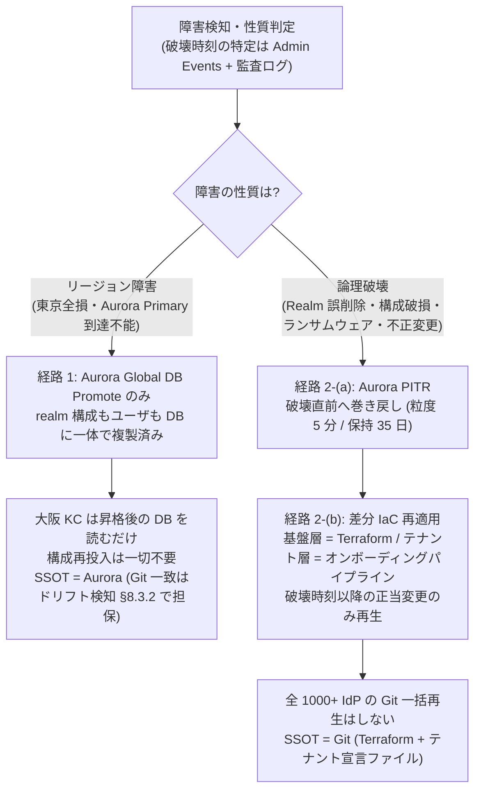
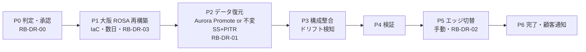
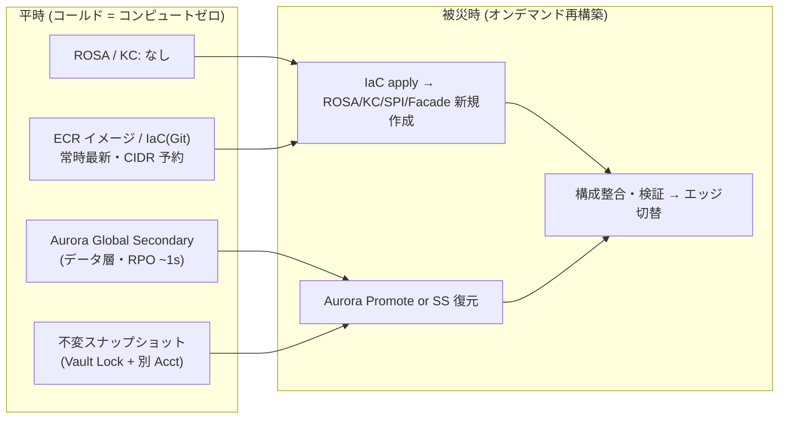

# U8: 可用性・DR 設計

作成日: 2026-07-23
ステータス: Draft v1（Wave 2）
前提: [01-architecture-baseline.md](01-architecture-baseline.md) **Baseline v1**（**P-19 ブランドユニット** = authz/idmap/projection の Aurora も DR 対象〔DU-U8-10〕/ **P-20** = Lambda 群は IaC 再適用で復旧、特に P-04 SLA 99.9% / P-05 DR Tier 2: RTO 1h・RPO 1min・Active-Passive / P-15 東京+大阪 / P-01 ROSA HCP + RHBK Operator / P-02 10M MAU）
上位文書: [00-basic-design-plan.md](00-basic-design-plan.md) U8
物理配置の前提: [06-infra-network-design.md](06-infra-network-design.md)（D-U6-03/05/07、§6.8.2 の U8 引き渡し）

> 🚨 **2026-07-30 DR 方針の全面転換による改訂待ち（[00a §0 決定ログ](00a-remaining-tasks-and-effort.md) / D-18、G-EDGE-DR）**:
> 従前の **ピロットライト・RTO 1h・大阪ウォーム待機・エッジ自動切替（REQ-DR-01/02）は廃止**。新方針 = **手動コールド DR / RTO ≈ 14 日 / 大阪は平時プロビジョニングなし・被災時にオンデマンド再構築 / RPO は Aurora バックアップ・スナップショット依存**（P-05・P-15 転換）。
> **本書の §8.4（RTO 積み上げ）/ §8.5〜8.7（ピロットライト）/ D-U8-05/07/09 / ADR-051 は D-18 で全面改訂予定**。本文は改訂まで旧前提のまま。新論点 = ① 大阪オンデマンド再構築 Runbook（RB-DR 改訂）② **リストア Runbook**（Aurora PITR / イミュータブルスナップショット）③ **2 障害シナリオの区別**（リージョン災害=再構築+リストア / 論理破壊・IdP データ破壊・ランサム=PITR・イミュータブルスナップショットからその場リストア）。**イミュータブルスナップショット = AWS Backup Vault Lock（Compliance mode）or 別 Acct コピーで削除権限分離**。

---

## 8.0 背景・なぜここで決めるか・スコープ

### 8.0.1 背景 — 旧 ADR-051 の前提が 2 点崩れた

[ADR-051](../adr/051-multi-region-dr-failover.md)（2026-06-23 作成）は「Active-Passive Warm Standby + Aurora Global DB」の大枠を定めたが、基本設計 Wave 1 で**前提が 2 点崩れた**:

1. **「Realm Export 日次自動 → S3 → DR Import」戦略の不成立**。P-16（接続 IdP 1000+）環境では realm representation が 30MB 級に達し、realm 全体 export/import は運用として成立しない（keycloak#14851 / [U2 §2.7.4](02-keycloak-logical-design.md) で**全面禁止**が設計制約化済み）。ADR-051 冒頭警告（2026-07-23）のとおり、構成復元は **IaC 再適用（Git SSOT）+ Aurora Global DB** へ差し替える必要がある — **本書がこの正式改訂の設計根拠**であり、§8.8 に「ADR-051 改訂案」を示す。
2. **実行基盤の EKS → ROSA HCP 転換**（ADR-056 逆転、P-01）。大阪 ap-northeast-3 の ROSA HCP 対応が確認され東西対称構成が成立（[research](research/rosa-hcp-adoption-research.md) #2）。さらに KC 26.1 以降 **jdbc-ping がデフォルト**・**multi-cluster v2 で外部 Infinispan 要件が撤廃**され、「同期は Aurora（DB）のみを single source of truth とする」構成に簡素化された（research #8、RHBK 26.4 HA Guide は Aurora PostgreSQL 15-17 を multi-site HA サポート DB に明記）。

加えて、旧 ADR-051 には**実機制約との矛盾**が 1 点ある: 「DR Region Warm Standby（KC Scale 1 で待機）」は、**Aurora Global Secondary が read-only であり Keycloak は起動時に DB 書込を要するため成立しない**（[keycloak-dr-aurora-sync.md §4.1](../reference/keycloak-dr-aurora-sync.md)）。本書で「インフラ Warm + KC Scale 0」のパイロットライトに正式修正する（§8.6、D-U8-07）。

### 8.0.2 本書の位置づけと決定の型

- 本書は §NFR-1（可用性）/ §NFR-5（DR）の要件を、U6 で確定した物理配置（ROSA HCP × 2 クラスタ × 2 リージョン、Aurora Global 2 系統）の上で**手順・数値・成立性検証まで**落とす。
- 決定は D-U8-nn、他組織（NW 監査 Acct 管理者）への要求は REQ-DR-nn で採番する（U6 の A 部/B 部分離原則 §6.0.2 を踏襲 — **DR 切替の生命線が他組織要求に依存しないこと**を設計原則とする）。
- スコープ: リージョン内可用性 / DR 構成（構成データ・ユーザデータの復元戦略）/ フェイルオーバー・フェイルバック手順 / RTO 1h 積み上げ検証 / セッションの扱い / パイロットライト / DR 訓練。
- 非スコープ: 監視実装・Runbook 本文・Burn Rate Alert 実装（→ U9。本書は仕様を引き渡す）、KMS Key Policy 詳細（→ U7、[ADR-045](../adr/045-cryptographic-key-management-strategy.md) MRK 前提のみ利用）、バックアップの法定保管詳細（§NFR-5.3/5.4 のベースライン値を採用）。

---

## 8.1 可用性設計（リージョン内・東京）

### 8.1.1 決定 D-U8-01: SLA 99.9% のエラーバジェットと直列可用性の成立性

| 項目 | 値 | 根拠 |
|---|---|---|
| SLA | **99.9%**（月間エラーバジェット **43.8 分** / 年間 8.76 時間） | P-04、§NFR-1.1 |
| 計測対象 | 認証エンドポイント（OIDC `/token` `/auth` / SAML）成功率。アプリ側計測の認証成功率も SLO 判定に含める | §NFR-1.0.A / §NFR-1.1 |
| 除外 | 計画メンテナンス窓（月 1 回・深夜 2-4 時、7 日前通知）/ 顧客起因 / **顧客 IdP 起因のフェデレーション失敗** | §NFR-1.2。顧客 IdP は責任分界外（L1 側） |

**直列可用性の積み上げ（設計目標の妥当性確認）**:

| コンポーネント | 公称/設計可用性 | 統制 |
|---|---|---|
| 他組織エッジ（CloudFront + WAF + NFW） | **要求値 99.95%**（REQ-DR-04、§8.9） | 他組織 — 保証不能 |
| ROSA HCP（Control Plane SLA） | 99.95% | Red Hat SRE |
| KC Pod 層（3 AZ、N≥3、PDB） | 99.99% 設計 | 弊社 |
| Internal ALB / PrivateLink | 99.99% | 弊社 |
| Aurora Multi-AZ（Writer + Reader×2） | 99.99% | AWS |
| **直列合成（概算）** | **≈ 99.87〜99.92%** | — |

→ 自管理部分のみなら 99.9% は余裕をもって成立。**律速は他組織エッジ**であり、エッジ可用性 99.95% 以上を要求仕様として明文化する（REQ-DR-04）。エッジ要求が未達でも、Sorry Page（ADR-022、Lambda@Edge/CF エラーページ — これもエッジ側要求 REQ-IN-07）で劣化を可視化する。

### 8.1.2 決定 D-U8-02: ROSA HCP Multi-AZ / PDB / HPA 方針

U6 D-U6-03/04（3 AZ × Machine Pool、c7g.xlarge ベースライン）を前提に、Pod 配置と自動復旧を次で確定する:

| 項目 | Broker KC | IdP-KC | 根拠 |
|---|---|---|---|
| 最小レプリカ | **3**（AZ ごと 1 以上、topologySpreadConstraints `topology.kubernetes.io/zone` maxSkew=1） | 3 | P-04、U6 §6.2.2 |
| PDB | **maxUnavailable=1**（KC CR 由来 StatefulSet に対して設定） | 同左 | ローリング時も 2 AZ 分の容量維持 |
| HPA | CPU 60% 目標（Broker は署名系で CPU 線形、U6 §6.5.2） | CPU 60% + **Scale-Out 予兆トリガ（`login_success_password_rate` > 8 TPS/node 3 分）を優先**（Argon2id + JVM warmup が遅いため、U6 §6.5.4） | sizing-guide §9 |
| ノード障害 | Machine Pool 自動置換（Red Hat SRE 管理）+ jdbc-ping による自動クラスタ再編（外部ディスカバリ機構不要） | 同左 | research #8 |
| ヘルスチェック | ALB → KC `/health/ready`（KC 側 health-enabled、management port）。閾値 3 回 × 10 秒 | 同左 | ADR-051 §D.2 踏襲 |
| SPOF 点検 | ALB Multi-AZ / VPC Endpoint 3 AZ / PrivateLink Endpoint 3 AZ（U6 §6.3.2）/ NAT なし構成（Private + Endpoint 群） | — | §NFR-1.4 |

### 8.1.3 決定 D-U8-03: Aurora Multi-AZ とリージョン内フェイルオーバー

- 構成: Writer + Reader × 2（3 AZ、U6 D-U6-07）。**リージョン内 Writer 障害は Aurora Managed Failover（< 1 分）で自動**（ADR-051 §E.1 の自動化区分を維持）。
- KC は Cluster（Writer）エンドポイントのみ接続（U6 D-U6-08）。Writer 交代時は JDBC socket/login timeout（ALB/R53 TTL 30s より短く設定）で早期切断 → Agroal プール再接続。**この再接続時間の実測が RDS Proxy 再評価（U6 O-3）の判定材料** → §8.9 で追跡。
- jdbc-ping 制約: Writer 交代中はディスカバリ書込が一時失敗するため、**クラスタ全 Pod の同時再起動を伴う操作は Writer 安定後に実施**（**禁則 [K-2](09-operations-observability-design.md)**、U6 §6.4.2）。

### 8.1.4 決定 D-U8-04: ゼロダウンデプロイ（RHBK Operator ローリング。OLM 自動更新は禁則 [K-11](09-operations-observability-design.md)）

| 変更種別 | 方式 | ダウンタイム |
|---|---|---|
| KC 設定変更・**パッチ版数**（26.x.y → 26.x.y+1） | RHBK Operator の Update 戦略 **Auto**（互換判定に基づくローリング再起動。PDB maxUnavailable=1 併用） | ゼロ（Persistent user sessions が DB 保存のため Pod 入替でセッション不断、sticky 不要） |
| **マイナー版数**（26.x → 26.x+1、DB スキーマ移行を伴い得る） | 計画メンテナンス窓（月 1 深夜、§NFR-1.2）で実施。事前に **Staging 1000 IdP 合成データセット回帰**（U2 §2.7.1 制約 1）通過必須 | 窓内（SLA 除外） |
| Operator 自体（OLM） | **Explicit（手動承認）** — 自動更新禁止 | ゼロ | 
| Custom SPI 差替 | KC イメージ再ビルド → パッチ版数と同じローリング。G-SPI-Compat 通過が前提 | ゼロ |

根拠: U2 §2.7.1（バージョン固定 + 昇格前検証、#46605 リグレッション前例）。デプロイ CI/CD の実装は U9。

---

## 8.2 DR 構成の全体像（Tier と対象データ）

### 8.2.1 決定 D-U8-05: RTO/RPO Tier と Failover モデル（ADR-051 骨格の維持）

ADR-051 の骨格は維持する（変更するのは復元戦略 §8.3 と待機形態 §8.6）:

| 項目 | 決定 | 変更有無 |
|---|---|---|
| モデル | **Active-Passive（東京 Primary → 大阪 DR）、自動化 80% + データ層 Cross-Region は手動承認 20%**（Split-Brain 防止） | 維持（ADR-051 §E） |
| Tier（標準・P-05、**2026-07-30 D-18 転換**） | **RTO ≈ 14 日（手動コールド DR）/ RPO は Aurora バックアップ・スナップショット依存**（D-U8-14）。旧 RTO 1h / RPO 1min（§8.4.3 の積み上げ）は**廃止・旧参考** | **変更** |
| Tier 1（規制業種オプション） | RTO 30 分。**パイロットライトでは不成立**（§8.4.4）→ Hot Standby 前提の Phase 2 オプションとして棚上げ | 位置づけ明確化 |
| Tier 3 | RTO 4h / RPO 15min | 維持 |
| 待機形態（**2026-07-30 D-18 転換**） | **手動コールド DR = 大阪は平時プロビジョニングなし、被災時に ROSA をオンデマンド再構築 + データリストア**。旧パイロットライト（インフラ Warm + KC Scale 0）は廃止（常時コスト削除、U6 §6.2 / D-U8-14） | **変更**（§8.6 は旧参考、D-U8-14） |
| Active-Active | 不採用継続 — 東阪レイテンシは公式要件（<10ms）上限で保証不能 + External Infinispan 復活は multi-cluster v2 の簡素化に逆行（[keycloak-dr-aurora-sync §5.1](../reference/keycloak-dr-aurora-sync.md)） | 維持 |

### 8.2.2 データ分類と DR 手段（SSOT 表）

**Keycloak の realm 構成（Clients / IdP / Flow / Org）はすべて DB に格納されるため、Aurora Global DB がユーザデータと構成データを一体で複製する**。この事実が旧 Realm Export 戦略を不要にする中核である:

| データ | 保存場所 | DR 手段 | RPO |
|---|---|---|---|
| ユーザ（ID/PW ハッシュ/属性/WebAuthn/TOTP） | Aurora（Broker / IdP-KC 各系統） | **Aurora Global DB** | < 1 min（実測 lag 典型 < 1s） |
| Realm 構成（Clients/IdP 1000+/Mapper/Flow/Org/User Profile） | Aurora（同上） | **Aurora Global DB**（リージョン障害時）+ **IaC 再適用**（論理破壊時、§8.3） | < 1 min / Git は常時最新 |
| ユーザセッション（オンライン/オフライン） | Aurora（KC 26 Persistent user sessions） | Aurora Global DB（ただし SLA 上は失効許容 — §8.5） | < 1 min（保証はしない） |
| 認証セッション（ログイン途中）/ アクショントークン / loginFailures | **Infinispan のみ** | **同期しない（失効許容）** | 対象外（§8.5） |
| JWT 署名鍵（ES256 realm keys） | Aurora（realm 構成の一部） | Aurora Global DB → **フェイルオーバー後も同一 kid / JWKS 不変** | < 1 min |
| インフラ暗号鍵 | KMS | **MRK**（大阪レプリカ、ADR-045。Aurora/監査ログ系のみ。Secrets/Break-Glass は Regional、U7 D-U7-01） | 0 |
| ITDR / Adaptive / Tenant Audit / DSAR | DynamoDB | **Global Tables**（ADR-051 §B.2。暫定、O-U8-9） | < 1 min |
| 監査ログ / SPA bundle / DSAR Export | S3 | **CRR**（ADR-051 §B.3。SPA はデプロイ時両リージョン） | 15 min / 即時 |
| `idmap` 補助 DB（U6 §6.4.1） | Broker Acct Aurora 別 DB | **同一 Aurora Global クラスタに同居** → 追加機構不要 | < 1 min |
| IaC / SPI 成果物 | Git / ECR | Git（リージョン非依存）+ **ECR クロスリージョンレプリケーション** | 0 |

> **⚠ 本表はデータ層のみを扱う。**アプリ層・基盤層のマネージドサービス（Secrets Manager / ACM Private CA / EventBridge / SES / Lambda / API Gateway / OpenSearch）は **§8.2.3 決定 D-U8-15** を参照（2026-08-18 新設）。**特に Secrets Manager は事前設定しないと切替時に起動できない。**

---

## 8.3 DR 構成の再設計 — 構成データ復元戦略（ADR-051 改訂案の中核）

### 8.2.3 決定 D-U8-15: アプリ層・基盤層サービスの DR（2026-08-18 新設）

**背景**: §8.2.2 の SSOT 表は**データ層のみ**（Aurora / KMS / DynamoDB / S3 / ECR）を扱っており、**アプリ層・基盤層のマネージドサービスが 1 つも載っていない**。`ADR-062`（idm-api = Lambda）と `ADR-064`（削除伝播 = EventBridge outbox）は 2026-08-06 以降の決定で、本表がそれに追随していなかった。コスト見積り 35 項目（= 使用サービスの全量）と本表を突合して判明。

**採用**: 各サービスを「**事前設定が必須か / 再構築時に作れるか**」で分類し、前者を平常時のタスクとして確定する。

| サービス | 区分 | DR 手段 | **事前設定** | 平常時費用 |
|---|:---:|---|:---:|---|
| **Secrets Manager** | 🔴 | **レプリカシークレット**（[公式](https://docs.aws.amazon.com/secretsmanager/latest/userguide/create-manage-multi-region-secrets.html)）。ローテーションは主系で回り副系へ伝播。被災時は promote して独立化 | **必須** | 約 12 USD/月（30 個 × 0.40） |
| **ACM Private CA** | 🔴 | **リージョン資源で複製不可**。[公式は両リージョンに冗長 CA を作る方式](https://docs.aws.amazon.com/privateca/latest/userguide/disaster-recovery-resilience.html)を案内 | 案③のみ必須 | 案③ 400 USD/月（汎用）or 50（短期証明書モード） |
| **EventBridge** | 🟡 | **Global Endpoints**（Route 53 ヘルスチェック連動、[公式](https://docs.aws.amazon.com/eventbridge/latest/userguide/eb-global-endpoints.html)）。**東京・大阪とも対応**、RTO/RPO ≈ 360 秒（最大 420 秒）、機能自体は無料 | 案②③で推奨 | バス自体は無料。イベント複製は課金 |
| **SES** | 🟡 | **ドメイン認証（DKIM）はリージョンごと**。事前に大阪でも通しておく | **必須** | **0 円**（DNS レコード追加のみ） |
| **Lambda**（idm-api + 糊 5 種） | 🟡 | IaC 再適用。`DU-U9I-03` のパイプラインは 2 アカウント向けで**大阪向けの記述がない** | 不要 | 0 |
| **API Gateway** | 🟡 | IaC 再適用。**カスタムドメインの証明書もリージョンごと**に必要 | 不要 | 0 |
| **OpenSearch / CloudWatch Logs** | 🟢 | リージョン資源。**東京の直近ログは失われる**が長期保管は S3 CRR で残る | 不要 | 0 |

**EventBridge の制約（重要）**:
- **カスタムバスを使う場合、両リージョンに同名のバスを同一アカウントで事前作成しておく必要がある**（公式明記）。**案①（大阪に何も置かない）では Global Endpoints を使えない**
- **イベント複製を有効にしないと、復旧後に手動で Route 53 ヘルスチェックを healthy へ戻す操作が要る**（無人での自動復帰は不可）
- ただし `ADR-064` の削除伝播は **outbox 方式**（Aurora へ書いてから送出）のため、**未送出分は Aurora Global DB で保全される**。バスを再作成すれば再送でき、この点は設計が効いている

**最も重い制約 — Secrets Manager**: `U7 D-U7-01` は「**Secrets / Break-Glass は Regional**」と明記しており、現状**複製していない**。このままだと**案①②③のいずれを選んでも「大阪へ切り替えたが DB 接続情報も client_secret も存在せず起動できない」**という結末になる。**レプリカは事前設定が必須で被災後には作れない**。費用は月 12 USD 程度で費用対効果は極めて高い。

**Private CA の判断**: 案①② は被災時に新規 CA を作成する運用でよい（平常時費用ゼロ）。ただし**新 CA = 新しい信頼チェーン**のため、**全クライアントの信頼ストア更新を再構築手順に組み込む**必要がある（RTO に加算）。案③は待機系が常時 TLS を張るため事前作成が必須。

**残タスク**: `DU-U8-11`（削除伝播 outbox の DR 整合、8 人日）に**EventBridge バスそのものの扱い**が含まれていないため、DoD へ追記する。`DU-U9I-03`（Lambda パイプライン）に**大阪向けデプロイ**を追記する。

---

### 8.3.1 決定 D-U8-06: Realm Export を全面廃止し、復元経路を 2 系統に再定義する

**Realm Export は DR 目的を含む一切の用途で使用しない**（U2 §2.7.4 制約 4 の完全準拠。日次 Export・S3 保管・DR Import・RB-DR-04 を全廃）。復元は障害の性質で 2 経路に分ける:

| 復元経路 | 対象障害 | 手段 | 構成の SSOT |
|---|---|---|---|
| **経路 1: リージョン障害** | 東京全損・Aurora Primary 到達不能 | **① 大阪 ROSA をオンデマンド再構築（IaC、RTO ≈ 14 日、D-U8-14）② データをリストア/Promote**（realm 構成もユーザも DB に一体複製済のため、再構築した大阪 KC は復元後 DB を読むだけで構成再投入不要） | Aurora（= Git と一致をドリフト検知で担保） |
| **経路 2: 論理破壊** | Realm 誤削除・構成破損・ランサムウェア・不正変更（リージョンは健在） | **(a) Aurora PITR**（粒度 5 分 / 保持 35 日、§NFR-5.4）で破壊直前へ巻き戻し、**(b) 直近の正当変更分は IaC 再適用で再生**: 基盤層 = Terraform（Realm 設定/Flow/SPI 配備/共通 Scope、単一 state — 分割の最終形は U9 D-U9-09）、テナント層 = **オンボーディングパイプライン（自作オンボーディング API による Admin API 差分適用、テナント単位宣言ファイル。keycloak-config-cli は K-1〔realm representation 禁止、U2 §2.7.4〕と原理衝突のため不採用 — U9 D-U9-10）**で該当テナントのみ再生。さらにランサム・悪意削除で PITR/自動バックアップ自体が消される事態に備え、イミュータブルスナップショット（AWS Backup Vault Lock Compliance / 別 Acct コピー、D-U8-14）からのリストア経路を必ず併設** | **Git**（Terraform + テナント宣言ファイル） |

- 経路 2 で「全 1000+ IdP を Git から一括再生」は行わない（Admin API 負荷 + 時間の点で非現実的、U2 §2.7.5 と同根）。**PITR を主、IaC 再生は差分（破壊時刻以降の正当変更）に限定**する。破壊時刻の特定は Admin Events + 監査ログ（監査 Acct S3、改変不能）による。
- 旧 ADR-051 §A.2「Keycloak Realm 破損 = Realm Export Restore、RPO 24 時間」は「**PITR + 差分 IaC 再生、RPO 5 分（PITR 粒度）**」に置き換わる — RPO が 24h → 5min へ**大幅改善**する点は改訂の副次効果として明記する。

障害の性質による復元経路の分岐を図示する（2026-07-26 図示追加）:

### 8.3.1a 決定 D-U8-14: バックアップ／イミュータブルスナップショット戦略と大阪オンデマンド再構築（2026-07-30 D-18 新設）

DR のコールド化（パイロットライト廃止）に伴い、**「コンピュートは平時ゼロ、データは保全」**を原則とする。2 障害シナリオを明確に分ける:

| シナリオ | 復元方式 | RTO | RPO |
|---|---|---|---|
| **① リージョン災害**（東京全損） | 大阪 ROSA を **IaC でオンデマンド再構築** → Aurora を大阪でリストア/Promote → エッジ切替 | **≈ 14 日**（手動、事業許容） | データ保全方式に依存（下記） |
| **② 論理破壊**（IdP データ破壊・誤削除・ランサム・不正変更、リージョンは健在） | **その場で**リストア（再構築不要）: 非悪意は **Aurora PITR（1 秒精度・35 日）**、ランサム/内部不正は **不変スナップショット（Vault Lock）** | 数時間 | L2 PITR = 1 秒精度 / **L3 不変スナップショット = 取得間隔** |

**データ保全設計 = 3 層**（2026-07-30 AWS 公式裏取り反映）。⚠ **重要な AWS 制約**: **Aurora の PITR（continuous backup）は Vault Lock で不変化できず、別リージョン/別アカウントにもコピーできない**（[AWS 公式](https://docs.aws.amazon.com/aws-backup/latest/devguide/point-in-time-recovery.html): 「Aurora continuous backups cannot be placed in a backup vault for immutability (vault lock) ... use periodic snapshot backups instead」）。よって**不変・隔離が要る対策は periodic snapshot に置く**:

| 層 | 手段 | 守る対象 | 不変/隔離 | RPO |
|---|---|---|---|---|
| **L1** リージョン災害 | **Aurora Global DB**（大阪 Secondary、非同期複製） | 東京全損 | — | ~1 秒（[公式](https://docs.aws.amazon.com/AmazonRDS/latest/AuroraUserGuide/aurora-global-database.html)） |
| **L2** 論理復元（細粒度） | **Aurora PITR**（1〜35 日・1 秒精度） | 誤削除・破損の巻き戻し | **不可**（Aurora サービス内に留まり攻撃者が消せる） | 1 秒 |
| **L3** ランサム/内部不正の最終防衛線 | **AWS Backup 定期スナップショット** → **Vault Lock（Compliance mode）** + **別リージョン & 別アカウントコピー** | 悪意の削除・暗号化 | **不変（ルートでも保持期間内削除不可）+ 隔離**（[Vault Lock](https://docs.aws.amazon.com/aws-backup/latest/devguide/vault-lock.html)） | 取得間隔 |

- **L2/L3 の役割分担が肝**: PITR は細かく戻せるが攻撃者が消せる → **L3 の不変スナップショットが「消されても残る最後の砦」**。L3 の RPO は取得間隔（例 6〜24h）で L2 より粗い。
- **KC イメージ・Custom SPI 成果物**は東西 ECR へ CI で常時 push（再構築時 pull 可能、コンピュートは起動しない）。
- ⚠ **Vault Lock Compliance mode 運用注意**: 一度ロックすると**解除不可**（grace time = cooling-off 最小 3 日、この間のみ変更可）。保持 "Always" は永久課金なので避け短保持で先行検証。**別アカウントコピーは AWS Organizations 同一組織 + 顧客管理 KMS 共有 + 宛先非デフォルト Vault** が前提。**アカウントクローズ 90 日で Vault Lock も無効化**される点を BCP に織込む。
- ⚠ **Aurora はクロスリージョン自動バックアップレプリケーション非対応** → 別リージョン保全は AWS Backup のコピー機能で行う。不変スナップショットは **Primary（東京）クラスタで取得**が素直（Secondary スナップショットの可否は公式未明示）。

#### 8.3.1a-2 顧客希望値（RTO 1 日 / RPO 5 分）の成立条件（2026-08-16 ユーザー更新、O-U8-10 の判断材料）

**背景**: 2026-08-16 のユーザー更新で **RTO = 1 日（DR 障害時 3 日）/ RPO = 5 分**が顧客希望の暫定値として提示された。従前の設計値（RTO ≈ 14 日 / RPO = バックアップ依存）と大きく異なるため、**DR 一式をヒアリング対象化**する（P-05 / B-DR-1）。本節は交渉の前提となる技術的事実を一次資料で固定する。

**事実 1: RPO 5 分は「東京リージョン内」なら成立する**

| 範囲 | 成立 | 根拠（一次資料） |
|---|:---:|---|
| 東京内（論理破壊・誤削除からの復元 = 障害シナリオ ②） | **✅ 成立** | Aurora の連続バックアップは **1 秒精度**、`LatestRestorableTime` は **典型的に 5 分未満**（[AWS Backup PITR](https://docs.aws.amazon.com/aws-backup/latest/devguide/point-in-time-recovery.html)「*The recovery point objective (RPO) for Aurora continuous backups is typically less than 5 minutes*」） |
| 大阪へ（リージョン災害 = 障害シナリオ ①） | **❌ 不成立** | **連続バックアップ（トランザクションログ）はクロスリージョンにコピーできない**。AWS 公式: 「*You can't create copies of Amazon RDS continuous backups because AWS Backup for Amazon RDS does not allow copying transaction logs. Instead, AWS Backup creates a snapshot and copies it with the frequency specified in the backup plan*」（同上）。コピーできるのは**スナップショットのみ・最短 1 時間間隔** → **RPO は時間単位**になる |

**事実 2: 大阪で RPO 5 分以下にする唯一の手段は Aurora Global Database**（ストレージ常時複製、RPO は秒単位）。ただし**平時から大阪にクラスタを維持する**ことを意味し、**P-05/P-15 のコールド DR（大阪は平時プロビジョニングなし）と両立しない**。

**事実 3: RTO 1 日も同じ制約にぶつかる**。§8.4 の積み上げは「大阪 ROSA をゼロから構築 + リストア」で ≈ 14 日。**1 日にするには大阪に事前構築された受け皿が必要**（= パイロットライト以上）。

**結論（設計判断ではなく交渉の枠）**: **RTO 1 日 + RPO 5 分は、実質「2026-07-30 転換前のウォーム待機構成へ戻す」ことと同義**であり、大阪の常時コストが発生する。よって次の 3 択を顧客に提示して選んでもらう（[B-DR-1](../requirements/hearing-checklist.md) / 質問状 Q04・Q05）:

| 案 | RTO | RPO（大阪） | 大阪の平時コスト | 備考 |
|---|---|---|---|---|
| **① コールド DR**（現行設計 / 2026-07-30 転換） | ≈ 14 日 | 時間単位（スナップショット間隔） | **ゼロ** | 東京内の論理破壊は PITR で RPO 5 分を満たす |
| **② Aurora Global DB のみ維持**（O-U8-10 案 A、推奨） | ≈ 14 日 → **数日に短縮可** | **1 分未満** | ストレージ複製分のみ（コンピュートは cold） | **RPO だけ先に満たす**折衷案。RTO 1 日には届かない |
| **③ パイロットライト以上**（転換前構成へ回帰） | **1 日以下** | **1 分未満** | クラスタ + Aurora の常時費用 | RTO・RPO とも希望値を満たすが月額増 |

**注意**: 障害シナリオ ①（リージョン災害）と ②（論理破壊）で成立値が違うため、**顧客への提示は必ず 2 シナリオを分けて行う**こと。単に「RPO 5 分」と約束すると ① で守れない。

⚠ **要確認（サブ決定、O-U8-10）**: リージョン災害の RPO をどこまで詰めるか — **(A) Aurora Global DB を維持**（ストレージのみ常時複製、RPO < 1 分、コンピュートは cold のまま）/ **(B) 定期スナップショットのクロスリージョンコピーのみ**（RPO = 取得間隔、より低コスト）。**推奨 = (A)**（データ保全は薄く常時・コンピュートだけ cold が「IdP が壊れても戻せる」要件と最も整合）。最終はコストと RPO 許容値で U6 と合同決定。

### 8.3.2 決定 D-U8-07: 整合性検証 = IaC ドリフト検知（Git ⇔ 稼働 KC の突合）

経路 1 が成立する条件は「Aurora の中身 = Git の宣言」が常時保たれていることである。手当てを設計制約にする:

| # | 施策 | 内容 | 主管 |
|---|---|---|---|
| 1 | 変更経路の一本化 | 基盤層 = Terraform / テナント層 = オンボーディングパイプライン**以外の構成変更を禁止**（Admin Console 直接変更は緊急時 Break-Glass のみ、事後 Git 反映必須） | 本書（原則）/ U9（統制） |
| 2 | 定期ドリフト検知 | 日次 CI で (a) Terraform `plan` 差分ゼロ確認（基盤層）、(b) テナント層は Admin API 読取（IdP/Org/Mapper 単位）と宣言ファイルの突合スクリプト。**realm 全体 export は使わない**（IdP 単位 GET のページング走査） | U9 実装 |
| 3 | ドリフト時対応 | 差分検知 → 監査ログ照合 → 正当なら Git へ逆反映 / 不正なら経路 2 発動判断（ITDR 連携、ADR-035） | U9 Runbook |
| 4 | DR 訓練での検証 | Game Day（§8.7.2）で「大阪昇格後の KC 構成 = Git 宣言」の突合を合格基準に含める | 本書 §8.7 |

---

## 8.4 フェイルオーバー手順（コールド DR、RTO ≈ 14 日）

> **2026-07-30 D-18 でコールド DR に改訂済み**（本節は現行）。旧「パイロットライト / RTO 1h / 50 分積み上げ」の分析は Phase 2（Warm/Hot 復活）検討時の出発点として §8.4.4 に要約を残す。

### 8.4.1 決定 D-U8-08: フェイルオーバー判断基準（自動 80% / 手動承認 20%）

ADR-051 §E.1 の区分を維持しつつ、判断を早めるため**リージョン障害判定チェックリスト（RB-DR-00、新設）**を定義する:

| 判定材料 | 例 |
|---|---|
| AWS Health Dashboard | ap-northeast-1 の複数サービス Event |
| 合成監視（外形） | 東京 auth エンドポイント成功率 < 50% が 3 分継続、大阪からの東京到達性 |
| Aurora | Writer 接続不能 + リージョン内 Failover 不成立 |
| 判定 | 上記 2 系統以上該当 → 「リージョン障害」と宣言し承認プロセスへ（単一 AZ・単一コンポーネント障害は §8.1 の自動復旧に委ねる） |

手動承認（Aurora Global Promote / DR 全体切替 / Failback）は IR Lead 起案 → CTO 承認（ADR-051 §E.2 フロー維持）。**承認 SLA = 検知から 15 分以内**を運用目標とし、Game Day で計測する。

### 8.4.2 コールド DR フェイルオーバー手順（リージョン災害）

大阪は平時ノードを持たない（D-U8-11 改訂 / U6 §6.2.4）ため、フェイルオーバーは **「オンデマンド再構築 → データ復元 → 構成整合・検証 → エッジ切替」** の順で行う。RTO は日オーダー（≈ 14 日、B-DR-5 の事業許容）で、律速は**ノード供給でなく構築・整合検証の総工程**。

| フェーズ | 主なアクション | 目安 | Runbook |
|---|---|---|---|
| P0 判定・承認 | RB-DR-00 判定（**リージョン災害か論理破壊かの切り分け** + ITDR 抑制/強化フラグ。**フラグ操作は RB-DR-00 のみ = 禁則 [K-3](09-operations-observability-design.md)**）→ CTO 承認（SLA 15 分）→ 大阪 DR 宣言 | 〜1h | RB-DR-00 |
| P1 大阪 ROSA 再構築 | IaC で VPC（CIDR 事前確保済）/ ROSA HCP × 2 / Machine Pool / RHBK Operator / KC CR / Custom SPI / SCIM Facade を新規適用 | 数日 | RB-DR-03 |
| P2 データ復元 | **(A) Aurora Global を大阪で Promote**（維持時、O-U8-10 推奨）/ **(B) 不変スナップショット + PITR から大阪 Aurora を復元** → KC 接続先を大阪へ | 半日〜1 日 | RB-DR-01 |
| P3 構成整合 | IaC ドリフト検知で Git ⇔ 稼働 KC 突合（realm / Flow / Client / 1000+ IdP）、テナント層オンボーディング再生の差分確認 | 半日〜1 日 | RB-DR-03 |
| P4 検証 | ログイン（フェデ/ローカル各 1）、JWKS・kid 一致、token/refresh、Broker→IdP-KC PrivateLink 疎通、`idmap` 参照、外形監視グリーン | 半日 | RB-DR-03 |
| P5 エッジ切替 | 他組織エッジのオリジンを大阪へ切替（**手動でよい = RTO 日オーダーのため事前自動化不要**）+ R53 切替 | 〜数h | RB-DR-02 |
| P6 完了 | 全面切替宣言・顧客通知（**全ユーザー再認証の案内**含む、§8.5） | — | — |

**論理破壊の場合はこの手順ではない**（大阪再構築は不要）: リージョンは健在なので**東京でその場リストア**する（P2 のデータ復元のみ = L2 PITR で細粒度巻き戻し / ランサム時は L3 不変スナップショットから復元、D-U8-14）。判定 P0 でどちらのシナリオかを切り分ける。

### 8.4.3 決定 D-U8-09（改訂）: RTO ≈ 14 日の内訳と成立条件

コールド DR の RTO は日オーダー。旧「RTO 1h（パイロットライト前提）」の 50 分積み上げは**廃止**（2026-07-30 D-18）。

| 内訳 | 目安 | 支配要因 |
|---|---|---|
| 判定・承認 | 〜1h | RB-DR-00 + CTO 承認（SLA 15 分） |
| 大阪 ROSA 再構築（P1） | 数日 | ROSA クラスタ新規作成 + Operator/CR/SPI/Facade 適用の総工程 |
| データ復元（P2） | 半日〜1 日 | Aurora Promote（維持時は短い）or スナップショット復元サイズ |
| 構成整合・検証（P3/P4） | 1〜2 日 | 1000+ IdP の突合、テナント再生差分 |
| エッジ切替・緩衝（P5） | 〜1 日 | 他組織調整 + 予備 |
| **合計** | **≈ 14 日（十分な緩衝込み）** | 事業許容 RTO（B-DR-5 = 手動 14 日で合意方向） |

**成立条件**: ① CIDR 事前確保（U6 §6.2.4）② IaC 常時 apply 可能（東西 overlay の日次 plan、§8.6.2）③ KC/SPI/Facade イメージの東西 ECR 常時 push ④ データ保全 L1/L3（D-U8-14）⑤ 再構築 Runbook（RB-DR-03）の Game Day 実証。**旧 5 条件のうち「他組織エッジの自動/10 分切替」は RTO が日オーダーのため不要化**（手動切替で足りる、§8.4.5）。

### 8.4.4 短 RTO（Tier 1/2）は Phase 1 では提供しない（旧パイロットライト分析の格納）

コールド DR（RTO ≈ 14 日 = Tier 3+ 相当）を Phase 1 標準とする。短 RTO は Hot/Warm Standby が前提で Phase 1 では提供しない:

- **Tier 2（RTO 1h）** — 旧設計（パイロットライト = インフラ Warm + KC Scale 0、worst 50 分積み上げ + バッファ 10 分）。**大阪 KC 常時待機 + エッジ自動切替（旧 REQ-DR-01/02）+ 大阪 ECR pre-pull** が前提だった。Aurora Global Secondary が read-only で KC は起動不能なため「Scale 0 待機」だった点も含め、Warm/Hot 復活時はこの分析（旧 §8.4.2/§8.4.3、Git 履歴参照）が出発点。
- **Tier 1（RTO 30 分）** — Hot Standby（大阪 KC 常時稼働）必須。Aurora Secondary read-only 制約により別方式（東京 Writer へのクロスリージョン常時接続等）の検討が要る。規制業種顧客の契約要求が発生した時点で Phase 2 検討（ADR-051 §G.2 コスト再試算）。

### 8.4.5 DNS 切替・エッジ DR の要求仕様（他組織管理 — B 部）

P-18 により公開エッジ（CloudFront + WAF + ALB/NLB + NFW）は他組織管理であり、**DR 切替の最終段が管理外**にある。U6 §6.8.2 ③の「Route 53 Failover は誰の管理か」への回答として、以下を要求仕様に追加する（U6 §6.7 の要求仕様書 v1 への追補）:

| # | 要求 | 内容 |
|---|---|---|
| REQ-DR-01 | 大阪オリジンの切替（**コールド化で緩和**） | **2026-07-30 D-18: RTO 日オーダーのため事前 Origin Group 自動切替は不要**。DR 宣言後に大阪オリジンへ**手動切替できること**（事前登録は任意の最適化）。大阪 ALB/NLB は再構築後に生成される点に留意 |
| REQ-DR-02 | 手動切替の対応 | **2026-07-30 D-18: ≤ 10 分の厳格 SLA は不要**（RTO 日オーダー）。DR 宣言後、大阪再構築完了に合わせて数営業時間内にオリジン切替対応で足りる |
| REQ-DR-03 | DR 時の Egress 同等性 | 大阪側 Broker KC CIDR からの顧客 IdP 向け Egress（1000+ FQDN、REQ-OUT-01 のルールグループ）が**東京と同一内容で大阪側 NFW にも平時から適用**されていること（Failover 後に申請が必要な構成は不可） |
| REQ-DR-04 | エッジ可用性 | エッジ経路全体の可用性 99.95% 以上（§8.1.1 の直列成立条件） |
| REQ-DR-05 | DR 訓練参加 | 年 1 回以上、弊社 Game Day（§8.7）への切替訓練参加（最低限 Origin Failover の実動確認） |

**2026-07-30 D-18: G-EDGE-DR は「手動 DR / RTO ≈ 14 日」で解決**（手動切替で足りるため、旧「エッジ自動切替 or ≤10 分 SLA なしでは RTO 1h 非保証」の制約は消滅）。顧客 SLA には「RTO ≈ 14 日（手動コールド DR）」を記載する。REQ-DR-03（Egress 同等性）は再構築時に必要なため維持。

---

## 8.5 Infinispan / セッションの扱い — 「大阪側は全ユーザー再認証」の明文化

### 8.5.1 決定 D-U8-10: セッション連続性は SLA 対象外（全ユーザー再認証を標準とする）

jdbc-ping + multi-cluster v2 前提では**リージョン間で共有されるのは Aurora のみ**であり、Infinispan キャッシュ（認証セッション・work・loginFailures・actionTokens）は大阪で空から再構築される。よって:

> **リージョンフェイルオーバー時、全ユーザーは再認証（再ログイン）となることを製品仕様として明文化し、顧客 SLA・利用規約に記載する。**「再ログインのみで業務再開可能」（WebAuthn/TOTP は Aurora 経由で大阪でも有効）が顧客への説明線（ADR-051 §C.4 の維持・格上げ）。

実際には KC 26 の Persistent user sessions により SSO セッションは DB 複製されており、キャッシュ再構築後にセッションが有効と扱われる**可能性がある**（keycloak-dr-aurora-sync §4.4）。これは**アップサイドであり保証しない**（保証すると RPO 検証対象が増え、訓練合格基準が複雑化するため）。フェデレーションユーザー（P-07 γ: 大多数）は顧客 IdP 側セッションが生きていれば**パスワード再入力なしの再認証**で完了する点も顧客説明に含める。

### 8.5.2 RPO への影響整理（データ種別ごとの確定）

| データ | RPO | 扱い |
|---|---|---|
| ユーザ・credential・realm 構成・`idmap` | **≤ 1 min**（P-05 の RPO はこれを指す。実測 lag 典型 < 1s） | 保証対象 |
| 発行済み Access Token（ES256、30 min） | **影響なし** — 自己完結 + 署名鍵が Aurora 複製で kid 不変のため、切替中もアプリ側 JWT 検証は継続 | 保証対象（JWKS 不変を検証項目に含む） |
| Refresh Token / オフラインセッション | DB 複製されるが、**切替時の失効（再認証要求）を許容** | 失効許容 |
| SSO セッション | 同上（§8.5.1） | 失効許容 |
| 認証セッション（ログイン途中）・アクショントークン（PW リセットリンク等） | **消失** — 再試行・再送で回復 | 対象外と明記 |
| loginFailures（ブルートフォース カウンタ） | **消失** — 一時的セキュリティ低下 | 対象外だが緩和必須（下記 #4） |
| `rds.global_db_rpo` | **Phase 1 は設定しない**。lag > 60s でプライマリ書込ブロック = 認証停止（ログインはセッション書込を伴う）という可用性毒性が RPO 保証益を上回る。lag 監視（> 10s warning / > 30s critical、U9）で担保し、Tier 1 契約発生時に再評価 | 決定 |

### 8.5.3 keycloak-dr-aurora-sync.md 既知ギャップの解消状況

[keycloak-dr-aurora-sync.md](../reference/keycloak-dr-aurora-sync.md)（2026-03 調査）が挙げた問題の本設計での帰結:

| 既知ギャップ | 本設計での状態 |
|---|---|
| キャッシュ無効化メッセージ（work）が Region 間で届かない → 旧 PW ログイン可・無効化未反映（同 §4.5） | **構成上排除** — Active-Passive + KC Scale 0 のため両リージョン同時稼働が存在せず、大阪 KC は常に空キャッシュで新規起動 = DB 最新を読む（同 §4.5 の結論を設計制約として固定。**Hot Standby を将来検討する場合はこの問題が復活する**ことを Phase 2 検討条件に明記） |
| Aurora Secondary read-only で KC 起動不可（§4.1） | **設計に反映** — パイロットライト = KC Scale 0（D-U8-07）。旧 ADR-051「Scale 1」を修正 |
| 全ユーザー再認証（§4.3） | **明文化して許容**（D-U8-10） |
| ブルートフォースカウンタリセット（§4.3） | 緩和策: フェイルオーバー後 60 分間、エッジ WAF の認証系 Rate Limit を強化モードへ（要求仕様 REQ-IN-01 の Rate Limit 可変運用として他組織へ依頼 / 不可なら ITDR（ADR-035）の Brute Force 検知感度を一時引上げ — U7/U9 引き渡し） |
| 認証セッション・アクショントークン消失（§4.3） | 許容（再試行・再送）。顧客向け Failover 告知文テンプレートに「発行済みパスワードリセットリンクは無効化」を記載（U9 Runbook 添付） |
| フェイルバック時のデータ消失リスク（§5.5 やってはいけないこと） | §8.7.1 手順に禁止操作として組込み |

---

## 8.6 大阪 DR 待機態勢（コールド） — 平時に何を維持するか

> **2026-07-30 D-18 でコールド DR に改訂済み**（本節は現行）。大阪は平時に ROSA を持たず、被災時にオンデマンド再構築する（D-U8-11 改訂 / D-U8-14）。「腐らない DR」のためデータ層・成果物・IaC は平時から維持する。

### 8.6.1 決定 D-U8-11（改訂）: 大阪の平時態勢 = コンピュートゼロ・データ/成果物は維持

大阪は**平時に ROSA クラスタを持たない**（常時コスト $0、U6 §6.2.3）。ただし「腐らない DR」のため以下は平時から維持し、被災時に IaC で再構築する:

| レイヤ | 平時（コールド） | 被災時 |
|---|---|---|
| ROSA HCP / KC / SPI / Facade | **なし** | IaC で新規作成（RB-DR-03、数日） |
| Aurora | **Global Secondary Reader × 1 を維持**（データ層のみ、RPO ~1s。O-U8-10 で (A) 維持を推奨）or 不変スナップショットのみ (B) | Promote or スナップショット復元（RB-DR-01） |
| 不変スナップショット | **AWS Backup 定期スナップショット → Vault Lock（Compliance）+ 大阪クロスリージョン & 別 Acct コピー**（D-U8-14 L3） | 論理破壊/ランサム時の復元元 |
| KC/SPI/Facade イメージ | **東西 ECR へ CI 常時 push**（コンピュートは起動しない） | 再構築時に pull |
| IaC（Git） | 東西 overlay 維持、**大阪 overlay の日次 plan**で陳腐化検知 | apply して再構築 |
| KMS / Secrets | Aurora/監査系 CMK は MRK レプリカ、Secrets 系は大阪 Regional CMK（U7 D-U7-01） | そのまま利用 |
| CIDR / サブネット | **再構築先として予約**（install 後不変ゆえクラスタが無くても IP レンジ確保、U6 §6.2.4） | 再構築で使用 |
| 監視 | 平時は東京から大阪リージョン到達性のみ | 再構築後に大阪外形監視・Aggregator を有効化 |

### 8.6.2 平時に維持する対象（「大阪が腐らない」ための定常運用）

コンピュートは持たないが、**再構築を 14 日で完走できる状態**を平時から保つ:

| 対象 | 方式 | 検証 |
|---|---|---|
| ユーザ + realm 構成（データ層） | Aurora Global（ストレージ連続複製、O-U8-10 (A) 維持時） | lag 監視（§8.5.2） |
| 不変スナップショット | AWS Backup 定期スナップショット → Vault Lock + クロスリージョン/別 Acct コピー | 復元テスト（Game Day H2） |
| KC / SPI / Facade イメージ | CI が東西 ECR へ同時 push（ECR レプリケーションルール） | CI で東西 digest 一致検査 |
| IaC | 同一 Git。**東京 apply 成功 = 大阪 overlay の plan 実行（apply はしない）を CI に組込み**、大阪定義の陳腐化を検知 | 日次 CI |
| CIDR / サブネット | 再構築先として予約（東京同等スケール収容、U6 §6.2.4） | 台帳突合 |
| DNS / エッジ | R53 の切替先レコードを定義（切替は手動、§8.4.5）。大阪 ALB/NLB は再構築後に生成 | Game Day |

### 8.6.3 再構築時間見積り（RTO ≈ 14 日の内訳の根拠）

| ステップ | 見積り | 根拠 / 実測 |
|---|---|---|
| ROSA HCP クラスタ新規作成 × 2 + Machine Pool | 1〜2 日 | ROSA HCP プロビジョニング + ノード供給。**Game Day で実測し本表更新** |
| RHBK Operator / KC CR / Custom SPI / SCIM Facade 適用 | 半日〜1 日 | IaC apply + イメージ pull（ECR から） |
| データ復元（Aurora Promote or スナップショット復元） | 半日〜1 日 | Promote は短い / スナップショットは復元サイズ依存 |
| 構成整合（1000+ IdP 突合）+ キャッシュウォームアップ | 1〜2 日 | ウォームアップは PoC P-4 の測定対象（U2 §2.7.6） |
| 検証 + エッジ切替 + 緩衝 | 1〜数日 | 他組織調整 + 予備 |
| **合計** | **≈ 14 日（緩衝込み）** | §8.4.3 と整合。初回 Game Day（H1）で実測し短縮余地を評価 |

## 8.7 フェイルバック手順と DR 訓練計画

### 8.7.1 決定 D-U8-12: フェイルバックは計画 Switchover（手動承認・RPO 0。禁止 3 操作 = 禁則 [K-4](09-operations-observability-design.md)）

keycloak-dr-aurora-sync §5.5 の手順を正式化する（大阪 Primary 継続期間中に大阪で書かれたデータの保全が目的）:

1. 東京リージョン復旧確認（AWS Health + 自主疎通）。
2. **東京旧 Aurora を独立再起動しない / Global Cluster を削除しない / 同期完了前に東京を Primary へ戻さない**（禁止 3 操作 — 実行すると大阪期間中のデータ消失）。
3. 東京クラスタを大阪 Primary の **Secondary として再参加**させ、全量レプリケーション完了を確認（lag = 0 近傍）。
4. 計画メンテナンス窓で **Aurora 計画 Switchover**（RPO 0）× 2 系統 → 東京 Writer 復帰。
5. 東京 KC を起動（大阪期間中に KC バージョン/SPI を上げていた場合は東西一致を確認してから）→ 検証（§8.4.2 と同じ合格基準）→ DNS/エッジを東京へ戻す → 大阪 KC replicas=0 へ縮退、Machine Pool を最小へ。
6. 事後: ドリフト検知（§8.3.2）を東西とも実行し Git 一致を確認。AAR（After Action Review）起票。

フェイルバックは全段**手動承認**（ADR-051 §E.1 維持）。切戻しを急がない — 大阪 Primary のまま数日運用しても構成上の問題はない（性能は東阪レイテンシ分アプリ側で劣化し得るため、SLO 監視で判断）。

### 8.7.2 決定 D-U8-13: DR 訓練計画（ADR-044 Game Day 連動、年 2 回）

[ADR-044](../adr/044-tabletop-exercise-incident-drill.md) の演習体系 D（Game Day、半期 = **年 2 回**。§NFR-5.5 の「年 1-2 回」の上限側を採る）に本書の検証項目を割り当てる:

| 回 | 内容 | 方式 | 合格基準 |
|---|---|---|---|
| H1（上期） | **S-07 リージョン災害 = 大阪オンデマンド再構築**（ADR-044 S-07、2026-07-30 D-18 反映） | Staging/隔離環境で **IaC による大阪 ROSA 再構築 + データ復元 + 構成整合・検証 + 手動エッジ切替**（REQ-DR-05 で他組織参加） | **再構築 RTO の実測（≈ 14 日の各フェーズ P1〜P5、§8.4.3/§8.6.3）** / 昇格・復元後構成 = Git 突合（§8.3.2 #4）/ 短縮余地の評価 |
| H2（下期） | **経路 2 復元訓練**（論理破壊）+ Runbook 検証 | Staging で realm 構成破壊/削除 → **L2 PITR で細粒度巻き戻し** + **L3 不変スナップショット（Vault Lock）からの復元**を両方検証 + 差分 IaC 再生（RB-DR-04） | L2 復元 RPO ≤ 5 min / **L3 不変スナップショット復元の完走（Vault からの取り出し + 別 Acct コピー経由）** / テナント単位再生の完走 / RB-DR-00〜05 完走率 100% |
| 通年 | 技術 Tabletop（四半期、ADR-044 B）のうち 1 回を「承認フロー 15 分以内」の机上検証に充当 | 机上 | 承認 SLA 達成 |

- 通知: アプリ運用へ 2 週間前・顧客へ 3 営業日前（§NFR-5.5）。アプリ側確認項目（ログイン/JWT 検証/Refresh/JWKS）は §NFR-5.5 の役割分担表に従う。
- KPI: 演習 RTO 達成率 90%+ / RPO 達成率 100% / Runbook 完走率 100% / AAR Action 90 日完了率 100%（ADR-051 §F.2 維持）。
- Runbook 体系（U9 起草、本書が仕様。**2026-07-30 D-18 コールド DR 反映**）: **RB-DR-00** 判定チェックリスト（リージョン災害か論理破壊かの切り分け + ITDR フラグ）/ **RB-DR-01** データ復元（(A) Aurora Global Promote × 2 系統 / (B) 不変スナップショット + PITR 復元）/ **RB-DR-02** DNS・エッジ**手動**切替（他組織連絡手順。コールド化で自動不要）/ **RB-DR-03** 大阪オンデマンド再構築（IaC: VPC/ROSA×2/Machine Pool/Operator/KC CR/SPI/Facade + 構成整合 + 検証）/ **RB-DR-04** 論理破壊リストア（L2 PITR 細粒度 / L3 不変スナップショットからの復元）/ **RB-DR-05** フェイルバック（計画 Switchover、禁止 3 操作を冒頭）。

---

## 8.8 ADR-051 改訂案（本書確定後にユーザーが ADR-051 へ反映）

差し替え対象セクションと新記述の骨子。**本書 D-U8-05〜13 が改訂の設計根拠**であり、ADR 側は結論 + 本書参照の形に圧縮することを推奨（feedback_adr_split_pattern 準拠）:

| # | ADR-051 の対象箇所 | 改訂内容（骨子） |
|---|---|---|
| 1 | 冒頭ステータス / 2026-07-23 警告注記 | 警告を解消済みに変更: 「基本設計 U8（本書）で正式改訂済み」とし、Accepted へ昇格可 |
| 2 | Decision 表「Keycloak」行 | 「EKS 両 Region、DR は Warm Standby（Scale 1）」→ **「ROSA HCP 東西対称、DR はパイロットライト（インフラ Warm + KC Scale 0 — Aurora Secondary read-only のため KC は起動不能）」**（D-U8-07） |
| 3 | Decision 表「Realm 設定」行 | 「GitOps + Realm Export 日次自動 → S3 → DR Import」→ **「Aurora Global DB（realm 構成は DB に一体複製、リージョン障害時は Promote のみで復元完了）+ IaC 再適用（論理破壊時: PITR 主・差分再生。基盤層 Terraform + テナント層オンボーディングパイプライン）。Realm Export は全用途で禁止（U2 §2.7.4）」**（D-U8-06） |
| 4 | §A.2 表「Keycloak Realm 破損」行 | 「Realm Export Restore + 手動 / RTO 30 分-2h / RPO 24h」→ **「Aurora PITR + 差分 IaC 再生 / RTO 1-2h / RPO 5 分」**（改善として明記） |
| 5 | §C 全体（C.1〜C.4） | 全面書換: C.1 戦略表に「E. Aurora Global 一体復元 + IaC（本書）」を追加し採用、旧 B 案の Export 部分を廃止。C.2 表の「Realm 設定 = GitOps Export 日次 / RPO 24h」行を削除し §8.2.2 の SSOT 表へ差替。C.3 は §8.3 参照に置換（keycloak provider の全 Realm IaC 化例示は 1000+ IdP で不成立のため削除、2 層 IaC へ）。C.4 は §8.5 参照へ |
| 6 | §D / 全文の EKS 表記 | 「EKS Keycloak Replicas 6 / EKS DR Scale Up」→ ROSA HCP Machine Pool + KC CR replicas 表記へ読み替え確定（図の差替は任意、本書 §8.4.2 参照で可） |
| 7 | §E.3 Runbook 表 | **2026-07-30 D-18 コールド DR 反映**: RB-DR-01 = データ復元（Promote / 不変スナップショット+PITR）/ RB-DR-03 = 大阪オンデマンド再構築（旧スケールアップを置換）/ RB-DR-04 = 論理破壊リストア（L2 PITR / L3 不変スナップショット）/ RB-DR-02 = 手動エッジ切替（§8.7.2） |
| 8 | §G コスト | EKS 行を ROSA HCP 4 クラスタ実額（U6 §6.2.3 ≈ **$2,032/月**（infra Pool 別建て込み、うち大阪パイロットライト 2 クラスタ ≈ $602/月））参照へ差替。Tier 1 Hot Standby 行に「方式再検討要（read-only 制約）、Phase 2」と注記（§8.4.4） |
| 9 | §H シミュレーション | §8.4.2 のタイムライン（T+50、条件 5 点付き成立）へ差替。「他組織エッジ切替」ステップの明示追加 |
| 10 | Consequences | Positive「Realm Export 日次自動で設定同期」を「realm 構成も Aurora Global で RPO<1min 同期（Export 廃止で運用負荷減）」へ、Negative「Realm Export RPO 24 時間」を削除し「論理破壊時 RPO 5 分（PITR）」へ。**新 Negative: DR 切替最終段（エッジ）が他組織依存（REQ-DR-01/02 未合意時は RTO 1h 非保証）** |
| 11 | 関連リンク | ADR-040 への参照は**維持**し、注記を「2026-07-23 Accepted 復帰（Phase 1 α/β）。DR 発動承認・Break-Glass は ADR-040 §C/§H + U7 §7.6 参照」へ更新。本書（basic-design/08）と U6 §6.8.2 への参照を追加 |
| 12 | Decision 冒頭文・Decision 表（M-10） | Decision 冒頭文「Warm Standby」→「パイロットライト（インフラ Warm + KC Scale 0）」、「Tier 1 オプション提供」→「Tier 1 は Phase 2 検討（Phase 1 は提供しない、§8.4.4）」。Decision 表の Failover モデル行・S3 行の「Export 一時保管」も削除（D-U8-06 Export 全廃と整合） |

---

## 8.9 未決事項と他単元への引き渡し

### 8.9.1 未決事項

| # | 項目 | 内容 | 期限/ゲート |
|---|---|---|---|
| O-U8-1 | **エッジ DR 切替の他組織合意** | REQ-DR-01（Origin Group 事前登録・自動切替）or REQ-DR-02（切替 SLA ≤ 10 分）。**未合意なら RTO 1h 非保証 → 顧客 SLA 文言修正が必要**（§8.4.5） | 要求仕様書 v1 追補の回答時（Phase 1 契約前） |
| O-U8-2 | **G-OSAKA** | 大阪インスタンス在庫 + vCPU クォータ実確認（RTO 成立条件 2）。クォータは東京ピーク同等値で事前申請 | Phase 1 前 PoC ゲート（U1 §1.5） |
| O-U8-3 | Machine Pool スケールアップ実測 | 12-15 min 見積りの実測補正（§8.6.3） | 初回 Game Day（H1） |
| O-U8-4 | キャッシュウォームアップ実測 | 1000+ IdP データセットでの再起動・初期ロード時間 | PoC P-4（U2 主管） |
| O-U8-5 | RDS Proxy 再評価（U6 O-3） | Writer Failover 時の KC 再接続時間が RTO 内訳を圧迫する場合のみ | Game Day H1 実測後 |
| O-U8-6 | multi-cluster v2 の RHBK サポート版数 | research 残 TBD。未サポートなら upstream 手順（keycloak-benchmark cross-site-rosa）とのサポート切り分けを Red Hat に確認 | RHBK 26.4 導入前 |
| O-U8-7 | Tier 1（RTO 30 分）方式 | read-only 制約下の Hot Standby 代替方式（Phase 2。規制業種契約が発生した場合のみ） | Phase 2 |
| O-U8-8 | B-DR-1〜5（ヒアリング） | RTO/RPO/Tier 1 要否/訓練頻度/DR リージョンの顧客確定。本書は推奨デフォルト（Tier 2/年 2 回/大阪）で凍結済み、回答で差分改訂 | ヒアリング |
| O-U8-10 | **リージョン災害 RPO のサブ決定（D-U8-14）** | (A) Aurora Global DB 維持〔RPO < 1 分・ストレージ常時複製・コンピュートは cold〕vs (B) 定期スナップショットのクロスリージョンコピーのみ〔RPO = 取得間隔・低コスト〕。**推奨 = (A)**。U6 と合同でコスト×RPO 許容値により確定 | U6 合同（Phase 1 実装前） |
| O-U8-9 | **ITDR DynamoDB の大阪側方式 + Break-Glass 大阪側実体** | ITDR DynamoDB の大阪側方式（Global Tables 継続 vs 再構築許容 — 履歴 7 日分の消失可否）+ Break-Glass 大阪側実体（金庫・FIDO2・Regional 鍵）を **U7 O-U7-7 と合同で確定**。暫定 = Global Tables（ADR-051 §B.2 踏襲、§8.2.2） | U7 と合同（Phase 1 実装前） |

### 8.9.2 U9（運用・監視・IaC）への引き渡し

- **Runbook**: RB-DR-00〜05（§8.7.2 の仕様。禁止 3 操作 / 承認 SLA 15 分 / 検証合格基準を含む。**RB-DR-00 に ITDR 抑制/強化フラグ切替（U7 §7.2.3: G-2/G-3 通知のみ降格 + Brute Force 感度引上げ）を含む**）+ 顧客向け Failover 告知文テンプレート（再認証・リセットリンク無効化の記載、§8.5.3）。
- **監視**: Aurora Global lag（>10s warn / >30s crit）、大阪側外形監視の常時稼働、東西 ECR digest 一致、日次ドリフト検知 CI（§8.3.2 #2）、SLO Burn Rate Alert（月間バジェット 43.8 分、§8.1.1）。
- **禁則の継承**: realm 全体 export 禁止（U2 §2.7.4）/ 全 Pod 同時再起動は Writer 安定後（U6 §6.4.2）/ フェイルバック禁止 3 操作（§8.7.1）。
- **IaC**: 大阪 overlay の日次 plan 検証、Machine Pool スケールアップ定義（min 0 プール）の Terraform 化。

### 8.9.3 決定一覧（サマリ）

| # | 決定 | 節 |
|---|---|---|
| D-U8-01 | SLA 99.9% エラーバジェット 43.8 分/月、律速は他組織エッジ（99.95% を要求） | §8.1.1 |
| D-U8-02 | 3 AZ + PDB maxUnavailable=1 + HPA（IdP-KC は予兆トリガ優先） | §8.1.2 |
| D-U8-03 | リージョン内 DB Failover は自動（<1 分）、KC 再接続時間を O-U8-5 で追跡 | §8.1.3 |
| D-U8-04 | パッチ = Operator Auto ローリング（ゼロダウン）/ マイナー = メンテ窓 + 1000 IdP 回帰 | §8.1.4 |
| D-U8-05 | **2026-07-30 D-18 転換: 手動コールド DR / RTO ≈ 14 日 / 大阪平時プロビジョニングなし**（旧 Tier 2 RTO 1h・パイロットライトは廃止） | §8.2.1 |
| D-U8-06 | **Realm Export 全廃**。復元 2 経路 = リージョン障害: 大阪再構築 + データリストア / 論理破壊: PITR + **イミュータブルスナップショット** + 差分 IaC 再生 | §8.3.1 |
| ~~D-U8-07~~ | ~~パイロットライト = インフラ Warm + KC Scale 0~~ **廃止（2026-07-30 D-18、コールド化）→ D-U8-14 へ** | §8.3.1a |
| D-U8-08 | RB-DR-00 判定基準 + 承認 SLA 15 分 | §8.4.1 |
| ~~D-U8-09~~ | ~~RTO 1h = 条件付き成立~~ **廃止（2026-07-30 D-18）→ RTO ≈ 14 日コールド DR（D-U8-05/14）**。旧積み上げは §8.4.3 に旧参考として保存 | §8.4.3 |
| D-U8-10 | 全ユーザー再認証を製品仕様として明文化（Persistent sessions の継続は保証しないアップサイド） | §8.5.1 |
| ~~D-U8-11~~ | ~~大阪最小構成・平時同期対象~~ **廃止（2026-07-30 D-18、大阪は平時プロビジョニングなし）→ D-U8-14** | §8.6（旧参考） |
| D-U8-12 | フェイルバック = 計画 Switchover（RPO 0）+ 禁止 3 操作 | §8.7.1 |
| D-U8-13 | DR 訓練 = Game Day 年 2 回（**H1 大阪オンデマンド再構築+リストア / H2 論理破壊 = PITR・イミュータブルスナップショット復元**、2026-07-30 D-18 反映） | §8.7.2 |
| **D-U8-14** | **バックアップ/イミュータブルスナップショット戦略 + 大阪オンデマンド再構築**（2 障害シナリオ、Backup Vault Lock、RPO サブ決定 O-U8-10） | §8.3.1a |

---

## 改訂履歴

- 2026-07-23: 初版（Wave 2 起草）。Baseline v1 準拠。Realm Export 戦略の全廃と復元 2 経路への再設計（ADR-051 改訂案 §8.8 として提示）、パイロットライト KC Scale 0 修正、RTO 1h 条件付き成立（5 条件）の積み上げ検証、REQ-DR-01〜05 要求仕様新設。
- 2026-07-23 (v1.1): Wave 2 整合性レビュー反映 — §8.8 #11 を ADR-040 参照**維持**（Accepted 復帰注記）へ差替 + #12 追加（ADR-051 Decision 冒頭文・表の Warm Standby → パイロットライト修正、H-2/M-1/M-10）、コスト参照を U6 §6.2.3 ≈ $2,032/月へ修正（M-1）、KMS MRK 記述の精密化（Secrets 系は Regional、§8.6.1/§8.2.2、M-2）、O-U8-9 新設（ITDR DynamoDB 大阪側方式 + Break-Glass 実体、U7 O-U7-7 合同、M-3）、RB-DR-00 に ITDR 抑制/強化フラグ切替を追記（M-4）、REQ-DR-01 対象ドメインに launchpad 追加（M-9）、G-EDGE-DR ゲート採番付記（M-11）、大阪側 Aggregator・マスキング経路の平時配備を追記（L-2）。
- 2026-07-24 (v1.2): Wave 3 最終レビュー反映 — §8.3.1 経路 2 のテナント層再生エンジンを「Admin API / keycloak-config-cli」併記から**自作オンボーディング API による Admin API 差分適用に一本化**（keycloak-config-cli 不採用、U9 D-U9-10 / H-1）、基盤層「単一 state」に分割の最終形 = U9 D-U9-09 を注記（L-7）。
- 2026-07-26 (v1.3): 可読性向上 — mermaid 図 3 点追加（§8.3.1 復元 2 経路の分岐図 / §8.4.2 フェイルオーバータイムラインのシーケンス図 / §8.6.1 パイロットライト平時・Failover 時の状態対比図）。設計内容の変更なし。
