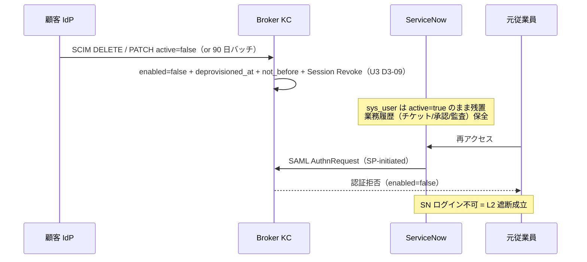
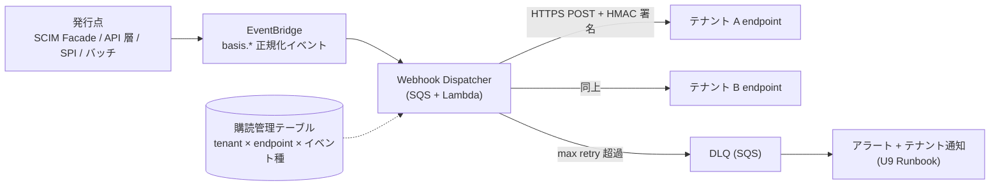
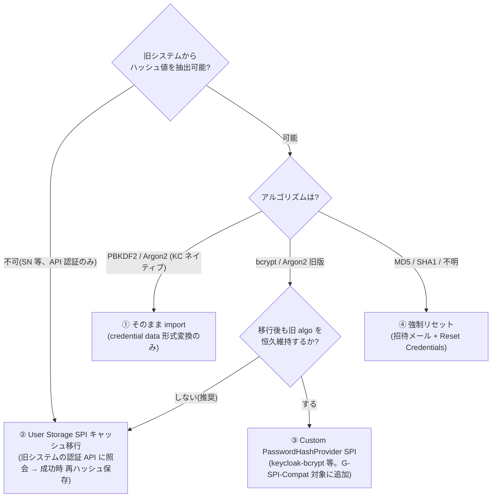

# U10: 周辺システム連携・移行設計（ServiceNow / ユーザ管理画面 API / Webhook / 既存システム移行 / DSAR）

作成日: 2026-07-24
ステータス: Draft v1.1（Wave 3）
**前提: [01-architecture-baseline.md](01-architecture-baseline.md) Baseline v1（P-01〜P-18、特に P-06 / P-08 / P-13 / P-14 / P-17 / P-18）**
上位文書: [00-basic-design-plan.md](00-basic-design-plan.md) §U10

---

## 10.0 背景・なぜここで決めるか（スコープ・境界）

### 10.0.1 背景

Wave 1/2 で本基盤の**内部機構**（U2 Keycloak 論理 / U3 プロビジョニング / U5 トークン・認可）は確定した。しかし基盤は単体では価値を生まない。「既存の ServiceNow に SSO で入れるか」「顧客テナント管理者が自分でユーザーを止められるか」「アプリが退職イベントを受け取れるか」「旧 IAM から強制 PW リセットなしで移れるか」——本基盤の採用可否は、この**外界との接続面**で判断される。

さらに Wave 1/2 から次の宙吊り事項が本単元に明示的に委ねられている:

1. **U3 D3-05 / U5 §5.8**: 専用 API 層（アプリ発 CRUD + 管理画面 Backend）の「OpenAPI 詳細は U10」（[U3 D3-05](03-identity-provisioning-design.md)、[U5 §5.9.2](05-token-session-authz-design.md)）。
2. **U4 D-U4-06 / §4.7.4**: エンタイトルメント API `GET /api/me/apps` のフィールド要件と、テナント管理者によるクレデンシャルリセット API の受け皿。
3. **U5 §5.5.2 / §5.9.1 #6**: ServiceNow への SAML SLO オプションの詳細設計は U10。
4. **U3 D3-10**: USER_DISABLED / USER_REACTIVATED / USER_DEPROVISIONED の**アプリ通知**（EventBridge → Webhook）の配信機構設計。
5. **[ADR-023 §L](../adr/023-servicenow-sp-integration.md)**: パターン ②（P-13 凍結）の Phase 1 実装スコープの基本設計化。

### 10.0.2 スコープと他単元との境界

| 領域 | 本書（U10） | 相手側 |
|---|---|---|
| **U3 ID・プロビジョニング** | **L2**（本基盤 → ServiceNow 等 SP）のプロビジョニング詳細、ユーザ管理 API の OpenAPI 化 | **L1**（顧客 IdP → 本基盤）のプロビジョニング一般（JIT/SCIM/ライフサイクル S1-S10 / SCIM Facade D3-11） |
| **U2 Keycloak 論理設計** | SN 向け SAML Client の仕様定義（本書 → U2 Client 定義群へ追加発行） | realm.json / Terraform 表現、Flow・SPI 実装 |
| **U5 トークン・認可** | API 層のリソース仕様・エラー体系（`idm:*` / `/api/me/*` の受け皿） | CC スコープ体系・テナント制約クレーム（§5.8 確定済み、本書は準拠） |
| **U4 UX** | エンタイトルメント API のスキーマ確定 | launchpad / Sorry の画面設計（D-U4-06/07） |
| **U7 セキュリティ** | Webhook の署名・監査要件、SAML 署名証明書の運用要求 | KMS/証明書ローテーション実装、ITDR、Event Listener SPI（emit 専任） |
| **U6 インフラ** | Webhook 配信先 Egress・SN 連携経路の**要求事項の提示** | REQ-IN-* / REQ-OUT-* 管理、配置・経路の実装 |
| **U9 運用** | Runbook 化すべき手順の特定（SN オンボーディング / 移行 / DSAR / Webhook 購読） | Runbook 本文・IaC・CI |

本書の決定は **D-U10-01〜D-U10-13** で採番する（一覧は §10.6）。

---

## 10.1 ServiceNow 連携設計（P-13: パターン ②）

### 10.1.1 全体構成の確定（D-U10-01）

**採用**: [ADR-023 §L](../adr/023-servicenow-sp-integration.md) の **パターン ②（L1 SCIM + L2 SAML JIT）** を Phase 1 標準構成として確定する（P-13 凍結値）。

| 層 | 内容 | 実装 |
|---|---|---|
| L1（顧客 IdP → 本基盤） | SCIM 受信（未対応 IdP は JIT） | **U3 の管轄**（D3-11 SCIM Facade / D3-07 JIT）。本書は関与しない |
| L2（本基盤 → SN） | **SAML 2.0 SSO + SN 側 SAML JIT**（`User Provisioning Enabled=Yes`） | 本書 §10.1.2〜10.1.6 |
| L2 SCIM Push | **Phase 1 スコープ外**。3 条件（超大企業 + 承認フロー事前設定必須 + 非 Entra IdP、ADR-023 §L.5）が揃う顧客のみ Phase 2 で個別検討 | — |

- **L2 は L1 混在を意識しない**（ADR-023 §L.7）: L1 の Case 1-6 混在（U3 §3.3）はブローカーが吸収し、SN には統一形式の SAML Response のみ届く。本書の SN 側設計に L1 経路分岐は**一切現れない**——これが 2-tier + ブローカーパターンの設計上の利得であり、本書が U3 と独立に書ける根拠でもある。
- **プロトコル**: SN L2 = SAML 維持、新規アプリ = OIDC（P-14、[saml-vs-oidc §16](../common/saml-vs-oidc-comparison.md) / ADR-023 §L.9）。SN セッション後の API 認可を SN の外に伸ばす場合は本基盤発行の JWT（OIDC）で貫通させる（ADR-023 §L.10）。
- **SSO の Egress 不要**: SAML HTTP-POST Binding は**ブラウザ経由**で Response を運ぶため、Broker → SN のサーバ間 Egress は SSO では発生しない（P-18 の Outbound 統制と衝突しない）。Egress が必要になるのは L2 SCIM Push（Phase 2）採用時のみ → その際は REQ-OUT-01 の FQDN リスト追加（U6 §6.7.3）。

### 10.1.2 Keycloak 側 SAML Client 定義（D-U10-02、U2 への追加発行 = CL-SN-01）

**採用**: SN インスタンス（= 顧客ごと）単位に SAML Client を 1 本発行する。U2 の Client 定義群（[02-keycloak-logical-design.md §2.2.3/§2.5](02-keycloak-logical-design.md)）は現状 OIDC のみのため、本書が **SAML Client テンプレート（本書採番 CL-SN-01。U9 禁則採番 K-\* との衝突回避のため旧 K5 から改称）** を新規定義し、U2/U9 に realm・IaC 反映を引き渡す。

| 設定項目 | 値 | 根拠 |
|---|---|---|
| Client 命名 | `sp-sn-<tenant>`（例 `sp-sn-acme`）。clientId = SP Entity ID `https://<instance>.service-now.com` | ADR-023 §F（メタデータ交換）。テナント別 SN インスタンスのため Client はテナント単位 |
| Protocol | `saml` | P-13 |
| Sign Assertions | `ON`（`saml.assertion.signature=true`）、Sign Documents `ON` | ADR-023 §F |
| 署名アルゴリズム | **RSA-SHA256** | SAML SP 側の互換標準（ADR-023 §F）。P-09 の ES256 は JWT 側の規約であり SAML には適用しない。Realm の SAML 用 RSA 鍵・証明書のローテーション設計は U7（ADR-045）へ要求 |
| NameID Format | `urn:oasis:names:tc:SAML:1.1:nameid-format:unspecified` | [servicenow-sso-user-linking-guide §5 Step 2](../reference/servicenow-sso-user-linking-guide.md)（以下 SN guide） |
| NameID 値 | `username` = **`<tenant>-<userid>` 全体**（例 `acme-EMP-001234`） | SN guide §4「NameID は全体、matching は属性で」。P-08 / U3 D3-01 |
| Force POST Binding | `ON`（HTTP-POST） | ブラウザ経由配送、Egress 不要（§10.1.1） |
| IdP-Initiated SSO | **無効**（`IdP Initiated SSO URL Name` を設定しない） | [ADR-057 §E.2](../adr/057-csrf-protection-responsibility-boundary.md)（IdP-initiated 拒否方針 + `RelayState` 悪用面の排除）。SN へは SP-initiated のみ |
| ACS URL | SN の SP メタデータから登録（`https://<instance>.service-now.com/navpage.do`）、**完全一致・ワイルドカード禁止** | U2 §2.2.3 と同一方針（Golden 系攻撃面最小化、ADR-060） |
| SLO エンドポイント | **登録しない（Phase 1）** | SAML SLO 不採用（U5 §5.5.2 確定）。テナント要求時のみ SP-initiated SLO を個別設計（§10.1.6） |

**Attribute Mapper（SAML Attribute Statement）**:

| # | SAML Attribute | 供給元（Broker） | 必須度 | 備考 |
|---|---|---|:---:|---|
| 1 | `employee_number` | `user_attribute.external_id`（Layer B **顧客生値**） | **必須** | Matching Field の第一推奨（§10.1.3）。`<tenant>-` プレフィックスを含まない生値がそのまま格納済み（U3 D3-01）のため**パース処理不要** |
| 2 | `email` | `user_attribute.email` | 任意 | email 保持テナントのみ（ADR-025 §I.3 Minimum Storage / U3 D3-02）。SN 側通知配信用 |
| 3 | `first_name` / `last_name` | user property | 任意 | Broker が保持する場合のみ。**JIT 作成を使うテナントには L1 SCIM で氏名を供給することを推奨**（未供給だと sys_user 表示名が空で作成される） |
| 4 | `department` / `manager` / `roles` | — | **Phase 1 非送出** | Broker は Shallow（ADR-033 / U3 D3-03: 多システム属性は `idmap`、Broker user_attribute に置かない）。組織属性の SN 反映は SN 側管理 or Phase 2 L2 SCIM Push（SN guide §8: Phase 1 は実装せず） |

- **代替案**: (a) NameID に `employee_number` 生値を載せ属性送出を省く — テナント越境時（同一 SN インスタンスを複数テナントで共用する変則構成）に一意性が崩れるため不採用。NameID = 基盤内一意の `username` を固定とする。(b) 全テナント共用の単一 SAML Client — SP Entity ID がインスタンスごとに異なるため不成立。
- **PII 整合の注記**: SAML Assertion への氏名・email 送出は JWT の PII 非搭載原則（P-10 / U5 §5.1.4）の対象外（宛先 SP 限定・署名付き・ブラウザ POST の point-to-point 配送）。ただし送出属性は上表の最小セットに限定し、追加はテナント個別審査とする。

### 10.1.3 sys_user JIT 作成と既存ユーザリンク（sys_id 保全）（D-U10-03）

**採用**: SN 側 Matching Field = **`employee_number` を第一推奨**とし、[SN guide §4](../reference/servicenow-sso-user-linking-guide.md) の判断フロー（embed 率 → `user_name` → カスタム属性 `u_keycloak_sub` → email）で顧客別に確定する（ゲート **B-SN-18**）。

| 項目 | 決定 |
|---|---|
| SN 側 User Field（matching field） | `employee_number`（= SAML Attribute #1 と突合）。**移行前に確定し、以後変更しない**（SN guide アンチパターン 2） |
| 既存ユーザ | matching 一致 → **既存 sys_user にリンク（sys_id 不変）**。過去のインシデント / 承認 / 監査履歴（`incident.caller_id` 等の sys_id FK）が全て保全される（SN guide §1） |
| 新規ユーザ（JIT） | `User Provisioning Enabled = Yes` で sys_user 自動作成。`user_name` = NameID、属性は Attribute Statement から | 
| 禁止事項 | ① 既存ユーザ削除 → JIT 再作成（sys_id 変化 = 履歴破壊）② matching field の後変更 ③ PW 無効化と SSO 有効化の間に隙間を作る（SN guide §2 アンチパターン 3 種） |
| 重複 sys_user | SSO 移行**前**に検出・統合（SN guide §7 の統合スクリプト方式、`sys_user.merge` 標準機能は稼働中非推奨）。件数・実施主体はゲート **B-SN-19** |
| `user_name` と Layer B の対応 | SN `user_name` = 本基盤 `username`（`<tenant>-<userid>`）で新規 JIT は統一。既存ユーザの `user_name` が別体系の場合は matching field 側（employee_number）で吸収し `user_name` は触らない | ADR-023 §C / §J-5 |
| `idmap` への登録 | SN 連携テナントは `idmap.id_mapping` に `system_code='servicenow'` / `system_user_id=<user_name>` を登録（SCIM Facade / 移行バッチ / API 層経由、U3 D3-03 の 3 経路限定に準拠）。監査横断（ADR-054 の目的 3）に使用 |

### 10.1.4 並走 4 Phase（Power-on → Pilot → 全社 → PW 無効化）（D-U10-04）

**採用**: [SN guide §6](../reference/servicenow-sso-user-linking-guide.md) の並走運用を次の 4 Phase に正規化し、テナント別オンボーディング Runbook（U9）の骨子とする。

| Phase | 名称 | 期間目安 | 内容 | 巻き戻し |
|---|---|---|---|---|
| **M0** | Power-on（準備・設定投入） | 1-2 週間 | 弊社: SAML Client（CL-SN-01）発行 + IdP メタデータ提供（提供 6 点セット、ADR-023 §F）。顧客: Multi-Provider SSO Plugin 有効化 + IdP 登録 + 属性マッピング + **`glide.authenticate.sso.mandatory = false` で並走モード起動**（強制 SSO はしない）。重複 sys_user 統合（B-SN-19）を**この Phase で完了** | 設定削除のみ |
| **M1** | Pilot | 2-4 週間 | Pilot 10-20 名のみ `sso_source = <IdP sys_id>` 設定。sys_id 不変・履歴表示・権限・Group Membership を受入テスト（§10.1.6 の T-1〜T-5） | `sso_source` クリアで即時 |
| **M2** | 全社 SSO 有効化 | 1-2 ヶ月 | 全ユーザに `sso_source` 一括設定（Break Glass 除外、SN guide §5 Step 4 スクリプト）。PW 認証も継続（フェイルオーバー）。`login_type != 'sso'` の未 SSO ログインを login_history で追跡しフォローアップ | per-user 単位で戻せる |
| **M3** | PW 無効化 | 1 ヶ月 | 全員の SSO ログイン成功を確認後、一般ユーザの PW 無効化 → 最終的に `glide.authenticate.sso.mandatory = true`。**Break Glass 管理者のみ残置**（§10.1.5）。PW 無効化と SSO 強制は同一 Change ウィンドウで実施 | mandatory=false へ戻す |

- 並走許容期間・Change Management 制約はゲート **B-SN-20**（推奨計 2-4 ヶ月）/ **B-SN-13**。顧客 SN 管理者の SAML 経験（**B-SN-12**）が「なし」の場合は ServiceNow Partner 支援を前提に工程を再見積もる。
- 責務分担は ADR-023 §F の分担表（弊社 = Keycloak 側 + 提供 6 点、顧客 = SN 側 8 項目）をそのまま採用し、Runbook に転記する（U9）。

### 10.1.5 Break Glass 管理者（D-U10-05）

**採用**: [ADR-023 §J-3-A](../adr/023-servicenow-sp-integration.md) / [SN guide §9](../reference/servicenow-sso-user-linking-guide.md) の業界標準構成を Phase 1 必須要件とする（ゲート **B-SN-16**）。

| 項目 | 決定 |
|---|---|
| 人数 | 2-3 名（`sn.breakglass.N` 命名） |
| 経路 | `sso_source` 空欄 + `side_door.do`（Keycloak 完全バイパス。Keycloak 障害時に SP が道連れにならないための最終防衛線） |
| 認証 | ローカル PW 20+ 文字（PW マネージャ保管）+ **Hardware MFA（SN ネイティブ）必須** |
| 統制 | IP 制限（SN IP Access Control）+ 使用時即時通知（SIEM 連携、U7）+ Change Request 起票 + 使用後 24h 以内 PW ローテ + 四半期ログインテスト |
| 位置付け | SN **ローカル完結**の緊急経路であり、本基盤の管理者 Break Glass（U7 管轄）とは独立。SSO routing は L1（グローバル）+ L2（per-user）の組合せで足りる前提（ADR-023 §J-3-B 推奨、追加粒度要件はゲート **B-SN-17**） |

### 10.1.6 削除連鎖と Logout の確定（L1 enabled=false → L2 遮断）（D-U10-06）

**採用**: 退職・無効化の L2 遮断は **L1 側 Soft Delete → SAML 認証拒否**の認証チェーンで実現し、L2 側 sys_user は残置する（削除の非対称性、ADR-023 §L.4/§L.6）。



| 論点 | 決定 | 根拠 |
|---|---|---|
| SN 既存セッションの残余 | Soft Delete 後も SN セッションは SN 側アイドルタイムアウトまで残る（SAML SLO 不採用のため）。**残余窓 = SN セッションタイムアウト設定値**であり、顧客契約説明に明記（U5 §5.2.4 ゾンビ窓 Z-1 の SN 版）。即時性要件が強いテナントは SN 側セッションタイムアウト短縮を案内 | U5 §5.5.2 |
| SAML SLO | **Phase 1 不実装**（成功率 60-80%・SOAP 複雑・1 SP の無応答がチェーンを壊す）。テナント明示要求時のみ SP-initiated SLO を個別設計（ゲート **B-APP-OIDC-3**） | U5 §5.5.2、saml-vs-oidc §14.3 |
| sys_user の後始末 | 残置 + 必要時に SN 側で inactive 化 / 匿名化（§10.5.4、ゲート **B-SN-6** / **B-SN-21**）。**PCI DSS 8.2.6 の監査独立性の観点で、本基盤側 Soft Delete は SN 側の状態に関わらず必須**（U3 D3-09 第 2 段階） | jit-scim §10.4.H.3 |
| Re-Activation | L1 側で復帰（U3 D3-12）すれば次回 SN アクセスで SAML 認証成功 = L2 も自動復帰。L2 側の操作は不要 | ADR-023 §L.7 |

**受入テスト（M1 Pilot の必須 5 点、SN guide §11 を正規化）**: T-1 既存ユーザリンク（sys_id 不変 + 履歴 10 件表示）/ T-2 JIT 新規作成（属性セット確認）/ T-3 **削除連鎖**（L1 Soft Delete → SAML 拒否 → Re-Activation → 復帰）/ T-4 Break Glass ログイン + 通知 / T-5 履歴非破壊 Regression（PA ダッシュボード・通知配信・代理承認）。

---

## 10.2 ユーザ管理画面 API 仕様（ADR-038 Phase 1 MVP）

### 10.2.1 アーキテクチャの確定（D-U10-07）

**採用**: ユーザ管理 API は **単一の OpenAPI 定義（`idm-api` v1）** とし、**2 デプロイメント**で提供する。

| デプロイ | 配置 | 利用者・経路 | 認可 |
|---|---|---|---|
| **管理画面 Backend** | Broker Acct（U1 §1.2） | テナント管理者 SPA（`admin.basis.example.com`、ADR-038）+ launchpad の `/api/me/*` | **ユーザ AT**（`tenant-admin` ロール + `tenant_id`） |
| **専用 API 層** | IdP-KC Acct（U3 D3-05 案 C） | 同居アプリの CRUD（経路 ⑤ `provisioned_by=app`）+ 移行バッチ | **Client Credentials**（`idm:*` スコープ + `allowed_tenants` クレーム、U5 §5.8） |

- **根拠**: U3 D3-05（案 C 確定: 属性規約・ガードレール・監査を API 層が不変条件として強制）+ U5 §5.8（CC スコープ確定済み）+ U7 §7.5.2（2 デプロイの Acct 分割は整合性レビュー済み）。**コードベースと OpenAPI は 1 本**にして仕様ドリフトを防ぎ、認可ミドルウェア（ユーザ AT 経路 / CC 経路）だけを差し替える。
- 対象 Keycloak: 管理画面 Backend は Broker KC + IdP-KC 両方の Admin API を叩く（ADR-038 §J、クロスアカウント経路は U6 D-U6-02 準拠）。専用 API 層は IdP-KC のみ。
- 実装形態（Lambda + API GW か ROSA 常駐か）は U3-OP-3 / U6 §6.8 の裁定に従う（本書は API 面のみ確定）。
- **A11y**: テナント管理者 SPA（Admin SPA）は ADR-043 の WCAG 2.2 AA + ATAG 2.0 準拠を実装要件とする（U4 §4.6 / §4.7.4）。

### 10.2.2 リソース一覧と OpenAPI 骨子（D-U10-08）

**採用**: ベースパス `https://api.basis.example.com/idm/v1`（ADR-038 §G の `api.basis.example.com/admin/*` を versioning 付きで正規化）。Phase 1 リソースセット:

| リソース | メソッド / パス | 対応スコープ（CC 経路） | 対応 MVP 機能（ADR-038 §C） |
|---|---|---|---|
| ユーザ検索・参照 | `GET /users?query=&external_id=&enabled=&cursor=` / `GET /users/{sub}` | `idm:users:read` | CRUD・検索 |
| ユーザ作成 | `POST /users`（`provisioned_by` は経路で自動決定: 管理画面 = `local-admin` / CC = `app` + `provisioned_app`） | `idm:users:write` | CRUD |
| 属性更新 | `PATCH /users/{sub}`（User Profile 宣言属性のみ受理、U3 D3-01。ライフサイクル属性の直接書換は**拒否**） | `idm:users:write` | 編集 |
| 無効化 / 再有効化 | `POST /users/{sub}/deactivate`（Soft Delete: `enabled=false` + `deprovisioned_at` + Session Revoke）/ `POST /users/{sub}/reactivate` | `idm:users:deactivate` / `idm:users:reactivate` | enabled/disabled トグル・退職処理 |
| **DELETE 動詞** | **提供しない（404 ではなく 405）** | —（`idm:users:delete` は Phase 1 非定義） | Phase 1 物理削除禁止の API 層での物理的強制（U3 D3-09 / U5 §5.8.1） |
| 招待 | `POST /invitations`（招待リンク発行）/ `GET /invitations` | —（管理画面経路のみ） | 招待リンク |
| クレデンシャル | `POST /users/{sub}/credentials/password-reset`（強制発行）/ `DELETE /users/{sub}/credentials/mfa`（MFA・Recovery Codes リセット、U4 §4.3.3 の受け皿）/ `POST /users/{sub}/unlock` | —（管理画面経路のみ。**U7 §7.6.1 L4 の JIT 承認経路を経由**） | PW リセット・MFA リセット・ロック解除 |
| ロール | `GET /roles` / `PUT /users/{sub}/roles`（**基盤ロール = `tenant-admin` 等の管理系のみ**。業務権限は対象外 — §10.2.3） | —（管理画面経路のみ） | 基本ロール管理 |
| Organization 管理 | `GET/PATCH /org`（alias・表示名）/ `GET/POST/DELETE /org/idps`（リンク IdP）/ `GET/POST/DELETE /org/domains` | `idm:orgs:read`（read のみ CC 開放） | Organization 管理（ADR-055 連動、Phase 1 必須） |
| エンタイトルメント（L1 ON/OFF） | `GET /entitlements?sub=` / `PUT /users/{sub}/entitlements`（アプリ利用可否の付与・剥奪） | —（管理画面経路のみ） | §10.2.3/§10.2.4 |
| 監査ログ照会 | `GET /audit-logs?actor=&target=&type=&from=&to=`（ログイン履歴 + 管理操作ログ、自テナント分のみ） | —（管理画面経路のみ） | 監査ログ |
| ID マッピング | `GET /idmap/{sub}` / `PUT /idmap/{sub}/{system_code}`（履歴行方式、U3 D3-03 DDL 準拠） | `idm:idmap:read` / `idm:idmap:write` | ADR-054 §C.3 の API 化 |
| セッション | `POST /users/{sub}/logout`（強制ログアウト = 全セッション削除 + L4 Back-Channel 発火、U5 §5.4.2） | `idm:sessions:revoke` | 即時遮断 |
| **ユーザ文脈（自分）** | `GET /api/me/apps`（§10.2.4）/ `GET /api/me/profile`（userinfo 補完: 表示名・テナント表示名） | 不要（自ユーザ AT、`aud-idm-api`。U5 §5.8.2 の認可モデル分離） | launchpad / Sorry 供給 |

**API 規約（全リソース共通）**:

| 項目 | 決定 |
|---|---|
| エラー体系 | RFC 9457（Problem Details）。`type` は固定辞書 URI、内部例外・スタックトレースの露出禁止 |
| ページング | カーソル方式（`cursor` + `limit ≤ 200`）。オフセット方式は 10M MAU 規模で不採用 |
| 冪等性 | `POST /users` 等の作成系は `Idempotency-Key` ヘッダ受理（重複作成防止、Webhook 再送と同じ思想 §10.3） |
| レート制限 | Client / テナント単位（初期値: 管理画面 10 req/s、CC 50 req/s。確定は U6 サイジングと同時） |
| 監査 | 全書込系で `actor（sub or azp）/ 対象 / 操作 / 理由コード` を EventBridge へ発行（U3 D3-05 の一元発行点。§10.3 の Webhook 源泉と共通） |
| OpenAPI 管理 | `idm-api.yaml` を Git 管理し CI で実装と契約テスト（詳細スキーマは Phase 1 実装時に本骨子から起こす） |

### 10.2.3 認可モデル: C ハイブリッドの実装（D-U10-09）

**採用**: [ADR-038 認可スコープ C 案ハイブリッド](../adr/038-tenant-admin-portal.md)を次の実装で確定する。

| 段階 | 内容 | 保存場所 | 露出面 |
|---|---|---|---|
| **L1 アクセス可否（ON/OFF）** | 「このユーザは経費精算アプリを使えるか」 | **管理画面 Backend DB のエンタイトルメントテーブル**（App Registry と同居、ADR-059 接続余地） | `PUT /users/{sub}/entitlements`（管理者）+ `GET /api/me/apps`（本人）。**JWT には載せない**（下記） |
| **L2 アプリ内詳細権限** | 「承認上限は 100 万円か」 | **各アプリ DB** | 本基盤は関与しない（§FR-6.0.A） |

- **ADR-038 の JWT `apps`/`roles` クレーム例は不採用**とし、本書で上書きする: U2 §2.5.4（業務アプリ Client に roles Mapper を付けない・Stage 1 最小クレーム）と U4 §4.4.3（launchpad は JWT roles でなくエンタイトルメント API で判定）が Wave 1/2 で確定済みのため、L1 ON/OFF は **JWT ではなく API 照会**で配る。アプリ側の L1 強制は「403 時に Sorry へ redirect」（U5 §5.6.6）+ 必要ならアプリ Backend からの `GET /entitlements` 照会で行う。
- **3 層テナントスコープ検証**（ADR-038 §E を本基盤スタックへ写像）:

| Layer | ユーザ AT 経路（管理画面） | CC 経路（専用 API 層） |
|---|---|---|
| L1 JWT 検証 | 署名 / `iss` / `exp` / `aud=idm-api`（U5 §5.6.3 の 6 点） | 同左 |
| L2 主体検証 | `tenant_id` クレーム + `tenant-admin` ロール（Stage 3 は管理系 Client 限定発行、U2 §2.5.4 と整合） | `idm:*` スコープ + 対象リソース tenant ∈ `allowed_tenants` クレーム（U5 §5.8.2） |
| L3 実行スコープ | Keycloak Admin API 呼出に **Organization フィルタを常時付与**（tenant_id → Org alias）。フィルタ不能な API は Backend 側で結果を再フィルタ | 同左 |

- 越境要求は 403 + 監査記録（ADR-038 §E）。テナント管理者の**自己 deactivate・自己ロール剥奪は拒否**（ロックアウト防止、最後の 1 名ガード）。
- Platform Admin（弊社運用者）は同 API を全テナントスコープで使用可能だが、入口は U7 §7.6.1 の JIT 昇格（`realm-admin-eligible/active`）経由に限定する。

### 10.2.4 エンタイトルメント API `GET /api/me/apps` の仕様確定（D-U10-10、U4 D-U4-06 の受け皿）

**採用**: launchpad / Sorry の表示判定 SSOT を本 API に確定する。

```jsonc
// GET /api/me/apps   （認可: 自ユーザ AT、aud-idm-api。idm:* スコープ不要）
{
  "tenant": { "id": "acme", "display_name": "Acme 株式会社" },
  "apps": [
    {
      "app_id": "expense",              // カタログ ID（Sorry の ?app= と同一名前空間、U4 §4.5.2）
      "name": "経費精算",
      "description": "出張・経費の申請と承認",
      "url": "https://expense.example.com/",   // タイル起動 URL
      "icon": "data:image/svg+xml;base64,...", // または基盤配信の相対パス
      "status": "entitled"              // entitled | requestable
    },
    {
      "app_id": "attendance",
      "name": "勤怠管理",
      "status": "requestable",          // 申請可能セクション（U4 §4.4.2）
      "request_url": "https://admin.basis.example.com/requests/new?app=attendance"
    }
  ]
}
```

| 項目 | 決定 |
|---|---|
| 判定根拠 | エンタイトルメントテーブル（§10.2.3 L1）。**B-627 の暫定回答**として「Backend DB 一元」を凍結し、回答受領時に本節のみ差し替え |
| `app_id` 名前空間 | App Registry（ADR-059）のカタログ ID と統一。Sorry の `?app=` / 403 reason 辞書（U5 §5.6.6）と同一 SSOT |
| キャッシュ | `Cache-Control: private, max-age=60`。剥奪の伝播は最大 60 秒 + アプリ側認可（Must、U4 §4.4.2）で防御 |
| `management` タイル | `tenant-admin` ロール保有時のみ `apps[]` に管理画面タイルを含める（ADR-038 導線） |
| 申請ワークフロー | Phase 1 は `request_url` への誘導のみ（申請・承認フローは ADR-037/038 Phase 3 の Access Request） |

### 10.2.5 監査ログ照会の供給元

**採用**: `GET /audit-logs` の供給元は **EventBridge → 専用監査ストア（DynamoDB、ADR-038 §D）**とする。U7 の監査 Acct OpenSearch/S3（基盤側 SSOT・長期保管）とは分離し、テナント開示用に「当該テナントのログイン履歴 + 管理操作ログ」だけを射影して保持する（顧客への生ログ直開放を避ける — マスキング済み・保持期間はゲート **B-TAP-10**、デフォルト 1 年）。

---

## 10.3 Webhook 配信機構（D-U10-11）

### 10.3.1 位置付け

**採用**: [§FR-9.3.0.A](../requirements/proposal/fr/09-integration.md) の「**基盤は対応（Must）、顧客アプリは選択（Should）**」スタンスを実装確定する。SCIM（inbound、U3）と Webhook（outbound）は方向が真逆の補完関係であり、U3 D3-10 の L3 責任分界（「アプリは `sub` 主 ID + 通知受信で Role 剥奪を実施」）の**通知面の実装**が本節である。

### 10.3.2 イベント辞書 v1（Phase 1）

**採用**: 顧客配信イベントは **EventBridge 上の正規化イベント（`basis.*`）を SSOT** とし、Keycloak の raw イベントを直接顧客に流さない（内部イベント名・内部属性の契約化を防ぐ）。

| イベント | 発生源（emit 点） | ペイロード要点 | 既定 |
|---|---|---|:---:|
| `user.created` | SCIM Facade（U3 §3.5）/ API 層 / JIT = First Broker ログインイベント（**Event Listener SPI 経由 — U7 D-U7-04 emit 専任原則**） | `sub` / `tenant_id` / `provisioned_by` / `external_id` | ✅ |
| `user.updated` | SCIM Facade / API 層 | 変更属性名リスト（**値は含めない** — PII 最小化） | ✅ |
| `user.disabled` | SCIM Facade / 90 日バッチ / API 層 deactivate / 管理者操作（= Soft Delete、U3 D3-09 第 2 段階） | `sub` / `reason`（`scim_deprovision` / `inactive_90d` / `admin` / `app`） | ✅ |
| `user.reactivated` | Re-Activation SPI（USER_REACTIVATED、U3 D3-12）/ API 層 reactivate | `sub` / `route` | ✅ |
| `user.deleted` | **Phase 2 物理削除バッチのみ**（予約。Phase 1 は発生しない） | `sub`（他属性なし） | 予約 |
| `mfa.enrolled` / `mfa.removed` | Keycloak Admin/User Event → 正規化 Lambda | `sub` / `type`（webauthn/totp） | ✅ |
| `session.revoked` | 強制ログアウト API（U5 §5.4.2）/ ITDR L4 | `sub` / `scope`（user/tenant/realm） | ✅ |
| `auth.risk_detected` | ITDR Risk Engine（U7 §7.2） | **Phase 2**（検知辞書の安定後に契約化） | 予約 |
| `idp.enabled` / `idp.disabled` | オンボーディングパイプライン（U9 §9.7 完了 / IdP 無効化） | IdP 追加完了・無効化の顧客通知。**暫定: Phase 1 は user 系のみ、idp 系は Phase 2（U9 と合意済み）** | 予約 |
| `maintenance.scheduled` | 計画メンテ窓登録（U9 RB-PLT-03） | メンテ事前通知の**要否検討行**。同上（maintenance 系は Phase 2 — U9 と合意済み） | 予約 |

- ペイロードは `sub` を主キーとし PII を含めない（P-10 と同じ思想。アプリは必要属性を `/idm/v1/users/{sub}` で fetch-on-event）。イベント順序は**保証しない** — 受信側は `occurred_at` とリソース再取得で収束させる規約とする（RP 実装ガイドへ追記依頼、U5）。
- 発生源の大半は §10.2.2 の API 監査 emit・U3 §3.5 の Facade パイプラインと**同一の EventBridge 発行点**であり、Webhook のための新規 SPI は追加しない。Keycloak 側で不足する MFA 系のみ Event Listener SPI（U7 §7.4.1 の emit セット、emit 専任原則）から正規化 Lambda を経由する。

### 10.3.3 配信アーキテクチャ



| 項目 | 決定 | 根拠 |
|---|---|---|
| 署名 | `X-Basis-Signature: t=<unix>,v1=HMAC-SHA256(secret, t + "." + body)`。タイムスタンプ許容 ±5 分（リプレイ防止）。secret はテナント × endpoint 単位、Secrets Manager 保管、ローテーション時は 2 世代並走 | §FR-9.3（Stripe/GitHub モデル） |
| 冪等性 | `X-Basis-Event-Id`（発行時に確定する不変 ID）。受信側は event_id で重複排除（RP ガイド必須項目） | 同上 |
| リトライ | 指数バックオフ + jitter（1m → 5m → 30m → 2h → 6h、計 8 回 / 約 24h）。2xx 以外・タイムアウト 10 秒で再送 | 同上 |
| DLQ | 最終失敗は DLQ 保管（14 日）+ 運用アラート + テナント通知。**再送（replay）は Phase 1 = 運用オペ、Phase 2 = 管理画面/API**（ADR-038 Phase 5 の Webhook 設定 UI と同期） | ADR-038 §C |
| 購読管理 | テナント × endpoint × イベント種のフィルタ。**Phase 1 の登録・変更は申請ベース（弊社運用オペ + IaC）**、セルフサービス UI は Phase 5 | B-TAP-8 |
| 配信保証 | at-least-once。**Webhook は「即時性の改善」であり、最終防衛線は TTL（AT ≤30 分）+ アプリ側認可**という多層防御上の位置付けを契約に明記（Back-Channel Logout と同じ整理、U5 §5.5.4） | U5 |
| SLA | critical（`user.disabled` / `session.revoked`）は初回配信 < 1 分目標（ベストエフォート）。確定はヒアリング（§FR-9.3 TBD-A「重要イベントの SLA」） | §FR-9.3 |
| **Egress 制約（P-18）** | Dispatcher → 顧客 endpoint は他組織管理の Outbound（NWFW ドメインフィルタ）を通過する。**送信元・宛先とも REQ-OUT-01（Broker KC → 顧客 IdP）とは別物のため、REQ-OUT-01 の枠拡張 or 新 REQ-OUT-06（送信元 = Webhook Dispatcher、宛先 = 顧客アプリ endpoint）の起票を U6 へ依頼**する（§10.6.3）。購読登録 Runbook（U9 RB-TEN-07）に FQDN 追加手順を組み込む | U6 D-U6-13 |

- **代替案**: (a) Keycloak Event Listener から直接 HTTP POST（Phase Two 型）— リトライ・DLQ・購読管理を SPI 内に抱え込み KC の可用性と結合するため不採用。(b) 顧客側 EventBridge へのクロスアカウント連携 — AWS 利用顧客限定になるため標準は HTTPS Webhook とし、EventBridge 直結は大口オプション（Phase 2 検討）。

---

## 10.4 既存システム移行設計

### 10.4.1 移行方式マトリクス（D-U10-12）

**採用**: [ADR-019](../adr/019-existing-system-migration.md)（並走 + User Storage SPI）を基本設計として確定し、移行対象を**ユーザ集団の性質**で 4 分類して方式を割り当てる。

| # | 対象集団 | 方式 | 受け皿 KC | `provisioned_by` | PW の扱い |
|---|---|---|---|---|---|
| A | 旧 IAM の**フェデ済ユーザ**（顧客 IdP あり） | **JIT 移行**（IdP 連携を本基盤へ向け替え → 初回ログインで作成）or L1 SCIM 事前登録 | Broker | `jit` / `scim` | PW 移行不要（認証は顧客 IdP） |
| B | 旧 IAM の**ローカル PW ユーザ**（P-4 / SN-only 等） | **User Storage SPI 並走**（初回ログイン時にキャッシュ移行）を第一選択 | **IdP-KC**（P-07 γ: Broker のローカルは管理者のみのため） | 移行完了時 `realm_import` 相当 → 経路 ④/⑤ へ収束 | 初回ログインで新 algo 再ハッシュ（強制リセットなし） |
| C | **属性・ID マッピングのみ**必要な集団（未ログインでも登録したい） | **バルク import**（Realm Import / Admin API バッチ） | 両方 | `realm_import` | credential なしで作成、初回は SPI 経由 or リセット |
| D | **人事 DB（HRIS）起点**で統合する顧客 | ADR-054 の SCIM Push（D1 Facade、U3 §3.5）で初期投入 + 継続同期 | IdP-KC | `scim` | — |

- 切替単位 = **アプリ単位**（ロールバック容易、B-MIG-6 推奨）、並走期間 = **3〜6 ヶ月**（B-MIG-4。並走期間 = 全ユーザが一度はログインする期間、ADR-019 §B）。並走期は新旧の SSO セッションが独立となる旨を事前周知する（ADR-019 §D、B-616 連動）。
- バルク import 時のバックフィルは jit-scim §10.4.B.6 手順（`provisioned_by` 一括付与）に従い、**90 日バッチ・Re-Activation は `realm_import` を人間レビュー/拒否扱い**とする安全側規定（U3 D3-04）をそのまま適用する。
- SN-only ユーザ（B-SN-9/14）は本マトリクスの B（IdP-KC へ SPI 移行）を第一選択、多数残存時は ADR-023 §J-1 ④（SN ローカル残置、Keycloak 非移行）をテナント判断で許容（B-SN-15 のガバナンス回答に従属）。

### 10.4.2 PW ハッシュ互換判定フロー（Custom Hash Provider 要否）

**採用**: 移行方式 B/C の PW 持ち越しは次の判定フローで確定する（ADR-019 §B の 5 手段を決定木化）:



- **既定は ②（SPI キャッシュ移行）**: 旧 algo を Keycloak に持ち込まず、初回ログインで Argon2 再ハッシュ。③ Custom Hash Provider は「未ログインユーザが多く、並走期間内の踏破が見込めない + リセット不許容（B-MIG-10）」の場合のみ追加し、その場合 RHBK × upstream SPI 互換ゲート（G-SPI-Compat、Baseline §1.5）の検証対象に載せる。
- 判定入力はゲート **B-MIG-1**（現行ハッシュアルゴリズム）。00-plan §4 の「移行 PW ハッシュ調査票」は本フローの入力様式として U9 が Runbook 付録化する（項目: algo / パラメータ / salt 形式 / 抽出可否 / 件数 / 最終ログイン分布）。
- 並走終了時の未ログイン残ユーザは「強制リセット案内 or 削除」（ADR-019 制約）。削除は U3 D3-09 の Soft Delete に写像し、物理削除はしない（Phase 1 ガードレール準拠）。

### 10.4.3 ADR-054 5 Phase との接続 + `idmap` への旧 ID 記録

**採用**: [ADR-054](../adr/054-id-integration-strategy.md) の ID 統合 5 Phase（現状調査 → SoT 決定 → 基盤連携 → アプリ統合 → 旧 ID 廃止、約 1.5 年）を本移行のマスタースケジュールとし、本書の移行方式（§10.4.1）は Phase 3〜4 の実行手段に位置付ける。

| 項目 | 決定 | 根拠 |
|---|---|---|
| 旧システム ID の記録先 | **`idmap.id_mapping`**（`system_code = 'legacy_<system>'`、`created_by = 'migration'`、履歴行方式） | U3 D3-03。ADR-054 §C の「Aurora 補助」を移行にも適用 |
| ADR-019 の `legacy_user_id` JWT クレームは**発行しない** | 旧 ID を必要とするアプリは JWT `sub` を鍵に `GET /idmap/{sub}`（`idm:idmap:read`）で解決する | P-10（Stage 1 最小・PII 非搭載）+ U3 D3-03（idmap は JWT 非搭載・API 層経由）が ADR-019 の当該記述を上書き。**ADR-019 への追記をメインセッションに依頼**（§10.6.3） |
| 名寄せ（Identity Resolution） | ADR-054 §A.3 の手順（人事 DB 起点 + 手動レビュー）。結果を移行バッチが `idmap` に一括投入 | ADR-054 |
| 旧 ID の保持期間 | 暫定 = 永続保持（`retention_years` 到達の物理削除に同調して掃除）。確定はゲート **B-MIG-12**（U3-OP-6 と同一裁定） | U3 §3.7.3 |

### 10.4.4 ロールバック設計

**採用**: ADR-019 §D を確定値化する。

| 事象 | 手段 | 目標時間 |
|---|---|---|
| 特定アプリで認証エラー多発 | アプリの IdP/issuer 設定を旧 IAM へ戻す（config/DNS 切替） | **1 時間以内**（B-MIG-8 推奨） |
| 移行バッチの不整合 | バッチは**冪等**（externalId 突合で再実行安全）+ 実行前 Aurora スナップショット + PITR（U3 §3.4 ガードレール第 4 層） | 再実行 or PITR |
| `idmap` 不整合 | 履歴行方式のため旧行が残る — 再生成 or 該当ユーザのみ修正 | 個別 |
| SN 連携の巻き戻し | §10.1.4 の Phase 別手段（`sso_source` クリア / mandatory=false） | per-user 即時 |

### 10.4.5 B-MIG ゲート追跡表

| ゲート | 内容 | 本書の暫定値 | 影響節 | 状態 |
|---|---|---|---|:---:|
| **B-MIG-1** 🔴 | 現行 PW ハッシュ algo | 不明前提 → ② SPI キャッシュ移行 | §10.4.2 | ⬜ 未通過 |
| **B-MIG-2** 🔴 | サインアップ所在・承認フロー | β 共通基盤集約（ADR-019 §C） | §10.4.1 | ⬜ 未通過 |
| **B-MIG-3** 🔴 | 移行アプローチ | B 並走 | §10.4.1 | ⬜ 未通過 |
| **B-MIG-4/6/7/8** | 期間 / 切替単位 / 旧 IAM 維持責任 / ロールバック目標 | 6 ヶ月 / アプリ単位 / 要合意 / 1h | §10.4.1/§10.4.4 | ⬜ 未通過 |
| **B-MIG-5** 🔴 | 顧客内ローカル+フェデ混在 | 混在あり前提（A+B 併用） | §10.4.1 | ⬜ 未通過 |
| **B-MIG-9/10/11** | 規模 / リセット許容 / サインアップ UI | — / 回避優先 / β | §10.4.1/§10.4.2 | ⬜ 未通過 |
| **B-MIG-12** 🟢 | 旧 user_id 保持期間 | 永続（retention_years 同調） | §10.4.3 | ⬜ 未通過 |
| **B-SN-9/10/14/15** 🔴 | SN-only ユーザ規模・PW 移行・残置許容 | SPI 移行第一選択、④ は回答次第 | §10.4.1/§10.1 | ⬜ 未通過 |

---

## 10.5 DSAR（データ主体権利、ADR-048）の Phase 1 実装範囲（D-U10-13）

### 10.5.1 Phase 分割の確定

**採用**: [ADR-048](../adr/048-data-portability-subject-rights.md) の「4 経路 × 6 権利」フレームワークを維持しつつ、Phase 1 は**手動運用（Runbook）+ 既存 API の組合せ**に限定する。

| 構成要素（ADR-048） | Phase 1 | Phase 2+ |
|---|---|---|
| 経路 ① テナント管理者経由（主導線） | ✅ 受付 = 管理画面外の申請（メール/チケット）→ **弊社運用 + テナント管理者の Runbook 実行** | 管理画面内 DSAR 管理画面（ADR-048 §E） |
| 経路 ②（Subject 直接ポータル）| ❌ | `account.basis.example.com/rights`（ADR-048 §F） |
| 経路 ③ 法定書面 / ④ DPO 直接 | ✅ いずれもテナント管理者経由（①）に収束させる | 同左 |
| DSAR Workflow Backend（Step Functions + SLA 自動監視、ADR-048 §D） | ❌（チケット管理 + 手動 SLA 追跡: GDPR 30 日 / APPI 実運用 14 日目標） | ✅ API 化・自動化 |
| Cryptographic Erasure（テナント別 L3 CMK 削除） | ❌ | 大規模顧客オプション（ADR-045 §A.4） |

- **根拠**: ADR-048 の Backend/UI は ADR-038 Phase 2+ 機能に依存し、Phase 1 MVP（§10.2）の面積を守るため。B2B（全ユーザが顧客従業員）では DSAR 件数が B2C 比で極小であり、手動運用が SLA 内で成立する。件数が月 10 件を超えた時点を Phase 2 前倒しトリガーとする。

### 10.5.2 6 権利の Phase 1 実現手段

| 権利 | Phase 1 の実現手段 |
|---|---|
| Access（開示）/ Portability | **エクスポート Runbook**: Admin API + `idmap` 照会で **JSON（ADR-048 §B.1 スキーマ準拠）** を生成、IdP 移転用は **SCIM 2.0 形式**（§B.2）。生成はスクリプト化（U9）、`password_hash` 等の秘匿値は非含有 |
| Rectification（訂正） | `PATCH /users/{sub}`（§10.2.2）+ 訂正履歴は監査ログで担保 |
| **Erasure（削除）** | **Soft Delete（U3 D3-09 第 2 段階）+ 監査ログの仮名化（ADR-048 §C.3）で対応**。物理削除は行わない（下記整合） |
| Restriction（処理制限） | `POST /users/{sub}/deactivate`（Suspend、データ保持のまま） |
| Object（処理拒否） | 手動対応（第三者提供は Phase 1 では Turnstile 等の限定的なもののみ — ADR-048 §B.1 processing_info） |

- **Erasure と Phase 1 物理削除禁止の整合**: ADR-048 の「論理削除 30 日 → 物理削除」は、U3 D3-09（Phase 1 物理削除禁止 + 4 層ガードレール + `deprovisioned_at` 起算の Phase 2 バッチ）が**後発の確定決定として優先**する。Phase 1 の Erasure 請求は「Soft Delete + 表示属性の仮名化（`[Anonymized-xxxxxx]`、`sub`/監査 FK は保持）」で応答し、物理削除は Phase 2 バッチ（`retention_years` 起算）に統合する。この解釈は APPI/GDPR 上も成立する（監査・法的義務による保持は Art.17(3) 除外事由。B-SN-21 の推奨 B と同型）。**ADR-048 §C への注記追記をメインセッションに依頼**（§10.6.3）。
- **SN 側の DSAR 連動**: SN `sys_user` の匿名化（SN guide §10 スクリプト）は**顧客 SN 管理者の責務**とし、弊社は手順書提供 + 実施記録の受領のみ（Shared Responsibility、ADR-037）。
- **証跡**: 全 DSAR 対応を監査ログ 7 年保管（受領 / 本人確認 / 実施 / 完了通知。U7 の監査 Acct 保管体系に載せる）。月次レポート（ADR-048 §G.2）は Phase 2。

---

## 10.6 決定一覧・未決事項・他単元への引き渡し

### 10.6.1 決定一覧（D-U10 サマリ）

| # | 決定 | 節 | 主根拠 |
|---|---|---|---|
| D-U10-01 | SN 連携 = パターン ②（L1 SCIM + L2 SAML JIT）確定。L2 SCIM Push は Phase 1 外（3 条件時のみ Phase 2）。SSO はブラウザ経由で Egress 不要 | §10.1.1 | P-13、ADR-023 §L |
| D-U10-02 | SAML Client `sp-sn-<tenant>`（CL-SN-01）: NameID=`username` 全体 / `employee_number`=`external_id` 生値送出 / RSA-SHA256 / IdP-initiated 無効 / SLO 未登録 | §10.1.2 | ADR-023 §F、ADR-057 §E.2、U3 D3-01 |
| D-U10-03 | Matching Field = `employee_number` 第一推奨 + sys_id 保全（アンチパターン 3 種禁止）+ JIT 属性最小セット + `idmap` へ SN ID 登録 | §10.1.3 | SN guide §1-§4、B-SN-18/19 |
| D-U10-04 | 並走 4 Phase（M0 Power-on → M1 Pilot → M2 全社 → M3 PW 無効化）、`mandatory=false` 起動・同一 Change ウィンドウでの PW 停止 | §10.1.4 | SN guide §6、B-SN-20 |
| D-U10-05 | SN Break Glass 2-3 名（`sso_source` 空欄 + side_door + HW MFA + IP 制限 + 即時通知） | §10.1.5 | ADR-023 §J-3-A |
| D-U10-06 | 削除連鎖 = L1 Soft Delete → SAML 認証拒否で L2 遮断（sys_user 残置）。SAML SLO Phase 1 不実装、残余窓 = SN セッションタイムアウト。受入テスト T-1〜T-5 | §10.1.6 | ADR-023 §L.4/L.6、U5 §5.5.2 |
| D-U10-07 | ユーザ管理 API = 単一 OpenAPI `idm-api` v1 × 2 デプロイ（Broker Acct 管理画面 Backend / IdP-KC Acct 専用 API 層） | §10.2.1 | U3 D3-05、U5 §5.8、U7 §7.5.2 |
| D-U10-08 | Phase 1 リソースセット確定（users/invitations/credentials/roles/org/entitlements/audit-logs/idmap/sessions/me）+ DELETE 動詞 405 + RFC 9457 + カーソルページング | §10.2.2 | ADR-038 §C、U3 D3-09 |
| D-U10-09 | 認可 C ハイブリッド実装 = L1 ON/OFF は Backend DB エンタイトルメント（**JWT 非搭載**、ADR-038 の apps/roles クレーム例を上書き）+ 3 層テナントスコープ検証の経路別写像 | §10.2.3 | ADR-038 §E、U2 §2.5.4、U4 §4.4.3 |
| D-U10-10 | `GET /api/me/apps` スキーマ確定（entitled/requestable、app_id = Sorry・App Registry と同一名前空間、max-age 60s） | §10.2.4 | U4 D-U4-06、B-627 暫定 |
| D-U10-11 | Webhook = EventBridge 正規化イベント（`basis.*`）SSOT + HMAC 署名 + event_id 冪等 + 指数バックオフ 8 回 + DLQ。イベント辞書 v1 = 7 種 + 予約 4 種（idp / maintenance 系は Phase 2）。配信先 FQDN は REQ-OUT-01 枠拡張 or 新 REQ-OUT-06 の起票を U6 へ依頼 | §10.3 | §FR-9.3、U3 D3-10、U6 §6.7.3 |
| D-U10-12 | 移行 = 4 集団別方式マトリクス + PW ハッシュ判定フロー（既定 = User Storage SPI キャッシュ移行、Custom Hash Provider は条件付き）+ 旧 ID は `idmap` 記録（**`legacy_user_id` JWT クレーム不発行** = ADR-019 上書き）+ アプリ単位ロールバック 1h | §10.4 | ADR-019/054、U3 D3-03、P-10 |
| D-U10-13 | DSAR Phase 1 = 手動運用（JSON/SCIM エクスポート + Soft Delete + 仮名化）。Workflow Backend / Subject ポータル / Cryptographic Erasure = Phase 2。Erasure は U3 D3-09 が ADR-048 §C に優先 | §10.5 | ADR-048、U3 D3-09 |

### 10.6.2 未決事項 + ゲート追跡

**ヒアリングゲート（本書該当分。[hearing-checklist.md](../requirements/hearing-checklist.md) と同期）**:

| ゲート | 内容 | 本書の暫定値 | 影響節 | 状態 |
|---|---|---|---|:---:|
| **B-SN-1/2/8** | SN 連携範囲・規模・他 SaaS SP 予定 | SN のみ・SSO+JIT | §10.1 全体 | ⬜ |
| **B-SN-3** 🔴 | L1/L2 4 パターン選択 | パターン ② | §10.1.1 | ⬜ |
| **B-SN-4/5/6/7** | プロトコル / user_name 体系 / 退職時 sys_user / Plugin 状況 | SAML / Layer B 一致 / 残置 / 要確認 | §10.1.2-3/§10.1.6 | ⬜ |
| **B-SN-12/13/16/17/20** | SN 管理者経験 / Change リードタイム / Break Glass / routing 粒度 / 並走期間 | — / — / 2-3 名 / L1+L2 / 2-4 ヶ月 | §10.1.4-5 | ⬜ |
| **B-SN-18** 🔴 / **B-SN-19** 🔴 | Matching Field 選定・埋込率 / 重複 sys_user | employee_number / M0 で統合 | §10.1.3-4 | ⬜ |
| **B-SN-21** | 退職者匿名化要件 | B（匿名化）推奨 | §10.1.6/§10.5.2 | ⬜ |
| **B-SN-9/10/11/14/15** 🔴 | SN-only ユーザ・PW 移行・残置許容 | SPI キャッシュ移行 / 一般無効化 + Break Glass 残置 | §10.4.1 | ⬜ |
| **B-MIG-1〜12** | 移行系一式 | §10.4.5 の表 | §10.4 | ⬜ |
| **B-APP-OIDC-1** 🔴 | 新規アプリ OIDC 標準の確定 | OIDC 標準（P-14 凍結値の追認） | §10.1.1 | ⬜ |
| **B-APP-OIDC-2** | 既存 SAML アプリの OIDC 移行方針 | SAML 継続可（サーバサイド Web）/ SPA・API 化時は OIDC 移行 | §10.4.1 | ⬜ |
| **B-APP-OIDC-3** | Logout 方式（SP SLO 範囲） | SN SLO なし、要求時のみ SP-initiated | §10.1.6 | ⬜ |
| **B-TAP-1〜10** | 管理画面の要否・機能範囲・監査保持等 | ADR-038 推奨値（自作 / Phase 1 MVP / 単一サブドメイン / 監査 1 年） | §10.2 | ⬜ |
| **B-627** 🔴 | launchpad 表示判定根拠 | Backend DB エンタイトルメント一元 | §10.2.4 | ⬜ |

**本書の未決事項（新規）**:

| # | 未決事項 | 暫定 | 決定トリガー |
|---|---|---|---|
| U10-OP-1 | SAML 用 RSA 鍵・証明書のローテーション周期と SN 側再登録手順（2 証明書並走の可否） | 年 1 回 + 2 世代並走 | U7 ADR-045 設計時 |
| U10-OP-2 | Webhook critical イベントの配信 SLA 値 | < 1 分目標（ベストエフォート） | §FR-9.3 TBD-A 回答 |
| U10-OP-3 | エンタイトルメントテーブルと App Registry（ADR-059）のスキーマ統合 | 同居・同一 `app_id` 名前空間 | U9 の Canary Blueprint 設計時 |
| U10-OP-4 | 管理画面 Backend の監査ストア（DynamoDB）と U7 監査 Acct の二重書きの整合方式 | EventBridge から二又配信 | U7/U9 実装設計時 |
| U10-OP-5 | DSAR Phase 2 前倒しトリガー（月 10 件超）の妥当性 | 月 10 件 | 運用実績 3 ヶ月 |
| U10-OP-6 | オンボーディング承認 UI（U9 §9.7 ステップ 2）を idm-api / 管理画面 Backend に共用するか | 共用（ADR-038 Backend 基盤共用） | U9 §9.7 / Phase 1 実装設計時 |
| U10-OP-7 | `canary-central-readonly` Client のスコープ設計（読取専用 audience の付与規約） | U5 §5.8 のスコープ規約に準拠 | U9 D-U9-16 / Phase 1 実装時 |
| U10-OP-8 | Admin API SLO にユーザ管理画面 API（idm-api）を含める境界 | idm-api は Admin API SLO（99.5%）区分に含める | U9 §9.2 と合同確定 |

### 10.6.3 他単元・メインセッションへの引き渡し

**U2 へ**: SAML Client テンプレート CL-SN-01（§10.1.2 の設定表 + Attribute Mapper 4 種）を Client 定義群・realm IaC へ追加。SAML 用 Realm 鍵（RSA）の宣言追加。
**U3 へ**: D3-04 表への行追加依頼 — `provisioned_by=legacy_spi`（User Storage SPI 並走期間の暫定値。**90 日バッチ対象外・Re-Activation は人間レビュー扱い**）。移行完了時に `realm_import` 相当へ収束（§10.4.1 B 集団）。
**U5 へ**: RP 実装ガイドへの追記依頼 — ① Webhook 受信の必須実装（署名検証 / event_id 冪等 / 順序非保証 + fetch-on-event）② エンタイトルメント剥奪の伝播遅延（≤60 秒）を前提としたアプリ側認可の維持。
**U6 へ**: ① Webhook 配信先の Egress 要求 — **REQ-OUT-01（Broker KC → 顧客 IdP）とは送信元・宛先とも別物のため、枠拡張 or 新 REQ-OUT-06（送信元 = Webhook Dispatcher、宛先 = 顧客アプリ endpoint）の起票を依頼**（§10.3.3）② `api.basis.example.com`（idm-api）の公開経路 — **REQ-IN-12 として U6 §6.7.1 への予約採番を依頼** ③ L2 SCIM Push（Phase 2）採用時の SN 向け Egress 予約。
**U7 へ**: ① SAML RSA 証明書ローテーション設計（U10-OP-1）② Webhook secret の Secrets Manager 運用・ローテーション ③ DSAR 対応ログの監査 Acct 保管（7 年）④ Break Glass 使用時の SIEM 通知受信。
**U9 へ**: Runbook 化 5 本 — ① SN オンボーディング（M0〜M3 + 提供 6 点セット + 受入テスト T-1〜T-5）② Webhook 購読登録（FQDN Egress 申請込み）③ 移行実行（PW ハッシュ調査票 + バッチ + ロールバック）④ DSAR 対応（エクスポート / 仮名化スクリプト + SLA 追跡）⑤ SN Break Glass 定期テスト。
**メインセッション（ADR 追記）**: ① ADR-019 — `legacy_user_id` JWT クレームを廃し `idmap` + API 参照へ（D-U10-12 が根拠）② ADR-048 §C — Phase 1 Erasure = Soft Delete + 仮名化、物理削除は U3 D3-09 Phase 2 バッチへ統合（D-U10-13 が根拠）③ ADR-038 — 冒頭 JWT `apps`/`roles` クレーム例に「U10 D-U10-09 で上書き（エンタイトルメントは API 照会）」の注記 ④ ADR-023 — Phase 1 実装スコープ（§L.8）に本書 §10.1 を実装先として追記。
**スコープ外（法務・契約）**: 契約書テンプレート反映（U7 §7.9: Responsibility Matrix / PCI DSS 12.9.2 acknowledgment / MFA 責任分界）は本書スコープ外 — メインセッション経由で法務・契約タスクへ返却する。

---

## 改訂履歴

- 2026-07-24: 初版（Wave 3 起草）。Baseline v1（P-13/P-14/P-17/P-18）前提。ServiceNow パターン ② の基本設計化（SAML Client K5 / Matching Field / 並走 4 Phase / Break Glass / 削除連鎖 T-1〜T-5）、ユーザ管理 API `idm-api` v1（単一 OpenAPI × 2 デプロイ / C ハイブリッド実装 / `GET /api/me/apps` 確定）、Webhook 配信機構（`basis.*` 正規化 + HMAC + DLQ + REQ-OUT-01 連動）、移行設計（4 集団マトリクス / PW ハッシュ判定フロー / idmap 旧 ID 記録 / `legacy_user_id` クレーム廃止）、DSAR Phase 1 手動運用の範囲確定（D-U10-01〜13）。
- 2026-07-24 (v1.1): Wave 3 最終レビュー反映 — **H-3**: 未決に U10-OP-6（オンボーディング承認 UI の Backend 共用）/ U10-OP-7（`canary-central-readonly` スコープ設計）/ U10-OP-8（Admin API SLO 境界）の 3 件追加、§10.3.2 に `idp.enabled/disabled`・`maintenance.scheduled` の予約 2 行追加（Phase 1 は user 系のみ — U9 と合意済み）。**M-4**: §10.3 の Egress を REQ-OUT-01 流用から「枠拡張 or 新 REQ-OUT-06 起票を U6 へ依頼」に修正（U6 引き渡しにも追加）。**M-5**: idm-api 公開経路に REQ-IN-12 予約採番依頼を明記。**M-6**: U3 への引き渡し新設（`provisioned_by=legacy_spi` の D3-04 行追加依頼）。**M-13**: §10.2.1 に Admin SPA = WCAG 2.2 AA + ATAG 2.0 準拠（ADR-043 / U4）を追記。**M-14**: 契約書テンプレート反映のスコープ外明記（法務・契約タスクへ返却）。**L-2**: SAML Client テンプレート採番 K5 → CL-SN-01 改称（U9 禁則 K-\* との衝突回避、参照 5 箇所追随）。**L-3**: §10.1.6 見出しの括弧混在修正。**L-4**: 出典 U3 §3.7.4 #4 → U3 D3-05。**L-5**: `user.created` の JIT 発生源を First Broker ログインイベント（Event Listener SPI 経由、U7 D-U7-04 emit 専任原則）に修正。
