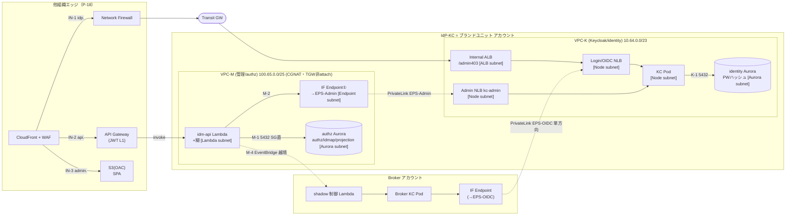

# ブランドユニット 2-VPC 分離トポロジ（B案）— 構成図用 詳細

- **日付**: 2026-08-18
- **種別**: research note（構成図の一次資料。U6 §6.2 / 06a §A.6 / ADR-062・063 の実装詳細）
- **決定**: 単一 VPC（A案・アンチパターン）→ **2 VPC 分離（B案）を採用**（[single-vpc-consolidation-risk](single-vpc-consolidation-risk-2026-08-18.md) の 8 リスク評価に基づく）。ブランドユニット（IdP-KC アカウント）内を **VPC-K（Keycloak/identity）** と **VPC-M（管理/authz）** に分割。
- **前提**: [ADR-062](../../adr/062-idm-api-execution-form-lambda.md)（idm-api=Lambda・1 本）/ [ADR-063](../../adr/063-brand-unit-architecture.md)（ブランド主役・A+C）/ [ADR-064](../../adr/064-deprovisioning-propagation-outbox.md)（削除 outbox）/ [D-U6-06](../06-infra-network-design.md)（PrivateLink 単方向）/ [rosa-vpc-ip-conservation](rosa-vpc-ip-conservation-2026-08-17.md)（ENI・CIDR）
- ⚠ P-17（Broker/IdP-KC の 2 クラスタ構成）は別スレッドで再検討中。本ノートは「ブランドユニット内の VPC セグメンテーション」を扱い、上位のアカウント/クラスタ数が確定したら CIDR 実値のみ差し替える。

---

## 1. 2 VPC の役割（IdP-KC = ブランドユニット アカウント内）

| VPC | 役割 | 機微度 | ROSA 管理 | TGW attach | CIDR（例） |
|---|---|---|---|---|---|
| **VPC-K（Keycloak/identity）** | ROSA クラスタ（Keycloak）＋ **identity Aurora（PW ハッシュ）** ＋ Admin/OIDC 内部 NLB | **P0・最高機微** | ○ | **要**（idp. ログイン inbound が TGW 経由） | `10.64.0.0/23`（Transit-routable） |
| **VPC-M（管理/authz）** | **idm-api Lambda（1 本）**＋非同期の糊 Lambda ＋ **authz Aurora** ＋ Interface Endpoint 群 | P1・管理面 | × | **不要**（api. は API GW→Lambda invoke で VPC 非経由） | `100.65.0.0/25`（**CGNAT 可＝TGW 非広告で隠蔽**） |

> **要点**: VPC-M は **inbound を持たない**（api. は CloudFront→API GW→Lambda ネイティブ invoke で VPC ルーティング外）。Lambda ENI は **outbound 専用**（authz Aurora / Admin API PrivateLink / AWS サービス Endpoint）。→ **TGW 非 attach でよく、CIDR を CGNAT にして Transit から完全に隠せる**（[IP 節約ノート](rosa-vpc-ip-conservation-2026-08-17.md)の"隠蔽アイランド"）。

---

## 2. サブネット × リソース（AZ ごと ×3）

### VPC-K（`10.64.0.0/23`）
| サブネット | サイズ/AZ | リソース | 備考 |
|---|---|---|---|
| **TGW attach** | /28 | TGW ENI | idp. ログイン inbound の入口 |
| **ALB** | /27 | Internal ALB（L7・`/admin` 403） | ログイン前段。TGW から到達 |
| **Node** | /26（or CGNAT secondary） | ROSA worker（KC Pod・IngressController）／ **Login/OIDC NLB**（internal）／ **Admin NLB**（internal, `kc-admin`） | Pod は OVN オーバーレイ（VPC IP 非消費） |
| **Aurora** | /28 | **identity Aurora**（PW ハッシュ） | KC Pod のみ到達 |
| **Endpoint** | /27 | ROSA egress 用 IF/Gateway Endpoint（ECR/STS/S3/Logs/KMS/HIBP/SES） | zero-egress（O-10） |

### VPC-M（`100.65.0.0/25`）
| サブネット | サイズ/AZ | リソース | 備考 |
|---|---|---|---|
| **Lambda** | /27 | **idm-api Lambda ENI**／非同期の糊 Lambda ENI（outbox リレー・射影フィード・Webhook Dispatcher・idmap/projection ハンドラ） | Hyperplane ENI（1/AZ/SG） |
| **Endpoint** | /27 | **IF Endpoint①（→VPC-K Admin API EPS）**／AWS サービス IF・Gateway Endpoint（Secrets/KMS/Logs/STS/EventBridge/SQS/S3） | Admin API＋zero-egress |
| **Aurora** | /28 | **authz Aurora**（authz/idmap/projection） | idm-api Lambda のみ到達 |

---

## 3. 接続一覧（フロー ID × 経路 × プロトコル × PrivateLink 有無）

### Inbound
| ID | 経路 | プロトコル | PL |
|---|---|---|---|
| IN-1 | ブラウザ →(他組織)CF+WAF → **NFW → TGW** → VPC-K[TGW] → VPC-K[ALB: `/admin`403] → VPC-K[Node: Login/OIDC NLB] → KC Pod（idp. ログイン UI） | HTTPS | — |
| IN-2 | ブラウザ → CF+WAF → **API GW（JWT L1+throttle）→ Lambda ネイティブ invoke**（idm-api、VPC-M） | HTTPS | — |
| IN-3 | ブラウザ → CF+WAF → **OAC → S3**（admin./launchpad. SPA） | HTTPS | — |

### idm-api（VPC-M）outbound
| ID | 経路 | プロトコル | PL |
|---|---|---|---|
| M-1 | idm-api Lambda[VPC-M Lambda] → **authz Aurora[VPC-M Aurora]**（同一 VPC・SG 直） | 5432 | — |
| M-2 | idm-api Lambda[VPC-M] →(Route53 PHZ 解決)→ **IF Endpoint①[VPC-M Endpoint]** → **PrivateLink（EPS-Admin）** → **Admin NLB[VPC-K Node, `scheme=internal`]** → IngressController → **KC Admin API Pod**（CRUD） | 443（TLS 終端=IngressController／アプリ層認証=管理クライアント資格） | **○** |
| M-3 | idm-api/糊 Lambda[VPC-M] → **AWS IF/Gateway Endpoint[VPC-M Endpoint]** → Secrets Manager（資格）/ KMS / Logs / STS | 443 | （AWS PL） |
| M-4 | outbox リレー Lambda[VPC-M] → authz Aurora outbox[VPC-M] → **EventBridge IF Endpoint[VPC-M]** → EventBridge bus →（越境）Broker | 443 | （AWS PL） |

### 越境（Broker アカウント ↔ VPC-K / VPC-M）
| ID | 経路 | 種別 | PL |
|---|---|---|---|
| X-1 | **フェデ backchannel**：Broker KC Pod[Broker VPC] →(PHZ)→ IF Endpoint[Broker VPC] → **PrivateLink（EPS-OIDC）** → **Login/OIDC NLB[VPC-K Node]** → KC OIDC（token/jwks/userinfo、`idpkc-oidc01`、[D-U6-06](../06-infra-network-design.md)） | Broker→IdP-KC 単方向 | **○** |
| X-2 | **初回 sub 通知**：Broker → EventBridge →（越境）→ ブランドハンドラ Lambda[VPC-M] → authz Aurora（authz スタブ生成） | EventBridge | — |
| X-3 | **削除伝播**（=M-4 の続き）：idm-api → outbox → EventBridge →（越境）→ **Broker shadow 制御 Lambda** → Broker Admin NLB → Broker KC（shadow `enabled=false`、[ADR-064](../../adr/064-deprovisioning-propagation-outbox.md)） | EventBridge | — |

### VPC-K（ROSA）egress
| ID | 経路 | 備考 |
|---|---|---|
| K-1 | KC Pod → identity Aurora[VPC-K Aurora]（SG 直） | 5432・intra-VPC |
| K-2 | worker → AWS（ECR/STS/S3/Logs/KMS）＝ VPC-K Endpoint | zero-egress |
| K-3 | worker → registry.redhat.io/quay/OLM ＝ **ECR ミラー（zero_egress）** or NAT→NFW | O-10 |
| K-4 | KC → HIBP / SES | NFW egress |

---

## 4. Security Group（誰から誰へ・最小権限）

### VPC-K
| SG | ingress | egress |
|---|---|---|
| `sg-kc-pod` | Login/OIDC NLB・Admin NLB から | → `sg-identity-aurora`(5432) / VPC-K Endpoint(443) / 外部(K-3/4) |
| **`sg-identity-aurora`** | **5432 ← `sg-kc-pod` のみ** | — |
| `sg-login-oidc-nlb` | ALB(ログイン)／EPS-OIDC エンドポイント(X-1) から | → `sg-kc-pod` |
| `sg-admin-nlb` | **443 ← EPS-Admin エンドポイント(M-2) のみ** | → `sg-kc-pod`(IngressController) |
| `sg-alb` | TGW/エッジから | → `sg-login-oidc-nlb` |

### VPC-M
| SG | ingress | egress |
|---|---|---|
| `sg-idmapi-lambda` | （invoke は Lambda サービス経由・VPC ingress なし） | → `sg-authz-aurora`(5432) / `sg-adminapi-endpoint`(443) / `sg-aws-endpoint`(443) |
| **`sg-authz-aurora`** | **5432 ← `sg-idmapi-lambda` のみ** | — |
| `sg-adminapi-endpoint`（IF Endpoint①） | 443 ← `sg-idmapi-lambda` | （PrivateLink） |
| `sg-aws-endpoint` | 443 ← `sg-idmapi-lambda` | （PrivateLink） |

> **キー不変条件**: **idm-api Lambda（VPC-M）は identity Aurora（VPC-K）へのルートも SG 許可も持たない**。Keycloak へは **EPS-Admin（Admin API）経由のみ**で、Admin API は PW ハッシュを返さない。→ **管理面が全侵害されても PW ハッシュに到達不能・クラスタ網スキャン不能・VPC-K からの逆流不能**（PrivateLink 単方向）。

---

## 5. PrivateLink Endpoint Service 一覧

| EPS | provider（NLB） | consumer | 許可 principal | 用途 |
|---|---|---|---|---|
| **EPS-OIDC** | VPC-K Login/OIDC NLB（internal） | Broker VPC の IF Endpoint | **Broker アカウント**（`acceptance_required=true`） | フェデ backchannel（X-1、Broker→IdP-KC OIDC） |
| **EPS-Admin** | VPC-K Admin NLB `kc-admin`（internal） | VPC-M の IF Endpoint① | **同一アカウント（IdP-KC/brand）** | idm-api → Keycloak Admin API（M-2、CRUD） |

- **provider 側 NLB を 2 本に分離**（OIDC と Admin を別 EPS/別 NLB）＝ Admin API を OIDC/ログイン面から隔離（最小到達）。
- PrivateLink は **consumer→provider の接続開始のみ単方向**（provider は逆に接続を張れない）。DNS は各 consumer VPC の **Route 53 Private Hosted Zone** で `idp-admin.internal…` / `idp-oidc.internal…` を IF Endpoint に Alias。

---

## 6. 構成図（mermaid）

---

## 7. 現行（A案・単一 VPC）からの差分

| 項目 | A案（現行 06 ベースライン） | B案（本ノート・採用） |
|---|---|---|
| idm-api Lambda ENI | クラスタ VPC の層③（同居） | **VPC-M（別 VPC）** |
| authz Aurora | クラスタ VPC 内（A+C 内部分離） | **VPC-M** |
| identity Aurora | クラスタ VPC 内 | **VPC-K（KC Pod のみ到達）** |
| idm-api → Admin API | intra-VPC 内部 NLB | **PrivateLink（EPS-Admin）単方向** |
| idm-api → identity Aurora | 同一 VPC（SG で遮断） | **ルートも SG も無し（構造遮断）** |
| Transit IP | VPC 全体が routable | **VPC-M は CGNAT/TGW 非 attach で隠蔽** |
| ブラスト半径 | SG 設定 1 枚に依存（ソフト） | **VPC＋PrivateLink 単方向（構造）** |

> **idm-api は 1 本のまま**（VPC を分けても Lambda は分けない）。CRUD＋authz のオーケストレーションは 1 実行内・outbox 1Tx アンカーを維持（[ADR-062 案 C/D 却下](../../adr/062-idm-api-execution-form-lambda.md)）。
