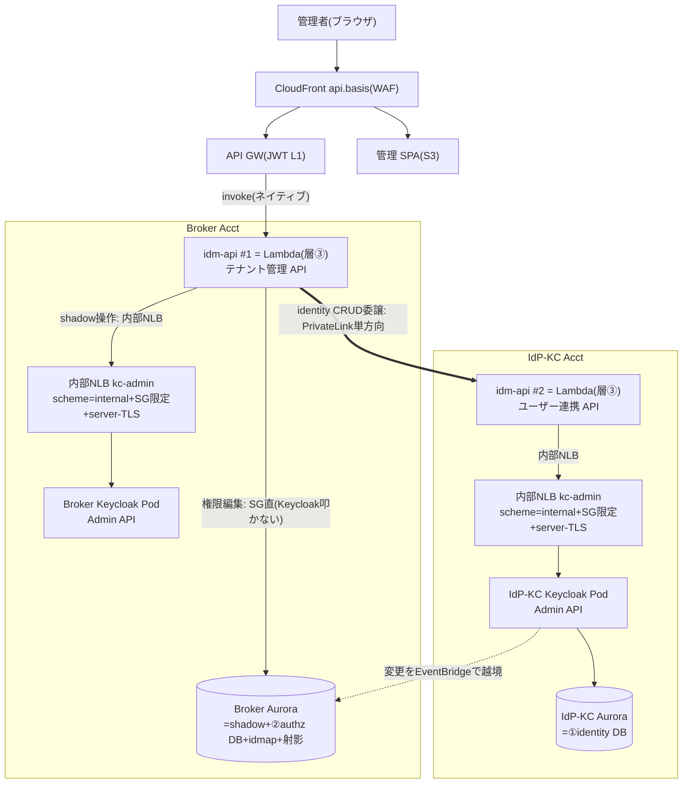
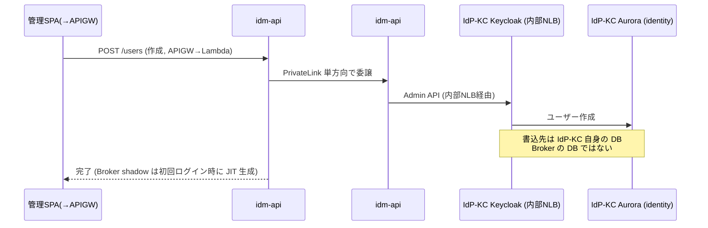
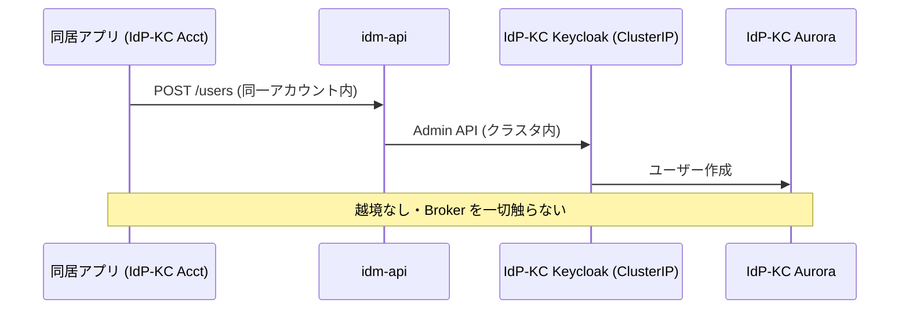
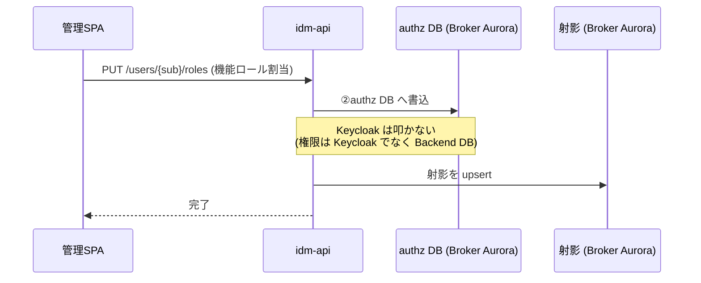
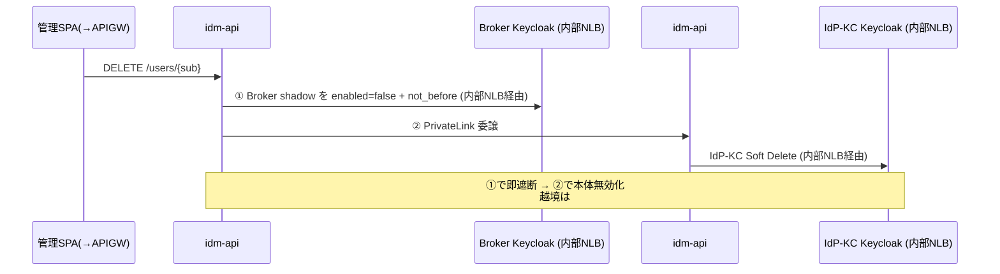

# 検討ノート: コントロールプレーンの CRUD / 権限編集フロー（誰が・どの DB を・どの Keycloak を叩くか）

日付: 2026-08-05 /    
起票理由: ユーザー検討（「ユーザー CRUD はアプリが IdP・DB はブローカーと理解しているが、IdP アカウントの Lambda から Broker Keycloak Pod を叩くのか？   権限編集はどこから叩くのか。図で表現してほしい」）。E（アカウント配置）/ F（実行形態）の理解整理。  
関連: [idp-kc-user-mgmt-authz-boundary-notes.md §8](idp-kc-user-mgmt-authz-boundary-notes.md)、[03-identity-provisioning-design.md](../03-identity-provisioning-design.md)（D3-14/17）、[10-integration-migration-design.md §10.2](../10-integration-migration-design.md)（D-U10-07 idm-api ×2）、[06-infra-network-design.md](../06-infra-network-design.md)（D-U6-06 PrivateLink 単方向 / D-U6-11 Admin API in-cluster）、[idm-api-ingress-execution-comparison-notes.md](idm-api-ingress-execution-comparison-notes.md)（実行形態×ingress の 3 案比較・ROSA サポート境界・mTLS）、[attribute-canonicalization-notes.md](attribute-canonicalization-notes.md)（属性正準化）、[me-context-projection-comparison-notes.md](me-context-projection-comparison-notes.md)（射影 vs 都度 join）。

## 1. 最重要の前提：「DB」は 2 つあり別物

CRUD と権限編集は**叩く DB も Keycloak も全く別**。ここを混同すると経路が分からなくなる。

| DB | 何を持つ | アカウント | 誰が書くか | Keycloak を叩くか |
|---|---|---|---|---|
| **① identity DB**＝**IdP-KC の Keycloak Aurora** | ユーザー本体（アカウント）| **IdP-KC Acct** | ユーザー CRUD | ✅ IdP-KC Keycloak（自アカウント）|
| **② authz DB**＝**Backend DB** | 権限（エンタイトルメント・機能ロール割当）| **Broker Acct** | 権限編集 | ❌ Keycloak を叩かない |

**帰結**:
- **ユーザー CRUD の書込先は「Broker の DB」ではなく「IdP-KC 自身の Keycloak（同じ IdP-KC アカウント）」**。
- **「Broker の DB」は権限（authz）専用**で、CRUD とは別フロー。
- **IdP アカウントのサービスが Broker Keycloak を叩くことは無い**（P-17：逆方向の Admin API 到達を作らない）。ユーザー CRUD は IdP-KC アカウント内で完結する。
- **Broker Keycloak を叩くのは idm-api #1 の "Broker shadow 操作"（遮断/復活）だけ**、しかもローカル ClusterIP。

## 1.5 登場する画面/アプリと配置の決定（E 反映、2026-08-06）

> **実行形態 = Lambda に確定（[ADR-062](../../adr/062-idm-api-execution-form-lambda.md)、O-9 決定）**。以下の図・フローは Lambda 前提。

**画面は 1 枚、バックエンドのアプリは 2 つ、同居アプリは別物（Phase 1 対象外）**：

| もの | 種類 | 置き場所 | 役割 |
|---|---|---|---|
| **管理 SPA** | 人の画面（1 枚）| CloudFront/S3 | **ユーザー管理タブ + 権限管理タブ**（"2 画面" でなく 1 SPA の 2 タブ）|
| **idm-api #1（テナント管理 API）** | **Lambda**（ADR-062）| Broker Acct・VPC 層③ | **唯一の front door** |
| **idm-api #2（ユーザー連携 API）** | **Lambda**（ADR-062）| IdP-KC Acct・VPC 層③ | **内部 executor（①からのみ呼ばれる）** |
| **同居アプリ** | プログラム（M2M）| 非推奨（App Acct へ）| 経路⑤ CRUD。Phase 1 対象外 |

**決定（本セッションの議論の反映）**：
- **入口は①に一本化**（人＝SPA も 機械＝アプリも①を叩く）。**②は内部 executor**。**経路⑤（②直・同居）は①経由へ寄せて実質廃す**（権限は①の authz DB にしかなく、②直では権限を扱えないため）。
- **認可 DB＝Broker**：federated は IdP-KC にレコードが無く、**全 population 共通キー `sub` を持つのは Broker だけ**。P-17 のホットパス越境回避 + idmap 集約も Broker。
- **編集アプリ＝authz API の呼出側**でどこで動いてもよい（DB を IdP 側へ動かす必要はない）。
- **IdP-KC＝隔離した自前アカウント（VPC 分割でなくアカウント分割）**：PW ハッシュのブラスト半径のため。**業務アプリを同居させない**。
- **SPA は 1 枚のまま capability 適応**（CRUD タブは hosted のみ活性、federated はグレー）。2 SPA 化は mixed テナントで逆効果。

## 2. 構成図（Lambda 前提、ADR-062）

- **idm-api は Lambda**（ADR-062）。**Keycloak Admin API へは各クラスタの内部 NLB（`scheme=internal` + SG を Lambda SG に限定 + server-TLS + アプリ層認証）で到達**（ClusterIP 単独方針 D-U6-11 を本用途に限り見直し）。
- **Ingress**：`CloudFront(api.) → API GW(JWT L1) → Lambda ネイティブ invoke`（VPC Link/NLB を ingress に挟まない）。SPA は CloudFront/S3。
- **越境は 2 本だけ**：`#1 → #2`（PrivateLink 単方向、D-U6-06）と `IdP-KC → Broker`（EventBridge、射影フィード）。
- **経路⑤（同居アプリ）は①経由へ寄せて実質廃す**（§1.5）ため図では省略。

## 3. フロー①：ユーザー作成（管理画面から、hosted ユーザー、経路④ `local-admin`）

- **Admin API を PrivateLink へ直接露出しない**（#1 は #2 を呼び、Admin API 書込は IdP-KC クラスタ内で完結、D-U6-06 §6.3.2）。

## 4. フロー②：ユーザー作成（アプリから、経路⑤・IdP-KC 内で完結）

- 経路⑤（`provisioned_by=app`）は D3-17 で **Phase 1 対象外**（モデルとして記載）。

## 4.5 補足：プロビジョニング経路④/⑤ の区別と「同居」の是非

### 経路④ と ⑤ は別物（"M2M か SPA か" は別経路）

手動系プロビジョニングは 2 経路あり混同しやすい（D3-04）：

| 経路 | 入口 | 誰が | 認証 | `provisioned_by` | 本ノートの図 |
|---|---|---|---|---|---|
| **④ 管理者作成** | **管理 SPA**（P-2 テナント管理ポータル / P-1 運用者）| 人間 | ユーザー AT | `local-admin` | **フロー①** |
| **⑤ アプリ発 CRUD** | **同居アプリ（プログラム）** | 機械（M2M）| Client Credentials | `app` + `provisioned_app` | **フロー②** |

- **SPA からの作成＝経路④（local-admin）**、**M2M アプリの作成＝経路⑤（app）**。**経路⑤は M2M 専用で SPA を含まない**。
- **経路⑤は Phase 1 対象外（D3-17）**。当面は経路④（SPA）のみ考えればよい。

### 「同居」の是非（P-17 前提の再考、2026-08-05）

- P-17 は「**同 Acct アプリからのユーザ CRUD 想定（変更可能性あり）**」＝**変更含みの前提**。
- **懸念**：IdP-KC は **PW ハッシュ**を持つ。業務アプリを IdP-KC アカウントに同居させると、**アプリ侵害のブラスト半径が credential ストアに及ぶ**（E の隔離論）。
- **推奨**：**アプリは App Acct に置き、CRUD は idm-api #1（Broker front door）を Client Credentials で呼んで #2 へ委譲**。→ **IdP-KC への新規 ingress 不要**（既存 Broker→IdP-KC PrivateLink 再利用）＋ **credential 隔離維持**。
- **Phase 1 は経路⑤ 自体が対象外**のため当面 moot。ただし**設計前提を "同居しない" 方向に倒しておく**（P-17 の「同居前提」を緩める提案）。

### hosted / federated の分離（CRUD は hosted 専用）

- **CRUD（作成/削除）は本質的に hosted 専用**。federated は顧客 IdP が作成/削除するため CRUD 不可 → **CRUD バックエンド（#2/IdP-KC）は既に "hosted 専用"** 経路、federated 管理（shadow 遮断 + 権限編集）は **Broker（#1）**。**別 tier・別アカウントで既に分離済み**。
- **画面（管理 SPA）は 1 つのまま**、出自で操作を出し分け（CRUD タブは hosted のみ活性、federated はグレー）。**2 SPA 化は mixed テナントで逆効果**（capability 適応の結論）。

## 5. フロー③：権限編集（どこの何から叩くか）

- **管理 SPA → idm-api #1（Broker）→ authz DB（Broker Aurora）**。**Keycloak は叩かない**。
- **federated ユーザーの権限もここで編集**（sub をキーに Broker 側で完結。federated は IdP-KC にレコードが無いため、共通キー sub を持つ Broker が唯一の紐付け先＝E の結論）。

## 6. フロー④：削除（二面同期）

- 順序（① Broker shadow 先）は D3-17。IdP-KC 単独無効化では Broker がトークンを出し続けるため、① が実アクセス遮断。

## 7. まとめ（E/F の核心）

- **ユーザー CRUD**：**IdP-KC アカウント内で完結**（`#2 → IdP-KC Keycloak → IdP-KC Aurora`）。**Broker Keycloak は叩かない**。管理画面起点のときだけ `#1 → #2` を PrivateLink で 1 本越境。
- **権限編集**：**Broker 内で完結**（`#1 → authz DB`）。**Keycloak を叩かない**（権限は Backend DB）。
- **Broker Keycloak を叩くのは #1 の shadow 操作（遮断/復活）だけ**、内部 NLB 経由。
- **実行形態 = Lambda（ADR-062）**：idm-api #1/#2 は Lambda（層③）。Keycloak Admin API へは各クラスタの**内部 NLB（scheme=internal + SG 限定 + server-TLS + アプリ層認証）**で到達。決め手は **auth-critical な Keycloak クラスタ（P0）と管理ツール idm-api（P1）を別障害ドメインに分離**すること。

## 8. 未決（E/F 関連）

- **O-9**: **Lambda で確定（ADR-062）**。本ノートは Lambda 前提に更新済み。残る実装論点は内部 NLB の堅牢化（特に #2 = credential アカウント）。
- **O-12**: `#1 → #2` の内部ルート（PrivateLink NLB 上の内部リスナ）+ S2S 認可（CC scope）。
- **経路⑤ / EventBridge 削除経路**は Phase 1 対象外（D3-17）。射影フィード②は D1 SCIM E2E でのみ PoC 検証（G-SCIM）。
