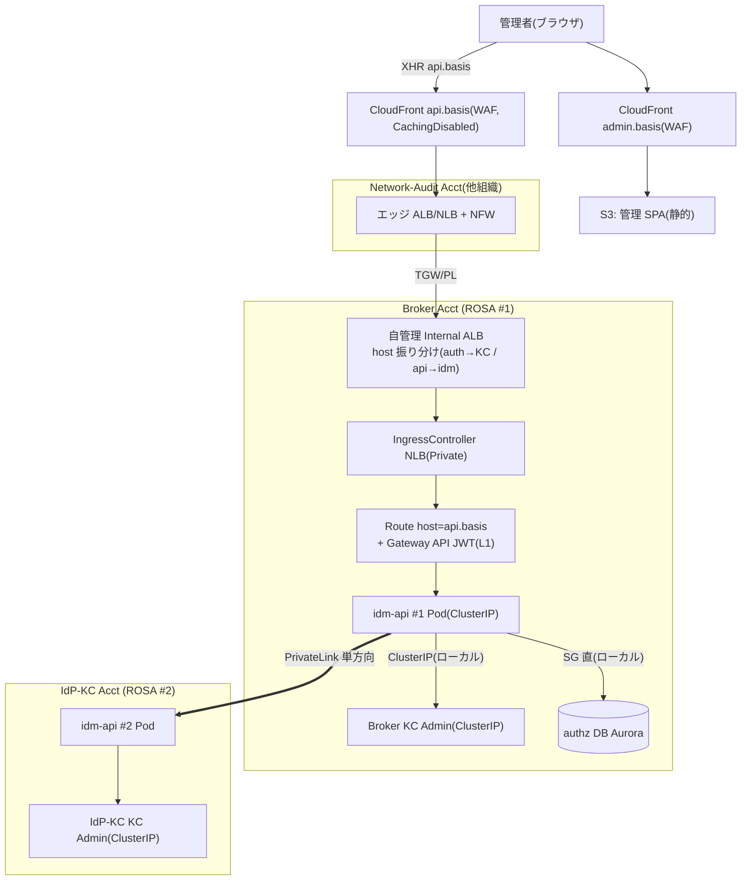
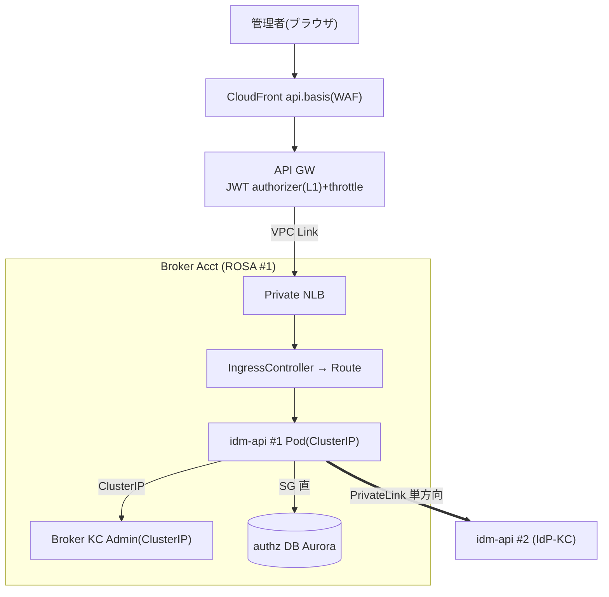
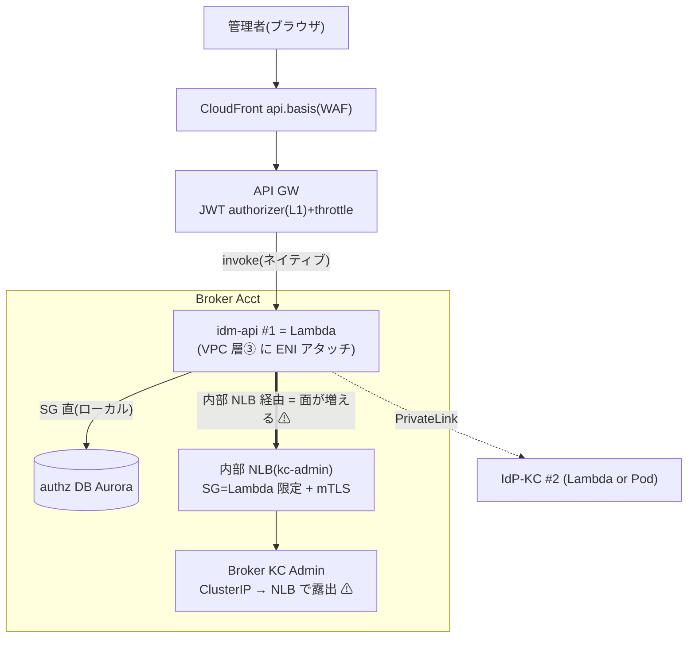

# 比較検討ノート: idm-api の実行形態 × ingress（A: ROSA Route / B: ROSA+API GW / C: Lambda）

日付: 2026-08-05 / 起票理由: ユーザー検討（「ROSA 同居 API はどう叩かれるか。API GW の裏に置けるか、LB になるか、認証と同じエンドポイントでパス違いか。Lambda も含め全パターンを構成図付きで比較したい」）。O-9（実行形態）の判断材料。
関連: [control-plane-crud-authz-flows-notes.md](control-plane-crud-authz-flows-notes.md)、[06-infra-network-design.md](../06-infra-network-design.md)（D-U6-06/11）、[06a-network-flow-diagrams.md](../06a-network-flow-diagrams.md)（§A.5 IP プラン層③）、[adr/038-tenant-admin-portal.md](../../adr/038-tenant-admin-portal.md)、[adr/057-csrf-responsibility-boundary.md](../../adr/057-csrf-responsibility-boundary.md)。

## 1. 目的と対象

idm-api（テナント管理 API #1 / ユーザー連携 API #2）を **どの実行形態で動かし、どう ingress するか**を 3 パターンで比較する。**#2 は #1 からしか呼ばれない内部 executor**（[control-plane ノート](control-plane-crud-authz-flows-notes.md)）なので、本ノートの ingress 論点は主に **#1（外から来る管理 API）**。

## 2. 全パターン共通の前提（ここが判断の軸）

| 前提 | 内容 | 効く所 |
|---|---|---|
| **Keycloak Admin API = ClusterIP** | クラスタ内 Pod ネットワークからのみ到達。外部 ALB は `/admin` を 403（D-U6-11）| **egress の難所** |
| **API GW は ClusterIP に直接届かない** | Pod を叩くには VPC Link → NLB が必要 | B の複雑さ |
| **越境は 2 本だけ** | `#1→#2`（PrivateLink 単方向）/ `IdP-KC→Broker`（EventBridge）| 全パターン共通 |
| **ホスト分離** | `auth.basis`（KC）/ `api.basis`（idm-api）/ `admin.basis`（SPA）。同一エッジをホスト名で振り分け（パス相乗りしない）| ingress 設計 |
| **idm-api が中で叩く先** | Broker KC=ClusterIP、authz DB=SG 直、#2=PrivateLink | 全パターン共通 |

---

## 3. パターン A：ROSA 常駐 + Route（既存 ingress 再利用）★推奨

**認証（KC）と同じ ingress チェーンに `api.` で相乗りし、L1 JWT はクラスタ内フィルタ（Gateway API / oauth2-proxy）。API GW を挟まない。**



- **Ingress**: エッジ → 自管理 Internal ALB（host=api）→ IngressController NLB → Route → Pod。**認証と同じ配管を共用**。
- **L1 JWT**: クラスタ内（Gateway API の JWT フィルタ / oauth2-proxy サイドカー）。
- **Egress（KC Admin API）**: **ClusterIP 直・露出なし**（同クラスタ内 Pod）。

---

## 4. パターン B：ROSA 常駐 + API GW（VPC Link）

**L1 JWT・スロットリング・WAF 統合を API GW で担う。ただし ClusterIP に直接届かないため VPC Link → Private NLB を挟む。**



- **Ingress**: API GW（JWT/throttle/WAF）→ VPC Link → Private NLB → IngressController → Pod。**ホップが増える**。
- **Egress（KC Admin API）**: **ClusterIP 直・露出なし**（A と同じ利点）。
- 公開 vs Private API GW（O-APP-1）の別がここに絡む。

---

## 5. パターン C：Lambda（API GW ネイティブ）

**Ingress は最短（API GW→Lambda ネイティブ invoke、NLB 不要）。ただし Lambda は Pod ネットワーク外なので、KC Admin API に届かせるには内部 NLB で露出が必要。**



- **Ingress**: **API GW → Lambda はネイティブ invoke**（VPC Link も NLB も不要）。3 案で最短。
- **Egress（KC Admin API）**: Lambda は VPC 内でも Pod ネットワークに居ない → **admin 用の内部 NLB を新設して露出**（`/admin 403` の Internal ALB は使えない）。**credential 隣接 API の面が広がる**。
- egress を避けるには「Admin API 手前のクラスタ内プロキシ」が要るが、**それは実質 idm-api を ROSA 常駐にするのと同義**（循環）。

---

## 6. 全項目比較

| 観点 | **A: ROSA Route（推奨）** | **B: ROSA + API GW** | **C: Lambda** |
|---|---|---|---|
| Ingress の複雑さ | 既存チェーン再利用 | API GW→VPC Link→NLB（多ホップ）| ◎ **API GW→Lambda ネイティブ（最短）** |
| L1 JWT | クラスタ内フィルタ（自前）| ◎ API GW authorizer | ◎ API GW authorizer |
| スロットリング / WAF 統合 | 自前（ingress/アプリ）| ◎ API GW 標準 | ◎ API GW 標準 |
| **KC Admin API 到達（egress）** | ◎ **ClusterIP 直・露出なし** | ◎ ClusterIP 直・露出なし | ✗ **内部 NLB で露出必要（面拡大）** |
| credential 隔離 | ◎ Admin API 非露出 | ◎ 非露出 | △ Admin を NLB に出す |
| cold start | なし | なし | あり（VPC アタッチ）|
| scale-to-zero | なし | なし | あり（管理系は薄く恩恵小）|
| VPC / Subnet | Worker 層① | Worker 層① | **層③ で ENI 消費** |
| cross-account #1→#2 | PrivateLink | PrivateLink | PrivateLink |
| CI/CD | GitOps 共通（F 設計）| GitOps + API GW | Lambda 別パイプライン |
| 認証と同一エンドポイント | 同一エッジ・別ホスト（`api.`）| 別系統（API GW）| 別系統（API GW）|

**注意：内部 NLB 露出は "インターネット面" の話ではない**（§6.1 で正しく重み付け）。C の ingress は最楽だが、A/B は既存 ingress・ClusterIP 直で最も素直。総合では A 推奨だが、**決め手は "露出" ではなく cold start / 運用一体性 / 並行 admin 経路の非新設**（§6.1）。

### 6.1 内部 NLB 露出の正しい重み付け（過大評価しない、2026-08-05 訂正）

- **インターネットの攻撃面は 3 パターンとも同じ**。idm-api の front door は必ずインターネットに出る一方、**Keycloak Admin API はどのパターンでもインターネットに出ない**（常に idm-api の後ろ）。**内部 NLB は VPC 内・SG 限定なので、インターネット経由の到達範囲は変わらない**。
- 差は "インターネット面" でなく **内部の到達可能性**：ClusterIP は **AWS ネットワークエンドポイントが存在しない**（クラスタ Pod ネットワーク内からのみ到達）。内部 NLB は **VPC ルータブルなエンドポイント**ができ、SG 許可の VPC ソースから到達。→ 差は **①内部ブラスト半径**（クラスタ内 vs VPC 内）と **②`/admin 403` を迂回する並行 admin 経路が増える**こと。
- **SG を Lambda の SG に限定 + mTLS すれば実運用上よく制御される**。**"内部 NLB 露出" だけで Lambda を却下するのは過大**。多層防御の細かな差にとどまる。
- したがって **ROSA を選ぶ本当の理由は "露出" ではなく**：① **cold start**（対話的な管理 UX、低トラフィックで毎回コールド）② **運用一体性**（Keycloak と同クラスタ・GitOps 共通）③ **並行 admin 経路を新設しない**（設定対象を増やさない）④ **#2 は credential アカウント側**（Pod 1 個の方が素直）。Lambda も SG+mTLS で防御可能な正当な選択肢。

## 7. ハイブリッド（推奨形）：ROSA と Lambda の役割分担

**「Keycloak を叩くか」で使い分ける**のが最適：

| 種類 | 実行形態 | 理由 |
|---|---|---|
| **idm-api #1/#2（Keycloak Admin API を叩く）** | **ROSA 常駐（パターン A）** | ClusterIP 直・露出なし・既存 ingress 再利用 |
| **非同期の糊（Keycloak を叩かない）**：射影フィードの EventBridge ハンドラ / Webhook Dispatcher / idmap 更新ハンドラ | **Lambda（層③）** | Aurora/EventBridge だけ・露出問題なし・サーバレスの強み |

- これは既存 IP プラン §A.5.3 層③（「Webhook Dispatcher λ / idmap 更新ハンドラ λ」）と一致。
- **同期の管理 API = ROSA / 非同期の糊 = Lambda** の分担。

## 8. 推奨と O-9 判断（2026-08-06 更新：Lambda で確定、[ADR-062](../../adr/062-idm-api-execution-form-lambda.md)）

> **決定 = パターン C（Lambda）**。以下は当初の比較所見（A 寄り）を残しつつ、最終判断を反映。

- **決定 = パターン C（Lambda）**（ADR-062、O-9）。**決め手 = auth-critical な Keycloak クラスタ（P0）と管理ツール idm-api（P1）を別の障害ドメインに分離**（デプロイ/資源/**クラスタ ライフサイクル**の完全分離）。
- 本比較で ROSA（A/B）が優位だった軸（cold start・ClusterIP 維持）は、**「NLB 露出は外部に効かない + SG/server-TLS/アプリ層認証で防御」「cold start は許容」**により受容可能と判断。**A'（ROSA + 専用ノードプール）は資源/デプロイ分離は満たすがクラスタ ライフサイクル同居が残る**ため不採用（将来 Lambda を退く場合の第一代替として保持）。
- **Lambda 構成**：Ingress = API GW ネイティブ invoke（JWT authorizer L1）、Keycloak Admin API = **内部 NLB（scheme=internal + SG 限定 + server-TLS + アプリ層認証）**、#1→#2 PrivateLink 単方向、**非同期の糊も Lambda（層③）**。
- 受容リスク・制約・代替の詳細は **ADR-062 を正**とする（§8.7 の ROSA 常駐 dev/release は不採用形態＝A' の参考として保持）。

## 8.5 ROSA サポート境界（自前アプリを載せてサポートは切れるか）

**結論：自前アプリ（idm-api・custom SPI・追加 IngressController・LoadBalancer Service 等）を worker に載せるのは ROSA の想定された使い方で、サポートは維持される**（共有責任モデル、[AWS ROSA responsibilities](https://docs.aws.amazon.com/rosa/latest/userguide/rosa-responsibilities.html) / [Red Hat: Who does what](https://www.redhat.com/en/blog/red-hat-openshift-service-aws-rosa-who-does-what)）。

- **Red Hat/AWS が保守**：コントロールプレーン（HCP は Red Hat アカウント側）・インフラノード・OS・プラットフォームのバージョン/アップグレード/セキュリティ。
- **顧客が責任**：アプリ・ワークロード・ユーザー・データ。**「顧客導入の Operator/ワークロードは customer workload 扱い（SRE 非管理）だが、それでクラスタのサポートが無効化されるわけではない」**（[Policies & service definition](https://docs.redhat.com/en/documentation/red_hat_openshift_service_on_aws/4/html/introduction_to_rosa/policies-and-service-definition)）。
- → 我々の載せ物（idm-api / custom SPI / Gateway API / oauth2-proxy / 内部 NLB Service / taint 付き Machine Pool）は**すべてサポート境界の内側**。

**サポートが除外/責任移転される操作（避ける）**：

| 操作 | 影響 | 対応 |
|---|---|---|
| **cluster-admin をユーザーに付与** | 特定のサポート除外（Red Hat EULA Appendix 4）| **dedicated-admin を使う** |
| **独自 CNI プラグイン** | 責任が顧客に移転 | **既定 OVN-Kubernetes のまま** |
| managed/reserved namespace（`openshift-*`）・managed operator の改変 | サポート外 | 自 namespace 内に閉じる |

**支援境界は 3 層**：① ROSA プラットフォーム（Red Hat+AWS）② RHBK 製品（Red Hat）＋ **custom SPI コードは我々（G-SPI-Compat）** ③ 我々のアプリ（idm-api＝完全に我々）。

**保守の兼ね合い**：アップグレード/パッチは Red Hat SRE が維持（HCP で手離れ）。**我々のアプリは drain 耐性（PDB+複数レプリカ+ローリング）を持つ**＝F の ROSA 常駐設計と一致。アップグレード窓は shared（我々が制御可能）。

**確認事項**：custom SPI/RHBK Operator 導入が dedicated-admin で足りるか（cluster-admin 相当が要る局面の特定）→ G-SPI-Compat / U6。Red Hat SRE の worker アクセス（break-glass）は G-DPA と連動。

## 8.6 mTLS の要点（Lambda 採用時の実務、2026-08-06 訂正）

**mTLS＝呼ぶ側も証明書を出す相互 TLS**。アプリ層（JWT/CC）の前に、**トランスポート層で相手を認証**（正しい CA 署名の証明書が無いと接続自体できない）。

**必要作業（6）**：① CA 用意（OpenShift Service CA / cert-manager / ACM Private CA）② サーバ+クライアント証明書発行 ③ 配布 ④ 両端設定（サーバ＝クライアント証明書必須）⑤ **自動ローテ（肝）** ⑥ 信頼/失効管理。

**ROSA vs Lambda の作業量差**：
- **ROSA 常駐（Pod 間）**：**OpenShift Service Mesh / Service CA が発行・検証・自動ローテを透過で肩代わり**（アプリ改修最小）。
- **Lambda**：**Secrets Manager 自動ローテは使える**（rotation Lambda + ACM PCA 発行 → Secret 更新、消費側は TTL 再ロード）。サーバは CA を信頼するのでクライアント証明書のローテにサーバ再設定は不要。ただし **rotation Lambda・再ロード・"NLB は L4 ゆえバックエンド終端要素" を自作/保守**。→ **前回の「手動で重い」は誇張。正しくは "自動化可・ただし自作パーツが増える"**。

**同一 VPC なら平文で良いか → 否**：Nitro（c7g/r7g/m7g）は同一 VPC 間を物理層で自動暗号化（AES-256）するが、**不透明・認証なしで "制御" として頼らない**。**credential 隣接（Admin API）は最低 TLS（サーバ）**、mTLS は **バックエンド終端で実装する上積み**（必須ではないが妥当）。3 段階＝平文（非推奨）/ TLS サーバのみ（同一 VPC のベースライン）/ mTLS（ゼロトラスト上積み）。

→ **総合**：mTLS も cold start・運用一体性と同様、**Lambda がやや重い一因**にとどまり決定打ではない。ROSA 常駐なら mesh でほぼ自動。

## 8.7 ROSA 常駐の開発・リリース（**不採用形態 A' の参考**、F 反映）

> ⚠ ADR-062 で **Lambda 採用**につき idm-api 本体では**不採用**。将来 A'（ROSA + 専用ノードプール）へ戻す場合の参考として保持。**採用形態（Lambda）の dev/release は §8.8**。非同期の糊（EventBridge ハンドラ / Webhook）は Lambda なので §8.8 に準じる。

既存 CI/CD（U9 D-U9-12: **GitHub Actions + ECR + OpenShift GitOps**）に載せる：

```
idm-api リポジトリ（OpenAPI-first・コード 1 本）
  → GitHub Actions（lint / unit test / OpenAPI 検証 / コンテナ build）
  → ECR（tag = git SHA）
  → OpenShift GitOps(ArgoCD) が manifests を 2 クラスタへ同期
      ├ Broker ROSA #1 ← overlay: テナント管理 API（管理画面 Backend 設定）
      └ IdP-KC ROSA #2 ← overlay: ユーザー連携 API（CC 認可・移行バッチ設定）
```

- **同一イメージ × Kustomize overlay 差分**（認可ミドルウェア・env だけ差し替え、D-U10-07 と整合）。
- 各クラスタの K8s オブジェクト：Deployment（default/infra Pool に nodeSelector、KC 専用 Pool と分離）/ Service(ClusterIP) / HPA + PDB(maxUnavailable=1) / ServiceAccount + **IRSA**（Aurora/Secrets）/ NetworkPolicy / **External Secrets(ESO)**。
- **Keycloak Admin API は ClusterIP 直**（穴あけ不要）。#1→#2 のみ PrivateLink 単方向。
- リリース：ローリング + PDB、必要なら Argo Rollouts カナリア。dev/stg/prod は namespace or クラスタ分離。
- **バッチ（移行・90 日）は #2 側 CronJob**（concurrencyPolicy: Forbid + advisory lock、U9 D-U9-17 同型）。
- **非同期の糊（射影フィード EventBridge ハンドラ / Webhook Dispatcher）は Lambda（層③）**＝別パイプライン（§7 の役割分担）。

## 8.8 Lambda の開発・リリース（採用形態、ADR-062）

```
idm-api リポジトリ（OpenAPI-first・コード 1 本）
  → GitHub Actions（lint / unit test / OpenAPI 検証 / コンテナイメージ build）
  → ECR（コンテナイメージ Lambda、tag = git SHA。ROSA と同じ ECR 資産管理）
  → SAM or CDK でデプロイ（2 アカウントへ、同一イメージ × env 差分 = D-U10-07）
      ├ Broker Acct : idm-api #1（テナント管理 API）+ 非同期の糊
      └ IdP-KC Acct : idm-api #2（ユーザー連携 API）
```

- **同一コンテナイメージ × 環境変数/認可ミドルウェア差分**（#1 = ユーザー AT / #2 = Client Credentials）。仕様ドリフト防止（D-U10-07）。
- **VPC 設定**：層③ サブネット + SG（Aurora / 内部 NLB / PrivateLink 宛に限定）。ENI は Hyperplane。
- **シークレット**：Secrets Manager（DB 資格情報・client secret・TLS 証明書）+ 自動ローテ（rotation Lambda、§8.6）。
- **Ingress**：API Gateway（JWT authorizer + throttle、WAF は CloudFront/API GW）。
- **可観測性**：CloudWatch Logs + X-Ray。
- **cold start 緩和**（任意）：provisioned concurrency（scale-to-zero を失う点は承知）。
- **バッチ（移行・90 日）**：#2 側は EventBridge Scheduler + Lambda（多重実行対策 = 冪等 + 分散ロック）。
- **注**：Keycloak（ROSA / GitOps）とは**別パイプライン**＝これが「クラスタ分離」の実体（ADR-062 の決め手）。

## 9. 未決・ゲート

- **O-9**: **Lambda で確定（ADR-062）**。残実装論点は内部 NLB 堅牢化・cold start 緩和・O-12。
- **O-APP-1**: 公開 vs Private API GW（B を採る場合）。
- **L1 JWT の実装手段**（A）: Gateway API の JWT フィルタ / oauth2-proxy / アプリ自身 — U6/U7 で確定。ADR-057（CSRF）の「Bearer JWT + Authorizer」を ROSA 内フィルタで満たせることの確認。
- **O-12**: `#1→#2` の PrivateLink 内部ルート + S2S 認可（CC scope）。
- Lambda を非同期の糊に使う場合の CI/CD（GitOps と別パイプライン）整理。
